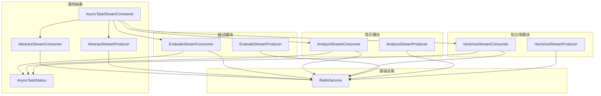
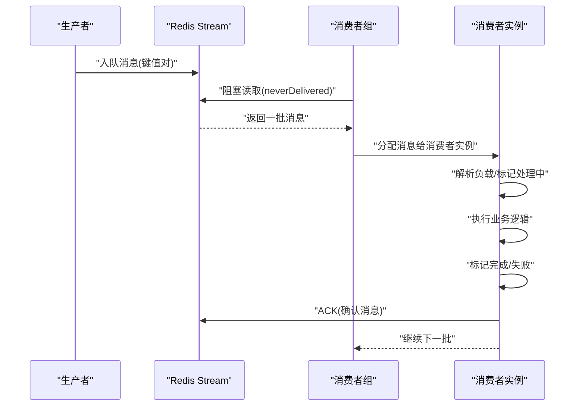
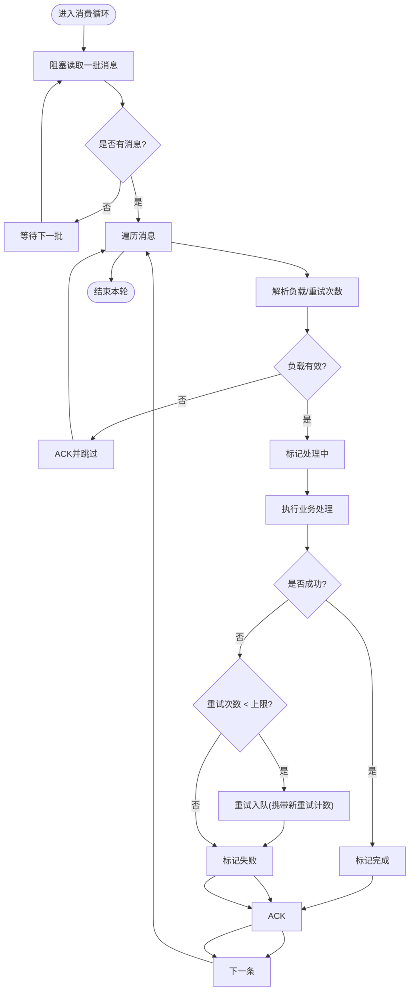
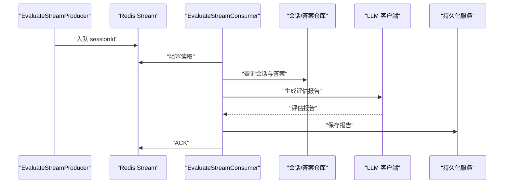
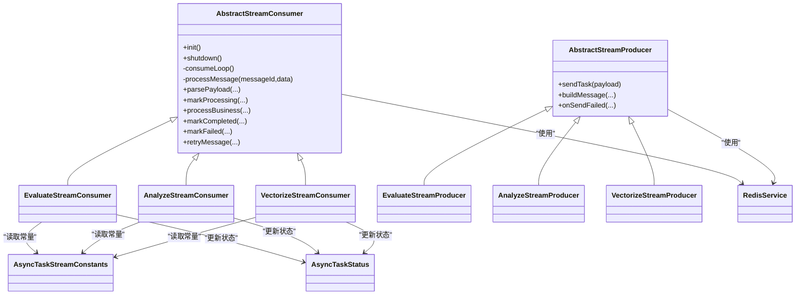

# 异步处理机制

<cite>
**本文引用的文件**
- [AbstractStreamConsumer.java](file://app/src/main/java/interview/guide/common/async/AbstractStreamConsumer.java)
- [AbstractStreamProducer.java](file://app/src/main/java/interview/guide/common/async/AbstractStreamProducer.java)
- [AsyncTaskStreamConstants.java](file://app/src/main/java/interview/guide/common/constant/AsyncTaskStreamConstants.java)
- [AsyncTaskStatus.java](file://app/src/main/java/interview/guide/common/model/AsyncTaskStatus.java)
- [RedisService.java](file://app/src/main/java/interview/guide/infrastructure/redis/RedisService.java)
- [EvaluateStreamConsumer.java](file://app/src/main/java/interview/guide/modules/interview/listener/EvaluateStreamConsumer.java)
- [AnalyzeStreamConsumer.java](file://app/src/main/java/interview/guide/modules/resume/listener/AnalyzeStreamConsumer.java)
- [VectorizeStreamConsumer.java](file://app/src/main/java/interview/guide/modules/knowledgebase/listener/VectorizeStreamConsumer.java)
- [EvaluateStreamProducer.java](file://app/src/main/java/interview/guide/modules/interview/listener/EvaluateStreamProducer.java)
- [AnalyzeStreamProducer.java](file://app/src/main/java/interview/guide/modules/resume/listener/AnalyzeStreamProducer.java)
- [VectorizeStreamProducer.java](file://app/src/main/java/interview/guide/modules/knowledgebase/listener/VectorizeStreamProducer.java)
- [application.yml](file://app/src/main/resources/application.yml)
</cite>

## 目录
1. [简介](#简介)
2. [项目结构](#项目结构)
3. [核心组件](#核心组件)
4. [架构总览](#架构总览)
5. [详细组件分析](#详细组件分析)
6. [依赖关系分析](#依赖关系分析)
7. [性能考量](#性能考量)
8. [故障排查指南](#故障排查指南)
9. [结论](#结论)

## 简介
本文件系统性阐述基于 Redis Stream 的异步处理机制，覆盖消息生产者与消费者的实现原理、消息队列配置与管理、异步监听器设计与业务逻辑、任务状态管理（进度跟踪、结果回调、错误处理）、流式数据处理（分片、并行、聚合）以及性能优化与监控策略。目标是帮助读者快速理解并安全地扩展该异步体系。

## 项目结构
围绕异步处理的关键模块分布如下：
- 通用抽象层：AbstractStreamConsumer、AbstractStreamProducer、AsyncTaskStreamConstants、AsyncTaskStatus
- Redis 封装：RedisService（Stream 消费、ACK、消息入队、消费者组创建等）
- 业务监听器：EvaluateStreamConsumer、AnalyzeStreamConsumer、VectorizeStreamConsumer
- 对应生产者：EvaluateStreamProducer、AnalyzeStreamProducer、VectorizeStreamProducer
- 配置：application.yml 中 Redisson 连接参数

图表来源
- [AbstractStreamConsumer.java:1-176](file://app/src/main/java/interview/guide/common/async/AbstractStreamConsumer.java#L1-L176)
- [AbstractStreamProducer.java:1-55](file://app/src/main/java/interview/guide/common/async/AbstractStreamProducer.java#L1-L55)
- [AsyncTaskStreamConstants.java:1-135](file://app/src/main/java/interview/guide/common/constant/AsyncTaskStreamConstants.java#L1-L135)
- [AsyncTaskStatus.java:1-13](file://app/src/main/java/interview/guide/common/model/AsyncTaskStatus.java#L1-L13)
- [RedisService.java:1-395](file://app/src/main/java/interview/guide/infrastructure/redis/RedisService.java#L1-L395)
- [EvaluateStreamConsumer.java:1-185](file://app/src/main/java/interview/guide/modules/interview/listener/EvaluateStreamConsumer.java#L1-L185)
- [AnalyzeStreamConsumer.java:1-158](file://app/src/main/java/interview/guide/modules/resume/listener/AnalyzeStreamConsumer.java#L1-L158)
- [VectorizeStreamConsumer.java:1-140](file://app/src/main/java/interview/guide/modules/knowledgebase/listener/VectorizeStreamConsumer.java#L1-L140)
- [EvaluateStreamProducer.java:1-78](file://app/src/main/java/interview/guide/modules/interview/listener/EvaluateStreamProducer.java#L1-L78)
- [AnalyzeStreamProducer.java:1-82](file://app/src/main/java/interview/guide/modules/resume/listener/AnalyzeStreamProducer.java#L1-L82)
- [VectorizeStreamProducer.java:1-82](file://app/src/main/java/interview/guide/modules/knowledgebase/listener/VectorizeStreamProducer.java#L1-L82)

章节来源
- [AbstractStreamConsumer.java:1-176](file://app/src/main/java/interview/guide/common/async/AbstractStreamConsumer.java#L1-L176)
- [AbstractStreamProducer.java:1-55](file://app/src/main/java/interview/guide/common/async/AbstractStreamProducer.java#L1-L55)
- [AsyncTaskStreamConstants.java:1-135](file://app/src/main/java/interview/guide/common/constant/AsyncTaskStreamConstants.java#L1-L135)
- [RedisService.java:1-395](file://app/src/main/java/interview/guide/infrastructure/redis/RedisService.java#L1-L395)

## 核心组件
- 抽象消费者模板：封装消费者组创建、阻塞消费循环、ACK、重试、生命周期管理，子类仅实现业务处理。
- 抽象生产者模板：统一封装消息入队、失败回调、负载字段构建。
- 常量定义：集中管理 Stream Key、消费者组名、字段名、批大小、轮询间隔、最大长度等。
- 状态模型：异步任务状态（待处理、处理中、完成、失败）。
- Redis 服务：对 Redisson Stream API 的薄封装，支持阻塞读取、ACK、消费者组创建、消息入队与长度裁剪。

章节来源
- [AbstractStreamConsumer.java:18-176](file://app/src/main/java/interview/guide/common/async/AbstractStreamConsumer.java#L18-L176)
- [AbstractStreamProducer.java:9-55](file://app/src/main/java/interview/guide/common/async/AbstractStreamProducer.java#L9-L55)
- [AsyncTaskStreamConstants.java:13-135](file://app/src/main/java/interview/guide/common/constant/AsyncTaskStreamConstants.java#L13-L135)
- [AsyncTaskStatus.java:7-12](file://app/src/main/java/interview/guide/common/model/AsyncTaskStatus.java#L7-L12)
- [RedisService.java:202-327](file://app/src/main/java/interview/guide/infrastructure/redis/RedisService.java#L202-L327)

## 架构总览
异步处理采用“生产者-消费者组-Redis Stream”的解耦架构。生产者将任务以键值对形式写入指定 Stream；消费者组内的多个消费者并发拉取消息，每条消息处理完成后显式 ACK，确保至少一次语义。消费者组保证同一条消息只被一个消费者处理，同时支持重试与失败兜底。

图表来源
- [RedisService.java:224-259](file://app/src/main/java/interview/guide/infrastructure/redis/RedisService.java#L224-L259)
- [AbstractStreamConsumer.java:74-123](file://app/src/main/java/interview/guide/common/async/AbstractStreamConsumer.java#L74-L123)
- [AsyncTaskStreamConstants.java:25-45](file://app/src/main/java/interview/guide/common/constant/AsyncTaskStreamConstants.java#L25-L45)

## 详细组件分析

### 抽象消费者模板：AbstractStreamConsumer
- 生命周期：初始化时创建消费者组，启动单线程池驱动消费循环。
- 消费循环：通过 RedisService 阻塞读取消息，按批处理，逐条 ACK。
- 重试与失败：解析重试次数，超过阈值则标记失败并可再次入队；否则记录错误并重试。
- 状态管理：调用子类钩子更新任务状态（处理中/完成/失败）。

图表来源
- [AbstractStreamConsumer.java:74-123](file://app/src/main/java/interview/guide/common/async/AbstractStreamConsumer.java#L74-L123)
- [RedisService.java:224-259](file://app/src/main/java/interview/guide/infrastructure/redis/RedisService.java#L224-L259)

章节来源
- [AbstractStreamConsumer.java:18-176](file://app/src/main/java/interview/guide/common/async/AbstractStreamConsumer.java#L18-L176)
- [RedisService.java:224-259](file://app/src/main/java/interview/guide/infrastructure/redis/RedisService.java#L224-L259)

### 抽象生产者模板：AbstractStreamProducer
- 入队：将负载序列化为键值对，写入指定 Stream，并设置最大长度自动裁剪。
- 失败回调：入队失败时触发 onSendFailed，便于持久化状态或告警。
- 负载标识：用于日志与追踪。

章节来源
- [AbstractStreamProducer.java:9-55](file://app/src/main/java/interview/guide/common/async/AbstractStreamProducer.java#L9-L55)
- [RedisService.java:277-301](file://app/src/main/java/interview/guide/infrastructure/redis/RedisService.java#L277-L301)

### 常量与状态
- 常量：统一管理各业务 Stream Key、消费者组名、字段名、批大小、轮询间隔、最大长度等。
- 状态：AsyncTaskStatus 提供统一的任务状态枚举，便于跨模块一致的状态管理。

章节来源
- [AsyncTaskStreamConstants.java:13-135](file://app/src/main/java/interview/guide/common/constant/AsyncTaskStreamConstants.java#L13-L135)
- [AsyncTaskStatus.java:7-12](file://app/src/main/java/interview/guide/common/model/AsyncTaskStatus.java#L7-L12)

### RedisService：Stream 能力封装
- 阻塞消费：使用 neverDelivered 读取未投递消息，支持超时控制，避免空轮询。
- ACK：对已处理的消息进行确认。
- 消费者组：自动创建组，忽略“组已存在”异常。
- 消息入队：支持长度裁剪，防止无限增长。

章节来源
- [RedisService.java:202-327](file://app/src/main/java/interview/guide/infrastructure/redis/RedisService.java#L202-L327)

### EvaluateStreamConsumer：面试评估监听器
- 业务职责：从会话 ID 拉取问题与答案，结合简历文本与 LLM 生成评估报告，持久化结果。
- 状态管理：处理中/完成/失败分别更新会话评估状态与错误信息。
- 重试：失败时携带重试计数重新入队，超过上限则标记失败。

图表来源
- [EvaluateStreamConsumer.java:104-134](file://app/src/main/java/interview/guide/modules/interview/listener/EvaluateStreamConsumer.java#L104-L134)
- [EvaluateStreamProducer.java:33-35](file://app/src/main/java/interview/guide/modules/interview/listener/EvaluateStreamProducer.java#L33-L35)
- [RedisService.java:224-259](file://app/src/main/java/interview/guide/infrastructure/redis/RedisService.java#L224-L259)

章节来源
- [EvaluateStreamConsumer.java:1-185](file://app/src/main/java/interview/guide/modules/interview/listener/EvaluateStreamConsumer.java#L1-L185)
- [EvaluateStreamProducer.java:1-78](file://app/src/main/java/interview/guide/modules/interview/listener/EvaluateStreamProducer.java#L1-L78)

### AnalyzeStreamConsumer：简历分析监听器
- 业务职责：接收简历 ID 与内容，调用评分服务生成分析结果并持久化。
- 并发与幂等：通过消费者组确保同一条消息仅被一个消费者处理；若简历被删除则跳过处理。
- 状态管理：处理中/完成/失败更新简历分析状态与错误信息。

章节来源
- [AnalyzeStreamConsumer.java:1-158](file://app/src/main/java/interview/guide/modules/resume/listener/AnalyzeStreamConsumer.java#L1-L158)

### VectorizeStreamConsumer：知识库向量化监听器
- 业务职责：对知识库内容执行向量化并存储。
- 状态管理：处理中/完成/失败更新知识库向量状态与错误信息。

章节来源
- [VectorizeStreamConsumer.java:1-140](file://app/src/main/java/interview/guide/modules/knowledgebase/listener/VectorizeStreamConsumer.java#L1-L140)

### EvaluateStreamProducer、AnalyzeStreamProducer、VectorizeStreamProducer
- 生产者职责：根据业务上下文构建消息负载（包含重试计数字段），入队到对应 Stream。
- 失败兜底：入队失败时调用 onSendFailed，持久化失败状态。

章节来源
- [EvaluateStreamProducer.java:1-78](file://app/src/main/java/interview/guide/modules/interview/listener/EvaluateStreamProducer.java#L1-L78)
- [AnalyzeStreamProducer.java:1-82](file://app/src/main/java/interview/guide/modules/resume/listener/AnalyzeStreamProducer.java#L1-L82)
- [VectorizeStreamProducer.java:1-82](file://app/src/main/java/interview/guide/modules/knowledgebase/listener/VectorizeStreamProducer.java#L1-L82)

## 依赖关系分析
- 模板与业务：三个监听器均继承自 AbstractStreamConsumer；三个生产者继承自 AbstractStreamProducer。
- 常量与消费者：监听器通过 AsyncTaskStreamConstants 决定使用的 Stream Key、消费者组名、字段名。
- Redis 服务：所有消费者与生产者通过 RedisService 访问 Redis Stream。
- 状态一致性：消费者在处理前后更新实体状态，确保前端或上层可观测。

图表来源
- [AbstractStreamConsumer.java:24-176](file://app/src/main/java/interview/guide/common/async/AbstractStreamConsumer.java#L24-L176)
- [AbstractStreamProducer.java:14-55](file://app/src/main/java/interview/guide/common/async/AbstractStreamProducer.java#L14-L55)
- [EvaluateStreamConsumer.java:32-56](file://app/src/main/java/interview/guide/modules/interview/listener/EvaluateStreamConsumer.java#L32-L56)
- [AnalyzeStreamConsumer.java:24-42](file://app/src/main/java/interview/guide/modules/resume/listener/AnalyzeStreamConsumer.java#L24-L42)
- [VectorizeStreamConsumer.java:21-36](file://app/src/main/java/interview/guide/modules/knowledgebase/listener/VectorizeStreamConsumer.java#L21-L36)
- [EvaluateStreamProducer.java:19-26](file://app/src/main/java/interview/guide/modules/interview/listener/EvaluateStreamProducer.java#L19-L26)
- [AnalyzeStreamProducer.java:19-28](file://app/src/main/java/interview/guide/modules/resume/listener/AnalyzeStreamProducer.java#L19-L28)
- [VectorizeStreamProducer.java:19-28](file://app/src/main/java/interview/guide/modules/knowledgebase/listener/VectorizeStreamProducer.java#L19-L28)
- [AsyncTaskStreamConstants.java:47-135](file://app/src/main/java/interview/guide/common/constant/AsyncTaskStreamConstants.java#L47-L135)
- [AsyncTaskStatus.java:7-12](file://app/src/main/java/interview/guide/common/model/AsyncTaskStatus.java#L7-L12)

## 性能考量
- 阻塞读取：RedisService 使用阻塞读取减少空轮询开销，提高吞吐。
- 批量处理：常量定义了批量大小，可在不牺牲延迟的前提下提升吞吐。
- 消费者组：确保消息只被一个消费者处理，避免重复计算。
- 自动裁剪：入队时设置最大长度，防止 Stream 无限增长导致内存压力。
- 连接池：application.yml 中配置了 Redisson 连接池大小与最小空闲连接，建议结合实际 QPS 调优。
- 重试上限：合理设置最大重试次数，避免雪崩效应。

章节来源
- [RedisService.java:224-259](file://app/src/main/java/interview/guide/infrastructure/redis/RedisService.java#L224-L259)
- [AsyncTaskStreamConstants.java:25-45](file://app/src/main/java/interview/guide/common/constant/AsyncTaskStreamConstants.java#L25-L45)
- [application.yml:86-98](file://app/src/main/resources/application.yml#L86-L98)

## 故障排查指南
- 消费者组创建失败：忽略“组已存在”异常；如出现其他异常需检查权限与网络。
- 无消息可读：阻塞读取超时属正常行为；可通过轮询间隔与批大小调整。
- ACK 失败：记录错误并继续处理，避免影响后续消息；必要时增加重试或报警。
- 重试入队失败：记录失败原因并更新状态，防止任务悬挂。
- 入队失败：onSendFailed 回调中持久化失败状态，便于人工干预。

章节来源
- [RedisService.java:261-275](file://app/src/main/java/interview/guide/infrastructure/redis/RedisService.java#L261-L275)
- [AbstractStreamConsumer.java:140-146](file://app/src/main/java/interview/guide/common/async/AbstractStreamConsumer.java#L140-L146)
- [AbstractStreamProducer.java:31-36](file://app/src/main/java/interview/guide/common/async/AbstractStreamProducer.java#L31-L36)

## 结论
该异步处理体系以 Redis Stream 为核心，通过抽象模板与常量配置实现了高内聚、低耦合的消息处理框架。监听器聚焦业务逻辑，消费者模板负责可靠性保障（ACK、重试、状态管理），生产者模板负责入队与失败兜底。配合合理的批大小、阻塞读取与自动裁剪策略，可在保证吞吐的同时维持系统稳定性。建议在生产环境中结合监控指标（队列长度、处理耗时、重试率、ACK 成功率）持续优化连接池与批处理参数。