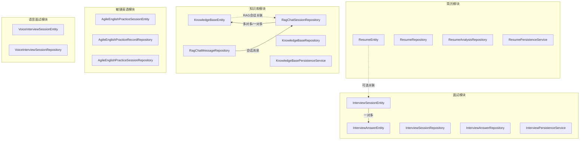
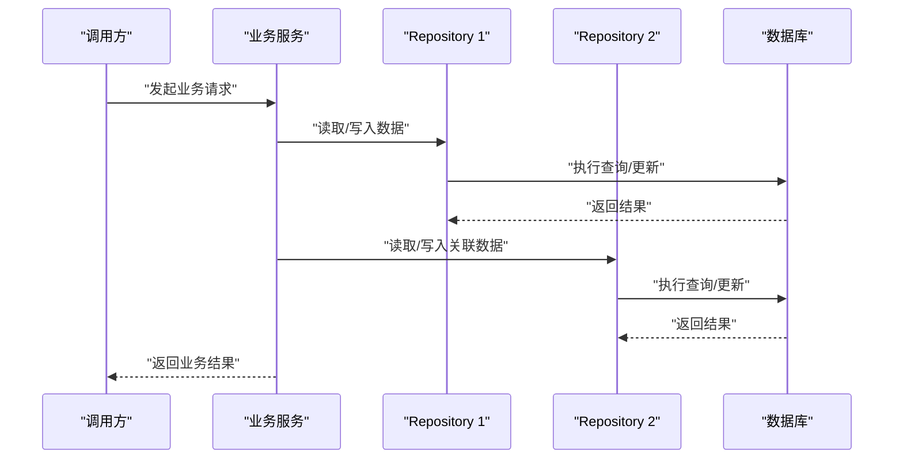
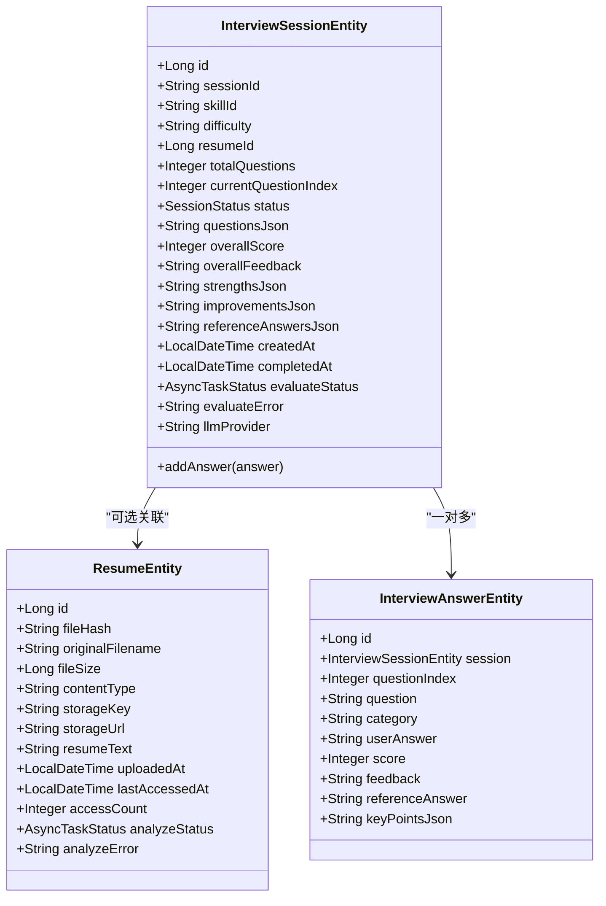
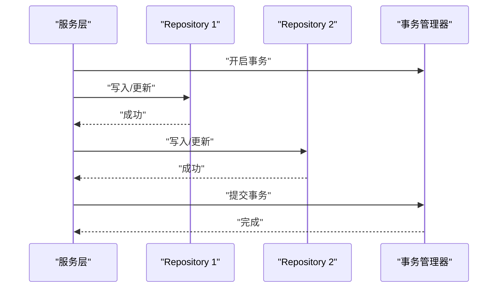
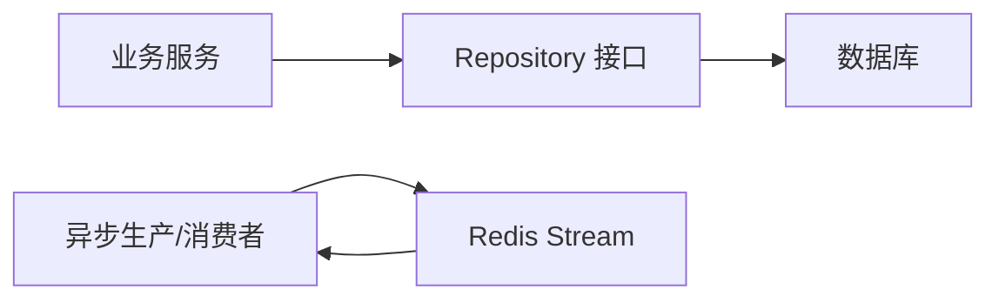

# 数据访问层

<cite>
**本文引用的文件**
- [InterviewSessionRepository.java](file://app/src/main/java/interview/guide/modules/interview/repository/InterviewSessionRepository.java)
- [ResumeRepository.java](file://app/src/main/java/interview/guide/modules/resume/repository/ResumeRepository.java)
- [KnowledgeBaseRepository.java](file://app/src/main/java/interview/guide/modules/knowledgebase/repository/KnowledgeBaseRepository.java)
- [InterviewAnswerRepository.java](file://app/src/main/java/interview/guide/modules/interview/repository/InterviewAnswerRepository.java)
- [RagChatSessionRepository.java](file://app/src/main/java/interview/guide/modules/knowledgebase/repository/RagChatSessionRepository.java)
- [RagChatMessageRepository.java](file://app/src/main/java/interview/guide/modules/knowledgebase/repository/RagChatMessageRepository.java)
- [AgileEnglishPracticeSessionRepository.java](file://app/src/main/java/interview/guide/modules/interview/repository/AgileEnglishPracticeSessionRepository.java)
- [AgileEnglishPracticeRecordRepository.java](file://app/src/main/java/interview/guide/modules/interview/repository/AgileEnglishPracticeRecordRepository.java)
- [VoiceInterviewSessionRepository.java](file://app/src/main/java/interview/guide/modules/voiceinterview/repository/VoiceInterviewSessionRepository.java)
- [InterviewSessionEntity.java](file://app/src/main/java/interview/guide/modules/interview/model/InterviewSessionEntity.java)
- [ResumeEntity.java](file://app/src/main/java/interview/guide/modules/resume/model/ResumeEntity.java)
- [KnowledgeBaseEntity.java](file://app/src/main/java/interview/guide/modules/knowledgebase/model/KnowledgeBaseEntity.java)
- [InterviewPersistenceService.java](file://app/src/main/java/interview/guide/modules/interview/service/InterviewPersistenceService.java)
- [ResumePersistenceService.java](file://app/src/main/java/interview/guide/modules/resume/service/ResumePersistenceService.java)
- [KnowledgeBasePersistenceService.java](file://app/src/main/java/interview/guide/modules/knowledgebase/service/KnowledgeBasePersistenceService.java)
- [AbstractStreamProducer.java](file://app/src/main/java/interview/guide/common/async/AbstractStreamProducer.java)
- [AbstractStreamConsumer.java](file://app/src/main/java/interview/guide/common/async/AbstractStreamConsumer.java)
</cite>

## 目录
1. [简介](#简介)
2. [项目结构](#项目结构)
3. [核心组件](#核心组件)
4. [架构总览](#架构总览)
5. [详细组件分析](#详细组件分析)
6. [依赖分析](#依赖分析)
7. [性能考虑](#性能考虑)
8. [故障排查指南](#故障排查指南)
9. [结论](#结论)
10. [附录](#附录)

## 简介
本文件系统性梳理数据访问层的设计与实现，覆盖 Spring Data JPA 的使用与配置、Repository 接口定义、查询方法命名规范、复杂查询实现、实体映射关系、事务管理策略、查询优化与性能监控、最佳实践与常见问题。重点围绕以下实体与模块：
- 实体：InterviewSessionEntity、ResumeEntity、KnowledgeBaseEntity
- Repository：InterviewSessionRepository、ResumeRepository、KnowledgeBaseRepository、InterviewAnswerRepository、RagChatSessionRepository、RagChatMessageRepository、AgileEnglishPracticeSessionRepository、AgileEnglishPracticeRecordRepository、VoiceInterviewSessionRepository
- 服务：InterviewPersistenceService、ResumePersistenceService、KnowledgeBasePersistenceService
- 异步：AbstractStreamProducer、AbstractStreamConsumer（用于事务外异步处理）

## 项目结构
数据访问层采用“按功能域分包”的组织方式，每个模块下包含：
- model：JPA 实体与映射
- repository：Spring Data JPA Repository 接口
- service：业务服务（封装事务边界与跨表操作）

图表来源
- [InterviewSessionEntity.java:14-287](file://app/src/main/java/interview/guide/modules/interview/model/InterviewSessionEntity.java#L14-L287)
- [InterviewAnswerRepository.java:14-37](file://app/src/main/java/interview/guide/modules/interview/repository/InterviewAnswerRepository.java#L14-L37)
- [InterviewPersistenceService.java:36-359](file://app/src/main/java/interview/guide/modules/interview/service/InterviewPersistenceService.java#L36-L359)
- [ResumeEntity.java:12-184](file://app/src/main/java/interview/guide/modules/resume/model/ResumeEntity.java#L12-L184)
- [ResumeRepository.java:12-25](file://app/src/main/java/interview/guide/modules/resume/repository/ResumeRepository.java#L12-L25)
- [KnowledgeBaseEntity.java:10-223](file://app/src/main/java/interview/guide/modules/knowledgebase/model/KnowledgeBaseEntity.java#L10-L223)
- [KnowledgeBaseRepository.java:17-108](file://app/src/main/java/interview/guide/modules/knowledgebase/repository/KnowledgeBaseRepository.java#L17-L108)
- [RagChatSessionRepository.java:16-54](file://app/src/main/java/interview/guide/modules/knowledgebase/repository/RagChatSessionRepository.java#L16-L54)
- [RagChatMessageRepository.java:16-50](file://app/src/main/java/interview/guide/modules/knowledgebase/repository/RagChatMessageRepository.java#L16-L50)
- [AgileEnglishPracticeSessionRepository.java:13-38](file://app/src/main/java/interview/guide/modules/interview/repository/AgileEnglishPracticeSessionRepository.java#L13-L38)
- [AgileEnglishPracticeRecordRepository.java:9-27](file://app/src/main/java/interview/guide/modules/interview/repository/AgileEnglishPracticeRecordRepository.java#L9-L27)
- [VoiceInterviewSessionRepository.java:16-46](file://app/src/main/java/interview/guide/modules/voiceinterview/repository/VoiceInterviewSessionRepository.java#L16-L46)

章节来源
- [InterviewSessionRepository.java:17-77](file://app/src/main/java/interview/guide/modules/interview/repository/InterviewSessionRepository.java#L17-L77)
- [ResumeRepository.java:12-25](file://app/src/main/java/interview/guide/modules/resume/repository/ResumeRepository.java#L12-L25)
- [KnowledgeBaseRepository.java:17-108](file://app/src/main/java/interview/guide/modules/knowledgebase/repository/KnowledgeBaseRepository.java#L17-L108)

## 核心组件
- Repository 接口：基于 Spring Data JPA，通过方法命名约定实现查询；必要时使用 @Query 编写 JPQL 或原生 SQL。
- 实体映射：使用 JPA 注解定义表结构、索引、枚举、默认值、生命周期回调等。
- 服务层事务：以 @Transactional 标注业务方法，确保跨多个 Repository 的一致性。
- 异步处理：通过 Redis Stream 进行异步任务编排，避免阻塞事务。

章节来源
- [InterviewPersistenceService.java:36-359](file://app/src/main/java/interview/guide/modules/interview/service/InterviewPersistenceService.java#L36-L359)
- [ResumePersistenceService.java:31-208](file://app/src/main/java/interview/guide/modules/resume/service/ResumePersistenceService.java#L31-L208)
- [KnowledgeBasePersistenceService.java:23-110](file://app/src/main/java/interview/guide/modules/knowledgebase/service/KnowledgeBasePersistenceService.java#L23-L110)

## 架构总览
数据访问层遵循“Repository 负责数据存取，Service 负责事务与业务编排”的分层原则。实体间通过 JPA 关系注解建模，Repository 提供丰富的查询方法，服务层在事务边界内协调多个 Repository 的读写。

图表来源
- [InterviewPersistenceService.java:36-359](file://app/src/main/java/interview/guide/modules/interview/service/InterviewPersistenceService.java#L36-L359)
- [ResumePersistenceService.java:31-208](file://app/src/main/java/interview/guide/modules/resume/service/ResumePersistenceService.java#L31-L208)
- [KnowledgeBasePersistenceService.java:23-110](file://app/src/main/java/interview/guide/modules/knowledgebase/service/KnowledgeBasePersistenceService.java#L23-L110)

## 详细组件分析

### 实体与映射关系

#### InterviewSessionEntity（面试会话）
- 表与索引：定义了多列复合索引，覆盖 resume_id+created_at、resume_id+status+created_at、skillId+created_at，提升查询性能。
- 关系：
  - 与 ResumeEntity：可选的一对多（无简历时支持通用面试）。
  - 与 InterviewAnswerEntity：一对多，级联保存与孤儿移除。
- 枚举：SessionStatus、AsyncTaskStatus。
- 生命周期：@PrePersist 初始化创建时间等字段。

图表来源
- [InterviewSessionEntity.java:14-287](file://app/src/main/java/interview/guide/modules/interview/model/InterviewSessionEntity.java#L14-L287)
- [ResumeEntity.java:12-184](file://app/src/main/java/interview/guide/modules/resume/model/ResumeEntity.java#L12-L184)

章节来源
- [InterviewSessionEntity.java:14-287](file://app/src/main/java/interview/guide/modules/interview/model/InterviewSessionEntity.java#L14-L287)

#### ResumeEntity（简历）
- 唯一约束：fileHash 唯一，用于去重。
- 统计字段：accessCount、lastAccessedAt、uploadedAt 等。
- 枚举：AsyncTaskStatus 用于异步分析状态。

章节来源
- [ResumeEntity.java:12-184](file://app/src/main/java/interview/guide/modules/resume/model/ResumeEntity.java#L12-L184)
- [ResumeRepository.java:12-25](file://app/src/main/java/interview/guide/modules/resume/repository/ResumeRepository.java#L12-L25)

#### KnowledgeBaseEntity（知识库）
- 唯一约束：fileHash 唯一，用于去重。
- 分类与向量化：category、vectorStatus、chunkCount 等。
- 访问与统计：accessCount、questionCount、lastAccessedAt 等。

章节来源
- [KnowledgeBaseEntity.java:10-223](file://app/src/main/java/interview/guide/modules/knowledgebase/model/KnowledgeBaseEntity.java#L10-L223)
- [KnowledgeBaseRepository.java:17-108](file://app/src/main/java/interview/guide/modules/knowledgebase/repository/KnowledgeBaseRepository.java#L17-L108)

### Repository 接口与查询方法命名规范

#### InterviewSessionRepository
- 方法命名示例：
  - findBySessionId：按会话ID查询
  - findByResumeIdOrderByCreatedAtDesc：按简历ID查询并按创建时间倒序
  - findTop10ByResumeIdOrderByCreatedAtDesc：最近N条
  - findFirstByResumeIdAndStatusInOrderByCreatedAtDesc：未完成会话（CREATED/IN_PROGRESS）
  - findAllByOrderByCreatedAtDesc：全量倒序
- 复杂查询：
  - @Query + LEFT JOIN FETCH：按会话ID加载关联简历
  - @Query + CONCAT + LOWER：关键词模糊搜索（不区分大小写）

章节来源
- [InterviewSessionRepository.java:17-77](file://app/src/main/java/interview/guide/modules/interview/repository/InterviewSessionRepository.java#L17-L77)

#### ResumeRepository
- findByFileHash / existsByFileHash：基于唯一哈希的去重查询

章节来源
- [ResumeRepository.java:12-25](file://app/src/main/java/interview/guide/modules/resume/repository/ResumeRepository.java#L12-L25)

#### KnowledgeBaseRepository
- 分类查询：findByCategoryOrderByUploadedAtDesc、findByCategoryIsNullOrderByUploadedAtDesc
- 搜索：@Query + LOWER(CONCAT('%', keyword, '%')) 实现名称/原始文件名模糊搜索
- 排序：按文件大小、访问次数、提问次数排序
- 批量更新：@Modifying + @Query 批量累加提问计数
- 统计：SUM/COUNT 按状态统计数量

章节来源
- [KnowledgeBaseRepository.java:17-108](file://app/src/main/java/interview/guide/modules/knowledgebase/repository/KnowledgeBaseRepository.java#L17-L108)

#### 其他 Repository
- InterviewAnswerRepository：按会话/会话ID/会话.sessionId 查询答案，并支持 upsert 场景的唯一查询
- RagChatSessionRepository：按状态、置顶与更新时间排序，按知识库ID关联查询，JOIN FETCH 知识库集合
- RagChatMessageRepository：按会话消息顺序、最后一条、计数、未完成清理、批量删除
- AgileEnglishPracticeSessionRepository：分页查询、按场景类型、按时间范围、统计聚合
- AgileEnglishPracticeRecordRepository：按轮次排序、最新一轮、按会话批量删除
- VoiceInterviewSessionRepository：按用户ID、状态、结束时间等查询

章节来源
- [InterviewAnswerRepository.java:14-37](file://app/src/main/java/interview/guide/modules/interview/repository/InterviewAnswerRepository.java#L14-L37)
- [RagChatSessionRepository.java:16-54](file://app/src/main/java/interview/guide/modules/knowledgebase/repository/RagChatSessionRepository.java#L16-L54)
- [RagChatMessageRepository.java:16-50](file://app/src/main/java/interview/guide/modules/knowledgebase/repository/RagChatMessageRepository.java#L16-L50)
- [AgileEnglishPracticeSessionRepository.java:13-38](file://app/src/main/java/interview/guide/modules/interview/repository/AgileEnglishPracticeSessionRepository.java#L13-L38)
- [AgileEnglishPracticeRecordRepository.java:9-27](file://app/src/main/java/interview/guide/modules/interview/repository/AgileEnglishPracticeRecordRepository.java#L9-L27)
- [VoiceInterviewSessionRepository.java:16-46](file://app/src/main/java/interview/guide/modules/voiceinterview/repository/VoiceInterviewSessionRepository.java#L16-L46)

### 事务管理与传播行为

- 事务注解：服务层广泛使用 @Transactional(rollbackFor = Exception.class)，确保异常时回滚。
- 传播行为：默认使用 REQUIRED，保证同一事务上下文内多次数据库操作的一致性。
- 常见场景：
  - 保存会话与答案：先保存会话，再保存答案，异常回滚
  - 删除简历：先删除分析记录，再删除简历，最后由服务层删除会话（Cascade）
  - 知识库去重：若重复则更新访问计数并返回已有记录

图表来源
- [InterviewPersistenceService.java:46-78](file://app/src/main/java/interview/guide/modules/interview/service/InterviewPersistenceService.java#L46-L78)
- [ResumePersistenceService.java:67-90](file://app/src/main/java/interview/guide/modules/resume/service/ResumePersistenceService.java#L67-L90)
- [KnowledgeBasePersistenceService.java:57-78](file://app/src/main/java/interview/guide/modules/knowledgebase/service/KnowledgeBasePersistenceService.java#L57-L78)

章节来源
- [InterviewPersistenceService.java:36-359](file://app/src/main/java/interview/guide/modules/interview/service/InterviewPersistenceService.java#L36-L359)
- [ResumePersistenceService.java:31-208](file://app/src/main/java/interview/guide/modules/resume/service/ResumePersistenceService.java#L31-L208)
- [KnowledgeBasePersistenceService.java:23-110](file://app/src/main/java/interview/guide/modules/knowledgebase/service/KnowledgeBasePersistenceService.java#L23-L110)

### 查询优化策略

- 索引设计：
  - 复合索引覆盖高频查询路径（如 resume_id+created_at、skillId+created_at），减少排序与过滤成本
- N+1 防范：
  - 使用 @Query + LEFT JOIN FETCH 在一次查询中加载关联对象
- 模糊搜索：
  - 使用 LOWER(CONCAT('%', keyword, '%')) 并结合索引列，避免函数作用在索引列上导致失效
- 批量更新：
  - 使用 @Modifying + @Query 对批量计数字段进行原子更新，降低往返次数
- 分页与排序：
  - 使用 Pageable 进行分页，避免一次性加载大量数据
- 统计与聚合：
  - 使用 SUM/COUNT 聚合查询，减少应用侧计算

章节来源
- [InterviewSessionEntity.java:15-19](file://app/src/main/java/interview/guide/modules/interview/model/InterviewSessionEntity.java#L15-L19)
- [KnowledgeBaseRepository.java:54-81](file://app/src/main/java/interview/guide/modules/knowledgebase/repository/KnowledgeBaseRepository.java#L54-L81)
- [AgileEnglishPracticeSessionRepository.java:29-36](file://app/src/main/java/interview/guide/modules/interview/repository/AgileEnglishPracticeSessionRepository.java#L29-L36)

### 复杂查询实现示例

- 加载会话及关联简历（避免 N+1）
  - 使用 @Query("SELECT s FROM InterviewSessionEntity s LEFT JOIN FETCH s.resume WHERE s.sessionId = :sessionId")
- 按知识库ID关联查询会话（去重笛卡尔积）
  - 使用 @Query("SELECT DISTINCT s FROM RagChatSessionEntity s JOIN s.knowledgeBases kb WHERE kb.id IN :kbIds ORDER BY s.updatedAt DESC")
- 批量累加提问计数
  - 使用 @Modifying + @Query("UPDATE KnowledgeBaseEntity k SET k.questionCount = k.questionCount + 1 WHERE k.id IN :ids")

章节来源
- [InterviewSessionRepository.java:28-29](file://app/src/main/java/interview/guide/modules/interview/repository/InterviewSessionRepository.java#L28-L29)
- [RagChatSessionRepository.java:38-39](file://app/src/main/java/interview/guide/modules/knowledgebase/repository/RagChatSessionRepository.java#L38-L39)
- [KnowledgeBaseRepository.java:79-81](file://app/src/main/java/interview/guide/modules/knowledgebase/repository/KnowledgeBaseRepository.java#L79-L81)

## 依赖分析
- 内聚性：各模块内部职责清晰，Repository 与 Service 分离，实体映射独立
- 耦合性：服务层通过 Repository 接口依赖，避免直接耦合具体实现
- 循环依赖：未发现循环依赖迹象
- 外部集成：Redis Stream 用于异步任务编排，与事务解耦

图表来源
- [AbstractStreamProducer.java:14-55](file://app/src/main/java/interview/guide/common/async/AbstractStreamProducer.java#L14-L55)
- [AbstractStreamConsumer.java:24-176](file://app/src/main/java/interview/guide/common/async/AbstractStreamConsumer.java#L24-L176)

章节来源
- [AbstractStreamProducer.java:14-55](file://app/src/main/java/interview/guide/common/async/AbstractStreamProducer.java#L14-L55)
- [AbstractStreamConsumer.java:24-176](file://app/src/main/java/interview/guide/common/async/AbstractStreamConsumer.java#L24-L176)

## 性能考虑
- 索引优先：为高频过滤与排序字段建立复合索引
- JOIN FETCH：在需要关联数据时使用 JOIN FETCH，避免 N+1
- 分页与限制：对大结果集使用分页与 TOP/N 限制
- 批量更新：使用 @Modifying 减少网络往返
- JSON 字段：谨慎使用 TEXT JSON 字段，避免频繁反序列化；必要时拆表或引入缓存
- 异步化：将耗时但非强一致的操作放入 Redis Stream，事务内只做关键路径

## 故障排查指南
- 事务未生效：
  - 确认 @Transactional 注解在公共可见性方法上
  - 确认异常类型被声明为 rollbackFor
- 查询性能差：
  - 检查是否命中索引；避免在索引列上使用函数
  - 使用 JOIN FETCH 替代多次查询
- 去重逻辑异常：
  - 确认 fileHash 生成与存储一致
  - 检查 existsByFileHash 与 findByFileHash 的一致性
- 异步任务堆积：
  - 检查 Redis Stream 组创建与 ACK 是否正常
  - 关注重试上限与错误日志

章节来源
- [InterviewPersistenceService.java:46-78](file://app/src/main/java/interview/guide/modules/interview/service/InterviewPersistenceService.java#L46-L78)
- [ResumePersistenceService.java:45-62](file://app/src/main/java/interview/guide/modules/resume/service/ResumePersistenceService.java#L45-L62)
- [AbstractStreamConsumer.java:95-123](file://app/src/main/java/interview/guide/common/async/AbstractStreamConsumer.java#L95-L123)

## 结论
本数据访问层以 Spring Data JPA 为核心，结合合理的实体映射、丰富的 Repository 查询方法、严格的事务管理与异步化策略，实现了高性能、可维护的数据持久化能力。建议持续完善索引、优化复杂查询、加强监控与告警，以支撑业务增长。

## 附录

### 查询方法命名规范速查
- findByXxx：按属性查询
- findByXxxAndYyy：多条件查询
- findByXxxOrderByZzzDesc：排序查询
- findTopNByXxxOrderByZzzDesc：限制数量
- existsByXxx：存在性判断
- countByXxx：计数
- @Query + JPQL/原生SQL：复杂条件与聚合

章节来源
- [InterviewSessionRepository.java:17-77](file://app/src/main/java/interview/guide/modules/interview/repository/InterviewSessionRepository.java#L17-L77)
- [KnowledgeBaseRepository.java:17-108](file://app/src/main/java/interview/guide/modules/knowledgebase/repository/KnowledgeBaseRepository.java#L17-L108)