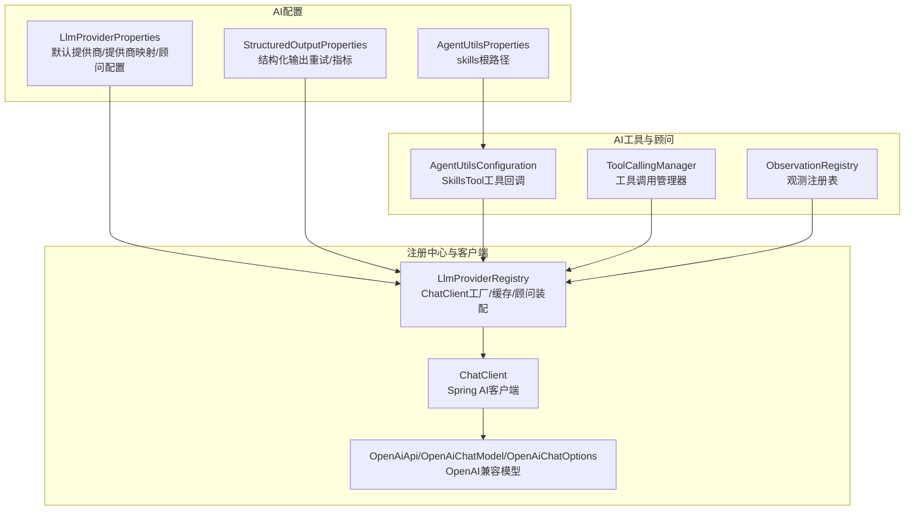
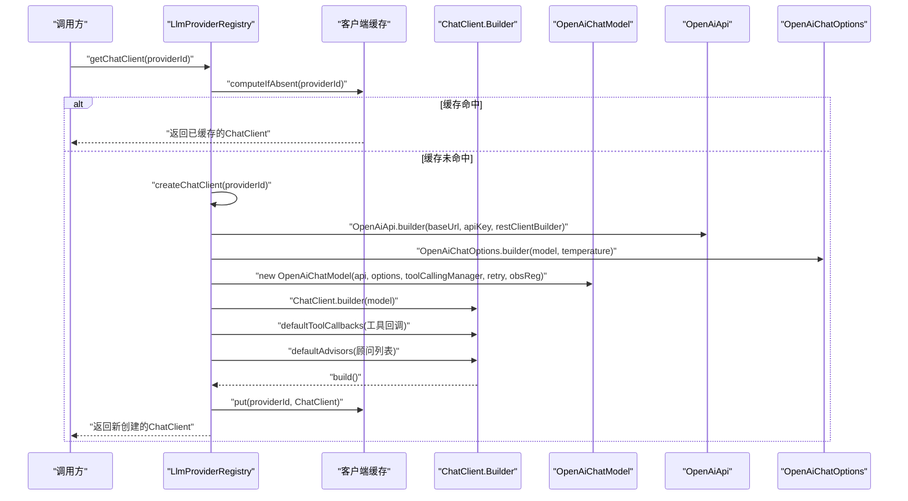
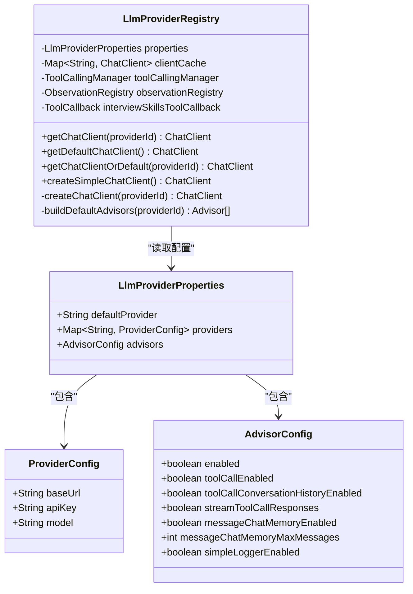
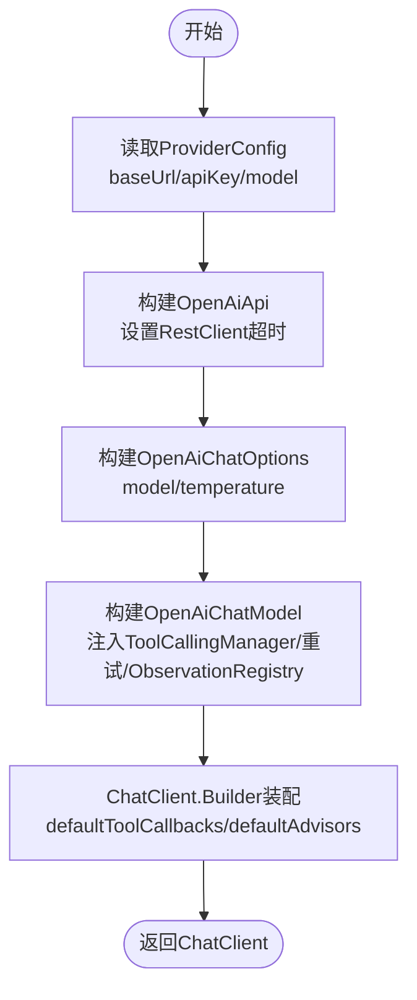
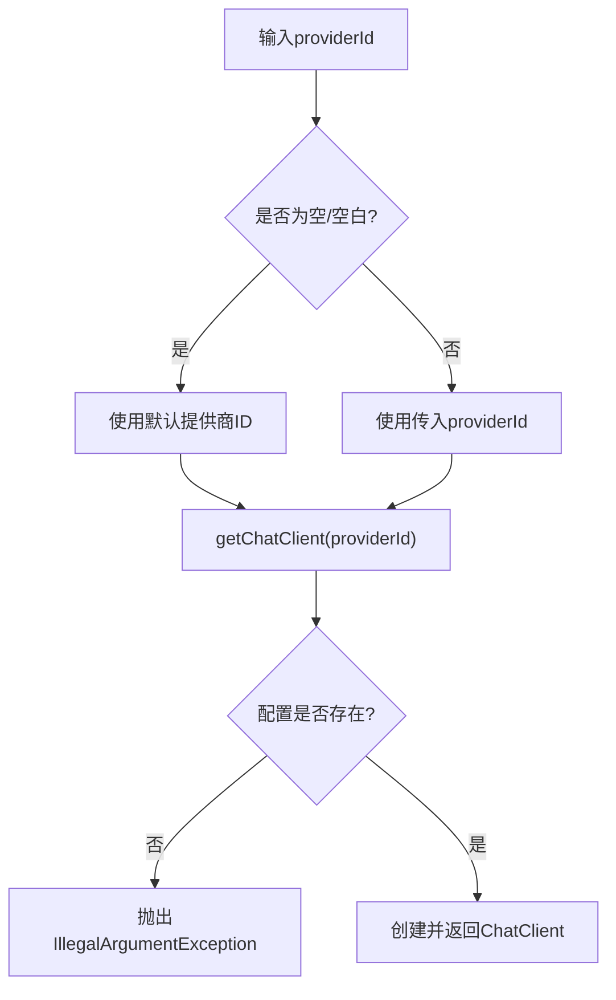
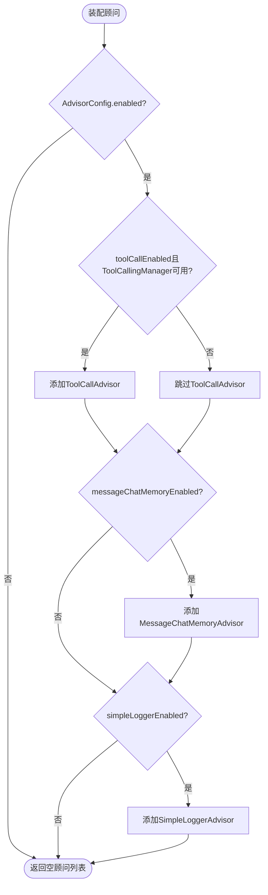
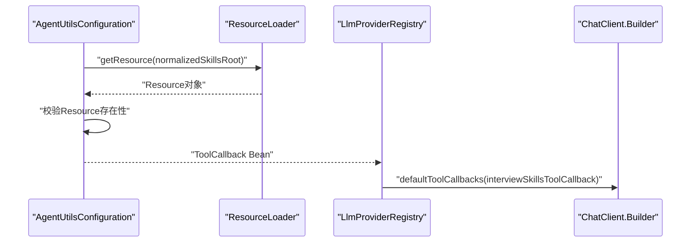
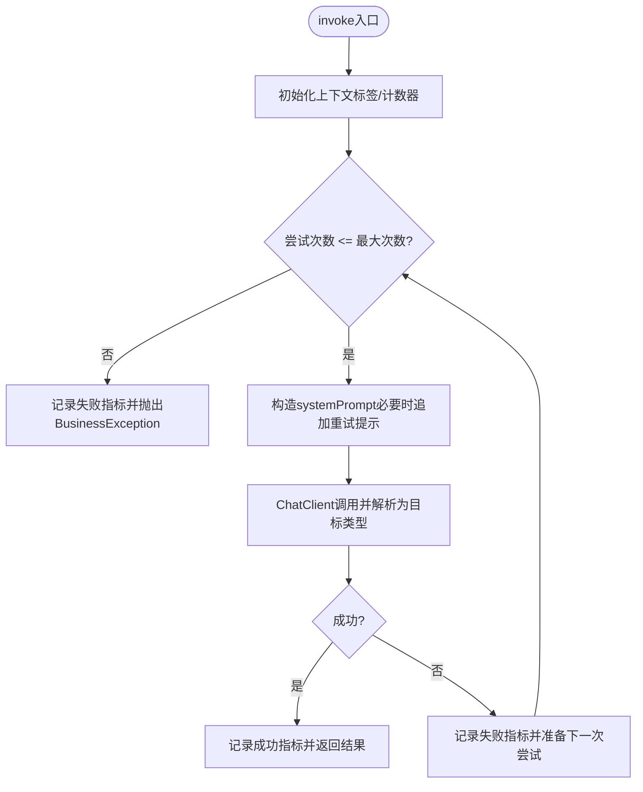
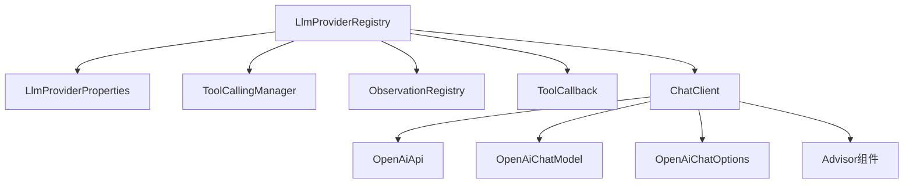

# AI提供商注册中心

<cite>
**本文档引用的文件**
- [LlmProviderRegistry.java](file://app/src/main/java/interview/guide/common/ai/LlmProviderRegistry.java)
- [AgentUtilsConfiguration.java](file://app/src/main/java/interview/guide/common/ai/AgentUtilsConfiguration.java)
- [LlmProviderProperties.java](file://app/src/main/java/interview/guide/common/config/LlmProviderProperties.java)
- [StructuredOutputInvoker.java](file://app/src/main/java/interview/guide/common/ai/StructuredOutputInvoker.java)
- [StructuredOutputProperties.java](file://app/src/main/java/interview/guide/common/ai/StructuredOutputProperties.java)
- [AgentUtilsProperties.java](file://app/src/main/java/interview/guide/common/ai/AgentUtilsProperties.java)
- [LlmProviderRegistryTest.java](file://app/src/test/java/interview/guide/common/ai/LlmProviderRegistryTest.java)
- [App.java](file://app/src/main/java/interview/guide/App.java)
- [application.yml](file://app/src/main/resources/application.yml)
</cite>

## 目录
1. [简介](#简介)
2. [项目结构](#项目结构)
3. [核心组件](#核心组件)
4. [架构总览](#架构总览)
5. [详细组件分析](#详细组件分析)
6. [依赖分析](#依赖分析)
7. [性能考虑](#性能考虑)
8. [故障排除指南](#故障排除指南)
9. [结论](#结论)
10. [附录](#附录)

## 简介
本文件系统性阐述AI提供商注册中心的设计与实现，重点覆盖以下方面：
- LlmProviderRegistry的多提供商支持机制与工厂模式
- ChatClient的动态创建流程（OpenAiApi配置、OpenAiChatOptions参数、工具调用管理器集成）
- 默认提供商获取、提供商ID验证、配置加载
- Advisor顾问系统的构建与应用（工具调用顾问、消息记忆顾问、简单日志顾问）
- 客户端缓存策略与并发安全
- 结构化输出调用封装与重试策略
- 具体配置示例与本地/云端集成场景

## 项目结构
围绕AI提供商注册中心的关键模块分布如下：
- common/ai：注册中心、工具回调配置、结构化输出封装
- common/config：配置属性定义（默认提供商、提供商列表、顾问开关）
- test：针对注册中心的单元测试，验证缓存、未知提供商异常、默认客户端获取

**图表来源**
- [LlmProviderRegistry.java:1-230](file://app/src/main/java/interview/guide/common/ai/LlmProviderRegistry.java#L1-L230)
- [LlmProviderProperties.java:1-40](file://app/src/main/java/interview/guide/common/config/LlmProviderProperties.java#L1-L40)
- [AgentUtilsConfiguration.java:1-70](file://app/src/main/java/interview/guide/common/ai/AgentUtilsConfiguration.java#L1-L70)
- [StructuredOutputProperties.java:1-19](file://app/src/main/java/interview/guide/common/ai/StructuredOutputProperties.java#L1-L19)

**章节来源**
- [LlmProviderRegistry.java:1-230](file://app/src/main/java/interview/guide/common/ai/LlmProviderRegistry.java#L1-L230)
- [LlmProviderProperties.java:1-40](file://app/src/main/java/interview/guide/common/config/LlmProviderProperties.java#L1-L40)
- [AgentUtilsConfiguration.java:1-70](file://app/src/main/java/interview/guide/common/ai/AgentUtilsConfiguration.java#L1-L70)
- [StructuredOutputProperties.java:1-19](file://app/src/main/java/interview/guide/common/ai/StructuredOutputProperties.java#L1-L19)

## 核心组件
- LlmProviderRegistry：提供者注册与ChatClient工厂，负责缓存、顾问装配、默认客户端获取
- LlmProviderProperties：应用配置绑定，包含默认提供商、提供商映射、顾问开关
- AgentUtilsConfiguration：基于spring-ai-agent-utils的工具回调装配，加载skills资源
- StructuredOutputInvoker：结构化输出调用封装，内置重试与指标采集
- StructuredOutputProperties：结构化输出相关配置

**章节来源**
- [LlmProviderRegistry.java:35-229](file://app/src/main/java/interview/guide/common/ai/LlmProviderRegistry.java#L35-L229)
- [LlmProviderProperties.java:8-39](file://app/src/main/java/interview/guide/common/config/LlmProviderProperties.java#L8-L39)
- [AgentUtilsConfiguration.java:15-69](file://app/src/main/java/interview/guide/common/ai/AgentUtilsConfiguration.java#L15-L69)
- [StructuredOutputInvoker.java:19-172](file://app/src/main/java/interview/guide/common/ai/StructuredOutputInvoker.java#L19-L172)
- [StructuredOutputProperties.java:7-19](file://app/src/main/java/interview/guide/common/ai/StructuredOutputProperties.java#L7-L19)

## 架构总览
注册中心采用“工厂+缓存+顾问装配”的架构模式，通过配置驱动动态创建ChatClient实例，支持多提供商与工具回调集成。

**图表来源**
- [LlmProviderRegistry.java:65-190](file://app/src/main/java/interview/guide/common/ai/LlmProviderRegistry.java#L65-L190)

**章节来源**
- [LlmProviderRegistry.java:65-190](file://app/src/main/java/interview/guide/common/ai/LlmProviderRegistry.java#L65-L190)

## 详细组件分析

### LlmProviderRegistry 设计与实现
- 多提供商支持：通过Map<String, ProviderConfig>维护多个提供商配置，按providerId动态创建ChatClient
- 工厂模式：createChatClient集中处理OpenAiApi、OpenAiChatOptions、OpenAiChatModel的组装
- 客户端缓存：ConcurrentHashMap按providerId缓存ChatClient，避免重复创建
- 默认提供商：getDefaultChatClient与getChatClientOrDefault提供便捷入口
- 工具回调：注入ToolCallback（来自AgentUtilsConfiguration），通过ChatClient.Builder.defaultToolCallbacks装配
- 顾问系统：buildDefaultAdvisors根据AdvisorConfig动态装配ToolCallAdvisor、MessageChatMemoryAdvisor、SimpleLoggerAdvisor
- 错误处理：未知提供商抛出IllegalArgumentException；ToolCallAdvisor在ToolCallingManager缺失时记录警告并跳过
- 超时配置：为本地模型（如LM Studio）设置较长读超时（5分钟）

**图表来源**
- [LlmProviderRegistry.java:35-229](file://app/src/main/java/interview/guide/common/ai/LlmProviderRegistry.java#L35-L229)
- [LlmProviderProperties.java:8-39](file://app/src/main/java/interview/guide/common/config/LlmProviderProperties.java#L8-L39)

**章节来源**
- [LlmProviderRegistry.java:35-229](file://app/src/main/java/interview/guide/common/ai/LlmProviderRegistry.java#L35-L229)
- [LlmProviderProperties.java:8-39](file://app/src/main/java/interview/guide/common/config/LlmProviderProperties.java#L8-L39)

### ChatClient 动态创建流程详解
- OpenAiApi配置：从ProviderConfig读取baseUrl与apiKey，结合RestClient.Builder设置连接与读超时
- OpenAiChatOptions参数：指定model与temperature（默认0.2），确保与模型兼容
- OpenAiChatModel实例化：传入OpenAiApi、OpenAiChatOptions、ToolCallingManager、重试模板、ObservationRegistry
- ChatClient.Builder装配：设置defaultToolCallbacks与defaultAdvisors
- 返回的ChatClient具备工具回调与顾问能力，可直接进行prompt调用

**图表来源**
- [LlmProviderRegistry.java:134-190](file://app/src/main/java/interview/guide/common/ai/LlmProviderRegistry.java#L134-L190)

**章节来源**
- [LlmProviderRegistry.java:134-190](file://app/src/main/java/interview/guide/common/ai/LlmProviderRegistry.java#L134-L190)

### 默认提供商获取与提供商ID验证
- 默认提供商：通过properties.getDefaultProvider()获取，默认值为"dashscope"
- 获取逻辑：getChatClientOrDefault在providerId为空或空白时回退到默认提供商
- 验证逻辑：createChatClient中若ProviderConfig不存在则抛出IllegalArgumentException

**图表来源**
- [LlmProviderRegistry.java:85-89](file://app/src/main/java/interview/guide/common/ai/LlmProviderRegistry.java#L85-L89)
- [LlmProviderRegistry.java:134-139](file://app/src/main/java/interview/guide/common/ai/LlmProviderRegistry.java#L134-L139)

**章节来源**
- [LlmProviderRegistry.java:85-89](file://app/src/main/java/interview/guide/common/ai/LlmProviderRegistry.java#L85-L89)
- [LlmProviderRegistry.java:134-139](file://app/src/main/java/interview/guide/common/ai/LlmProviderRegistry.java#L134-L139)

### 顾问系统构建与应用
- ToolCallAdvisor：当toolCallEnabled为true且ToolCallingManager可用时装配，支持会话历史与流式工具调用响应
- MessageChatMemoryAdvisor：当messageChatMemoryEnabled为true时装配，使用MessageWindowChatMemory限制最大消息数
- SimpleLoggerAdvisor：当simpleLoggerEnabled为true时装配，便于调试与审计
- 装配时机：buildDefaultAdvisors在创建ChatClient时统一装配到ChatClient.Builder

**图表来源**
- [LlmProviderRegistry.java:192-228](file://app/src/main/java/interview/guide/common/ai/LlmProviderRegistry.java#L192-L228)

**章节来源**
- [LlmProviderRegistry.java:192-228](file://app/src/main/java/interview/guide/common/ai/LlmProviderRegistry.java#L192-L228)

### 工具回调与技能工具集成
- AgentUtilsConfiguration通过@Bean("interviewSkillsToolCallback")创建ToolCallback
- 支持从classpath或自定义路径加载skills资源，规范化路径后校验存在性
- LlmProviderRegistry在构建ChatClient时将工具回调注入到ChatClient.Builder

**图表来源**
- [AgentUtilsConfiguration.java:29-44](file://app/src/main/java/interview/guide/common/ai/AgentUtilsConfiguration.java#L29-L44)
- [LlmProviderRegistry.java:179-181](file://app/src/main/java/interview/guide/common/ai/LlmProviderRegistry.java#L179-L181)

**章节来源**
- [AgentUtilsConfiguration.java:15-69](file://app/src/main/java/interview/guide/common/ai/AgentUtilsConfiguration.java#L15-L69)
- [AgentUtilsProperties.java:1-14](file://app/src/main/java/interview/guide/common/ai/AgentUtilsProperties.java#L1-L14)
- [LlmProviderRegistry.java:179-181](file://app/src/main/java/interview/guide/common/ai/LlmProviderRegistry.java#L179-L181)

### 客户端缓存策略与并发安全
- 缓存结构：ConcurrentHashMap<String, ChatClient>
- 计算逻辑：computeIfAbsent(providerId, id -> createChatClient(id))
- 并发安全：天然支持高并发访问，避免重复创建
- 测试验证：LlmProviderRegistryTest验证同一providerId多次调用返回相同实例

**章节来源**
- [LlmProviderRegistry.java:40-71](file://app/src/main/java/interview/guide/common/ai/LlmProviderRegistry.java#L40-L71)
- [LlmProviderRegistryTest.java:66-86](file://app/src/test/java/interview/guide/common/ai/LlmProviderRegistryTest.java#L66-L86)

### 结构化输出调用封装与重试策略
- StructuredOutputInvoker封装ChatClient.prompt().system().user().call().entity()调用
- 重试策略：可配置最大尝试次数、是否在重试提示中包含上次错误、是否使用修复提示、是否追加严格JSON指令
- 指标采集：可选开启，记录invocations/attempts/latency指标，标签包含上下文与状态
- 异常处理：达到最大重试次数后抛出BusinessException，携带错误码与前缀

**图表来源**
- [StructuredOutputInvoker.java:59-103](file://app/src/main/java/interview/guide/common/ai/StructuredOutputInvoker.java#L59-L103)

**章节来源**
- [StructuredOutputInvoker.java:19-172](file://app/src/main/java/interview/guide/common/ai/StructuredOutputInvoker.java#L19-L172)
- [StructuredOutputProperties.java:7-19](file://app/src/main/java/interview/guide/common/ai/StructuredOutputProperties.java#L7-L19)

## 依赖分析
- 组件耦合：LlmProviderRegistry依赖LlmProviderProperties、ToolCallingManager、ObservationRegistry、ToolCallback
- 外部依赖：Spring AI OpenAI模型栈（OpenAiApi、OpenAiChatModel、OpenAiChatOptions）、顾问组件（ToolCallAdvisor、MessageChatMemoryAdvisor、SimpleLoggerAdvisor）
- 配置依赖：application.yml中的app.ai.default-provider与各提供商配置项

**图表来源**
- [LlmProviderRegistry.java:35-229](file://app/src/main/java/interview/guide/common/ai/LlmProviderRegistry.java#L35-L229)

**章节来源**
- [LlmProviderRegistry.java:35-229](file://app/src/main/java/interview/guide/common/ai/LlmProviderRegistry.java#L35-L229)

## 性能考虑
- 客户端缓存：避免重复创建ChatClient，降低网络与序列化开销
- 超时设置：本地模型建议较长读超时（5分钟），云端API可按需调整
- 工具回调与顾问：按需启用，避免不必要的处理链路
- 指标采集：结构化输出Invoker可选开启，避免生产环境过度开销

## 故障排除指南
- 未知提供商ID：抛出IllegalArgumentException，检查app.ai.providers配置
- ToolCallingManager缺失：ToolCallAdvisor被跳过并记录警告，确认spring-ai-agent-utils依赖与配置
- skills根目录不存在：AgentUtilsConfiguration抛出IllegalStateException，检查app.ai.agent-utils.skills-root
- 默认提供商配置缺失：createSimpleChatClient抛出异常，检查默认提供商配置

**章节来源**
- [LlmProviderRegistry.java:134-139](file://app/src/main/java/interview/guide/common/ai/LlmProviderRegistry.java#L134-L139)
- [LlmProviderRegistry.java:208-210](file://app/src/main/java/interview/guide/common/ai/LlmProviderRegistry.java#L208-L210)
- [AgentUtilsConfiguration.java:35-37](file://app/src/main/java/interview/guide/common/ai/AgentUtilsConfiguration.java#L35-L37)
- [LlmProviderRegistryTest.java:88-96](file://app/src/test/java/interview/guide/common/ai/LlmProviderRegistryTest.java#L88-L96)

## 结论
AI提供商注册中心通过工厂模式与配置驱动实现了对多提供商的统一管理与动态创建，结合顾问系统与工具回调提供了灵活的扩展能力。客户端缓存与合理的超时设置提升了性能与稳定性；结构化输出封装与重试策略增强了可靠性与可观测性。配合清晰的配置项与测试保障，该体系为本地与云端模型的混合集成提供了坚实基础。

## 附录

### 配置示例与使用场景
- 默认提供商：在application.yml中设置app.ai.default-provider
- 多提供商：在app.ai.providers下为每个提供商配置baseUrl、apiKey、model
- 顾问开关：通过app.ai.advisors.*控制ToolCall/Memory/Logger顾问
- 结构化输出：通过app.ai.structured-*配置重试次数、指标与严格JSON指令

**章节来源**
- [application.yml:126-128](file://app/src/main/resources/application.yml#L126-L128)
- [LlmProviderProperties.java:12-38](file://app/src/main/java/interview/guide/common/config/LlmProviderProperties.java#L12-L38)
- [StructuredOutputProperties.java:11-18](file://app/src/main/java/interview/guide/common/ai/StructuredOutputProperties.java#L11-L18)