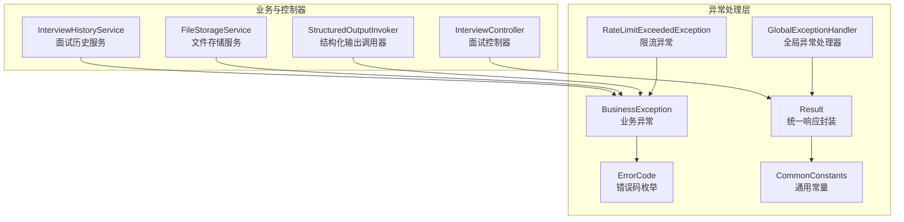
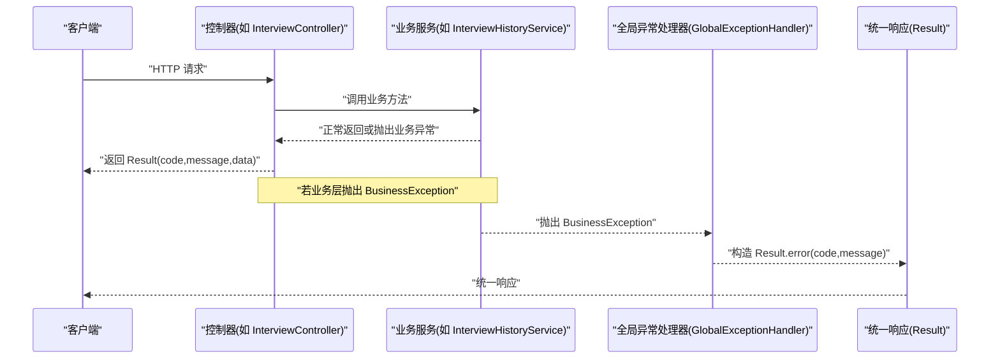
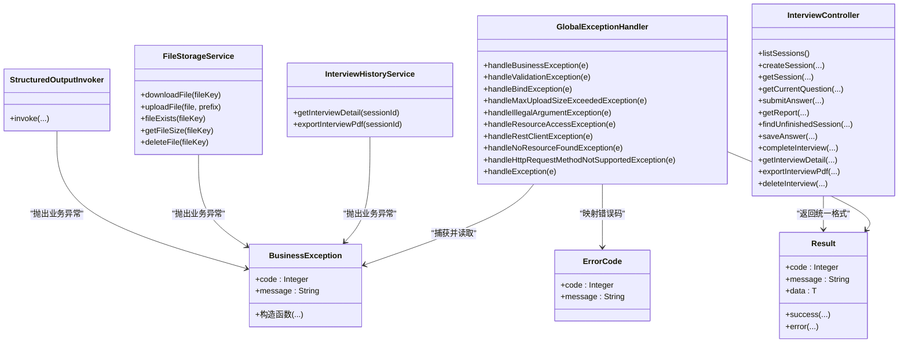
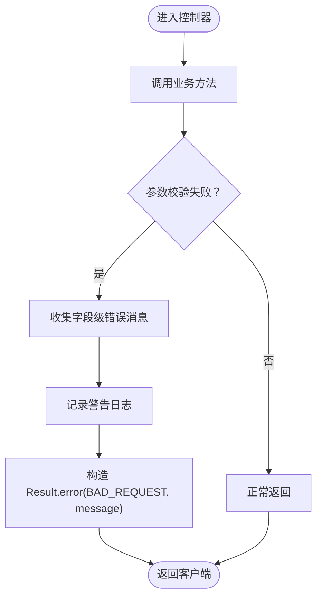
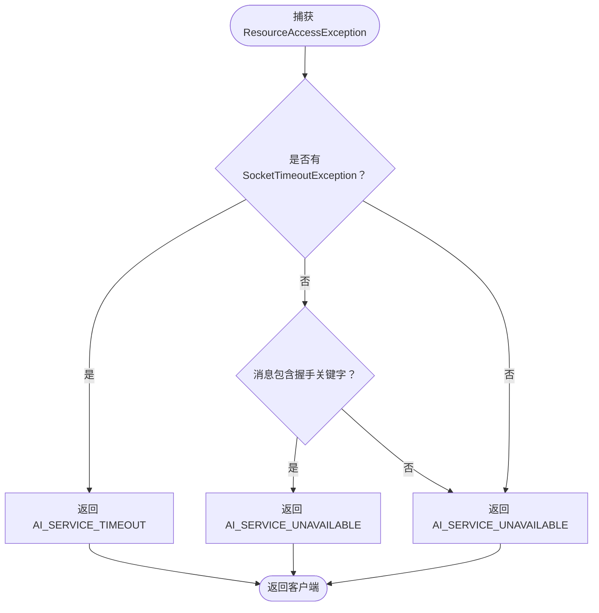
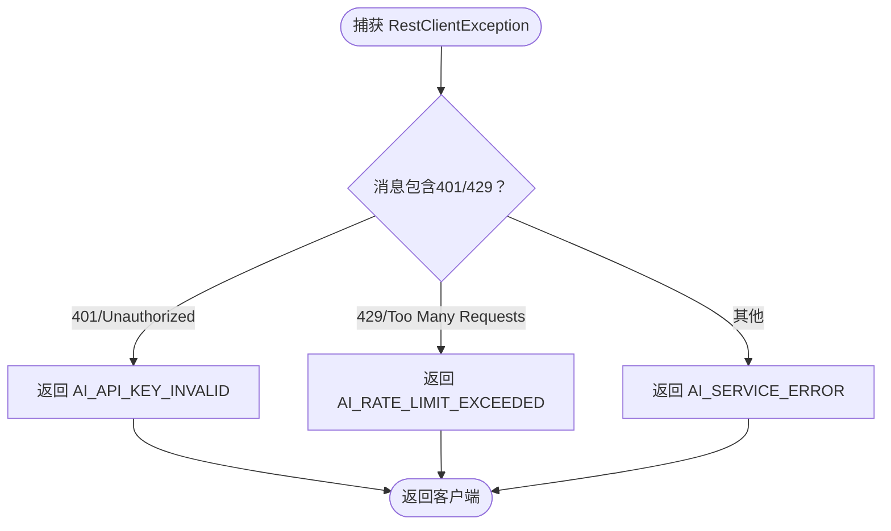

# 全局异常处理器

<cite>
**本文引用的文件**
- [GlobalExceptionHandler.java](file://app/src/main/java/interview/guide/common/exception/GlobalExceptionHandler.java)
- [BusinessException.java](file://app/src/main/java/interview/guide/common/exception/BusinessException.java)
- [ErrorCode.java](file://app/src/main/java/interview/guide/common/exception/ErrorCode.java)
- [Result.java](file://app/src/main/java/interview/guide/common/result/Result.java)
- [CommonConstants.java](file://app/src/main/java/interview/guide/common/constant/CommonConstants.java)
- [RateLimitExceededException.java](file://app/src/main/java/interview/guide/common/exception/RateLimitExceededException.java)
- [InterviewController.java](file://app/src/main/java/interview/guide/modules/interview/InterviewController.java)
- [InterviewHistoryService.java](file://app/src/main/java/interview/guide/modules/interview/service/InterviewHistoryService.java)
- [FileStorageService.java](file://app/src/main/java/interview/guide/infrastructure/file/FileStorageService.java)
- [StructuredOutputInvoker.java](file://app/src/main/java/interview/guide/common/ai/StructuredOutputInvoker.java)
</cite>

## 目录
1. [简介](#简介)
2. [项目结构](#项目结构)
3. [核心组件](#核心组件)
4. [架构总览](#架构总览)
5. [详细组件分析](#详细组件分析)
6. [依赖关系分析](#依赖关系分析)
7. [性能考量](#性能考量)
8. [故障排查指南](#故障排查指南)
9. [结论](#结论)
10. [附录](#附录)

## 简介
本文件系统性阐述“全局异常处理器”的设计与实现，重点覆盖以下方面：
- 全局异常捕获机制与统一错误响应格式
- BusinessException 业务异常类的使用方法与错误码规范
- ErrorCode 枚举的设计理念与错误码分配原则
- 不同异常类型的处理策略（参数校验、业务逻辑、系统异常、AI 服务异常等）
- 与统一响应封装 Result 的配合使用
- 国际化、日志记录、安全与最佳实践

## 项目结构
异常处理相关代码位于后端模块的公共包中，采用“全局异常 + 统一响应 + 业务异常 + 错误码”的分层设计，确保前后端交互的一致性与可维护性。

图示来源
- [GlobalExceptionHandler.java:23-160](file://app/src/main/java/interview/guide/common/exception/GlobalExceptionHandler.java#L23-L160)
- [BusinessException.java:9-49](file://app/src/main/java/interview/guide/common/exception/BusinessException.java#L9-L49)
- [ErrorCode.java:11-80](file://app/src/main/java/interview/guide/common/exception/ErrorCode.java#L11-L80)
- [Result.java:11-60](file://app/src/main/java/interview/guide/common/result/Result.java#L11-L60)
- [CommonConstants.java:13-22](file://app/src/main/java/interview/guide/common/constant/CommonConstants.java#L13-L22)
- [RateLimitExceededException.java:7-21](file://app/src/main/java/interview/guide/common/exception/RateLimitExceededException.java#L7-L21)
- [InterviewController.java:30-175](file://app/src/main/java/interview/guide/modules/interview/InterviewController.java#L30-L175)
- [InterviewHistoryService.java:40-168](file://app/src/main/java/interview/guide/modules/interview/service/InterviewHistoryService.java#L40-L168)
- [FileStorageService.java:69-175](file://app/src/main/java/interview/guide/infrastructure/file/FileStorageService.java#L69-L175)
- [StructuredOutputInvoker.java:90-103](file://app/src/main/java/interview/guide/common/ai/StructuredOutputInvoker.java#L90-L103)

章节来源
- [GlobalExceptionHandler.java:23-160](file://app/src/main/java/interview/guide/common/exception/GlobalExceptionHandler.java#L23-L160)
- [Result.java:11-60](file://app/src/main/java/interview/guide/common/result/Result.java#L11-L60)

## 核心组件
- 全局异常处理器：集中捕获各类异常，统一转化为 Result 响应，保证 HTTP 状态与业务状态分离。
- 业务异常：面向业务语义的异常类型，携带业务错误码与消息。
- 错误码枚举：标准化错误码与消息，便于前端识别与展示。
- 统一响应封装：Result 封装 code、message、data，提供 success/error 工厂方法。
- 通用常量：定义通用状态码，作为 Result 默认状态参考。
- 限流异常：继承业务异常，专门用于限流场景。

章节来源
- [BusinessException.java:9-49](file://app/src/main/java/interview/guide/common/exception/BusinessException.java#L9-L49)
- [ErrorCode.java:11-80](file://app/src/main/java/interview/guide/common/exception/ErrorCode.java#L11-L80)
- [Result.java:11-60](file://app/src/main/java/interview/guide/common/result/Result.java#L11-L60)
- [CommonConstants.java:13-22](file://app/src/main/java/interview/guide/common/constant/CommonConstants.java#L13-L22)
- [RateLimitExceededException.java:7-21](file://app/src/main/java/interview/guide/common/exception/RateLimitExceededException.java#L7-L21)

## 架构总览
全局异常处理器通过 Spring 的 @RestControllerAdvice 对控制器抛出的异常进行拦截，并根据异常类型映射到对应的错误码与消息，最终以 Result 统一响应给客户端。同时，业务层在发生业务错误时主动抛出 BusinessException，由全局处理器统一处理。

图示来源
- [InterviewController.java:39-175](file://app/src/main/java/interview/guide/modules/interview/InterviewController.java#L39-L175)
- [InterviewHistoryService.java:40-168](file://app/src/main/java/interview/guide/modules/interview/service/InterviewHistoryService.java#L40-L168)
- [GlobalExceptionHandler.java:31-36](file://app/src/main/java/interview/guide/common/exception/GlobalExceptionHandler.java#L31-L36)
- [Result.java:43-49](file://app/src/main/java/interview/guide/common/result/Result.java#L43-L49)

## 详细组件分析

### 全局异常处理器（GlobalExceptionHandler）
- 设计要点
  - 使用 @RestControllerAdvice 对控制器层异常进行统一捕获。
  - 所有异常最终以 HTTP 200 返回，业务状态由 Result.code 表达，避免状态码污染。
  - 日志记录遵循“warn/error”分级，便于运维定位。
- 异常处理策略
  - 业务异常：记录警告日志，返回对应业务错误码与消息。
  - 参数校验异常：提取字段级错误，统一返回 BAD_REQUEST。
  - 绑定异常：合并字段错误，统一返回 BAD_REQUEST。
  - 文件上传超限：统一返回 BAD_REQUEST 并提示“文件大小超过限制”。
  - 非法参数：统一返回 BAD_REQUEST。
  - AI 服务网络异常：根据 SocketTimeoutException 或握手关键字返回 AI_SERVICE_TIMEOUT 或 AI_SERVICE_UNAVAILABLE。
  - AI 服务调用异常：根据 401/429 关键字返回 AI_API_KEY_INVALID 或 AI_RATE_LIMIT_EXCEEDED。
  - 资源未找到与请求方法不支持：分别返回 NOT_FOUND 与 METHOD_NOT_ALLOWED。
  - 其他未知异常：记录错误日志，返回 INTERNAL_ERROR。
- 与 Result 的配合
  - 所有处理器均通过 Result.error(...) 构造统一响应，确保前后端契约一致。

章节来源
- [GlobalExceptionHandler.java:23-160](file://app/src/main/java/interview/guide/common/exception/GlobalExceptionHandler.java#L23-L160)
- [Result.java:43-49](file://app/src/main/java/interview/guide/common/result/Result.java#L43-L49)

### 业务异常类（BusinessException）
- 设计要点
  - 继承 RuntimeException，支持多种构造方式：基于 ErrorCode、自定义 code/message、带 cause 的异常等。
  - 通过 getter 暴露 code 与 message，便于全局处理器读取。
- 使用建议
  - 优先使用 ErrorCode 枚举，确保错误码唯一且语义明确。
  - 在业务层主动抛出，减少分支判断与分散的错误处理逻辑。
  - 对外暴露的异常尽量包含可读性强的消息，必要时保留 cause 以便追踪。

章节来源
- [BusinessException.java:9-49](file://app/src/main/java/interview/guide/common/exception/BusinessException.java#L9-L49)

### 错误码枚举（ErrorCode）
- 设计理念
  - 以模块维度划分命名空间，避免冲突；例如简历模块使用 2xxx、面试模块 3xxx、存储 4xxx 等。
  - 通用错误码集中在 1xxx 区间，便于跨模块复用。
  - AI 服务相关错误码独立于 7xxx，便于统一治理与告警。
- 分配原则
  - 每个模块的错误码起始值预留足够空间，便于后续扩展。
  - 错误码与消息成对出现，保证前后端一致性。
  - 与全局异常处理器的错误码映射保持一致，避免遗漏。

章节来源
- [ErrorCode.java:11-80](file://app/src/main/java/interview/guide/common/exception/ErrorCode.java#L11-L80)

### 统一响应封装（Result）
- 设计要点
  - 内部封装 code、message、data，提供 success/error 工厂方法。
  - 与通用常量 CommonConstants.StatusCode 协作，保证成功与常见错误状态的统一。
- 与全局异常处理器配合
  - 处理器通过 Result.error(...) 输出业务错误码与消息。
  - 控制器通过 Result.success(...) 输出业务成功数据。

章节来源
- [Result.java:11-60](file://app/src/main/java/interview/guide/common/result/Result.java#L11-L60)
- [CommonConstants.java:13-22](file://app/src/main/java/interview/guide/common/constant/CommonConstants.java#L13-L22)

### 限流异常（RateLimitExceededException）
- 设计要点
  - 继承 BusinessException，使用固定错误码 RATE_LIMIT_EXCEEDED。
  - 支持自定义消息与 cause，便于上层感知触发原因。
- 与全局异常处理器配合
  - 由全局处理器统一捕获并返回统一错误格式。

章节来源
- [RateLimitExceededException.java:7-21](file://app/src/main/java/interview/guide/common/exception/RateLimitExceededException.java#L7-L21)
- [GlobalExceptionHandler.java:154-159](file://app/src/main/java/interview/guide/common/exception/GlobalExceptionHandler.java#L154-L159)

### 与控制器的配合（以 InterviewController 为例）
- 控制器方法统一返回 Result<T>，保证响应格式一致。
- 对于导出 PDF 等可能失败的操作，捕获异常并记录日志，再抛出 BusinessException，由全局处理器统一处理。

章节来源
- [InterviewController.java:39-175](file://app/src/main/java/interview/guide/modules/interview/InterviewController.java#L39-L175)
- [InterviewHistoryService.java:150-165](file://app/src/main/java/interview/guide/modules/interview/service/InterviewHistoryService.java#L150-L165)

## 依赖关系分析
- 全局异常处理器依赖：
  - BusinessException：读取 code/message。
  - ErrorCode：映射业务错误码。
  - Result：构造统一响应。
  - 日志框架：记录 warn/error。
- 业务层依赖：
  - BusinessException/ErrorCode：抛出与标识业务错误。
  - FileStorageService/InterviewHistoryService/StructuredOutputInvoker：在各模块中抛出业务异常。
- 控制器依赖：
  - Result：统一返回响应。

图示来源
- [GlobalExceptionHandler.java:31-159](file://app/src/main/java/interview/guide/common/exception/GlobalExceptionHandler.java#L31-L159)
- [BusinessException.java:9-49](file://app/src/main/java/interview/guide/common/exception/BusinessException.java#L9-L49)
- [ErrorCode.java:11-80](file://app/src/main/java/interview/guide/common/exception/ErrorCode.java#L11-L80)
- [Result.java:11-60](file://app/src/main/java/interview/guide/common/result/Result.java#L11-L60)
- [InterviewController.java:39-175](file://app/src/main/java/interview/guide/modules/interview/InterviewController.java#L39-L175)
- [InterviewHistoryService.java:40-168](file://app/src/main/java/interview/guide/modules/interview/service/InterviewHistoryService.java#L40-L168)
- [FileStorageService.java:69-175](file://app/src/main/java/interview/guide/infrastructure/file/FileStorageService.java#L69-L175)
- [StructuredOutputInvoker.java:90-103](file://app/src/main/java/interview/guide/common/ai/StructuredOutputInvoker.java#L90-L103)

## 性能考量
- 异常处理路径尽量轻量：避免在异常处理器中执行耗时操作，将复杂逻辑前置到业务层。
- 日志级别合理：warn 用于业务异常，error 用于系统异常，避免日志风暴。
- 统一响应：减少序列化开销，提升接口稳定性。
- 限流异常：结合 RateLimit 注解与 RateLimitExceededException，降低突发流量对系统的影响。

## 故障排查指南
- 参数校验失败
  - 现象：返回 BAD_REQUEST，消息为字段级错误拼接。
  - 排查：检查请求体与字段注解，确认校验规则是否匹配。
- 文件上传超限
  - 现象：返回 BAD_REQUEST，提示“文件大小超过限制”。
  - 排查：核对 MaxUploadSizeExceededException 是否被捕获，确认前端上传大小限制。
- 非法参数
  - 现象：返回 BAD_REQUEST。
  - 排查：检查入参合法性与类型转换。
- AI 服务异常
  - 现象：根据异常类型返回 AI_SERVICE_TIMEOUT、AI_SERVICE_UNAVAILABLE、AI_API_KEY_INVALID、AI_RATE_LIMIT_EXCEEDED。
  - 排查：检查网络连通性、密钥有效性与配额使用情况。
- 资源未找到与方法不支持
  - 现象：NOT_FOUND、METHOD_NOT_ALLOWED。
  - 排查：确认路由与 HTTP 方法是否正确。
- 其他未知异常
  - 现象：INTERNAL_ERROR。
  - 排查：查看错误日志堆栈，定位具体异常位置。

章节来源
- [GlobalExceptionHandler.java:41-159](file://app/src/main/java/interview/guide/common/exception/GlobalExceptionHandler.java#L41-L159)

## 结论
通过全局异常处理器、业务异常、错误码与统一响应的协同，系统实现了“异常即业务”的设计思想：业务层专注于领域逻辑，异常层专注统一处理与响应，既保证了用户体验，也提升了系统的可观测性与可维护性。

## 附录

### 异常处理流程图（参数校验异常）

图示来源
- [GlobalExceptionHandler.java:41-62](file://app/src/main/java/interview/guide/common/exception/GlobalExceptionHandler.java#L41-L62)
- [Result.java:43-49](file://app/src/main/java/interview/guide/common/result/Result.java#L43-L49)

### 异常处理流程图（AI 服务网络异常）

图示来源
- [GlobalExceptionHandler.java:88-106](file://app/src/main/java/interview/guide/common/exception/GlobalExceptionHandler.java#L88-L106)

### 异常处理流程图（AI 服务调用异常）

图示来源
- [GlobalExceptionHandler.java:112-128](file://app/src/main/java/interview/guide/common/exception/GlobalExceptionHandler.java#L112-L128)

### 最佳实践清单
- 使用 BusinessException + ErrorCode 抛出业务错误，避免散落的错误处理。
- 控制器统一返回 Result，保持前后端契约稳定。
- 对外异常消息避免泄露敏感信息，必要时在日志中记录完整堆栈。
- 参数校验优先在控制器层完成，减少无效调用。
- 对 AI 服务异常进行分类处理，便于监控与告警。
- 限流异常与 RateLimit 注解配合，保障系统稳定性。