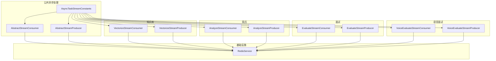
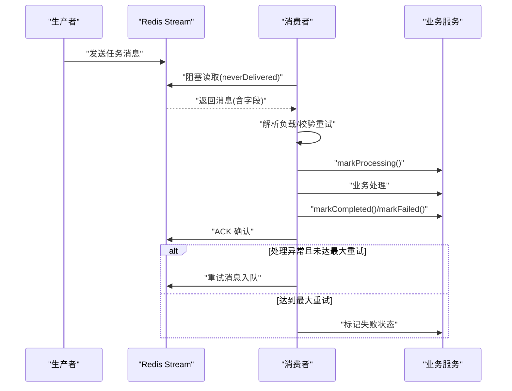
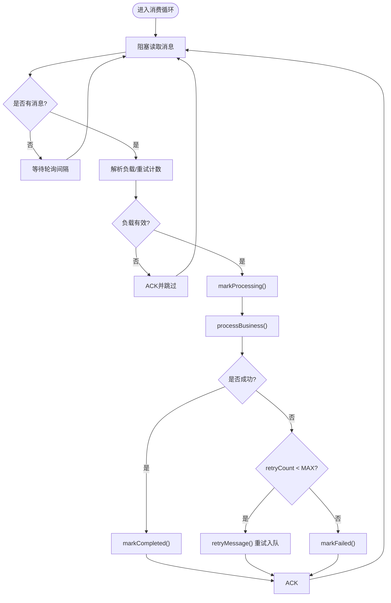
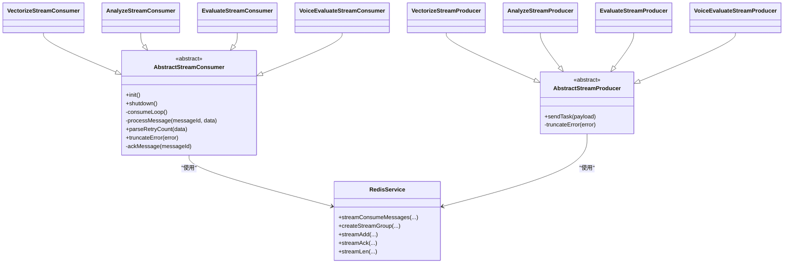
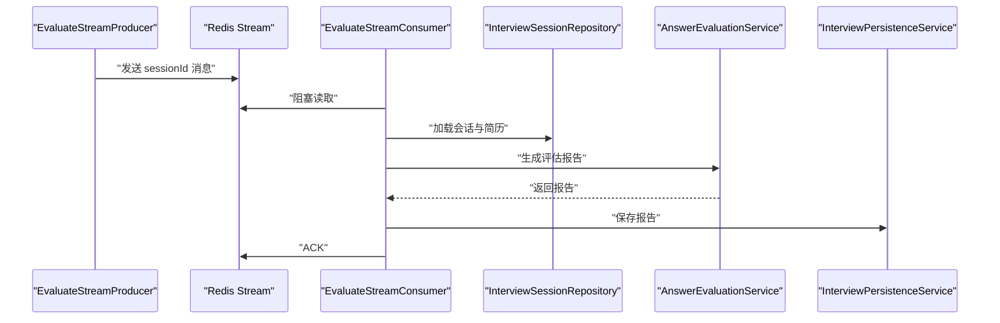

# 异步流处理机制

<cite>
**本文引用的文件**
- [AbstractStreamConsumer.java](file://app/src/main/java/interview/guide/common/async/AbstractStreamConsumer.java)
- [AbstractStreamProducer.java](file://app/src/main/java/interview/guide/common/async/AbstractStreamProducer.java)
- [AsyncTaskStreamConstants.java](file://app/src/main/java/interview/guide/common/constant/AsyncTaskStreamConstants.java)
- [RedisService.java](file://app/src/main/java/interview/guide/infrastructure/redis/RedisService.java)
- [EvaluateStreamConsumer.java](file://app/src/main/java/interview/guide/modules/interview/listener/EvaluateStreamConsumer.java)
- [EvaluateStreamProducer.java](file://app/src/main/java/interview/guide/modules/interview/listener/EvaluateStreamProducer.java)
- [VectorizeStreamConsumer.java](file://app/src/main/java/interview/guide/modules/knowledgebase/listener/VectorizeStreamConsumer.java)
- [VectorizeStreamProducer.java](file://app/src/main/java/interview/guide/modules/knowledgebase/listener/VectorizeStreamProducer.java)
- [AnalyzeStreamConsumer.java](file://app/src/main/java/interview/guide/modules/resume/listener/AnalyzeStreamConsumer.java)
- [AnalyzeStreamProducer.java](file://app/src/main/java/interview/guide/modules/resume/listener/AnalyzeStreamProducer.java)
- [VoiceEvaluateStreamConsumer.java](file://app/src/main/java/interview/guide/modules/voiceinterview/listener/VoiceEvaluateStreamConsumer.java)
- [VoiceEvaluateStreamProducer.java](file://app/src/main/java/interview/guide/modules/voiceinterview/listener/VoiceEvaluateStreamProducer.java)
- [AsyncTaskStatus.java](file://app/src/main/java/interview/guide/common/model/AsyncTaskStatus.java)
</cite>

## 目录
1. [简介](#简介)
2. [项目结构](#项目结构)
3. [核心组件](#核心组件)
4. [架构总览](#架构总览)
5. [详细组件分析](#详细组件分析)
6. [依赖关系分析](#依赖关系分析)
7. [性能考量](#性能考量)
8. [故障排查指南](#故障排查指南)
9. [结论](#结论)
10. [附录](#附录)

## 简介
本文件系统性阐述基于 Redis Stream 的异步流处理机制，围绕 AbstractStreamConsumer 与 AbstractStreamProducer 的设计与实现展开，覆盖流式数据处理、事件驱动模式、异步通信、消费者组与消息确认、重试与状态管理、错误处理等关键主题。文档同时给出知识库向量化、简历分析、面试评估、语音面试评估等真实业务场景的实现示例，并提供性能优化与监控建议。

## 项目结构
该模块位于后端应用的公共异步处理与基础设施层，采用“模板基类 + 具体业务消费者/生产者”的分层组织方式：
- 公共异步处理：抽象消费者与生产者模板
- 常量配置：统一管理各异步任务的 Stream Key、消费者组、字段与限流参数
- Redis 封装：对 Redisson 的 Stream 能力进行统一封装，提供阻塞读取、ACK、长度裁剪等能力
- 业务监听器：按功能域拆分，分别实现知识库、简历、面试、语音面试等异步任务的消费与生产

图表来源
- [AbstractStreamConsumer.java:1-176](file://app/src/main/java/interview/guide/common/async/AbstractStreamConsumer.java#L1-L176)
- [AbstractStreamProducer.java:1-55](file://app/src/main/java/interview/guide/common/async/AbstractStreamProducer.java#L1-L55)
- [AsyncTaskStreamConstants.java:1-135](file://app/src/main/java/interview/guide/common/constant/AsyncTaskStreamConstants.java#L1-L135)
- [RedisService.java:1-395](file://app/src/main/java/interview/guide/infrastructure/redis/RedisService.java#L1-L395)
- [VectorizeStreamConsumer.java:1-140](file://app/src/main/java/interview/guide/modules/knowledgebase/listener/VectorizeStreamConsumer.java#L1-L140)
- [VectorizeStreamProducer.java:1-82](file://app/src/main/java/interview/guide/modules/knowledgebase/listener/VectorizeStreamProducer.java#L1-L82)
- [AnalyzeStreamConsumer.java:1-158](file://app/src/main/java/interview/guide/modules/resume/listener/AnalyzeStreamConsumer.java#L1-L158)
- [AnalyzeStreamProducer.java:1-82](file://app/src/main/java/interview/guide/modules/resume/listener/AnalyzeStreamProducer.java#L1-L82)
- [EvaluateStreamConsumer.java:1-185](file://app/src/main/java/interview/guide/modules/interview/listener/EvaluateStreamConsumer.java#L1-L185)
- [EvaluateStreamProducer.java:1-78](file://app/src/main/java/interview/guide/modules/interview/listener/EvaluateStreamProducer.java#L1-L78)
- [VoiceEvaluateStreamConsumer.java:1-121](file://app/src/main/java/interview/guide/modules/voiceinterview/listener/VoiceEvaluateStreamConsumer.java#L1-L121)
- [VoiceEvaluateStreamProducer.java:1-62](file://app/src/main/java/interview/guide/modules/voiceinterview/listener/VoiceEvaluateStreamProducer.java#L1-L62)

章节来源
- [AbstractStreamConsumer.java:1-176](file://app/src/main/java/interview/guide/common/async/AbstractStreamConsumer.java#L1-L176)
- [AbstractStreamProducer.java:1-55](file://app/src/main/java/interview/guide/common/async/AbstractStreamProducer.java#L1-L55)
- [AsyncTaskStreamConstants.java:1-135](file://app/src/main/java/interview/guide/common/constant/AsyncTaskStreamConstants.java#L1-L135)
- [RedisService.java:1-395](file://app/src/main/java/interview/guide/infrastructure/redis/RedisService.java#L1-L395)

## 核心组件
- 抽象消费者模板：负责生命周期管理、消费者组创建、阻塞消费循环、消息解析、状态标记、重试与 ACK 确认、错误截断与记录
- 抽象生产者模板：负责消息构建、发送、失败回调、错误截断
- Redis 封装：提供阻塞读取、消费者组创建、消息 ACK、长度裁剪、统计查询等能力
- 业务监听器：按领域拆分的具体实现，负责业务数据解析、调用领域服务、持久化状态、重试入队

章节来源
- [AbstractStreamConsumer.java:18-176](file://app/src/main/java/interview/guide/common/async/AbstractStreamConsumer.java#L18-L176)
- [AbstractStreamProducer.java:9-55](file://app/src/main/java/interview/guide/common/async/AbstractStreamProducer.java#L9-L55)
- [RedisService.java:202-327](file://app/src/main/java/interview/guide/infrastructure/redis/RedisService.java#L202-L327)

## 架构总览
整体采用事件驱动与异步解耦的架构：生产者将任务以消息形式写入 Redis Stream；消费者组内的多个消费者并发拉取消息并处理；处理完成后通过 ACK 确认消息，确保至少一次语义；失败时根据最大重试次数进行重试入队，最终失败则标记失败状态。

图表来源
- [AbstractStreamConsumer.java:74-123](file://app/src/main/java/interview/guide/common/async/AbstractStreamConsumer.java#L74-L123)
- [RedisService.java:224-259](file://app/src/main/java/interview/guide/infrastructure/redis/RedisService.java#L224-L259)

## 详细组件分析

### 抽象消费者模板：AbstractStreamConsumer
- 生命周期与线程模型：初始化阶段生成消费者名称、创建消费者组、启动单线程池的消费循环；销毁时优雅关闭
- 消费循环：基于 Redis 阻塞读取，按批次与轮询间隔持续拉取消息；异常捕获与中断检测
- 消息处理流程：解析负载、标记处理中、执行业务、标记完成/失败、ACK；异常时根据重试计数决定重试入队或最终失败
- 状态管理：通过抽象方法在处理前后与失败时更新持久化状态，保证可观测性
- 错误处理：统一错误截断，避免日志膨胀；ACK 失败单独记录

图表来源
- [AbstractStreamConsumer.java:74-123](file://app/src/main/java/interview/guide/common/async/AbstractStreamConsumer.java#L74-L123)

章节来源
- [AbstractStreamConsumer.java:35-93](file://app/src/main/java/interview/guide/common/async/AbstractStreamConsumer.java#L35-L93)
- [AbstractStreamConsumer.java:95-123](file://app/src/main/java/interview/guide/common/async/AbstractStreamConsumer.java#L95-L123)

### 抽象生产者模板：AbstractStreamProducer
- 消息构建：由子类实现消息字段映射，包含重试计数与业务标识字段
- 发送与失败回调：发送成功记录消息 ID；失败时触发 onSendFailed 回调，便于落库或告警
- 错误截断：统一截断错误信息长度，避免冗长日志

章节来源
- [AbstractStreamProducer.java:22-36](file://app/src/main/java/interview/guide/common/async/AbstractStreamProducer.java#L22-L36)
- [AbstractStreamProducer.java:38-53](file://app/src/main/java/interview/guide/common/async/AbstractStreamProducer.java#L38-L53)

### Redis 封装：RedisService
- 阻塞消费：使用 Redisson 的 neverDelivered 读取策略与 timeout 控制，减少空轮询
- 消费者组：创建组时忽略“组已存在”异常，保证幂等
- 消息 ACK：批量确认，确保处理完成才移除
- 长度裁剪：支持按 maxLen 自动裁剪旧消息，控制内存占用
- 其他工具：提供键值、Hash、分布式锁、原子计数、列表等常用能力

章节来源
- [RedisService.java:224-259](file://app/src/main/java/interview/guide/infrastructure/redis/RedisService.java#L224-L259)
- [RedisService.java:264-275](file://app/src/main/java/interview/guide/infrastructure/redis/RedisService.java#L264-L275)
- [RedisService.java:316-319](file://app/src/main/java/interview/guide/infrastructure/redis/RedisService.java#L316-L319)
- [RedisService.java:292-301](file://app/src/main/java/interview/guide/infrastructure/redis/RedisService.java#L292-L301)

### 常量配置：AsyncTaskStreamConstants
- 通用字段：重试次数、内容、业务标识字段
- 通用参数：最大重试次数、批次大小、轮询间隔、Stream 最大长度
- 各任务域配置：知识库向量化、简历分析、面试评估、语音面试评估的 Stream Key、消费者组名、消费者名前缀与业务字段键

章节来源
- [AsyncTaskStreamConstants.java:13-46](file://app/src/main/java/interview/guide/common/constant/AsyncTaskStreamConstants.java#L13-L46)
- [AsyncTaskStreamConstants.java:47-134](file://app/src/main/java/interview/guide/common/constant/AsyncTaskStreamConstants.java#L47-L134)

### 知识库向量化：VectorizeStreamConsumer / VectorizeStreamProducer
- 消费者：解析 kbId 与 content，调用向量化服务存储；失败时更新状态并可重试入队
- 生产者：构建包含 kbId、content、retryCount 的消息；发送失败时更新状态

章节来源
- [VectorizeStreamConsumer.java:64-121](file://app/src/main/java/interview/guide/modules/knowledgebase/listener/VectorizeStreamConsumer.java#L64-L121)
- [VectorizeStreamProducer.java:51-67](file://app/src/main/java/interview/guide/modules/knowledgebase/listener/VectorizeStreamProducer.java#L51-L67)

### 简历分析：AnalyzeStreamConsumer / AnalyzeStreamProducer
- 消费者：解析 resumeId 与 content，调用评分与持久化服务；删除或不存在时跳过
- 生产者：构建包含 resumeId、content、retryCount 的消息；发送失败时更新状态

章节来源
- [AnalyzeStreamConsumer.java:70-139](file://app/src/main/java/interview/guide/modules/resume/listener/AnalyzeStreamConsumer.java#L70-L139)
- [AnalyzeStreamProducer.java:51-79](file://app/src/main/java/interview/guide/modules/resume/listener/AnalyzeStreamProducer.java#L51-L79)

### 面试评估：EvaluateStreamConsumer / EvaluateStreamProducer
- 消费者：加载会话、问题与答案，调用 LLM 生成报告并持久化；更新评估状态
- 生产者：构建包含 sessionId、retryCount 的消息；发送失败时更新状态

章节来源
- [EvaluateStreamConsumer.java:84-166](file://app/src/main/java/interview/guide/modules/interview/listener/EvaluateStreamConsumer.java#L84-L166)
- [EvaluateStreamProducer.java:48-76](file://app/src/main/java/interview/guide/modules/interview/listener/EvaluateStreamProducer.java#L48-L76)

### 语音面试评估：VoiceEvaluateStreamConsumer / VoiceEvaluateStreamProducer
- 消费者：解析 voiceSessionId，调用评估服务生成评估；更新评估状态
- 生产者：构建包含 voiceSessionId、retryCount 的消息；发送失败时更新状态

章节来源
- [VoiceEvaluateStreamConsumer.java:61-119](file://app/src/main/java/interview/guide/modules/voiceinterview/listener/VoiceEvaluateStreamConsumer.java#L61-L119)
- [VoiceEvaluateStreamProducer.java:44-60](file://app/src/main/java/interview/guide/modules/voiceinterview/listener/VoiceEvaluateStreamProducer.java#L44-L60)

## 依赖关系分析
- 抽象模板依赖 RedisService 进行底层通信
- 业务监听器依赖各自领域的仓储与服务，完成业务处理
- 常量配置贯穿模板与监听器，统一命名与参数

图表来源
- [AbstractStreamConsumer.java:24-176](file://app/src/main/java/interview/guide/common/async/AbstractStreamConsumer.java#L24-L176)
- [AbstractStreamProducer.java:14-55](file://app/src/main/java/interview/guide/common/async/AbstractStreamProducer.java#L14-L55)
- [RedisService.java:224-319](file://app/src/main/java/interview/guide/infrastructure/redis/RedisService.java#L224-L319)
- [VectorizeStreamConsumer.java:32-34](file://app/src/main/java/interview/guide/modules/knowledgebase/listener/VectorizeStreamConsumer.java#L32-L34)
- [VectorizeStreamProducer.java:19-28](file://app/src/main/java/interview/guide/modules/knowledgebase/listener/VectorizeStreamProducer.java#L19-L28)
- [AnalyzeStreamConsumer.java:24-40](file://app/src/main/java/interview/guide/modules/resume/listener/AnalyzeStreamConsumer.java#L24-L40)
- [AnalyzeStreamProducer.java:19-28](file://app/src/main/java/interview/guide/modules/resume/listener/AnalyzeStreamProducer.java#L19-L28)
- [EvaluateStreamConsumer.java:32-54](file://app/src/main/java/interview/guide/modules/interview/listener/EvaluateStreamConsumer.java#L32-L54)
- [EvaluateStreamProducer.java:19-26](file://app/src/main/java/interview/guide/modules/interview/listener/EvaluateStreamProducer.java#L19-L26)
- [VoiceEvaluateStreamConsumer.java:20-31](file://app/src/main/java/interview/guide/modules/voiceinterview/listener/VoiceEvaluateStreamConsumer.java#L20-L31)
- [VoiceEvaluateStreamProducer.java:19-27](file://app/src/main/java/interview/guide/modules/voiceinterview/listener/VoiceEvaluateStreamProducer.java#L19-L27)

## 性能考量
- 阻塞读取与批处理：使用 Redis 阻塞读取与固定批次大小，降低空轮询开销，提升吞吐
- 轮询间隔与重试：合理设置轮询间隔与最大重试次数，避免过度竞争与堆积
- Stream 长度裁剪：启用 maxLen 自动裁剪，控制内存占用与查询性能
- 单线程消费循环：简化并发复杂度，避免多线程竞争；如需更高吞吐，可在消费者组内横向扩展消费者实例
- 日志与错误截断：统一错误截断，避免日志过大影响性能
- 状态持久化：在处理前后与失败时更新状态，便于快速定位问题与恢复

[本节为通用性能建议，不直接分析具体文件]

## 故障排查指南
- 消费者组未创建：检查初始化阶段是否成功创建消费者组；若报错“组已存在”，属预期行为
- 无消息或长时间无响应：确认生产者是否正确发送消息；检查轮询间隔与阻塞参数
- 消息重复或丢失：核对 ACK 是否正常；检查重试入队逻辑与最大重试次数
- 处理失败频繁：查看失败状态更新与错误日志；评估上游输入合法性与业务服务稳定性
- 状态不同步：确认 markProcessing/markCompleted/markFailed 的调用顺序与异常分支

章节来源
- [AbstractStreamConsumer.java:40-44](file://app/src/main/java/interview/guide/common/async/AbstractStreamConsumer.java#L40-L44)
- [AbstractStreamConsumer.java:140-146](file://app/src/main/java/interview/guide/common/async/AbstractStreamConsumer.java#L140-L146)
- [RedisService.java:244-248](file://app/src/main/java/interview/guide/infrastructure/redis/RedisService.java#L244-L248)

## 结论
该异步流处理机制通过抽象模板与 Redis Stream 实现了解耦、可靠与可扩展的异步任务编排。模板层统一了生命周期、重试、ACK 与状态管理，业务监听器聚焦领域逻辑，常量配置保障一致性。结合阻塞读取、长度裁剪与合理的重试策略，可在高并发场景下保持稳定与高性能。

[本节为总结性内容，不直接分析具体文件]

## 附录

### 使用示例与最佳实践
- 实现自定义消费者
  - 继承抽象消费者模板，实现任务显示名、Stream Key、消费者组名、消费者名前缀、线程名、负载解析、标识、状态标记、业务处理、完成/失败处理与重试入队
  - 在业务服务中完成实际处理逻辑，并在必要时持久化状态
  - 参考路径：[EvaluateStreamConsumer.java:58-166](file://app/src/main/java/interview/guide/modules/interview/listener/EvaluateStreamConsumer.java#L58-L166)
- 实现自定义生产者
  - 继承抽象生产者模板，实现任务显示名、Stream Key、消息构建与发送失败回调
  - 在业务入口调用 sendTask 触发异步处理
  - 参考路径：[EvaluateStreamProducer.java:33-63](file://app/src/main/java/interview/guide/modules/interview/listener/EvaluateStreamProducer.java#L33-L63)
- 流式 AI 输出与实时更新
  - 对于需要逐步输出的场景，可在业务处理中分片写入结果并配合前端 SSE/WS 推送增量
  - 本仓库中语音面试模块提供 WebSocket 推送字幕与控制消息的参考实现，可借鉴其消息结构与推送策略
  - 参考路径：[VoiceEvaluateStreamConsumer.java:82-84](file://app/src/main/java/interview/guide/modules/voiceinterview/listener/VoiceEvaluateStreamConsumer.java#L82-L84)

### 关键流程图：面试评估任务

图表来源
- [EvaluateStreamProducer.java:33-53](file://app/src/main/java/interview/guide/modules/interview/listener/EvaluateStreamProducer.java#L33-L53)
- [EvaluateStreamConsumer.java:104-134](file://app/src/main/java/interview/guide/modules/interview/listener/EvaluateStreamConsumer.java#L104-L134)