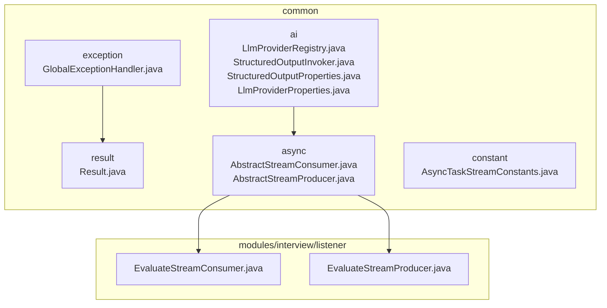
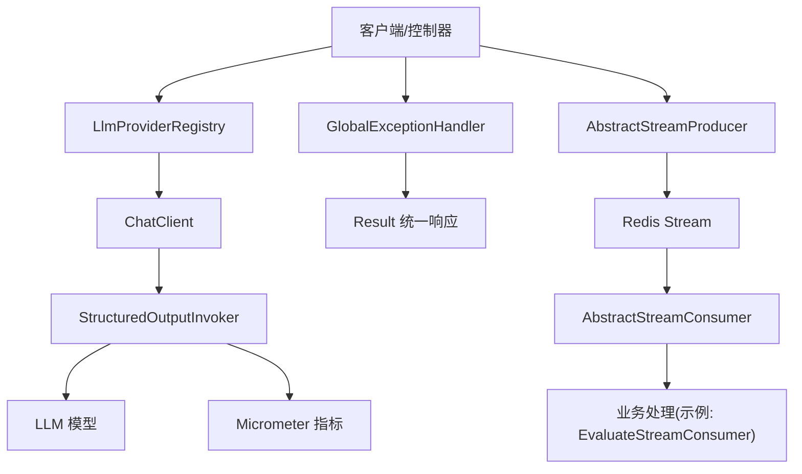
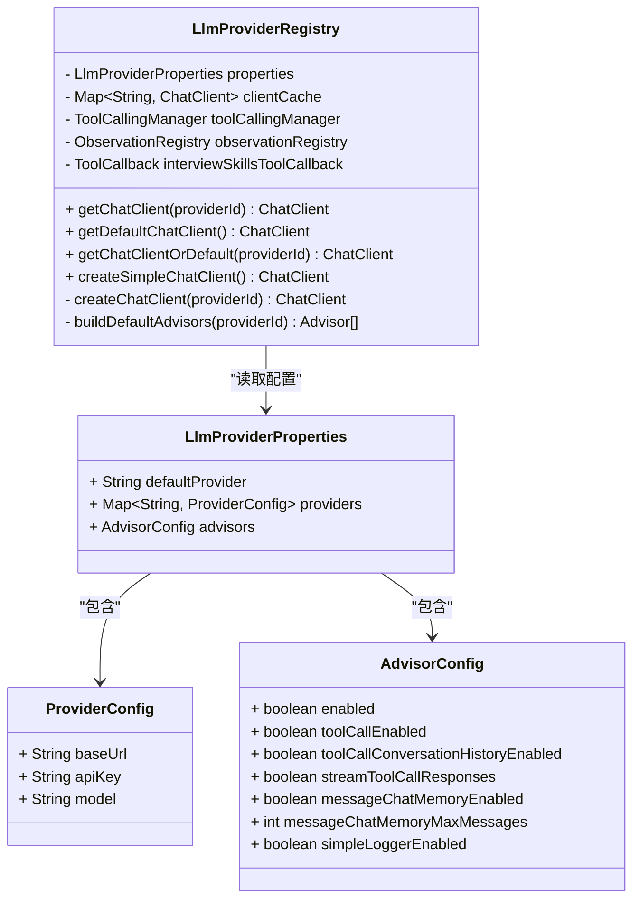
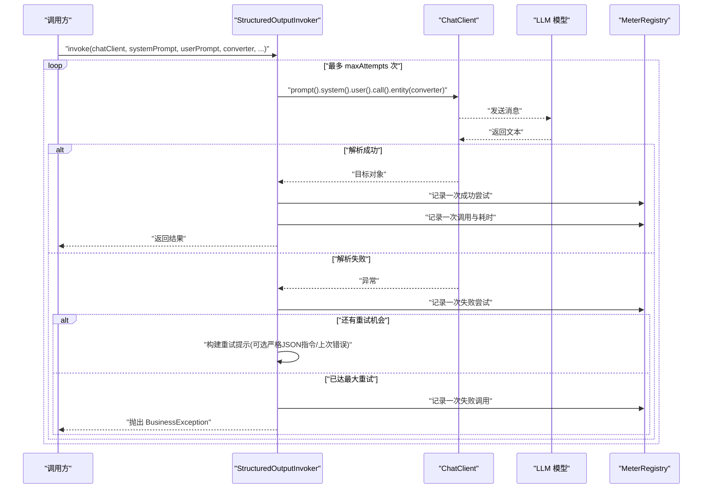
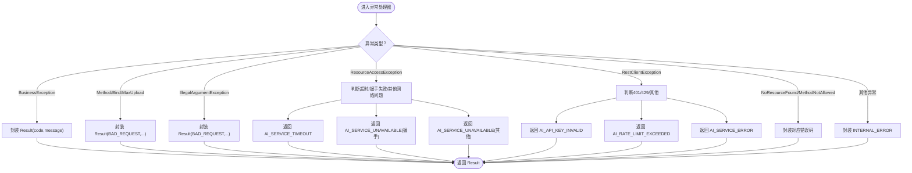
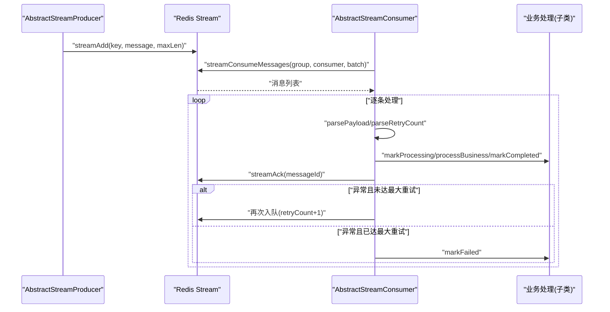
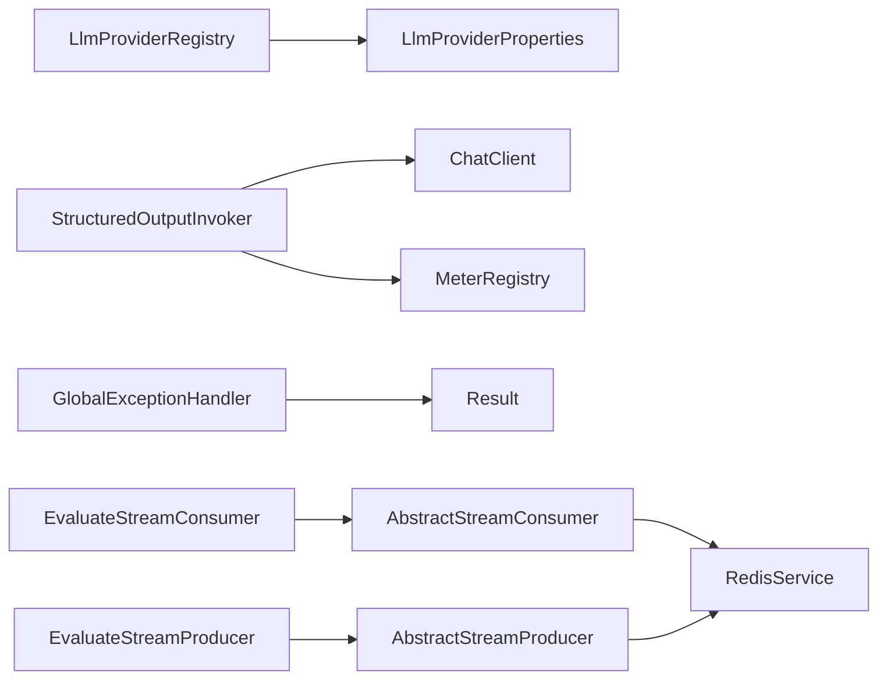

# 核心模块详解

<cite>
**本文引用的文件**
- [LlmProviderRegistry.java](file://app/src/main/java/interview/guide/common/ai/LlmProviderRegistry.java)
- [StructuredOutputInvoker.java](file://app/src/main/java/interview/guide/common/ai/StructuredOutputInvoker.java)
- [StructuredOutputProperties.java](file://app/src/main/java/interview/guide/common/ai/StructuredOutputProperties.java)
- [LlmProviderProperties.java](file://app/src/main/java/interview/guide/common/config/LlmProviderProperties.java)
- [GlobalExceptionHandler.java](file://app/src/main/java/interview/guide/common/exception/GlobalExceptionHandler.java)
- [Result.java](file://app/src/main/java/interview/guide/common/result/Result.java)
- [AbstractStreamConsumer.java](file://app/src/main/java/interview/guide/common/async/AbstractStreamConsumer.java)
- [AbstractStreamProducer.java](file://app/src/main/java/interview/guide/common/async/AbstractStreamProducer.java)
- [AsyncTaskStreamConstants.java](file://app/src/main/java/interview/guide/common/constant/AsyncTaskStreamConstants.java)
- [EvaluateStreamConsumer.java](file://app/src/main/java/interview/guide/modules/interview/listener/EvaluateStreamConsumer.java)
- [EvaluateStreamProducer.java](file://app/src/main/java/interview/guide/modules/interview/listener/EvaluateStreamProducer.java)
</cite>

## 目录
1. [简介](#简介)
2. [项目结构](#项目结构)
3. [核心组件](#核心组件)
4. [架构总览](#架构总览)
5. [详细组件分析](#详细组件分析)
6. [依赖分析](#依赖分析)
7. [性能考虑](#性能考虑)
8. [故障排查指南](#故障排查指南)
9. [结论](#结论)

## 简介
本文件聚焦“核心模块”的设计与实现，围绕以下主题展开：
- AI 提供商注册中心 LlmProviderRegistry 的多提供商支持、工厂模式与动态配置管理
- 结构化输出调用器 StructuredOutputInvoker 的参数控制、输出格式化与错误处理
- 全局异常处理器 GlobalExceptionHandler 的异常捕获机制与统一错误响应格式
- Result 统一响应封装的设计理念与使用方法
- 异步流处理机制：AbstractStreamConsumer 与 AbstractStreamProducer 的实现原理与使用场景

## 项目结构
核心模块位于后端应用的 common 子包中，包含 AI 集成、异常处理、统一响应与异步流处理四大领域；同时在 modules 下提供具体的业务监听器示例（如面试评估任务的生产者/消费者）。

图示来源
- [LlmProviderRegistry.java:1-230](file://app/src/main/java/interview/guide/common/ai/LlmProviderRegistry.java#L1-L230)
- [StructuredOutputInvoker.java:1-172](file://app/src/main/java/interview/guide/common/ai/StructuredOutputInvoker.java#L1-L172)
- [GlobalExceptionHandler.java:1-161](file://app/src/main/java/interview/guide/common/exception/GlobalExceptionHandler.java#L1-L161)
- [Result.java:1-61](file://app/src/main/java/interview/guide/common/result/Result.java#L1-L61)
- [AbstractStreamConsumer.java:1-176](file://app/src/main/java/interview/guide/common/async/AbstractStreamConsumer.java#L1-L176)
- [AbstractStreamProducer.java:1-55](file://app/src/main/java/interview/guide/common/async/AbstractStreamProducer.java#L1-L55)
- [AsyncTaskStreamConstants.java:1-135](file://app/src/main/java/interview/guide/common/constant/AsyncTaskStreamConstants.java#L1-L135)
- [EvaluateStreamConsumer.java:1-185](file://app/src/main/java/interview/guide/modules/interview/listener/EvaluateStreamConsumer.java#L1-L185)
- [EvaluateStreamProducer.java:1-78](file://app/src/main/java/interview/guide/modules/interview/listener/EvaluateStreamProducer.java#L1-L78)

章节来源
- [LlmProviderRegistry.java:1-230](file://app/src/main/java/interview/guide/common/ai/LlmProviderRegistry.java#L1-L230)
- [StructuredOutputInvoker.java:1-172](file://app/src/main/java/interview/guide/common/ai/StructuredOutputInvoker.java#L1-L172)
- [GlobalExceptionHandler.java:1-161](file://app/src/main/java/interview/guide/common/exception/GlobalExceptionHandler.java#L1-L161)
- [Result.java:1-61](file://app/src/main/java/interview/guide/common/result/Result.java#L1-L61)
- [AbstractStreamConsumer.java:1-176](file://app/src/main/java/interview/guide/common/async/AbstractStreamConsumer.java#L1-L176)
- [AbstractStreamProducer.java:1-55](file://app/src/main/java/interview/guide/common/async/AbstractStreamProducer.java#L1-L55)
- [AsyncTaskStreamConstants.java:1-135](file://app/src/main/java/interview/guide/common/constant/AsyncTaskStreamConstants.java#L1-L135)
- [EvaluateStreamConsumer.java:1-185](file://app/src/main/java/interview/guide/modules/interview/listener/EvaluateStreamConsumer.java#L1-L185)
- [EvaluateStreamProducer.java:1-78](file://app/src/main/java/interview/guide/modules/interview/listener/EvaluateStreamProducer.java#L1-L78)

## 核心组件
- LlmProviderRegistry：基于配置动态构建 ChatClient，支持缓存、工具回调与顾问（Advisor）链
- StructuredOutputInvoker：封装结构化输出调用与重试策略，提供指标采集与严格 JSON 指令
- StructuredOutputProperties：结构化输出相关配置项
- LlmProviderProperties：AI 提供商配置与顾问开关
- GlobalExceptionHandler：统一异常处理，返回 Result 格式
- Result：统一响应封装
- AbstractStreamConsumer/AbstractStreamProducer：Redis Stream 异步任务模板
- AsyncTaskStreamConstants：异步任务常量（键名、分组、重试等）

章节来源
- [LlmProviderRegistry.java:35-229](file://app/src/main/java/interview/guide/common/ai/LlmProviderRegistry.java#L35-L229)
- [StructuredOutputInvoker.java:19-171](file://app/src/main/java/interview/guide/common/ai/StructuredOutputInvoker.java#L19-L171)
- [StructuredOutputProperties.java:7-18](file://app/src/main/java/interview/guide/common/ai/StructuredOutputProperties.java#L7-L18)
- [LlmProviderProperties.java:8-39](file://app/src/main/java/interview/guide/common/config/LlmProviderProperties.java#L8-L39)
- [GlobalExceptionHandler.java:23-160](file://app/src/main/java/interview/guide/common/exception/GlobalExceptionHandler.java#L23-L160)
- [Result.java:10-60](file://app/src/main/java/interview/guide/common/result/Result.java#L10-L60)
- [AbstractStreamConsumer.java:24-175](file://app/src/main/java/interview/guide/common/async/AbstractStreamConsumer.java#L24-L175)
- [AbstractStreamProducer.java:14-54](file://app/src/main/java/interview/guide/common/async/AbstractStreamProducer.java#L14-L54)
- [AsyncTaskStreamConstants.java:7-134](file://app/src/main/java/interview/guide/common/constant/AsyncTaskStreamConstants.java#L7-L134)

## 架构总览
下图展示核心模块在系统中的交互关系：控制器/服务通过 LlmProviderRegistry 获取 ChatClient，使用 StructuredOutputInvoker 进行结构化输出调用；异常由 GlobalExceptionHandler 统一拦截并以 Result 返回；异步任务通过 Redis Stream 交由 AbstractStreamConsumer/Producer 处理。

图示来源
- [LlmProviderRegistry.java:65-190](file://app/src/main/java/interview/guide/common/ai/LlmProviderRegistry.java#L65-L190)
- [StructuredOutputInvoker.java:59-103](file://app/src/main/java/interview/guide/common/ai/StructuredOutputInvoker.java#L59-L103)
- [GlobalExceptionHandler.java:23-160](file://app/src/main/java/interview/guide/common/exception/GlobalExceptionHandler.java#L23-L160)
- [Result.java:10-60](file://app/src/main/java/interview/guide/common/result/Result.java#L10-L60)
- [AbstractStreamProducer.java:22-36](file://app/src/main/java/interview/guide/common/async/AbstractStreamProducer.java#L22-L36)
- [AbstractStreamConsumer.java:74-123](file://app/src/main/java/interview/guide/common/async/AbstractStreamConsumer.java#L74-L123)
- [EvaluateStreamConsumer.java:104-134](file://app/src/main/java/interview/guide/modules/interview/listener/EvaluateStreamConsumer.java#L104-L134)

## 详细组件分析

### AI 提供商注册中心 LlmProviderRegistry
- 设计要点
  - 工厂模式：根据 providerId 动态创建 ChatClient，支持缓存复用
  - 多提供商：通过配置映射 app.ai.providers 注册多个提供商
  - 顾问链：按配置启用 ToolCallAdvisor、MessageChatMemoryAdvisor、SimpleLoggerAdvisor
  - 工具回调：可注入 ToolCallback 并设置为默认工具回调
  - 简单客户端：提供 createSimpleChatClient 用于无需工具调用的纯文本生成场景
- 关键流程
  - getChatClientOrDefault：空值回退到默认提供商
  - createChatClient：构建 OpenAiApi/OpenAiChatModel/OpenAiChatOptions
  - buildDefaultAdvisors：按开关组装顾问列表
- 性能与可靠性
  - 缓存命中：clientCache 减少重复构建开销
  - 超时设置：针对本地模型优化读超时
  - 可观测性：可选 ObservationRegistry 与 Micrometer

图示来源
- [LlmProviderRegistry.java:35-229](file://app/src/main/java/interview/guide/common/ai/LlmProviderRegistry.java#L35-L229)
- [LlmProviderProperties.java:8-39](file://app/src/main/java/interview/guide/common/config/LlmProviderProperties.java#L8-L39)

章节来源
- [LlmProviderRegistry.java:65-190](file://app/src/main/java/interview/guide/common/ai/LlmProviderRegistry.java#L65-L190)
- [LlmProviderProperties.java:11-39](file://app/src/main/java/interview/guide/common/config/LlmProviderProperties.java#L11-L39)

### 结构化输出调用器 StructuredOutputInvoker
- 设计要点
  - 统一结构化输出：通过 BeanOutputConverter 将模型输出转换为目标类型
  - 重试策略：可配置最大尝试次数、是否携带上次错误、是否使用修复提示、是否追加严格 JSON 指令
  - 指标采集：可选 Micrometer 计数器/计时器记录调用次数、尝试次数与延迟
  - 上下文标签：对日志上下文进行归一化，便于指标聚合
- 关键流程
  - invoke：循环尝试，失败时构建重试提示（可选严格 JSON 指令与上次错误）
  - 记录指标：成功/失败均记录尝试，最终调用记录 invocation 与 latency
  - 异常抛出：达到最大重试仍失败则抛出 BusinessException，由 GlobalExceptionHandler 统一处理

图示来源
- [StructuredOutputInvoker.java:59-103](file://app/src/main/java/interview/guide/common/ai/StructuredOutputInvoker.java#L59-L103)
- [StructuredOutputInvoker.java:105-131](file://app/src/main/java/interview/guide/common/ai/StructuredOutputInvoker.java#L105-L131)
- [StructuredOutputInvoker.java:133-151](file://app/src/main/java/interview/guide/common/ai/StructuredOutputInvoker.java#L133-L151)

章节来源
- [StructuredOutputInvoker.java:19-171](file://app/src/main/java/interview/guide/common/ai/StructuredOutputInvoker.java#L19-L171)
- [StructuredOutputProperties.java:7-18](file://app/src/main/java/interview/guide/common/ai/StructuredOutputProperties.java#L7-L18)

### 全局异常处理器 GlobalExceptionHandler
- 设计要点
  - RestControllerAdvice：对控制器层异常进行统一拦截
  - 统一响应：所有异常最终包装为 Result，HTTP 状态码统一为 200，业务码区分错误类型
  - 异常分类：业务异常、参数校验/绑定、文件大小超限、非法参数、AI 服务网络/调用异常、资源未找到、方法不支持、其他异常
- 错误码映射
  - AI 服务超时、SSL 握手失败、API Key 无效、频率限制、服务不可用、内部错误等

图示来源
- [GlobalExceptionHandler.java:31-160](file://app/src/main/java/interview/guide/common/exception/GlobalExceptionHandler.java#L31-L160)

章节来源
- [GlobalExceptionHandler.java:23-160](file://app/src/main/java/interview/guide/common/exception/GlobalExceptionHandler.java#L23-L160)
- [Result.java:10-60](file://app/src/main/java/interview/guide/common/result/Result.java#L10-L60)

### Result 统一响应封装
- 设计理念
  - 固定结构：code、message、data
  - 成功/失败静态工厂：覆盖无参、带数据、带自定义消息、带错误码等
  - 辅助方法：isSuccess 判断
- 使用建议
  - 控制器返回值统一使用 Result
  - 业务异常通过 BusinessException 抛出，由 GlobalExceptionHandler 转换为 Result

章节来源
- [Result.java:10-60](file://app/src/main/java/interview/guide/common/result/Result.java#L10-L60)

### 异步流处理机制：AbstractStreamConsumer 与 AbstractStreamProducer
- AbstractStreamConsumer
  - 生命周期：@PostConstruct 启动消费线程，@PreDestroy 停止
  - 消费循环：批量拉取消息（批大小、轮询间隔）、ACK、异常处理
  - 重试机制：最大重试次数，超过阈值标记失败并截断错误信息
  - 模板方法：子类实现 parsePayload、payloadIdentifier、markProcessing/processBusiness/markCompleted/markFailed/retryMessage
- AbstractStreamProducer
  - 发送骨架：统一入队、失败回调 onSendFailed
  - 截断错误：统一错误长度限制
- AsyncTaskStreamConstants
  - 通用常量：重试次数字段、内容字段、最大重试、批大小、轮询间隔、Stream 最大长度
  - 业务键：知识库向量化、简历分析、面试评估、语音面试评估的 Stream Key、分组、消费者前缀与字段

图示来源
- [AbstractStreamConsumer.java:74-123](file://app/src/main/java/interview/guide/common/async/AbstractStreamConsumer.java#L74-L123)
- [AbstractStreamProducer.java:22-36](file://app/src/main/java/interview/guide/common/async/AbstractStreamProducer.java#L22-L36)
- [AsyncTaskStreamConstants.java:7-134](file://app/src/main/java/interview/guide/common/constant/AsyncTaskStreamConstants.java#L7-L134)

章节来源
- [AbstractStreamConsumer.java:24-175](file://app/src/main/java/interview/guide/common/async/AbstractStreamConsumer.java#L24-L175)
- [AbstractStreamProducer.java:14-54](file://app/src/main/java/interview/guide/common/async/AbstractStreamProducer.java#L14-L54)
- [AsyncTaskStreamConstants.java:7-134](file://app/src/main/java/interview/guide/common/constant/AsyncTaskStreamConstants.java#L7-L134)
- [EvaluateStreamConsumer.java:32-184](file://app/src/main/java/interview/guide/modules/interview/listener/EvaluateStreamConsumer.java#L32-L184)
- [EvaluateStreamProducer.java:19-77](file://app/src/main/java/interview/guide/modules/interview/listener/EvaluateStreamProducer.java#L19-L77)

## 依赖分析
- LlmProviderRegistry 依赖 LlmProviderProperties、Spring AI ChatClient、OpenAI 模型与顾问体系
- StructuredOutputInvoker 依赖 ChatClient、BeanOutputConverter、Micrometer（可选）
- GlobalExceptionHandler 依赖 Result、ErrorCode、各类 Spring Web 异常类型
- AbstractStreamConsumer/Producer 依赖 RedisService 与 AsyncTaskStreamConstants
- EvaluateStreamConsumer/Producer 展示了业务侧如何继承模板类

图示来源
- [LlmProviderRegistry.java:39-55](file://app/src/main/java/interview/guide/common/ai/LlmProviderRegistry.java#L39-L55)
- [StructuredOutputInvoker.java:46-57](file://app/src/main/java/interview/guide/common/ai/StructuredOutputInvoker.java#L46-L57)
- [GlobalExceptionHandler.java:23-160](file://app/src/main/java/interview/guide/common/exception/GlobalExceptionHandler.java#L23-L160)
- [AbstractStreamConsumer.java:24-33](file://app/src/main/java/interview/guide/common/async/AbstractStreamConsumer.java#L24-L33)
- [AbstractStreamProducer.java:14-20](file://app/src/main/java/interview/guide/common/async/AbstractStreamProducer.java#L14-L20)
- [EvaluateStreamConsumer.java:32-54](file://app/src/main/java/interview/guide/modules/interview/listener/EvaluateStreamConsumer.java#L32-L54)
- [EvaluateStreamProducer.java:19-26](file://app/src/main/java/interview/guide/modules/interview/listener/EvaluateStreamProducer.java#L19-L26)

章节来源
- [LlmProviderRegistry.java:39-55](file://app/src/main/java/interview/guide/common/ai/LlmProviderRegistry.java#L39-L55)
- [StructuredOutputInvoker.java:46-57](file://app/src/main/java/interview/guide/common/ai/StructuredOutputInvoker.java#L46-L57)
- [GlobalExceptionHandler.java:23-160](file://app/src/main/java/interview/guide/common/exception/GlobalExceptionHandler.java#L23-L160)
- [AbstractStreamConsumer.java:24-33](file://app/src/main/java/interview/guide/common/async/AbstractStreamConsumer.java#L24-L33)
- [AbstractStreamProducer.java:14-20](file://app/src/main/java/interview/guide/common/async/AbstractStreamProducer.java#L14-L20)
- [EvaluateStreamConsumer.java:32-54](file://app/src/main/java/interview/guide/modules/interview/listener/EvaluateStreamConsumer.java#L32-L54)
- [EvaluateStreamProducer.java:19-26](file://app/src/main/java/interview/guide/modules/interview/listener/EvaluateStreamProducer.java#L19-L26)

## 性能考虑
- LLM 客户端缓存：LlmProviderRegistry 使用并发 Map 缓存 ChatClient，避免重复初始化
- 超时与兼容：针对本地模型设置较长读超时，提升稳定性
- 指标可观测：StructuredOutputInvoker 在启用时记录调用次数、尝试次数与耗时，便于容量规划与问题定位
- 异步解耦：通过 Redis Stream 降低请求延迟，提高吞吐；批处理与轮询间隔可调
- 重试策略：StructuredOutputInvoker 的重试次数与修复提示可按场景调整，平衡成功率与成本

## 故障排查指南
- AI 提供商不可用
  - 检查 app.ai.providers 中的 baseUrl/apiKey/model 是否正确
  - 观察 LlmProviderRegistry 日志与缓存状态
- 结构化输出失败
  - 查看 StructuredOutputInvoker 重试日志与最后一次错误摘要
  - 开启严格 JSON 指令与修复提示，必要时缩短错误信息长度
- 异常未按预期返回
  - 确认异常是否被捕获在 GlobalExceptionHandler 分支内
  - 核对 HTTP 状态码是否为 200（统一由处理器返回），业务码区分错误类型
- 异步任务堆积
  - 检查 Redis Stream Key、消费者组是否创建成功
  - 关注 AbstractStreamConsumer 的重试次数与 ACK 行为
  - 调整批大小、轮询间隔与最大重试次数

章节来源
- [LlmProviderRegistry.java:65-190](file://app/src/main/java/interview/guide/common/ai/LlmProviderRegistry.java#L65-L190)
- [StructuredOutputInvoker.java:76-103](file://app/src/main/java/interview/guide/common/ai/StructuredOutputInvoker.java#L76-L103)
- [GlobalExceptionHandler.java:31-160](file://app/src/main/java/interview/guide/common/exception/GlobalExceptionHandler.java#L31-L160)
- [AbstractStreamConsumer.java:74-123](file://app/src/main/java/interview/guide/common/async/AbstractStreamConsumer.java#L74-L123)
- [AsyncTaskStreamConstants.java:27-45](file://app/src/main/java/interview/guide/common/constant/AsyncTaskStreamConstants.java#L27-L45)

## 结论
本核心模块通过“注册中心 + 结构化调用 + 统一异常 + 统一响应 + 异步流”的组合，实现了对多 LLM 提供商的灵活接入、稳定的结构化输出与高可用的异步处理能力。配合可观测性指标与完善的异常处理，能够有效支撑上层业务的快速迭代与稳定运行。