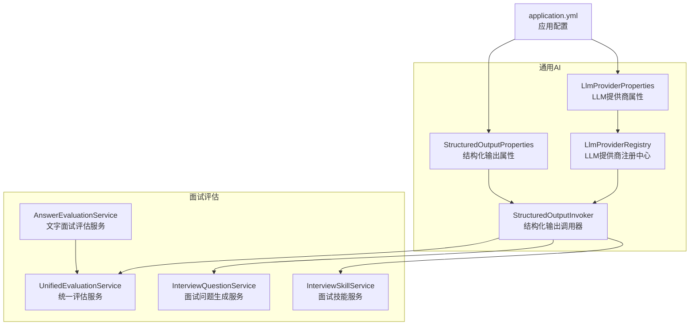
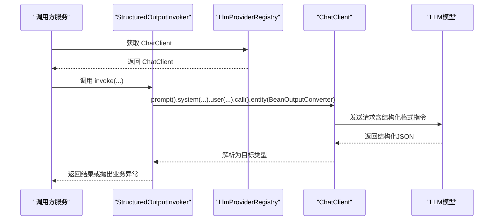
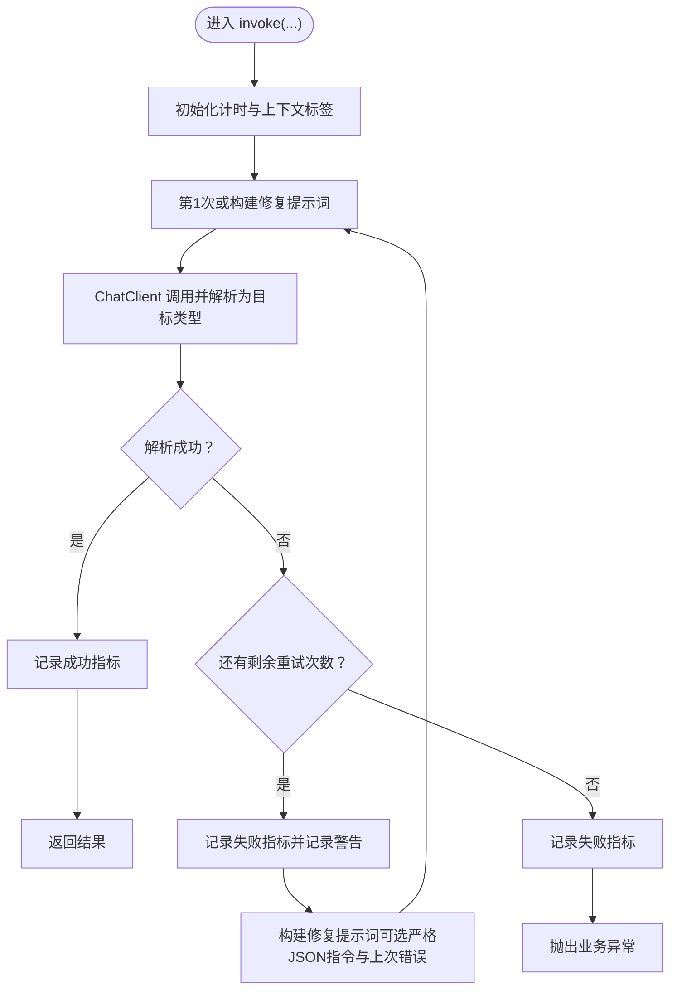
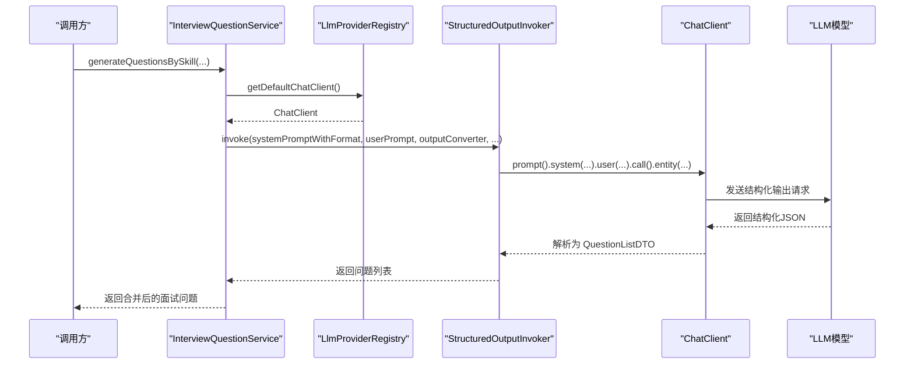
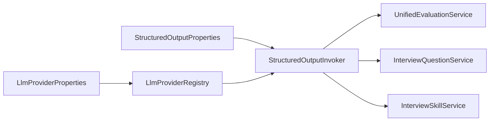

# 结构化输出调用器

<cite>
**本文档引用的文件**
- [StructuredOutputInvoker.java](file://app/src/main/java/interview/guide/common/ai/StructuredOutputInvoker.java)
- [StructuredOutputProperties.java](file://app/src/main/java/interview/guide/common/ai/StructuredOutputProperties.java)
- [LlmProviderRegistry.java](file://app/src/main/java/interview/guide/common/ai/LlmProviderRegistry.java)
- [LlmProviderProperties.java](file://app/src/main/java/interview/guide/common/config/LlmProviderProperties.java)
- [application.yml](file://app/src/main/resources/application.yml)
- [UnifiedEvaluationService.java](file://app/src/main/java/interview/guide/common/evaluation/UnifiedEvaluationService.java)
- [AnswerEvaluationService.java](file://app/src/main/java/interview/guide/modules/interview/service/AnswerEvaluationService.java)
- [InterviewQuestionService.java](file://app/src/main/java/interview/guide/modules/interview/service/InterviewQuestionService.java)
- [InterviewSkillService.java](file://app/src/main/java/interview/guide/modules/interview/skill/InterviewSkillService.java)
</cite>

## 目录
1. [简介](#简介)
2. [项目结构](#项目结构)
3. [核心组件](#核心组件)
4. [架构总览](#架构总览)
5. [详细组件分析](#详细组件分析)
6. [依赖分析](#依赖分析)
7. [性能考量](#性能考量)
8. [故障排查指南](#故障排查指南)
9. [结论](#结论)
10. [附录](#附录)

## 简介
本文件系统性阐述结构化输出调用器（StructuredOutputInvoker）的设计理念、实现机制与在面试评估中的应用。重点涵盖：
- LLM 模型参数控制与提示词格式化
- 结构化输出的格式约束与重试策略
- 错误处理与可观测性（指标采集）
- 在面试评估中的评分标准、评价维度与输出模板
- StructuredOutputProperties 的配置项与使用方法
- 与 AI 提供商注册中心的集成方式与最佳实践
- 典型调用流程、返回结果处理与错误恢复

## 项目结构
围绕结构化输出调用器的关键模块与文件组织如下：
- 通用 AI 能力：StructuredOutputInvoker、StructuredOutputProperties、LlmProviderRegistry、LlmProviderProperties
- 面试评估服务：UnifiedEvaluationService、AnswerEvaluationService、InterviewQuestionService、InterviewSkillService
- 应用配置：application.yml（包含 app.ai.* 结构化输出相关配置）

**图表来源**
- [StructuredOutputInvoker.java:19-172](file://app/src/main/java/interview/guide/common/ai/StructuredOutputInvoker.java#L19-L172)
- [StructuredOutputProperties.java:10-18](file://app/src/main/java/interview/guide/common/ai/StructuredOutputProperties.java#L10-L18)
- [LlmProviderRegistry.java:35-230](file://app/src/main/java/interview/guide/common/ai/LlmProviderRegistry.java#L35-L230)
- [LlmProviderProperties.java:11-39](file://app/src/main/java/interview/guide/common/config/LlmProviderProperties.java#L11-L39)
- [application.yml:126-159](file://app/src/main/resources/application.yml#L126-L159)
- [UnifiedEvaluationService.java:32-380](file://app/src/main/java/interview/guide/common/evaluation/UnifiedEvaluationService.java#L32-L380)
- [AnswerEvaluationService.java:26-99](file://app/src/main/java/interview/guide/modules/interview/service/AnswerEvaluationService.java#L26-L99)
- [InterviewQuestionService.java:41-449](file://app/src/main/java/interview/guide/modules/interview/service/InterviewQuestionService.java#L41-L449)
- [InterviewSkillService.java:34-593](file://app/src/main/java/interview/guide/modules/interview/skill/InterviewSkillService.java#L34-L593)

**章节来源**
- [StructuredOutputInvoker.java:19-172](file://app/src/main/java/interview/guide/common/ai/StructuredOutputInvoker.java#L19-L172)
- [StructuredOutputProperties.java:10-18](file://app/src/main/java/interview/guide/common/ai/StructuredOutputProperties.java#L10-L18)
- [LlmProviderRegistry.java:35-230](file://app/src/main/java/interview/guide/common/ai/LlmProviderRegistry.java#L35-L230)
- [LlmProviderProperties.java:11-39](file://app/src/main/java/interview/guide/common/config/LlmProviderProperties.java#L11-L39)
- [application.yml:126-159](file://app/src/main/resources/application.yml#L126-L159)

## 核心组件
- 结构化输出调用器（StructuredOutputInvoker）
  - 职责：封装 ChatClient 调用、注入结构化输出格式指令、执行重试策略、记录指标、标准化上下文标签
  - 关键特性：支持修复型重试提示词、严格 JSON 指令注入、错误信息截断、指标埋点
- 结构化输出属性（StructuredOutputProperties）
  - 职责：集中管理结构化输出相关的运行参数（最大重试次数、是否包含上次错误、是否启用修复提示词、是否追加严格 JSON 指令、错误信息最大长度、是否启用指标）
- LLM 提供商注册中心（LlmProviderRegistry）
  - 职责：按配置动态创建 ChatClient，支持默认客户端、按提供商 ID 获取客户端、工具回调与顾问（advisors）装配
- LLM 提供商属性（LlmProviderProperties）
  - 职责：定义默认提供商、提供商映射、顾问配置（工具调用、消息记忆、简单日志）
- 应用配置（application.yml）
  - 职责：通过 app.ai.* 键值对提供结构化输出与提供商的运行时配置

**章节来源**
- [StructuredOutputInvoker.java:46-103](file://app/src/main/java/interview/guide/common/ai/StructuredOutputInvoker.java#L46-L103)
- [StructuredOutputProperties.java:12-17](file://app/src/main/java/interview/guide/common/ai/StructuredOutputProperties.java#L12-L17)
- [LlmProviderRegistry.java:65-89](file://app/src/main/java/interview/guide/common/ai/LlmProviderRegistry.java#L65-L89)
- [LlmProviderProperties.java:12-37](file://app/src/main/java/interview/guide/common/config/LlmProviderProperties.java#L12-L37)
- [application.yml:126-159](file://app/src/main/resources/application.yml#L126-L159)

## 架构总览
结构化输出调用器位于“通用 AI 层”，为上层面试评估与问题生成等服务提供统一的结构化输出能力。其与提供商注册中心协作，确保 ChatClient 的一致性与可扩展性。

**图表来源**
- [StructuredOutputInvoker.java:59-103](file://app/src/main/java/interview/guide/common/ai/StructuredOutputInvoker.java#L59-L103)
- [LlmProviderRegistry.java:65-89](file://app/src/main/java/interview/guide/common/ai/LlmProviderRegistry.java#L65-L89)

## 详细组件分析

### 结构化输出调用器（StructuredOutputInvoker）
- 设计理念
  - 统一结构化输出格式约束：通过严格 JSON 指令与 BeanOutputConverter 的格式声明，降低解析失败概率
  - 智能重试策略：修复型重试提示词、可选的上次错误注入、严格 JSON 指令追加
  - 可观测性：指标计数 invocations、attempts、latency，上下文标签归一化
- 关键实现要点
  - 参数来源：从 StructuredOutputProperties 注入运行时配置
  - 重试循环：最多 maxAttempts 次，失败记录 attempts 指标，最终失败记录 invocation 指标并抛出业务异常
  - 修复提示词构建：可选追加严格 JSON 指令与上次错误摘要
  - 指标与标签：context 标签归一化，防止过长与非法字符
- 适用场景
  - 面试评估：批次评估与总结评估
  - 问题生成：按技能与简历生成结构化问题列表
  - JD 解析：结构化提取面试方向

**图表来源**
- [StructuredOutputInvoker.java:59-103](file://app/src/main/java/interview/guide/common/ai/StructuredOutputInvoker.java#L59-L103)
- [StructuredOutputInvoker.java:105-123](file://app/src/main/java/interview/guide/common/ai/StructuredOutputInvoker.java#L105-L123)

**章节来源**
- [StructuredOutputInvoker.java:46-172](file://app/src/main/java/interview/guide/common/ai/StructuredOutputInvoker.java#L46-L172)

### 结构化输出属性（StructuredOutputProperties）
- 配置项说明
  - structured-max-attempts：最大重试次数（默认 2）
  - structured-include-last-error：重试时是否将上次错误注入提示词
  - structured-retry-use-repair-prompt：是否启用修复型重试提示词
  - structured-retry-append-strict-json-instruction：修复型重试提示词中是否追加严格 JSON 指令
  - structured-error-message-max-length：注入到重试提示词中的错误信息最大长度（默认 200）
  - structured-metrics-enabled：是否开启结构化输出调用指标
- 使用方式
  - 通过 @ConfigurationProperties(prefix = "app.ai") 自动绑定 application.yml 中 app.ai.* 配置
  - 在构造函数中注入到 StructuredOutputInvoker，作为运行时策略依据

**章节来源**
- [StructuredOutputProperties.java:12-17](file://app/src/main/java/interview/guide/common/ai/StructuredOutputProperties.java#L12-L17)
- [application.yml:148-159](file://app/src/main/resources/application.yml#L148-L159)

### LLM 提供商注册中心（LlmProviderRegistry）
- 职责
  - 缓存 ChatClient，按 providerId 动态创建
  - 默认客户端与默认提供商 ID 获取
  - 工具回调与顾问（advisors）装配：工具调用、消息记忆、简单日志
- 关键点
  - 通过 LlmProviderProperties 读取 providers 映射与默认提供商
  - OpenAiChatModel 构建时注入 toolCallingManager、RetryUtils.DEFAULT_RETRY_TEMPLATE、ObservationRegistry
  - SimpleClientHttpRequestFactory 设置连接与读取超时，适配本地模型

**章节来源**
- [LlmProviderRegistry.java:65-190](file://app/src/main/java/interview/guide/common/ai/LlmProviderRegistry.java#L65-L190)
- [LlmProviderProperties.java:12-37](file://app/src/main/java/interview/guide/common/config/LlmProviderProperties.java#L12-L37)

### 面试评估中的结构化输出应用
- 统一评估服务（UnifiedEvaluationService）
  - 分批评估：按 evaluation.batch-size 分批调用结构化输出
  - 二次汇总：先批次评估，再用结构化输出进行总结评估
  - 降级兜底：批次评估失败返回空报告，汇总失败降级到批次聚合结果
- 文字面试评估服务（AnswerEvaluationService）
  - 将 DTO 适配为通用 QaRecord，调用统一评估服务
- 面试问题生成服务（InterviewQuestionService）
  - 技能驱动与简历驱动并行生成，统一使用结构化输出
  - 回退策略：任一并行分支失败时降级为单一来源生成
- 面试技能服务（InterviewSkillService）
  - JD 解析：结构化提取面试方向
  - 参考基线构建：按技能与分配规则拼接参考内容，限制最大长度

**图表来源**
- [InterviewQuestionService.java:175-256](file://app/src/main/java/interview/guide/modules/interview/service/InterviewQuestionService.java#L175-L256)
- [LlmProviderRegistry.java:78-89](file://app/src/main/java/interview/guide/common/ai/LlmProviderRegistry.java#L78-L89)
- [StructuredOutputInvoker.java:59-103](file://app/src/main/java/interview/guide/common/ai/StructuredOutputInvoker.java#L59-L103)

**章节来源**
- [UnifiedEvaluationService.java:151-280](file://app/src/main/java/interview/guide/common/evaluation/UnifiedEvaluationService.java#L151-L280)
- [AnswerEvaluationService.java:45-75](file://app/src/main/java/interview/guide/modules/interview/service/AnswerEvaluationService.java#L45-L75)
- [InterviewQuestionService.java:175-256](file://app/src/main/java/interview/guide/modules/interview/service/InterviewQuestionService.java#L175-L256)
- [InterviewSkillService.java:166-198](file://app/src/main/java/interview/guide/modules/interview/skill/InterviewSkillService.java#L166-L198)

## 依赖分析
- 组件耦合
  - StructuredOutputInvoker 依赖 StructuredOutputProperties（策略配置）与 ChatClient（执行载体）
  - LlmProviderRegistry 依赖 LlmProviderProperties（提供商配置），负责 ChatClient 的创建与缓存
  - 上层服务（UnifiedEvaluationService、InterviewQuestionService、InterviewSkillService）通过 LlmProviderRegistry 获取 ChatClient，并委托 StructuredOutputInvoker 执行结构化输出
- 外部依赖
  - Spring AI ChatClient、BeanOutputConverter、PromptTemplate
  - Micrometer（指标采集）
  - Spring Retry（默认重试模板）

**图表来源**
- [StructuredOutputInvoker.java:46-57](file://app/src/main/java/interview/guide/common/ai/StructuredOutputInvoker.java#L46-L57)
- [LlmProviderRegistry.java:46-55](file://app/src/main/java/interview/guide/common/ai/LlmProviderRegistry.java#L46-L55)
- [UnifiedEvaluationService.java:76-89](file://app/src/main/java/interview/guide/common/evaluation/UnifiedEvaluationService.java#L76-L89)
- [InterviewQuestionService.java:86-100](file://app/src/main/java/interview/guide/modules/interview/service/InterviewQuestionService.java#L86-L100)
- [InterviewSkillService.java:69-77](file://app/src/main/java/interview/guide/modules/interview/skill/InterviewSkillService.java#L69-L77)

**章节来源**
- [StructuredOutputInvoker.java:46-57](file://app/src/main/java/interview/guide/common/ai/StructuredOutputInvoker.java#L46-L57)
- [LlmProviderRegistry.java:46-55](file://app/src/main/java/interview/guide/common/ai/LlmProviderRegistry.java#L46-L55)

## 性能考量
- 重试策略
  - 通过 maxAttempts 控制重试上限，避免无限重试导致延迟放大
  - 修复型重试提示词可显著降低解析失败率，减少整体重试次数
- 指标监控
  - 启用 structured-metrics-enabled 后，记录 invocations、attempts、latency，便于容量规划与性能优化
- 超时与连接
  - LlmProviderRegistry 使用较长读取超时（适用于本地模型），避免因网络波动导致的早期失败
- 分批评估
  - UnifiedEvaluationService 按 batch-size 分批评估，平衡吞吐与内存占用

[本节为通用性能建议，无需特定文件引用]

## 故障排查指南
- 常见问题与定位
  - 结构化解析失败：查看日志中的 attempts 计数与最后一次错误摘要；确认是否启用修复型重试提示词与严格 JSON 指令
  - 指标缺失：检查 structured-metrics-enabled 与 MeterRegistry 是否可用
  - 提供商配置错误：确认 app.ai.default-provider 与 app.ai.providers.* 配置正确
- 排错步骤
  - 启用修复型重试提示词与严格 JSON 指令，观察重试次数是否下降
  - 截断错误信息长度，避免过长错误导致提示词溢出
  - 校验 ChatClient 创建与顾问装配是否成功
- 降级策略
  - 统一评估服务在批次评估失败时返回空报告，汇总失败时降级到批次聚合结果
  - 问题生成服务在并行分支失败时降级为单一来源生成

**章节来源**
- [StructuredOutputInvoker.java:88-102](file://app/src/main/java/interview/guide/common/ai/StructuredOutputInvoker.java#L88-L102)
- [UnifiedEvaluationService.java:179-188](file://app/src/main/java/interview/guide/common/evaluation/UnifiedEvaluationService.java#L179-L188)
- [InterviewQuestionService.java:149-162](file://app/src/main/java/interview/guide/modules/interview/service/InterviewQuestionService.java#L149-L162)

## 结论
结构化输出调用器通过统一的格式约束、智能重试与可观测性，显著提升了面试评估与问题生成场景下的稳定性与可维护性。配合提供商注册中心与应用配置，可在多提供商、多模型环境下保持一致的行为与性能表现。建议在生产环境中启用指标监控、合理设置重试策略与错误信息截断长度，并结合分批评估与降级策略，获得更稳健的用户体验。

[本节为总结性内容，无需特定文件引用]

## 附录

### 配置项速查（app.ai.*）
- default-provider：默认提供商 ID
- agent-utils.skills-root：技能根目录（用于 AgentUtils）
- providers.{id}.base-url/api-key/model：提供商配置
- advisors.enabled/tool-call-enabled/message-chat-memory-enabled/simple-logger-enabled：顾问开关
- structured-max-attempts：结构化输出最大重试次数
- structured-include-last-error：重试时是否包含上次错误
- structured-retry-use-repair-prompt：是否启用修复型重试提示词
- structured-retry-append-strict-json-instruction：修复型重试是否追加严格 JSON 指令
- structured-error-message-max-length：错误信息最大长度
- structured-metrics-enabled：是否启用结构化输出指标

**章节来源**
- [application.yml:126-159](file://app/src/main/resources/application.yml#L126-L159)
- [LlmProviderProperties.java:12-37](file://app/src/main/java/interview/guide/common/config/LlmProviderProperties.java#L12-L37)

### 面试评估中的评分标准与输出模板
- 评分标准
  - 问题级别：每题独立评分，支持追问分数
  - 维度：按类别统计平均分与题数
  - 总体：按已答题数量计算平均分
- 输出模板
  - 批次评估：包含总体反馈、优势、改进点、逐题评估
  - 总结评估：基于批次结果与参考基线生成综合评语与要点
- 参考实现位置
  - 批次评估与总结评估的结构化输出格式由 BeanOutputConverter 的格式声明与 system prompt 的格式拼接共同决定

**章节来源**
- [UnifiedEvaluationService.java:48-89](file://app/src/main/java/interview/guide/common/evaluation/UnifiedEvaluationService.java#L48-L89)
- [UnifiedEvaluationService.java:164-280](file://app/src/main/java/interview/guide/common/evaluation/UnifiedEvaluationService.java#L164-L280)

### 代码示例（调用路径）
- 调用结构化输出（问题生成）
  - [InterviewQuestionService.java:175-207](file://app/src/main/java/interview/guide/modules/interview/service/InterviewQuestionService.java#L175-L207)
  - [InterviewQuestionService.java:209-256](file://app/src/main/java/interview/guide/modules/interview/service/InterviewQuestionService.java#L209-L256)
- 调用结构化输出（评估）
  - [UnifiedEvaluationService.java:164-189](file://app/src/main/java/interview/guide/common/evaluation/UnifiedEvaluationService.java#L164-L189)
  - [UnifiedEvaluationService.java:248-280](file://app/src/main/java/interview/guide/common/evaluation/UnifiedEvaluationService.java#L248-L280)
- 调用结构化输出（JD 解析）
  - [InterviewSkillService.java:166-198](file://app/src/main/java/interview/guide/modules/interview/skill/InterviewSkillService.java#L166-L198)

**章节来源**
- [InterviewQuestionService.java:175-256](file://app/src/main/java/interview/guide/modules/interview/service/InterviewQuestionService.java#L175-L256)
- [UnifiedEvaluationService.java:164-280](file://app/src/main/java/interview/guide/common/evaluation/UnifiedEvaluationService.java#L164-L280)
- [InterviewSkillService.java:166-198](file://app/src/main/java/interview/guide/modules/interview/skill/InterviewSkillService.java#L166-L198)