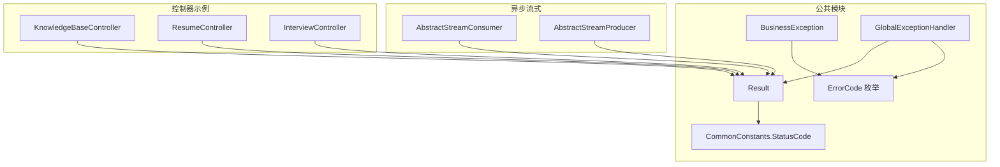
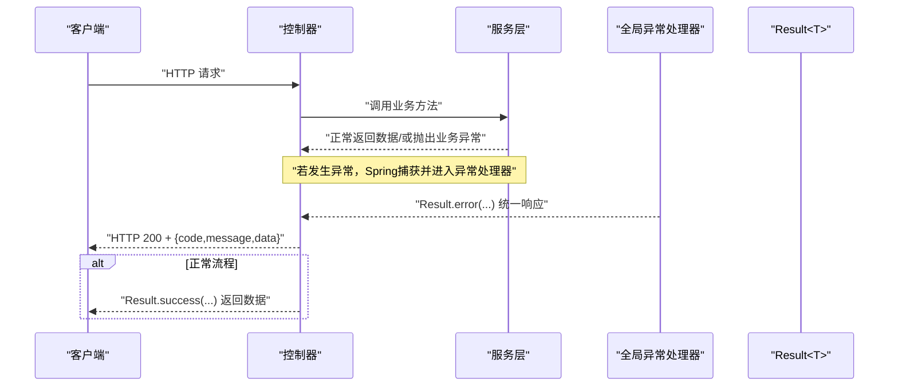
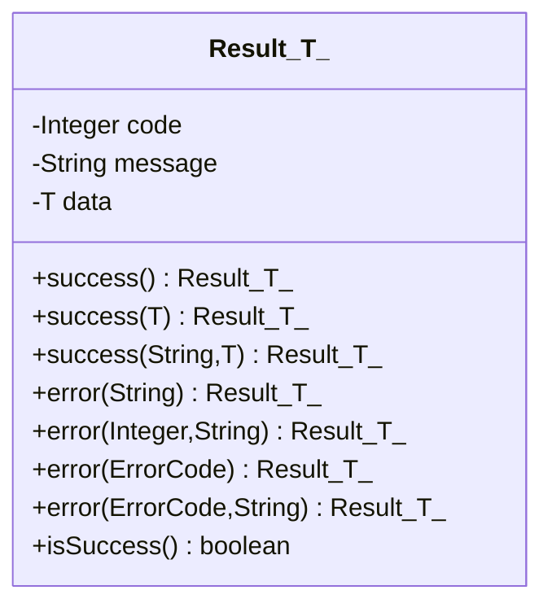
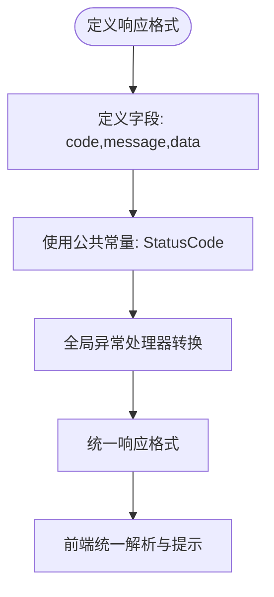
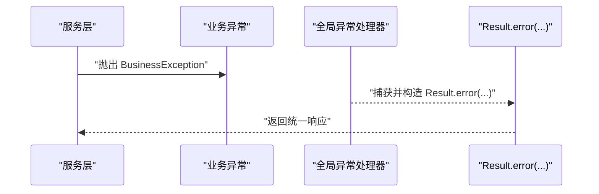
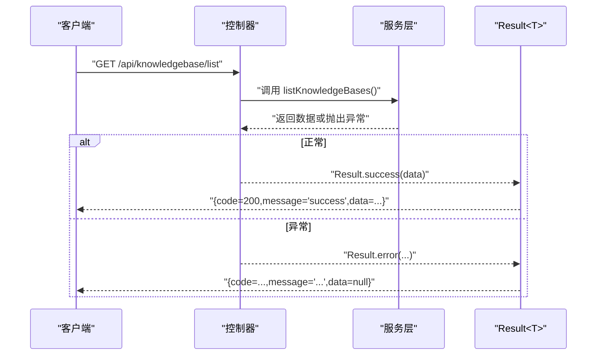
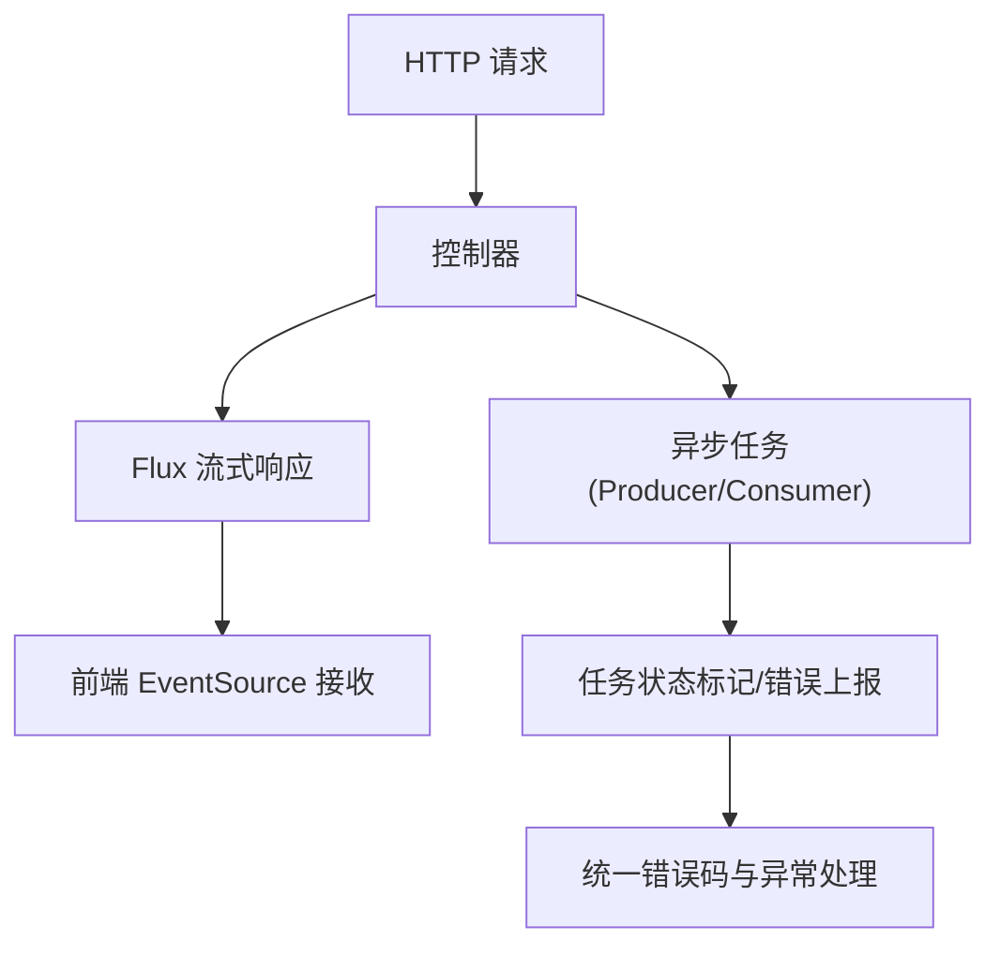
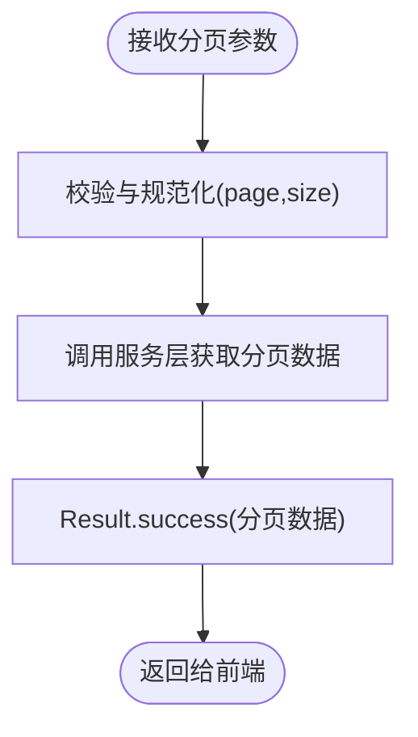
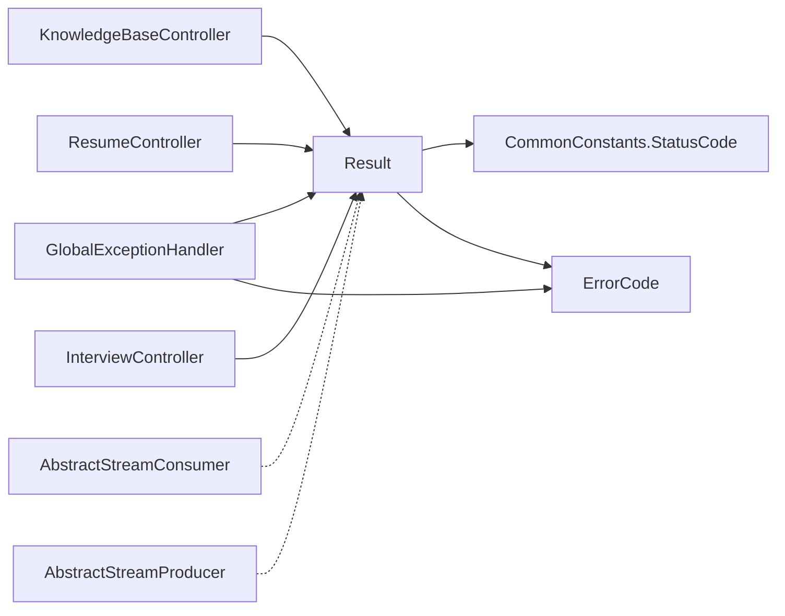

# 统一响应封装

<cite>
**本文引用的文件**
- [Result.java](file://app/src/main/java/interview/guide/common/result/Result.java)
- [CommonConstants.java](file://app/src/main/java/interview/guide/common/constant/CommonConstants.java)
- [GlobalExceptionHandler.java](file://app/src/main/java/interview/guide/common/exception/GlobalExceptionHandler.java)
- [ErrorCode.java](file://app/src/main/java/interview/guide/common/exception/ErrorCode.java)
- [BusinessException.java](file://app/src/main/java/interview/guide/common/exception/BusinessException.java)
- [KnowledgeBaseController.java](file://app/src/main/java/interview/guide/modules/knowledgebase/KnowledgeBaseController.java)
- [ResumeController.java](file://app/src/main/java/interview/guide/modules/resume/ResumeController.java)
- [InterviewController.java](file://app/src/main/java/interview/guide/modules/interview/InterviewController.java)
- [AbstractStreamConsumer.java](file://app/src/main/java/interview/guide/common/async/AbstractStreamConsumer.java)
- [AbstractStreamProducer.java](file://app/src/main/java/interview/guide/common/async/AbstractStreamProducer.java)
</cite>

## 目录
1. [简介](#简介)
2. [项目结构](#项目结构)
3. [核心组件](#核心组件)
4. [架构总览](#架构总览)
5. [详细组件分析](#详细组件分析)
6. [依赖分析](#依赖分析)
7. [性能考虑](#性能考虑)
8. [故障排查指南](#故障排查指南)
9. [结论](#结论)
10. [附录](#附录)

## 简介
本文件系统性阐述“统一响应封装”的设计理念与实现细节，围绕 Result 类展开，覆盖成功响应、失败响应、分页响应的封装策略；解释 Result 的泛型设计与类型安全机制；说明与全局异常处理器的协同工作方式；介绍公共常量与响应格式标准化的重要性；并通过 Controller 层示例展示 Result 的正确使用姿势，以及异步流式场景下的响应处理最佳实践。

## 项目结构
统一响应封装位于后端应用的公共模块中，配合全局异常处理器与错误码体系，形成从服务层到前端的一致响应契约。关键文件分布如下：
- 统一响应：Result 类
- 响应常量：CommonConstants（状态码）
- 异常与错误码：GlobalExceptionHandler、ErrorCode、BusinessException
- 控制器示例：KnowledgeBaseController、ResumeController、InterviewController
- 异步流式：AbstractStreamConsumer、AbstractStreamProducer

图表来源
- [Result.java:1-61](file://app/src/main/java/interview/guide/common/result/Result.java#L1-L61)
- [CommonConstants.java:1-46](file://app/src/main/java/interview/guide/common/constant/CommonConstants.java#L1-L46)
- [GlobalExceptionHandler.java:1-161](file://app/src/main/java/interview/guide/common/exception/GlobalExceptionHandler.java#L1-L161)
- [ErrorCode.java:1-81](file://app/src/main/java/interview/guide/common/exception/ErrorCode.java#L1-L81)
- [BusinessException.java:1-50](file://app/src/main/java/interview/guide/common/exception/BusinessException.java#L1-L50)
- [KnowledgeBaseController.java:1-211](file://app/src/main/java/interview/guide/modules/knowledgebase/KnowledgeBaseController.java#L1-L211)
- [ResumeController.java:1-132](file://app/src/main/java/interview/guide/modules/resume/ResumeController.java#L1-L132)
- [InterviewController.java:1-176](file://app/src/main/java/interview/guide/modules/interview/InterviewController.java#L1-L176)
- [AbstractStreamConsumer.java:1-176](file://app/src/main/java/interview/guide/common/async/AbstractStreamConsumer.java#L1-L176)
- [AbstractStreamProducer.java:1-55](file://app/src/main/java/interview/guide/common/async/AbstractStreamProducer.java#L1-L55)

章节来源
- [Result.java:1-61](file://app/src/main/java/interview/guide/common/result/Result.java#L1-L61)
- [CommonConstants.java:1-46](file://app/src/main/java/interview/guide/common/constant/CommonConstants.java#L1-L46)
- [GlobalExceptionHandler.java:1-161](file://app/src/main/java/interview/guide/common/exception/GlobalExceptionHandler.java#L1-L161)
- [ErrorCode.java:1-81](file://app/src/main/java/interview/guide/common/exception/ErrorCode.java#L1-L81)
- [BusinessException.java:1-50](file://app/src/main/java/interview/guide/common/exception/BusinessException.java#L1-L50)
- [KnowledgeBaseController.java:1-211](file://app/src/main/java/interview/guide/modules/knowledgebase/KnowledgeBaseController.java#L1-L211)
- [ResumeController.java:1-132](file://app/src/main/java/interview/guide/modules/resume/ResumeController.java#L1-L132)
- [InterviewController.java:1-176](file://app/src/main/java/interview/guide/modules/interview/InterviewController.java#L1-L176)
- [AbstractStreamConsumer.java:1-176](file://app/src/main/java/interview/guide/common/async/AbstractStreamConsumer.java#L1-L176)
- [AbstractStreamProducer.java:1-55](file://app/src/main/java/interview/guide/common/async/AbstractStreamProducer.java#L1-L55)

## 核心组件
- Result<T>：统一响应载体，包含 code、message、data 三要素，提供静态工厂方法以构造成功与失败响应，并提供 isSuccess 判定。
- CommonConstants.StatusCode：统一状态码常量，如 SUCCESS、SERVER_ERROR 等，确保前后端一致的状态语义。
- ErrorCode：业务错误码枚举，涵盖通用、简历、面试、存储、导出、知识库、AI服务、限流、面试日程、语音面试等模块错误码。
- GlobalExceptionHandler：全局异常处理器，将各类异常转换为 Result 统一响应，保证 HTTP 200 + 业务错误码的契约。
- BusinessException：业务异常包装类，便于在服务层抛出带业务码与消息的异常。
- 控制器示例：各模块控制器均以 Result 封装响应，体现统一风格与类型安全。

章节来源
- [Result.java:10-60](file://app/src/main/java/interview/guide/common/result/Result.java#L10-L60)
- [CommonConstants.java:13-22](file://app/src/main/java/interview/guide/common/constant/CommonConstants.java#L13-L22)
- [ErrorCode.java:11-76](file://app/src/main/java/interview/guide/common/exception/ErrorCode.java#L11-L76)
- [GlobalExceptionHandler.java:23-160](file://app/src/main/java/interview/guide/common/exception/GlobalExceptionHandler.java#L23-L160)
- [BusinessException.java:9-48](file://app/src/main/java/interview/guide/common/exception/BusinessException.java#L9-L48)

## 架构总览
统一响应封装贯穿“控制器 → 服务层 → 异常处理”的全链路，形成“HTTP 200 + 业务码”的稳定契约，前端据此统一解析与提示。

图表来源
- [GlobalExceptionHandler.java:31-36](file://app/src/main/java/interview/guide/common/exception/GlobalExceptionHandler.java#L31-L36)
- [Result.java:25-53](file://app/src/main/java/interview/guide/common/result/Result.java#L25-L53)

## 详细组件分析

### Result 类设计与使用
- 泛型设计：Result<T> 通过泛型承载任意数据类型，既可返回空数据（如 Void），也可返回复杂对象，实现类型安全与编译期约束。
- 成功响应：提供无参 success()、携带数据 success(T data)、自定义消息 success(String message, T data) 三种工厂方法，满足不同场景。
- 失败响应：提供字符串消息 error(String message)、显式业务码 error(Integer code, String message)、基于 ErrorCode error(ErrorCode)、error(ErrorCode, String message) 等多种构造方式，便于快速映射错误码。
- 类型安全：通过 getter 访问字段，避免直接修改内部状态；isSuccess() 提供便捷判断，减少分支重复判断。

图表来源
- [Result.java:11-60](file://app/src/main/java/interview/guide/common/result/Result.java#L11-L60)

章节来源
- [Result.java:10-60](file://app/src/main/java/interview/guide/common/result/Result.java#L10-L60)

### 公共常量与响应格式标准化
- 状态码标准化：CommonConstants.StatusCode 定义 SUCCESS、BAD_REQUEST、UNAUTHORIZED、FORBIDDEN、NOT_FOUND、SERVER_ERROR 等，作为通用状态码，确保前后端一致理解。
- 响应格式标准化：Result 统一包含 code、message、data 字段，结合全局异常处理器，形成“HTTP 200 + 业务码”的稳定契约，简化前端解析与提示逻辑。

图表来源
- [CommonConstants.java:13-22](file://app/src/main/java/interview/guide/common/constant/CommonConstants.java#L13-L22)
- [GlobalExceptionHandler.java:31-36](file://app/src/main/java/interview/guide/common/exception/GlobalExceptionHandler.java#L31-L36)

章节来源
- [CommonConstants.java:13-22](file://app/src/main/java/interview/guide/common/constant/CommonConstants.java#L13-L22)
- [GlobalExceptionHandler.java:31-36](file://app/src/main/java/interview/guide/common/exception/GlobalExceptionHandler.java#L31-L36)

### 与全局异常处理器的配合
- 业务异常 BusinessException：由服务层抛出，全局异常处理器捕获并转换为 Result.error(code, message)，保持 HTTP 200 与业务码一致。
- 参数校验异常 MethodArgumentNotValidException/BindException：提取字段错误消息，统一映射为 BAD_REQUEST。
- 文件上传超限 MaxUploadSizeExceededException：统一返回 BAD_REQUEST 并提示。
- 非法参数 IllegalArgumentException：统一返回 BAD_REQUEST。
- AI 服务异常 ResourceAccessException/RestClientException：根据具体原因映射为 AI_SERVICE_TIMEOUT、AI_SERVICE_UNAVAILABLE、AI_API_KEY_INVALID、AI_RATE_LIMIT_EXCEEDED 等。
- 其他异常 Exception：统一返回 INTERNAL_ERROR。

图表来源
- [BusinessException.java:14-30](file://app/src/main/java/interview/guide/common/exception/BusinessException.java#L14-L30)
- [GlobalExceptionHandler.java:31-36](file://app/src/main/java/interview/guide/common/exception/GlobalExceptionHandler.java#L31-L36)
- [Result.java:43-53](file://app/src/main/java/interview/guide/common/result/Result.java#L43-L53)

章节来源
- [BusinessException.java:9-48](file://app/src/main/java/interview/guide/common/exception/BusinessException.java#L9-L48)
- [GlobalExceptionHandler.java:31-159](file://app/src/main/java/interview/guide/common/exception/GlobalExceptionHandler.java#L31-L159)
- [Result.java:39-53](file://app/src/main/java/interview/guide/common/result/Result.java#L39-L53)

### 控制器层使用示例
- 知识库模块：列表、详情、查询、上传、统计、向量化等接口均以 Result.success(...) 返回数据；当资源不存在时以 Result.error(...) 返回错误信息。
- 简历模块：上传分析、列表、详情、导出、删除、重分析等接口统一使用 Result.success(...) 或 Result.error(...)。
- 面试模块：会话创建、查询、答题、报告生成、导出、删除等接口统一使用 Result.success(...) 或 Result.error(...)。

图表来源
- [KnowledgeBaseController.java:47-62](file://app/src/main/java/interview/guide/modules/knowledgebase/KnowledgeBaseController.java#L47-L62)
- [ResumeController.java:44-54](file://app/src/main/java/interview/guide/modules/resume/ResumeController.java#L44-L54)
- [InterviewController.java:50-57](file://app/src/main/java/interview/guide/modules/interview/InterviewController.java#L50-L57)

章节来源
- [KnowledgeBaseController.java:47-211](file://app/src/main/java/interview/guide/modules/knowledgebase/KnowledgeBaseController.java#L47-L211)
- [ResumeController.java:44-132](file://app/src/main/java/interview/guide/modules/resume/ResumeController.java#L44-L132)
- [InterviewController.java:39-176](file://app/src/main/java/interview/guide/modules/interview/InterviewController.java#L39-L176)

### 异步与流式响应处理
- 流式 SSE：部分接口返回 Flux<String>，用于实时推送事件流，前端以 EventSource 方式接收；该场景不直接使用 Result，但遵循统一的业务错误码与异常处理机制。
- Redis Stream 异步：通过 AbstractStreamConsumer/AbstractStreamProducer 封装消息生产与消费骨架，内部仍可借助 Result 进行任务状态标记与错误上报（例如在业务处理中封装 Result 以便上层统一处理）。

图表来源
- [KnowledgeBaseController.java:96-103](file://app/src/main/java/interview/guide/modules/knowledgebase/KnowledgeBaseController.java#L96-L103)
- [AbstractStreamConsumer.java:74-123](file://app/src/main/java/interview/guide/common/async/AbstractStreamConsumer.java#L74-L123)
- [AbstractStreamProducer.java:22-36](file://app/src/main/java/interview/guide/common/async/AbstractStreamProducer.java#L22-L36)

章节来源
- [KnowledgeBaseController.java:96-103](file://app/src/main/java/interview/guide/modules/knowledgebase/KnowledgeBaseController.java#L96-L103)
- [AbstractStreamConsumer.java:24-176](file://app/src/main/java/interview/guide/common/async/AbstractStreamConsumer.java#L24-L176)
- [AbstractStreamProducer.java:14-55](file://app/src/main/java/interview/guide/common/async/AbstractStreamProducer.java#L14-L55)

### 分页响应封装策略
- 分页默认值：CommonConstants.Pagination 提供 DEFAULT_PAGE、DEFAULT_SIZE、MAX_SIZE，便于控制器层统一处理分页参数与边界控制。
- 封装思路：控制器接收 page、size 参数后，调用服务层获取 Pageable 数据；服务层返回分页结果；控制器以 Result.success(...) 包裹分页数据，前端据此渲染分页控件与数据列表。

图表来源
- [CommonConstants.java:27-33](file://app/src/main/java/interview/guide/common/constant/CommonConstants.java#L27-L33)

章节来源
- [CommonConstants.java:27-33](file://app/src/main/java/interview/guide/common/constant/CommonConstants.java#L27-L33)

## 依赖分析
- Result 依赖 CommonConstants.StatusCode 与 ErrorCode，用于构造成功与失败响应。
- GlobalExceptionHandler 依赖 Result 与 ErrorCode，负责将各类异常转换为统一响应。
- 控制器依赖 Result，用于封装响应；同时依赖服务层与模型类。
- 异步组件（AbstractStreamConsumer/AbstractStreamProducer）与 Result 解耦，可在业务处理中按需使用 Result 进行状态标记与错误上报。

图表来源
- [Result.java:3-5](file://app/src/main/java/interview/guide/common/result/Result.java#L3-L5)
- [GlobalExceptionHandler.java:3-15](file://app/src/main/java/interview/guide/common/exception/GlobalExceptionHandler.java#L3-L15)
- [KnowledgeBaseController.java:4](file://app/src/main/java/interview/guide/modules/knowledgebase/KnowledgeBaseController.java#L4)
- [ResumeController.java:4](file://app/src/main/java/interview/guide/modules/resume/ResumeController.java#L4)
- [InterviewController.java:4](file://app/src/main/java/interview/guide/modules/interview/InterviewController.java#L4)
- [AbstractStreamConsumer.java:3](file://app/src/main/java/interview/guide/common/async/AbstractStreamConsumer.java#L3)
- [AbstractStreamProducer.java:3](file://app/src/main/java/interview/guide/common/async/AbstractStreamProducer.java#L3)

章节来源
- [Result.java:3-5](file://app/src/main/java/interview/guide/common/result/Result.java#L3-L5)
- [GlobalExceptionHandler.java:3-15](file://app/src/main/java/interview/guide/common/exception/GlobalExceptionHandler.java#L3-L15)
- [KnowledgeBaseController.java:4](file://app/src/main/java/interview/guide/modules/knowledgebase/KnowledgeBaseController.java#L4)
- [ResumeController.java:4](file://app/src/main/java/interview/guide/modules/resume/ResumeController.java#L4)
- [InterviewController.java:4](file://app/src/main/java/interview/guide/modules/interview/InterviewController.java#L4)
- [AbstractStreamConsumer.java:3](file://app/src/main/java/interview/guide/common/async/AbstractStreamConsumer.java#L3)
- [AbstractStreamProducer.java:3](file://app/src/main/java/interview/guide/common/async/AbstractStreamProducer.java#L3)

## 性能考虑
- 统一响应减少前端分支判断，降低解析成本。
- 全局异常处理器集中处理异常，避免在控制器中重复判断与构造响应。
- 对于流式响应（Flux），建议前端采用增量渲染策略，避免一次性接收大量事件导致内存压力。
- 异步任务（Redis Stream）通过单线程执行器与批量拉取策略，平衡吞吐与延迟。

## 故障排查指南
- 前端提示异常：若出现“系统繁忙，请稍后重试”，通常对应 INTERNAL_ERROR；若出现“AI服务调用失败”，则对应 AI_SERVICE_ERROR 或相关细分错误码。
- 参数校验失败：字段错误会被拼接为统一消息返回，前端可直接展示。
- 资源未找到：NoResourceFoundException 映射为 NOT_FOUND，前端可引导用户检查路径或权限。
- AI 服务异常：根据 ResourceAccessException/RestClientException 的具体原因区分超时、密钥无效、限流等情况，前端可给出针对性提示。

章节来源
- [GlobalExceptionHandler.java:133-148](file://app/src/main/java/interview/guide/common/exception/GlobalExceptionHandler.java#L133-L148)
- [GlobalExceptionHandler.java:88-128](file://app/src/main/java/interview/guide/common/exception/GlobalExceptionHandler.java#L88-L128)
- [ErrorCode.java:11-76](file://app/src/main/java/interview/guide/common/exception/ErrorCode.java#L11-L76)

## 结论
统一响应封装通过 Result<T>、公共常量与错误码、全局异常处理器形成闭环，实现了前后端一致的响应契约与错误语义。控制器层只需专注于业务逻辑，其余响应与异常处理由框架统一接管，显著提升了开发效率与系统一致性。对于异步与流式场景，建议在业务处理中结合 Result 进行状态标记与错误上报，确保整体可观测性与可维护性。

## 附录
- API 设计最佳实践
  - 响应体固定包含 code、message、data；HTTP 状态码统一为 200。
  - 错误码与消息一一对应，避免多义性。
  - 分页接口统一 page、size 参数命名与默认值，便于前端复用。
  - 流式接口明确事件类型与终止条件，前端做好断线重连与去重。
  - 异步任务接口提供任务状态查询与错误回查能力。