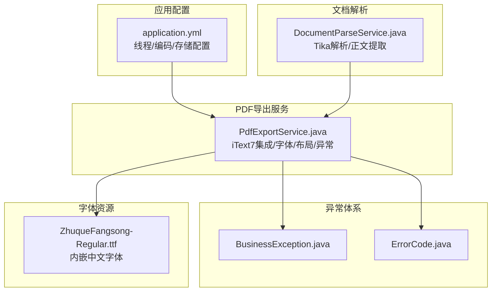
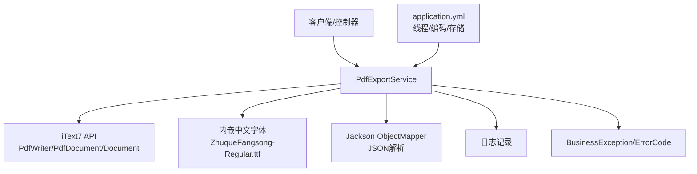
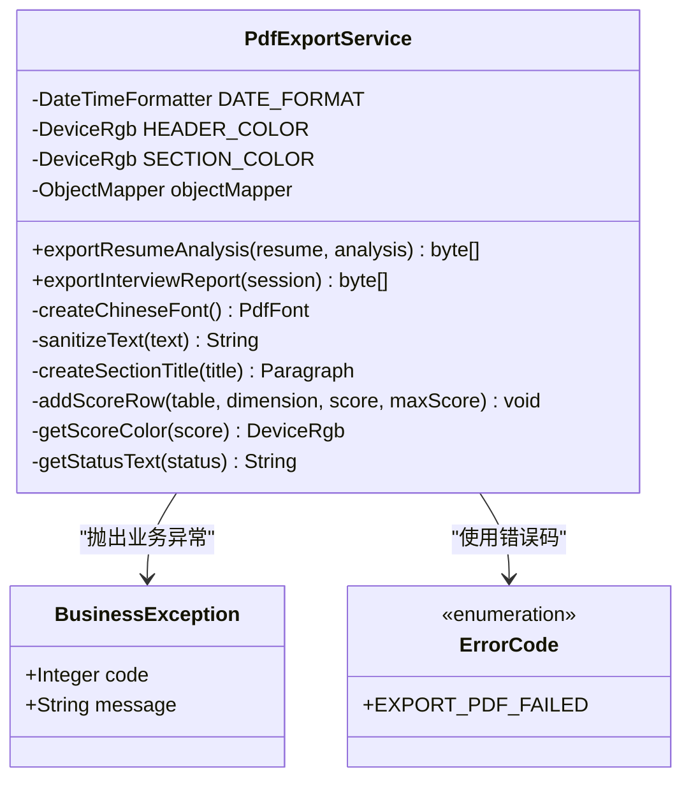
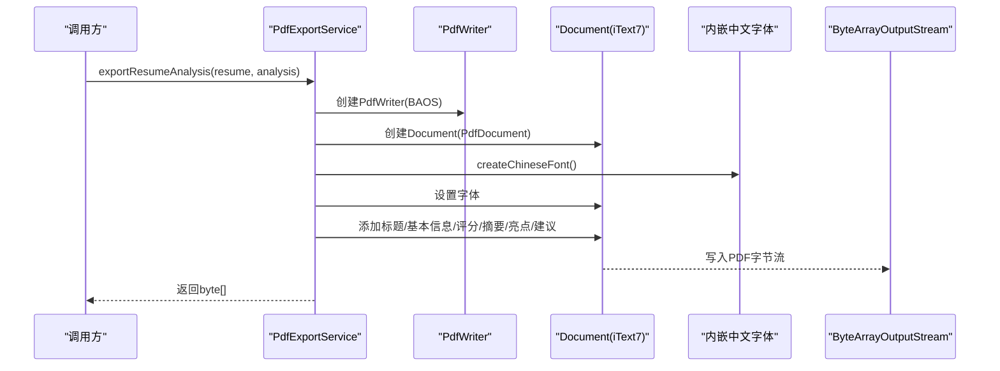
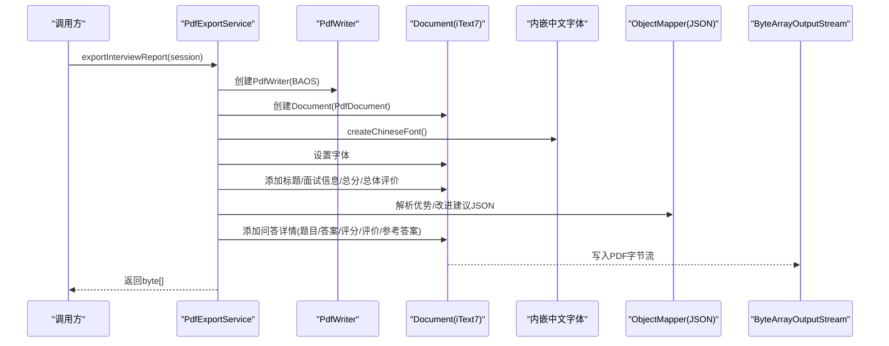
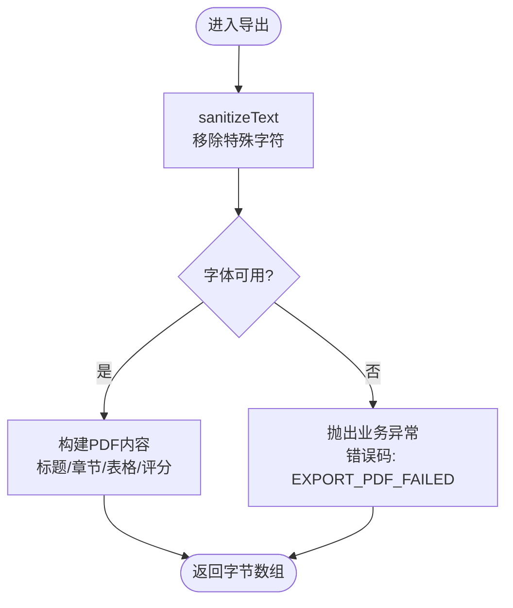
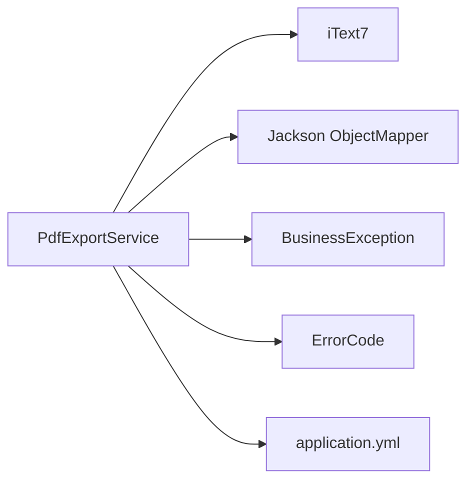
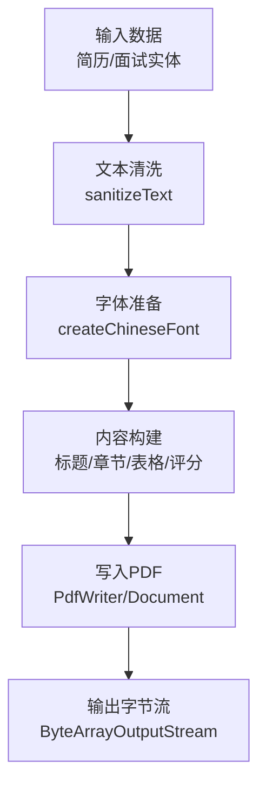
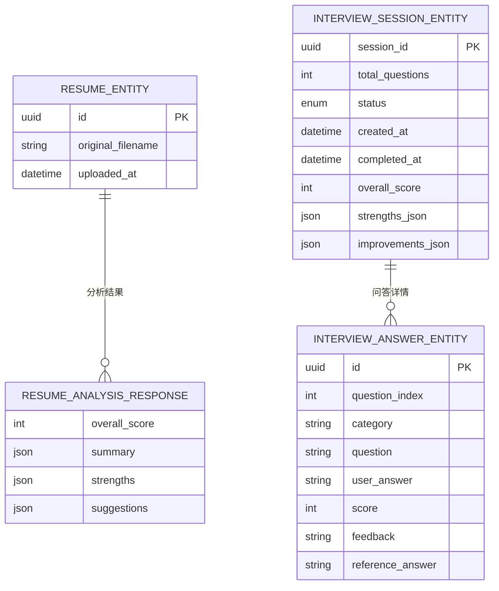

# PDF导出服务

<cite>
**本文档引用的文件**
- [PdfExportService.java](file://app/src/main/java/interview/guide/infrastructure/export/PdfExportService.java)
- [BusinessException.java](file://app/src/main/java/interview/guide/common/exception/BusinessException.java)
- [ErrorCode.java](file://app/src/main/java/interview/guide/common/exception/ErrorCode.java)
- [application.yml](file://app/src/main/resources/application.yml)
- [DocumentParseService.java](file://app/src/main/java/interview/guide/infrastructure/file/DocumentParseService.java)
- [ZhuqueFangsong-Regular.ttf](file://app/src/main/resources/fonts/ZhuqueFangsong-Regular.ttf)
</cite>

## 目录
1. [简介](#简介)
2. [项目结构](#项目结构)
3. [核心组件](#核心组件)
4. [架构概览](#架构概览)
5. [详细组件分析](#详细组件分析)
6. [依赖分析](#依赖分析)
7. [性能考虑](#性能考虑)
8. [故障排除指南](#故障排除指南)
9. [结论](#结论)
10. [附录](#附录)

## 简介
本文件为PDF导出服务的综合技术文档，聚焦于基于iText7的简历分析报告与面试报告PDF生成实现。文档涵盖以下主题：
- iText7集成与配置
- PDF模板设计与内容布局
- 文档内容转换流程（文本清洗与排版）
- 字体处理机制（中文字体支持、嵌入与回退策略）
- PDF定制化选项（页面设置、边距、颜色主题）
- 安全与合规性（错误码与异常处理）
- 性能优化（并发、内存与资源管理）
- 质量控制（文本清理、兼容性处理）

## 项目结构
PDF导出服务位于后端基础设施层，负责将业务实体转换为PDF文档。核心文件与职责如下：
- PdfExportService：PDF生成主服务，封装iText7使用、字体创建、内容布局与异常处理
- BusinessException/ErrorCode：统一业务异常与错误码定义
- application.yml：应用配置（含Tomcat线程、虚拟线程、编码等）
- DocumentParseService：文档解析工具（与PDF导出形成前后端处理链路）
- ZhuqueFangsong-Regular.ttf：项目内嵌中文字体资源

**图表来源**
- [PdfExportService.java:32-314](file://app/src/main/java/interview/guide/infrastructure/export/PdfExportService.java#L32-L314)
- [BusinessException.java:1-50](file://app/src/main/java/interview/guide/common/exception/BusinessException.java#L1-L50)
- [ErrorCode.java:1-81](file://app/src/main/java/interview/guide/common/exception/ErrorCode.java#L1-L81)
- [application.yml:1-282](file://app/src/main/resources/application.yml#L1-L282)
- [DocumentParseService.java:93-125](file://app/src/main/java/interview/guide/infrastructure/file/DocumentParseService.java#L93-L125)
- [ZhuqueFangsong-Regular.ttf](file://app/src/main/resources/fonts/ZhuqueFangsong-Regular.ttf)

**章节来源**
- [PdfExportService.java:32-314](file://app/src/main/java/interview/guide/infrastructure/export/PdfExportService.java#L32-L314)
- [application.yml:1-282](file://app/src/main/resources/application.yml#L1-L282)

## 核心组件
- PdfExportService：提供两个主要导出方法
  - exportResumeAnalysis：生成简历分析报告PDF
  - exportInterviewReport：生成面试报告PDF
- 字体与排版
  - createChineseFont：从类路径资源加载内嵌中文字体，强制嵌入以保证跨平台一致性
  - sanitizeText：移除可能导致字体渲染问题的特殊字符（如Unicode符号与代理区字符）
  - 统一的颜色主题与字号规范，确保标题、章节标题与评分颜色的一致性
- 异常处理
  - 字体加载失败或缺失时抛出业务异常，错误码为EXPORT_PDF_FAILED
  - JSON解析异常时记录日志并跳过对应字段，保证导出流程继续

**章节来源**
- [PdfExportService.java:47-80](file://app/src/main/java/interview/guide/infrastructure/export/PdfExportService.java#L47-L80)
- [PdfExportService.java:85-165](file://app/src/main/java/interview/guide/infrastructure/export/PdfExportService.java#L85-L165)
- [PdfExportService.java:170-283](file://app/src/main/java/interview/guide/infrastructure/export/PdfExportService.java#L170-L283)
- [BusinessException.java:1-50](file://app/src/main/java/interview/guide/common/exception/BusinessException.java#L1-L50)
- [ErrorCode.java:46-48](file://app/src/main/java/interview/guide/common/exception/ErrorCode.java#L46-L48)

## 架构概览
PDF导出服务采用“服务-异常-配置”的分层设计，与应用整体配置协同工作。

**图表来源**
- [PdfExportService.java:85-165](file://app/src/main/java/interview/guide/infrastructure/export/PdfExportService.java#L85-L165)
- [PdfExportService.java:170-283](file://app/src/main/java/interview/guide/infrastructure/export/PdfExportService.java#L170-L283)
- [application.yml:1-282](file://app/src/main/resources/application.yml#L1-L282)

## 详细组件分析

### PdfExportService类图

**图表来源**
- [PdfExportService.java:39-314](file://app/src/main/java/interview/guide/infrastructure/export/PdfExportService.java#L39-L314)
- [BusinessException.java:8-49](file://app/src/main/java/interview/guide/common/exception/BusinessException.java#L8-L49)
- [ErrorCode.java:46-48](file://app/src/main/java/interview/guide/common/exception/ErrorCode.java#L46-L48)

**章节来源**
- [PdfExportService.java:39-314](file://app/src/main/java/interview/guide/infrastructure/export/PdfExportService.java#L39-L314)

### 简历分析报告导出流程

**图表来源**
- [PdfExportService.java:85-165](file://app/src/main/java/interview/guide/infrastructure/export/PdfExportService.java#L85-L165)

**章节来源**
- [PdfExportService.java:85-165](file://app/src/main/java/interview/guide/infrastructure/export/PdfExportService.java#L85-L165)

### 面试报告导出流程

**图表来源**
- [PdfExportService.java:170-283](file://app/src/main/java/interview/guide/infrastructure/export/PdfExportService.java#L170-L283)

**章节来源**
- [PdfExportService.java:170-283](file://app/src/main/java/interview/guide/infrastructure/export/PdfExportService.java#L170-L283)

### 文本清理与字体回退策略
- sanitizeText：移除Unicode符号与代理区字符，降低字体渲染风险
- createChineseFont：优先从类路径资源加载内嵌字体；若缺失则抛出业务异常，避免生成不可读PDF
- getScoreColor：根据分数区间返回绿色/黄色/红色，提升可读性

**图表来源**
- [PdfExportService.java:76-80](file://app/src/main/java/interview/guide/infrastructure/export/PdfExportService.java#L76-L80)
- [PdfExportService.java:50-71](file://app/src/main/java/interview/guide/infrastructure/export/PdfExportService.java#L50-L71)

**章节来源**
- [PdfExportService.java:76-80](file://app/src/main/java/interview/guide/infrastructure/export/PdfExportService.java#L76-L80)
- [PdfExportService.java:50-71](file://app/src/main/java/interview/guide/infrastructure/export/PdfExportService.java#L50-L71)

## 依赖分析
- 外部库
  - iText7：PDF生成核心库（PdfWriter、PdfDocument、Document、PdfFontFactory等）
  - Jackson：JSON解析（用于面试报告中的优势/改进建议字段）
- 内部依赖
  - BusinessException/ErrorCode：统一异常与错误码
  - application.yml：线程模型（虚拟线程）、编码（UTF-8）、Tomcat参数等

**图表来源**
- [PdfExportService.java:3-26](file://app/src/main/java/interview/guide/infrastructure/export/PdfExportService.java#L3-L26)
- [application.yml:1-282](file://app/src/main/resources/application.yml#L1-L282)

**章节来源**
- [PdfExportService.java:3-26](file://app/src/main/java/interview/guide/infrastructure/export/PdfExportService.java#L3-L26)
- [application.yml:1-282](file://app/src/main/resources/application.yml#L1-L282)

## 性能考虑
- 并发与线程
  - 应用启用虚拟线程（spring.threads.virtual.enabled=true），适合I/O密集型场景（PDF生成属于I/O密集）
  - Tomcat线程池参数（最大线程、最小空闲、连接队列、最大连接数）可根据负载调整
- 编码与内存
  - HTTP响应编码强制UTF-8，避免字符集问题导致的重试与重排
  - ByteArrayOutputStream作为PDF输出缓冲，注意控制单次导出文档大小，避免内存峰值过高
- 资源管理
  - 内嵌字体通过类路径加载，打包时确保字体资源随jar包发布
  - JSON解析失败时仅记录日志并跳过字段，避免阻塞导出流程

**章节来源**
- [application.yml:42-47](file://app/src/main/resources/application.yml#L42-L47)
- [application.yml:9-25](file://app/src/main/resources/application.yml#L9-L25)
- [application.yml:174-181](file://app/src/main/resources/application.yml#L174-L181)
- [PdfExportService.java:220-251](file://app/src/main/java/interview/guide/infrastructure/export/PdfExportService.java#L220-L251)

## 故障排除指南
- 字体缺失
  - 现象：创建中文字体失败，抛出业务异常
  - 排查：确认字体文件存在于类路径fonts目录且名称正确
  - 处理：将字体文件加入resources/fonts并重新打包
- JSON解析异常
  - 现象：面试报告中的优势/改进建议JSON解析失败
  - 排查：检查session中对应字段的JSON格式
  - 处理：修正数据格式或在业务层增加校验
- 导出失败
  - 现象：PDF导出失败，错误码为EXPORT_PDF_FAILED
  - 排查：查看日志中具体异常栈；确认字体可用、内存充足、输出流正常
  - 处理：修复上游数据或资源问题后重试

**章节来源**
- [PdfExportService.java:62-70](file://app/src/main/java/interview/guide/infrastructure/export/PdfExportService.java#L62-L70)
- [PdfExportService.java:231-233](file://app/src/main/java/interview/guide/infrastructure/export/PdfExportService.java#L231-L233)
- [PdfExportService.java:249-251](file://app/src/main/java/interview/guide/infrastructure/export/PdfExportService.java#L249-L251)
- [ErrorCode.java:46-48](file://app/src/main/java/interview/guide/common/exception/ErrorCode.java#L46-L48)

## 结论
PDF导出服务通过iText7实现了简历分析报告与面试报告的稳定生成，具备以下特点：
- 明确的字体策略（内嵌中文字体）与文本清理机制，确保跨平台一致性与可读性
- 清晰的内容布局与颜色分级，提升报告的专业度
- 统一的异常与错误码体系，便于问题定位与恢复
- 与应用配置（虚拟线程、UTF-8编码、Tomcat参数）协同，满足高并发下的稳定性需求

后续可在以下方面持续优化：
- 增加PDF页面设置与边距配置项
- 引入页眉页脚与水印功能
- 加强PDF安全与加密能力
- 优化大文档的内存与并发处理策略

## 附录

### 字体处理机制
- 资源位置：resources/fonts/ZhuqueFangsong-Regular.ttf
- 加载策略：从类路径读取字节数组，强制嵌入（EmbeddingStrategy.FORCE_EMBEDDED）
- 回退策略：若资源不存在，抛出业务异常（EXPORT_PDF_FAILED）

**章节来源**
- [PdfExportService.java:50-71](file://app/src/main/java/interview/guide/infrastructure/export/PdfExportService.java#L50-L71)
- [ZhuqueFangsong-Regular.ttf](file://app/src/main/resources/fonts/ZhuqueFangsong-Regular.ttf)

### PDF内容转换流程（概念示意）

[此图为概念示意，无需图表来源]

### 数据模型关系（简化）

[此图为概念示意，无需图表来源]