# S3存储集成

<cite>
**本文引用的文件**
- [S3Config.java](file://app/src/main/java/interview/guide/common/config/S3Config.java)
- [StorageConfigProperties.java](file://app/src/main/java/interview/guide/common/config/StorageConfigProperties.java)
- [application.yml](file://app/src/main/resources/application.yml)
- [FileStorageService.java](file://app/src/main/java/interview/guide/infrastructure/file/FileStorageService.java)
- [ResumeUploadService.java](file://app/src/main/java/interview/guide/modules/resume/service/ResumeUploadService.java)
- [KnowledgeBaseUploadService.java](file://app/src/main/java/interview/guide/modules/knowledgebase/service/KnowledgeBaseUploadService.java)
- [ResumeController.java](file://app/src/main/java/interview/guide/modules/resume/ResumeController.java)
- [KnowledgeBaseController.java](file://app/src/main/java/interview/guide/modules/knowledgebase/KnowledgeBaseController.java)
- [ErrorCode.java](file://app/src/main/java/interview/guide/common/exception/ErrorCode.java)
- [BusinessException.java](file://app/src/main/java/interview/guide/common/exception/BusinessException.java)
- [FileValidationService.java](file://app/src/main/java/interview/guide/infrastructure/file/FileValidationService.java)
- [ContentTypeDetectionService.java](file://app/src/main/java/interview/guide/infrastructure/file/ContentTypeDetectionService.java)
</cite>

## 目录
1. [简介](#简介)
2. [项目结构](#项目结构)
3. [核心组件](#核心组件)
4. [架构总览](#架构总览)
5. [详细组件分析](#详细组件分析)
6. [依赖分析](#依赖分析)
7. [性能考虑](#性能考虑)
8. [故障排查指南](#故障排查指南)
9. [结论](#结论)
10. [附录](#附录)

## 简介
本文件面向S3兼容对象存储（RustFS）的集成实现，围绕AWS SDK v2的S3Client配置与使用展开，系统性阐述以下主题：
- S3Client配置与连接参数、认证机制、区域与端点设置
- 文件上传流程：MultipartFile处理、PutObjectRequest构建、RequestBody创建、错误处理
- 文件下载实现：GetObjectRequest配置、字节数组返回、异常处理
- 文件删除操作：DeleteObjectRequest构建、存在性检查、批量删除策略
- 文件存在性检查与元数据获取：HeadObjectRequest使用、contentLength获取、文件URL生成
- 存储桶管理：桶存在性检查、自动创建、权限配置要点
- 文件键生成策略：时间路径组织、UUID命名、文件名清理与安全措施
- 性能优化建议与最佳实践

## 项目结构
本项目采用分层架构，S3存储集成位于基础设施层，通过配置类与服务类对外暴露能力，并由业务控制器驱动具体操作。

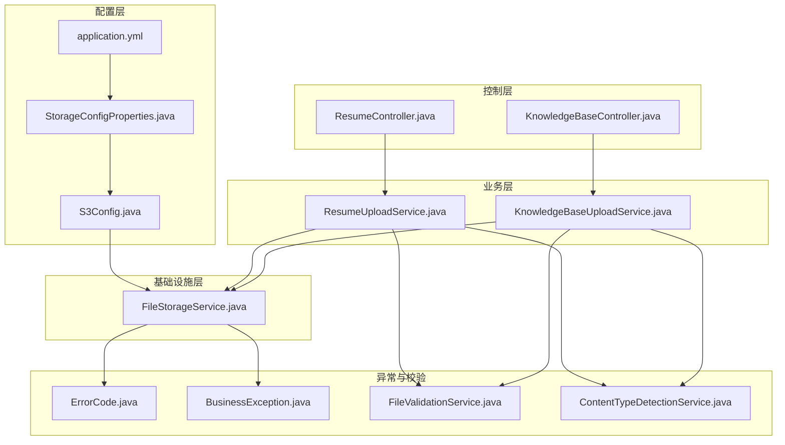

**图表来源**
- [S3Config.java:1-36](file://app/src/main/java/interview/guide/common/config/S3Config.java#L1-L36)
- [StorageConfigProperties.java:1-21](file://app/src/main/java/interview/guide/common/config/StorageConfigProperties.java#L1-L21)
- [application.yml:182-189](file://app/src/main/resources/application.yml#L182-L189)
- [FileStorageService.java:1-280](file://app/src/main/java/interview/guide/infrastructure/file/FileStorageService.java#L1-L280)
- [ResumeUploadService.java:1-201](file://app/src/main/java/interview/guide/modules/resume/service/ResumeUploadService.java#L1-L201)
- [KnowledgeBaseUploadService.java:1-145](file://app/src/main/java/interview/guide/modules/knowledgebase/service/KnowledgeBaseUploadService.java#L1-L145)
- [ResumeController.java:1-132](file://app/src/main/java/interview/guide/modules/resume/ResumeController.java#L1-L132)
- [KnowledgeBaseController.java:1-211](file://app/src/main/java/interview/guide/modules/knowledgebase/KnowledgeBaseController.java#L1-L211)
- [ErrorCode.java:1-81](file://app/src/main/java/interview/guide/common/exception/ErrorCode.java#L1-L81)
- [BusinessException.java:1-50](file://app/src/main/java/interview/guide/common/exception/BusinessException.java#L1-L50)
- [FileValidationService.java:46-81](file://app/src/main/java/interview/guide/infrastructure/file/FileValidationService.java#L46-L81)
- [ContentTypeDetectionService.java:41-82](file://app/src/main/java/interview/guide/infrastructure/file/ContentTypeDetectionService.java#L41-L82)

**章节来源**
- [S3Config.java:1-36](file://app/src/main/java/interview/guide/common/config/S3Config.java#L1-L36)
- [StorageConfigProperties.java:1-21](file://app/src/main/java/interview/guide/common/config/StorageConfigProperties.java#L1-L21)
- [application.yml:182-189](file://app/src/main/resources/application.yml#L182-L189)

## 核心组件
- S3Client配置：通过静态凭证、区域与端点覆盖构建S3Client，强制路径风格访问以适配RustFS。
- 存储配置属性：集中管理endpoint、accessKey、secretKey、bucket、region等配置项。
- 文件存储服务：封装上传、下载、删除、存在性检查、元数据获取、桶管理、URL生成与文件键生成策略。
- 业务服务：简历与知识库上传服务，调用文件存储服务完成对象存储操作。
- 控制器：对外提供REST接口，驱动业务服务执行具体操作。
- 异常与校验：统一错误码与业务异常，文件类型检测与验证。

**章节来源**
- [FileStorageService.java:1-280](file://app/src/main/java/interview/guide/infrastructure/file/FileStorageService.java#L1-L280)
- [ResumeUploadService.java:1-201](file://app/src/main/java/interview/guide/modules/resume/service/ResumeUploadService.java#L1-L201)
- [KnowledgeBaseUploadService.java:1-145](file://app/src/main/java/interview/guide/modules/knowledgebase/service/KnowledgeBaseUploadService.java#L1-L145)
- [ResumeController.java:1-132](file://app/src/main/java/interview/guide/modules/resume/ResumeController.java#L1-L132)
- [KnowledgeBaseController.java:1-211](file://app/src/main/java/interview/guide/modules/knowledgebase/KnowledgeBaseController.java#L1-L211)
- [ErrorCode.java:1-81](file://app/src/main/java/interview/guide/common/exception/ErrorCode.java#L1-L81)
- [BusinessException.java:1-50](file://app/src/main/java/interview/guide/common/exception/BusinessException.java#L1-L50)
- [FileValidationService.java:46-81](file://app/src/main/java/interview/guide/infrastructure/file/FileValidationService.java#L46-L81)
- [ContentTypeDetectionService.java:41-82](file://app/src/main/java/interview/guide/infrastructure/file/ContentTypeDetectionService.java#L41-L82)

## 架构总览
S3存储集成遵循“配置-服务-业务-控制”的分层设计，S3Client作为底层依赖被注入到FileStorageService，业务层服务通过FileStorageService完成对象存储操作，控制器负责接收请求并返回结果。

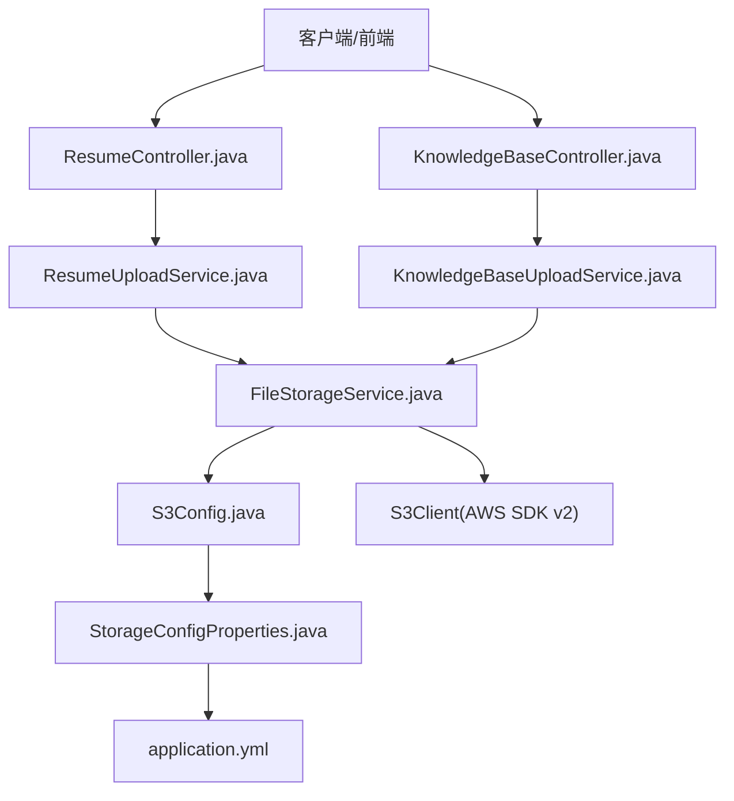

**图表来源**
- [ResumeController.java:44-54](file://app/src/main/java/interview/guide/modules/resume/ResumeController.java#L44-L54)
- [KnowledgeBaseController.java:145-153](file://app/src/main/java/interview/guide/modules/knowledgebase/KnowledgeBaseController.java#L145-L153)
- [ResumeUploadService.java:81-84](file://app/src/main/java/interview/guide/modules/resume/service/ResumeUploadService.java#L81-L84)
- [KnowledgeBaseUploadService.java:74-76](file://app/src/main/java/interview/guide/modules/knowledgebase/service/KnowledgeBaseUploadService.java#L74-L76)
- [FileStorageService.java:32-33](file://app/src/main/java/interview/guide/infrastructure/file/FileStorageService.java#L32-L33)
- [S3Config.java:22-35](file://app/src/main/java/interview/guide/common/config/S3Config.java#L22-L35)
- [StorageConfigProperties.java:13-20](file://app/src/main/java/interview/guide/common/config/StorageConfigProperties.java#L13-L20)
- [application.yml:182-189](file://app/src/main/resources/application.yml#L182-L189)

## 详细组件分析

### S3Client配置与连接参数
- 凭证：使用静态凭证提供者，从配置属性读取accessKey与secretKey。
- 区域：从配置属性读取region，默认值为us-east-1。
- 端点：通过endpointOverride覆盖默认端点，适配RustFS。
- 访问风格：强制路径风格访问，避免虚拟主机风格导致的DNS解析问题。
- 生命周期：Spring容器管理S3Client Bean，全局复用。

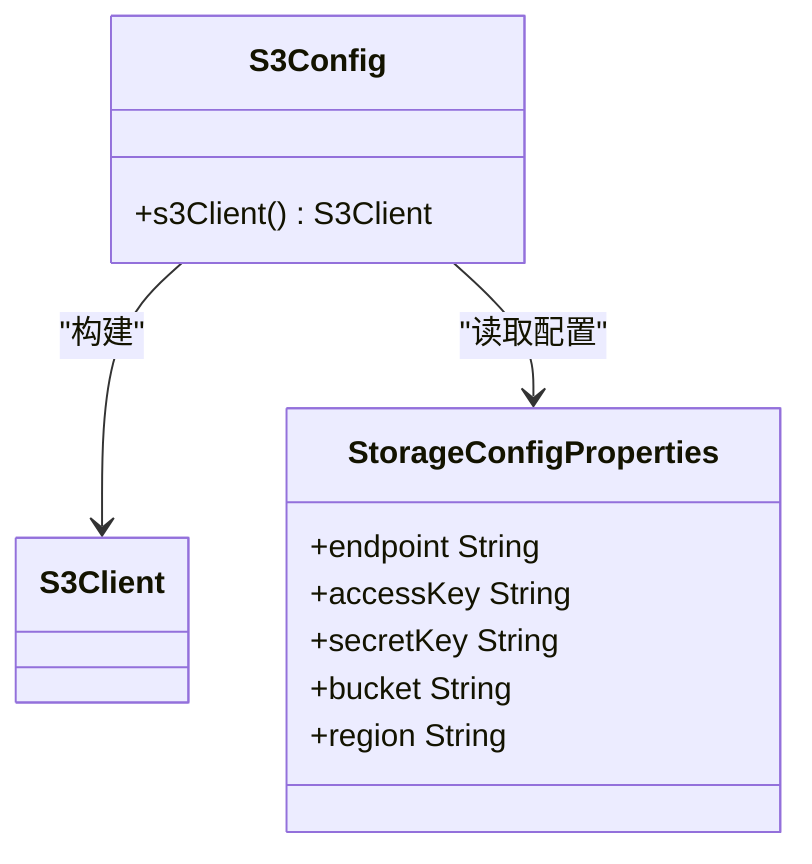

**图表来源**
- [S3Config.java:22-35](file://app/src/main/java/interview/guide/common/config/S3Config.java#L22-L35)
- [StorageConfigProperties.java:13-20](file://app/src/main/java/interview/guide/common/config/StorageConfigProperties.java#L13-L20)

**章节来源**
- [S3Config.java:1-36](file://app/src/main/java/interview/guide/common/config/S3Config.java#L1-L36)
- [StorageConfigProperties.java:1-21](file://app/src/main/java/interview/guide/common/config/StorageConfigProperties.java#L1-L21)
- [application.yml:182-189](file://app/src/main/resources/application.yml#L182-L189)

### 文件上传流程
- MultipartFile处理：从请求中获取原始文件名、内容类型与大小。
- 请求构建：构造PutObjectRequest，设置bucket、key、contentType与contentLength。
- 数据传输：使用RequestBody.fromInputStream将MultipartFile的输入流写入S3。
- 错误处理：捕获IO异常与S3异常，抛出统一业务异常。

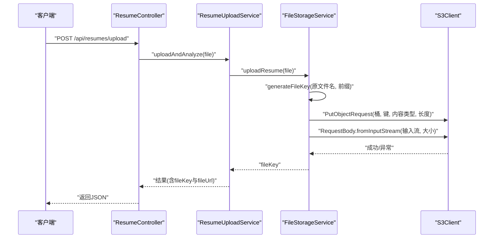

**图表来源**
- [ResumeController.java:44-54](file://app/src/main/java/interview/guide/modules/resume/ResumeController.java#L44-L54)
- [ResumeUploadService.java:47-110](file://app/src/main/java/interview/guide/modules/resume/service/ResumeUploadService.java#L47-L110)
- [FileStorageService.java:89-111](file://app/src/main/java/interview/guide/infrastructure/file/FileStorageService.java#L89-L111)

**章节来源**
- [FileStorageService.java:89-111](file://app/src/main/java/interview/guide/infrastructure/file/FileStorageService.java#L89-L111)
- [ResumeUploadService.java:79-84](file://app/src/main/java/interview/guide/modules/resume/service/ResumeUploadService.java#L79-L84)

### 文件下载实现
- 存在性检查：先通过HeadObject确认文件存在，不存在则抛出业务异常。
- 请求构建：构造GetObjectRequest，设置bucket与key。
- 数据返回：使用getObjectAsBytes获取字节数组。
- 异常处理：捕获S3异常并包装为业务异常。

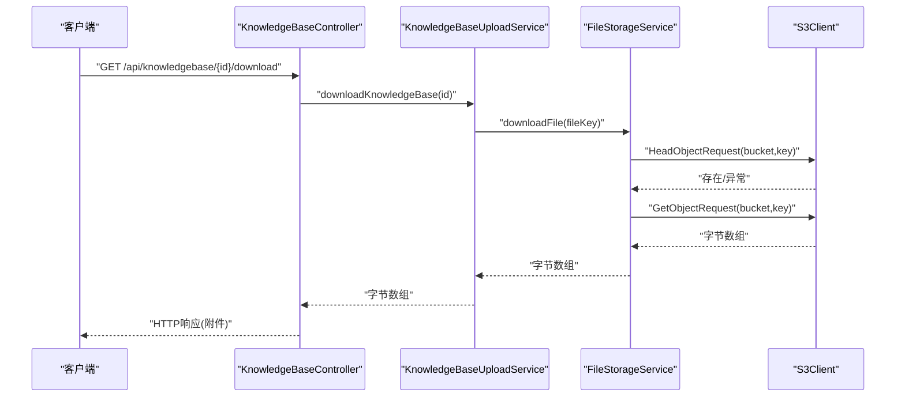

**图表来源**
- [KnowledgeBaseController.java:158-174](file://app/src/main/java/interview/guide/modules/knowledgebase/KnowledgeBaseController.java#L158-L174)
- [KnowledgeBaseUploadService.java:129-142](file://app/src/main/java/interview/guide/modules/knowledgebase/service/KnowledgeBaseUploadService.java#L129-L142)
- [FileStorageService.java:69-84](file://app/src/main/java/interview/guide/infrastructure/file/FileStorageService.java#L69-L84)

**章节来源**
- [FileStorageService.java:69-84](file://app/src/main/java/interview/guide/infrastructure/file/FileStorageService.java#L69-L84)
- [KnowledgeBaseController.java:158-174](file://app/src/main/java/interview/guide/modules/knowledgebase/KnowledgeBaseController.java#L158-L174)

### 文件删除操作
- 参数校验：空键直接返回，避免无效删除。
- 存在性检查：调用fileExists进行前置检查，避免不必要的删除。
- 请求构建：构造DeleteObjectRequest，设置bucket与key。
- 异常处理：捕获S3异常并包装为业务异常。

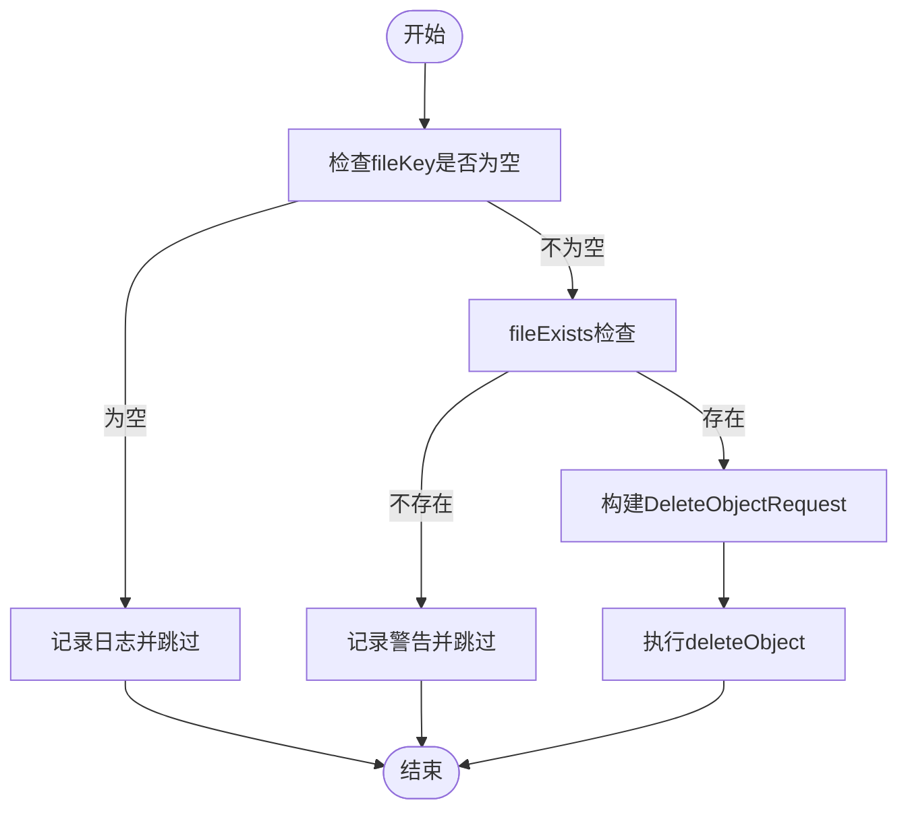

**图表来源**
- [FileStorageService.java:151-175](file://app/src/main/java/interview/guide/infrastructure/file/FileStorageService.java#L151-L175)

**章节来源**
- [FileStorageService.java:151-175](file://app/src/main/java/interview/guide/infrastructure/file/FileStorageService.java#L151-L175)

### 文件存在性检查与元数据获取
- 存在性检查：使用HeadObjectRequest，捕获NoSuchKey异常返回false，其他S3异常记录告警。
- 元数据获取：使用HeadObjectRequest获取contentLength。
- URL生成：拼接endpoint、bucket与fileKey生成可访问URL。

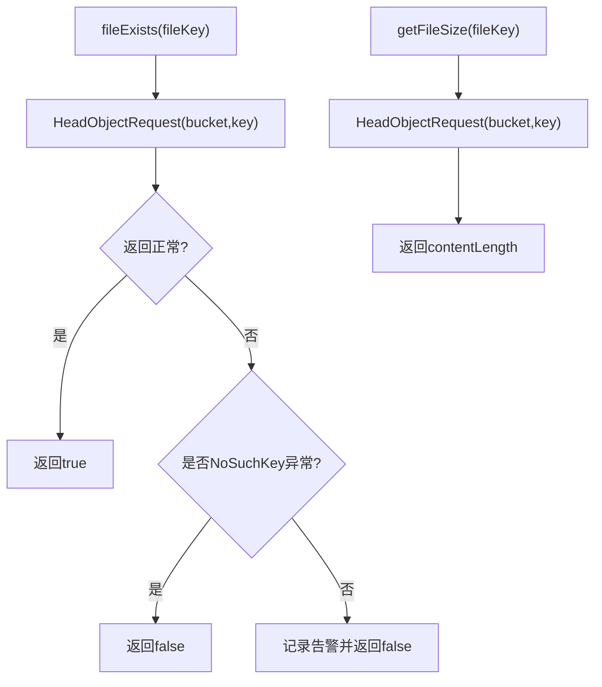

**图表来源**
- [FileStorageService.java:116-146](file://app/src/main/java/interview/guide/infrastructure/file/FileStorageService.java#L116-L146)

**章节来源**
- [FileStorageService.java:116-146](file://app/src/main/java/interview/guide/infrastructure/file/FileStorageService.java#L116-L146)

### 存储桶管理
- 桶存在性检查：使用HeadBucketRequest，若抛出NoSuchBucket异常则进入创建流程。
- 自动创建：使用CreateBucketRequest创建桶。
- 异常处理：捕获S3异常并记录错误日志。

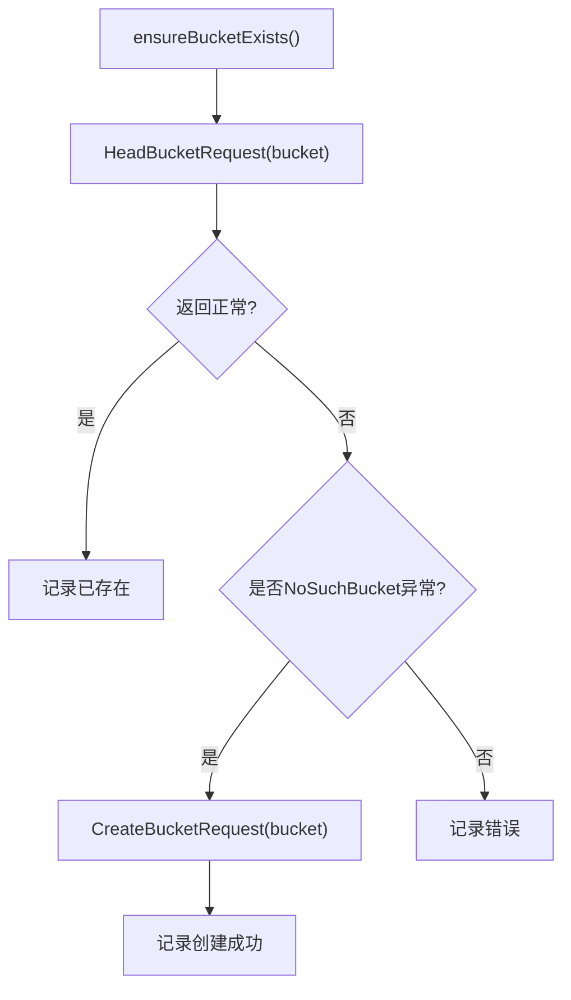

**图表来源**
- [FileStorageService.java:184-201](file://app/src/main/java/interview/guide/infrastructure/file/FileStorageService.java#L184-L201)

**章节来源**
- [FileStorageService.java:184-201](file://app/src/main/java/interview/guide/infrastructure/file/FileStorageService.java#L184-L201)

### 文件键生成策略
- 时间路径组织：按“年/月/日”组织目录层级，便于归档与清理。
- 唯一标识：使用UUID前缀（截断至8位）保证键唯一性。
- 文件名清理：将中文转为拼音（大驼峰），保留字母、数字、点号、下划线与连字符，其余替换为下划线，避免S3存储问题。
- 前缀区分：简历与知识库分别使用不同前缀，便于分类管理。

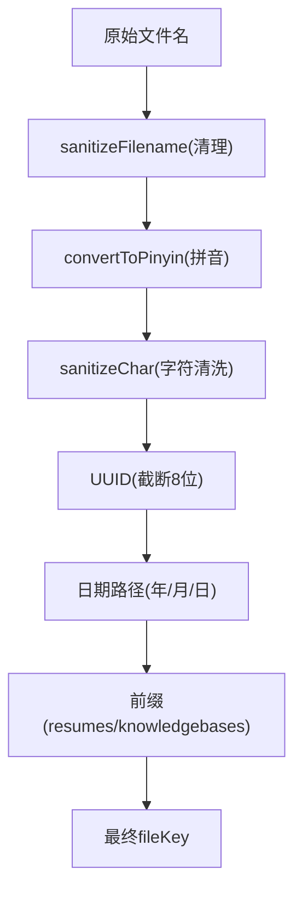

**图表来源**
- [FileStorageService.java:206-212](file://app/src/main/java/interview/guide/infrastructure/file/FileStorageService.java#L206-L212)
- [FileStorageService.java:223-257](file://app/src/main/java/interview/guide/infrastructure/file/FileStorageService.java#L223-L257)
- [FileStorageService.java:262-268](file://app/src/main/java/interview/guide/infrastructure/file/FileStorageService.java#L262-L268)
- [FileStorageService.java:273-278](file://app/src/main/java/interview/guide/infrastructure/file/FileStorageService.java#L273-L278)

**章节来源**
- [FileStorageService.java:206-212](file://app/src/main/java/interview/guide/infrastructure/file/FileStorageService.java#L206-L212)
- [FileStorageService.java:223-257](file://app/src/main/java/interview/guide/infrastructure/file/FileStorageService.java#L223-L257)
- [FileStorageService.java:262-268](file://app/src/main/java/interview/guide/infrastructure/file/FileStorageService.java#L262-L268)
- [FileStorageService.java:273-278](file://app/src/main/java/interview/guide/infrastructure/file/FileStorageService.java#L273-L278)

### 业务集成与控制器交互
- 简历上传：控制器接收multipart文件，调用业务服务，业务服务调用文件存储服务完成上传并生成URL，随后异步进行分析。
- 知识库上传：控制器接收multipart文件，调用业务服务，业务服务调用文件存储服务完成上传并生成URL，随后异步进行向量化。

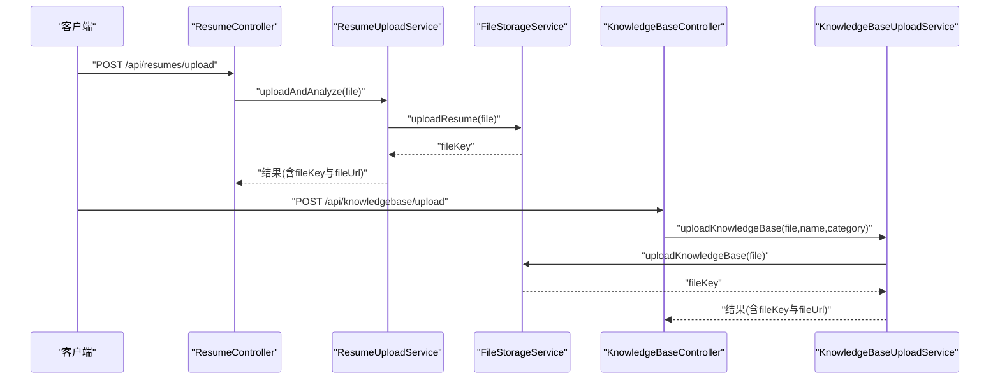

**图表来源**
- [ResumeController.java:44-54](file://app/src/main/java/interview/guide/modules/resume/ResumeController.java#L44-L54)
- [ResumeUploadService.java:79-84](file://app/src/main/java/interview/guide/modules/resume/service/ResumeUploadService.java#L79-L84)
- [KnowledgeBaseController.java:145-153](file://app/src/main/java/interview/guide/modules/knowledgebase/KnowledgeBaseController.java#L145-L153)
- [KnowledgeBaseUploadService.java:74-76](file://app/src/main/java/interview/guide/modules/knowledgebase/service/KnowledgeBaseUploadService.java#L74-L76)

**章节来源**
- [ResumeController.java:44-54](file://app/src/main/java/interview/guide/modules/resume/ResumeController.java#L44-L54)
- [KnowledgeBaseController.java:145-153](file://app/src/main/java/interview/guide/modules/knowledgebase/KnowledgeBaseController.java#L145-L153)
- [ResumeUploadService.java:79-84](file://app/src/main/java/interview/guide/modules/resume/service/ResumeUploadService.java#L79-L84)
- [KnowledgeBaseUploadService.java:74-76](file://app/src/main/java/interview/guide/modules/knowledgebase/service/KnowledgeBaseUploadService.java#L74-L76)

## 依赖分析
- FileStorageService依赖S3Client与StorageConfigProperties，负责所有S3操作。
- 业务服务依赖FileStorageService与各类校验服务，负责业务编排。
- 控制器依赖业务服务，负责HTTP接口与响应封装。
- 异常体系提供统一错误码与业务异常包装。

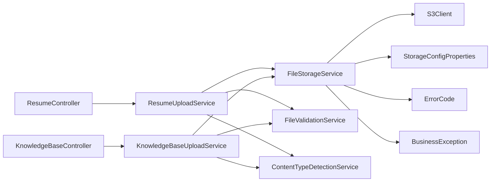

**图表来源**
- [ResumeController.java:34-36](file://app/src/main/java/interview/guide/modules/resume/ResumeController.java#L34-L36)
- [KnowledgeBaseController.java:39-42](file://app/src/main/java/interview/guide/modules/knowledgebase/KnowledgeBaseController.java#L39-L42)
- [ResumeUploadService.java:32-37](file://app/src/main/java/interview/guide/modules/resume/service/ResumeUploadService.java#L32-L37)
- [KnowledgeBaseUploadService.java:30-36](file://app/src/main/java/interview/guide/modules/knowledgebase/service/KnowledgeBaseUploadService.java#L30-L36)
- [FileStorageService.java:32-33](file://app/src/main/java/interview/guide/infrastructure/file/FileStorageService.java#L32-L33)
- [FileValidationService.java:46-81](file://app/src/main/java/interview/guide/infrastructure/file/FileValidationService.java#L46-L81)
- [ContentTypeDetectionService.java:41-82](file://app/src/main/java/interview/guide/infrastructure/file/ContentTypeDetectionService.java#L41-L82)
- [ErrorCode.java:1-81](file://app/src/main/java/interview/guide/common/exception/ErrorCode.java#L1-L81)
- [BusinessException.java:1-50](file://app/src/main/java/interview/guide/common/exception/BusinessException.java#L1-L50)

**章节来源**
- [ResumeController.java:1-132](file://app/src/main/java/interview/guide/modules/resume/ResumeController.java#L1-L132)
- [KnowledgeBaseController.java:1-211](file://app/src/main/java/interview/guide/modules/knowledgebase/KnowledgeBaseController.java#L1-L211)
- [ResumeUploadService.java:1-201](file://app/src/main/java/interview/guide/modules/resume/service/ResumeUploadService.java#L1-L201)
- [KnowledgeBaseUploadService.java:1-145](file://app/src/main/java/interview/guide/modules/knowledgebase/service/KnowledgeBaseUploadService.java#L1-L145)
- [FileStorageService.java:1-280](file://app/src/main/java/interview/guide/infrastructure/file/FileStorageService.java#L1-L280)
- [ErrorCode.java:1-81](file://app/src/main/java/interview/guide/common/exception/ErrorCode.java#L1-L81)
- [BusinessException.java:1-50](file://app/src/main/java/interview/guide/common/exception/BusinessException.java#L1-L50)
- [FileValidationService.java:46-81](file://app/src/main/java/interview/guide/infrastructure/file/FileValidationService.java#L46-L81)
- [ContentTypeDetectionService.java:41-82](file://app/src/main/java/interview/guide/infrastructure/file/ContentTypeDetectionService.java#L41-L82)

## 性能考虑
- 流式上传：使用RequestBody.fromInputStream直接从MultipartFile输入流写入，避免额外内存拷贝。
- 路径风格访问：强制路径风格访问，降低DNS解析复杂度，提高兼容性。
- 并发与线程：应用启用虚拟线程，I/O密集型场景（如S3上传/下载）受益明显。
- 连接池与超时：数据库连接池与S3客户端均采用合理配置，避免阻塞。
- 建议：
  - 对大文件上传可结合分片上传（需根据RustFS支持情况评估）。
  - 在高并发场景下，适当增加S3Client的重试与超时配置。
  - 对热点文件可考虑CDN或对象缓存策略（视部署环境而定）。

[本节为通用性能建议，无需特定文件引用]

## 故障排查指南
- 上传失败：检查S3异常与IO异常分支，关注统一业务异常的错误码与消息。
- 下载失败：确认文件存在性检查逻辑与异常处理分支。
- 删除失败：确认fileExists前置检查与DeleteObjectRequest参数。
- 桶不存在：调用ensureBucketExists进行自动创建，观察日志。
- 文件名乱码：检查文件名清理逻辑与字符替换规则。
- 统一异常：通过ErrorCode与BusinessException定位错误类型与消息。

**章节来源**
- [FileStorageService.java:69-111](file://app/src/main/java/interview/guide/infrastructure/file/FileStorageService.java#L69-L111)
- [FileStorageService.java:151-175](file://app/src/main/java/interview/guide/infrastructure/file/FileStorageService.java#L151-L175)
- [FileStorageService.java:184-201](file://app/src/main/java/interview/guide/infrastructure/file/FileStorageService.java#L184-L201)
- [ErrorCode.java:41-45](file://app/src/main/java/interview/guide/common/exception/ErrorCode.java#L41-L45)
- [BusinessException.java:14-48](file://app/src/main/java/interview/guide/common/exception/BusinessException.java#L14-L48)

## 结论
本S3存储集成方案通过清晰的分层设计与完善的异常处理，实现了简历与知识库文件的可靠上传、下载、删除与管理。配置层提供灵活的端点与凭证管理，服务层封装了完整的对象存储操作，业务层与控制层负责对外接口与业务编排。配合文件键生成策略与存在性检查，整体具备良好的安全性与可维护性。建议在生产环境中结合实际部署情况进一步完善重试、超时与监控策略。

[本节为总结性内容，无需特定文件引用]

## 附录
- 配置项说明（来自application.yml与StorageConfigProperties）：
  - endpoint：S3兼容服务端点
  - access-key/secret-key：访问凭证
  - bucket：默认存储桶
  - region：区域（默认us-east-1）

**章节来源**
- [application.yml:182-189](file://app/src/main/resources/application.yml#L182-L189)
- [StorageConfigProperties.java:13-20](file://app/src/main/java/interview/guide/common/config/StorageConfigProperties.java#L13-L20)