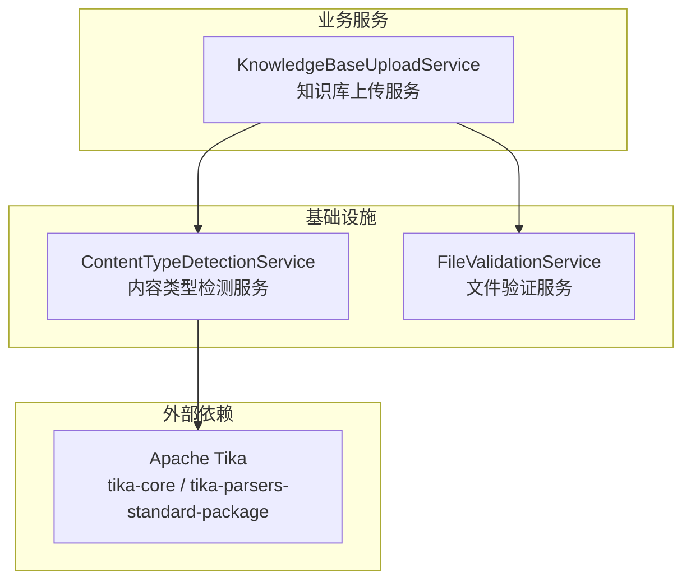
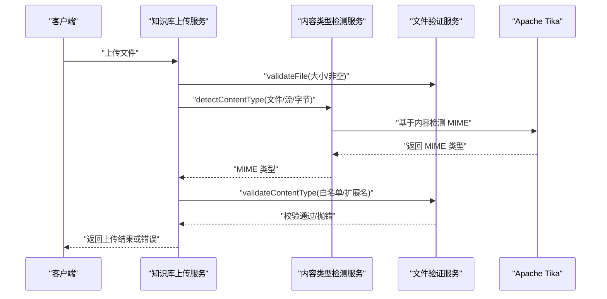
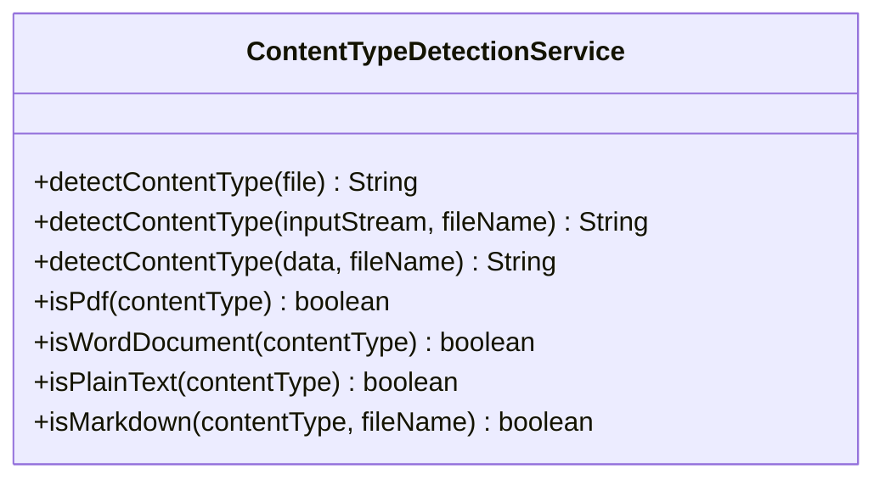
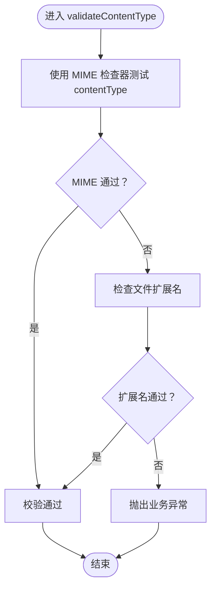
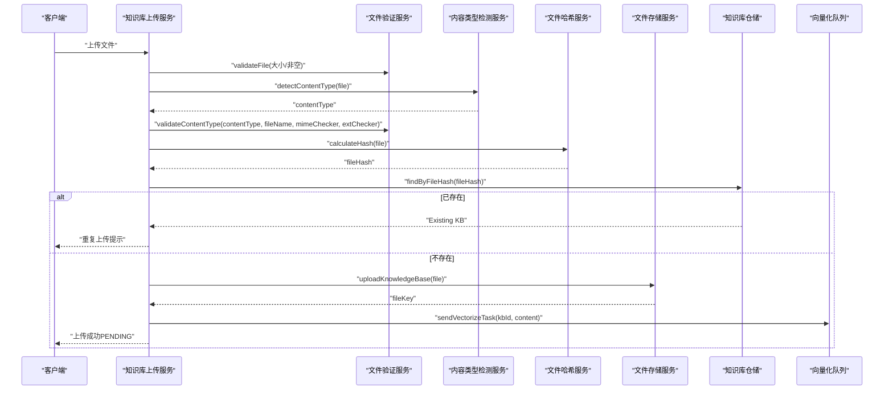
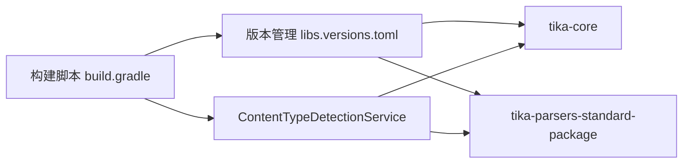

# 内容类型检测

<cite>
**本文引用的文件**
- [ContentTypeDetectionService.java](file://app/src/main/java/interview/guide/infrastructure/file/ContentTypeDetectionService.java)
- [FileValidationService.java](file://app/src/main/java/interview/guide/infrastructure/file/FileValidationService.java)
- [KnowledgeBaseUploadService.java](file://app/src/main/java/interview/guide/modules/knowledgebase/service/KnowledgeBaseUploadService.java)
- [build.gradle](file://app/build.gradle)
- [libs.versions.toml](file://gradle/libs.versions.toml)
</cite>

## 目录
1. [简介](#简介)
2. [项目结构](#项目结构)
3. [核心组件](#核心组件)
4. [架构总览](#架构总览)
5. [详细组件分析](#详细组件分析)
6. [依赖分析](#依赖分析)
7. [性能考量](#性能考量)
8. [故障排查指南](#故障排查指南)
9. [结论](#结论)
10. [附录](#附录)

## 简介
本文件围绕内容类型检测服务展开，系统性阐述基于 Apache Tika 的 MIME 类型检测实现原理与工程化实践，覆盖文件头识别、扩展名匹配、内容分析等多级检测机制；说明图像、文档、音视频、压缩包等常见类型检测策略；给出文件验证流程（大小限制、格式白名单、安全字符过滤）与内容类型映射设计；解释检测算法的准确性保障（魔数验证、元数据检查、启发式分析）；讨论缓存与性能优化、失败回退策略以及安全防护。

## 项目结构
内容类型检测能力由后端基础设施模块提供，主要涉及以下文件：
- 内容类型检测服务：负责基于内容的 MIME 类型判定与常用类型判断
- 文件验证服务：负责大小限制、格式白名单校验、扩展名辅助校验
- 知识库上传服务：在业务层调用上述能力，完成上传前的综合校验与处理
- 构建脚本与依赖声明：引入 Apache Tika 核心与标准解析包

图表来源
- [ContentTypeDetectionService.java:1-110](file://app/src/main/java/interview/guide/infrastructure/file/ContentTypeDetectionService.java#L1-L110)
- [FileValidationService.java:1-129](file://app/src/main/java/interview/guide/infrastructure/file/FileValidationService.java#L1-L129)
- [KnowledgeBaseUploadService.java:1-145](file://app/src/main/java/interview/guide/modules/knowledgebase/service/KnowledgeBaseUploadService.java#L1-L145)
- [build.gradle:46-48](file://app/build.gradle#L46-L48)
- [libs.versions.toml:20-21](file://gradle/libs.versions.toml#L20-L21)

章节来源
- [ContentTypeDetectionService.java:1-110](file://app/src/main/java/interview/guide/infrastructure/file/ContentTypeDetectionService.java#L1-L110)
- [FileValidationService.java:1-129](file://app/src/main/java/interview/guide/infrastructure/file/FileValidationService.java#L1-L129)
- [KnowledgeBaseUploadService.java:1-145](file://app/src/main/java/interview/guide/modules/knowledgebase/service/KnowledgeBaseUploadService.java#L1-L145)
- [build.gradle:46-48](file://app/build.gradle#L46-L48)
- [libs.versions.toml:20-21](file://gradle/libs.versions.toml#L20-L21)

## 核心组件
- 内容类型检测服务
  - 基于 Apache Tika 的内容检测，优先使用文件内容而非仅依赖 HTTP 头部
  - 支持 MultipartFile、InputStream、字节数组三种输入形态
  - 提供 PDF、Word、纯文本、Markdown 等常用类型判断方法
  - 异常时回退至文件的 Content-Type 或二进制流类型
- 文件验证服务
  - 统一的文件基础属性校验（非空、大小上限）
  - 基于 MIME 类型列表的白名单校验（支持模糊匹配）
  - 基于 MIME 类型与扩展名的双因子校验（先 MIME，后扩展名）
  - 知识库场景专用的 MIME 类型集合判断
- 知识库上传服务
  - 在上传流程中串联“文件基础校验 → 内容类型检测 → 白名单校验 → 去重 → 解析 → 存储 → 入队向量化”的完整链路

章节来源
- [ContentTypeDetectionService.java:25-66](file://app/src/main/java/interview/guide/infrastructure/file/ContentTypeDetectionService.java#L25-L66)
- [ContentTypeDetectionService.java:71-108](file://app/src/main/java/interview/guide/infrastructure/file/ContentTypeDetectionService.java#L71-L108)
- [FileValidationService.java:27-93](file://app/src/main/java/interview/guide/infrastructure/file/FileValidationService.java#L27-L93)
- [FileValidationService.java:61-77](file://app/src/main/java/interview/guide/infrastructure/file/FileValidationService.java#L61-L77)
- [FileValidationService.java:112-126](file://app/src/main/java/interview/guide/infrastructure/file/FileValidationService.java#L112-L126)
- [KnowledgeBaseUploadService.java:48-115](file://app/src/main/java/interview/guide/modules/knowledgebase/service/KnowledgeBaseUploadService.java#L48-L115)

## 架构总览
下图展示从上传入口到内容类型检测与验证的整体流程，以及与 Apache Tika 的交互关系：

图表来源
- [KnowledgeBaseUploadService.java:48-115](file://app/src/main/java/interview/guide/modules/knowledgebase/service/KnowledgeBaseUploadService.java#L48-L115)
- [ContentTypeDetectionService.java:32-54](file://app/src/main/java/interview/guide/infrastructure/file/ContentTypeDetectionService.java#L32-L54)
- [FileValidationService.java:45-77](file://app/src/main/java/interview/guide/infrastructure/file/FileValidationService.java#L45-L77)

## 详细组件分析

### 内容类型检测服务（ContentTypeDetectionService）
- 设计要点
  - 以 Apache Tika 为核心，优先基于文件内容进行 MIME 类型判定，提升准确性
  - 提供多种输入适配：MultipartFile、InputStream、字节数组
  - 对异常进行优雅回退：IO 异常时记录告警并回退到文件的 Content-Type 或二进制类型
  - 提供常用类型判断方法，便于上层快速分支处理
- 关键方法与行为
  - detectContentType(MultipartFile): 基于输入流与原始文件名检测 MIME
  - detectContentType(InputStream, String): 基于输入流与可选文件名检测
  - detectContentType(byte[], String): 基于字节数组与可选文件名检测
  - isPdf/isWordDocument/isPlainText/isMarkdown: 常用类型判断
- 容错与回退
  - IO 异常时记录警告日志，并回退到文件的 Content-Type 或二进制类型，避免中断流程

图表来源
- [ContentTypeDetectionService.java:17-108](file://app/src/main/java/interview/guide/infrastructure/file/ContentTypeDetectionService.java#L17-L108)

章节来源
- [ContentTypeDetectionService.java:19-23](file://app/src/main/java/interview/guide/infrastructure/file/ContentTypeDetectionService.java#L19-L23)
- [ContentTypeDetectionService.java:32-54](file://app/src/main/java/interview/guide/infrastructure/file/ContentTypeDetectionService.java#L32-L54)
- [ContentTypeDetectionService.java:64-66](file://app/src/main/java/interview/guide/infrastructure/file/ContentTypeDetectionService.java#L64-L66)
- [ContentTypeDetectionService.java:71-108](file://app/src/main/java/interview/guide/infrastructure/file/ContentTypeDetectionService.java#L71-L108)

### 文件验证服务（FileValidationService）
- 设计要点
  - 统一的文件基础属性校验：空文件与大小上限
  - 基于 MIME 类型列表的白名单校验，支持模糊匹配（子串包含）
  - 双因子校验：优先 MIME 类型，若不满足再检查扩展名
  - 知识库场景专用的 MIME 类型集合判断，覆盖 PDF、DOC/DOCX、TXT、Markdown、RTF 等
- 关键方法与行为
  - validateFile(MultipartFile, maxSizeBytes, typeDesc): 校验空文件与大小
  - validateContentTypeByList(contentType, allowedTypes, msg): 白名单校验（模糊匹配）
  - validateContentType(contentType, fileName, mimeChecker, extChecker, msg): 双因子校验
  - isKnowledgeBaseMimeType(contentType): 知识库支持的 MIME 类型集合判断
  - isMarkdownExtension(fileName): 扩展名辅助判断（.md/.markdown/.mdown）

图表来源
- [FileValidationService.java:61-77](file://app/src/main/java/interview/guide/infrastructure/file/FileValidationService.java#L61-L77)

章节来源
- [FileValidationService.java:27-36](file://app/src/main/java/interview/guide/infrastructure/file/FileValidationService.java#L27-L36)
- [FileValidationService.java:45-50](file://app/src/main/java/interview/guide/infrastructure/file/FileValidationService.java#L45-L50)
- [FileValidationService.java:61-77](file://app/src/main/java/interview/guide/infrastructure/file/FileValidationService.java#L61-L77)
- [FileValidationService.java:82-93](file://app/src/main/java/interview/guide/infrastructure/file/FileValidationService.java#L82-L93)
- [FileValidationService.java:98-107](file://app/src/main/java/interview/guide/infrastructure/file/FileValidationService.java#L98-L107)
- [FileValidationService.java:112-126](file://app/src/main/java/interview/guide/infrastructure/file/FileValidationService.java#L112-L126)

### 知识库上传服务（KnowledgeBaseUploadService）
- 设计要点
  - 在上传流程中串联“基础校验 → 内容类型检测 → 白名单校验 → 去重 → 解析 → 存储 → 入队向量化”
  - 使用统一的文件大小上限（50MB），超出即拒绝
  - 通过哈希值进行重复上传检测
  - 将向量化任务异步入队，避免阻塞上传主流程
- 关键流程
  - 上传入口：接收 MultipartFile，记录原始文件名与大小
  - 内容类型检测：调用解析服务（内部使用内容类型检测服务）获取 MIME
  - 类型校验：使用文件验证服务对 MIME 与扩展名进行双因子校验
  - 去重：计算文件哈希，查询数据库是否存在相同文件
  - 解析与存储：解析文本内容，上传到对象存储，生成访问链接
  - 入队向量化：将解析后的文本内容与知识库 ID 入队，异步执行向量化

图表来源
- [KnowledgeBaseUploadService.java:48-102](file://app/src/main/java/interview/guide/modules/knowledgebase/service/KnowledgeBaseUploadService.java#L48-L102)
- [FileValidationService.java:61-77](file://app/src/main/java/interview/guide/infrastructure/file/FileValidationService.java#L61-L77)
- [ContentTypeDetectionService.java:32-38](file://app/src/main/java/interview/guide/infrastructure/file/ContentTypeDetectionService.java#L32-L38)

章节来源
- [KnowledgeBaseUploadService.java:38-102](file://app/src/main/java/interview/guide/modules/knowledgebase/service/KnowledgeBaseUploadService.java#L38-L102)
- [KnowledgeBaseUploadService.java:107-115](file://app/src/main/java/interview/guide/modules/knowledgebase/service/KnowledgeBaseUploadService.java#L107-L115)

## 依赖分析
- Apache Tika
  - 依赖声明：tika-core 与 tika-parsers-standard-package
  - 作用：提供基于文件内容的 MIME 类型检测与解析能力
- 版本管理
  - 通过版本目录统一管理 Tika 版本号，确保与 Spring Boot 4.x 兼容

图表来源
- [build.gradle:46-48](file://app/build.gradle#L46-L48)
- [libs.versions.toml:20-21](file://gradle/libs.versions.toml#L20-L21)
- [ContentTypeDetectionService.java:4](file://app/src/main/java/interview/guide/infrastructure/file/ContentTypeDetectionService.java#L4)

章节来源
- [build.gradle:46-48](file://app/build.gradle#L46-L48)
- [libs.versions.toml:20-21](file://gradle/libs.versions.toml#L20-L21)

## 性能考量
- 检测路径选择
  - 优先使用 InputStream 或字节数组进行检测，避免重复读取磁盘
  - 对于已知内容的场景，直接传入字节数组可减少 IO 开销
- 缓存策略
  - 当前实现未内置缓存；建议在高频场景下对“文件哈希→MIME”做轻量缓存（如内存缓存或 Redis），注意缓存键需包含文件名与内容，避免误判
- 并发与资源
  - Tika 检测为 CPU 密集型与 IO 并存，建议结合线程池与超时控制，防止慢文件拖垮服务
- 异步化
  - 向量化与后续处理采用异步队列，降低上传主流程延迟

[本节为通用性能建议，不直接分析具体文件，故无章节来源]

## 故障排查指南
- 常见问题与定位
  - 检测失败回退：当 IO 异常时，服务会记录警告并回退到文件的 Content-Type 或二进制类型。可通过日志确认是否发生回退
  - 白名单不通过：若 MIME 与扩展名均不满足，将抛出业务异常。请核对 allowedTypes 与文件实际类型
  - 超出大小限制：validateFile 会在大小超过阈值时报错。请检查上传文件大小与配置
- 排查步骤
  - 检查日志中关于“无法检测文件类型”的告警
  - 核对 allowedTypes 是否包含目标 MIME 或其子串
  - 确认文件扩展名是否符合预期
  - 验证文件是否被截断或损坏（影响 Tika 检测）

章节来源
- [ContentTypeDetectionService.java:35-38](file://app/src/main/java/interview/guide/infrastructure/file/ContentTypeDetectionService.java#L35-L38)
- [FileValidationService.java:45-50](file://app/src/main/java/interview/guide/infrastructure/file/FileValidationService.java#L45-L50)
- [FileValidationService.java:75-77](file://app/src/main/java/interview/guide/infrastructure/file/FileValidationService.java#L75-L77)

## 结论
本内容类型检测体系以 Apache Tika 为核心，结合文件验证服务实现了高可靠的内容类型判定与格式校验。通过“内容检测 + 扩展名辅助 + 白名单”的多层策略，显著提升了准确性与安全性。在知识库上传场景中，该体系与去重、解析、存储、异步向量化形成闭环，既保证了质量，也兼顾了性能与用户体验。

[本节为总结性内容，不直接分析具体文件，故无章节来源]

## 附录

### 文件类型检测策略（按类别）
- 图像文件
  - 建议：优先依据 MIME 类型（如 image/*）与扩展名（.jpg/.jpeg/.png/.gif/.webp）共同校验
  - 注意：部分图像可能伪装为其他类型，应结合魔数与尺寸约束进一步加固
- 文档文件
  - PDF：使用 isPdf 判断或白名单包含 pdf
  - Word：使用 isWordDocument 判断或白名单包含 msword/wordprocessingml
  - 纯文本：使用 isPlainText 判断或白名单包含 text/plain
  - Markdown：使用 isMarkdown 判断，优先 MIME，其次扩展名（.md/.markdown/.mdown）
- 音频/视频文件
  - 建议：白名单包含 audio/* 与 video/*，并结合扩展名（如 .mp3/.mp4/.avi/.mov）进行二次确认
- 压缩文件
  - 建议：白名单包含 application/zip、application/x-rar-compressed、application/x-tar 等，同时校验扩展名（.zip/.rar/.tar/.gz）

[本节为通用策略说明，不直接分析具体文件，故无章节来源]

### 内容类型映射与白名单设计
- 映射表设计
  - 基于 MIME 类型与扩展名的双向映射，优先使用 MIME 类型，扩展名作为辅助
  - 白名单采用模糊匹配（子串包含），便于兼容不同厂商的变体
- 自定义类型支持
  - 通过 allowedTypes 参数灵活扩展，支持新增类型与版本差异
  - 知识库场景的 isKnowledgeBaseMimeType 已覆盖 PDF、DOC/DOCX、TXT、Markdown、RTF 等

章节来源
- [FileValidationService.java:82-93](file://app/src/main/java/interview/guide/infrastructure/file/FileValidationService.java#L82-L93)
- [FileValidationService.java:112-126](file://app/src/main/java/interview/guide/infrastructure/file/FileValidationService.java#L112-L126)

### 准确性保障与安全考虑
- 准确性保障
  - 魔数验证：Tika 基于文件头魔数进行高精度识别，优于仅依赖头部或扩展名
  - 元数据检查：解析阶段可抽取关键元数据（如页数、分辨率、采样率）辅助判断
  - 启发式分析：结合扩展名与内容特征进行二次校验，降低误判率
- 安全考虑
  - 大小限制：统一的 max size 控制，防止恶意大文件耗尽资源
  - 格式白名单：严格限制允许的 MIME 类型，阻断未知或高风险类型
  - 安全字符过滤：建议在文件名与元数据中过滤危险字符，避免路径穿越与注入
  - 异步化与隔离：将耗时解析与向量化异步化，避免阻塞主线程

[本节为通用安全与准确性建议，不直接分析具体文件，故无章节来源]