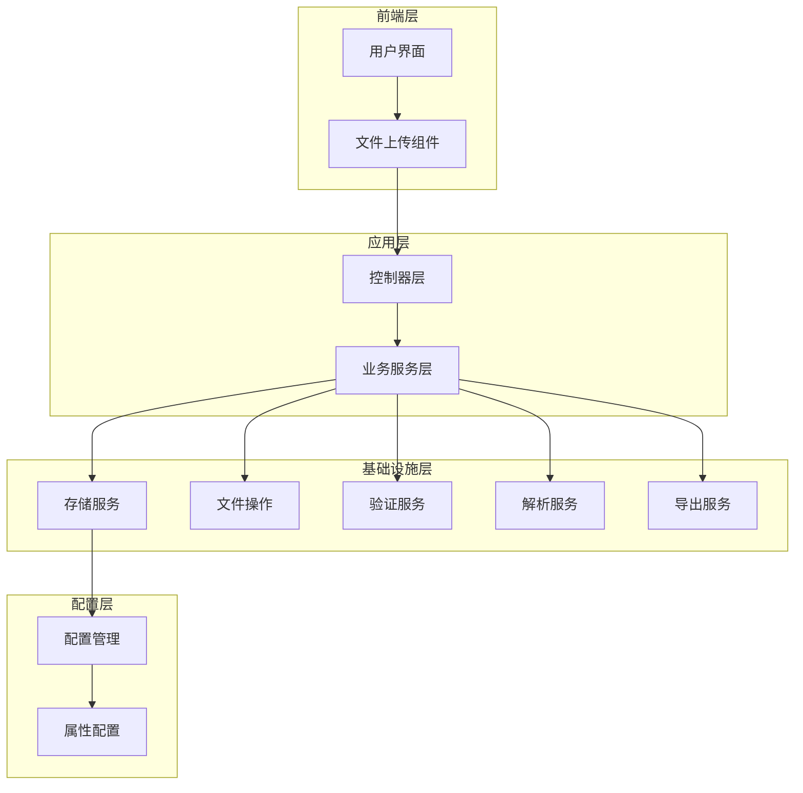
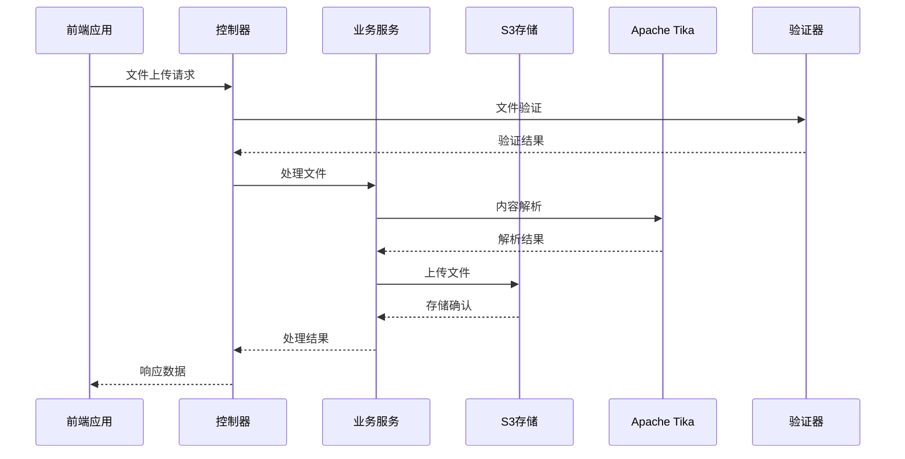
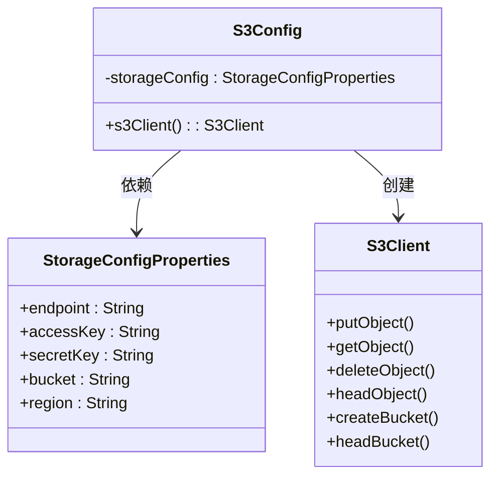
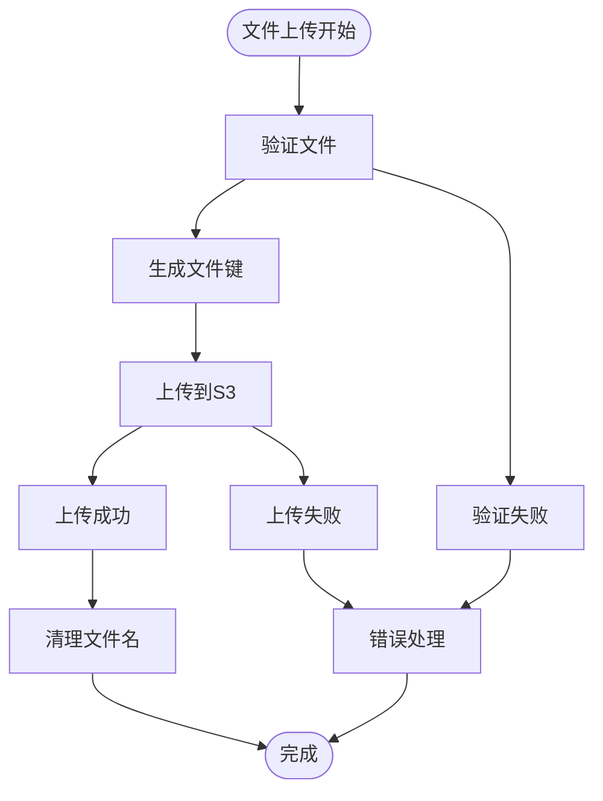
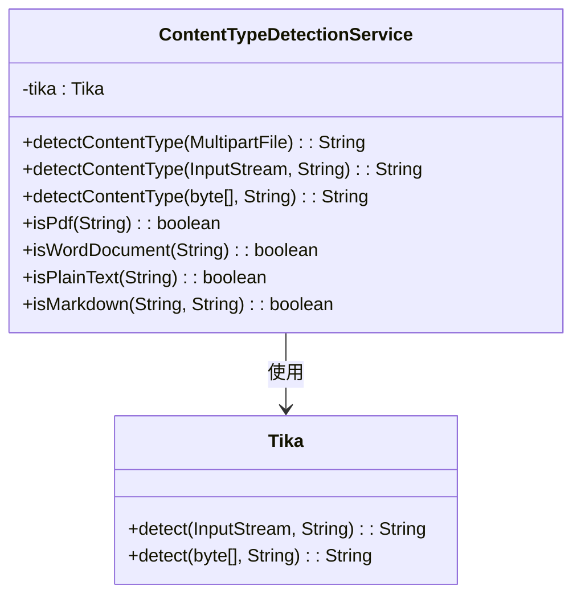
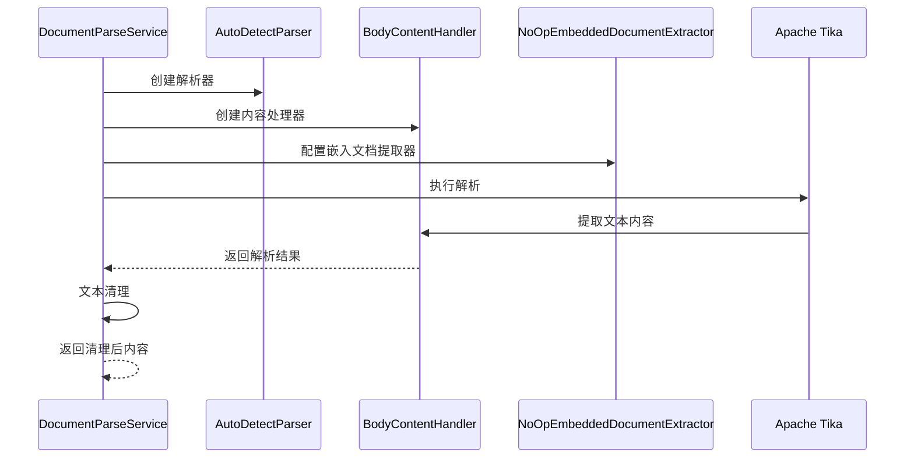
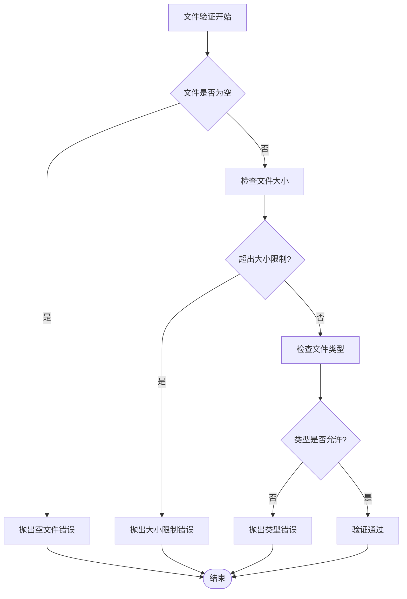
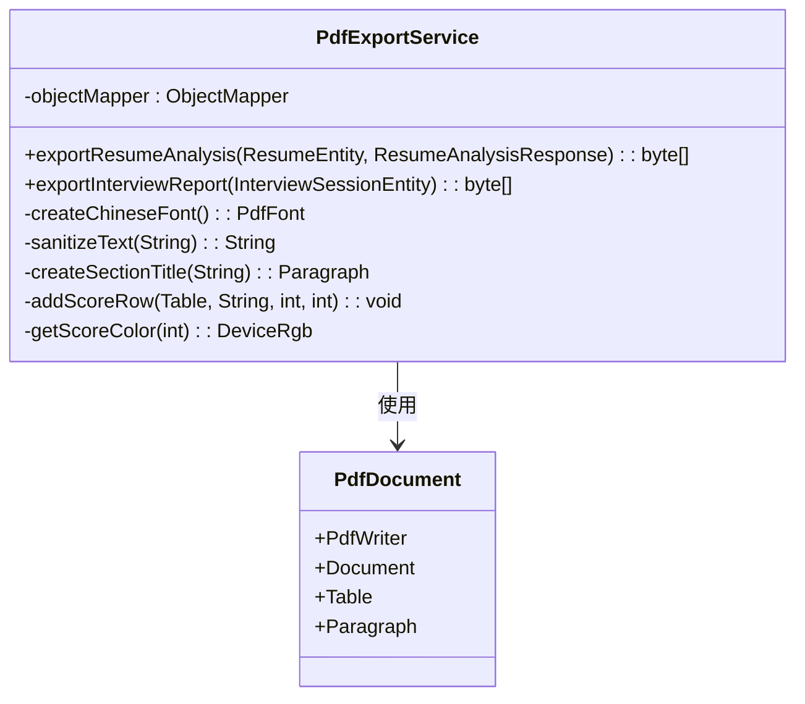
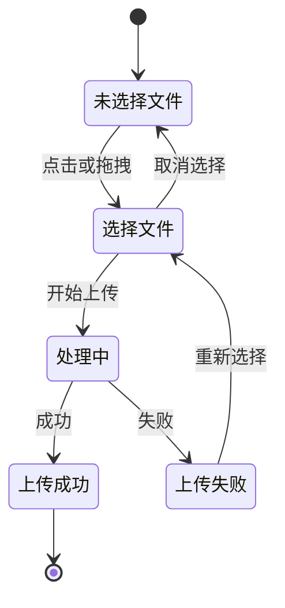
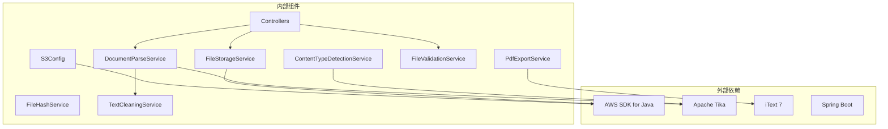

# 存储和文件管理系统

<cite>
**本文档引用的文件**
- [S3Config.java](file://app/src/main/java/interview/guide/common/config/S3Config.java)
- [StorageConfigProperties.java](file://app/src/main/java/interview/guide/common/config/StorageConfigProperties.java)
- [FileStorageService.java](file://app/src/main/java/interview/guide/infrastructure/file/FileStorageService.java)
- [ContentTypeDetectionService.java](file://app/src/main/java/interview/guide/infrastructure/file/ContentTypeDetectionService.java)
- [DocumentParseService.java](file://app/src/main/java/interview/guide/infrastructure/file/DocumentParseService.java)
- [FileHashService.java](file://app/src/main/java/interview/guide/infrastructure/file/FileHashService.java)
- [FileValidationService.java](file://app/src/main/java/interview/guide/infrastructure/file/FileValidationService.java)
- [TextCleaningService.java](file://app/src/main/java/interview/guide/infrastructure/file/TextCleaningService.java)
- [NoOpEmbeddedDocumentExtractor.java](file://app/src/main/java/interview/guide/infrastructure/file/NoOpEmbeddedDocumentExtractor.java)
- [PdfExportService.java](file://app/src/main/java/interview/guide/infrastructure/export/PdfExportService.java)
- [application.yml](file://app/src/main/resources/application.yml)
- [KnowledgeBaseController.java](file://app/src/main/java/interview/guide/modules/knowledgebase/KnowledgeBaseController.java)
- [ResumeController.java](file://app/src/main/java/interview/guide/modules/resume/ResumeController.java)
- [FileUploadCard.tsx](file://frontend/src/components/FileUploadCard.tsx)
</cite>

## 目录
1. [简介](#简介)
2. [项目结构](#项目结构)
3. [核心组件](#核心组件)
4. [架构概览](#架构概览)
5. [详细组件分析](#详细组件分析)
6. [依赖关系分析](#依赖关系分析)
7. [性能考虑](#性能考虑)
8. [故障排除指南](#故障排除指南)
9. [结论](#结论)

## 简介

存储和文件管理系统是一个基于Spring Boot构建的现代化文件管理解决方案，专门设计用于处理简历和知识库文档的存储、解析和管理。该系统采用S3兼容存储（MinIO）作为后端存储引擎，集成了Apache Tika进行文档解析，提供了完整的文件上传下载流程，以及强大的内容类型检测和文件验证功能。

系统的核心特性包括：
- S3兼容存储集成（MinIO配置和管理）
- 多格式文档解析（PDF、DOCX、DOC、TXT、MD等）
- 内容类型智能检测
- 文件验证和安全检查
- 文件哈希去重
- PDF导出功能
- 前后端一体化的文件上传组件

## 项目结构

该项目采用模块化的Maven项目结构，主要分为以下几个核心部分：



**图表来源**
- [S3Config.java:1-37](file://app/src/main/java/interview/guide/common/config/S3Config.java#L1-L37)
- [FileStorageService.java:1-280](file://app/src/main/java/interview/guide/infrastructure/file/FileStorageService.java#L1-L280)

**章节来源**
- [application.yml:1-282](file://app/src/main/resources/application.yml#L1-L282)

## 核心组件

### S3存储配置系统

系统通过S3Config类实现了完整的S3兼容存储配置，支持MinIO等S3兼容的对象存储服务。

**关键特性：**
- 动态端点配置支持
- 凭据安全管理
- 区域和桶管理
- 路径风格访问支持

### 文件存储服务

FileStorageService提供了完整的文件存储操作，包括上传、下载、删除和存在性检查。

**核心功能：**
- 多类型文件上传（简历、知识库）
- 自动文件名生成和清理
- 存储桶存在性检查
- 文件元数据管理

### 内容类型检测

ContentTypeDetectionService使用Apache Tika进行精确的MIME类型检测，确保文件类型的准确性。

**检测能力：**
- 基于内容的MIME类型识别
- 多格式支持（PDF、DOCX、TXT、MD等）
- 智能文件扩展名判断

### 文档解析服务

DocumentParseService集成了Apache Tika的强大解析能力，支持多种文档格式的内容提取。

**解析特性：**
- 流式解析避免内存溢出
- 嵌入文档提取禁用
- 文本内容清理和规范化
- PDF专用配置优化

**章节来源**
- [S3Config.java:1-37](file://app/src/main/java/interview/guide/common/config/S3Config.java#L1-L37)
- [FileStorageService.java:1-280](file://app/src/main/java/interview/guide/infrastructure/file/FileStorageService.java#L1-L280)
- [ContentTypeDetectionService.java:1-110](file://app/src/main/java/interview/guide/infrastructure/file/ContentTypeDetectionService.java#L1-L110)
- [DocumentParseService.java:1-164](file://app/src/main/java/interview/guide/infrastructure/file/DocumentParseService.java#L1-L164)

## 架构概览

系统采用分层架构设计，确保了良好的可维护性和扩展性：



**图表来源**
- [KnowledgeBaseController.java:145-153](file://app/src/main/java/interview/guide/modules/knowledgebase/KnowledgeBaseController.java#L145-L153)
- [ResumeController.java:44-54](file://app/src/main/java/interview/guide/modules/resume/ResumeController.java#L44-L54)

## 详细组件分析

### S3存储配置组件

S3Config类实现了Spring Boot的@Configuration类，负责创建和配置S3Client实例。



**图表来源**
- [S3Config.java:1-37](file://app/src/main/java/interview/guide/common/config/S3Config.java#L1-L37)
- [StorageConfigProperties.java:1-21](file://app/src/main/java/interview/guide/common/config/StorageConfigProperties.java#L1-L21)

**实现要点：**
- 使用静态凭据提供者确保安全性
- 支持自定义端点和区域配置
- 启用路径风格访问解决DNS问题
- 集成错误处理和日志记录

### 文件存储服务组件

FileStorageService提供了完整的文件存储操作，是系统的核心组件之一。



**图表来源**
- [FileStorageService.java:89-111](file://app/src/main/java/interview/guide/infrastructure/file/FileStorageService.java#L89-L111)

**核心功能：**
- 文件上传和下载操作
- 文件存在性检查
- 存储桶管理
- 文件元数据获取

### 内容类型检测组件

ContentTypeDetectionService使用Apache Tika进行精确的文件类型检测。



**图表来源**
- [ContentTypeDetectionService.java:1-110](file://app/src/main/java/interview/guide/infrastructure/file/ContentTypeDetectionService.java#L1-L110)

**检测策略：**
- 基于文件内容的MIME类型检测
- 多层次验证机制
- 智能文件扩展名辅助判断

### 文档解析服务组件

DocumentParseService集成了Apache Tika的强大解析能力，支持多种文档格式。



**图表来源**
- [DocumentParseService.java:108-139](file://app/src/main/java/interview/guide/infrastructure/file/DocumentParseService.java#L108-L139)

**解析优化：**
- 流式处理避免内存溢出
- 禁用嵌入文档解析提高性能
- PDF专用配置优化
- 最大文本长度限制

### 文件验证服务组件

FileValidationService提供了全面的文件验证功能，确保文件的安全性和合规性。



**图表来源**
- [FileValidationService.java:27-36](file://app/src/main/java/interview/guide/infrastructure/file/FileValidationService.java#L27-L36)

**验证规则：**
- 文件大小限制检查
- MIME类型白名单验证
- 文件扩展名辅助验证
- 自定义类型检查器支持

### 文件哈希服务组件

FileHashService提供了统一的文件哈希计算功能，用于文件去重和完整性验证。

```mermaid
classDiagram
class FileHashService {
-HASH_ALGORITHM : String
-BUFFER_SIZE : int
+calculateHash(MultipartFile) : String
+calculateHash(byte[]) : String
+calculateHash(InputStream) : String
-bytesToHex(byte[]) : String
}
note for FileHashService : "使用SHA-256算法\n支持流式处理大文件"
```

**图表来源**
- [FileHashService.java:1-89](file://app/src/main/java/interview/guide/infrastructure/file/FileHashService.java#L1-L89)

**哈希策略：**
- SHA-256算法确保安全性
- 流式处理支持大文件
- 缓冲区优化提高性能
- 十六进制格式输出

### PDF导出服务组件

PdfExportService提供了专业的PDF文档生成功能，支持中文渲染和复杂排版。



**图表来源**
- [PdfExportService.java:1-314](file://app/src/main/java/interview/guide/infrastructure/export/PdfExportService.java#L1-L314)

**导出特性：**
- 中文字体支持
- 专业排版设计
- 动态内容生成
- 错误处理和恢复

### 前端文件上传组件

FileUploadCard.tsx提供了用户友好的文件上传界面，支持拖拽和多种文件格式。



**图表来源**
- [FileUploadCard.tsx:1-292](file://frontend/src/components/FileUploadCard.tsx#L1-L292)

**组件特性：**
- 拖拽文件支持
- 实时文件预览
- 错误状态显示
- 加载状态指示

**章节来源**
- [S3Config.java:1-37](file://app/src/main/java/interview/guide/common/config/S3Config.java#L1-L37)
- [FileStorageService.java:1-280](file://app/src/main/java/interview/guide/infrastructure/file/FileStorageService.java#L1-L280)
- [ContentTypeDetectionService.java:1-110](file://app/src/main/java/interview/guide/infrastructure/file/ContentTypeDetectionService.java#L1-L110)
- [DocumentParseService.java:1-164](file://app/src/main/java/interview/guide/infrastructure/file/DocumentParseService.java#L1-L164)
- [FileValidationService.java:1-129](file://app/src/main/java/interview/guide/infrastructure/file/FileValidationService.java#L1-L129)
- [FileHashService.java:1-89](file://app/src/main/java/interview/guide/infrastructure/file/FileHashService.java#L1-L89)
- [PdfExportService.java:1-314](file://app/src/main/java/interview/guide/infrastructure/export/PdfExportService.java#L1-L314)
- [FileUploadCard.tsx:1-292](file://frontend/src/components/FileUploadCard.tsx#L1-L292)

## 依赖关系分析

系统采用模块化设计，各组件之间具有清晰的依赖关系：



**图表来源**
- [S3Config.java:1-37](file://app/src/main/java/interview/guide/common/config/S3Config.java#L1-L37)
- [DocumentParseService.java:1-164](file://app/src/main/java/interview/guide/infrastructure/file/DocumentParseService.java#L1-L164)
- [PdfExportService.java:1-314](file://app/src/main/java/interview/guide/infrastructure/export/PdfExportService.java#L1-L314)

**依赖特点：**
- 松耦合设计便于测试和维护
- 明确的职责分离
- 可替换的第三方组件
- 版本兼容性管理

**章节来源**
- [application.yml:182-189](file://app/src/main/resources/application.yml#L182-L189)

## 性能考虑

系统在设计时充分考虑了性能优化，采用了多种策略来确保高并发和低延迟：

### 并发处理优化

- **虚拟线程支持**：启用Java 21虚拟线程，显著提升I/O密集型场景的并发能力
- **连接池优化**：合理配置HikariCP连接池，适应虚拟线程环境
- **异步处理**：支持流式SSE响应，提升用户体验

### 存储性能优化

- **流式上传下载**：避免大文件内存溢出，支持超大文件处理
- **路径风格访问**：解决MinIO DNS解析问题，提高连接稳定性
- **文件名清理**：标准化文件名，避免存储系统兼容性问题

### 解析性能优化

- **流式解析**：DocumentParseService采用流式处理，限制最大文本长度
- **嵌入文档禁用**：NoOpEmbeddedDocumentExtractor避免解析嵌入资源
- **PDF专用配置**：优化PDF解析性能和准确性

### 缓存和去重

- **文件哈希**：FileHashService提供SHA-256哈希计算，支持文件去重
- **内容清理**：TextCleaningService预处理文本，提高后续处理效率

## 故障排除指南

### 常见问题及解决方案

**S3连接问题**
- 检查endpoint配置是否正确
- 验证访问密钥和秘密密钥
- 确认存储桶存在且有访问权限

**文件上传失败**
- 检查文件大小是否超过限制
- 验证文件类型是否在允许列表中
- 确认磁盘空间充足

**文档解析错误**
- 确认文件格式受支持
- 检查文件是否损坏
- 验证Tika版本兼容性

**PDF导出问题**
- 确认中文字体文件存在
- 检查PDF模板配置
- 验证iText依赖版本

### 日志和监控

系统提供了完善的日志记录机制，便于问题诊断和性能监控：

- **存储操作日志**：记录所有S3操作的详细信息
- **解析过程日志**：跟踪文档解析的每个步骤
- **错误处理日志**：记录异常情况和恢复措施

**章节来源**
- [FileStorageService.java:70-84](file://app/src/main/java/interview/guide/infrastructure/file/FileStorageService.java#L70-L84)
- [DocumentParseService.java:60-63](file://app/src/main/java/interview/guide/infrastructure/file/DocumentParseService.java#L60-L63)
- [PdfExportService.java:65-70](file://app/src/main/java/interview/guide/infrastructure/export/PdfExportService.java#L65-L70)

## 结论

存储和文件管理系统是一个功能完整、设计合理的现代化文件管理解决方案。系统采用S3兼容存储架构，集成了Apache Tika的强大解析能力，提供了完整的文件生命周期管理功能。

**主要优势：**
- **高度可扩展**：模块化设计支持功能扩展和定制
- **性能优异**：多层优化确保高并发和低延迟
- **安全可靠**：完整的验证和错误处理机制
- **用户体验良好**：前后端一体化的交互设计

**技术特色：**
- S3兼容存储的完整实现
- 多格式文档的智能解析
- 文件去重和完整性验证
- 专业的PDF导出功能
- 前后端协同的文件上传组件

该系统为简历管理和知识库建设提供了坚实的技术基础，能够满足现代企业对文档管理的各种需求。