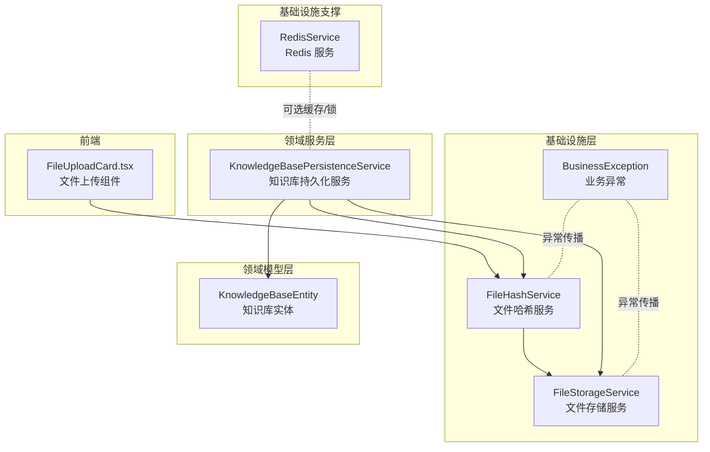
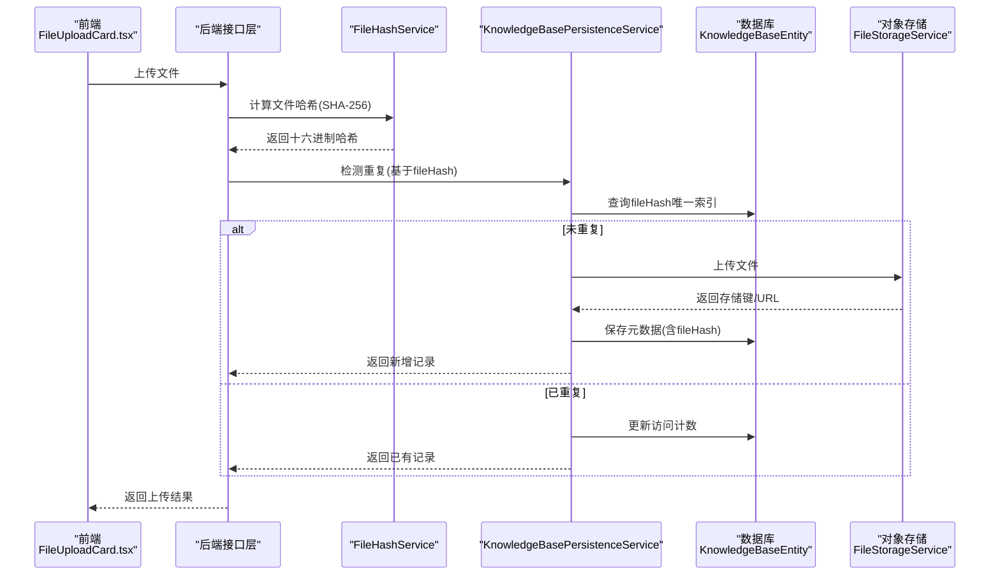
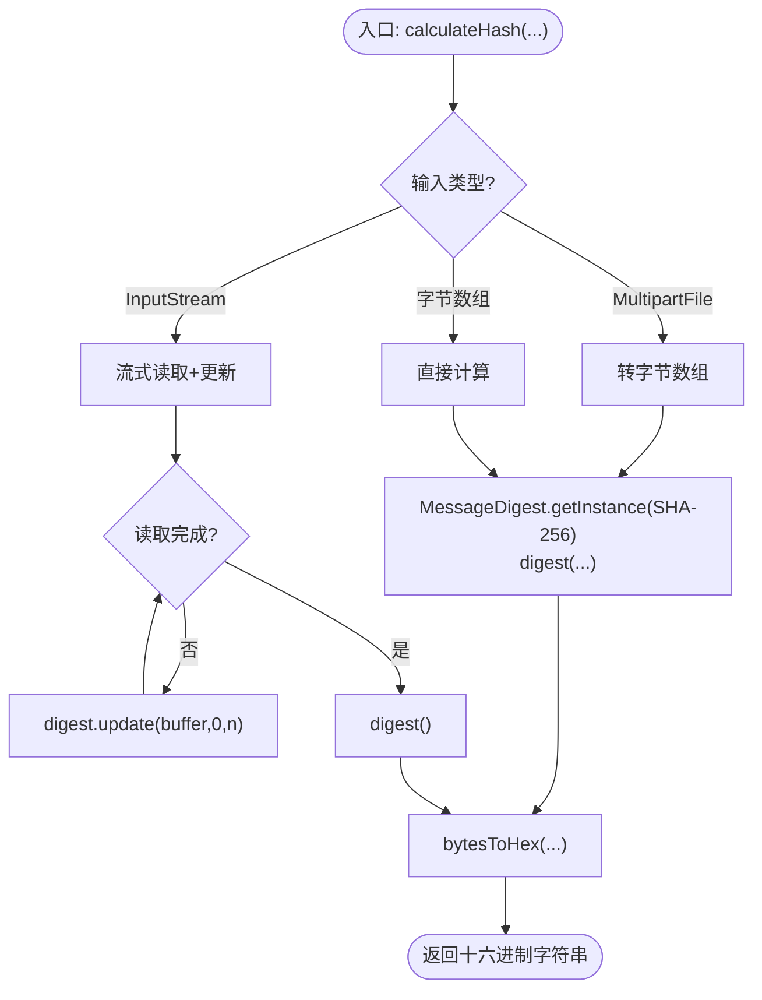
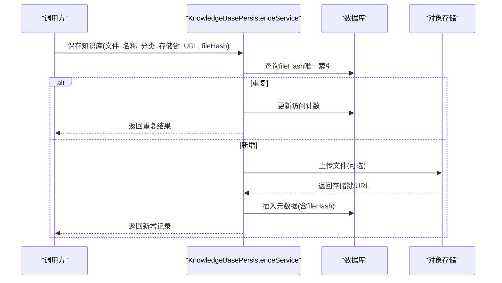
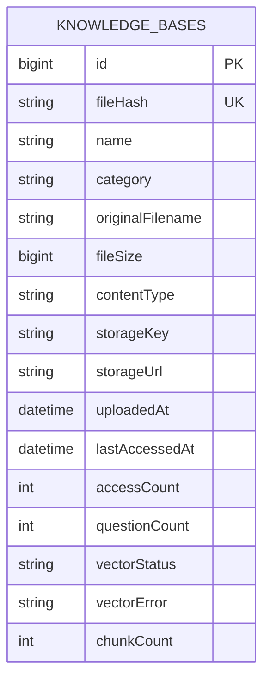
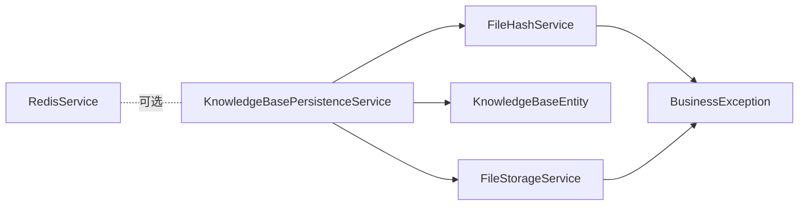

# 文件哈希服务

<cite>
**本文引用的文件**
- [FileHashService.java](file://app/src/main/java/interview/guide/infrastructure/file/FileHashService.java)
- [KnowledgeBasePersistenceService.java](file://app/src/main/java/interview/guide/modules/knowledgebase/service/KnowledgeBasePersistenceService.java)
- [KnowledgeBaseEntity.java](file://app/src/main/java/interview/guide/modules/knowledgebase/model/KnowledgeBaseEntity.java)
- [FileStorageService.java](file://app/src/main/java/interview/guide/infrastructure/file/FileStorageService.java)
- [BusinessException.java](file://app/src/main/java/interview/guide/common/exception/BusinessException.java)
- [RedisService.java](file://app/src/main/java/interview/guide/infrastructure/redis/RedisService.java)
- [FileUploadCard.tsx](file://frontend/src/components/FileUploadCard.tsx)
</cite>

## 目录
1. [简介](#简介)
2. [项目结构](#项目结构)
3. [核心组件](#核心组件)
4. [架构总览](#架构总览)
5. [详细组件分析](#详细组件分析)
6. [依赖分析](#依赖分析)
7. [性能考量](#性能考量)
8. [故障排查指南](#故障排查指南)
9. [结论](#结论)
10. [附录](#附录)

## 简介
本文件哈希服务围绕“文件去重”这一核心目标，提供统一的哈希计算能力，并与知识库持久化、对象存储、前端上传流程协同工作。服务默认采用 SHA-256 算法，支持字节数组、MultipartFile、以及 InputStream 三种输入方式；同时通过数据库唯一索引 fileHash 实现重复检测与去重。本文档从算法选择、性能优化、重复检测机制、准确性保障、存储与管理、应用场景、监控统计与安全实践等方面进行全面阐述。

## 项目结构
与文件哈希服务直接相关的模块与文件如下：
- 基础设施层
  - 文件哈希服务：FileHashService
  - 文件存储服务：FileStorageService
  - 异常定义：BusinessException
- 领域服务层
  - 知识库持久化服务：KnowledgeBasePersistenceService
- 领域模型层
  - 知识库实体：KnowledgeBaseEntity（含 fileHash 唯一索引）
- 基础设施支撑
  - Redis 服务：RedisService（可用于缓存与分布式锁）
- 前端集成
  - 文件上传组件：FileUploadCard.tsx

图表来源
- [FileHashService.java:1-88](file://app/src/main/java/interview/guide/infrastructure/file/FileHashService.java#L1-L88)
- [FileStorageService.java:1-280](file://app/src/main/java/interview/guide/infrastructure/file/FileStorageService.java#L1-L280)
- [KnowledgeBasePersistenceService.java:1-110](file://app/src/main/java/interview/guide/modules/knowledgebase/service/KnowledgeBasePersistenceService.java#L1-L110)
- [KnowledgeBaseEntity.java:1-223](file://app/src/main/java/interview/guide/modules/knowledgebase/model/KnowledgeBaseEntity.java#L1-L223)
- [BusinessException.java:1-50](file://app/src/main/java/interview/guide/common/exception/BusinessException.java#L1-L50)
- [RedisService.java:112-164](file://app/src/main/java/interview/guide/infrastructure/redis/RedisService.java#L112-L164)
- [FileUploadCard.tsx:1-90](file://frontend/src/components/FileUploadCard.tsx#L1-L90)

章节来源
- [FileHashService.java:1-88](file://app/src/main/java/interview/guide/infrastructure/file/FileHashService.java#L1-L88)
- [FileStorageService.java:1-280](file://app/src/main/java/interview/guide/infrastructure/file/FileStorageService.java#L1-L280)
- [KnowledgeBasePersistenceService.java:1-110](file://app/src/main/java/interview/guide/modules/knowledgebase/service/KnowledgeBasePersistenceService.java#L1-L110)
- [KnowledgeBaseEntity.java:1-223](file://app/src/main/java/interview/guide/modules/knowledgebase/model/KnowledgeBaseEntity.java#L1-L223)
- [BusinessException.java:1-50](file://app/src/main/java/interview/guide/common/exception/BusinessException.java#L1-L50)
- [RedisService.java:112-164](file://app/src/main/java/interview/guide/infrastructure/redis/RedisService.java#L112-L164)
- [FileUploadCard.tsx:1-90](file://frontend/src/components/FileUploadCard.tsx#L1-L90)

## 核心组件
- 文件哈希服务（FileHashService）
  - 默认算法：SHA-256
  - 支持输入：MultipartFile、字节数组、InputStream
  - 输出：十六进制字符串
  - 特性：缓冲区大小固定，流式处理适合大文件
- 知识库持久化服务（KnowledgeBasePersistenceService）
  - 保存知识库元数据（含 fileHash）
  - 重复检测：若 fileHash 已存在，仅更新访问计数并返回已有记录
  - 向量化状态管理
- 知识库实体（KnowledgeBaseEntity）
  - fileHash 字段：唯一索引，长度 64（对应 SHA-256 十六进制长度）
  - 其他字段：名称、分类、原始文件名、大小、类型、存储键、URL、时间戳、访问计数、向量化状态等
- 文件存储服务（FileStorageService）
  - 上传/下载/删除/存在性检查
  - 文件名清洗与安全路径生成
- 异常定义（BusinessException）
  - 统一业务异常封装，便于上层捕获与处理
- Redis 服务（RedisService）
  - 提供分布式锁、Hash 操作等能力，可用于缓存与并发控制
- 前端上传组件（FileUploadCard.tsx）
  - 支持拖拽/选择文件、最大尺寸提示、上传按钮与错误提示

章节来源
- [FileHashService.java:20-88](file://app/src/main/java/interview/guide/infrastructure/file/FileHashService.java#L20-L88)
- [KnowledgeBasePersistenceService.java:25-108](file://app/src/main/java/interview/guide/modules/knowledgebase/service/KnowledgeBasePersistenceService.java#L25-L108)
- [KnowledgeBaseEntity.java:10-72](file://app/src/main/java/interview/guide/modules/knowledgebase/model/KnowledgeBaseEntity.java#L10-L72)
- [FileStorageService.java:30-280](file://app/src/main/java/interview/guide/infrastructure/file/FileStorageService.java#L30-L280)
- [BusinessException.java:8-49](file://app/src/main/java/interview/guide/common/exception/BusinessException.java#L8-L49)
- [RedisService.java:112-164](file://app/src/main/java/interview/guide/infrastructure/redis/RedisService.java#L112-L164)
- [FileUploadCard.tsx:1-90](file://frontend/src/components/FileUploadCard.tsx#L1-L90)

## 架构总览
文件哈希服务在整体架构中的位置与交互如下：

图表来源
- [FileUploadCard.tsx:1-90](file://frontend/src/components/FileUploadCard.tsx#L1-L90)
- [FileHashService.java:31-76](file://app/src/main/java/interview/guide/infrastructure/file/FileHashService.java#L31-L76)
- [KnowledgeBasePersistenceService.java:30-78](file://app/src/main/java/interview/guide/modules/knowledgebase/service/KnowledgeBasePersistenceService.java#L30-L78)
- [KnowledgeBaseEntity.java:10-23](file://app/src/main/java/interview/guide/modules/knowledgebase/model/KnowledgeBaseEntity.java#L10-L23)
- [FileStorageService.java:38-111](file://app/src/main/java/interview/guide/infrastructure/file/FileStorageService.java#L38-L111)

## 详细组件分析

### 文件哈希服务（FileHashService）
- 算法与输入
  - 默认算法：SHA-256
  - 输入支持：MultipartFile、字节数组、InputStream
- 处理逻辑
  - MultipartFile：先转字节数组再计算
  - 字节数组：直接计算
  - InputStream：固定缓冲区流式更新，适合大文件
- 输出与转换
  - 返回十六进制字符串
  - 字节数组到十六进制转换采用高效拼接
- 异常处理
  - 算法不支持或 IO 异常统一包装为业务异常

图表来源
- [FileHashService.java:31-87](file://app/src/main/java/interview/guide/infrastructure/file/FileHashService.java#L31-L87)

章节来源
- [FileHashService.java:20-88](file://app/src/main/java/interview/guide/infrastructure/file/FileHashService.java#L20-L88)

### 知识库持久化服务（KnowledgeBasePersistenceService）
- 重复检测与处理
  - 基于 fileHash 唯一索引判断是否重复
  - 若重复：更新访问计数并返回已有记录
  - 若新增：保存元数据（名称、分类、原始文件名、大小、类型、存储键、URL、fileHash）
- 向量化状态管理
  - 新增时设置为 PENDING，后续异步处理完成后更新为 COMPLETED 或记录错误
- 异常处理
  - 数据库操作异常统一抛出业务异常

图表来源
- [KnowledgeBasePersistenceService.java:30-78](file://app/src/main/java/interview/guide/modules/knowledgebase/service/KnowledgeBasePersistenceService.java#L30-L78)
- [KnowledgeBaseEntity.java:10-23](file://app/src/main/java/interview/guide/modules/knowledgebase/model/KnowledgeBaseEntity.java#L10-L23)
- [FileStorageService.java:38-111](file://app/src/main/java/interview/guide/infrastructure/file/FileStorageService.java#L38-L111)

章节来源
- [KnowledgeBasePersistenceService.java:25-108](file://app/src/main/java/interview/guide/modules/knowledgebase/service/KnowledgeBasePersistenceService.java#L25-L108)
- [KnowledgeBaseEntity.java:10-72](file://app/src/main/java/interview/guide/modules/knowledgebase/model/KnowledgeBaseEntity.java#L10-L72)

### 知识库实体（KnowledgeBaseEntity）
- 关键字段
  - fileHash：唯一索引，长度 64（SHA-256 十六进制）
  - 元数据：名称、分类、原始文件名、大小、类型、存储键、URL、时间戳、访问计数、向量化状态与错误信息
- 设计要点
  - 唯一索引确保去重有效性
  - 时间戳与计数字段便于审计与统计

图表来源
- [KnowledgeBaseEntity.java:10-72](file://app/src/main/java/interview/guide/modules/knowledgebase/model/KnowledgeBaseEntity.java#L10-L72)

章节来源
- [KnowledgeBaseEntity.java:10-223](file://app/src/main/java/interview/guide/modules/knowledgebase/model/KnowledgeBaseEntity.java#L10-L223)

### 文件存储服务（FileStorageService）
- 功能范围
  - 上传/下载/删除/存在性检查
  - 文件名清洗与安全路径生成（日期分片 + UUID 前缀）
  - 获取文件 URL
  - 确保存储桶存在
- 安全与健壮性
  - 清洗非安全字符，避免 S3 存储问题
  - 异常统一包装为业务异常

章节来源
- [FileStorageService.java:30-280](file://app/src/main/java/interview/guide/infrastructure/file/FileStorageService.java#L30-L280)

### 异常定义（BusinessException）
- 统一异常封装，便于上层捕获与处理
- 支持多种构造方式，便于携带错误码与消息

章节来源
- [BusinessException.java:8-49](file://app/src/main/java/interview/guide/common/exception/BusinessException.java#L8-L49)

### Redis 服务（RedisService）
- 提供 Hash 操作与分布式锁能力
- 可用于热点数据缓存与并发控制（如去重判定的短期缓存）

章节来源
- [RedisService.java:112-164](file://app/src/main/java/interview/guide/infrastructure/redis/RedisService.java#L112-L164)

### 前端上传组件（FileUploadCard.tsx）
- 支持拖拽/选择文件、最大尺寸提示、上传按钮与错误提示
- 与后端接口配合完成文件上传与哈希计算

章节来源
- [FileUploadCard.tsx:1-90](file://frontend/src/components/FileUploadCard.tsx#L1-L90)

## 依赖分析
- 组件耦合
  - FileHashService 与 FileStorageService 通过业务流程耦合（上传前计算哈希）
  - KnowledgeBasePersistenceService 与 KnowledgeBaseEntity 通过 JPA 映射耦合
  - KnowledgeBasePersistenceService 与 FileStorageService 通过存储键/URL耦合
  - RedisService 作为可选支撑组件，用于缓存与锁
- 外部依赖
  - Java Security 的 MessageDigest（SHA-256）
  - AWS SDK（S3Client）
  - Redisson（Redis 客户端）

图表来源
- [FileHashService.java:1-88](file://app/src/main/java/interview/guide/infrastructure/file/FileHashService.java#L1-L88)
- [KnowledgeBasePersistenceService.java:1-110](file://app/src/main/java/interview/guide/modules/knowledgebase/service/KnowledgeBasePersistenceService.java#L1-L110)
- [KnowledgeBaseEntity.java:1-223](file://app/src/main/java/interview/guide/modules/knowledgebase/model/KnowledgeBaseEntity.java#L1-L223)
- [FileStorageService.java:1-280](file://app/src/main/java/interview/guide/infrastructure/file/FileStorageService.java#L1-L280)
- [BusinessException.java:1-50](file://app/src/main/java/interview/guide/common/exception/BusinessException.java#L1-L50)
- [RedisService.java:112-164](file://app/src/main/java/interview/guide/infrastructure/redis/RedisService.java#L112-L164)

章节来源
- [FileHashService.java:1-88](file://app/src/main/java/interview/guide/infrastructure/file/FileHashService.java#L1-L88)
- [KnowledgeBasePersistenceService.java:1-110](file://app/src/main/java/interview/guide/modules/knowledgebase/service/KnowledgeBasePersistenceService.java#L1-L110)
- [KnowledgeBaseEntity.java:1-223](file://app/src/main/java/interview/guide/modules/knowledgebase/model/KnowledgeBaseEntity.java#L1-L223)
- [FileStorageService.java:1-280](file://app/src/main/java/interview/guide/infrastructure/file/FileStorageService.java#L1-L280)
- [BusinessException.java:1-50](file://app/src/main/java/interview/guide/common/exception/BusinessException.java#L1-L50)
- [RedisService.java:112-164](file://app/src/main/java/interview/guide/infrastructure/redis/RedisService.java#L112-L164)

## 性能考量
- 算法选择
  - SHA-256：安全性高、冲突概率低，适合去重与完整性校验
- 大文件处理
  - 流式读取：固定缓冲区逐块更新，避免一次性加载至内存
  - 适用场景：超大文件上传与哈希计算
- 内存管理
  - 流式处理降低峰值内存占用
  - 字节数组方式仅适用于可控大小文件
- 并发与缓存
  - 可结合 Redis 缓存热点 fileHash 判定结果，减少数据库压力
  - 使用分布式锁避免同一文件并发重复入库
- 数据库层面
  - fileHash 唯一索引确保去重效率与一致性
  - 建议在高频查询字段（如分类）建立二级索引

章节来源
- [FileHashService.java:22-23](file://app/src/main/java/interview/guide/infrastructure/file/FileHashService.java#L22-L23)
- [FileHashService.java:63-76](file://app/src/main/java/interview/guide/infrastructure/file/FileHashService.java#L63-L76)
- [KnowledgeBaseEntity.java:11-14](file://app/src/main/java/interview/guide/modules/knowledgebase/model/KnowledgeBaseEntity.java#L11-L14)
- [RedisService.java:112-164](file://app/src/main/java/interview/guide/infrastructure/redis/RedisService.java#L112-L164)

## 故障排查指南
- 常见异常与定位
  - 算法不支持：检查算法名称与运行环境
  - IO 异常：检查文件读取、网络传输与存储客户端配置
  - 业务异常：查看 BusinessException 的错误码与消息
- 去重失败排查
  - 确认 fileHash 是否正确计算（十六进制长度为 64）
  - 检查数据库唯一索引是否生效
- 存储问题
  - S3 客户端配置、权限与桶存在性
  - 文件名清洗规则导致的路径异常
- 前端上传
  - 文件大小限制、格式校验与错误提示

章节来源
- [BusinessException.java:8-49](file://app/src/main/java/interview/guide/common/exception/BusinessException.java#L8-L49)
- [FileHashService.java:46-55](file://app/src/main/java/interview/guide/infrastructure/file/FileHashService.java#L46-L55)
- [FileHashService.java:72-75](file://app/src/main/java/interview/guide/infrastructure/file/FileHashService.java#L72-L75)
- [FileStorageService.java:93-111](file://app/src/main/java/interview/guide/infrastructure/file/FileStorageService.java#L93-L111)
- [FileStorageService.java:116-130](file://app/src/main/java/interview/guide/infrastructure/file/FileStorageService.java#L116-L130)
- [FileUploadCard.tsx:1-90](file://frontend/src/components/FileUploadCard.tsx#L1-L90)

## 结论
文件哈希服务以 SHA-256 为核心，结合流式处理与数据库唯一索引，实现了高效、可靠的文件去重能力。通过知识库持久化服务与对象存储的协同，形成从上传、去重、存储到访问统计的完整闭环。建议在高并发场景引入 Redis 缓存与分布式锁，并持续关注算法一致性、边界条件与异常处理，以进一步提升稳定性与性能。

## 附录
- 应用场景
  - 完整性校验：上传后对比哈希确认文件未被篡改
  - 版本控制：同名文件不同版本通过哈希区分
  - 备份恢复：基于哈希去重，节省存储空间
- 监控与统计
  - 可扩展埋点记录哈希计算耗时、重复率、存储容量等指标
- 安全性与密码学最佳实践
  - 优先使用 SHA-256 或更高强度算法
  - 避免在日志中输出明文哈希
  - 对敏感文件可结合加盐策略与访问控制