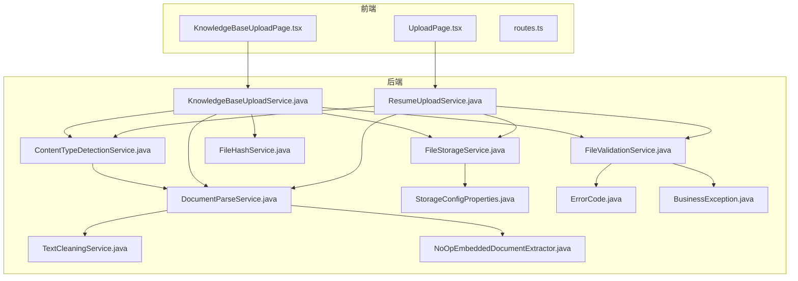
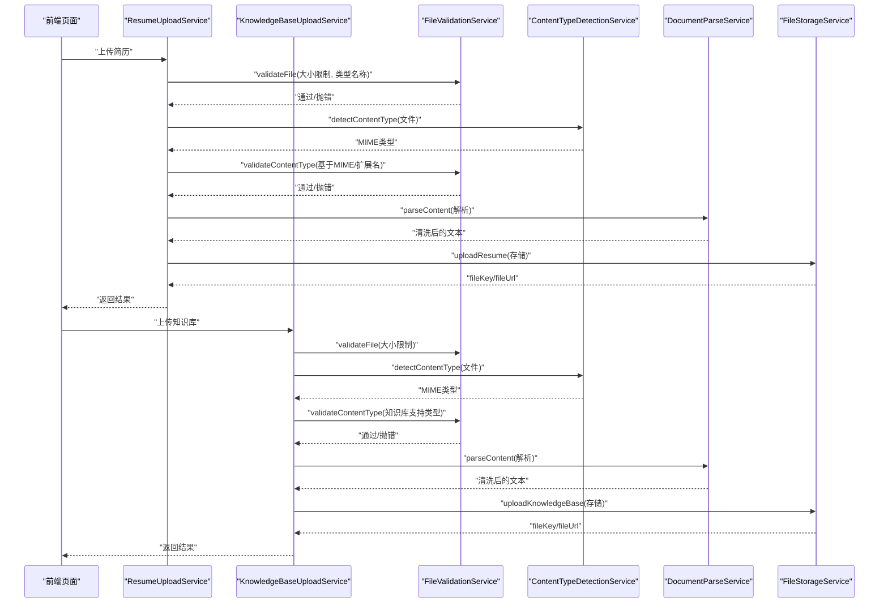
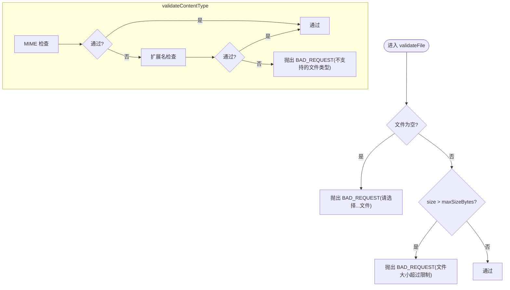
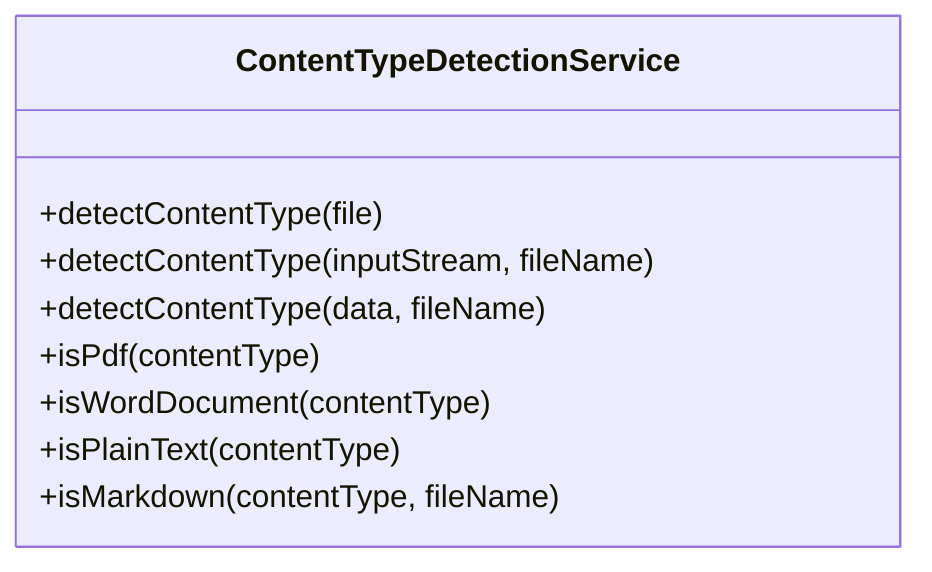
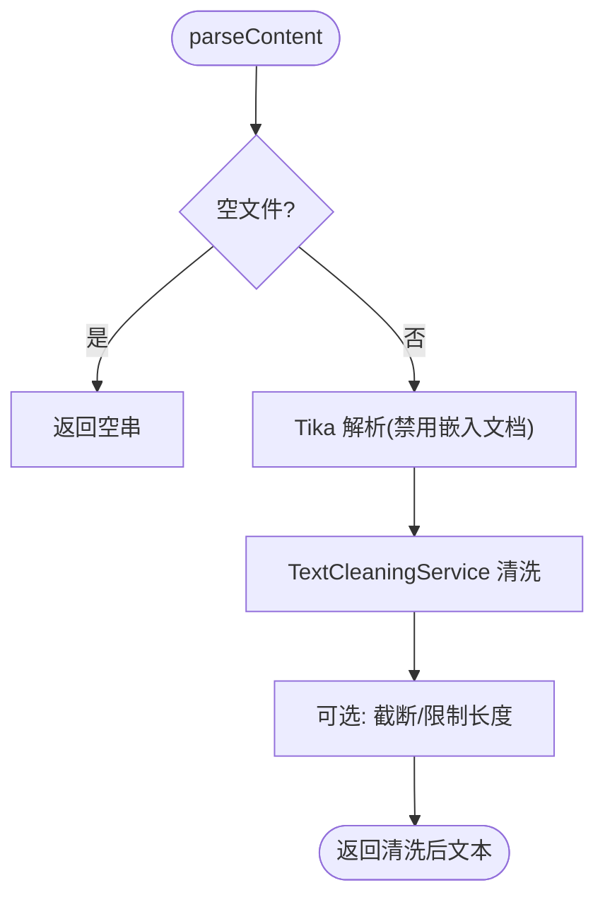
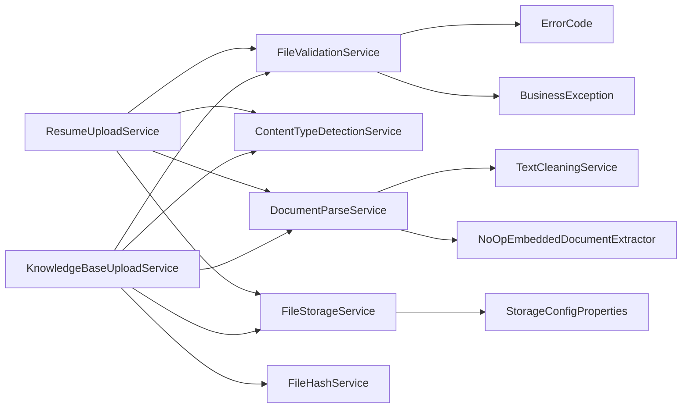

# 文件验证服务

<cite>
**本文引用的文件**
- [FileValidationService.java](file://app/src/main/java/interview/guide/infrastructure/file/FileValidationService.java)
- [ContentTypeDetectionService.java](file://app/src/main/java/interview/guide/infrastructure/file/ContentTypeDetectionService.java)
- [DocumentParseService.java](file://app/src/main/java/interview/guide/infrastructure/file/DocumentParseService.java)
- [TextCleaningService.java](file://app/src/main/java/interview/guide/infrastructure/file/TextCleaningService.java)
- [NoOpEmbeddedDocumentExtractor.java](file://app/src/main/java/interview/guide/infrastructure/file/NoOpEmbeddedDocumentExtractor.java)
- [FileHashService.java](file://app/src/main/java/interview/guide/infrastructure/file/FileHashService.java)
- [FileStorageService.java](file://app/src/main/java/interview/guide/infrastructure/file/FileStorageService.java)
- [StorageConfigProperties.java](file://app/src/main/java/interview/guide/common/config/StorageConfigProperties.java)
- [ErrorCode.java](file://app/src/main/java/interview/guide/common/exception/ErrorCode.java)
- [BusinessException.java](file://app/src/main/java/interview/guide/common/exception/BusinessException.java)
- [ResumeUploadService.java](file://app/src/main/java/interview/guide/modules/resume/service/ResumeUploadService.java)
- [KnowledgeBaseUploadService.java](file://app/src/main/java/interview/guide/modules/knowledgebase/service/KnowledgeBaseUploadService.java)
- [application-test.yml](file://app/src/test/resources/application-test.yml)
- [UploadPage.tsx](file://frontend/src/pages/UploadPage.tsx)
- [KnowledgeBaseUploadPage.tsx](file://frontend/src/pages/KnowledgeBaseUploadPage.tsx)
- [routes.ts](file://frontend/src/constants/routes.ts)
</cite>

## 目录
1. [简介](#简介)
2. [项目结构](#项目结构)
3. [核心组件](#核心组件)
4. [架构总览](#架构总览)
5. [详细组件分析](#详细组件分析)
6. [依赖分析](#依赖分析)
7. [性能考虑](#性能考虑)
8. [故障排查指南](#故障排查指南)
9. [结论](#结论)
10. [附录](#附录)

## 简介
本文件验证服务围绕“多层级文件校验”构建，覆盖大小限制、格式验证与内容安全三大部分，并提供统一的错误码体系、可扩展的验证规则与性能优化策略。系统通过独立的服务模块实现职责分离：文件大小与格式校验由通用验证服务承担；内容类型检测采用 Apache Tika；文档解析与文本清洗保障后续 RAG/分析环节的数据质量；哈希服务用于去重；存储服务负责对象存储交互与文件命名安全化。

## 项目结构
文件验证相关代码主要位于后端 Java 工程的基础设施层与模块服务层，前端提供上传页面与用户交互提示。

**图表来源**
- [ResumeUploadService.java:31-60](file://app/src/main/java/interview/guide/modules/resume/service/ResumeUploadService.java#L31-L60)
- [KnowledgeBaseUploadService.java:30-102](file://app/src/main/java/interview/guide/modules/knowledgebase/service/KnowledgeBaseUploadService.java#L30-L102)
- [FileValidationService.java:18-127](file://app/src/main/java/interview/guide/infrastructure/file/FileValidationService.java#L18-L127)
- [ContentTypeDetectionService.java:17-110](file://app/src/main/java/interview/guide/infrastructure/file/ContentTypeDetectionService.java#L17-L110)
- [DocumentParseService.java:27-164](file://app/src/main/java/interview/guide/infrastructure/file/DocumentParseService.java#L27-L164)
- [TextCleaningService.java:11-162](file://app/src/main/java/interview/guide/infrastructure/file/TextCleaningService.java#L11-L162)
- [NoOpEmbeddedDocumentExtractor.java:15-52](file://app/src/main/java/interview/guide/infrastructure/file/NoOpEmbeddedDocumentExtractor.java#L15-L52)
- [FileHashService.java:18-89](file://app/src/main/java/interview/guide/infrastructure/file/FileHashService.java#L18-L89)
- [FileStorageService.java:27-280](file://app/src/main/java/interview/guide/infrastructure/file/FileStorageService.java#L27-L280)
- [StorageConfigProperties.java:10-21](file://app/src/main/java/interview/guide/common/config/StorageConfigProperties.java#L10-L21)
- [ErrorCode.java:11-81](file://app/src/main/java/interview/guide/common/exception/ErrorCode.java#L11-L81)
- [BusinessException.java:8-50](file://app/src/main/java/interview/guide/common/exception/BusinessException.java#L8-L50)

**章节来源**
- [ResumeUploadService.java:31-60](file://app/src/main/java/interview/guide/modules/resume/service/ResumeUploadService.java#L31-L60)
- [KnowledgeBaseUploadService.java:30-102](file://app/src/main/java/interview/guide/modules/knowledgebase/service/KnowledgeBaseUploadService.java#L30-L102)

## 核心组件
- 文件验证服务：提供基础文件属性校验（空值、大小）、类型校验（MIME 白名单、扩展名、Magic Number 辅助判断）与常用类型判定（Markdown、知识库支持格式）。
- 内容类型检测服务：基于 Apache Tika 的 MIME 类型检测，提供 PDF/Word/文本/Markdown 等识别能力。
- 文档解析与清洗服务：统一解析多种格式并清洗噪声，为后续分析提供高质量文本。
- 哈希服务：提供 SHA-256 哈希计算，支持去重与完整性校验。
- 存储服务：封装 S3 兼容对象存储，负责上传、下载、删除、存在性检查与文件名安全化。
- 错误码与异常：统一的业务异常与错误码体系，便于前端展示与日志追踪。

**章节来源**
- [FileValidationService.java:18-127](file://app/src/main/java/interview/guide/infrastructure/file/FileValidationService.java#L18-L127)
- [ContentTypeDetectionService.java:17-110](file://app/src/main/java/interview/guide/infrastructure/file/ContentTypeDetectionService.java#L17-L110)
- [DocumentParseService.java:27-164](file://app/src/main/java/interview/guide/infrastructure/file/DocumentParseService.java#L27-L164)
- [TextCleaningService.java:11-162](file://app/src/main/java/interview/guide/infrastructure/file/TextCleaningService.java#L11-L162)
- [FileHashService.java:18-89](file://app/src/main/java/interview/guide/infrastructure/file/FileHashService.java#L18-L89)
- [FileStorageService.java:27-280](file://app/src/main/java/interview/guide/infrastructure/file/FileStorageService.java#L27-L280)
- [ErrorCode.java:11-81](file://app/src/main/java/interview/guide/common/exception/ErrorCode.java#L11-L81)
- [BusinessException.java:8-50](file://app/src/main/java/interview/guide/common/exception/BusinessException.java#L8-L50)

## 架构总览
文件上传从前端发起，经由对应模块服务进行验证与处理，最终落地到对象存储。验证链路贯穿大小限制、格式校验与内容类型检测，解析与清洗确保下游分析质量。

**图表来源**
- [ResumeUploadService.java:47-60](file://app/src/main/java/interview/guide/modules/resume/service/ResumeUploadService.java#L47-L60)
- [KnowledgeBaseUploadService.java:48-102](file://app/src/main/java/interview/guide/modules/knowledgebase/service/KnowledgeBaseUploadService.java#L48-L102)
- [FileValidationService.java:27-93](file://app/src/main/java/interview/guide/infrastructure/file/FileValidationService.java#L27-L93)
- [ContentTypeDetectionService.java:32-66](file://app/src/main/java/interview/guide/infrastructure/file/ContentTypeDetectionService.java#L32-L66)
- [DocumentParseService.java:45-91](file://app/src/main/java/interview/guide/infrastructure/file/DocumentParseService.java#L45-L91)
- [FileStorageService.java:89-111](file://app/src/main/java/interview/guide/infrastructure/file/FileStorageService.java#L89-L111)

## 详细组件分析

### 文件验证服务（FileValidationService）
- 基础属性校验：空文件检测与大小上限检查，超限或空文件抛出业务异常。
- 类型校验（白名单/MIME）：支持传入允许的 MIME 片段列表，进行双向包含匹配；失败时抛出业务异常。
- 类型校验（MIME + 扩展名）：先以 MIME 检查为主，若不满足再回退到扩展名检查；失败时抛出业务异常。
- 常用类型判定：提供 Markdown 扩展名判断与知识库支持的 MIME 判定，便于快速筛选。

**图表来源**
- [FileValidationService.java:27-93](file://app/src/main/java/interview/guide/infrastructure/file/FileValidationService.java#L27-L93)

**章节来源**
- [FileValidationService.java:18-127](file://app/src/main/java/interview/guide/infrastructure/file/FileValidationService.java#L18-L127)

### 内容类型检测服务（ContentTypeDetectionService）
- 基于 Apache Tika 的 MIME 类型检测，优先使用内容检测，失败时回退到 HTTP 头部。
- 提供 PDF/Word/文本/Markdown 等常用类型判断方法，便于上层快速决策。

**图表来源**
- [ContentTypeDetectionService.java:17-110](file://app/src/main/java/interview/guide/infrastructure/file/ContentTypeDetectionService.java#L17-L110)

**章节来源**
- [ContentTypeDetectionService.java:17-110](file://app/src/main/java/interview/guide/infrastructure/file/ContentTypeDetectionService.java#L17-L110)

### 文档解析与清洗服务（DocumentParseService + TextCleaningService + NoOpEmbeddedDocumentExtractor）
- 解析：使用 Tika 自动解析器与上下文配置，禁用嵌入文档提取，限制最大文本长度，确保解析稳定与性能可控。
- 清洗：去除控制字符、图片文件名/链接、文件协议路径、分隔线等噪声，规范化换行与空行，保留段落结构。
- 安全：通过禁用嵌入文档提取，避免解析图片引用或临时文件路径导致的副作用。

**图表来源**
- [DocumentParseService.java:45-139](file://app/src/main/java/interview/guide/infrastructure/file/DocumentParseService.java#L45-L139)
- [TextCleaningService.java:80-120](file://app/src/main/java/interview/guide/infrastructure/file/TextCleaningService.java#L80-L120)
- [NoOpEmbeddedDocumentExtractor.java:15-52](file://app/src/main/java/interview/guide/infrastructure/file/NoOpEmbeddedDocumentExtractor.java#L15-L52)

**章节来源**
- [DocumentParseService.java:27-164](file://app/src/main/java/interview/guide/infrastructure/file/DocumentParseService.java#L27-L164)
- [TextCleaningService.java:11-162](file://app/src/main/java/interview/guide/infrastructure/file/TextCleaningService.java#L11-L162)
- [NoOpEmbeddedDocumentExtractor.java:15-52](file://app/src/main/java/interview/guide/infrastructure/file/NoOpEmbeddedDocumentExtractor.java#L15-L52)

### 哈希服务（FileHashService）
- 提供字节数组、MultipartFile、InputStream 三种输入的 SHA-256 哈希计算，支持大文件流式计算，用于去重与完整性校验。

**章节来源**
- [FileHashService.java:18-89](file://app/src/main/java/interview/guide/infrastructure/file/FileHashService.java#L18-L89)

### 存储服务（FileStorageService）与配置（StorageConfigProperties）
- 上传/下载/删除/存在性检查/文件大小查询，统一封装 S3 兼容客户端调用。
- 文件名安全化：将中文转换为拼音并清理非法字符，避免对象存储路径问题。
- 配置项：endpoint、accessKey、secretKey、bucket、region。

**章节来源**
- [FileStorageService.java:27-280](file://app/src/main/java/interview/guide/infrastructure/file/FileStorageService.java#L27-L280)
- [StorageConfigProperties.java:10-21](file://app/src/main/java/interview/guide/common/config/StorageConfigProperties.java#L10-L21)

### 错误码与异常（ErrorCode + BusinessException）
- 统一错误码枚举，涵盖通用、简历、面试、存储、导出、知识库、AI 服务、限流等模块。
- 业务异常包装错误码与消息，便于全局异常处理与前端展示。

**章节来源**
- [ErrorCode.java:11-81](file://app/src/main/java/interview/guide/common/exception/ErrorCode.java#L11-L81)
- [BusinessException.java:8-50](file://app/src/main/java/interview/guide/common/exception/BusinessException.java#L8-L50)

## 依赖分析
- 模块间耦合：各模块服务通过依赖注入使用验证、解析、存储等基础设施服务，职责清晰、内聚高。
- 外部依赖：Apache Tika 用于内容类型检测与文档解析；AWS SDK 用于对象存储；Pinyin4J 用于文件名安全化。
- 循环依赖：未发现循环依赖迹象，组件关系呈单向依赖。

**图表来源**
- [ResumeUploadService.java:31-60](file://app/src/main/java/interview/guide/modules/resume/service/ResumeUploadService.java#L31-L60)
- [KnowledgeBaseUploadService.java:30-102](file://app/src/main/java/interview/guide/modules/knowledgebase/service/KnowledgeBaseUploadService.java#L30-L102)
- [FileValidationService.java:18-127](file://app/src/main/java/interview/guide/infrastructure/file/FileValidationService.java#L18-L127)
- [DocumentParseService.java:27-164](file://app/src/main/java/interview/guide/infrastructure/file/DocumentParseService.java#L27-L164)
- [TextCleaningService.java:11-162](file://app/src/main/java/interview/guide/infrastructure/file/TextCleaningService.java#L11-L162)
- [NoOpEmbeddedDocumentExtractor.java:15-52](file://app/src/main/java/interview/guide/infrastructure/file/NoOpEmbeddedDocumentExtractor.java#L15-L52)
- [FileHashService.java:18-89](file://app/src/main/java/interview/guide/infrastructure/file/FileHashService.java#L18-L89)
- [FileStorageService.java:27-280](file://app/src/main/java/interview/guide/infrastructure/file/FileStorageService.java#L27-L280)
- [StorageConfigProperties.java:10-21](file://app/src/main/java/interview/guide/common/config/StorageConfigProperties.java#L10-L21)
- [ErrorCode.java:11-81](file://app/src/main/java/interview/guide/common/exception/ErrorCode.java#L11-L81)
- [BusinessException.java:8-50](file://app/src/main/java/interview/guide/common/exception/BusinessException.java#L8-L50)

## 性能考虑
- 解析性能：DocumentParseService 限制最大文本长度，禁用嵌入文档提取，减少解析开销与内存占用。
- 哈希性能：FileHashService 支持流式计算，避免大文件一次性加载内存。
- 存储性能：FileStorageService 上传时携带 contentLength，减少二次探测成本。
- 前端提示：前端页面明确展示支持格式与最大尺寸，降低无效上传尝试。

**章节来源**
- [DocumentParseService.java:31-37](file://app/src/main/java/interview/guide/infrastructure/file/DocumentParseService.java#L31-L37)
- [DocumentParseService.java:108-139](file://app/src/main/java/interview/guide/infrastructure/file/DocumentParseService.java#L108-L139)
- [FileHashService.java:63-76](file://app/src/main/java/interview/guide/infrastructure/file/FileHashService.java#L63-L76)
- [FileStorageService.java:94-101](file://app/src/main/java/interview/guide/infrastructure/file/FileStorageService.java#L94-L101)
- [UploadPage.tsx:38-40](file://frontend/src/pages/UploadPage.tsx#L38-L40)
- [KnowledgeBaseUploadPage.tsx:33-35](file://frontend/src/pages/KnowledgeBaseUploadPage.tsx#L33-L35)

## 故障排查指南
- 常见错误码
  - BAD_REQUEST：请求参数错误，通常由文件为空或大小超限触发。
  - STORAGE_UPLOAD_FAILED/STORAGE_DOWNLOAD_FAILED/STORAGE_DELETE_FAILED：对象存储相关失败。
  - RESUME_UPLOAD_FAILED/RESUME_PARSE_FAILED：简历模块上传/解析失败。
  - KNOWLEDGE_BASE_UPLOAD_FAILED/KNOWLEDGE_BASE_PARSE_FAILED：知识库模块上传/解析失败。
- 日志与异常
  - 业务异常统一包装错误码与消息，便于前端展示与定位问题。
  - 存储服务对 S3 异常进行捕获与转换，记录详细错误信息。
- 前端提示
  - 上传页面与知识库上传页面分别展示支持格式与最大尺寸，减少用户误操作。

**章节来源**
- [ErrorCode.java:11-81](file://app/src/main/java/interview/guide/common/exception/ErrorCode.java#L11-L81)
- [BusinessException.java:8-50](file://app/src/main/java/interview/guide/common/exception/BusinessException.java#L8-L50)
- [FileStorageService.java:104-110](file://app/src/main/java/interview/guide/infrastructure/file/FileStorageService.java#L104-L110)
- [UploadPage.tsx:38-40](file://frontend/src/pages/UploadPage.tsx#L38-L40)
- [KnowledgeBaseUploadPage.tsx:33-35](file://frontend/src/pages/KnowledgeBaseUploadPage.tsx#L33-L35)

## 结论
该文件验证服务通过“大小限制 + 格式校验 + 内容检测 + 解析清洗”的多层架构，实现了对上传文件的全面保障。配合统一的错误码与异常体系、安全的文件名处理与对象存储封装，既保证了系统的稳定性，也为后续的 RAG/分析流程提供了高质量输入。建议在生产环境中结合缓存与限流策略进一步优化性能与安全性。

## 附录

### 验证规则与配置管理
- 规则来源
  - 简历模块：固定大小上限与允许类型白名单（来自测试配置）。
  - 知识库模块：固定大小上限与知识库支持的 MIME 类型白名单。
- 动态规则更新
  - 当前实现以硬编码阈值与白名单为主，建议通过外部配置中心或数据库动态下发规则，以支持运行时调整。
- 自定义验证器
  - 可通过扩展 FileValidationService 的类型校验接口，传入自定义 Predicate 进行灵活扩展。
- 验证优先级
  - 基础属性校验优先，随后进行类型校验（MIME 优先，扩展名回退），最后进行解析与存储。

**章节来源**
- [ResumeUploadService.java:39-51](file://app/src/main/java/interview/guide/modules/resume/service/ResumeUploadService.java#L39-L51)
- [KnowledgeBaseUploadService.java:38-50](file://app/src/main/java/interview/guide/modules/knowledgebase/service/KnowledgeBaseUploadService.java#L38-L50)
- [application-test.yml:77-84](file://app/src/test/resources/application-test.yml#L77-L84)

### 内容安全检查与病毒扫描
- 现状
  - 未集成病毒扫描或恶意文件检测。
- 建议
  - 在存储前接入第三方病毒扫描服务或容器安全扫描，结合哈希去重与黑名单策略，形成纵深防御。

**章节来源**
- [FileHashService.java:18-89](file://app/src/main/java/interview/guide/infrastructure/file/FileHashService.java#L18-L89)

### 验证结果缓存与性能优化
- 现状
  - 未实现验证结果缓存。
- 建议
  - 对热点文件（如重复上传）可基于哈希建立短期缓存，避免重复解析与存储。
  - 对热门 MIME 类型检测结果可做本地缓存，减少 Tika 初始化开销。

**章节来源**
- [FileHashService.java:18-89](file://app/src/main/java/interview/guide/infrastructure/file/FileHashService.java#L18-L89)
- [ContentTypeDetectionService.java:17-110](file://app/src/main/java/interview/guide/infrastructure/file/ContentTypeDetectionService.java#L17-L110)

### 监控与统计
- 建议
  - 在验证与解析关键节点埋点，统计成功率、耗时分布与失败原因占比。
  - 结合对象存储指标（上传/下载/删除次数与失败率）进行端到端监控。

**章节来源**
- [DocumentParseService.java:45-64](file://app/src/main/java/interview/guide/infrastructure/file/DocumentParseService.java#L45-L64)
- [FileStorageService.java:89-111](file://app/src/main/java/interview/guide/infrastructure/file/FileStorageService.java#L89-L111)

### 安全最佳实践与防护建议
- 输入约束
  - 严格限制文件大小与类型白名单，避免未知格式带来的解析风险。
- 内容安全
  - 禁用嵌入文档解析，避免解析图片引用或临时路径。
  - 使用文本清洗服务去除噪声与潜在危险标记。
- 存储安全
  - 文件名安全化，避免路径注入与对象存储异常。
  - 使用最小权限的访问凭证与 HTTPS 传输。
- 运行安全
  - 对外暴露的上传接口增加限流与 IP 黑名单策略。
  - 对解析与存储过程增加超时与熔断保护。

**章节来源**
- [NoOpEmbeddedDocumentExtractor.java:15-52](file://app/src/main/java/interview/guide/infrastructure/file/NoOpEmbeddedDocumentExtractor.java#L15-L52)
- [TextCleaningService.java:80-120](file://app/src/main/java/interview/guide/infrastructure/file/TextCleaningService.java#L80-L120)
- [FileStorageService.java:206-278](file://app/src/main/java/interview/guide/infrastructure/file/FileStorageService.java#L206-L278)