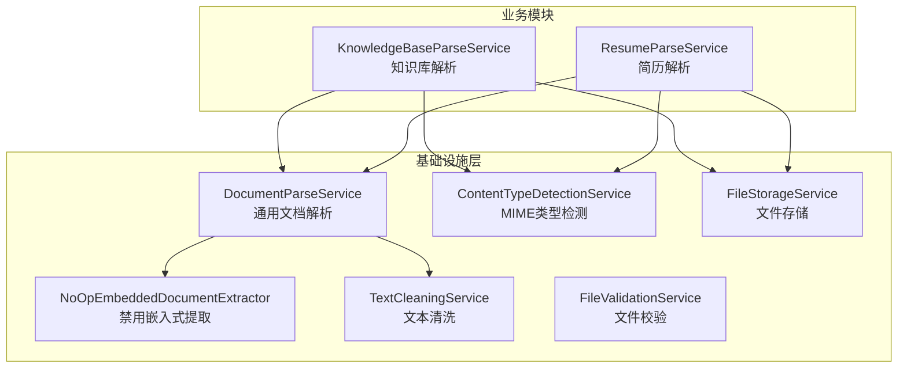
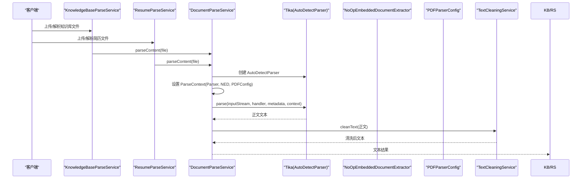
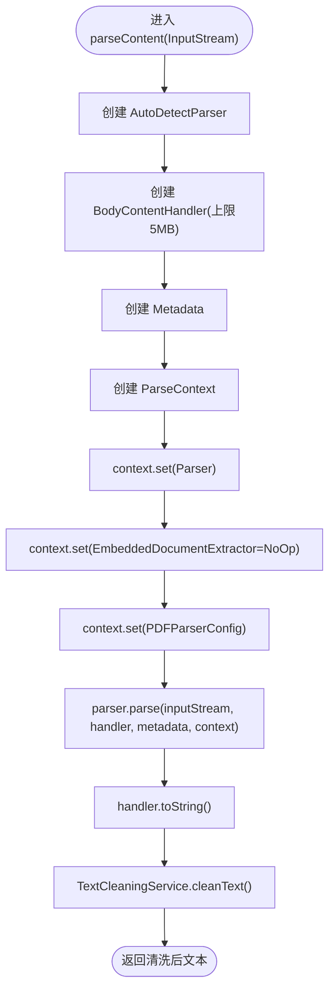
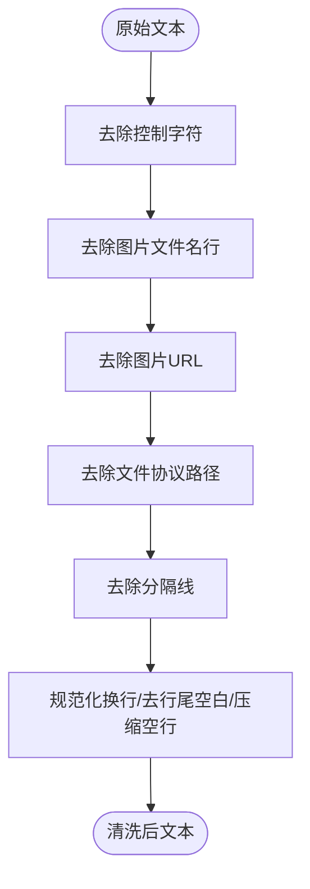
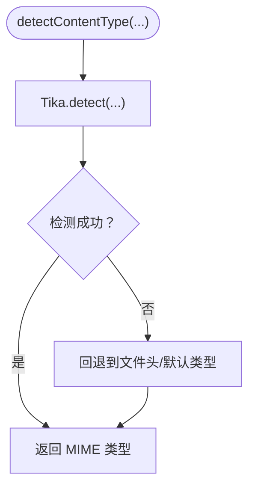
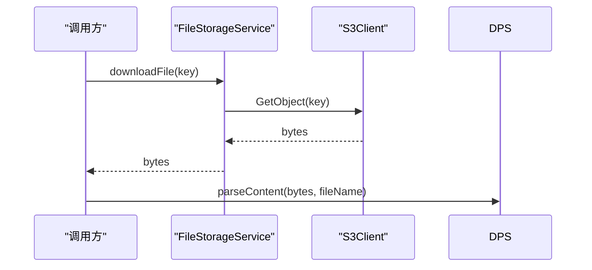
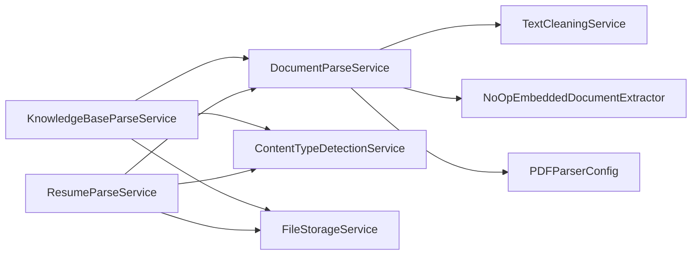

# 文档解析服务

<cite>
**本文引用的文件**
- [DocumentParseService.java](file://app/src/main/java/interview/guide/infrastructure/file/DocumentParseService.java)
- [NoOpEmbeddedDocumentExtractor.java](file://app/src/main/java/interview/guide/infrastructure/file/NoOpEmbeddedDocumentExtractor.java)
- [TextCleaningService.java](file://app/src/main/java/interview/guide/infrastructure/file/TextCleaningService.java)
- [ContentTypeDetectionService.java](file://app/src/main/java/interview/guide/infrastructure/file/ContentTypeDetectionService.java)
- [FileStorageService.java](file://app/src/main/java/interview/guide/infrastructure/file/FileStorageService.java)
- [FileValidationService.java](file://app/src/main/java/interview/guide/infrastructure/file/FileValidationService.java)
- [KnowledgeBaseParseService.java](file://app/src/main/java/interview/guide/modules/knowledgebase/service/KnowledgeBaseParseService.java)
- [ResumeParseService.java](file://app/src/main/java/interview/guide/modules/resume/service/ResumeParseService.java)
- [DocumentParseServiceTest.java](file://app/src/test/java/interview/guide/infrastructure/file/DocumentParseServiceTest.java)
- [BusinessException.java](file://app/src/main/java/interview/guide/common/exception/BusinessException.java)
- [ErrorCode.java](file://app/src/main/java/interview/guide/common/exception/ErrorCode.java)
</cite>

## 目录
1. [引言](#引言)
2. [项目结构](#项目结构)
3. [核心组件](#核心组件)
4. [架构总览](#架构总览)
5. [详细组件分析](#详细组件分析)
6. [依赖分析](#依赖分析)
7. [性能考虑](#性能考虑)
8. [故障排查指南](#故障排查指南)
9. [结论](#结论)
10. [附录](#附录)

## 引言
本文件面向“文档解析服务”的技术文档，聚焦于基于 Apache Tika 的多格式文档解析能力，涵盖以下主题：
- Tika 集成与配置：AutoDetectParser、ParseContext、PDFParserConfig、MimeTypeDetector 的使用与定制
- 多格式支持：PDF、Word（DOC/DOCX）、纯文本、Markdown 等
- 文本提取算法：正文提取、元数据解析、结构化信息提取思路
- 嵌入式文档处理：图片、链接、注释的规避与控制
- 文档预处理：编码转换、格式标准化、内容清洗
- NoOpEmbeddedDocumentExtractor 设计理念与适用场景
- 性能优化：缓存、并发、内存管理
- 错误处理与异常恢复

## 项目结构
文档解析服务位于后端模块的基础设施层，围绕通用解析服务与内容类型检测服务展开，并由知识库与简历模块复用。

图表来源
- [DocumentParseService.java:22-163](file://app/src/main/java/interview/guide/infrastructure/file/DocumentParseService.java#L22-L163)
- [NoOpEmbeddedDocumentExtractor.java:10-51](file://app/src/main/java/interview/guide/infrastructure/file/NoOpEmbeddedDocumentExtractor.java#L10-L51)
- [TextCleaningService.java:7-161](file://app/src/main/java/interview/guide/infrastructure/file/TextCleaningService.java#L7-L161)
- [ContentTypeDetectionService.java:11-109](file://app/src/main/java/interview/guide/infrastructure/file/ContentTypeDetectionService.java#L11-L109)
- [FileStorageService.java:24-279](file://app/src/main/java/interview/guide/infrastructure/file/FileStorageService.java#L24-L279)
- [FileValidationService.java:12-127](file://app/src/main/java/interview/guide/infrastructure/file/FileValidationService.java#L12-L127)
- [KnowledgeBaseParseService.java:11-65](file://app/src/main/java/interview/guide/modules/knowledgebase/service/KnowledgeBaseParseService.java#L11-L65)
- [ResumeParseService.java:11-65](file://app/src/main/java/interview/guide/modules/resume/service/ResumeParseService.java#L11-L65)

章节来源
- [DocumentParseService.java:22-163](file://app/src/main/java/interview/guide/infrastructure/file/DocumentParseService.java#L22-L163)
- [KnowledgeBaseParseService.java:11-65](file://app/src/main/java/interview/guide/modules/knowledgebase/service/KnowledgeBaseParseService.java#L11-L65)
- [ResumeParseService.java:11-65](file://app/src/main/java/interview/guide/modules/resume/service/ResumeParseService.java#L11-L65)

## 核心组件
- 通用文档解析服务：封装 Tika 解析流程，统一处理输入流、正文提取、嵌入式资源禁用、PDF 专项配置、最大文本长度限制与异常转换。
- 禁用嵌入式提取器：NoOpEmbeddedDocumentExtractor，通过 shouldParseEmbedded 返回 false 完全禁用嵌入资源解析，避免图片引用、临时路径等问题。
- 文本清洗服务：对控制字符、图片文件名/URL、文件协议路径、分隔线、HTML 标签等进行清理，同时做换行规范化与空行压缩。
- 内容类型检测服务：基于 Tika 的 MIME 类型检测，提供 PDF、Word、纯文本、Markdown 的判定能力。
- 文件存储服务：S3 客户端封装，提供上传、下载、删除、存在性检查、桶存在性保障等能力。
- 文件校验服务：基于 MIME 类型与扩展名的双轨校验，支持知识库支持格式判断。
- 知识库/简历解析服务：业务层委托者，复用通用解析与检测能力。

章节来源
- [DocumentParseService.java:22-163](file://app/src/main/java/interview/guide/infrastructure/file/DocumentParseService.java#L22-L163)
- [NoOpEmbeddedDocumentExtractor.java:10-51](file://app/src/main/java/interview/guide/infrastructure/file/NoOpEmbeddedDocumentExtractor.java#L10-L51)
- [TextCleaningService.java:7-161](file://app/src/main/java/interview/guide/infrastructure/file/TextCleaningService.java#L7-L161)
- [ContentTypeDetectionService.java:11-109](file://app/src/main/java/interview/guide/infrastructure/file/ContentTypeDetectionService.java#L11-L109)
- [FileStorageService.java:24-279](file://app/src/main/java/interview/guide/infrastructure/file/FileStorageService.java#L24-L279)
- [FileValidationService.java:12-127](file://app/src/main/java/interview/guide/infrastructure/file/FileValidationService.java#L12-L127)
- [KnowledgeBaseParseService.java:11-65](file://app/src/main/java/interview/guide/modules/knowledgebase/service/KnowledgeBaseParseService.java#L11-L65)
- [ResumeParseService.java:11-65](file://app/src/main/java/interview/guide/modules/resume/service/ResumeParseService.java#L11-L65)

## 架构总览
文档解析服务采用“通用解析 + 业务委托 + 预处理 + 存储/校验”的分层架构，核心解析流程如下：

图表来源
- [DocumentParseService.java:93-139](file://app/src/main/java/interview/guide/infrastructure/file/DocumentParseService.java#L93-L139)
- [NoOpEmbeddedDocumentExtractor.java:18-32](file://app/src/main/java/interview/guide/infrastructure/file/NoOpEmbeddedDocumentExtractor.java#L18-L32)
- [TextCleaningService.java:77-105](file://app/src/main/java/interview/guide/infrastructure/file/TextCleaningService.java#L77-L105)

## 详细组件分析

### 通用文档解析服务（DocumentParseService）
- 功能要点
  - 支持 MultipartFile 与字节数组两种输入
  - 使用 AutoDetectParser 自动识别格式
  - 通过 BodyContentHandler 限制最大文本长度（默认 5MB），避免内存溢出
  - 禁用嵌入式文档提取（NoOpEmbeddedDocumentExtractor），避免图片引用、临时路径等噪声
  - PDF 专项配置：关闭内联图片提取、按坐标排序文本，提升多栏布局解析顺序
  - 显式将 Parser 注入 ParseContext，增强健壮性
  - 解析完成后交由 TextCleaningService 进行清洗
  - 支持从存储下载后解析（downloadAndParseContent）

- 关键流程图（核心解析）

图表来源
- [DocumentParseService.java:108-139](file://app/src/main/java/interview/guide/infrastructure/file/DocumentParseService.java#L108-L139)
- [TextCleaningService.java:77-105](file://app/src/main/java/interview/guide/infrastructure/file/TextCleaningService.java#L77-L105)

章节来源
- [DocumentParseService.java:22-163](file://app/src/main/java/interview/guide/infrastructure/file/DocumentParseService.java#L22-L163)

### 禁用嵌入式文档提取器（NoOpEmbeddedDocumentExtractor）
- 设计理念
  - shouldParseEmbedded 总是返回 false，从而完全禁用嵌入资源解析
  - parseEmbedded 为空实现，配合 shouldParseEmbedded 不会被调用
  - 记录被跳过的嵌入资源名称，便于调试与审计

- 适用场景
  - 仅需正文文本，不需要图片、附件、注释等嵌入内容
  - 避免 Tika 在解析过程中产生的临时文件路径或外部资源引用
  - 提升解析稳定性与性能

章节来源
- [NoOpEmbeddedDocumentExtractor.java:10-51](file://app/src/main/java/interview/guide/infrastructure/file/NoOpEmbeddedDocumentExtractor.java#L10-L51)

### 文本清洗服务（TextCleaningService）
- 能力概览
  - 预编译正则表达式，降低重复开销
  - 去除控制字符、图片文件名行、图片 URL、文件协议路径、分隔线
  - 规范化换行、去除行尾空白、压缩连续空行（最多保留两个换行）
  - 提供单行化、HTML 标签剥离等辅助能力

- 清洗流程图

图表来源
- [TextCleaningService.java:77-105](file://app/src/main/java/interview/guide/infrastructure/file/TextCleaningService.java#L77-L105)

章节来源
- [TextCleaningService.java:7-161](file://app/src/main/java/interview/guide/infrastructure/file/TextCleaningService.java#L7-L161)

### 内容类型检测服务（ContentTypeDetectionService）
- 能力概览
  - 基于 Tika 的 MIME 类型检测，优先于 HTTP 头部
  - 提供 PDF、Word、纯文本、Markdown 的判定方法
  - 支持 MultipartFile、InputStream、字节数组三种输入

- 判定流程图

图表来源
- [ContentTypeDetectionService.java:25-66](file://app/src/main/java/interview/guide/infrastructure/file/ContentTypeDetectionService.java#L25-L66)

章节来源
- [ContentTypeDetectionService.java:11-109](file://app/src/main/java/interview/guide/infrastructure/file/ContentTypeDetectionService.java#L11-L109)

### 文件存储服务（FileStorageService）
- 能力概览
  - S3 客户端封装，提供上传、下载、删除、存在性检查、桶存在性保障
  - 文件名安全化（拼音 + 字符清洗），避免 S3 存储问题
  - 支持简历与知识库两类前缀目录

- 下载并解析序列图

图表来源
- [FileStorageService.java:63-84](file://app/src/main/java/interview/guide/infrastructure/file/FileStorageService.java#L63-L84)
- [DocumentParseService.java:141-162](file://app/src/main/java/interview/guide/infrastructure/file/DocumentParseService.java#L141-L162)

章节来源
- [FileStorageService.java:24-279](file://app/src/main/java/interview/guide/infrastructure/file/FileStorageService.java#L24-L279)

### 文件校验服务（FileValidationService）
- 能力概览
  - 基于大小与类型列表的校验
  - 支持 MIME 类型与扩展名双轨校验
  - 提供知识库支持格式判断

章节来源
- [FileValidationService.java:12-127](file://app/src/main/java/interview/guide/infrastructure/file/FileValidationService.java#L12-L127)

### 知识库/简历解析服务（业务层委托）
- 能力概览
  - 知识库解析服务与简历解析服务均委托通用解析服务
  - 提供内容类型检测与存储下载解析能力

章节来源
- [KnowledgeBaseParseService.java:11-65](file://app/src/main/java/interview/guide/modules/knowledgebase/service/KnowledgeBaseParseService.java#L11-L65)
- [ResumeParseService.java:11-65](file://app/src/main/java/interview/guide/modules/resume/service/ResumeParseService.java#L11-L65)

## 依赖分析
- 组件耦合
  - DocumentParseService 依赖 TextCleaningService；通过 NoOpEmbeddedDocumentExtractor 与 PDFParserConfig 注入 ParseContext
  - 业务层（知识库/简历）依赖通用解析与检测服务，形成低耦合高复用
  - FileStorageService 与 FileValidationService 为解析前置/后置环节提供支撑

- 外部依赖
  - Apache Tika：AutoDetectParser、BodyContentHandler、PDFParserConfig、EmbeddedDocumentExtractor
  - AWS SDK：S3Client，提供对象存储能力

图表来源
- [DocumentParseService.java:108-139](file://app/src/main/java/interview/guide/infrastructure/file/DocumentParseService.java#L108-L139)
- [KnowledgeBaseParseService.java:18-23](file://app/src/main/java/interview/guide/modules/knowledgebase/service/KnowledgeBaseParseService.java#L18-L23)
- [ResumeParseService.java:18-23](file://app/src/main/java/interview/guide/modules/resume/service/ResumeParseService.java#L18-L23)

## 性能考虑
- 内存与吞吐
  - 通过 BodyContentHandler 限制最大文本长度，防止大文档导致 OOM
  - 禁用嵌入式提取，减少解析器对图片/附件的扫描与临时文件处理
  - PDFParserConfig 关闭内联图片提取与注释提取，降低解析复杂度
- 并发与缓存
  - 建议在业务层引入解析结果缓存（如 Redis），针对相同文件内容进行命中复用
  - 对高频解析接口进行限流与异步化（结合现有限流与异步组件）
- I/O 优化
  - 优先使用 InputStream/字节数组解析，减少磁盘中间态
  - 存储下载后解析时，尽量复用连接池与流式传输

## 故障排查指南
- 常见异常与恢复
  - IO 异常：读取文件输入流失败，抛出业务异常并记录日志
  - Tika/SAX 异常：解析过程异常，包装为业务异常并返回统一错误码
  - 存储下载失败：文件不存在或 S3 异常，抛出业务异常并提示具体原因
- 错误码参考
  - 解析失败：RESUME_PARSE_FAILED / KNOWLEDGE_BASE_PARSE_FAILED
  - 存储失败：STORAGE_UPLOAD_FAILED / STORAGE_DOWNLOAD_FAILED
  - 请求参数错误：BAD_REQUEST（类型/大小校验失败）

章节来源
- [DocumentParseService.java:55-64](file://app/src/main/java/interview/guide/infrastructure/file/DocumentParseService.java#L55-L64)
- [DocumentParseService.java:149-162](file://app/src/main/java/interview/guide/infrastructure/file/DocumentParseService.java#L149-L162)
- [BusinessException.java:8-49](file://app/src/main/java/interview/guide/common/exception/BusinessException.java#L8-L49)
- [ErrorCode.java:22-56](file://app/src/main/java/interview/guide/common/exception/ErrorCode.java#L22-L56)

## 结论
该文档解析服务以 Apache Tika 为核心，结合禁用嵌入式提取、PDF 专项配置与统一文本清洗，实现了对多格式文档的稳定解析。通过业务层委托与存储/校验服务的配合，整体架构具备良好的可维护性与扩展性。建议在生产环境中进一步引入缓存与并发控制，持续优化解析性能与稳定性。

## 附录

### 多格式支持与解析实现要点
- PDF：启用 PDFParserConfig，关闭内联图片提取与注释提取，按坐标排序文本
- Word（DOC/DOCX）：由 AutoDetectParser 自动识别，正文提取由 BodyContentHandler 负责
- 纯文本/Markdown：由 Tika 基于内容与扩展名识别，正文提取与清洗流程一致

章节来源
- [DocumentParseService.java:127-132](file://app/src/main/java/interview/guide/infrastructure/file/DocumentParseService.java#L127-L132)
- [ContentTypeDetectionService.java:68-108](file://app/src/main/java/interview/guide/infrastructure/file/ContentTypeDetectionService.java#L68-L108)

### 文档预处理流程（编码/标准化/清洗）
- 编码转换：依赖 Tika/MultipartFile 输入流，按流读取
- 格式标准化：统一换行符、保留段落空行、压缩多余空行
- 内容清洗：去除控制字符、图片文件名/URL、文件协议路径、分隔线、HTML 标签

章节来源
- [TextCleaningService.java:77-105](file://app/src/main/java/interview/guide/infrastructure/file/TextCleaningService.java#L77-L105)

### NoOpEmbeddedDocumentExtractor 设计理念与使用场景
- 禁用嵌入式资源解析，避免图片引用与临时路径污染
- 适用于仅需正文文本的场景，提升解析稳定性与性能

章节来源
- [NoOpEmbeddedDocumentExtractor.java:18-32](file://app/src/main/java/interview/guide/infrastructure/file/NoOpEmbeddedDocumentExtractor.java#L18-L32)

### 测试覆盖要点
- 文本/Markdown 文件解析
- 字节数组解析
- 空文件与异常处理
- 文本清洗集成
- 下载并解析流程

章节来源
- [DocumentParseServiceTest.java:22-421](file://app/src/test/java/interview/guide/infrastructure/file/DocumentParseServiceTest.java#L22-L421)