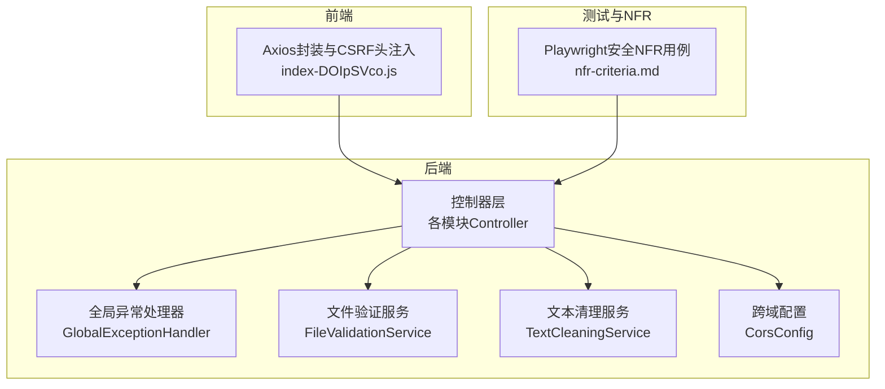
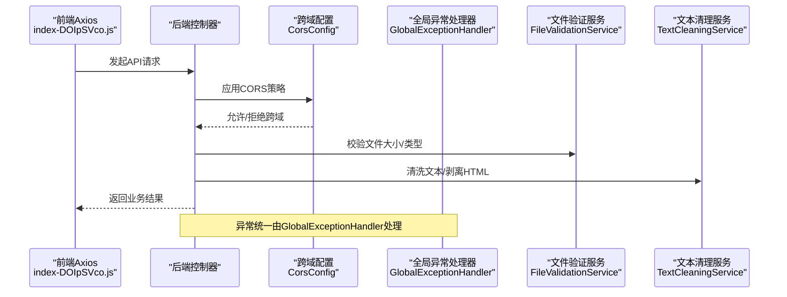
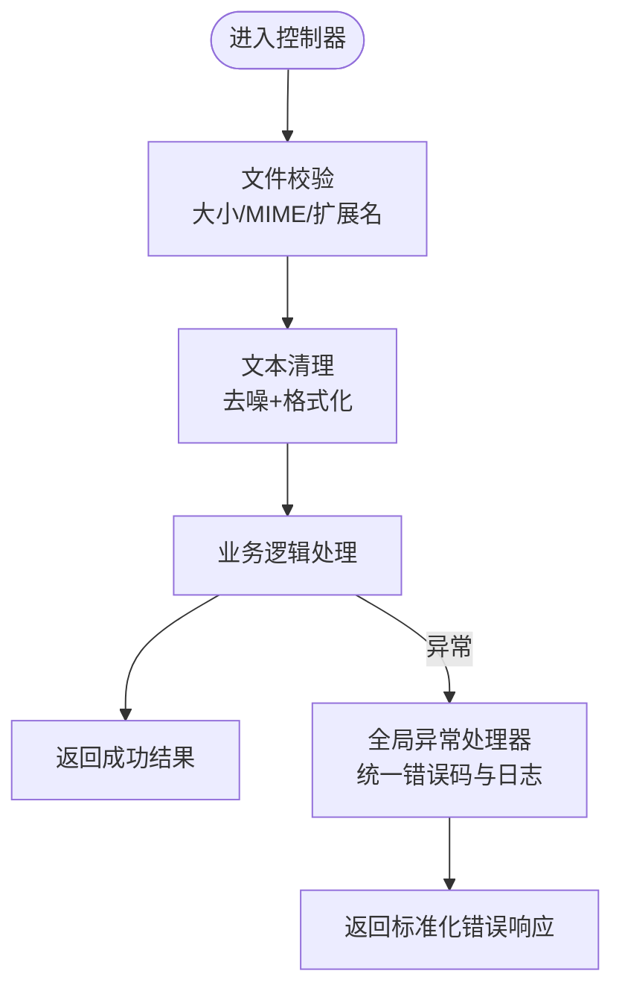
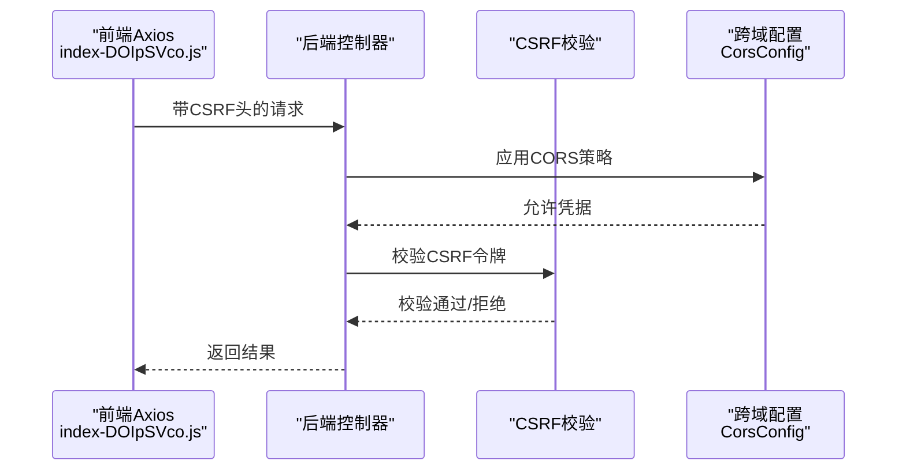
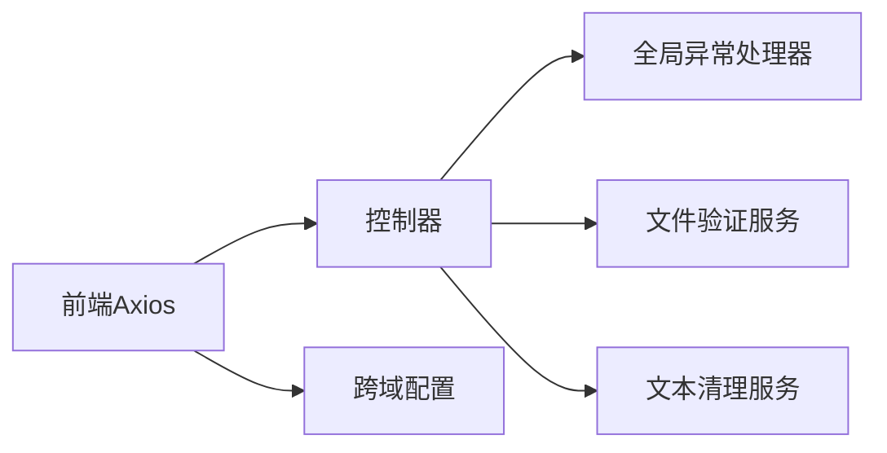

# API安全防护

<cite>
**本文引用的文件**
- [GlobalExceptionHandler.java](file://app/src/main/java/interview/guide/common/exception/GlobalExceptionHandler.java)
- [FileValidationService.java](file://app/src/main/java/interview/guide/infrastructure/file/FileValidationService.java)
- [TextCleaningService.java](file://app/src/main/java/interview/guide/infrastructure/file/TextCleaningService.java)
- [CorsConfig.java](file://app/src/main/java/interview/guide/common/config/CorsConfig.java)
- [index-DOIpSVco.js](file://frontend/dist/assets/index-DOIpSVco.js)
- [nfr-criteria.md](file://.opencode/skills/bmad-tea/resources/knowledge/nfr-criteria.md)
</cite>

## 目录
1. [简介](#简介)
2. [项目结构](#项目结构)
3. [核心组件](#核心组件)
4. [架构总览](#架构总览)
5. [详细组件分析](#详细组件分析)
6. [依赖关系分析](#依赖关系分析)
7. [性能考量](#性能考量)
8. [故障排查指南](#故障排查指南)
9. [结论](#结论)
10. [附录](#附录)

## 简介
本文件面向API安全防护，围绕输入验证与数据清理、SQL注入防护、XSS防护、CSRF防护、认证与授权、以及安全编码最佳实践进行系统化梳理。结合仓库中的异常处理、文件验证、文本清理、跨域配置等实现，给出可操作的安全建议与落地方案，并通过端到端测试用例对关键安全指标进行验证。

## 项目结构
从安全视角看，后端主要由以下模块构成：
- 异常处理层：统一拦截各类异常，避免敏感信息泄露，返回标准化错误结果
- 文件与内容处理层：文件类型与大小校验、文本清理与HTML剥离
- 安全配置层：跨域配置、前端HTTP客户端的CSRF相关行为
- 测试与NFR：通过Playwright端到端测试覆盖认证、授权、JWT过期、SQL注入阻断、XSS清洗等关键场景

图示来源
- [GlobalExceptionHandler.java:23-160](file://app/src/main/java/interview/guide/common/exception/GlobalExceptionHandler.java#L23-L160)
- [FileValidationService.java:16-129](file://app/src/main/java/interview/guide/infrastructure/file/FileValidationService.java#L16-L129)
- [TextCleaningService.java:11-162](file://app/src/main/java/interview/guide/infrastructure/file/TextCleaningService.java#L11-L162)
- [CorsConfig.java:15-44](file://app/src/main/java/interview/guide/common/config/CorsConfig.java#L15-L44)
- [index-DOIpSVco.js:1021-1044](file://frontend/dist/assets/index-DOIpSVco.js#L1021-L1044)
- [nfr-criteria.md:26-146](file://.opencode/skills/bmad-tea/resources/knowledge/nfr-criteria.md#L26-L146)

章节来源
- [GlobalExceptionHandler.java:23-160](file://app/src/main/java/interview/guide/common/exception/GlobalExceptionHandler.java#L23-L160)
- [FileValidationService.java:16-129](file://app/src/main/java/interview/guide/infrastructure/file/FileValidationService.java#L16-L129)
- [TextCleaningService.java:11-162](file://app/src/main/java/interview/guide/infrastructure/file/TextCleaningService.java#L11-L162)
- [CorsConfig.java:15-44](file://app/src/main/java/interview/guide/common/config/CorsConfig.java#L15-L44)
- [index-DOIpSVco.js:1021-1044](file://frontend/dist/assets/index-DOIpSVco.js#L1021-L1044)
- [nfr-criteria.md:26-146](file://.opencode/skills/bmad-tea/resources/knowledge/nfr-criteria.md#L26-L146)

## 核心组件
- 全局异常处理器：集中处理业务异常、参数校验异常、文件上传异常、网络异常、资源未找到、方法不支持等，统一返回业务错误码与标准化提示，避免敏感信息外泄
- 文件验证服务：对上传文件进行空值、大小、MIME类型与扩展名的双重校验，支持知识库格式白名单判断
- 文本清理服务：预编译正则，按“语义去噪+格式规范化”两层清理，支持HTML标签剥离，保障RAG/AI分析前的内容质量
- 跨域配置：限定允许来源、方法、头部，开启凭据，设置预检缓存时间，仅对/api/**生效
- 前端Axios：自动注入CSRF相关头（当环境满足条件时），并与后端跨域配置配合

章节来源
- [GlobalExceptionHandler.java:23-160](file://app/src/main/java/interview/guide/common/exception/GlobalExceptionHandler.java#L23-L160)
- [FileValidationService.java:16-129](file://app/src/main/java/interview/guide/infrastructure/file/FileValidationService.java#L16-L129)
- [TextCleaningService.java:11-162](file://app/src/main/java/interview/guide/infrastructure/file/TextCleaningService.java#L11-L162)
- [CorsConfig.java:15-44](file://app/src/main/java/interview/guide/common/config/CorsConfig.java#L15-L44)
- [index-DOIpSVco.js:1021-1044](file://frontend/dist/assets/index-DOIpSVco.js#L1021-L1044)

## 架构总览
下图展示API请求在安全层面的关键流转：前端发起请求，后端通过跨域配置与异常处理拦截潜在风险，文件与文本处理模块在入参与内容层面进行二次加固。

图示来源
- [CorsConfig.java:24-42](file://app/src/main/java/interview/guide/common/config/CorsConfig.java#L24-L42)
- [GlobalExceptionHandler.java:31-106](file://app/src/main/java/interview/guide/common/exception/GlobalExceptionHandler.java#L31-L106)
- [FileValidationService.java:27-77](file://app/src/main/java/interview/guide/infrastructure/file/FileValidationService.java#L27-L77)
- [TextCleaningService.java:80-105](file://app/src/main/java/interview/guide/infrastructure/file/TextCleaningService.java#L80-L105)
- [index-DOIpSVco.js:1021-1044](file://frontend/dist/assets/index-DOIpSVco.js#L1021-L1044)

## 详细组件分析

### 输入验证与数据清理
- 参数校验与绑定：统一拦截参数校验与绑定异常，聚合字段错误消息，避免内部异常栈外泄
- 业务异常：业务异常统一返回业务错误码与友好提示，便于前端展示与日志追踪
- 文件上传安全：空文件检测、大小上限、MIME与扩展名双重校验；知识库格式白名单
- 文本清理：控制字符、图片文件名/链接、文件协议、分隔线等语义噪声清理；换行规范化与空行压缩；HTML标签剥离

图示来源
- [FileValidationService.java:27-77](file://app/src/main/java/interview/guide/infrastructure/file/FileValidationService.java#L27-L77)
- [TextCleaningService.java:80-105](file://app/src/main/java/interview/guide/infrastructure/file/TextCleaningService.java#L80-L105)
- [GlobalExceptionHandler.java:41-62](file://app/src/main/java/interview/guide/common/exception/GlobalExceptionHandler.java#L41-L62)

章节来源
- [GlobalExceptionHandler.java:41-62](file://app/src/main/java/interview/guide/common/exception/GlobalExceptionHandler.java#L41-L62)
- [FileValidationService.java:27-77](file://app/src/main/java/interview/guide/infrastructure/file/FileValidationService.java#L27-L77)
- [TextCleaningService.java:80-105](file://app/src/main/java/interview/guide/infrastructure/file/TextCleaningService.java#L80-L105)

### SQL注入防护
- ORM与命名参数：推荐使用JPA Repository与命名参数查询，避免字符串拼接
- 动态SQL：若必须拼接，使用参数化查询与白名单校验，禁止直接拼接用户输入
- 数据访问层：通过Repository层隔离SQL构造，统一走参数化路径

说明：本仓库未直接暴露动态SQL拼接实现，建议在新增功能时遵循上述原则，确保所有数据库交互均采用参数化方式。

### XSS（跨站脚本攻击）防护
- 内容输出前清理：使用文本清理服务剥离HTML标签，必要时进行HTML实体转义
- 富文本编辑器：建议在前端引入受控的富文本组件，并在后端入库前做白名单过滤与长度限制
- 内容安全策略（CSP）：建议在网关或应用层配置CSP头，限制脚本执行来源

章节来源
- [TextCleaningService.java:146-160](file://app/src/main/java/interview/guide/infrastructure/file/TextCleaningService.java#L146-L160)

### CSRF（跨站请求伪造）防护
- 后端策略：Spring Security默认启用CSRF保护，要求携带CSRF令牌；后端严格校验来源与令牌
- 前端策略：Axios在标准浏览器环境下自动读取并注入CSRF Cookie为请求头，需确保同源与凭据设置正确
- 跨域策略：后端Cors配置允许凭据，前端请求需携带凭据，以保证CSRF令牌一致传递

图示来源
- [CorsConfig.java:33-36](file://app/src/main/java/interview/guide/common/config/CorsConfig.java#L33-L36)
- [index-DOIpSVco.js:1036-1040](file://frontend/dist/assets/index-DOIpSVco.js#L1036-L1040)

章节来源
- [CorsConfig.java:33-36](file://app/src/main/java/interview/guide/common/config/CorsConfig.java#L33-L36)
- [index-DOIpSVco.js:1036-1040](file://frontend/dist/assets/index-DOIpSVco.js#L1036-L1040)

### 认证与授权机制
- 认证：建议采用JWT令牌，后端解析并校验签名与有效期；令牌过期后拒绝请求
- 授权：基于角色/权限注解（如@PreAuthorize/@PostAuthorize）在控制器或服务层进行细粒度授权
- 端到端验证：通过Playwright测试覆盖未登录访问重定向、JWT过期、密码不泄露等关键场景

章节来源
- [nfr-criteria.md:32-103](file://.opencode/skills/bmad-tea/resources/knowledge/nfr-criteria.md#L32-L103)

### 安全编码最佳实践
- 参数校验：在控制器层使用Spring Validation，异常统一由全局异常处理器处理
- 输出编码：对外输出前进行HTML实体转义或内容剥离，避免XSS
- 日志脱敏：异常日志不记录敏感字段（如密码、密钥），统一使用业务错误码
- 错误信息设计：对用户友好的提示与内部日志分离，避免泄露实现细节
- 文件安全：上传文件先做类型与大小校验，再进行内容清理与持久化

章节来源
- [GlobalExceptionHandler.java:31-106](file://app/src/main/java/interview/guide/common/exception/GlobalExceptionHandler.java#L31-L106)
- [FileValidationService.java:27-77](file://app/src/main/java/interview/guide/infrastructure/file/FileValidationService.java#L27-L77)
- [TextCleaningService.java:146-160](file://app/src/main/java/interview/guide/infrastructure/file/TextCleaningService.java#L146-L160)

## 依赖关系分析
- 控制器依赖异常处理器进行错误收敛
- 控制器依赖文件验证与文本清理服务进行入参与内容安全
- 前端Axios依赖跨域配置与CSRF头注入，确保跨域与CSRF防护协同

图示来源
- [GlobalExceptionHandler.java:23-160](file://app/src/main/java/interview/guide/common/exception/GlobalExceptionHandler.java#L23-L160)
- [FileValidationService.java:16-129](file://app/src/main/java/interview/guide/infrastructure/file/FileValidationService.java#L16-L129)
- [TextCleaningService.java:11-162](file://app/src/main/java/interview/guide/infrastructure/file/TextCleaningService.java#L11-L162)
- [CorsConfig.java:15-44](file://app/src/main/java/interview/guide/common/config/CorsConfig.java#L15-L44)
- [index-DOIpSVco.js:1021-1044](file://frontend/dist/assets/index-DOIpSVco.js#L1021-L1044)

章节来源
- [GlobalExceptionHandler.java:23-160](file://app/src/main/java/interview/guide/common/exception/GlobalExceptionHandler.java#L23-L160)
- [FileValidationService.java:16-129](file://app/src/main/java/interview/guide/infrastructure/file/FileValidationService.java#L16-L129)
- [TextCleaningService.java:11-162](file://app/src/main/java/interview/guide/infrastructure/file/TextCleaningService.java#L11-L162)
- [CorsConfig.java:15-44](file://app/src/main/java/interview/guide/common/config/CorsConfig.java#L15-L44)
- [index-DOIpSVco.js:1021-1044](file://frontend/dist/assets/index-DOIpSVco.js#L1021-L1044)

## 性能考量
- 正则预编译：文本清理服务对常用模式进行预编译，降低重复编译开销
- 批量清理：在批量文本处理时，优先使用流式处理与合理分块，避免一次性加载过大文本
- 跨域预检缓存：合理设置MaxAge，减少重复预检请求
- 异常处理：统一异常映射与日志级别控制，避免高频异常导致日志风暴

章节来源
- [TextCleaningService.java:14-54](file://app/src/main/java/interview/guide/infrastructure/file/TextCleaningService.java#L14-L54)
- [CorsConfig.java:36-36](file://app/src/main/java/interview/guide/common/config/CorsConfig.java#L36-L36)

## 故障排查指南
- 404/405错误：检查控制器路径与HTTP方法是否匹配，确认异常处理器已捕获并返回标准化错误
- 文件上传失败：检查文件大小、MIME类型与扩展名是否符合白名单，查看异常处理器对上传异常的映射
- CSRF校验失败：确认前端请求携带凭据且CSRF头正确注入，后端CORS允许凭据
- XSS内容异常：检查文本清理流程是否在入库前执行，HTML标签是否被剥离

章节来源
- [GlobalExceptionHandler.java:133-148](file://app/src/main/java/interview/guide/common/exception/GlobalExceptionHandler.java#L133-L148)
- [CorsConfig.java:33-36](file://app/src/main/java/interview/guide/common/config/CorsConfig.java#L33-L36)
- [TextCleaningService.java:146-160](file://app/src/main/java/interview/guide/infrastructure/file/TextCleaningService.java#L146-L160)

## 结论
本项目在安全方面已具备较为完善的基线能力：统一异常处理、文件与文本安全校验、跨域与CSRF协同、端到端安全NFR验证。建议在后续迭代中持续强化ORM参数化、富文本白名单、CSP策略与权限注解的深度应用，确保API在输入、传输、存储与输出全链路的安全性。

## 附录
- 端到端安全NFR用例要点：未登录访问重定向、JWT过期、密码不泄露、RBAC权限控制、SQL注入阻断、XSS清洗

章节来源
- [nfr-criteria.md:32-135](file://.opencode/skills/bmad-tea/resources/knowledge/nfr-criteria.md#L32-L135)