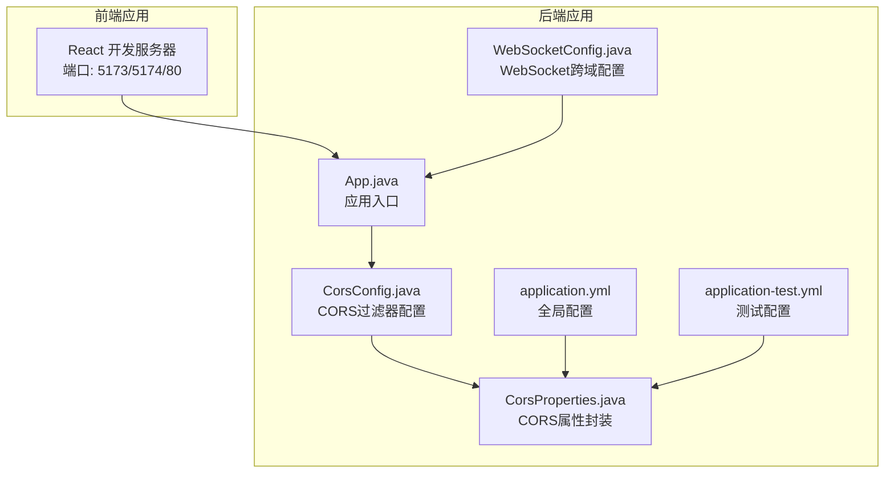
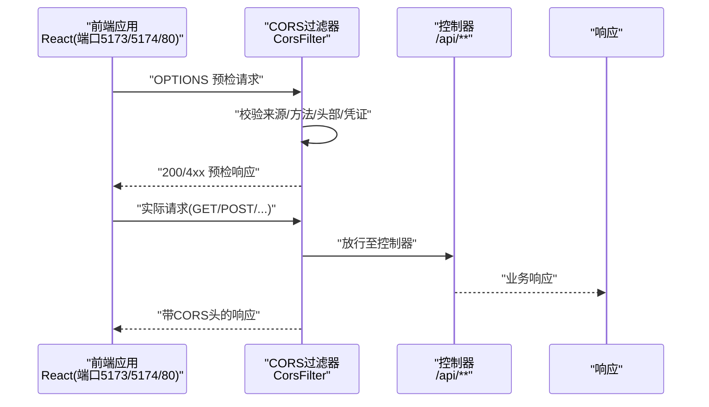
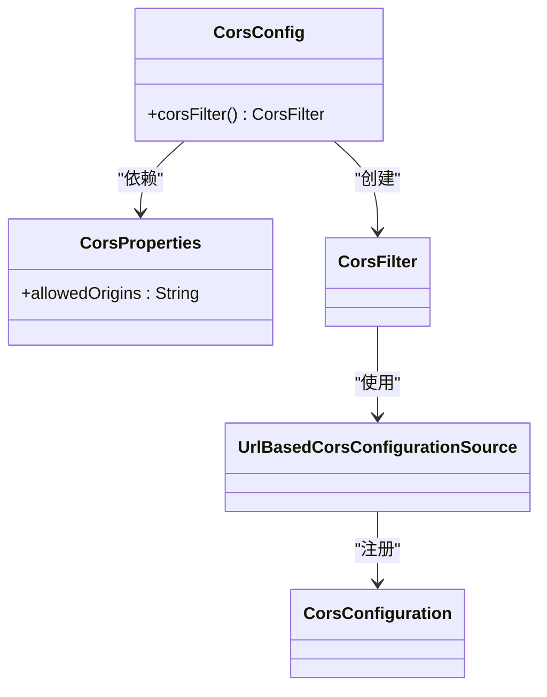
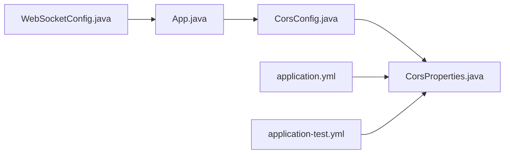
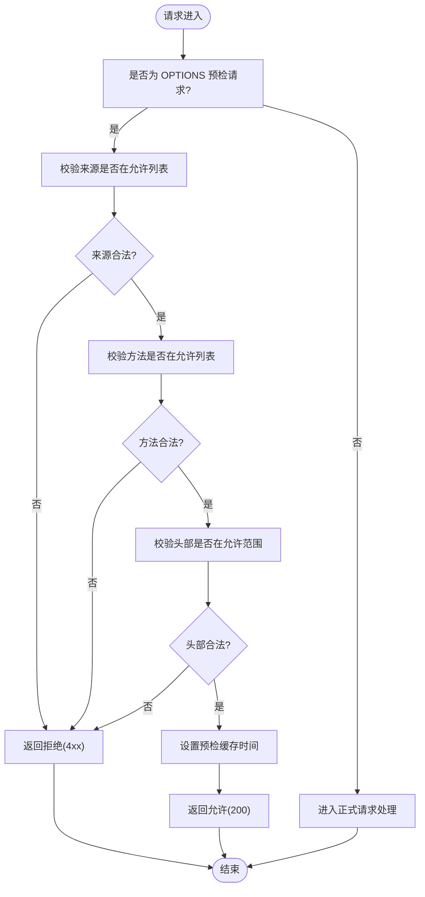

# CORS跨域配置

<cite>
**本文引用的文件**
- [CorsConfig.java](file://app/src/main/java/interview/guide/common/config/CorsConfig.java)
- [CorsProperties.java](file://app/src/main/java/interview/guide/common/config/CorsProperties.java)
- [application.yml](file://app/src/main/resources/application.yml)
- [application-test.yml](file://app/src/test/resources/application-test.yml)
- [WebSocketConfig.java](file://app/src/main/java/interview/guide/modules/voiceinterview/config/WebSocketConfig.java)
- [SseController.java](file://sse-demo/backend/src/main/java/com/example/sse/controller/SseController.java)
- [App.java](file://app/src/main/java/interview/guide/App.java)
</cite>

## 目录
1. [简介](#简介)
2. [项目结构](#项目结构)
3. [核心组件](#核心组件)
4. [架构总览](#架构总览)
5. [详细组件分析](#详细组件分析)
6. [依赖分析](#依赖分析)
7. [性能考量](#性能考量)
8. [故障排查指南](#故障排查指南)
9. [结论](#结论)
10. [附录](#附录)

## 简介
本文件围绕本项目的CORS跨域配置进行系统性说明，涵盖CORS工作原理、预检请求（OPTIONS）处理机制、允许的HTTP方法与头部配置、Spring Security与WebMvcConfigurer的集成方式、@CrossOrigin注解的使用、全局CORS策略设置，以及针对不同域名、端口、协议的跨域访问控制策略。同时提供本地开发与生产环境的配置差异建议、具体配置示例路径、安全最佳实践（最小权限、来源白名单、预检缓存等）。

## 项目结构
本项目采用Spring Boot标准目录结构，CORS相关配置集中在通用配置模块中，并通过属性文件集中管理。前端React应用默认运行在本地开发服务器端口，后端服务监听固定端口，二者之间通过CORS实现跨域通信。

**图表来源**
- [App.java:1-19](file://app/src/main/java/interview/guide/App.java#L1-L19)
- [CorsConfig.java:1-44](file://app/src/main/java/interview/guide/common/config/CorsConfig.java#L1-L44)
- [CorsProperties.java:1-14](file://app/src/main/java/interview/guide/common/config/CorsProperties.java#L1-L14)
- [application.yml:190-193](file://app/src/main/resources/application.yml#L190-L193)
- [application-test.yml:92-93](file://app/src/test/resources/application-test.yml#L92-L93)
- [WebSocketConfig.java:1-25](file://app/src/main/java/interview/guide/modules/voiceinterview/config/WebSocketConfig.java#L1-L25)

**章节来源**
- [App.java:1-19](file://app/src/main/java/interview/guide/App.java#L1-L19)
- [application.yml:190-193](file://app/src/main/resources/application.yml#L190-L193)
- [application-test.yml:92-93](file://app/src/test/resources/application-test.yml#L92-L93)

## 核心组件
- CORS过滤器与配置源：通过自定义过滤器注册全局CORS策略，限定匹配路径前缀，统一处理来源、方法、头部、凭证与预检缓存时间。
- 属性封装：将允许的来源列表抽取为可配置属性，便于在不同环境灵活切换。
- 全局生效：过滤器对指定API前缀生效，确保跨域请求在进入控制器之前得到处理。

关键点
- 允许来源：从属性读取并按逗号分隔解析，逐个添加到配置对象。
- 允许方法：包含常用REST方法及OPTIONS，满足预检与正式请求。
- 允许头部：使用通配符，简化前端请求头管理。
- 凭证传递：允许携带Cookie/认证头，满足登录态跨域场景。
- 预检缓存：设置最大缓存时长，降低重复预检请求。

**章节来源**
- [CorsConfig.java:24-42](file://app/src/main/java/interview/guide/common/config/CorsConfig.java#L24-L42)
- [CorsProperties.java:12](file://app/src/main/java/interview/guide/common/config/CorsProperties.java#L12)
- [application.yml:190-193](file://app/src/main/resources/application.yml#L190-L193)

## 架构总览
下图展示浏览器前端与后端服务之间的跨域交互流程，重点体现预检请求与正式请求的处理路径。

**图表来源**
- [CorsConfig.java:24-42](file://app/src/main/java/interview/guide/common/config/CorsConfig.java#L24-L42)
- [application.yml:190-193](file://app/src/main/resources/application.yml#L190-L193)

## 详细组件分析

### CORS过滤器与配置（CorsConfig）
- 组件职责：创建并注册全局CORS过滤器，基于属性配置动态构建策略。
- 关键行为：
  - 读取允许来源列表并逐项添加。
  - 设置允许的方法集合（含OPTIONS）。
  - 设置允许的请求头（通配符）。
  - 允许凭证传递。
  - 设置预检请求缓存时长。
  - 将策略绑定到API前缀路径。

**图表来源**
- [CorsConfig.java:15-42](file://app/src/main/java/interview/guide/common/config/CorsConfig.java#L15-L42)
- [CorsProperties.java:7-13](file://app/src/main/java/interview/guide/common/config/CorsProperties.java#L7-L13)

**章节来源**
- [CorsConfig.java:15-42](file://app/src/main/java/interview/guide/common/config/CorsConfig.java#L15-L42)
- [CorsProperties.java:7-13](file://app/src/main/java/interview/guide/common/config/CorsProperties.java#L7-L13)

### CORS属性封装（CorsProperties）
- 组件职责：将CORS相关配置抽取为可注入的属性对象，支持外部覆盖。
- 默认值：本地开发默认来源为指定端口。
- 外部覆盖：通过环境变量或配置文件覆盖默认来源列表。

**章节来源**
- [CorsProperties.java:9-13](file://app/src/main/java/interview/guide/common/config/CorsProperties.java#L9-L13)
- [application.yml:190-193](file://app/src/main/resources/application.yml#L190-L193)
- [application-test.yml:92-93](file://app/src/test/resources/application-test.yml#L92-L93)

### WebMvcConfigurer与@CrossOrigin（概念说明）
- WebMvcConfigurer：通过实现该接口可定制拦截器、视图解析器、CORS等，常用于集中式CORS配置。
- @CrossOrigin：在控制器或方法级别声明跨域策略，适用于局部场景。
- 在本项目中，全局CORS通过过滤器实现，未使用上述两种方式；如需扩展，可在现有基础上叠加。

[本节为概念性说明，不直接分析具体文件，故无章节来源]

### WebSocket跨域配置（WebSocketConfig）
- 组件职责：启用WebSocket并为特定端点设置允许来源。
- 注意事项：示例中使用通配符，生产环境应替换为明确来源，遵循最小权限原则。

**章节来源**
- [WebSocketConfig.java:20-23](file://app/src/main/java/interview/guide/modules/voiceinterview/config/WebSocketConfig.java#L20-L23)

### SSE跨域示例（SseController）
- 组件职责：演示基于注解的跨域配置，适用于特定控制器或方法。
- 实践要点：若仅部分端点需要跨域，可采用注解方式；否则建议统一使用全局过滤器。

**章节来源**
- [SseController.java:21-23](file://sse-demo/backend/src/main/java/com/example/sse/controller/SseController.java#L21-L23)

## 依赖分析
- CorsConfig依赖CorsProperties以获取允许来源列表。
- 应用启动类负责扫描组件，CORS过滤器随应用启动生效。
- 配置文件提供运行时参数，测试配置与生产配置存在差异。

**图表来源**
- [App.java:11-12](file://app/src/main/java/interview/guide/App.java#L11-L12)
- [CorsConfig.java:18-22](file://app/src/main/java/interview/guide/common/config/CorsConfig.java#L18-L22)
- [CorsProperties.java:9-13](file://app/src/main/java/interview/guide/common/config/CorsProperties.java#L9-L13)
- [application.yml:190-193](file://app/src/main/resources/application.yml#L190-L193)
- [application-test.yml:92-93](file://app/src/test/resources/application-test.yml#L92-L93)
- [WebSocketConfig.java:11-14](file://app/src/main/java/interview/guide/modules/voiceinterview/config/WebSocketConfig.java#L11-L14)

**章节来源**
- [App.java:11-12](file://app/src/main/java/interview/guide/App.java#L11-L12)
- [CorsConfig.java:18-22](file://app/src/main/java/interview/guide/common/config/CorsConfig.java#L18-L22)
- [CorsProperties.java:9-13](file://app/src/main/java/interview/guide/common/config/CorsProperties.java#L9-L13)
- [application.yml:190-193](file://app/src/main/resources/application.yml#L190-L193)
- [application-test.yml:92-93](file://app/src/test/resources/application-test.yml#L92-L93)
- [WebSocketConfig.java:11-14](file://app/src/main/java/interview/guide/modules/voiceinterview/config/WebSocketConfig.java#L11-L14)

## 性能考量
- 预检请求缓存：合理设置最大缓存时长可显著降低重复预检开销。
- 允许头部通配符：虽简化前端适配，但可能增加复杂请求判定成本，建议在生产环境按需收紧。
- 凭证传递：开启后会增加鉴权相关处理，需结合安全策略评估收益与成本。

[本节提供一般性指导，不直接分析具体文件，故无章节来源]

## 故障排查指南
- 预检失败（403/405）：检查允许来源、方法与头部是否匹配；确认是否包含OPTIONS。
- 正式请求被拒绝：确认凭证传递与CORS头是否正确返回。
- 来源不匹配：核对配置文件中的来源列表与前端实际端口是否一致。
- 生产环境跨域异常：将通配符来源替换为精确来源，避免宽松策略带来的风险。

[本节提供一般性指导，不直接分析具体文件，故无章节来源]

## 结论
本项目通过全局CORS过滤器实现跨域控制，结合属性配置实现灵活的来源管理。生产环境建议收紧来源与头部范围、避免通配符滥用，并对凭证传递与预检缓存进行审慎配置。对于WebSocket与SSE等特殊场景，应在统一策略基础上进行差异化加固。

[本节为总结性内容，不直接分析具体文件，故无章节来源]

## 附录

### 预检请求处理流程（算法流程）

**图表来源**
- [CorsConfig.java:24-42](file://app/src/main/java/interview/guide/common/config/CorsConfig.java#L24-L42)

### 允许的HTTP方法与头部配置
- 方法：GET、POST、PUT、DELETE、PATCH、OPTIONS
- 头部：允许所有请求头（通配符）
- 凭证：允许携带Cookie/认证头
- 预检缓存：单位秒

**章节来源**
- [CorsConfig.java:33-36](file://app/src/main/java/interview/guide/common/config/CorsConfig.java#L33-L36)

### 不同域名、端口、协议的跨域控制
- 本地开发：允许来源包含多个常用前端端口。
- 生产环境：建议将来源限定为受控域名与端口，避免使用通配符。

**章节来源**
- [application.yml:190-193](file://app/src/main/resources/application.yml#L190-L193)
- [application-test.yml:92-93](file://app/src/test/resources/application-test.yml#L92-L93)

### 全局CORS策略设置路径
- 过滤器注册：在配置类中创建并注册CORS过滤器。
- 匹配路径：对API前缀路径生效。
- 属性驱动：通过属性文件集中管理允许来源。

**章节来源**
- [CorsConfig.java:24-42](file://app/src/main/java/interview/guide/common/config/CorsConfig.java#L24-L42)
- [application.yml:190-193](file://app/src/main/resources/application.yml#L190-L193)

### Spring Security中的CORS配置（概念说明）
- WebMvcConfigurer：集中式CORS配置入口，适合与Spring MVC集成。
- @CrossOrigin：方法级/类级注解，适合局部场景。
- 在本项目中，CORS通过过滤器实现，未使用上述两种方式；如需扩展，可在现有基础上叠加。

[本节为概念性说明，不直接分析具体文件，故无章节来源]

### 安全最佳实践
- 最小权限：仅允许必要的来源、方法与头部。
- 来源白名单：生产环境避免使用通配符来源。
- 预检缓存：根据变更频率合理设置，避免过长导致策略滞后。
- 凭证传递：谨慎开启，确保前端与后端的认证链路安全。

[本节提供一般性指导，不直接分析具体文件，故无章节来源]