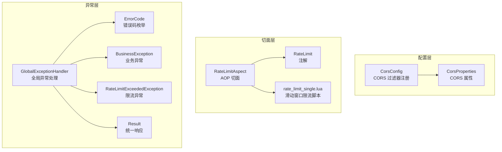
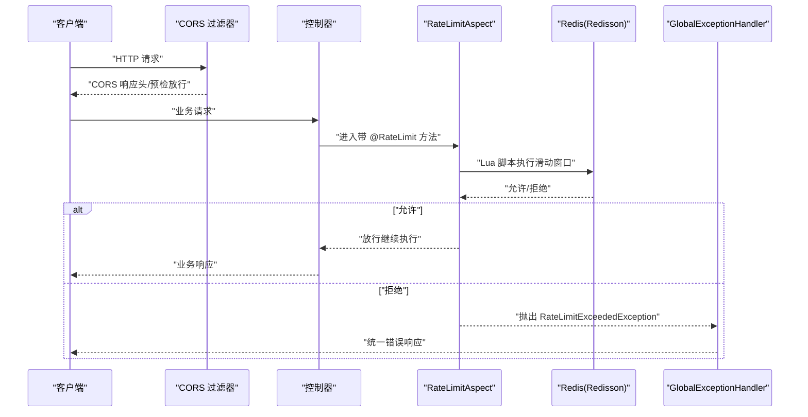
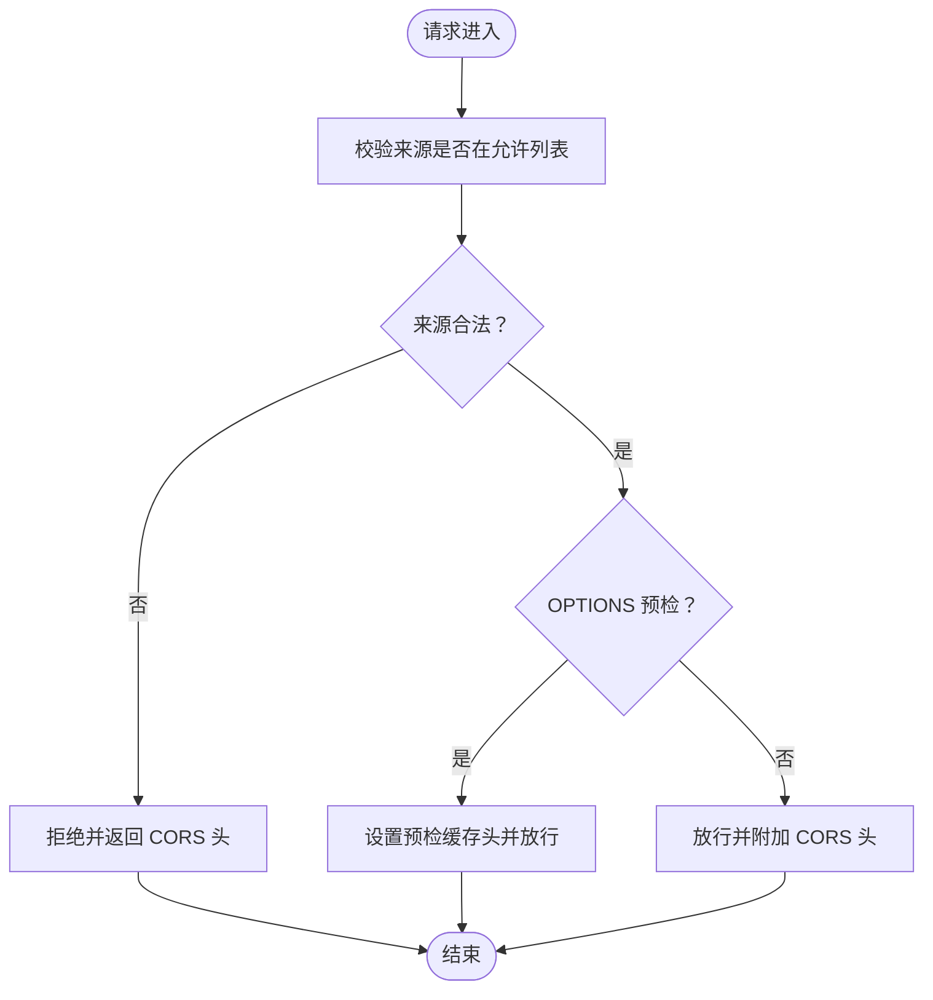
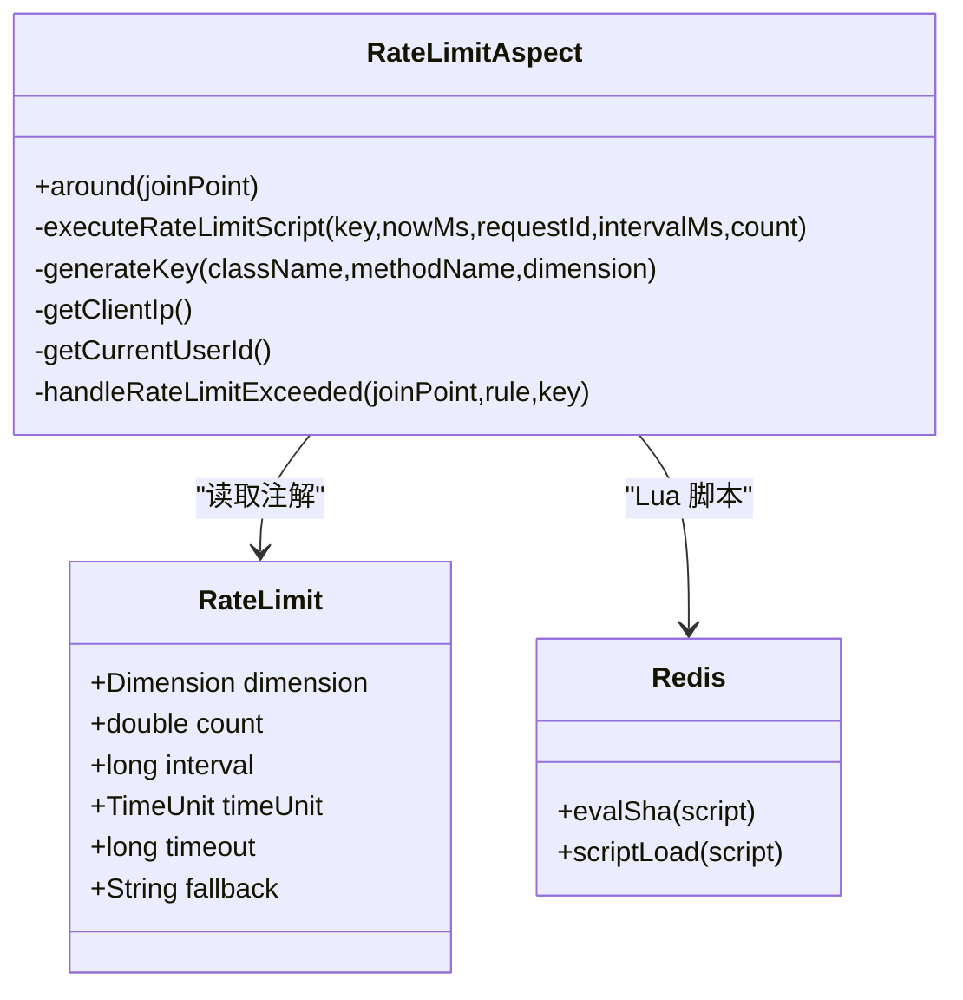
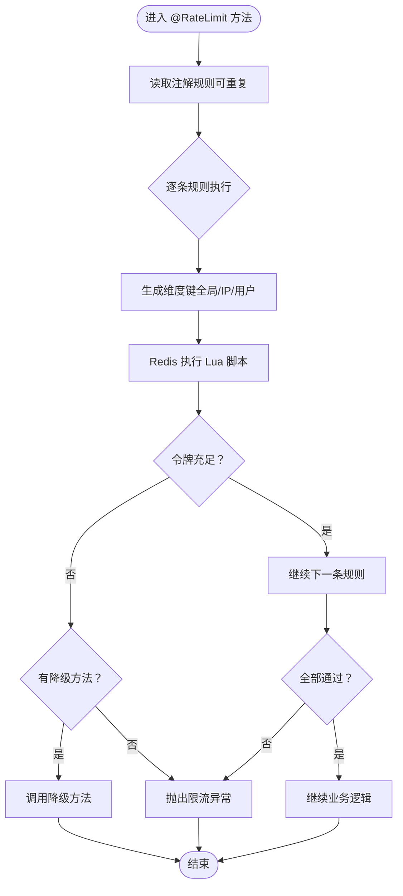
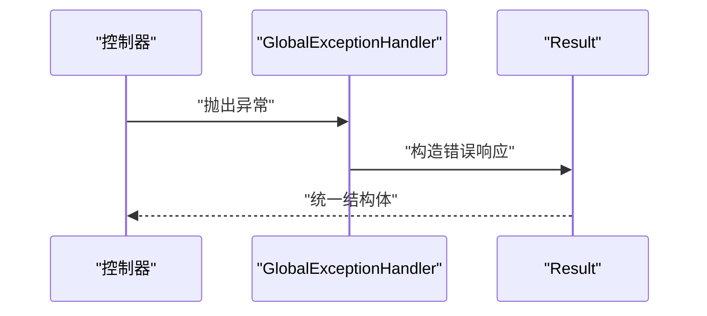
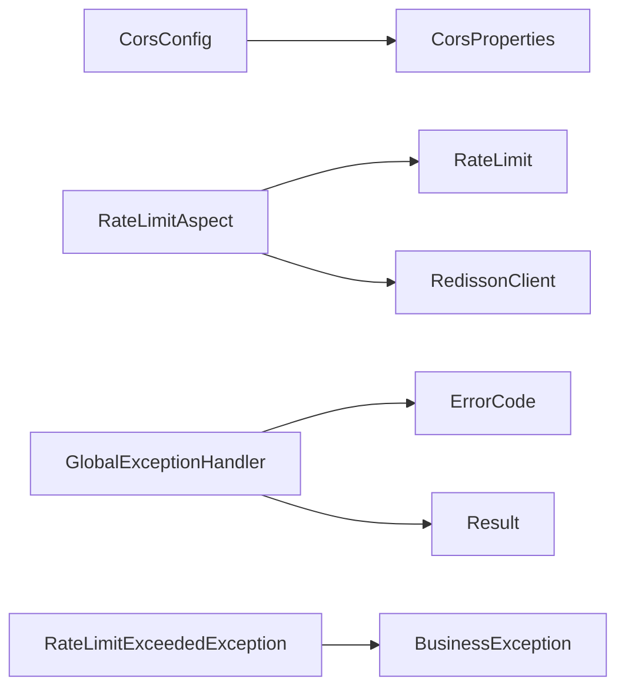

# 安全和权限

<cite>
**本文引用的文件**
- [CorsConfig.java](file://app/src/main/java/interview/guide/common/config/CorsConfig.java)
- [CorsProperties.java](file://app/src/main/java/interview/guide/common/config/CorsProperties.java)
- [RateLimit.java](file://app/src/main/java/interview/guide/common/annotation/RateLimit.java)
- [RateLimitAspect.java](file://app/src/main/java/interview/guide/common/aspect/RateLimitAspect.java)
- [rate_limit_single.lua](file://app/src/main/resources/scripts/rate_limit_single.lua)
- [GlobalExceptionHandler.java](file://app/src/main/java/interview/guide/common/exception/GlobalExceptionHandler.java)
- [ErrorCode.java](file://app/src/main/java/interview/guide/common/exception/ErrorCode.java)
- [BusinessException.java](file://app/src/main/java/interview/guide/common/exception/BusinessException.java)
- [RateLimitExceededException.java](file://app/src/main/java/interview/guide/common/exception/RateLimitExceededException.java)
- [Result.java](file://app/src/main/java/interview/guide/common/result/Result.java)
- [application-test.yml](file://app/src/test/resources/application-test.yml)
- [RateLimitIntegrationTest.java](file://app/src/test/java/interview/guide/common/aspect/RateLimitIntegrationTest.java)
</cite>

## 目录
1. [引言](#引言)
2. [项目结构](#项目结构)
3. [核心组件](#核心组件)
4. [架构总览](#架构总览)
5. [详细组件分析](#详细组件分析)
6. [依赖分析](#依赖分析)
7. [性能考虑](#性能考虑)
8. [故障排查指南](#故障排查指南)
9. [结论](#结论)
10. [附录](#附录)

## 引言
本文件聚焦于本项目的“安全与权限”体系，涵盖以下方面：
- CORS 跨域配置：策略、预检请求处理、安全头设置
- 速率限制：注解驱动、Lua 原子限流、Redis 计数器
- 异常处理：全局捕获、错误码、统一响应格式
- 安全认证与授权：用户身份、权限控制、会话管理（概念性说明）
- API 安全最佳实践：输入校验、SQL 注入防护、XSS 防护（概念性说明）
- 数据安全与隐私：敏感数据处理、访问日志、审计追踪（概念性说明）
- 安全配置管理：环境变量、密钥、证书（概念性说明）
- 安全漏洞预防与应急响应（概念性说明）

## 项目结构
围绕安全与权限的关键模块分布如下：
- 配置层：CORS 配置与属性
- 切面层：基于注解的速率限制 AOP
- 脚本层：Redis Lua 原子限流脚本
- 异常层：全局异常处理器与错误码
- 结果层：统一响应封装

**图表来源**
- [CorsConfig.java:1-44](file://app/src/main/java/interview/guide/common/config/CorsConfig.java#L1-L44)
- [CorsProperties.java:1-14](file://app/src/main/java/interview/guide/common/config/CorsProperties.java#L1-L14)
- [RateLimit.java:1-120](file://app/src/main/java/interview/guide/common/annotation/RateLimit.java#L1-L120)
- [RateLimitAspect.java:1-265](file://app/src/main/java/interview/guide/common/aspect/RateLimitAspect.java#L1-L265)
- [rate_limit_single.lua:1-61](file://app/src/main/resources/scripts/rate_limit_single.lua#L1-L61)
- [GlobalExceptionHandler.java:1-161](file://app/src/main/java/interview/guide/common/exception/GlobalExceptionHandler.java#L1-L161)
- [ErrorCode.java:1-81](file://app/src/main/java/interview/guide/common/exception/ErrorCode.java#L1-L81)
- [BusinessException.java:1-50](file://app/src/main/java/interview/guide/common/exception/BusinessException.java#L1-L50)
- [RateLimitExceededException.java:1-22](file://app/src/main/java/interview/guide/common/exception/RateLimitExceededException.java#L1-L22)
- [Result.java:1-61](file://app/src/main/java/interview/guide/common/result/Result.java#L1-L61)

**章节来源**
- [CorsConfig.java:1-44](file://app/src/main/java/interview/guide/common/config/CorsConfig.java#L1-L44)
- [CorsProperties.java:1-14](file://app/src/main/java/interview/guide/common/config/CorsProperties.java#L1-L14)
- [RateLimit.java:1-120](file://app/src/main/java/interview/guide/common/annotation/RateLimit.java#L1-L120)
- [RateLimitAspect.java:1-265](file://app/src/main/java/interview/guide/common/aspect/RateLimitAspect.java#L1-L265)
- [rate_limit_single.lua:1-61](file://app/src/main/resources/scripts/rate_limit_single.lua#L1-L61)
- [GlobalExceptionHandler.java:1-161](file://app/src/main/java/interview/guide/common/exception/GlobalExceptionHandler.java#L1-L161)
- [ErrorCode.java:1-81](file://app/src/main/java/interview/guide/common/exception/ErrorCode.java#L1-L81)
- [BusinessException.java:1-50](file://app/src/main/java/interview/guide/common/exception/BusinessException.java#L1-L50)
- [RateLimitExceededException.java:1-22](file://app/src/main/java/interview/guide/common/exception/RateLimitExceededException.java#L1-L22)
- [Result.java:1-61](file://app/src/main/java/interview/guide/common/result/Result.java#L1-L61)

## 核心组件
- CORS 配置：集中式注册 /api/** 的跨域策略，支持动态来源、凭证、预检缓存等
- 速率限制：注解驱动的多维度限流（全局/IP/用户），基于 Redis Lua 原子脚本实现滑动窗口
- 全局异常处理：统一捕获各类异常，输出结构化错误码与消息
- 统一响应：固定字段 code/message/data，便于前端一致处理

**章节来源**
- [CorsConfig.java:24-42](file://app/src/main/java/interview/guide/common/config/CorsConfig.java#L24-L42)
- [RateLimit.java:30-120](file://app/src/main/java/interview/guide/common/annotation/RateLimit.java#L30-L120)
- [RateLimitAspect.java:66-90](file://app/src/main/java/interview/guide/common/aspect/RateLimitAspect.java#L66-L90)
- [GlobalExceptionHandler.java:23-161](file://app/src/main/java/interview/guide/common/exception/GlobalExceptionHandler.java#L23-L161)
- [Result.java:10-61](file://app/src/main/java/interview/guide/common/result/Result.java#L10-L61)

## 架构总览
下图展示从请求到响应的关键路径，以及安全相关组件的交互。

**图表来源**
- [CorsConfig.java:24-42](file://app/src/main/java/interview/guide/common/config/CorsConfig.java#L24-L42)
- [RateLimitAspect.java:66-90](file://app/src/main/java/interview/guide/common/aspect/RateLimitAspect.java#L66-L90)
- [rate_limit_single.lua:1-61](file://app/src/main/resources/scripts/rate_limit_single.lua#L1-L61)
- [GlobalExceptionHandler.java:154-161](file://app/src/main/java/interview/guide/common/exception/GlobalExceptionHandler.java#L154-L161)

## 详细组件分析

### CORS 跨域配置
- 策略要点
  - 动态来源：通过属性配置允许的来源列表，自动去除空白字符
  - 方法与头部：开放常用方法与通配符头部
  - 凭证：允许携带 Cookie/认证头
  - 预检缓存：最大预检有效期
  - 路径匹配：仅对 /api/** 生效
- 实现位置
  - 过滤器 Bean 注册与配置
  - 属性读取与来源解析
- 安全建议
  - 生产环境来源白名单最小化
  - 严格控制暴露头部与方法
  - 避免使用通配符来源与头部

**图表来源**
- [CorsConfig.java:24-42](file://app/src/main/java/interview/guide/common/config/CorsConfig.java#L24-L42)
- [CorsProperties.java:10-13](file://app/src/main/java/interview/guide/common/config/CorsProperties.java#L10-L13)

**章节来源**
- [CorsConfig.java:15-42](file://app/src/main/java/interview/guide/common/config/CorsConfig.java#L15-L42)
- [CorsProperties.java:7-13](file://app/src/main/java/interview/guide/common/config/CorsProperties.java#L7-L13)

### 速率限制机制
- 设计目标
  - 多维度独立限流：全局、IP、用户
  - 原子性与一致性：Lua 脚本保证滑动窗口计数
  - 降级策略：支持注解指定降级方法
- 关键实现
  - 注解定义：维度、窗口、阈值、超时、降级方法
  - 切面拦截：环绕通知逐条规则执行，任一不通过即拒绝
  - Redis 计数：基于有序集合记录令牌发放时间，数值键维护剩余令牌
  - Lua 脚本：回收过期令牌、判断配额、扣减并设置过期
- 测试验证
  - 集成测试覆盖：令牌充足/耗尽、多规则短路、维度独立计数
  - Redis 配置：测试环境指向本地 Redis

**图表来源**
- [RateLimit.java:30-120](file://app/src/main/java/interview/guide/common/annotation/RateLimit.java#L30-L120)
- [RateLimitAspect.java:34-265](file://app/src/main/java/interview/guide/common/aspect/RateLimitAspect.java#L34-L265)
- [rate_limit_single.lua:1-61](file://app/src/main/resources/scripts/rate_limit_single.lua#L1-L61)

**图表来源**
- [RateLimitAspect.java:66-90](file://app/src/main/java/interview/guide/common/aspect/RateLimitAspect.java#L66-L90)
- [rate_limit_single.lua:13-61](file://app/src/main/resources/scripts/rate_limit_single.lua#L13-L61)

**章节来源**
- [RateLimit.java:11-120](file://app/src/main/java/interview/guide/common/annotation/RateLimit.java#L11-L120)
- [RateLimitAspect.java:31-265](file://app/src/main/java/interview/guide/common/aspect/RateLimitAspect.java#L31-L265)
- [rate_limit_single.lua:1-61](file://app/src/main/resources/scripts/rate_limit_single.lua#L1-L61)
- [application-test.yml:20-26](file://app/src/test/resources/application-test.yml#L20-L26)
- [RateLimitIntegrationTest.java:36-159](file://app/src/test/java/interview/guide/common/aspect/RateLimitIntegrationTest.java#L36-L159)

### 异常处理系统
- 全局异常捕获
  - 业务异常：返回统一错误码与消息
  - 参数校验/绑定：提取字段错误并统一返回
  - 文件上传超限、非法参数、网络异常、AI 服务异常等
  - 404/方法不支持等 HTTP 语义异常
  - 未知异常：兜底错误码
- 错误码与响应
  - 错误码枚举：覆盖通用、简历、面试、存储、导出、知识库、AI 服务、限流等模块
  - 统一响应：code/message/data，状态码固定为 200，业务错误通过 code 区分

**图表来源**
- [GlobalExceptionHandler.java:23-161](file://app/src/main/java/interview/guide/common/exception/GlobalExceptionHandler.java#L23-L161)
- [ErrorCode.java:11-81](file://app/src/main/java/interview/guide/common/exception/ErrorCode.java#L11-L81)
- [Result.java:10-61](file://app/src/main/java/interview/guide/common/result/Result.java#L10-L61)

**章节来源**
- [GlobalExceptionHandler.java:20-161](file://app/src/main/java/interview/guide/common/exception/GlobalExceptionHandler.java#L20-L161)
- [ErrorCode.java:6-81](file://app/src/main/java/interview/guide/common/exception/ErrorCode.java#L6-L81)
- [BusinessException.java:5-50](file://app/src/main/java/interview/guide/common/exception/BusinessException.java#L5-L50)
- [RateLimitExceededException.java:3-22](file://app/src/main/java/interview/guide/common/exception/RateLimitExceededException.java#L3-L22)
- [Result.java:7-61](file://app/src/main/java/interview/guide/common/result/Result.java#L7-L61)

### 安全认证与授权（概念性说明）
- 身份验证：建议采用标准 JWT 或会话机制，结合 Spring Security 或自定义过滤器
- 权限控制：基于角色/资源的 RBAC，细粒度到接口与数据
- 会话管理：安全的 HttpOnly SameSite Cookie，配合刷新令牌与过期策略
- 本仓库未提供具体实现，以上为通用最佳实践

### API 安全最佳实践（概念性说明）
- 输入验证：参数校验、长度/范围限制、白名单策略
- SQL 注入防护：使用参数化查询、ORM、数据库权限最小化
- XSS 防护：输入转义/净化、输出编码、内容安全策略（CSP）
- 敏感信息：避免日志泄露、传输加密（TLS）、最小化暴露

### 数据安全与隐私保护（概念性说明）
- 加密：静态数据加密、传输加密；密钥轮换与安全存储
- 日志：脱敏与分级、访问审计、合规留存
- 审计：操作轨迹、变更审计、异常告警

### 安全配置管理（概念性说明）
- 环境变量：敏感配置通过环境变量注入，避免硬编码
- 密钥管理：密钥轮换、最小权限、安全存储（如 KMS）
- 证书：自动化签发与续期，禁用弱密码套件

### 安全漏洞预防与应急响应（概念性说明）
- 预防：依赖扫描、代码审计、安全基线、自动化测试
- 应急：事件分级、快速隔离、回滚与修复、复盘改进

## 依赖分析
- CORS
  - CorsConfig 依赖 CorsProperties 提供来源配置
- 速率限制
  - RateLimitAspect 依赖 Redisson 执行 Lua 脚本
  - RateLimit 注解定义限流维度与策略
- 异常处理
  - GlobalExceptionHandler 依赖 ErrorCode 与 Result 输出统一格式
  - RateLimitExceededException 继承 BusinessException

**图表来源**
- [CorsConfig.java:18-22](file://app/src/main/java/interview/guide/common/config/CorsConfig.java#L18-L22)
- [CorsProperties.java:7-13](file://app/src/main/java/interview/guide/common/config/CorsProperties.java#L7-L13)
- [RateLimitAspect.java:37-38](file://app/src/main/java/interview/guide/common/aspect/RateLimitAspect.java#L37-L38)
- [RateLimit.java:30-120](file://app/src/main/java/interview/guide/common/annotation/RateLimit.java#L30-L120)
- [GlobalExceptionHandler.java:23-161](file://app/src/main/java/interview/guide/common/exception/GlobalExceptionHandler.java#L23-L161)
- [ErrorCode.java:11-81](file://app/src/main/java/interview/guide/common/exception/ErrorCode.java#L11-L81)
- [Result.java:10-61](file://app/src/main/java/interview/guide/common/result/Result.java#L10-L61)
- [RateLimitExceededException.java:7-22](file://app/src/main/java/interview/guide/common/exception/RateLimitExceededException.java#L7-L22)
- [BusinessException.java:8-50](file://app/src/main/java/interview/guide/common/exception/BusinessException.java#L8-L50)

**章节来源**
- [CorsConfig.java:15-42](file://app/src/main/java/interview/guide/common/config/CorsConfig.java#L15-L42)
- [CorsProperties.java:7-13](file://app/src/main/java/interview/guide/common/config/CorsProperties.java#L7-L13)
- [RateLimitAspect.java:31-265](file://app/src/main/java/interview/guide/common/aspect/RateLimitAspect.java#L31-L265)
- [RateLimit.java:11-120](file://app/src/main/java/interview/guide/common/annotation/RateLimit.java#L11-L120)
- [GlobalExceptionHandler.java:20-161](file://app/src/main/java/interview/guide/common/exception/GlobalExceptionHandler.java#L20-L161)
- [ErrorCode.java:6-81](file://app/src/main/java/interview/guide/common/exception/ErrorCode.java#L6-L81)
- [Result.java:7-61](file://app/src/main/java/interview/guide/common/result/Result.java#L7-L61)
- [RateLimitExceededException.java:3-22](file://app/src/main/java/interview/guide/common/exception/RateLimitExceededException.java#L3-L22)
- [BusinessException.java:1-50](file://app/src/main/java/interview/guide/common/exception/BusinessException.java#L1-L50)

## 性能考虑
- Redis Lua 原子性：避免分布式锁与竞态条件，降低网络往返
- 键设计：维度键带哈希标签，减少热点与键冲突
- 过期策略：窗口两倍时间作为过期，平衡内存与准确性
- 预检缓存：合理设置 Max-Age，减少 OPTIONS 频率
- 降级策略：在高并发场景优先保障核心链路，非关键路径降级

## 故障排查指南
- CORS 相关
  - 确认来源是否在允许列表且无多余空格
  - 检查预检请求是否命中 /api/** 路径
- 限流相关
  - 核对注解维度与实际来源（IP/用户）是否正确
  - 观察 Redis 中对应键是否存在与过期时间
  - 若出现 NOSCRIPT 异常，确认脚本已加载
- 异常相关
  - 查看全局异常处理器映射的错误码
  - 确认 Result 统一结构是否被前端正确解析

**章节来源**
- [CorsConfig.java:24-42](file://app/src/main/java/interview/guide/common/config/CorsConfig.java#L24-L42)
- [RateLimitAspect.java:111-126](file://app/src/main/java/interview/guide/common/aspect/RateLimitAspect.java#L111-L126)
- [GlobalExceptionHandler.java:88-128](file://app/src/main/java/interview/guide/common/exception/GlobalExceptionHandler.java#L88-L128)

## 结论
本项目在安全与权限方面提供了：
- 明确的 CORS 策略与预检处理
- 基于注解与 Redis 的多维度过载保护
- 全局异常与统一响应，提升可观测性与一致性
建议后续补充：
- 明确的身份认证与授权实现
- 输入校验与安全中间件
- 审计与日志脱敏
- 密钥与证书的运维规范

## 附录
- 测试环境 Redis 配置参考
  - 测试配置中 Redisson 使用本地地址与数据库索引
- 集成测试要点
  - 需要 Redis 服务在线
  - 覆盖基本限流、多规则与维度独立计数

**章节来源**
- [application-test.yml:20-26](file://app/src/test/resources/application-test.yml#L20-L26)
- [RateLimitIntegrationTest.java:22-38](file://app/src/test/java/interview/guide/common/aspect/RateLimitIntegrationTest.java#L22-L38)