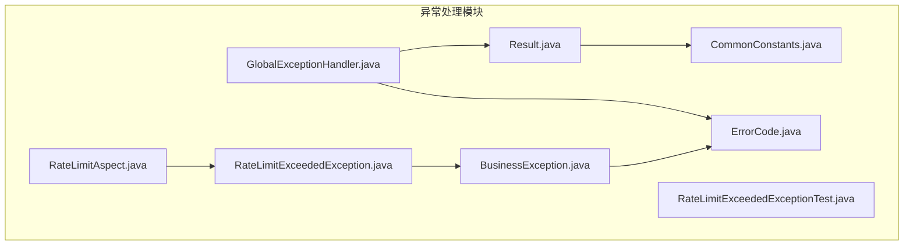
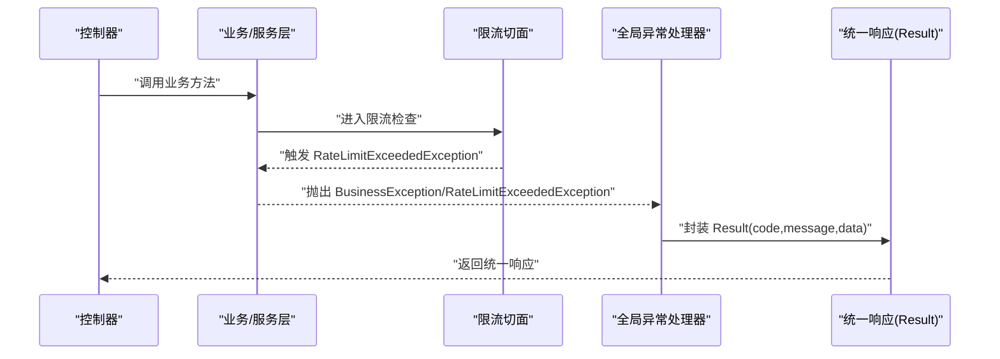
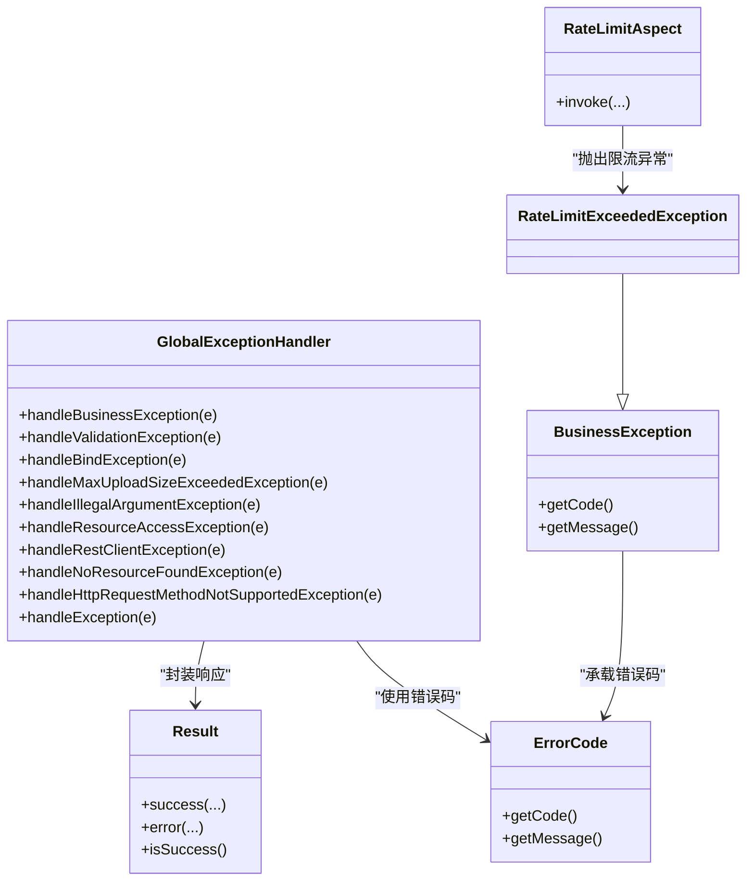

# 异常处理系统

<cite>
**本文引用的文件**
- [GlobalExceptionHandler.java](file://app/src/main/java/interview/guide/common/exception/GlobalExceptionHandler.java)
- [BusinessException.java](file://app/src/main/java/interview/guide/common/exception/BusinessException.java)
- [ErrorCode.java](file://app/src/main/java/interview/guide/common/exception/ErrorCode.java)
- [RateLimitExceededException.java](file://app/src/main/java/interview/guide/common/exception/RateLimitExceededException.java)
- [Result.java](file://app/src/main/java/interview/guide/common/result/Result.java)
- [CommonConstants.java](file://app/src/main/java/interview/guide/common/constant/CommonConstants.java)
- [RateLimitAspect.java](file://app/src/main/java/interview/guide/common/aspect/RateLimitAspect.java)
- [RateLimitExceededExceptionTest.java](file://app/src/test/java/interview/guide/common/exception/RateLimitExceededExceptionTest.java)
- [App.java](file://app/src/main/java/interview/guide/App.java)
</cite>

## 目录
1. [简介](#简介)
2. [项目结构](#项目结构)
3. [核心组件](#核心组件)
4. [架构总览](#架构总览)
5. [详细组件分析](#详细组件分析)
6. [依赖分析](#依赖分析)
7. [性能考量](#性能考量)
8. [故障排查指南](#故障排查指南)
9. [结论](#结论)
10. [附录](#附录)

## 简介
本文件系统性阐述本项目的异常处理体系，围绕 Spring Boot 的全局异常处理机制展开，重点覆盖以下方面：
- 使用 @RestControllerAdvice 实现全局异常拦截与统一响应封装
- 业务异常 BusinessException 及其子类 RateLimitExceededException 的设计与使用
- 错误码体系 ErrorCode 的分层设计与与 HTTP 状态码的映射策略
- 统一响应格式 Result 的结构与最佳实践
- 异常处理最佳实践：异常分类、错误消息设计、日志记录与安全注意事项

## 项目结构
异常处理相关代码主要位于以下包路径：
- common.exception：全局异常处理器、业务异常基类、错误码枚举、限流异常
- common.result：统一响应封装类
- common.constant：通用状态码常量
- common.aspect：限流切面，用于在达到阈值时抛出限流异常
- 测试：对限流异常行为进行单元测试

图表来源
- [GlobalExceptionHandler.java:1-161](file://app/src/main/java/interview/guide/common/exception/GlobalExceptionHandler.java#L1-L161)
- [BusinessException.java:1-50](file://app/src/main/java/interview/guide/common/exception/BusinessException.java#L1-L50)
- [ErrorCode.java:1-81](file://app/src/main/java/interview/guide/common/exception/ErrorCode.java#L1-L81)
- [RateLimitExceededException.java:1-22](file://app/src/main/java/interview/guide/common/exception/RateLimitExceededException.java#L1-L22)
- [Result.java:1-61](file://app/src/main/java/interview/guide/common/result/Result.java#L1-L61)
- [CommonConstants.java:1-46](file://app/src/main/java/interview/guide/common/constant/CommonConstants.java#L1-L46)
- [RateLimitAspect.java:180-265](file://app/src/main/java/interview/guide/common/aspect/RateLimitAspect.java#L180-L265)
- [RateLimitExceededExceptionTest.java:1-58](file://app/src/test/java/interview/guide/common/exception/RateLimitExceededExceptionTest.java#L1-L58)

章节来源
- [App.java:1-19](file://app/src/main/java/interview/guide/App.java#L1-L19)

## 核心组件
- 全局异常处理器 GlobalExceptionHandler：基于 @RestControllerAdvice，集中捕获各类异常并返回统一的 Result 响应结构；对常见异常（如参数校验、文件上传、AI 服务网络/调用、资源未找到、方法不支持等）进行分类处理。
- 业务异常 BusinessException：所有业务层面的异常均继承该类，提供 code/message 的统一承载能力。
- 限流异常 RateLimitExceededException：继承 BusinessException，专门用于限流场景，由限流切面触发。
- 错误码枚举 ErrorCode：定义完整的错误码体系，按模块分段编号，便于维护与扩展。
- 统一响应 Result：封装 code、message、data 字段，提供 success/error 工厂方法，确保前后端交互的一致性。
- 通用常量 CommonConstants：定义通用状态码常量，供 Result 默认错误码使用。

章节来源
- [GlobalExceptionHandler.java:20-161](file://app/src/main/java/interview/guide/common/exception/GlobalExceptionHandler.java#L20-L161)
- [BusinessException.java:5-50](file://app/src/main/java/interview/guide/common/exception/BusinessException.java#L5-L50)
- [RateLimitExceededException.java:3-22](file://app/src/main/java/interview/guide/common/exception/RateLimitExceededException.java#L3-L22)
- [ErrorCode.java:6-81](file://app/src/main/java/interview/guide/common/exception/ErrorCode.java#L6-L81)
- [Result.java:7-61](file://app/src/main/java/interview/guide/common/result/Result.java#L7-L61)
- [CommonConstants.java:6-46](file://app/src/main/java/interview/guide/common/constant/CommonConstants.java#L6-L46)

## 架构总览
下图展示了从控制器到全局异常处理器再到统一响应的整体流程，以及限流切面对异常的触发点。

图表来源
- [GlobalExceptionHandler.java:23-161](file://app/src/main/java/interview/guide/common/exception/GlobalExceptionHandler.java#L23-L161)
- [RateLimitAspect.java:180-191](file://app/src/main/java/interview/guide/common/aspect/RateLimitAspect.java#L180-L191)
- [Result.java:10-61](file://app/src/main/java/interview/guide/common/result/Result.java#L10-L61)

## 详细组件分析

### 全局异常处理器 GlobalExceptionHandler
- 职责：作为 @RestControllerAdvice，拦截控制器抛出的异常，统一转换为 Result 响应。
- 关键点：
  - 对 BusinessException 进行业务错误码透传，HTTP 响应码统一为 200，避免泄露真实 HTTP 状态。
  - 参数校验异常 MethodArgumentNotValidException、绑定异常 BindException 统一转为 BAD_REQUEST。
  - 文件上传大小超限 MaxUploadSizeExceededException 统一提示“文件大小超过限制”。
  - 非法参数 IllegalArgumentException 统一为 BAD_REQUEST。
  - AI 服务网络异常 ResourceAccessException：根据 SocketTimeoutException 或 SSL 握手关键字区分超时与网络不稳定。
  - AI 服务调用异常 RestClientException：根据 401/429 等关键字区分密钥无效与频率超限。
  - 资源未找到 NoResourceFoundException、请求方法不支持 HttpRequestMethodNotSupportedException 统一为 NOT_FOUND/METHOD_NOT_ALLOWED。
  - 其他未知异常 Exception 统一为 INTERNAL_ERROR。
- 日志策略：对业务异常、参数异常、文件异常、AI 服务异常、未知异常分别记录 warn/error 级别日志，便于追踪。

章节来源
- [GlobalExceptionHandler.java:20-161](file://app/src/main/java/interview/guide/common/exception/GlobalExceptionHandler.java#L20-L161)

### 业务异常 BusinessException
- 设计要点：
  - 继承 RuntimeException，支持多种构造方式，可直接传入 ErrorCode、自定义 code/message，或携带 cause。
  - 提供 code/message 字段，便于统一映射到 Result。
- 使用建议：
  - 所有业务错误应优先选择预置的 ErrorCode，保证错误码一致性。
  - 对外错误消息尽量简洁明确，避免泄露内部实现细节。

章节来源
- [BusinessException.java:5-50](file://app/src/main/java/interview/guide/common/exception/BusinessException.java#L5-L50)

### 限流异常 RateLimitExceededException
- 设计要点：
  - 继承 BusinessException，固定使用 RATE_LIMIT_EXCEEDED 错误码。
  - 支持默认消息与自定义消息、携带 cause 的构造方式。
- 触发来源：
  - 限流切面 RateLimitAspect 在检测到请求超过阈值时主动抛出该异常。
- 测试验证：
  - 单元测试覆盖默认构造、自定义消息、带 cause 构造及继承关系断言。

章节来源
- [RateLimitExceededException.java:3-22](file://app/src/main/java/interview/guide/common/exception/RateLimitExceededException.java#L3-L22)
- [RateLimitAspect.java:180-191](file://app/src/main/java/interview/guide/common/aspect/RateLimitAspect.java#L180-L191)
- [RateLimitExceededExceptionTest.java:14-58](file://app/src/test/java/interview/guide/common/exception/RateLimitExceededExceptionTest.java#L14-L58)

### 错误码体系 ErrorCode
- 设计原则：
  - 采用分段编号，通用错误 1xxx、简历模块 2xxx、面试模块 3xxx、存储模块 4xxx、导出模块 5xxx、知识库模块 6xxx、AI 服务 7xxx、限流 8xxx、面试日程 9xxx、语音面试 10xxx。
  - 每个错误码包含 code 与 message，便于前端统一处理与展示。
- 与 HTTP 状态码映射：
  - 全局异常处理器对业务异常统一返回 HTTP 200，错误码由 code 字段承载，避免泄露真实 HTTP 状态。
  - 通用常量中定义了 SUCCESS、BAD_REQUEST、UNAUTHORIZED、FORBIDDEN、NOT_FOUND、SERVER_ERROR 等常量，供 Result 默认错误码使用。

章节来源
- [ErrorCode.java:6-81](file://app/src/main/java/interview/guide/common/exception/ErrorCode.java#L6-L81)
- [CommonConstants.java:10-22](file://app/src/main/java/interview/guide/common/constant/CommonConstants.java#L10-L22)

### 统一响应 Result
- 结构字段：code、message、data。
- 工厂方法：
  - success(...)：成功响应，默认 SUCCESS 状态码。
  - error(...)：失败响应，支持传入 ErrorCode、自定义 code/message。
- 辅助方法：isSuccess() 判断响应是否成功。
- 与错误码配合：通过 ErrorCode 与自定义 code/message 组合，形成前后端一致的错误契约。

章节来源
- [Result.java:7-61](file://app/src/main/java/interview/guide/common/result/Result.java#L7-L61)
- [CommonConstants.java:10-22](file://app/src/main/java/interview/guide/common/constant/CommonConstants.java#L10-L22)

### 限流切面 RateLimitAspect
- 功能：在目标方法执行前进行限流判断，若超过阈值则抛出 RateLimitExceededException。
- 关键逻辑：
  - 计数与时间窗口管理（通过脚本与 Redis 实现，见 resources/scripts/rate_limit_single.lua）。
  - 触发限流时记录调试日志并抛出限流异常。
  - 支持回退方法调用（fallback），若回退失败则记录错误日志。
- IP 与用户识别：从请求头与属性中提取客户端 IP 与用户标识，用于限流维度。

章节来源
- [RateLimitAspect.java:180-265](file://app/src/main/java/interview/guide/common/aspect/RateLimitAspect.java#L180-L265)

## 依赖分析
- 组件耦合关系：
  - GlobalExceptionHandler 依赖 Result 与 ErrorCode，用于统一响应与错误码映射。
  - BusinessException 依赖 ErrorCode，承载业务错误码与消息。
  - RateLimitExceededException 依赖 BusinessException，进一步细化限流场景。
  - RateLimitAspect 抛出 RateLimitExceededException，驱动全局异常处理。
  - Result 依赖 CommonConstants，使用通用状态码常量。
- 外部依赖：
  - Spring MVC 异常模型（如 MethodArgumentNotValidException、BindException、NoResourceFoundException、HttpRequestMethodNotSupportedException）。
  - Spring Web 客户端异常（ResourceAccessException、RestClientException）。

图表来源
- [GlobalExceptionHandler.java:20-161](file://app/src/main/java/interview/guide/common/exception/GlobalExceptionHandler.java#L20-L161)
- [Result.java:7-61](file://app/src/main/java/interview/guide/common/result/Result.java#L7-L61)
- [ErrorCode.java:6-81](file://app/src/main/java/interview/guide/common/exception/ErrorCode.java#L6-L81)
- [BusinessException.java:5-50](file://app/src/main/java/interview/guide/common/exception/BusinessException.java#L5-L50)
- [RateLimitExceededException.java:3-22](file://app/src/main/java/interview/guide/common/exception/RateLimitExceededException.java#L3-L22)
- [RateLimitAspect.java:180-265](file://app/src/main/java/interview/guide/common/aspect/RateLimitAspect.java#L180-L265)

## 性能考量
- 统一响应与异常处理开销：全局异常处理器仅在异常发生时介入，正常路径无额外开销。
- 限流策略：限流切面通过 Redis 与 Lua 脚本实现原子计数，避免高并发下的竞态；建议合理设置时间窗口与阈值，防止误伤。
- 日志级别：对业务异常与参数异常使用 warn，对未知异常使用 error，避免日志风暴。
- 响应体大小：Result.data 仅在成功时携带业务数据，失败时仅携带错误码与消息，降低响应体积。

## 故障排查指南
- 参数校验失败：检查请求体与参数绑定，确认字段校验规则与前端交互一致。
- 文件上传失败：确认文件大小限制与类型校验，关注 MaxUploadSizeExceededException 的统一提示。
- AI 服务异常：
  - 超时：检查网络连通性与服务端超时配置。
  - 密钥无效/频率超限：核对鉴权信息与配额情况。
- 404/方法不支持：确认接口路径与请求方法是否正确。
- 未知异常：查看服务端 error 级别日志，定位异常堆栈并补充对应异常处理器。

章节来源
- [GlobalExceptionHandler.java:38-161](file://app/src/main/java/interview/guide/common/exception/GlobalExceptionHandler.java#L38-L161)

## 结论
本项目的异常处理体系以 GlobalExceptionHandler 为核心，结合 BusinessException 与 ErrorCode，实现了业务异常的统一承载与限流异常的专项处理；Result 作为统一响应载体，确保前后端交互的一致性。通过合理的错误码分层与日志策略，既满足了可维护性，也兼顾了安全性与可观测性。建议在后续迭代中持续完善错误码覆盖范围与国际化支持，并在网关层补充更细粒度的限流与熔断策略。

## 附录
- 最佳实践清单
  - 异常分类：业务异常统一使用 BusinessException/子类；框架异常交由全局处理器处理。
  - 错误消息：对外消息简洁、不含敏感信息；必要时在调试模式下附加 traceId。
  - 日志记录：区分 warn/error 级别，保留关键上下文（如用户 ID、IP、请求路径）。
  - 安全考虑：避免在错误消息中泄露内部实现细节与敏感配置。
  - 国际化：建议在 Result 中引入消息键与 Locale，结合 ErrorCode 的 message 实现多语言输出。