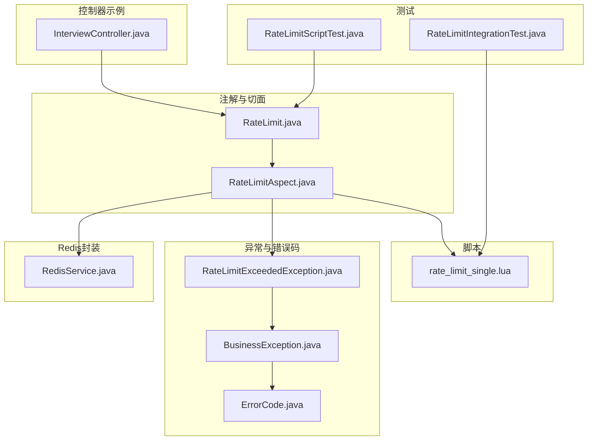
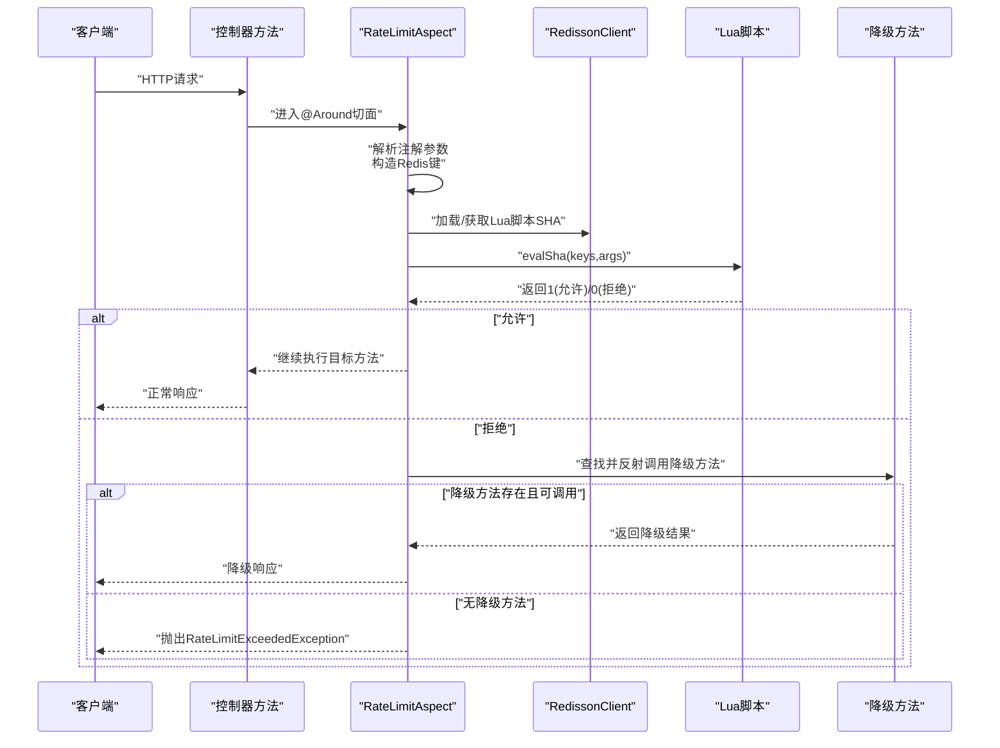
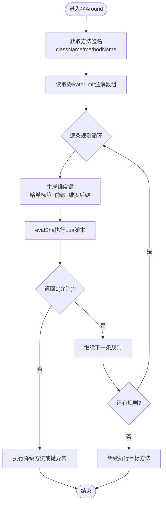
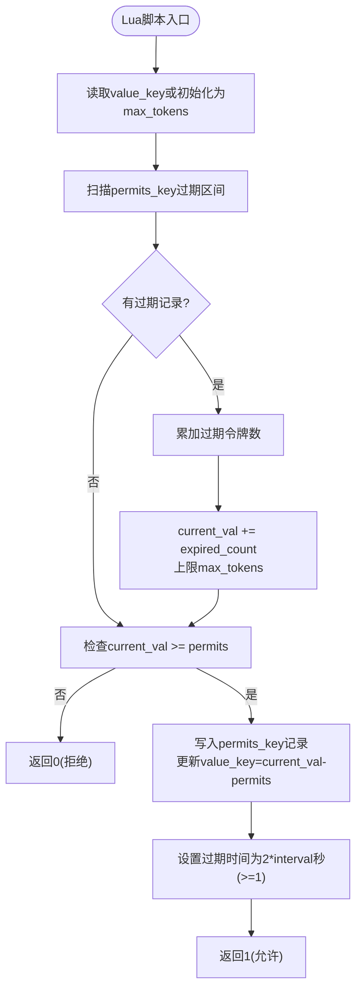
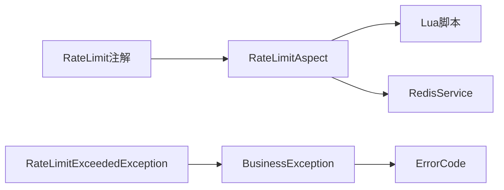

# 速率限制机制

<cite>
**本文引用的文件**
- [RateLimit.java](file://app/src/main/java/interview/guide/common/annotation/RateLimit.java)
- [RateLimitAspect.java](file://app/src/main/java/interview/guide/common/aspect/RateLimitAspect.java)
- [rate_limit_single.lua](file://app/src/main/resources/scripts/rate_limit_single.lua)
- [RateLimitExceededException.java](file://app/src/main/java/interview/guide/common/exception/RateLimitExceededException.java)
- [BusinessException.java](file://app/src/main/java/interview/guide/common/exception/BusinessException.java)
- [ErrorCode.java](file://app/src/main/java/interview/guide/common/exception/ErrorCode.java)
- [RedisService.java](file://app/src/main/java/interview/guide/infrastructure/redis/RedisService.java)
- [RateLimitIntegrationTest.java](file://app/src/test/java/interview/guide/common/aspect/RateLimitIntegrationTest.java)
- [RateLimitScriptTest.java](file://app/src/test/java/interview/guide/common/aspect/RateLimitScriptTest.java)
- [InterviewController.java](file://app/src/main/java/interview/guide/modules/interview/InterviewController.java)
</cite>

## 目录
1. [简介](#简介)
2. [项目结构](#项目结构)
3. [核心组件](#核心组件)
4. [架构总览](#架构总览)
5. [详细组件分析](#详细组件分析)
6. [依赖关系分析](#依赖关系分析)
7. [性能考量](#性能考量)
8. [故障排查指南](#故障排查指南)
9. [结论](#结论)
10. [附录](#附录)

## 简介
本文件系统化梳理本项目的速率限制机制，重点覆盖以下方面：
- Redisson分布式限流的实现原理：基于Lua脚本的原子性操作、滑动窗口算法、令牌回收与过期管理。
- AOP切面实现机制：@Around注解、方法签名获取、注解参数解析、降级方法反射调用。
- 限流维度设计：全局限流、IP限流、用户限流的粒度与键空间组织。
- Redis键空间设计与命名规范：哈希标签、键前缀、过期时间策略。
- 降级方法实现细节：反射调用、参数传递、异常处理。
- 限流配置最佳实践：阈值设置、时间窗口选择、Redis性能优化。

## 项目结构
围绕速率限制的相关代码主要分布在如下位置：
- 注解与切面：common/annotation 与 common/aspect
- Lua脚本：resources/scripts
- 异常与错误码：common/exception
- Redis工具封装：infrastructure/redis
- 控制器使用示例：modules/*/Controller.java
- 测试：test/java/interview/guide/common/aspect

图表来源
- [RateLimit.java:1-120](file://app/src/main/java/interview/guide/common/annotation/RateLimit.java#L1-L120)
- [RateLimitAspect.java:1-265](file://app/src/main/java/interview/guide/common/aspect/RateLimitAspect.java#L1-L265)
- [rate_limit_single.lua:1-61](file://app/src/main/resources/scripts/rate_limit_single.lua#L1-L61)
- [RateLimitExceededException.java:1-22](file://app/src/main/java/interview/guide/common/exception/RateLimitExceededException.java#L1-L22)
- [BusinessException.java:1-50](file://app/src/main/java/interview/guide/common/exception/BusinessException.java#L1-L50)
- [ErrorCode.java:1-81](file://app/src/main/java/interview/guide/common/exception/ErrorCode.java#L1-L81)
- [RedisService.java:1-395](file://app/src/main/java/interview/guide/infrastructure/redis/RedisService.java#L1-L395)
- [InterviewController.java:45-176](file://app/src/main/java/interview/guide/modules/interview/InterviewController.java#L45-L176)
- [RateLimitIntegrationTest.java:1-159](file://app/src/test/java/interview/guide/common/aspect/RateLimitIntegrationTest.java#L1-L159)
- [RateLimitScriptTest.java:1-87](file://app/src/test/java/interview/guide/common/aspect/RateLimitScriptTest.java#L1-L87)

章节来源
- [RateLimit.java:1-120](file://app/src/main/java/interview/guide/common/annotation/RateLimit.java#L1-L120)
- [RateLimitAspect.java:1-265](file://app/src/main/java/interview/guide/common/aspect/RateLimitAspect.java#L1-L265)
- [rate_limit_single.lua:1-61](file://app/src/main/resources/scripts/rate_limit_single.lua#L1-L61)
- [RateLimitExceededException.java:1-22](file://app/src/main/java/interview/guide/common/exception/RateLimitExceededException.java#L1-L22)
- [BusinessException.java:1-50](file://app/src/main/java/interview/guide/common/exception/BusinessException.java#L1-L50)
- [ErrorCode.java:1-81](file://app/src/main/java/interview/guide/common/exception/ErrorCode.java#L1-L81)
- [RedisService.java:1-395](file://app/src/main/java/interview/guide/infrastructure/redis/RedisService.java#L1-L395)
- [InterviewController.java:45-176](file://app/src/main/java/interview/guide/modules/interview/InterviewController.java#L45-L176)
- [RateLimitIntegrationTest.java:1-159](file://app/src/test/java/interview/guide/common/aspect/RateLimitIntegrationTest.java#L1-L159)
- [RateLimitScriptTest.java:1-87](file://app/src/test/java/interview/guide/common/aspect/RateLimitScriptTest.java#L1-L87)

## 核心组件
- 限流注解：定义维度、阈值、时间窗口、超时与降级方法等参数，支持可重复注解实现多维度独立限流。
- AOP切面：拦截带注解的方法，解析注解参数，构造Redis键，调用Lua脚本原子限流，必要时执行降级方法。
- Lua脚本：实现滑动窗口的原子令牌扣减、过期令牌回收、过期时间设置。
- 异常体系：统一的业务异常与错误码，便于前端与网关层处理。
- Redis封装：提供通用的Redis操作能力，便于扩展其他限流策略或监控。

章节来源
- [RateLimit.java:27-119](file://app/src/main/java/interview/guide/common/annotation/RateLimit.java#L27-L119)
- [RateLimitAspect.java:31-265](file://app/src/main/java/interview/guide/common/aspect/RateLimitAspect.java#L31-L265)
- [rate_limit_single.lua:1-61](file://app/src/main/resources/scripts/rate_limit_single.lua#L1-L61)
- [RateLimitExceededException.java:7-21](file://app/src/main/java/interview/guide/common/exception/RateLimitExceededException.java#L7-L21)
- [BusinessException.java:8-49](file://app/src/main/java/interview/guide/common/exception/BusinessException.java#L8-L49)
- [ErrorCode.java:11-81](file://app/src/main/java/interview/guide/common/exception/ErrorCode.java#L11-L81)
- [RedisService.java:29-395](file://app/src/main/java/interview/guide/infrastructure/redis/RedisService.java#L29-L395)

## 架构总览
下图展示从HTTP请求到限流决策与降级处理的完整流程。

图表来源
- [RateLimitAspect.java:66-90](file://app/src/main/java/interview/guide/common/aspect/RateLimitAspect.java#L66-L90)
- [RateLimitAspect.java:92-126](file://app/src/main/java/interview/guide/common/aspect/RateLimitAspect.java#L92-L126)
- [RateLimitAspect.java:165-191](file://app/src/main/java/interview/guide/common/aspect/RateLimitAspect.java#L165-L191)
- [rate_limit_single.lua:13-61](file://app/src/main/resources/scripts/rate_limit_single.lua#L13-L61)

## 详细组件分析

### 注解与维度设计
- 维度枚举：GLOBAL、IP、USER，分别对应全局限流、按客户端IP限流、按用户ID限流。
- 多规则支持：同一方法可叠加多个@RateLimit，所有规则均通过才放行；任一规则失败即拒绝。
- 关键参数：
  - count：时间窗口内的最大请求数（支持小数，便于细粒度控制）。
  - interval/timeUnit：时间窗口大小与单位。
  - timeout：当前实现未使用（注释说明为“等待令牌的超时时间”），实际逻辑按1个令牌扣减。
  - fallback：触发限流时的降级方法名，支持无参或参数列表一致的方法。

章节来源
- [RateLimit.java:35-48](file://app/src/main/java/interview/guide/common/annotation/RateLimit.java#L35-L48)
- [RateLimit.java:56-102](file://app/src/main/java/interview/guide/common/annotation/RateLimit.java#L56-L102)
- [RateLimitScriptTest.java:21-70](file://app/src/test/java/interview/guide/common/aspect/RateLimitScriptTest.java#L21-L70)

### AOP切面实现机制
- 切入点：拦截带@RateLimit或其容器注解的方法。
- 方法签名获取：通过MethodSignature提取类名、方法名、参数类型。
- 注解参数解析：读取dimension、count、interval、timeUnit、fallback。
- 键空间生成：采用哈希标签与键前缀，确保同方法不同维度隔离。
- 脚本加载与调用：静态加载Lua脚本，缓存SHA；Redis异常时自动重载并重试。
- 降级方法反射调用：优先匹配参数列表一致的方法，否则回退到无参方法；异常记录日志但不影响主流程。

图表来源
- [RateLimitAspect.java:66-90](file://app/src/main/java/interview/guide/common/aspect/RateLimitAspect.java#L66-L90)
- [RateLimitAspect.java:154-163](file://app/src/main/java/interview/guide/common/aspect/RateLimitAspect.java#L154-L163)
- [RateLimitAspect.java:92-126](file://app/src/main/java/interview/guide/common/aspect/RateLimitAspect.java#L92-L126)
- [RateLimitAspect.java:165-191](file://app/src/main/java/interview/guide/common/aspect/RateLimitAspect.java#L165-L191)

章节来源
- [RateLimitAspect.java:66-90](file://app/src/main/java/interview/guide/common/aspect/RateLimitAspect.java#L66-L90)
- [RateLimitAspect.java:154-163](file://app/src/main/java/interview/guide/common/aspect/RateLimitAspect.java#L154-L163)
- [RateLimitAspect.java:165-191](file://app/src/main/java/interview/guide/common/aspect/RateLimitAspect.java#L165-L191)

### Lua脚本与滑动窗口算法
- 原子性：整条限流逻辑在Redis中以Lua脚本执行，保证并发安全。
- 数据结构：
  - value_key：当前可用令牌数（不存在时初始化为max_tokens）。
  - permits_key：有序集合，存储每个请求的“请求ID:令牌数”，按时间戳排序。
- 窗口与回收：
  - 计算过期区间[0, now_ms - interval]，批量回收过期记录并累加可用令牌。
  - 回收后将current_val恢复至不超过max_tokens。
- 令牌扣减：
  - 若current_val < permits，则拒绝（返回0）。
  - 否则写入permits_key记录，并更新value_key为current_val - permits。
- 过期策略：为value_key与permits_key设置过期时间，通常为窗口的两倍秒级，最小1秒。

图表来源
- [rate_limit_single.lua:13-61](file://app/src/main/resources/scripts/rate_limit_single.lua#L13-L61)

章节来源
- [rate_limit_single.lua:13-61](file://app/src/main/resources/scripts/rate_limit_single.lua#L13-L61)

### Redis键空间设计与命名规范
- 哈希标签：使用"{类名:方法名}"作为标签，便于Redis集群槽位分布均匀。
- 键前缀：统一使用"ratelimit:"作为前缀，便于批量清理与监控。
- 维度后缀：
  - 全局：":global"
  - IP：":ip:<客户端IP>"
  - 用户：":user:<userId>"
- 过期时间：value_key与permits_key过期时间为2×窗口秒，最小1秒，避免热点键长期占用内存。

章节来源
- [RateLimitAspect.java:154-163](file://app/src/main/java/interview/guide/common/aspect/RateLimitAspect.java#L154-L163)
- [rate_limit_single.lua:54-58](file://app/src/main/resources/scripts/rate_limit_single.lua#L54-L58)

### 降级方法实现机制
- 查找策略：优先查找与原方法参数列表一致的同名方法；若不存在则尝试无参方法。
- 反射调用：通过Method.invoke(target, args)或无参调用，返回值类型需与原方法兼容。
- 异常处理：捕获反射调用异常并记录日志；若降级失败，回退到抛出RateLimitExceededException。
- 触发条件：当任意一条规则返回0（拒绝）时触发降级或异常。

章节来源
- [RateLimitAspect.java:165-191](file://app/src/main/java/interview/guide/common/aspect/RateLimitAspect.java#L165-L191)
- [RateLimitAspect.java:193-213](file://app/src/main/java/interview/guide/common/aspect/RateLimitAspect.java#L193-L213)

### 控制器使用示例
- 多维度组合：同一接口同时应用全局限流与IP限流，确保整体与单机流量均受控。
- 不同阈值：根据业务场景设置不同的count与interval，如提交答案接口设置更高的全局阈值。

章节来源
- [InterviewController.java:50-52](file://app/src/main/java/interview/guide/modules/interview/InterviewController.java#L50-L52)
- [InterviewController.java:79-80](file://app/src/main/java/interview/guide/modules/interview/InterviewController.java#L79-L80)

## 依赖关系分析
- 注解依赖：RateLimitAspect依赖RateLimit注解的元数据与容器注解。
- 脚本依赖：AOP切面依赖Lua脚本的SHA缓存与evalSha调用。
- 异常依赖：RateLimitExceededException继承BusinessException，后者依赖ErrorCode枚举。
- Redis封装：RedisService提供通用Redis操作，便于扩展其他限流策略或监控。

图表来源
- [RateLimit.java:27-119](file://app/src/main/java/interview/guide/common/annotation/RateLimit.java#L27-L119)
- [RateLimitAspect.java:37-56](file://app/src/main/java/interview/guide/common/aspect/RateLimitAspect.java#L37-L56)
- [RateLimitExceededException.java:7-21](file://app/src/main/java/interview/guide/common/exception/RateLimitExceededException.java#L7-L21)
- [BusinessException.java:8-49](file://app/src/main/java/interview/guide/common/exception/BusinessException.java#L8-L49)
- [ErrorCode.java:11-81](file://app/src/main/java/interview/guide/common/exception/ErrorCode.java#L11-L81)
- [RedisService.java:29-395](file://app/src/main/java/interview/guide/infrastructure/redis/RedisService.java#L29-L395)

章节来源
- [RateLimit.java:27-119](file://app/src/main/java/interview/guide/common/annotation/RateLimit.java#L27-L119)
- [RateLimitAspect.java:37-56](file://app/src/main/java/interview/guide/common/aspect/RateLimitAspect.java#L37-L56)
- [RateLimitExceededException.java:7-21](file://app/src/main/java/interview/guide/common/exception/RateLimitExceededException.java#L7-L21)
- [BusinessException.java:8-49](file://app/src/main/java/interview/guide/common/exception/BusinessException.java#L8-L49)
- [ErrorCode.java:11-81](file://app/src/main/java/interview/guide/common/exception/ErrorCode.java#L11-L81)
- [RedisService.java:29-395](file://app/src/main/java/interview/guide/infrastructure/redis/RedisService.java#L29-L395)

## 性能考量
- Lua脚本原子性：避免多次往返网络，降低延迟与竞争风险。
- 过期时间设置：窗口两倍过期时间平衡内存占用与回收效率，最小1秒防止频繁过期。
- 键空间设计：哈希标签分散槽位，减少热点键；统一前缀便于运维。
- 脚本热加载：Redis重启后自动重载SHA并重试，提升可用性。
- 并发模型：滑动窗口基于有序集合与原子脚本，适合高QPS场景。

章节来源
- [rate_limit_single.lua:54-58](file://app/src/main/resources/scripts/rate_limit_single.lua#L54-L58)
- [RateLimitAspect.java:111-125](file://app/src/main/java/interview/guide/common/aspect/RateLimitAspect.java#L111-L125)

## 故障排查指南
- 脚本SHA缺失：Redis重启后可能出现NOSCRIPT错误，切面会自动重载并重试。
- 降级方法不可用：找不到同名方法或参数不匹配时，将抛出RateLimitExceededException。
- IP/用户ID获取：IP通过常见代理头解析，用户ID优先从请求属性或头中获取，失败时使用占位值。
- 集成测试：提供基于Redis的集成测试，验证多规则、独立计数等行为。

章节来源
- [RateLimitAspect.java:111-125](file://app/src/main/java/interview/guide/common/aspect/RateLimitAspect.java#L111-L125)
- [RateLimitAspect.java:215-242](file://app/src/main/java/interview/guide/common/aspect/RateLimitAspect.java#L215-L242)
- [RateLimitAspect.java:244-263](file://app/src/main/java/interview/guide/common/aspect/RateLimitAspect.java#L244-L263)
- [RateLimitIntegrationTest.java:36-159](file://app/src/test/java/interview/guide/common/aspect/RateLimitIntegrationTest.java#L36-L159)

## 结论
本项目的速率限制机制以Redisson + Lua脚本为核心，结合AOP切面实现方法级限流，具备以下特点：
- 多维度独立限流：全局限流与IP/用户限流可并行生效，满足复杂业务需求。
- 原子性与高性能：Lua脚本保证原子性，滑动窗口算法兼顾公平与效率。
- 易用性与可维护性：注解驱动、统一异常、清晰键空间命名、完善的降级机制。
- 可扩展性：RedisService提供通用Redis能力，便于引入更多限流策略或监控。

## 附录

### 限流配置最佳实践
- 阈值设置
  - 全局限流：用于保护系统整体容量，建议设置为峰值的约60%-80%，留有余量应对突发。
  - IP限流：针对单机或单节点的流量约束，建议设置为全局限流的10%-30%。
  - 用户限流：面向付费用户或VIP用户的差异化保护，建议设置为更高阈值。
- 时间窗口选择
  - 秒级窗口：适用于高频短请求（如API查询）。
  - 分钟级窗口：适用于中低频请求（如提交答案、导出报告）。
  - 窗口越大，平滑效果越好，但响应性越差；窗口越小，响应越快，抖动越大。
- Redis性能优化
  - 使用哈希标签分散槽位，避免热点键集中在少数槽。
  - 合理设置过期时间，避免内存膨胀；窗口两倍过期时间是折中方案。
  - 控制脚本SHA缓存命中率，减少网络往返。
  - 对高QPS接口，考虑分片键（如按用户ID取模）进一步分散压力。

章节来源
- [RateLimit.java:58-80](file://app/src/main/java/interview/guide/common/annotation/RateLimit.java#L58-L80)
- [rate_limit_single.lua:54-58](file://app/src/main/resources/scripts/rate_limit_single.lua#L54-L58)
- [RedisService.java:382-393](file://app/src/main/java/interview/guide/infrastructure/redis/RedisService.java#L382-L393)