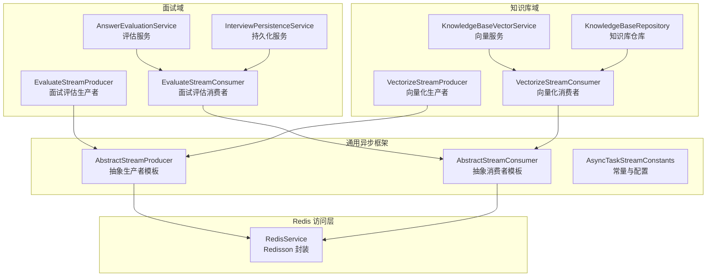
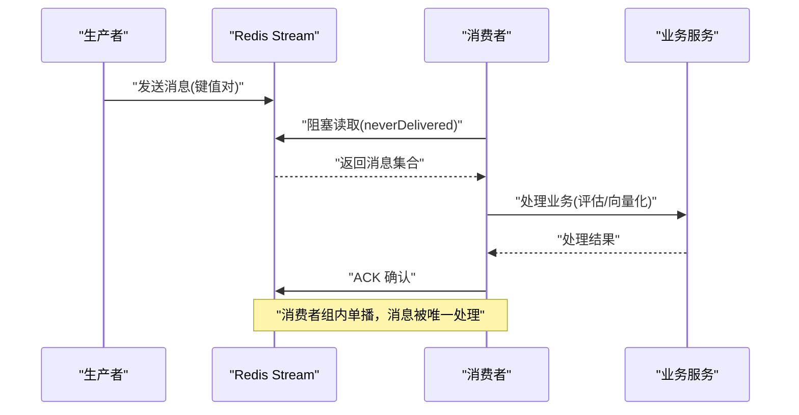
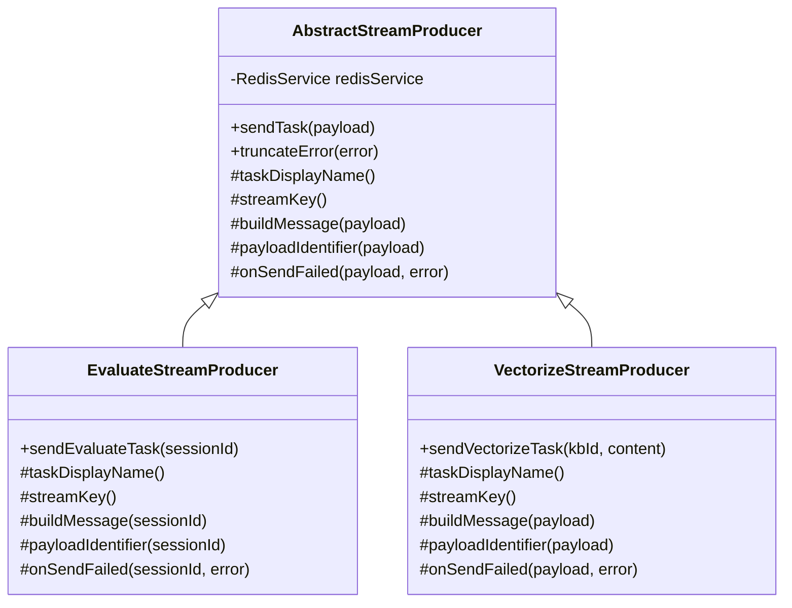
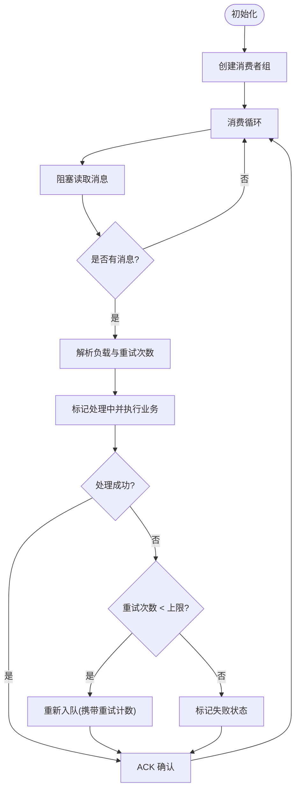
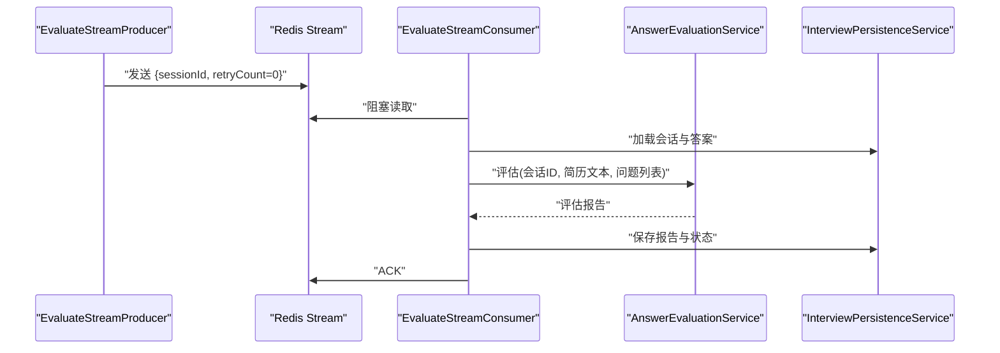
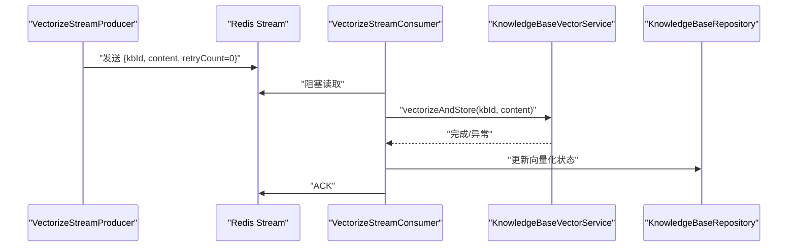
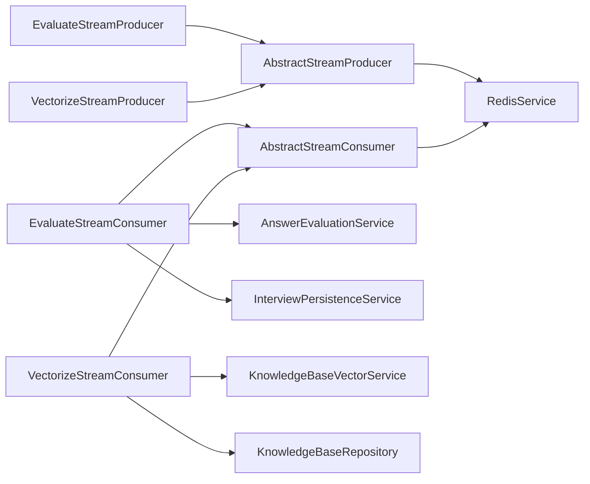

# Redis Stream异步处理

<cite>
**本文档引用的文件**
- [AbstractStreamConsumer.java](file://app/src/main/java/interview/guide/common/async/AbstractStreamConsumer.java)
- [AbstractStreamProducer.java](file://app/src/main/java/interview/guide/common/async/AbstractStreamProducer.java)
- [AsyncTaskStreamConstants.java](file://app/src/main/java/interview/guide/common/constant/AsyncTaskStreamConstants.java)
- [RedisService.java](file://app/src/main/java/interview/guide/infrastructure/redis/RedisService.java)
- [EvaluateStreamConsumer.java](file://app/src/main/java/interview/guide/modules/interview/listener/EvaluateStreamConsumer.java)
- [EvaluateStreamProducer.java](file://app/src/main/java/interview/guide/modules/interview/listener/EvaluateStreamProducer.java)
- [VectorizeStreamConsumer.java](file://app/src/main/java/interview/guide/modules/knowledgebase/listener/VectorizeStreamConsumer.java)
- [VectorizeStreamProducer.java](file://app/src/main/java/interview/guide/modules/knowledgebase/listener/VectorizeStreamProducer.java)
- [AnswerEvaluationService.java](file://app/src/main/java/interview/guide/modules/interview/service/AnswerEvaluationService.java)
- [KnowledgeBaseVectorService.java](file://app/src/main/java/interview/guide/modules/knowledgebase/service/KnowledgeBaseVectorService.java)
- [InterviewPersistenceService.java](file://app/src/main/java/interview/guide/modules/interview/service/InterviewPersistenceService.java)
- [KnowledgeBaseRepository.java](file://app/src/main/java/interview/guide/modules/knowledgebase/repository/KnowledgeBaseRepository.java)
- [application.yml](file://app/src/main/resources/application.yml)
</cite>

## 目录
1. [简介](#简介)
2. [项目结构](#项目结构)
3. [核心组件](#核心组件)
4. [架构概览](#架构概览)
5. [详细组件分析](#详细组件分析)
6. [依赖分析](#依赖分析)
7. [性能考虑](#性能考虑)
8. [故障排查指南](#故障排查指南)
9. [结论](#结论)
10. [附录](#附录)

## 简介
本项目采用 Redis Stream 实现异步处理流水线，覆盖面试评估与知识库向量化两大核心业务场景。系统通过统一的生产者/消费者模板抽象，结合 Redisson 的 Stream API，实现了高可靠、可扩展的异步消息处理架构。消息以键值对形式存储在 Redis Stream 中，消费者组模式确保消息的可靠投递与幂等处理，配合内置的重试与状态追踪机制，满足生产级的可用性要求。

## 项目结构
围绕 Redis Stream 的异步处理模块主要分布在以下层次：
- 通用异步框架：抽象生产者/消费者模板与常量定义
- Redis 访问层：RedisService 封装 Redisson 的 Stream 操作
- 业务监听器：各业务域的生产者与消费者实现
- 业务服务：面试评估与知识库向量化的核心处理逻辑
- 数据访问：JPA Repository 用于持久化状态与元数据

**图表来源**
- [AbstractStreamProducer.java:1-55](file://app/src/main/java/interview/guide/common/async/AbstractStreamProducer.java#L1-L55)
- [AbstractStreamConsumer.java:1-176](file://app/src/main/java/interview/guide/common/async/AbstractStreamConsumer.java#L1-L176)
- [AsyncTaskStreamConstants.java:1-135](file://app/src/main/java/interview/guide/common/constant/AsyncTaskStreamConstants.java#L1-L135)
- [RedisService.java:1-395](file://app/src/main/java/interview/guide/infrastructure/redis/RedisService.java#L1-L395)
- [EvaluateStreamProducer.java:1-78](file://app/src/main/java/interview/guide/modules/interview/listener/EvaluateStreamProducer.java#L1-L78)
- [EvaluateStreamConsumer.java:1-185](file://app/src/main/java/interview/guide/modules/interview/listener/EvaluateStreamConsumer.java#L1-L185)
- [AnswerEvaluationService.java:1-99](file://app/src/main/java/interview/guide/modules/interview/service/AnswerEvaluationService.java#L1-L99)
- [InterviewPersistenceService.java:1-359](file://app/src/main/java/interview/guide/modules/interview/service/InterviewPersistenceService.java#L1-L359)
- [VectorizeStreamProducer.java:1-82](file://app/src/main/java/interview/guide/modules/knowledgebase/listener/VectorizeStreamProducer.java#L1-L82)
- [VectorizeStreamConsumer.java:1-140](file://app/src/main/java/interview/guide/modules/knowledgebase/listener/VectorizeStreamConsumer.java#L1-L140)
- [KnowledgeBaseVectorService.java:1-203](file://app/src/main/java/interview/guide/modules/knowledgebase/service/KnowledgeBaseVectorService.java#L1-L203)
- [KnowledgeBaseRepository.java:1-108](file://app/src/main/java/interview/guide/modules/knowledgebase/repository/KnowledgeBaseRepository.java#L1-L108)

**章节来源**
- [AbstractStreamProducer.java:1-55](file://app/src/main/java/interview/guide/common/async/AbstractStreamProducer.java#L1-L55)
- [AbstractStreamConsumer.java:1-176](file://app/src/main/java/interview/guide/common/async/AbstractStreamConsumer.java#L1-L176)
- [AsyncTaskStreamConstants.java:1-135](file://app/src/main/java/interview/guide/common/constant/AsyncTaskStreamConstants.java#L1-L135)
- [RedisService.java:1-395](file://app/src/main/java/interview/guide/infrastructure/redis/RedisService.java#L1-L395)

## 核心组件
- 抽象生产者模板：统一封装消息发送、失败回调与错误截断逻辑，子类仅需定义消息体构建与标识。
- 抽象消费者模板：统一封装消费者组创建、阻塞拉取、ACK、重试与状态追踪，子类仅需实现业务处理。
- RedisService：基于 Redisson 的 Stream API，提供阻塞读取、ACK、消费者组创建与消息长度限制等能力。
- 业务监听器：面试评估与知识库向量化分别实现独立的生产者/消费者，绑定各自的 Stream Key、消费者组与线程名。
- 业务服务：面试评估服务负责将 DTO 适配为通用评估模型并调用统一评估服务；知识库向量服务负责分块、批量嵌入与存储。

**章节来源**
- [AbstractStreamProducer.java:1-55](file://app/src/main/java/interview/guide/common/async/AbstractStreamProducer.java#L1-L55)
- [AbstractStreamConsumer.java:1-176](file://app/src/main/java/interview/guide/common/async/AbstractStreamConsumer.java#L1-L176)
- [RedisService.java:202-327](file://app/src/main/java/interview/guide/infrastructure/redis/RedisService.java#L202-L327)
- [EvaluateStreamProducer.java:1-78](file://app/src/main/java/interview/guide/modules/interview/listener/EvaluateStreamProducer.java#L1-L78)
- [EvaluateStreamConsumer.java:1-185](file://app/src/main/java/interview/guide/modules/interview/listener/EvaluateStreamConsumer.java#L1-L185)
- [VectorizeStreamProducer.java:1-82](file://app/src/main/java/interview/guide/modules/knowledgebase/listener/VectorizeStreamProducer.java#L1-L82)
- [VectorizeStreamConsumer.java:1-140](file://app/src/main/java/interview/guide/modules/knowledgebase/listener/VectorizeStreamConsumer.java#L1-L140)
- [AnswerEvaluationService.java:1-99](file://app/src/main/java/interview/guide/modules/interview/service/AnswerEvaluationService.java#L1-L99)
- [KnowledgeBaseVectorService.java:1-203](file://app/src/main/java/interview/guide/modules/knowledgebase/service/KnowledgeBaseVectorService.java#L1-L203)

## 架构概览
系统采用“生产者-消费者组-ACK”的经典 Redis Stream 模式，消费者组内的多个消费者实例实现水平扩展，消息只被一个消费者处理。消费者模板通过阻塞读取减少 CPU 空转，同时内置重试与失败状态标记，确保消息最终一致。

**图表来源**
- [RedisService.java:224-259](file://app/src/main/java/interview/guide/infrastructure/redis/RedisService.java#L224-L259)
- [AbstractStreamConsumer.java:74-123](file://app/src/main/java/interview/guide/common/async/AbstractStreamConsumer.java#L74-L123)
- [EvaluateStreamConsumer.java:104-134](file://app/src/main/java/interview/guide/modules/interview/listener/EvaluateStreamConsumer.java#L104-L134)
- [VectorizeStreamConsumer.java:84-87](file://app/src/main/java/interview/guide/modules/knowledgebase/listener/VectorizeStreamConsumer.java#L84-L87)

## 详细组件分析

### 抽象生产者模板
- 职责：封装消息发送、失败回调与错误截断，屏蔽 Redis 操作细节。
- 关键点：使用常量中的最大长度参数进行流裁剪，避免无限增长；失败时触发业务侧回调以更新状态。

**图表来源**
- [AbstractStreamProducer.java:1-55](file://app/src/main/java/interview/guide/common/async/AbstractStreamProducer.java#L1-L55)
- [EvaluateStreamProducer.java:1-78](file://app/src/main/java/interview/guide/modules/interview/listener/EvaluateStreamProducer.java#L1-L78)
- [VectorizeStreamProducer.java:1-82](file://app/src/main/java/interview/guide/modules/knowledgebase/listener/VectorizeStreamProducer.java#L1-L82)

**章节来源**
- [AbstractStreamProducer.java:22-36](file://app/src/main/java/interview/guide/common/async/AbstractStreamProducer.java#L22-L36)
- [EvaluateStreamProducer.java:33-63](file://app/src/main/java/interview/guide/modules/interview/listener/EvaluateStreamProducer.java#L33-L63)
- [VectorizeStreamProducer.java:36-80](file://app/src/main/java/interview/guide/modules/knowledgebase/listener/VectorizeStreamProducer.java#L36-L80)

### 抽象消费者模板
- 职责：统一生命周期管理、消费者组创建、阻塞消费循环、ACK、重试与失败处理。
- 关键点：使用常量中的批次大小与轮询间隔；解析重试次数并进行上限控制；失败时写入失败状态并可选择重新入队。

**图表来源**
- [AbstractStreamConsumer.java:35-123](file://app/src/main/java/interview/guide/common/async/AbstractStreamConsumer.java#L35-L123)
- [AsyncTaskStreamConstants.java:27-45](file://app/src/main/java/interview/guide/common/constant/AsyncTaskStreamConstants.java#L27-L45)

**章节来源**
- [AbstractStreamConsumer.java:35-123](file://app/src/main/java/interview/guide/common/async/AbstractStreamConsumer.java#L35-L123)

### 面试评估异步处理
- 生产者：接收会话ID，构建消息并发送到面试评估 Stream。
- 消费者：拉取消息后，加载会话与答案，调用评估服务生成报告并持久化。
- 状态管理：处理中/完成/失败状态与错误信息写入会话实体。

**图表来源**
- [EvaluateStreamProducer.java:33-63](file://app/src/main/java/interview/guide/modules/interview/listener/EvaluateStreamProducer.java#L33-L63)
- [EvaluateStreamConsumer.java:104-134](file://app/src/main/java/interview/guide/modules/interview/listener/EvaluateStreamConsumer.java#L104-L134)
- [AnswerEvaluationService.java:45-75](file://app/src/main/java/interview/guide/modules/interview/service/AnswerEvaluationService.java#L45-L75)
- [InterviewPersistenceService.java:167-244](file://app/src/main/java/interview/guide/modules/interview/service/InterviewPersistenceService.java#L167-L244)

**章节来源**
- [EvaluateStreamProducer.java:1-78](file://app/src/main/java/interview/guide/modules/interview/listener/EvaluateStreamProducer.java#L1-L78)
- [EvaluateStreamConsumer.java:1-185](file://app/src/main/java/interview/guide/modules/interview/listener/EvaluateStreamConsumer.java#L1-L185)
- [AnswerEvaluationService.java:1-99](file://app/src/main/java/interview/guide/modules/interview/service/AnswerEvaluationService.java#L1-L99)
- [InterviewPersistenceService.java:1-359](file://app/src/main/java/interview/guide/modules/interview/service/InterviewPersistenceService.java#L1-L359)

### 知识库向量化异步处理
- 生产者：接收知识库ID与内容，构建消息并发送到向量化 Stream。
- 消费者：拉取消息后，调用向量服务进行分块、批量嵌入与存储。
- 状态管理：处理中/完成/失败状态与错误信息写入知识库实体。

**图表来源**
- [VectorizeStreamProducer.java:36-80](file://app/src/main/java/interview/guide/modules/knowledgebase/listener/VectorizeStreamProducer.java#L36-L80)
- [VectorizeStreamConsumer.java:84-121](file://app/src/main/java/interview/guide/modules/knowledgebase/listener/VectorizeStreamConsumer.java#L84-L121)
- [KnowledgeBaseVectorService.java:45-81](file://app/src/main/java/interview/guide/modules/knowledgebase/service/KnowledgeBaseVectorService.java#L45-L81)
- [KnowledgeBaseRepository.java:1-108](file://app/src/main/java/interview/guide/modules/knowledgebase/repository/KnowledgeBaseRepository.java#L1-L108)

**章节来源**
- [VectorizeStreamProducer.java:1-82](file://app/src/main/java/interview/guide/modules/knowledgebase/listener/VectorizeStreamProducer.java#L1-L82)
- [VectorizeStreamConsumer.java:1-140](file://app/src/main/java/interview/guide/modules/knowledgebase/listener/VectorizeStreamConsumer.java#L1-L140)
- [KnowledgeBaseVectorService.java:1-203](file://app/src/main/java/interview/guide/modules/knowledgebase/service/KnowledgeBaseVectorService.java#L1-L203)
- [KnowledgeBaseRepository.java:1-108](file://app/src/main/java/interview/guide/modules/knowledgebase/repository/KnowledgeBaseRepository.java#L1-L108)

## 依赖分析
- 抽象模板与 RedisService：消费者模板依赖 RedisService 的阻塞读取与 ACK 能力；生产者模板依赖 RedisService 的消息发送与长度裁剪。
- 业务监听器：面试与知识库监听器分别继承抽象模板，实现各自的消息键、消费者组与线程命名。
- 业务服务：面试评估服务与知识库向量服务作为消费者处理链路的业务执行单元。
- 数据访问：持久化服务与仓库负责状态与元数据的读写。

**图表来源**
- [AbstractStreamProducer.java:1-55](file://app/src/main/java/interview/guide/common/async/AbstractStreamProducer.java#L1-L55)
- [AbstractStreamConsumer.java:1-176](file://app/src/main/java/interview/guide/common/async/AbstractStreamConsumer.java#L1-L176)
- [RedisService.java:1-395](file://app/src/main/java/interview/guide/infrastructure/redis/RedisService.java#L1-L395)
- [EvaluateStreamProducer.java:1-78](file://app/src/main/java/interview/guide/modules/interview/listener/EvaluateStreamProducer.java#L1-L78)
- [EvaluateStreamConsumer.java:1-185](file://app/src/main/java/interview/guide/modules/interview/listener/EvaluateStreamConsumer.java#L1-L185)
- [VectorizeStreamProducer.java:1-82](file://app/src/main/java/interview/guide/modules/knowledgebase/listener/VectorizeStreamProducer.java#L1-L82)
- [VectorizeStreamConsumer.java:1-140](file://app/src/main/java/interview/guide/modules/knowledgebase/listener/VectorizeStreamConsumer.java#L1-L140)
- [AnswerEvaluationService.java:1-99](file://app/src/main/java/interview/guide/modules/interview/service/AnswerEvaluationService.java#L1-L99)
- [InterviewPersistenceService.java:1-359](file://app/src/main/java/interview/guide/modules/interview/service/InterviewPersistenceService.java#L1-L359)
- [KnowledgeBaseVectorService.java:1-203](file://app/src/main/java/interview/guide/modules/knowledgebase/service/KnowledgeBaseVectorService.java#L1-L203)
- [KnowledgeBaseRepository.java:1-108](file://app/src/main/java/interview/guide/modules/knowledgebase/repository/KnowledgeBaseRepository.java#L1-L108)

**章节来源**
- [AsyncTaskStreamConstants.java:1-135](file://app/src/main/java/interview/guide/common/constant/AsyncTaskStreamConstants.java#L1-L135)
- [RedisService.java:202-327](file://app/src/main/java/interview/guide/infrastructure/redis/RedisService.java#L202-L327)

## 性能考虑
- 批量与并发
  - 批次大小：消费者模板默认每次拉取固定数量的消息，平衡吞吐与延迟。
  - 并发模型：消费者模板使用单线程池，避免多线程竞争；可通过部署多实例实现水平扩展。
- 内存与持久化
  - 流长度限制：生产者与消费者均使用最大长度参数，防止消息无限增长导致内存压力。
  - 序列化：面试评估报告通过 JSON 序列化存储，注意字段长度与截断策略。
- Redis 优化
  - 阻塞读取：消费者使用阻塞读取减少空轮询，降低 CPU 占用。
  - 消费者组：利用消费者组实现消息的可靠投递与重试。
- 配置建议
  - Redis 连接池：根据实例规模调整连接池大小与空闲连接数。
  - 应用线程：启用虚拟线程以提升 I/O 密集型场景并发能力。

**章节来源**
- [AsyncTaskStreamConstants.java:27-45](file://app/src/main/java/interview/guide/common/constant/AsyncTaskStreamConstants.java#L27-L45)
- [AbstractStreamConsumer.java:46-58](file://app/src/main/java/interview/guide/common/async/AbstractStreamConsumer.java#L46-L58)
- [RedisService.java:224-259](file://app/src/main/java/interview/guide/infrastructure/redis/RedisService.java#L224-L259)
- [application.yml:86-98](file://app/src/main/resources/application.yml#L86-L98)

## 故障排查指南
- 消费者组创建失败
  - 现象：日志提示组已存在但异常。
  - 排查：确认 Stream Key 与消费者组名配置一致；检查权限与网络连通性。
- 消息未被消费
  - 现象：队列堆积。
  - 排查：确认消费者实例数与消费者组配置；检查阻塞读取是否正常；查看 ACK 是否成功。
- 处理失败与重试
  - 现象：任务失败并重试。
  - 排查：检查重试次数上限与重新入队逻辑；查看失败状态是否正确写入；核对业务服务异常堆栈。
- 状态追踪
  - 面试评估：通过持久化服务更新评估状态与错误信息。
  - 知识库向量化：通过仓库更新向量化状态与错误信息。
- 日志与告警
  - 建议：为关键路径增加结构化日志与错误计数指标，便于定位问题。

**章节来源**
- [AbstractStreamConsumer.java:42-44](file://app/src/main/java/interview/guide/common/async/AbstractStreamConsumer.java#L42-L44)
- [AbstractStreamConsumer.java:112-122](file://app/src/main/java/interview/guide/common/async/AbstractStreamConsumer.java#L112-L122)
- [EvaluateStreamConsumer.java:142-144](file://app/src/main/java/interview/guide/modules/interview/listener/EvaluateStreamConsumer.java#L142-L144)
- [VectorizeStreamConsumer.java:95-97](file://app/src/main/java/interview/guide/modules/knowledgebase/listener/VectorizeStreamConsumer.java#L95-L97)
- [InterviewPersistenceService.java:98-114](file://app/src/main/java/interview/guide/modules/interview/service/InterviewPersistenceService.java#L98-L114)
- [KnowledgeBaseRepository.java:72-106](file://app/src/main/java/interview/guide/modules/knowledgebase/repository/KnowledgeBaseRepository.java#L72-L106)

## 结论
本系统通过抽象模板与 Redisson 的 Stream 能力，构建了稳定可靠的异步处理流水线。面试评估与知识库向量化两大场景均具备完善的生产-消费-ACK-重试-状态追踪闭环，能够满足生产环境的可靠性与可观测性需求。通过合理的配置与监控策略，可进一步提升系统的吞吐与稳定性。

## 附录
- 配置要点
  - Redis 连接与池化参数：参考应用配置文件中的 Redisson 配置段。
  - 流长度限制与重试上限：参考常量定义。
  - 虚拟线程与数据库连接池：参考应用配置文件中的线程与 JPA 配置段。

**章节来源**
- [AsyncTaskStreamConstants.java:27-45](file://app/src/main/java/interview/guide/common/constant/AsyncTaskStreamConstants.java#L27-L45)
- [application.yml:86-124](file://app/src/main/resources/application.yml#L86-L124)