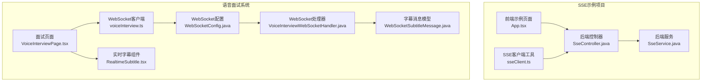
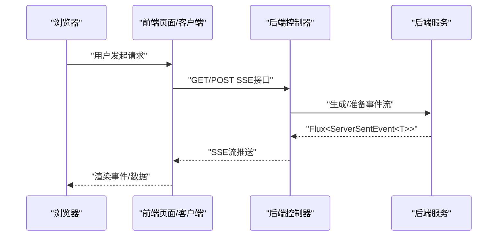
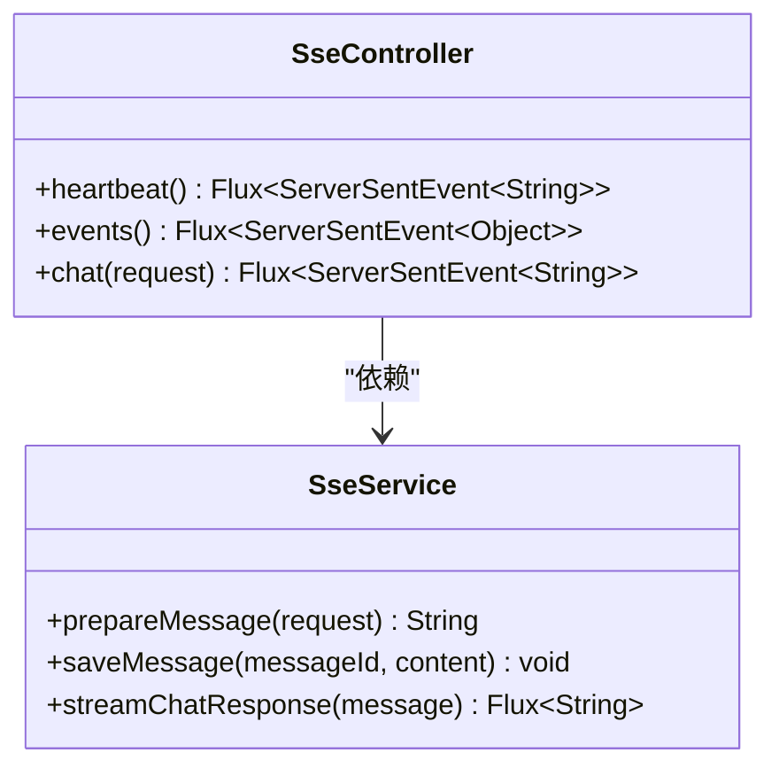
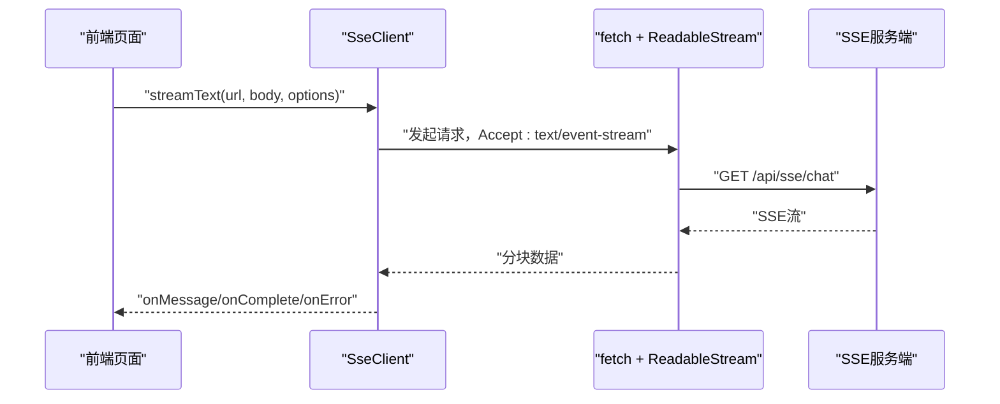
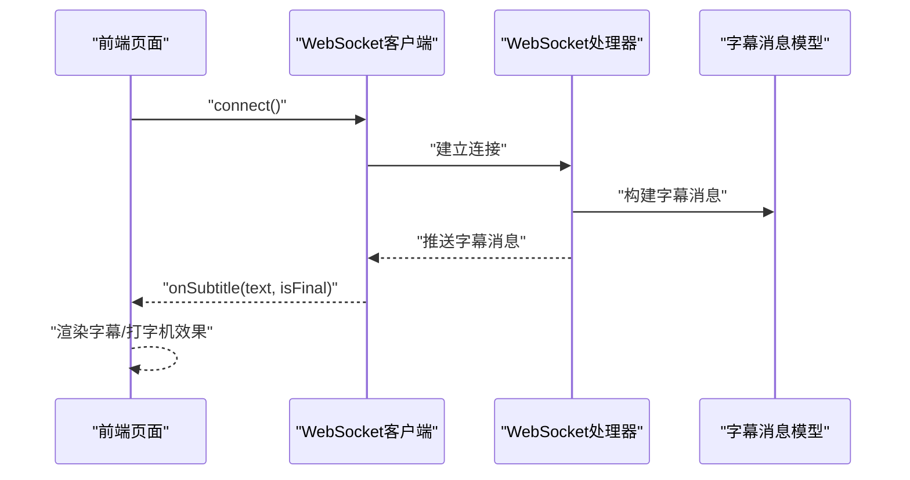
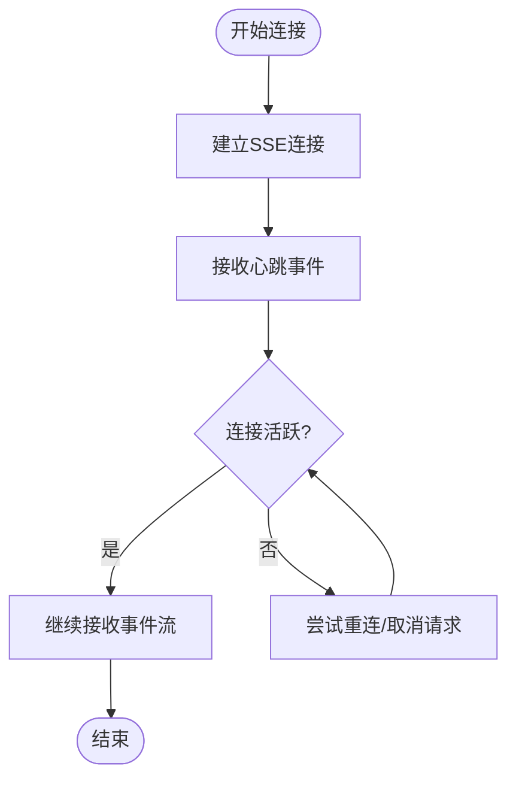
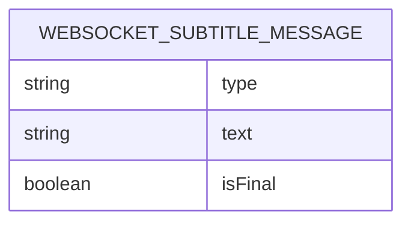
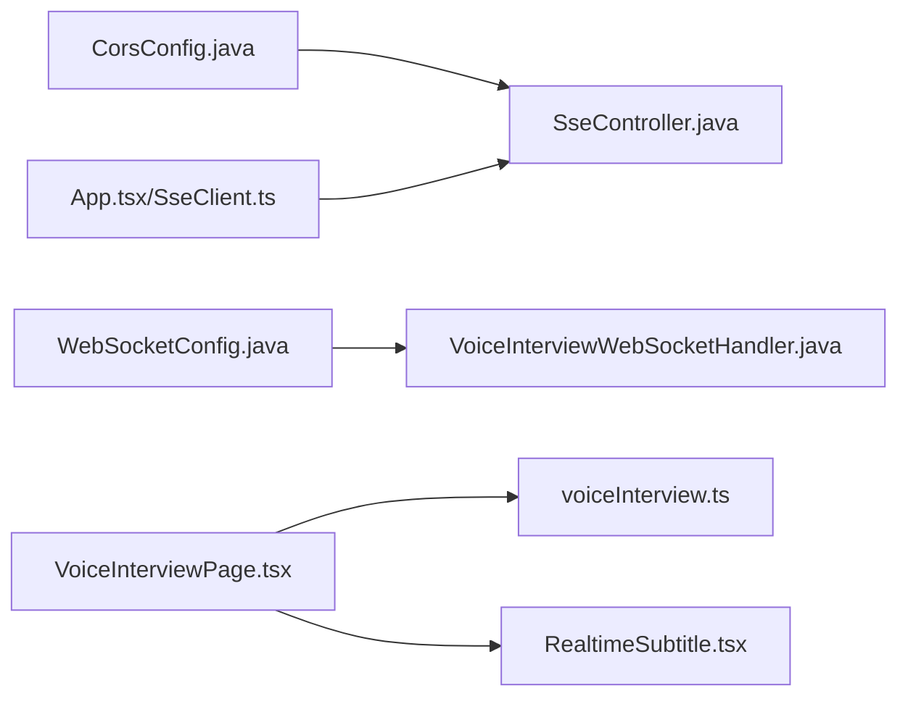

# Server-Sent Events (SSE)流式传输

<cite>
**本文档引用的文件**
- [SseController.java](file://sse-demo/backend/src/main/java/com/example/sse/controller/SseController.java)
- [SseService.java](file://sse-demo/backend/src/main/java/com/example/sse/service/SseService.java)
- [SseClient.ts](file://sse-demo/frontend/src/utils/sseClient.ts)
- [App.tsx](file://sse-demo/frontend/src/App.tsx)
- [ragChat.ts](file://frontend/src/api/ragChat.ts)
- [WebSocketSubtitleMessage.java](file://app/src/main/java/interview/guide/modules/voiceinterview/dto/WebSocketSubtitleMessage.java)
- [VoiceInterviewWebSocketHandler.java](file://app/src/main/java/interview/guide/modules/voiceinterview/handler/VoiceInterviewWebSocketHandler.java)
- [WebSocketConfig.java](file://app/src/main/java/interview/guide/modules/voiceinterview/config/WebSocketConfig.java)
- [voiceInterview.ts](file://frontend/src/api/voiceInterview.ts)
- [VoiceInterviewPage.tsx](file://frontend/src/pages/VoiceInterviewPage.tsx)
- [RealtimeSubtitle.tsx](file://frontend/src/components/RealtimeSubtitle.tsx)
- [CorsConfig.java](file://app/src/main/java/interview/guide/common/config/CorsConfig.java)
- [README.md](file://sse-demo/README.md)
</cite>

## 目录
1. [引言](#引言)
2. [项目结构](#项目结构)
3. [核心组件](#核心组件)
4. [架构总览](#架构总览)
5. [详细组件分析](#详细组件分析)
6. [依赖关系分析](#依赖关系分析)
7. [性能考量](#性能考量)
8. [故障排查指南](#故障排查指南)
9. [结论](#结论)
10. [附录](#附录)

## 引言
本文件围绕Server-Sent Events (SSE)流式传输系统进行深入技术文档编写，结合仓库中的SSE示例项目与语音面试场景下的实时字幕展示实践，系统阐述SSE的实现原理、架构设计、连接管理、事件流处理、消息格式与协议、前端客户端实现、性能优化、安全与监控调试等内容。文档同时提供可视化图示帮助理解端到端流程，并给出可操作的排障建议与最佳实践。

## 项目结构
本仓库包含两套与SSE密切相关的实现：
- SSE示例项目：后端基于Spring WebFlux的Flux<ServerSentEvent<T>>，前端使用原生EventSource或自定义fetch+ReadableStream实现SSE客户端。
- 语音面试系统：虽然主要采用WebSocket，但其字幕流式更新与SSE的实时性理念一致，可作为SSE在实时字幕场景的参考实现。

**图表来源**
- [SseController.java:1-114](file://sse-demo/backend/src/main/java/com/example/sse/controller/SseController.java#L1-L114)
- [SseService.java:1-53](file://sse-demo/backend/src/main/java/com/example/sse/service/SseService.java#L1-L53)
- [App.tsx:54-148](file://sse-demo/frontend/src/App.tsx#L54-L148)
- [SseClient.ts:1-105](file://sse-demo/frontend/src/utils/sseClient.ts#L1-L105)
- [WebSocketConfig.java:1-25](file://app/src/main/java/interview/guide/modules/voiceinterview/config/WebSocketConfig.java#L1-L25)
- [VoiceInterviewWebSocketHandler.java:1-1153](file://app/src/main/java/interview/guide/modules/voiceinterview/handler/VoiceInterviewWebSocketHandler.java#L1-L1153)
- [WebSocketSubtitleMessage.java:1-17](file://app/src/main/java/interview/guide/modules/voiceinterview/dto/WebSocketSubtitleMessage.java#L1-L17)
- [VoiceInterviewPage.tsx:1-734](file://frontend/src/pages/VoiceInterviewPage.tsx#L1-L734)
- [voiceInterview.ts:1-383](file://frontend/src/api/voiceInterview.ts#L1-L383)
- [RealtimeSubtitle.tsx:1-151](file://frontend/src/components/RealtimeSubtitle.tsx#L1-L151)

**章节来源**
- [SseController.java:1-114](file://sse-demo/backend/src/main/java/com/example/sse/controller/SseController.java#L1-L114)
- [SseService.java:1-53](file://sse-demo/backend/src/main/java/com/example/sse/service/SseService.java#L1-L53)
- [App.tsx:54-148](file://sse-demo/frontend/src/App.tsx#L54-L148)
- [SseClient.ts:1-105](file://sse-demo/frontend/src/utils/sseClient.ts#L1-L105)
- [WebSocketConfig.java:1-25](file://app/src/main/java/interview/guide/modules/voiceinterview/config/WebSocketConfig.java#L1-L25)
- [VoiceInterviewWebSocketHandler.java:1-1153](file://app/src/main/java/interview/guide/modules/voiceinterview/handler/VoiceInterviewWebSocketHandler.java#L1-L1153)
- [WebSocketSubtitleMessage.java:1-17](file://app/src/main/java/interview/guide/modules/voiceinterview/dto/WebSocketSubtitleMessage.java#L1-L17)
- [VoiceInterviewPage.tsx:1-734](file://frontend/src/pages/VoiceInterviewPage.tsx#L1-L734)
- [voiceInterview.ts:1-383](file://frontend/src/api/voiceInterview.ts#L1-L383)
- [RealtimeSubtitle.tsx:1-151](file://frontend/src/components/RealtimeSubtitle.tsx#L1-L151)

## 核心组件
- 后端SSE控制器：提供心跳、带事件类型的SSE流、AI流式对话等接口，使用Flux<ServerSentEvent<T>>返回流式数据。
- 后端SSE服务：封装消息准备、存储与流式响应生成，演示虚拟线程调度与背压处理思路。
- 前端SSE客户端：支持fetch+ReadableStream的自定义SSE客户端与原生EventSource两种方式。
- 语音面试WebSocket处理器：虽非SSE，但展示了实时字幕流式更新、状态管理与断线重连机制，可借鉴到SSE场景。
- CORS配置：统一处理跨域，确保SSE与前端应用的跨域访问。

**章节来源**
- [SseController.java:27-114](file://sse-demo/backend/src/main/java/com/example/sse/controller/SseController.java#L27-L114)
- [SseService.java:29-53](file://sse-demo/backend/src/main/java/com/example/sse/service/SseService.java#L29-L53)
- [SseClient.ts:12-105](file://sse-demo/frontend/src/utils/sseClient.ts#L12-L105)
- [VoiceInterviewWebSocketHandler.java:396-425](file://app/src/main/java/interview/guide/modules/voiceinterview/handler/VoiceInterviewWebSocketHandler.java#L396-L425)
- [CorsConfig.java:24-43](file://app/src/main/java/interview/guide/common/config/CorsConfig.java#L24-L43)

## 架构总览
SSE在本项目中的典型交互路径如下：

**图表来源**
- [SseController.java:27-114](file://sse-demo/backend/src/main/java/com/example/sse/controller/SseController.java#L27-L114)
- [SseService.java:29-53](file://sse-demo/backend/src/main/java/com/example/sse/service/SseService.java#L29-L53)
- [SseClient.ts:16-70](file://sse-demo/frontend/src/utils/sseClient.ts#L16-L70)

**章节来源**
- [SseController.java:27-114](file://sse-demo/backend/src/main/java/com/example/sse/controller/SseController.java#L27-L114)
- [SseService.java:29-53](file://sse-demo/backend/src/main/java/com/example/sse/service/SseService.java#L29-L53)
- [SseClient.ts:16-70](file://sse-demo/frontend/src/utils/sseClient.ts#L16-L70)

## 详细组件分析

### 后端SSE控制器与服务
- 控制器提供多种SSE接口：
  - 心跳流：周期性推送心跳事件，用于保活。
  - 自定义事件流：按固定间隔推送不同事件类型（通知、更新、ping）。
  - AI流式对话：接收请求体，生成逐字节/逐词的流式响应。
- 服务层负责消息准备、存储与流式生成，演示虚拟线程调度与并发优化思路。

**图表来源**
- [SseController.java:27-114](file://sse-demo/backend/src/main/java/com/example/sse/controller/SseController.java#L27-L114)
- [SseService.java:29-53](file://sse-demo/backend/src/main/java/com/example/sse/service/SseService.java#L29-L53)

**章节来源**
- [SseController.java:27-114](file://sse-demo/backend/src/main/java/com/example/sse/controller/SseController.java#L27-L114)
- [SseService.java:29-53](file://sse-demo/backend/src/main/java/com/example/sse/service/SseService.java#L29-L53)

### 前端SSE客户端实现
- 自定义SSE客户端：通过fetch获取ReadableStream，逐块解码并解析SSE行，支持完成信号与错误处理。
- 原生EventSource：用于监听结构化事件（如进度、完成），自动处理重连与事件分发。

**图表来源**
- [SseClient.ts:16-70](file://sse-demo/frontend/src/utils/sseClient.ts#L16-L70)
- [App.tsx:54-91](file://sse-demo/frontend/src/App.tsx#L54-L91)

**章节来源**
- [SseClient.ts:16-70](file://sse-demo/frontend/src/utils/sseClient.ts#L16-L70)
- [App.tsx:54-91](file://sse-demo/frontend/src/App.tsx#L54-L91)

### 实时字幕展示（WebSocket场景的SSE参考）
语音面试系统虽采用WebSocket，但其实时字幕展示与SSE的“流式更新”理念一致：
- 字幕消息模型：包含类型、文本与是否最终标记。
- WebSocket处理器：向客户端推送字幕消息，支持文本先行与音频随后的顺序保障。
- 前端页面与组件：实时渲染字幕，支持打字机效果与滚动同步。

**图表来源**
- [WebSocketSubtitleMessage.java:12-16](file://app/src/main/java/interview/guide/modules/voiceinterview/dto/WebSocketSubtitleMessage.java#L12-L16)
- [VoiceInterviewWebSocketHandler.java:793-800](file://app/src/main/java/interview/guide/modules/voiceinterview/handler/VoiceInterviewWebSocketHandler.java#L793-L800)
- [voiceInterview.ts:222-365](file://frontend/src/api/voiceInterview.ts#L222-L365)
- [VoiceInterviewPage.tsx:293-355](file://frontend/src/pages/VoiceInterviewPage.tsx#L293-L355)
- [RealtimeSubtitle.tsx:18-58](file://frontend/src/components/RealtimeSubtitle.tsx#L18-L58)

**章节来源**
- [WebSocketSubtitleMessage.java:12-16](file://app/src/main/java/interview/guide/modules/voiceinterview/dto/WebSocketSubtitleMessage.java#L12-L16)
- [VoiceInterviewWebSocketHandler.java:793-800](file://app/src/main/java/interview/guide/modules/voiceinterview/handler/VoiceInterviewWebSocketHandler.java#L793-L800)
- [voiceInterview.ts:222-365](file://frontend/src/api/voiceInterview.ts#L222-L365)
- [VoiceInterviewPage.tsx:293-355](file://frontend/src/pages/VoiceInterviewPage.tsx#L293-L355)
- [RealtimeSubtitle.tsx:18-58](file://frontend/src/components/RealtimeSubtitle.tsx#L18-L58)

### 连接建立与维护机制
- SSE心跳：后端定时发送心跳事件，前端可监听对应事件名以确认连接存活。
- 原生EventSource：自动处理重连与错误回调；自定义fetch客户端需自行实现重连与取消。
- WebSocket场景的断线重连：处理器内对ASR异常进行重连判断与恢复，体现SSE可借鉴的健壮性设计。

**图表来源**
- [SseController.java:30-40](file://sse-demo/backend/src/main/java/com/example/sse/controller/SseController.java#L30-L40)
- [SseClient.ts:75-103](file://sse-demo/frontend/src/utils/sseClient.ts#L75-L103)
- [VoiceInterviewWebSocketHandler.java:411-425](file://app/src/main/java/interview/guide/modules/voiceinterview/handler/VoiceInterviewWebSocketHandler.java#L411-L425)

**章节来源**
- [SseController.java:30-40](file://sse-demo/backend/src/main/java/com/example/sse/controller/SseController.java#L30-L40)
- [SseClient.ts:75-103](file://sse-demo/frontend/src/utils/sseClient.ts#L75-L103)
- [VoiceInterviewWebSocketHandler.java:411-425](file://app/src/main/java/interview/guide/modules/voiceinterview/handler/VoiceInterviewWebSocketHandler.java#L411-L425)

### 消息格式与数据传输协议
- SSE标准字段：事件名、数据、ID、注释等，后端通过ServerSentEvent构建。
- 前端解析：按行解析data:、event:、id:等字段，还原事件与数据。
- WebSocket场景：字幕消息采用JSON结构，包含type、text、isFinal字段，便于前后端约定。

**图表来源**
- [WebSocketSubtitleMessage.java:12-16](file://app/src/main/java/interview/guide/modules/voiceinterview/dto/WebSocketSubtitleMessage.java#L12-L16)

**章节来源**
- [SseController.java:88-110](file://sse-demo/backend/src/main/java/com/example/sse/controller/SseController.java#L88-L110)
- [SseClient.ts:55-64](file://sse-demo/frontend/src/utils/sseClient.ts#L55-L64)
- [WebSocketSubtitleMessage.java:12-16](file://app/src/main/java/interview/guide/modules/voiceinterview/dto/WebSocketSubtitleMessage.java#L12-L16)

### SSE在实时字幕中的应用
- 字幕流式更新：后端按片段推送文本，前端实时渲染并呈现打字机效果。
- 实时同步：字幕与音频播放节奏协调，避免回声与重复。
- 状态管理：记录当前AI说话状态、用户输入状态与消息历史，确保一致性。

**章节来源**
- [VoiceInterviewPage.tsx:293-355](file://frontend/src/pages/VoiceInterviewPage.tsx#L293-L355)
- [RealtimeSubtitle.tsx:18-58](file://frontend/src/components/RealtimeSubtitle.tsx#L18-L58)
- [VoiceInterviewWebSocketHandler.java:793-800](file://app/src/main/java/interview/guide/modules/voiceinterview/handler/VoiceInterviewWebSocketHandler.java#L793-L800)

### SSE客户端前端实现要点
- EventSource：监听自定义事件（如progress、complete），自动关闭连接。
- fetch+ReadableStream：手动解析SSE行，支持完成信号与错误处理。
- 与RAG聊天流集成：前端通过fetch+ReadableStream消费后端流式响应，实现类似SSE的增量渲染。

**章节来源**
- [SseClient.ts:75-103](file://sse-demo/frontend/src/utils/sseClient.ts#L75-L103)
- [ragChat.ts:111-154](file://frontend/src/api/ragChat.ts#L111-L154)

## 依赖关系分析
- 后端：控制器依赖服务层；服务层使用虚拟线程调度器与并发容器。
- 前端：页面依赖WebSocket客户端或SSE客户端；客户端依赖API模块与UI组件。
- 配置：CORS配置统一处理跨域，WebSocket配置注册处理器与允许来源。

**图表来源**
- [CorsConfig.java:24-43](file://app/src/main/java/interview/guide/common/config/CorsConfig.java#L24-L43)
- [WebSocketConfig.java:18-23](file://app/src/main/java/interview/guide/modules/voiceinterview/config/WebSocketConfig.java#L18-L23)
- [SseController.java:27-114](file://sse-demo/backend/src/main/java/com/example/sse/controller/SseController.java#L27-L114)
- [SseClient.ts:16-70](file://sse-demo/frontend/src/utils/sseClient.ts#L16-L70)
- [VoiceInterviewPage.tsx:1-734](file://frontend/src/pages/VoiceInterviewPage.tsx#L1-L734)
- [voiceInterview.ts:222-365](file://frontend/src/api/voiceInterview.ts#L222-L365)
- [RealtimeSubtitle.tsx:1-151](file://frontend/src/components/RealtimeSubtitle.tsx#L1-L151)

**章节来源**
- [CorsConfig.java:24-43](file://app/src/main/java/interview/guide/common/config/CorsConfig.java#L24-L43)
- [WebSocketConfig.java:18-23](file://app/src/main/java/interview/guide/modules/voiceinterview/config/WebSocketConfig.java#L18-L23)
- [SseController.java:27-114](file://sse-demo/backend/src/main/java/com/example/sse/controller/SseController.java#L27-L114)
- [SseClient.ts:16-70](file://sse-demo/frontend/src/utils/sseClient.ts#L16-L70)
- [VoiceInterviewPage.tsx:1-734](file://frontend/src/pages/VoiceInterviewPage.tsx#L1-L734)
- [voiceInterview.ts:222-365](file://frontend/src/api/voiceInterview.ts#L222-L365)
- [RealtimeSubtitle.tsx:1-151](file://frontend/src/components/RealtimeSubtitle.tsx#L1-L151)

## 性能考量
- 流式传输：后端使用Flux<ServerSentEvent<T>>，前端使用ReadableStream，避免一次性加载大量数据。
- 虚拟线程：服务层使用虚拟线程调度器，提升高并发下的吞吐与响应性。
- Nginx代理：示例文档建议禁用缓冲与缓存，提高SSE实时性。
- WebSocket场景优化：语音面试处理器采用虚拟线程执行阻塞任务，避免占用调度线程；音频分块推送降低延迟。

**章节来源**
- [SseService.java:24-25](file://sse-demo/backend/src/main/java/com/example/sse/service/SseService.java#L24-L25)
- [README.md:88-97](file://sse-demo/README.md#L88-L97)
- [VoiceInterviewWebSocketHandler.java:74-74](file://app/src/main/java/interview/guide/modules/voiceinterview/handler/VoiceInterviewWebSocketHandler.java#L74-L74)

## 故障排查指南
- CORS问题：确认CORS配置允许SSE接口路径与来源。
- 连接断开：EventSource自动重连；自定义fetch客户端需实现指数退避与最大重试次数。
- 心跳失效：检查后端心跳接口与前端事件监听是否正确。
- WebSocket断线重连：处理器内对ASR异常进行重连判断与恢复，可借鉴到SSE场景的错误恢复策略。

**章节来源**
- [CorsConfig.java:24-43](file://app/src/main/java/interview/guide/common/config/CorsConfig.java#L24-L43)
- [SseClient.ts:75-103](file://sse-demo/frontend/src/utils/sseClient.ts#L75-L103)
- [SseController.java:30-40](file://sse-demo/backend/src/main/java/com/example/sse/controller/SseController.java#L30-L40)
- [VoiceInterviewWebSocketHandler.java:411-425](file://app/src/main/java/interview/guide/modules/voiceinterview/handler/VoiceInterviewWebSocketHandler.java#L411-L425)

## 结论
本项目提供了SSE的完整实现样例与WebSocket场景下的实时字幕展示参考。通过后端Flux流式推送与前端EventSource/fetch+ReadableStream客户端，能够高效实现低延迟、高可靠性的实时数据传输。结合CORS配置与Nginx代理优化，可满足生产环境的实时性与稳定性要求。对于需要SSE的业务场景，可直接参考本项目的控制器、服务与前端客户端实现，并结合自身业务扩展事件类型与消息格式。

## 附录
- 示例文档与Nginx配置参考：见SSE示例项目的README与配置片段。
- API接口清单：示例项目提供SSE相关接口说明与实现要点。

**章节来源**
- [README.md:62-103](file://sse-demo/README.md#L62-L103)