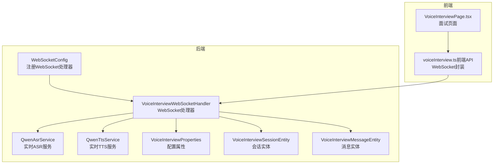
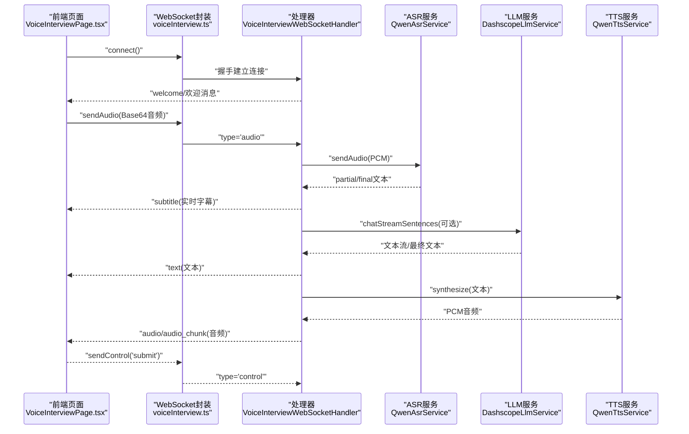
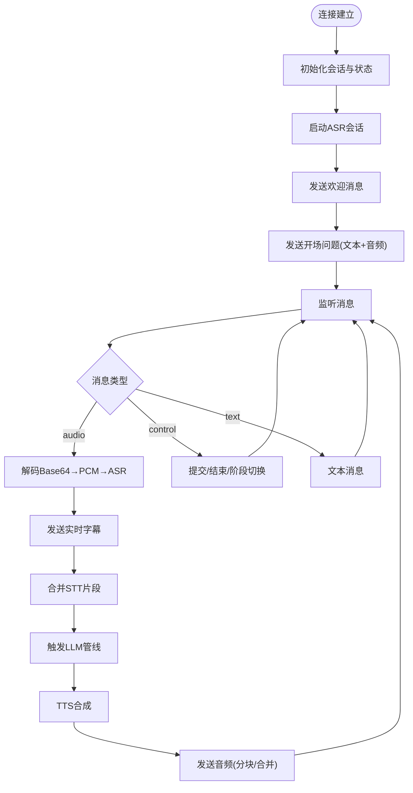
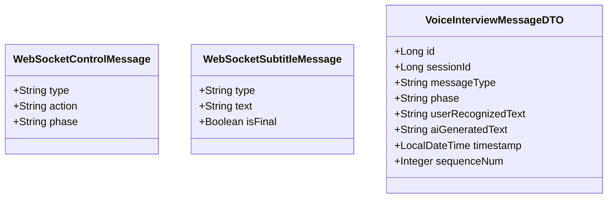
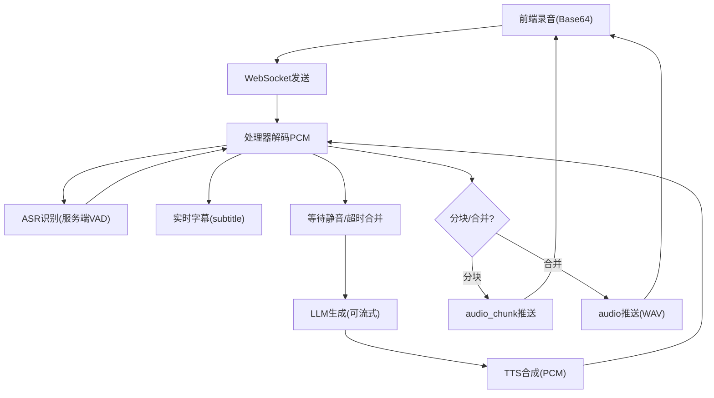
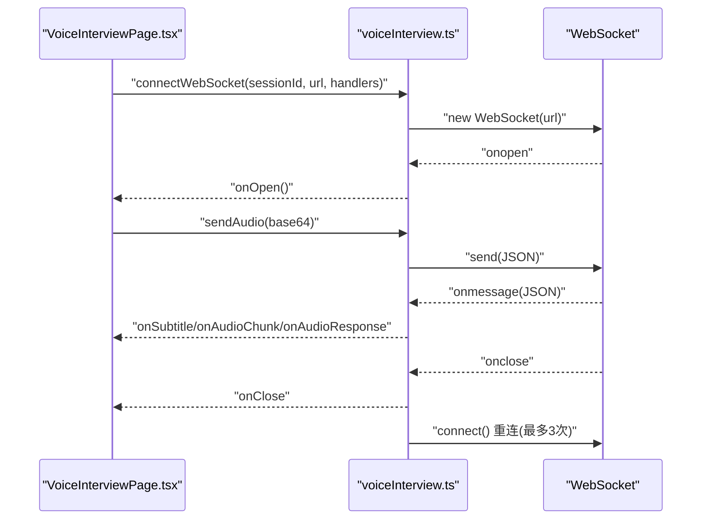
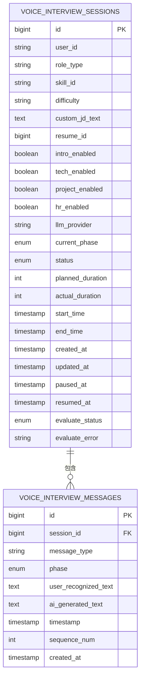
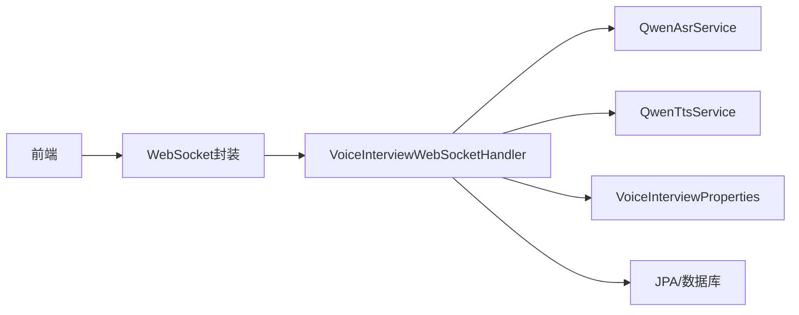

# WebSocket实现

<cite>
**本文档引用的文件**
- [VoiceInterviewWebSocketHandler.java](file://app/src/main/java/interview/guide/modules/voiceinterview/handler/VoiceInterviewWebSocketHandler.java)
- [WebSocketConfig.java](file://app/src/main/java/interview/guide/modules/voiceinterview/config/WebSocketConfig.java)
- [WebSocketControlMessage.java](file://app/src/main/java/interview/guide/modules/voiceinterview/dto/WebSocketControlMessage.java)
- [WebSocketSubtitleMessage.java](file://app/src/main/java/interview/guide/modules/voiceinterview/dto/WebSocketSubtitleMessage.java)
- [VoiceInterviewMessageDTO.java](file://app/src/main/java/interview/guide/modules/voiceinterview/dto/VoiceInterviewMessageDTO.java)
- [VoiceInterviewProperties.java](file://app/src/main/java/interview/guide/modules/voiceinterview/config/VoiceInterviewProperties.java)
- [QwenAsrService.java](file://app/src/main/java/interview/guide/modules/voiceinterview/service/QwenAsrService.java)
- [QwenTtsService.java](file://app/src/main/java/interview/guide/modules/voiceinterview/service/QwenTtsService.java)
- [VoiceInterviewSessionEntity.java](file://app/src/main/java/interview/guide/modules/voiceinterview/model/VoiceInterviewSessionEntity.java)
- [VoiceInterviewMessageEntity.java](file://app/src/main/java/interview/guide/modules/voiceinterview/model/VoiceInterviewMessageEntity.java)
- [VoiceInterviewPage.tsx](file://frontend/src/pages/VoiceInterviewPage.tsx)
- [voiceInterview.ts](file://frontend/src/utils/voiceInterview.ts)
- [voiceInterview.ts（前端API）](file://frontend/src/api/voiceInterview.ts)
- [application.yml](file://app/src/main/resources/application.yml)
</cite>

## 目录
1. [引言](#引言)
2. [项目结构](#项目结构)
3. [核心组件](#核心组件)
4. [架构总览](#架构总览)
5. [详细组件分析](#详细组件分析)
6. [依赖关系分析](#依赖关系分析)
7. [性能考量](#性能考量)
8. [故障排查指南](#故障排查指南)
9. [结论](#结论)
10. [附录](#附录)

## 引言
本文件围绕语音面试场景下的WebSocket实现进行系统性技术文档整理，重点剖析VoiceInterviewWebSocketHandler的架构设计与运行机制，覆盖连接建立、消息处理、会话管理、音频实时传输、消息协议、生命周期管理、安全与性能优化等关键主题。同时提供前端WebSocket客户端实现要点与最佳实践，帮助开发者快速理解与扩展该系统。

## 项目结构
后端采用Spring WebSocket配置，前端通过React组件与自定义WebSocket封装类进行交互。整体结构如下：

**图表来源**
- [WebSocketConfig.java:14-23](file://app/src/main/java/interview/guide/modules/voiceinterview/config/WebSocketConfig.java#L14-L23)
- [VoiceInterviewWebSocketHandler.java:56-103](file://app/src/main/java/interview/guide/modules/voiceinterview/handler/VoiceInterviewWebSocketHandler.java#L56-L103)
- [QwenAsrService.java:47-84](file://app/src/main/java/interview/guide/modules/voiceinterview/service/QwenAsrService.java#L47-L84)
- [QwenTtsService.java:42-76](file://app/src/main/java/interview/guide/modules/voiceinterview/service/QwenTtsService.java#L42-L76)
- [VoiceInterviewProperties.java:14-52](file://app/src/main/java/interview/guide/modules/voiceinterview/config/VoiceInterviewProperties.java#L14-L52)
- [VoiceInterviewSessionEntity.java:13-23](file://app/src/main/java/interview/guide/modules/voiceinterview/model/VoiceInterviewSessionEntity.java#L13-L23)
- [VoiceInterviewMessageEntity.java:11-21](file://app/src/main/java/interview/guide/modules/voiceinterview/model/VoiceInterviewMessageEntity.java#L11-L21)
- [VoiceInterviewPage.tsx:16-50](file://frontend/src/pages/VoiceInterviewPage.tsx#L16-L50)
- [voiceInterview.ts（前端API）:220-365](file://frontend/src/api/voiceInterview.ts#L220-L365)

**章节来源**
- [WebSocketConfig.java:14-23](file://app/src/main/java/interview/guide/modules/voiceinterview/config/WebSocketConfig.java#L14-L23)
- [VoiceInterviewWebSocketHandler.java:139-169](file://app/src/main/java/interview/guide/modules/voiceinterview/handler/VoiceInterviewWebSocketHandler.java#L139-L169)
- [VoiceInterviewPage.tsx:357-366](file://frontend/src/pages/VoiceInterviewPage.tsx#L357-L366)
- [voiceInterview.ts（前端API）:220-365](file://frontend/src/api/voiceInterview.ts#L220-L365)

## 核心组件
- WebSocket处理器：负责连接生命周期管理、消息路由、会话状态维护、音频与文本的双向流式处理。
- ASR服务：基于DashScope实时ASR，支持服务端VAD与断线重连。
- TTS服务：基于DashScope实时TTS，支持分块音频与合并音频两种推送模式。
- 配置中心：集中管理ASR/TTS参数、流式文本策略、并发限制、音频规格等。
- 前端WebSocket封装：提供连接、消息收发、错误处理与重连逻辑。

**章节来源**
- [VoiceInterviewWebSocketHandler.java:56-103](file://app/src/main/java/interview/guide/modules/voiceinterview/handler/VoiceInterviewWebSocketHandler.java#L56-L103)
- [QwenAsrService.java:47-84](file://app/src/main/java/interview/guide/modules/voiceinterview/service/QwenAsrService.java#L47-L84)
- [QwenTtsService.java:42-76](file://app/src/main/java/interview/guide/modules/voiceinterview/service/QwenTtsService.java#L42-L76)
- [VoiceInterviewProperties.java:14-52](file://app/src/main/java/interview/guide/modules/voiceinterview/config/VoiceInterviewProperties.java#L14-L52)

## 架构总览
语音面试的WebSocket架构遵循“用户音频→ASR→LLM→TTS→AI音频”的流水线，前后端通过JSON消息协议进行交互，支持实时字幕、音频分块与文本流式推送。

**图表来源**
- [VoiceInterviewPage.tsx:293-355](file://frontend/src/pages/VoiceInterviewPage.tsx#L293-L355)
- [voiceInterview.ts（前端API）:220-365](file://frontend/src/api/voiceInterview.ts#L220-L365)
- [VoiceInterviewWebSocketHandler.java:299-345](file://app/src/main/java/interview/guide/modules/voiceinterview/handler/VoiceInterviewWebSocketHandler.java#L299-L345)
- [QwenAsrService.java:290-322](file://app/src/main/java/interview/guide/modules/voiceinterview/service/QwenAsrService.java#L290-L322)
- [QwenTtsService.java:94-222](file://app/src/main/java/interview/guide/modules/voiceinterview/service/QwenTtsService.java#L94-L222)

## 详细组件分析

### WebSocket处理器架构与生命周期
- 连接建立：解析URI提取sessionId，设置消息大小限制，装饰并发安全会话，启动ASR并发送欢迎消息与开场问题。
- 消息处理：区分audio/text/subtitle/audio_chunk/error/control类型，分别处理用户音频、文本、字幕、音频分片与控制指令。
- 会话管理：维护会话映射、状态对象（合并缓冲、处理标记、AI说话冷却）、活动时间戳与定时暂停检查。
- 生命周期：连接关闭清理资源、停止ASR、保存会话状态；异常捕获与错误上报。

**图表来源**
- [VoiceInterviewWebSocketHandler.java:139-169](file://app/src/main/java/interview/guide/modules/voiceinterview/handler/VoiceInterviewWebSocketHandler.java#L139-L169)
- [VoiceInterviewWebSocketHandler.java:299-345](file://app/src/main/java/interview/guide/modules/voiceinterview/handler/VoiceInterviewWebSocketHandler.java#L299-L345)
- [VoiceInterviewWebSocketHandler.java:513-547](file://app/src/main/java/interview/guide/modules/voiceinterview/handler/VoiceInterviewWebSocketHandler.java#L513-L547)
- [VoiceInterviewWebSocketHandler.java:556-748](file://app/src/main/java/interview/guide/modules/voiceinterview/handler/VoiceInterviewWebSocketHandler.java#L556-L748)

**章节来源**
- [VoiceInterviewWebSocketHandler.java:139-169](file://app/src/main/java/interview/guide/modules/voiceinterview/handler/VoiceInterviewWebSocketHandler.java#L139-L169)
- [VoiceInterviewWebSocketHandler.java:360-380](file://app/src/main/java/interview/guide/modules/voiceinterview/handler/VoiceInterviewWebSocketHandler.java#L360-L380)
- [VoiceInterviewWebSocketHandler.java:872-944](file://app/src/main/java/interview/guide/modules/voiceinterview/handler/VoiceInterviewWebSocketHandler.java#L872-L944)

### 消息协议与数据结构
- 控制消息（control）：用于提交、结束面试、切换阶段等。
- 字幕消息（subtitle）：用于实时字幕显示，区分final与partial。
- 音频消息（audio/audio_chunk）：音频以Base64传输，audio包含对应文本，audio_chunk用于分块推送。
- 文本消息（text）：纯文本消息，当TTS失败时仅下发文本。

**图表来源**
- [WebSocketControlMessage.java:9-18](file://app/src/main/java/interview/guide/modules/voiceinterview/dto/WebSocketControlMessage.java#L9-L18)
- [WebSocketSubtitleMessage.java:8-16](file://app/src/main/java/interview/guide/modules/voiceinterview/dto/WebSocketSubtitleMessage.java#L8-L16)
- [VoiceInterviewMessageDTO.java:10-23](file://app/src/main/java/interview/guide/modules/voiceinterview/dto/VoiceInterviewMessageDTO.java#L10-L23)

**章节来源**
- [WebSocketControlMessage.java:9-18](file://app/src/main/java/interview/guide/modules/voiceinterview/dto/WebSocketControlMessage.java#L9-L18)
- [WebSocketSubtitleMessage.java:8-16](file://app/src/main/java/interview/guide/modules/voiceinterview/dto/WebSocketSubtitleMessage.java#L8-L16)
- [VoiceInterviewMessageDTO.java:10-23](file://app/src/main/java/interview/guide/modules/voiceinterview/dto/VoiceInterviewMessageDTO.java#L10-L23)
- [voiceInterview.ts（前端API）:86-133](file://frontend/src/api/voiceInterview.ts#L86-L133)

### 音频实时传输机制
- 音频编码与传输：前端将音频编码为Base64字符串，后端解码为PCM后送入ASR；TTS合成PCM后转WAV并通过Base64下发。
- 分块与合并：支持分块推送（每句TTS完成后立即推送）与合并推送（全部完成后一次性推送），由配置项控制。
- 延迟控制与回声抑制：AI说话期间与冷却期丢弃麦克风输入，避免回声触发；合并缓冲等待用户静音后提交。
- 带宽优化：Base64压缩比约1.33，结合分块推送降低首包时延与内存峰值。

**图表来源**
- [VoiceInterviewWebSocketHandler.java:431-482](file://app/src/main/java/interview/guide/modules/voiceinterview/handler/VoiceInterviewWebSocketHandler.java#L431-L482)
- [VoiceInterviewWebSocketHandler.java:642-696](file://app/src/main/java/interview/guide/modules/voiceinterview/handler/VoiceInterviewWebSocketHandler.java#L642-L696)
- [QwenAsrService.java:289-322](file://app/src/main/java/interview/guide/modules/voiceinterview/service/QwenAsrService.java#L289-L322)
- [QwenTtsService.java:94-222](file://app/src/main/java/interview/guide/modules/voiceinterview/service/QwenTtsService.java#L94-L222)

**章节来源**
- [VoiceInterviewWebSocketHandler.java:800-836](file://app/src/main/java/interview/guide/modules/voiceinterview/handler/VoiceInterviewWebSocketHandler.java#L800-L836)
- [VoiceInterviewWebSocketHandler.java:1006-1051](file://app/src/main/java/interview/guide/modules/voiceinterview/handler/VoiceInterviewWebSocketHandler.java#L1006-L1051)
- [VoiceInterviewProperties.java:45-51](file://app/src/main/java/interview/guide/modules/voiceinterview/config/VoiceInterviewProperties.java#L45-L51)

### 前端WebSocket客户端实现
- 连接建立：构造URL（/ws/voice-interview/{sessionId}），创建WebSocket实例，注册onopen/onmessage/onclose/onerror。
- 消息发送：sendAudio发送用户音频（Base64），sendControl发送控制消息（submit/end等）。
- 消息接收：根据type分发到onSubtitle/onAudioResponse/onAudioChunk等处理器。
- 错误处理与重连：非正常关闭且重连次数未达上限则延迟重连；onerror统一上报。
- 音频播放：支持分块播放（AudioContext）与合并播放（data:audio/wav;base64）。

**图表来源**
- [VoiceInterviewPage.tsx:293-355](file://frontend/src/pages/VoiceInterviewPage.tsx#L293-L355)
- [voiceInterview.ts（前端API）:220-365](file://frontend/src/api/voiceInterview.ts#L220-L365)

**章节来源**
- [VoiceInterviewPage.tsx:357-366](file://frontend/src/pages/VoiceInterviewPage.tsx#L357-L366)
- [voiceInterview.ts（前端API）:220-365](file://frontend/src/api/voiceInterview.ts#L220-L365)

### 会话状态与持久化
- 会话实体：包含角色类型、技能ID、难度、阶段、状态、时长、评分状态等。
- 消息实体：记录用户识别文本、AI生成文本、阶段、序列号与时间戳。
- 处理器状态：合并缓冲、处理标记、AI说话冷却、最近STT活动时间等。

**图表来源**
- [VoiceInterviewSessionEntity.java:13-121](file://app/src/main/java/interview/guide/modules/voiceinterview/model/VoiceInterviewSessionEntity.java#L13-L121)
- [VoiceInterviewMessageEntity.java:11-53](file://app/src/main/java/interview/guide/modules/voiceinterview/model/VoiceInterviewMessageEntity.java#L11-L53)

**章节来源**
- [VoiceInterviewSessionEntity.java:13-121](file://app/src/main/java/interview/guide/modules/voiceinterview/model/VoiceInterviewSessionEntity.java#L13-L121)
- [VoiceInterviewMessageEntity.java:11-53](file://app/src/main/java/interview/guide/modules/voiceinterview/model/VoiceInterviewMessageEntity.java#L11-L53)

## 依赖关系分析
- 组件耦合：处理器依赖ASR/TTS/LLM服务与配置中心；前端依赖处理器提供的消息协议与URL。
- 外部依赖：DashScope ASR/TTS WebSocket API、PostgreSQL/JPA、Redisson缓存。
- 并发与线程：使用虚拟线程执行阻塞I/O与LLM/TTS，避免阻塞调度线程；ASR/TTS各自独立连接。

**图表来源**
- [VoiceInterviewWebSocketHandler.java:56-64](file://app/src/main/java/interview/guide/modules/voiceinterview/handler/VoiceInterviewWebSocketHandler.java#L56-L64)
- [QwenAsrService.java:47-84](file://app/src/main/java/interview/guide/modules/voiceinterview/service/QwenAsrService.java#L47-L84)
- [QwenTtsService.java:42-76](file://app/src/main/java/interview/guide/modules/voiceinterview/service/QwenTtsService.java#L42-L76)
- [VoiceInterviewProperties.java:14-52](file://app/src/main/java/interview/guide/modules/voiceinterview/config/VoiceInterviewProperties.java#L14-L52)

**章节来源**
- [application.yml:42-46](file://app/src/main/resources/application.yml#L42-L46)
- [application.yml:48-98](file://app/src/main/resources/application.yml#L48-L98)

## 性能考量
- 虚拟线程：启用虚拟线程显著提升I/O密集型并发能力，适合大量WebSocket长连接与外部API调用。
- 线程池与调度：专用的调度线程池用于STT合并与LLM/TTS执行，避免阻塞主调度线程。
- 分块推送：分块音频推送降低首包时延与内存峰值，提升用户体验。
- 缓冲与限速：会话级并发控制与发送缓冲限制，防止内存溢出与风暴效应。
- 配置优化：合理设置VAD静音时长、合并等待时间、最小提交字符数与最大等待时长，平衡延迟与准确性。

**章节来源**
- [VoiceInterviewWebSocketHandler.java:68-74](file://app/src/main/java/interview/guide/modules/voiceinterview/handler/VoiceInterviewWebSocketHandler.java#L68-L74)
- [VoiceInterviewProperties.java:34-51](file://app/src/main/java/interview/guide/modules/voiceinterview/config/VoiceInterviewProperties.java#L34-L51)
- [application.yml:42-46](file://app/src/main/resources/application.yml#L42-L46)

## 故障排查指南
- 连接失败：检查WebSocket路径与CORS配置，确认sessionId有效；查看后端日志与前端错误回调。
- ASR异常：关注“无活跃会话/追加失败”等异常，触发重启并重试；检查API Key与网络。
- TTS异常：关注超时与错误事件，必要时降级为文本消息；检查音频格式与采样率。
- 会话超时：处理器定时检查活动时间，超时后保存状态并断开连接；前端应提示恢复。
- 前端播放问题：检查AudioContext初始化与权限，合并播放时注意Base64长度限制。

**章节来源**
- [VoiceInterviewWebSocketHandler.java:387-394](file://app/src/main/java/interview/guide/modules/voiceinterview/handler/VoiceInterviewWebSocketHandler.java#L387-L394)
- [VoiceInterviewWebSocketHandler.java:411-425](file://app/src/main/java/interview/guide/modules/voiceinterview/handler/VoiceInterviewWebSocketHandler.java#L411-L425)
- [VoiceInterviewWebSocketHandler.java:872-944](file://app/src/main/java/interview/guide/modules/voiceinterview/handler/VoiceInterviewWebSocketHandler.java#L872-L944)
- [voiceInterview.ts（前端API）:287-298](file://frontend/src/api/voiceInterview.ts#L287-L298)

## 结论
该WebSocket实现通过清晰的消息协议、稳健的会话管理与高效的音频处理链路，实现了低延迟、高并发的语音面试体验。后端利用虚拟线程与分块推送优化性能，前端提供完善的错误处理与重连机制。建议在生产环境中完善鉴权与速率限制策略，并持续监控关键指标以保障稳定性。

## 附录

### WebSocket消息类型与字段说明
- audio：type='audio'，data(Base64音频)，timestamp(可选)
- audio_chunk：type='audio_chunk'，data(Base64 WAV)，index(序号)，isLast(是否最后一块)
- text：type='text'，content(文本)
- subtitle：type='subtitle'，text(字幕文本)，isFinal(是否最终)
- control：type='control'，action(动作)，phase(阶段，可选)

**章节来源**
- [voiceInterview.ts（前端API）:86-133](file://frontend/src/api/voiceInterview.ts#L86-L133)
- [WebSocketControlMessage.java:9-18](file://app/src/main/java/interview/guide/modules/voiceinterview/dto/WebSocketControlMessage.java#L9-L18)
- [WebSocketSubtitleMessage.java:8-16](file://app/src/main/java/interview/guide/modules/voiceinterview/dto/WebSocketSubtitleMessage.java#L8-L16)

### 前端连接与消息处理示例要点
- 连接建立：使用connectWebSocket创建实例，传入sessionId与webSocketUrl及事件处理器。
- 发送音频：调用sendAudio发送Base64音频；发送控制：调用sendControl('submit')。
- 接收处理：onSubtitle处理实时字幕；onAudioChunk处理分块音频；onAudioResponse处理完整音频或仅文本。
- 错误与重连：onError统一处理；onclose触发有限次数重连。

**章节来源**
- [VoiceInterviewPage.tsx:293-355](file://frontend/src/pages/VoiceInterviewPage.tsx#L293-L355)
- [voiceInterview.ts（前端API）:220-365](file://frontend/src/api/voiceInterview.ts#L220-L365)