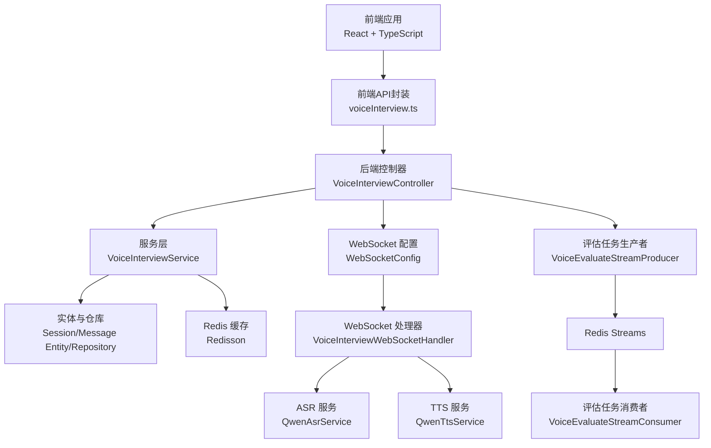
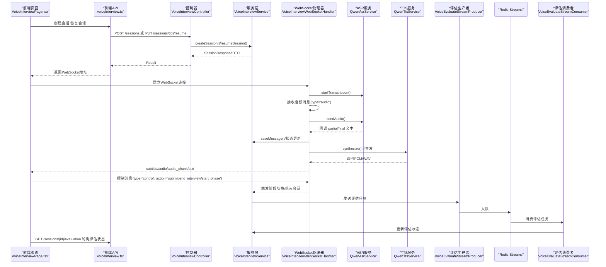
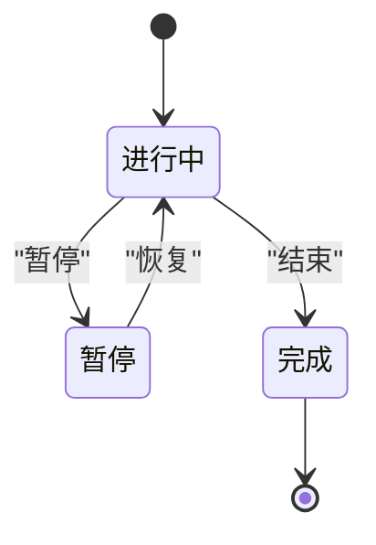
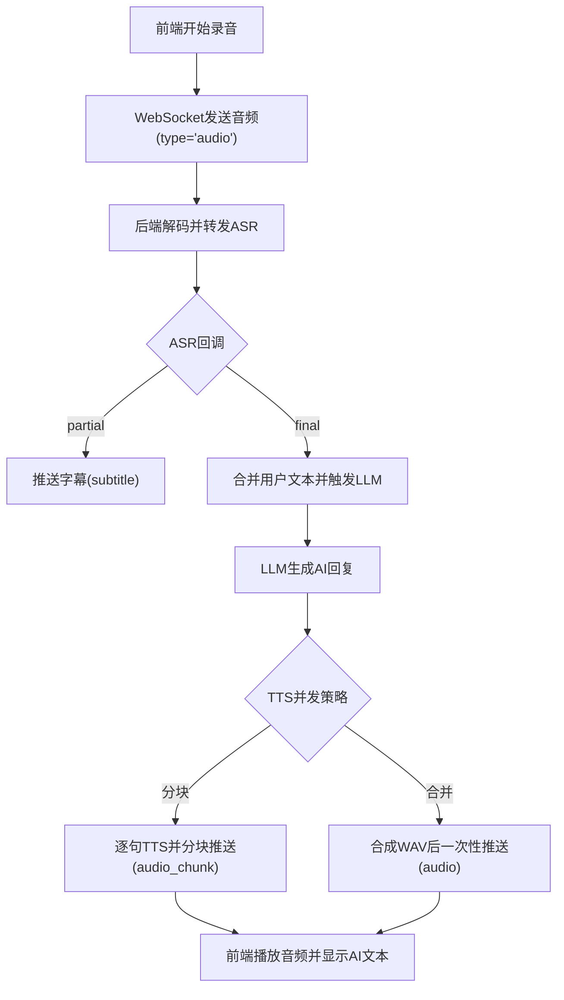
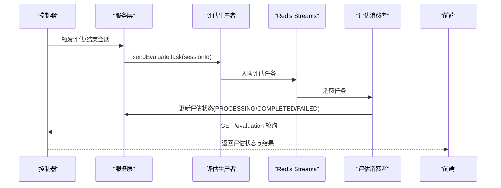
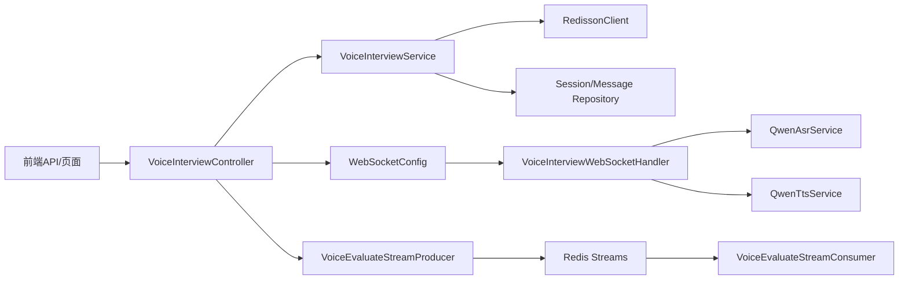

# 实时状态同步

<cite>
**本文引用的文件**
- [VoiceInterviewController.java](file://app/src/main/java/interview/guide/modules/voiceinterview/controller/VoiceInterviewController.java)
- [VoiceInterviewWebSocketHandler.java](file://app/src/main/java/interview/guide/modules/voiceinterview/handler/VoiceInterviewWebSocketHandler.java)
- [VoiceInterviewService.java](file://app/src/main/java/interview/guide/modules/voiceinterview/service/VoiceInterviewService.java)
- [WebSocketConfig.java](file://app/src/main/java/interview/guide/modules/voiceinterview/config/WebSocketConfig.java)
- [VoiceInterviewMessageDTO.java](file://app/src/main/java/interview/guide/modules/voiceinterview/dto/VoiceInterviewMessageDTO.java)
- [VoiceInterviewSessionEntity.java](file://app/src/main/java/interview/guide/modules/voiceinterview/model/VoiceInterviewSessionEntity.java)
- [VoiceEvaluateStreamConsumer.java](file://app/src/main/java/interview/guide/modules/voiceinterview/listener/VoiceEvaluateStreamConsumer.java)
- [VoiceEvaluateStreamProducer.java](file://app/src/main/java/interview/guide/modules/voiceinterview/listener/VoiceEvaluateStreamProducer.java)
- [QwenAsrService.java](file://app/src/main/java/interview/guide/modules/voiceinterview/service/QwenAsrService.java)
- [QwenTtsService.java](file://app/src/main/java/interview/guide/modules/voiceinterview/service/QwenTtsService.java)
- [application.yml](file://app/src/main/resources/application.yml)
- [voice-interview-opening.yml](file://app/src/main/resources/voice-interview-opening.yml)
- [VoiceInterviewPage.tsx](file://frontend/src/pages/VoiceInterviewPage.tsx)
- [voiceInterview.ts](file://frontend/src/utils/voiceInterview.ts)
- [voiceInterview.ts（API）](file://frontend/src/api/voiceInterview.ts)
</cite>

## 目录
1. [引言](#引言)
2. [项目结构](#项目结构)
3. [核心组件](#核心组件)
4. [架构总览](#架构总览)
5. [详细组件分析](#详细组件分析)
6. [依赖分析](#依赖分析)
7. [性能考虑](#性能考虑)
8. [故障排查指南](#故障排查指南)
9. [结论](#结论)
10. [附录](#附录)

## 引言
本技术文档围绕“实时状态同步系统”展开，聚焦于语音面试场景下的会话状态管理、前端状态驱动、后端状态维护与持久化、状态一致性保障、冲突解决与并发控制、性能优化与错误恢复等主题。系统采用 WebSocket 实时双向流、Redis 缓存、Redis Streams 异步评估、REST API 查询与轮询相结合的方式，形成“前端交互—后端处理—持久化与缓存—异步评估”的闭环。

## 项目结构
系统分为后端 Spring Boot 应用与前端 React 应用两部分：
- 后端模块：语音面试相关控制器、WebSocket 处理器、服务层、实体与仓库、配置、监听器与异步任务生产/消费等。
- 前端模块：语音面试页面、WebSocket 连接封装、API 请求封装、工具函数等。

图表来源
- [VoiceInterviewController.java:1-201](file://app/src/main/java/interview/guide/modules/voiceinterview/controller/VoiceInterviewController.java#L1-L201)
- [VoiceInterviewService.java:1-582](file://app/src/main/java/interview/guide/modules/voiceinterview/service/VoiceInterviewService.java#L1-L582)
- [WebSocketConfig.java:1-25](file://app/src/main/java/interview/guide/modules/voiceinterview/config/WebSocketConfig.java#L1-L25)
- [VoiceInterviewWebSocketHandler.java:1-1153](file://app/src/main/java/interview/guide/modules/voiceinterview/handler/VoiceInterviewWebSocketHandler.java#L1-L1153)
- [QwenAsrService.java:1-625](file://app/src/main/java/interview/guide/modules/voiceinterview/service/QwenAsrService.java#L1-L625)
- [QwenTtsService.java:1-397](file://app/src/main/java/interview/guide/modules/voiceinterview/service/QwenTtsService.java#L1-L397)
- [VoiceEvaluateStreamProducer.java:1-62](file://app/src/main/java/interview/guide/modules/voiceinterview/listener/VoiceEvaluateStreamProducer.java#L1-L62)
- [VoiceEvaluateStreamConsumer.java:1-121](file://app/src/main/java/interview/guide/modules/voiceinterview/listener/VoiceEvaluateStreamConsumer.java#L1-L121)
- [VoiceInterviewPage.tsx:1-734](file://frontend/src/pages/VoiceInterviewPage.tsx#L1-L734)
- [voiceInterview.ts（API）:1-383](file://frontend/src/api/voiceInterview.ts#L1-L383)

章节来源
- [VoiceInterviewController.java:1-201](file://app/src/main/java/interview/guide/modules/voiceinterview/controller/VoiceInterviewController.java#L1-L201)
- [VoiceInterviewService.java:1-582](file://app/src/main/java/interview/guide/modules/voiceinterview/service/VoiceInterviewService.java#L1-L582)
- [WebSocketConfig.java:1-25](file://app/src/main/java/interview/guide/modules/voiceinterview/config/WebSocketConfig.java#L1-L25)
- [VoiceInterviewWebSocketHandler.java:1-1153](file://app/src/main/java/interview/guide/modules/voiceinterview/handler/VoiceInterviewWebSocketHandler.java#L1-L1153)
- [QwenAsrService.java:1-625](file://app/src/main/java/interview/guide/modules/voiceinterview/service/QwenAsrService.java#L1-L625)
- [QwenTtsService.java:1-397](file://app/src/main/java/interview/guide/modules/voiceinterview/service/QwenTtsService.java#L1-L397)
- [VoiceEvaluateStreamProducer.java:1-62](file://app/src/main/java/interview/guide/modules/voiceinterview/listener/VoiceEvaluateStreamProducer.java#L1-L62)
- [VoiceEvaluateStreamConsumer.java:1-121](file://app/src/main/java/interview/guide/modules/voiceinterview/listener/VoiceEvaluateStreamConsumer.java#L1-L121)
- [VoiceInterviewPage.tsx:1-734](file://frontend/src/pages/VoiceInterviewPage.tsx#L1-L734)
- [voiceInterview.ts（API）:1-383](file://frontend/src/api/voiceInterview.ts#L1-L383)

## 核心组件
- 控制器层：提供会话创建、查询、结束、暂停/恢复、消息历史、评估状态查询与触发等 REST 接口。
- 服务层：封装会话生命周期、阶段切换、消息持久化、Redis 缓存、评估状态更新与触发。
- WebSocket 层：建立实时双向通道，处理音频与控制消息，驱动 STT/LLM/TTS 流水线。
- 异步评估：通过 Redis Streams 将评估任务解耦，消费者独立处理评估并回写状态。
- 前端层：封装 WebSocket 连接、音频录制与发送、字幕与音频播放、状态展示与交互。

章节来源
- [VoiceInterviewController.java:1-201](file://app/src/main/java/interview/guide/modules/voiceinterview/controller/VoiceInterviewController.java#L1-L201)
- [VoiceInterviewService.java:1-582](file://app/src/main/java/interview/guide/modules/voiceinterview/service/VoiceInterviewService.java#L1-L582)
- [VoiceInterviewWebSocketHandler.java:1-1153](file://app/src/main/java/interview/guide/modules/voiceinterview/handler/VoiceInterviewWebSocketHandler.java#L1-L1153)
- [VoiceEvaluateStreamConsumer.java:1-121](file://app/src/main/java/interview/guide/modules/voiceinterview/listener/VoiceEvaluateStreamConsumer.java#L1-L121)
- [VoiceInterviewPage.tsx:1-734](file://frontend/src/pages/VoiceInterviewPage.tsx#L1-L734)

## 架构总览
系统采用“请求-响应 + 实时双向 + 异步评估”的混合架构：
- REST API：会话管理、消息查询、评估状态轮询。
- WebSocket：实时音频输入、字幕与音频输出、控制指令（提交、结束、阶段切换）。
- Redis Streams：异步评估任务队列，解耦评估与主流程。
- Redis 缓存：热点会话数据缓存，降低数据库压力。
- 数据库：持久化会话与消息历史。

图表来源
- [VoiceInterviewController.java:1-201](file://app/src/main/java/interview/guide/modules/voiceinterview/controller/VoiceInterviewController.java#L1-L201)
- [VoiceInterviewService.java:1-582](file://app/src/main/java/interview/guide/modules/voiceinterview/service/VoiceInterviewService.java#L1-L582)
- [VoiceInterviewWebSocketHandler.java:1-1153](file://app/src/main/java/interview/guide/modules/voiceinterview/handler/VoiceInterviewWebSocketHandler.java#L1-L1153)
- [QwenAsrService.java:1-625](file://app/src/main/java/interview/guide/modules/voiceinterview/service/QwenAsrService.java#L1-L625)
- [QwenTtsService.java:1-397](file://app/src/main/java/interview/guide/modules/voiceinterview/service/QwenTtsService.java#L1-L397)
- [VoiceEvaluateStreamProducer.java:1-62](file://app/src/main/java/interview/guide/modules/voiceinterview/listener/VoiceEvaluateStreamProducer.java#L1-L62)
- [VoiceEvaluateStreamConsumer.java:1-121](file://app/src/main/java/interview/guide/modules/voiceinterview/listener/VoiceEvaluateStreamConsumer.java#L1-L121)
- [VoiceInterviewPage.tsx:1-734](file://frontend/src/pages/VoiceInterviewPage.tsx#L1-L734)
- [voiceInterview.ts（API）:1-383](file://frontend/src/api/voiceInterview.ts#L1-L383)

## 详细组件分析

### 会话生命周期与状态管理
- 创建会话：接收技能模板、难度、启用阶段、计划时长等参数，构建会话实体并持久化，同时写入 Redis 缓存，返回包含 WebSocket 地址的响应。
- 暂停/恢复：暂停时记录暂停时间，恢复时更新状态并重新提供 WebSocket 地址。
- 结束会话：标记结束时间、计算实际时长、进入完成态，并触发异步评估任务入队。
- 阶段切换：根据配置的时长与问题数阈值判断是否需要过渡到下一阶段，支持 INTRO/TECH/PROJECT/HR/COMPLETED。

图表来源
- [VoiceInterviewService.java:1-582](file://app/src/main/java/interview/guide/modules/voiceinterview/service/VoiceInterviewService.java#L1-L582)
- [VoiceInterviewSessionEntity.java:1-122](file://app/src/main/java/interview/guide/modules/voiceinterview/model/VoiceInterviewSessionEntity.java#L1-L122)

章节来源
- [VoiceInterviewService.java:1-582](file://app/src/main/java/interview/guide/modules/voiceinterview/service/VoiceInterviewService.java#L1-L582)
- [VoiceInterviewSessionEntity.java:1-122](file://app/src/main/java/interview/guide/modules/voiceinterview/model/VoiceInterviewSessionEntity.java#L1-L122)

### WebSocket 实时状态同步
- 连接建立：后端注册 WebSocket 路径，拦截器允许跨域；前端通过控制器返回的 WebSocket 地址连接。
- 音频输入：前端持续采集音频并通过 WebSocket 发送，后端进行 Base64 解码并转发至 ASR。
- STT 结果：ASR 回调 partial 与 final 文本；后端将 partial 实时推送给前端字幕，final 文本触发 LLM 管线。
- LLM/TTS：后端根据会话上下文与阶段生成回复，支持分句并发 TTS；前端可选择分块推送或合并推送音频。
- 控制消息：前端发送“提交回答/结束面试/开始阶段”等控制消息，后端据此更新状态或触发流程。

图表来源
- [VoiceInterviewWebSocketHandler.java:1-1153](file://app/src/main/java/interview/guide/modules/voiceinterview/handler/VoiceInterviewWebSocketHandler.java#L1-L1153)
- [QwenAsrService.java:1-625](file://app/src/main/java/interview/guide/modules/voiceinterview/service/QwenAsrService.java#L1-L625)
- [QwenTtsService.java:1-397](file://app/src/main/java/interview/guide/modules/voiceinterview/service/QwenTtsService.java#L1-L397)
- [VoiceInterviewPage.tsx:1-734](file://frontend/src/pages/VoiceInterviewPage.tsx#L1-L734)
- [voiceInterview.ts（API）:1-383](file://frontend/src/api/voiceInterview.ts#L1-L383)

章节来源
- [WebSocketConfig.java:1-25](file://app/src/main/java/interview/guide/modules/voiceinterview/config/WebSocketConfig.java#L1-L25)
- [VoiceInterviewWebSocketHandler.java:1-1153](file://app/src/main/java/interview/guide/modules/voiceinterview/handler/VoiceInterviewWebSocketHandler.java#L1-L1153)
- [QwenAsrService.java:1-625](file://app/src/main/java/interview/guide/modules/voiceinterview/service/QwenAsrService.java#L1-L625)
- [QwenTtsService.java:1-397](file://app/src/main/java/interview/guide/modules/voiceinterview/service/QwenTtsService.java#L1-L397)
- [VoiceInterviewPage.tsx:1-734](file://frontend/src/pages/VoiceInterviewPage.tsx#L1-L734)
- [voiceInterview.ts（API）:1-383](file://frontend/src/api/voiceInterview.ts#L1-L383)

### 评估任务的异步状态同步
- 触发评估：结束会话或显式触发时，服务层更新评估状态为 PENDING 并向 Redis Streams 写入评估任务。
- 消费评估：消费者从 Streams 拉取任务，标记 PROCESSING，执行评估并回写 COMPLETED 或 FAILED。
- 前端轮询：前端通过 GET /sessions/{id}/evaluation 轮询评估状态，直到返回 COMPLETED 并获取评估结果。

图表来源
- [VoiceInterviewController.java:1-201](file://app/src/main/java/interview/guide/modules/voiceinterview/controller/VoiceInterviewController.java#L1-L201)
- [VoiceInterviewService.java:1-582](file://app/src/main/java/interview/guide/modules/voiceinterview/service/VoiceInterviewService.java#L1-L582)
- [VoiceEvaluateStreamProducer.java:1-62](file://app/src/main/java/interview/guide/modules/voiceinterview/listener/VoiceEvaluateStreamProducer.java#L1-L62)
- [VoiceEvaluateStreamConsumer.java:1-121](file://app/src/main/java/interview/guide/modules/voiceinterview/listener/VoiceEvaluateStreamConsumer.java#L1-L121)

章节来源
- [VoiceInterviewController.java:1-201](file://app/src/main/java/interview/guide/modules/voiceinterview/controller/VoiceInterviewController.java#L1-L201)
- [VoiceInterviewService.java:1-582](file://app/src/main/java/interview/guide/modules/voiceinterview/service/VoiceInterviewService.java#L1-L582)
- [VoiceEvaluateStreamProducer.java:1-62](file://app/src/main/java/interview/guide/modules/voiceinterview/listener/VoiceEvaluateStreamProducer.java#L1-L62)
- [VoiceEvaluateStreamConsumer.java:1-121](file://app/src/main/java/interview/guide/modules/voiceinterview/listener/VoiceEvaluateStreamConsumer.java#L1-L121)

### 数据一致性与并发控制
- Redis 缓存：会话对象写入 Redis 缓存，TTL 1 小时，读取优先命中缓存，未命中回源数据库；写入/更新后失效缓存，确保后续读取最新。
- 事务与幂等：会话创建、阶段切换、暂停/恢复、结束均在服务层使用事务，避免中间态不一致；接口设计尽量幂等，避免重复提交导致的状态漂移。
- 并发处理：WebSocket 层使用虚拟线程执行阻塞 I/O（ASR/TTS/JDBC），避免阻塞主线程；ASR/TTS 服务各自管理连接与回调，避免跨会话干扰。
- 评估并发：评估任务通过 Redis Streams 解耦，消费者串行/并行处理取决于实现，失败重试与错误回写保证最终一致。

章节来源
- [VoiceInterviewService.java:1-582](file://app/src/main/java/interview/guide/modules/voiceinterview/service/VoiceInterviewService.java#L1-L582)
- [application.yml:1-282](file://app/src/main/resources/application.yml#L1-L282)

### 错误处理与恢复
- WebSocket 层：捕获传输错误与连接异常，必要时重启 ASR 连接；对异常消息进行用户友好提示。
- 评估失败：消费者在重试入队失败时回写 FAILED 状态，前端轮询可感知错误并提示用户重试。
- 前端恢复：WebSocket 断线自动重连（有限次数），音频播放需用户交互激活；会话未结束时自动暂停，避免资源泄漏。

章节来源
- [VoiceInterviewWebSocketHandler.java:1-1153](file://app/src/main/java/interview/guide/modules/voiceinterview/handler/VoiceInterviewWebSocketHandler.java#L1-L1153)
- [VoiceEvaluateStreamConsumer.java:1-121](file://app/src/main/java/interview/guide/modules/voiceinterview/listener/VoiceEvaluateStreamConsumer.java#L1-L121)
- [VoiceInterviewPage.tsx:1-734](file://frontend/src/pages/VoiceInterviewPage.tsx#L1-L734)
- [voiceInterview.ts（API）:1-383](file://frontend/src/api/voiceInterview.ts#L1-L383)

## 依赖分析
- 组件耦合：控制器依赖服务层；服务层依赖仓库、Redisson、评估生产者；WebSocket 处理器依赖 ASR/TTS 服务与服务层；前端 API 封装依赖控制器与 WebSocket 连接类。
- 外部依赖：PostgreSQL（会话与消息）、Redis（缓存与 Streams）、DashScope（ASR/TTS/LLM）。
- 配置依赖：application.yml 提供数据库、Redis、AI Provider、语音面试参数；voice-interview-opening.yml 提供开场白模板。

图表来源
- [VoiceInterviewController.java:1-201](file://app/src/main/java/interview/guide/modules/voiceinterview/controller/VoiceInterviewController.java#L1-L201)
- [VoiceInterviewService.java:1-582](file://app/src/main/java/interview/guide/modules/voiceinterview/service/VoiceInterviewService.java#L1-L582)
- [WebSocketConfig.java:1-25](file://app/src/main/java/interview/guide/modules/voiceinterview/config/WebSocketConfig.java#L1-L25)
- [VoiceInterviewWebSocketHandler.java:1-1153](file://app/src/main/java/interview/guide/modules/voiceinterview/handler/VoiceInterviewWebSocketHandler.java#L1-L1153)
- [QwenAsrService.java:1-625](file://app/src/main/java/interview/guide/modules/voiceinterview/service/QwenAsrService.java#L1-L625)
- [QwenTtsService.java:1-397](file://app/src/main/java/interview/guide/modules/voiceinterview/service/QwenTtsService.java#L1-L397)
- [VoiceEvaluateStreamProducer.java:1-62](file://app/src/main/java/interview/guide/modules/voiceinterview/listener/VoiceEvaluateStreamProducer.java#L1-L62)
- [VoiceEvaluateStreamConsumer.java:1-121](file://app/src/main/java/interview/guide/modules/voiceinterview/listener/VoiceEvaluateStreamConsumer.java#L1-L121)
- [voiceInterview.ts（API）:1-383](file://frontend/src/api/voiceInterview.ts#L1-L383)

章节来源
- [application.yml:1-282](file://app/src/main/resources/application.yml#L1-L282)
- [voice-interview-opening.yml:1-45](file://app/src/main/resources/voice-interview-opening.yml#L1-L45)

## 性能考虑
- 虚拟线程：启用虚拟线程以提升 I/O 密集型并发（Tomcat 线程池与 Spring 虚拟线程协同）。
- Redis 缓存：热点会话缓存降低数据库压力；评估状态更新后及时失效缓存。
- ASR/TTS 并发：分句并发 TTS，减少端到端延迟；音频分块推送避免长音频缓冲。
- 批量与批序：JPA 批量插入/更新顺序优化，减少数据库往返。
- 音频规格：采样率、码率、分片时长按场景权衡，兼顾质量与带宽。

章节来源
- [application.yml:1-282](file://app/src/main/resources/application.yml#L1-L282)
- [VoiceInterviewService.java:1-582](file://app/src/main/java/interview/guide/modules/voiceinterview/service/VoiceInterviewService.java#L1-L582)
- [VoiceInterviewWebSocketHandler.java:1-1153](file://app/src/main/java/interview/guide/modules/voiceinterview/handler/VoiceInterviewWebSocketHandler.java#L1-L1153)

## 故障排查指南
- WebSocket 连接失败：检查后端日志与网络连通性；确认路径与跨域配置；前端重连逻辑与错误提示。
- ASR/TTS 失败：查看服务端错误日志与第三方 API 返回；确认 API Key 与模型配置；必要时重启连接。
- 评估未完成：前端轮询评估状态；若长时间未完成，检查 Redis Streams 消费者是否存活；查看评估状态回写日志。
- 会话状态异常：检查 Redis 缓存是否命中；核对数据库状态字段；确认事务边界与幂等设计。
- 前端音频播放：首次播放需用户交互；分块播放队列需确保 drain 完成后再提交 AI 文本。

章节来源
- [VoiceInterviewWebSocketHandler.java:1-1153](file://app/src/main/java/interview/guide/modules/voiceinterview/handler/VoiceInterviewWebSocketHandler.java#L1-L1153)
- [VoiceInterviewController.java:1-201](file://app/src/main/java/interview/guide/modules/voiceinterview/controller/VoiceInterviewController.java#L1-L201)
- [VoiceInterviewPage.tsx:1-734](file://frontend/src/pages/VoiceInterviewPage.tsx#L1-L734)
- [voiceInterview.ts（API）:1-383](file://frontend/src/api/voiceInterview.ts#L1-L383)

## 结论
该实时状态同步系统通过“REST + WebSocket + Redis Streams”的组合，实现了语音面试场景下的高并发、低延迟与强一致性的状态流转。前端以用户交互为中心，后端以服务层为核心，配合 Redis 缓存与异步评估，既满足了实时性需求，又具备良好的可扩展性与容错能力。建议在生产环境中进一步完善监控与告警、限流与熔断策略，并持续优化音频编解码与 TTS 并发策略以提升用户体验。

## 附录
- 配置要点：AI Provider、Phase 时长与问题阈值、ASR/TTS 参数、音频规格、速率限制等。
- 开场白模板：按技能模板动态选择开场问题，提升面试体验与针对性。

章节来源
- [application.yml:1-282](file://app/src/main/resources/application.yml#L1-L282)
- [voice-interview-opening.yml:1-45](file://app/src/main/resources/voice-interview-opening.yml#L1-L45)
- [voiceInterview.ts（API）:1-383](file://frontend/src/api/voiceInterview.ts#L1-L383)
- [voiceInterview.ts（工具）:1-6](file://frontend/src/utils/voiceInterview.ts#L1-L6)