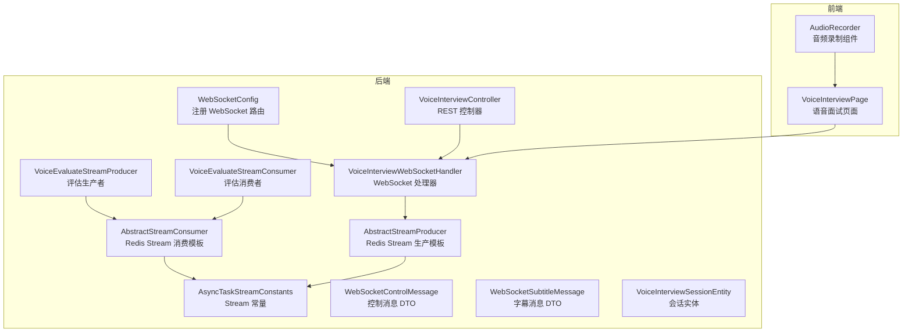
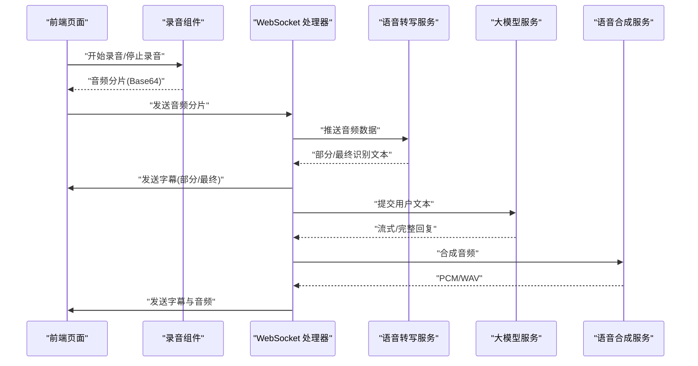
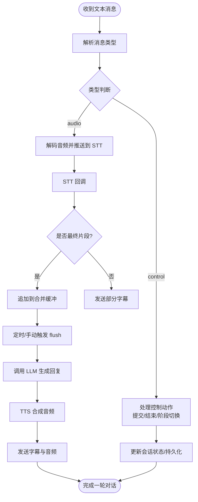
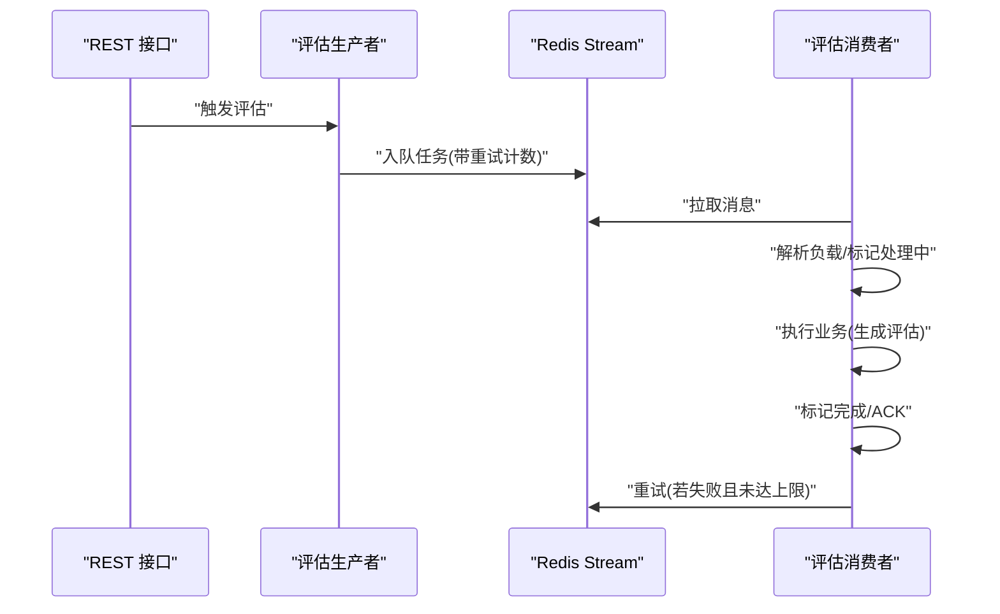
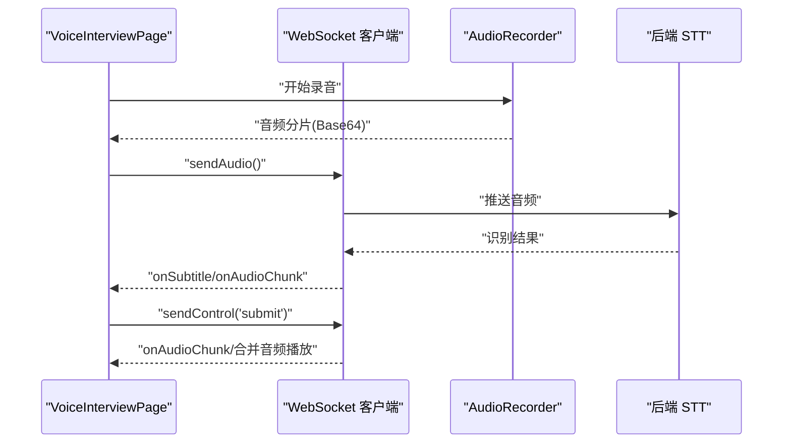
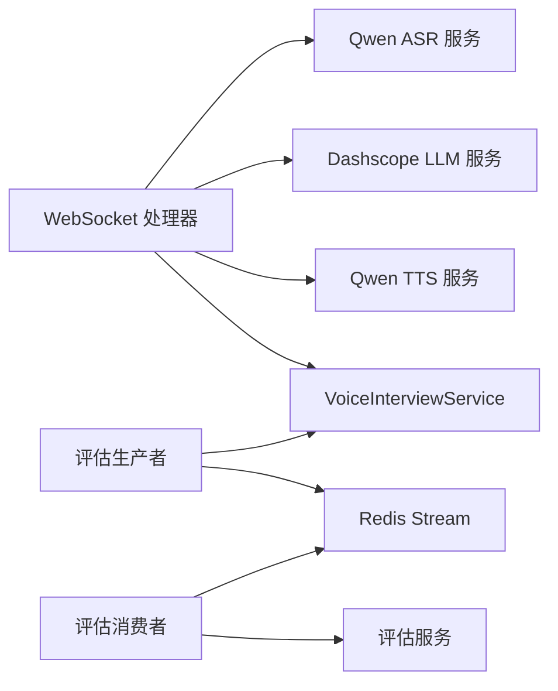

# 实时通信系统

<cite>
**本文引用的文件**
- [WebSocketConfig.java](file://app/src/main/java/interview/guide/modules/voiceinterview/config/WebSocketConfig.java)
- [VoiceInterviewWebSocketHandler.java](file://app/src/main/java/interview/guide/modules/voiceinterview/handler/VoiceInterviewWebSocketHandler.java)
- [VoiceInterviewController.java](file://app/src/main/java/interview/guide/modules/voiceinterview/controller/VoiceInterviewController.java)
- [AbstractStreamConsumer.java](file://app/src/main/java/interview/guide/common/async/AbstractStreamConsumer.java)
- [AbstractStreamProducer.java](file://app/src/main/java/interview/guide/common/async/AbstractStreamProducer.java)
- [VoiceEvaluateStreamConsumer.java](file://app/src/main/java/interview/guide/modules/voiceinterview/listener/VoiceEvaluateStreamConsumer.java)
- [VoiceEvaluateStreamProducer.java](file://app/src/main/java/interview/guide/modules/voiceinterview/listener/VoiceEvaluateStreamProducer.java)
- [AsyncTaskStreamConstants.java](file://app/src/main/java/interview/guide/common/constant/AsyncTaskStreamConstants.java)
- [WebSocketControlMessage.java](file://app/src/main/java/interview/guide/modules/voiceinterview/dto/WebSocketControlMessage.java)
- [WebSocketSubtitleMessage.java](file://app/src/main/java/interview/guide/modules/voiceinterview/dto/WebSocketSubtitleMessage.java)
- [VoiceInterviewSessionEntity.java](file://app/src/main/java/interview/guide/modules/voiceinterview/model/VoiceInterviewSessionEntity.java)
- [AudioRecorder.tsx](file://frontend/src/components/AudioRecorder.tsx)
- [VoiceInterviewPage.tsx](file://frontend/src/pages/VoiceInterviewPage.tsx)
</cite>

## 目录
1. [引言](#引言)
2. [项目结构](#项目结构)
3. [核心组件](#核心组件)
4. [架构总览](#架构总览)
5. [详细组件分析](#详细组件分析)
6. [依赖分析](#依赖分析)
7. [性能考量](#性能考量)
8. [故障排查指南](#故障排查指南)
9. [结论](#结论)
10. [附录](#附录)

## 引言
本技术文档面向实时通信系统，聚焦以下能力：
- WebSocket 实时双向音频流架构设计：连接管理、消息路由、状态同步与断线重连
- Redis Stream 异步处理机制：消息生产消费、队列管理、错误处理与重试
- Server-Sent Events（SSE）实现原理：流式数据传输、连接维护与断线重连（概念性说明）
- 实时状态同步策略：前端状态管理、数据一致性与用户体验优化
- 前端实现：WebSocket 客户端、SSE 客户端与音频处理组件
- 安全与性能优化：认证、消息加密、防刷、连接池、消息压缩与延迟控制
- 监控与调试：指标采集与问题定位方法

## 项目结构
系统采用后端 Spring Boot 与前端 React 的分层架构，实时通信相关代码主要分布在：
- 后端模块：语音面试模块（WebSocket 处理器、控制器、服务）、通用异步任务（Redis Stream 生产/消费模板）
- 前端模块：语音面试页面、音频录制组件、实时字幕展示组件

**图表来源**
- [WebSocketConfig.java:18-23](file://app/src/main/java/interview/guide/modules/voiceinterview/config/WebSocketConfig.java#L18-L23)
- [VoiceInterviewWebSocketHandler.java:139-169](file://app/src/main/java/interview/guide/modules/voiceinterview/handler/VoiceInterviewWebSocketHandler.java#L139-L169)
- [VoiceInterviewController.java:48-79](file://app/src/main/java/interview/guide/modules/voiceinterview/controller/VoiceInterviewController.java#L48-L79)
- [AbstractStreamConsumer.java:74-93](file://app/src/main/java/interview/guide/common/async/AbstractStreamConsumer.java#L74-L93)
- [AbstractStreamProducer.java:22-36](file://app/src/main/java/interview/guide/common/async/AbstractStreamProducer.java#L22-L36)
- [VoiceEvaluateStreamConsumer.java:35-58](file://app/src/main/java/interview/guide/modules/voiceinterview/listener/VoiceEvaluateStreamConsumer.java#L35-L58)
- [VoiceEvaluateStreamProducer.java:29-49](file://app/src/main/java/interview/guide/modules/voiceinterview/listener/VoiceEvaluateStreamProducer.java#L29-L49)
- [AsyncTaskStreamConstants.java:115-134](file://app/src/main/java/interview/guide/common/constant/AsyncTaskStreamConstants.java#L115-L134)
- [WebSocketControlMessage.java:14-18](file://app/src/main/java/interview/guide/modules/voiceinterview/dto/WebSocketControlMessage.java#L14-L18)
- [WebSocketSubtitleMessage.java:12-16](file://app/src/main/java/interview/guide/modules/voiceinterview/dto/WebSocketSubtitleMessage.java#L12-L16)
- [VoiceInterviewSessionEntity.java:118-121](file://app/src/main/java/interview/guide/modules/voiceinterview/model/VoiceInterviewSessionEntity.java#L118-L121)
- [VoiceInterviewPage.tsx:357-366](file://frontend/src/pages/VoiceInterviewPage.tsx#L357-L366)
- [AudioRecorder.tsx:69-178](file://frontend/src/components/AudioRecorder.tsx#L69-L178)

**章节来源**
- [WebSocketConfig.java:18-23](file://app/src/main/java/interview/guide/modules/voiceinterview/config/WebSocketConfig.java#L18-L23)
- [VoiceInterviewController.java:48-79](file://app/src/main/java/interview/guide/modules/voiceinterview/controller/VoiceInterviewController.java#L48-L79)

## 核心组件
- WebSocket 配置与处理器
  - 路由注册：后端通过配置类注册 WebSocket 路由与拦截器
  - 处理器职责：建立连接、接收音频与控制消息、驱动 STT/LLM/TTS 管线、发送字幕与音频
- Redis Stream 异步处理
  - 模板基类：统一消费循环、ACK、重试与生命周期管理
  - 具体消费者/生产者：语音面试评估任务的入队与消费
- 前端实时交互
  - 页面：会话创建/恢复、连接状态管理、音频分片发送、字幕与音频播放
  - 录音组件：VAD 检测、PCM 采样、Base64 分片、音量可视化

**章节来源**
- [VoiceInterviewWebSocketHandler.java:139-169](file://app/src/main/java/interview/guide/modules/voiceinterview/handler/VoiceInterviewWebSocketHandler.java#L139-L169)
- [AbstractStreamConsumer.java:74-93](file://app/src/main/java/interview/guide/common/async/AbstractStreamConsumer.java#L74-L93)
- [VoiceEvaluateStreamConsumer.java:35-58](file://app/src/main/java/interview/guide/modules/voiceinterview/listener/VoiceEvaluateStreamConsumer.java#L35-L58)
- [VoiceInterviewPage.tsx:357-366](file://frontend/src/pages/VoiceInterviewPage.tsx#L357-L366)
- [AudioRecorder.tsx:69-178](file://frontend/src/components/AudioRecorder.tsx#L69-L178)

## 架构总览
系统实时通信链路分为两条主线：
- WebSocket 实时链路：浏览器通过 WebSocket 与后端进行音频与控制消息的双向传输；后端将音频送入 STT，生成文本后进入 LLM 流水线，再合成 TTS 并回传字幕与音频
- Redis Stream 异步链路：会话结束后触发评估任务入队，消费者异步消费并更新评估状态

**图表来源**
- [VoiceInterviewPage.tsx:462-468](file://frontend/src/pages/VoiceInterviewPage.tsx#L462-L468)
- [VoiceInterviewWebSocketHandler.java:396-425](file://app/src/main/java/interview/guide/modules/voiceinterview/handler/VoiceInterviewWebSocketHandler.java#L396-L425)
- [VoiceInterviewWebSocketHandler.java:587-748](file://app/src/main/java/interview/guide/modules/voiceinterview/handler/VoiceInterviewWebSocketHandler.java#L587-L748)

## 详细组件分析

### WebSocket 实现与状态同步
- 连接管理
  - 路由注册与拦截器：允许跨域并绑定处理器
  - 会话装饰与限制：设置消息大小上限与发送缓冲限制，保障稳定性
  - 活动跟踪：记录最后活动时间，支持暂停超时检测
- 消息路由
  - 文本消息解析：区分音频与控制两类消息
  - 控制消息：提交回答、结束会话、阶段切换
  - 字幕消息：区分最终与部分文本，前端即时渲染
- 状态同步
  - 合并 STT 片段：在用户侧设置去抖窗口，合并后再触发 LLM
  - 会话状态：AI 说话标记、冷却期、处理线程与并发控制
  - 前端状态：连接状态、字幕、音频播放、提交按钮可用性

**图表来源**
- [VoiceInterviewWebSocketHandler.java:299-345](file://app/src/main/java/interview/guide/modules/voiceinterview/handler/VoiceInterviewWebSocketHandler.java#L299-L345)
- [VoiceInterviewWebSocketHandler.java:513-547](file://app/src/main/java/interview/guide/modules/voiceinterview/handler/VoiceInterviewWebSocketHandler.java#L513-L547)
- [VoiceInterviewWebSocketHandler.java:556-748](file://app/src/main/java/interview/guide/modules/voiceinterview/handler/VoiceInterviewWebSocketHandler.java#L556-L748)

**章节来源**
- [WebSocketConfig.java:18-23](file://app/src/main/java/interview/guide/modules/voiceinterview/config/WebSocketConfig.java#L18-L23)
- [VoiceInterviewWebSocketHandler.java:139-169](file://app/src/main/java/interview/guide/modules/voiceinterview/handler/VoiceInterviewWebSocketHandler.java#L139-L169)
- [VoiceInterviewWebSocketHandler.java:396-425](file://app/src/main/java/interview/guide/modules/voiceinterview/handler/VoiceInterviewWebSocketHandler.java#L396-L425)
- [VoiceInterviewWebSocketHandler.java:776-791](file://app/src/main/java/interview/guide/modules/voiceinterview/handler/VoiceInterviewWebSocketHandler.java#L776-L791)
- [WebSocketControlMessage.java:14-18](file://app/src/main/java/interview/guide/modules/voiceinterview/dto/WebSocketControlMessage.java#L14-L18)
- [WebSocketSubtitleMessage.java:12-16](file://app/src/main/java/interview/guide/modules/voiceinterview/dto/WebSocketSubtitleMessage.java#L12-L16)

### Redis Stream 异步处理机制
- 模板设计
  - 消费循环：按批次与轮询间隔拉取消息，统一 ACK
  - 错误处理：捕获异常、计算重试次数、超过阈值标记失败
  - 生命周期：启动/销毁时注册消费者组、优雅关闭
- 语音面试评估
  - 生产者：会话结束时入队评估任务
  - 消费者：更新评估状态、执行评估、完成 ACK 或重试

**图表来源**
- [VoiceInterviewController.java:74-79](file://app/src/main/java/interview/guide/modules/voiceinterview/controller/VoiceInterviewController.java#L74-L79)
- [VoiceEvaluateStreamProducer.java:29-49](file://app/src/main/java/interview/guide/modules/voiceinterview/listener/VoiceEvaluateStreamProducer.java#L29-L49)
- [VoiceEvaluateStreamConsumer.java:76-97](file://app/src/main/java/interview/guide/modules/voiceinterview/listener/VoiceEvaluateStreamConsumer.java#L76-L97)
- [AbstractStreamConsumer.java:74-93](file://app/src/main/java/interview/guide/common/async/AbstractStreamConsumer.java#L74-L93)

**章节来源**
- [AbstractStreamConsumer.java:35-72](file://app/src/main/java/interview/guide/common/async/AbstractStreamConsumer.java#L35-L72)
- [AbstractStreamConsumer.java:95-123](file://app/src/main/java/interview/guide/common/async/AbstractStreamConsumer.java#L95-L123)
- [VoiceEvaluateStreamConsumer.java:100-119](file://app/src/main/java/interview/guide/modules/voiceinterview/listener/VoiceEvaluateStreamConsumer.java#L100-L119)
- [AsyncTaskStreamConstants.java:115-134](file://app/src/main/java/interview/guide/common/constant/AsyncTaskStreamConstants.java#L115-L134)

### Server-Sent Events (SSE) 实现原理（概念性说明）
- 流式数据传输：后端以事件流形式推送增量数据，前端使用 EventSource 订阅
- 连接维护：心跳与重连策略，断线自动重连并可选择从上次事件 ID 恢复
- 应用场景：日志流、状态变更通知、增量数据推送（本仓库未直接实现 SSE，此处为通用实践说明）

[此图为概念性说明，不对应具体源文件]

### 前端实现：WebSocket 客户端与音频处理
- WebSocket 客户端
  - 连接建立：页面根据会话信息构建 WS 地址并连接
  - 消息处理：字幕、音频分片、错误与关闭事件
  - 控制操作：提交回答、暂停/结束会话
- 音频处理组件
  - VAD 检测：基于 WebAssembly 的 VAD 库，提供语音起止回调
  - PCM 采样：16kHz、16bit，按 1 秒切片
  - Base64 编码：便于 WebSocket 文本帧传输
  - 音量可视化：基于 AnalyserNode 的 FFT 分析

**图表来源**
- [VoiceInterviewPage.tsx:293-355](file://frontend/src/pages/VoiceInterviewPage.tsx#L293-L355)
- [VoiceInterviewPage.tsx:462-468](file://frontend/src/pages/VoiceInterviewPage.tsx#L462-L468)
- [AudioRecorder.tsx:69-178](file://frontend/src/components/AudioRecorder.tsx#L69-L178)

**章节来源**
- [VoiceInterviewPage.tsx:357-366](file://frontend/src/pages/VoiceInterviewPage.tsx#L357-L366)
- [VoiceInterviewPage.tsx:462-468](file://frontend/src/pages/VoiceInterviewPage.tsx#L462-L468)
- [AudioRecorder.tsx:69-178](file://frontend/src/components/AudioRecorder.tsx#L69-L178)

### 实时状态同步策略
- 前端状态管理
  - 连接状态、字幕、音频播放、提交按钮可用性
  - 分片音频播放队列与 drain 等待，确保 UI 与音频播放同步
- 数据一致性
  - 最终字幕在服务端 flush 后才写入历史，避免中间态污染
  - 会话实体记录评估状态与错误，供前端轮询查询
- 用户体验
  - 语音起止提示、倒计时显示、暂停/结束操作反馈

**章节来源**
- [VoiceInterviewPage.tsx:106-187](file://frontend/src/pages/VoiceInterviewPage.tsx#L106-L187)
- [VoiceInterviewPage.tsx:189-238](file://frontend/src/pages/VoiceInterviewPage.tsx#L189-L238)
- [VoiceInterviewSessionEntity.java:99-104](file://app/src/main/java/interview/guide/modules/voiceinterview/model/VoiceInterviewSessionEntity.java#L99-L104)

## 依赖分析
- 组件耦合
  - WebSocket 处理器依赖 STT/LLM/TTS 服务与会话服务，通过接口注入降低耦合
  - Redis Stream 模板与具体消费者/生产者通过抽象契约解耦
- 外部依赖
  - WebSocket 服务器、Redis、第三方语音服务（阿里云 DashScope）
- 循环依赖
  - 未见直接循环依赖；消费者/生产者通过模板基类与常量解耦

**图表来源**
- [VoiceInterviewWebSocketHandler.java:59-64](file://app/src/main/java/interview/guide/modules/voiceinterview/handler/VoiceInterviewWebSocketHandler.java#L59-L64)
- [VoiceInterviewController.java:42-43](file://app/src/main/java/interview/guide/modules/voiceinterview/controller/VoiceInterviewController.java#L42-L43)
- [VoiceEvaluateStreamConsumer.java:22-31](file://app/src/main/java/interview/guide/modules/voiceinterview/listener/VoiceEvaluateStreamConsumer.java#L22-L31)
- [VoiceEvaluateStreamProducer.java:21-27](file://app/src/main/java/interview/guide/modules/voiceinterview/listener/VoiceEvaluateStreamProducer.java#L21-L27)

**章节来源**
- [VoiceInterviewWebSocketHandler.java:59-64](file://app/src/main/java/interview/guide/modules/voiceinterview/handler/VoiceInterviewWebSocketHandler.java#L59-L64)
- [VoiceInterviewController.java:42-43](file://app/src/main/java/interview/guide/modules/voiceinterview/controller/VoiceInterviewController.java#L42-L43)
- [VoiceEvaluateStreamConsumer.java:22-31](file://app/src/main/java/interview/guide/modules/voiceinterview/listener/VoiceEvaluateStreamConsumer.java#L22-L31)
- [VoiceEvaluateStreamProducer.java:21-27](file://app/src/main/java/interview/guide/modules/voiceinterview/listener/VoiceEvaluateStreamProducer.java#L21-L27)

## 性能考量
- 连接与线程
  - 使用虚拟线程执行阻塞的 LLM/TTS，避免占用调度线程
  - 专用调度线程池处理 STT 合并，限制并发
- 消息与音频
  - WebSocket 文本帧承载 Base64 音频，设置合理大小限制
  - 分块音频推送，前端队列播放，减少卡顿
- 延迟优化
  - STT 部分结果即时回传，提升感知延迟
  - LLM 流式输出与 TTS 并行，句子级并发合成
- 存储与队列
  - Redis Stream 设置最大长度，自动裁剪旧消息
  - 消费者组与 ACK 保障可靠投递与幂等

**章节来源**
- [VoiceInterviewWebSocketHandler.java:74](file://app/src/main/java/interview/guide/modules/voiceinterview/handler/VoiceInterviewWebSocketHandler.java#L74)
- [VoiceInterviewWebSocketHandler.java:94-103](file://app/src/main/java/interview/guide/modules/voiceinterview/handler/VoiceInterviewWebSocketHandler.java#L94-L103)
- [VoiceInterviewWebSocketHandler.java:608-624](file://app/src/main/java/interview/guide/modules/voiceinterview/handler/VoiceInterviewWebSocketHandler.java#L608-L624)
- [AsyncTaskStreamConstants.java:45](file://app/src/main/java/interview/guide/common/constant/AsyncTaskStreamConstants.java#L45)

## 故障排查指南
- WebSocket 连接问题
  - 检查路由与跨域配置、握手拦截器是否生效
  - 关注连接建立日志与关闭原因码
- STT 连接中断
  - 处理器内置重连逻辑与异常恢复，必要时刷新页面重试
- 评估任务失败
  - 查看消费者日志与重试次数，确认 Redis 可用性与消费者组状态
- 前端播放异常
  - 检查音频上下文状态与自动播放策略，确保用户交互后播放

**章节来源**
- [WebSocketConfig.java:18-23](file://app/src/main/java/interview/guide/modules/voiceinterview/config/WebSocketConfig.java#L18-L23)
- [VoiceInterviewWebSocketHandler.java:383-385](file://app/src/main/java/interview/guide/modules/voiceinterview/handler/VoiceInterviewWebSocketHandler.java#L383-L385)
- [VoiceInterviewWebSocketHandler.java:411-425](file://app/src/main/java/interview/guide/modules/voiceinterview/handler/VoiceInterviewWebSocketHandler.java#L411-L425)
- [AbstractStreamConsumer.java:85-92](file://app/src/main/java/interview/guide/common/async/AbstractStreamConsumer.java#L85-L92)

## 结论
该实时通信系统通过 WebSocket 实现低延迟的双向音频流，结合 Redis Stream 的异步评估，形成“近实时+可靠异步”的混合架构。前端以 VAD 与分片音频为基础，提供良好的交互体验。整体设计在性能、可靠性与可扩展性之间取得平衡，适合高并发的语音面试场景。

## 附录
- 安全建议
  - 认证：WebSocket 握手阶段加入鉴权头或令牌校验
  - 加密：生产环境强制使用 WSS，避免明文传输
  - 防刷：接入限流与白名单策略，结合 IP/会话维度
- 监控与调试
  - 指标：首 Token 延迟、回合耗时、TTS/STT 成功率、队列积压
  - 日志：关键路径埋点、异常堆栈、重试与回退流程
  - 调试：前端断点与网络面板、后端线程 dump 与 Redis Stream 查看

[本节为通用指导，无需源文件引用]