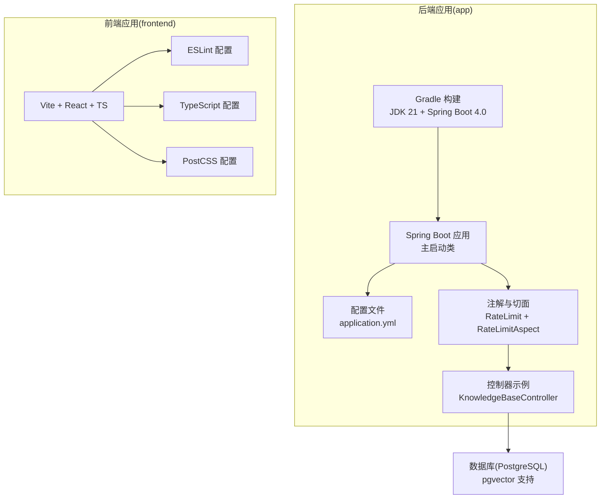
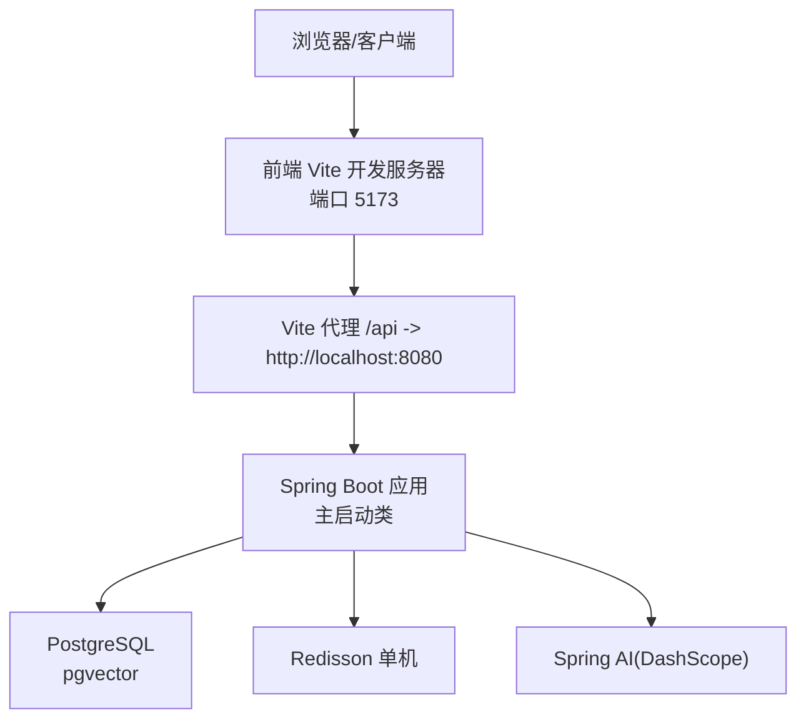
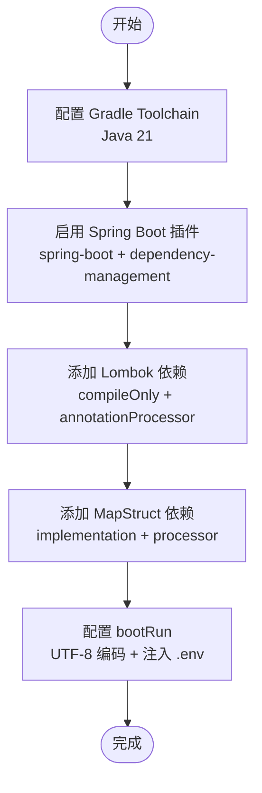
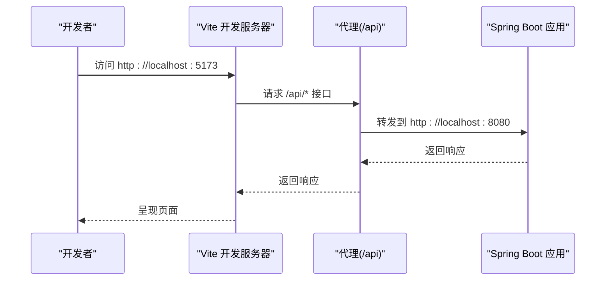
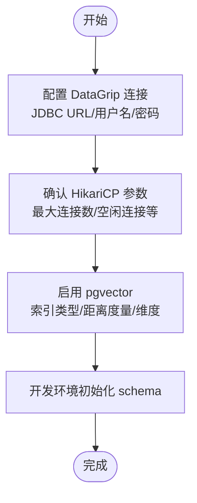
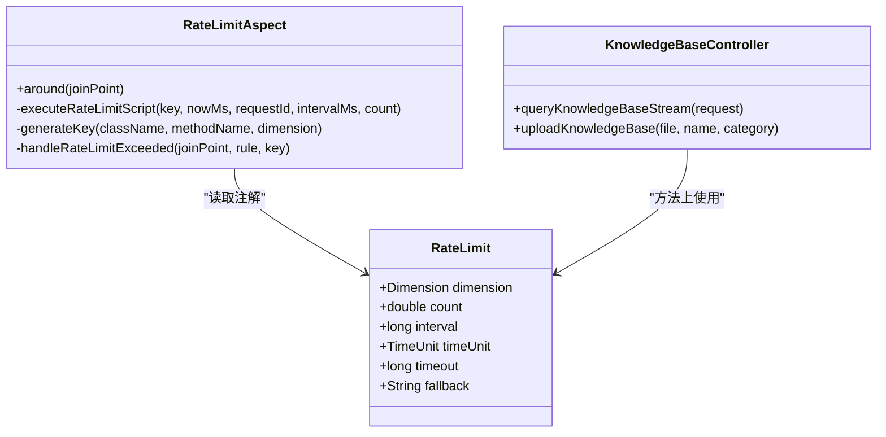
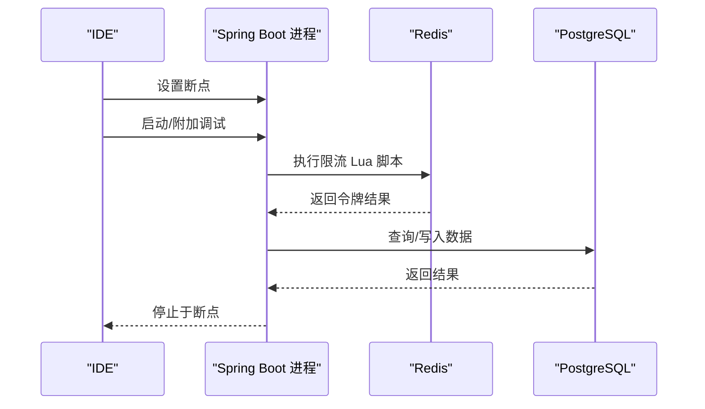
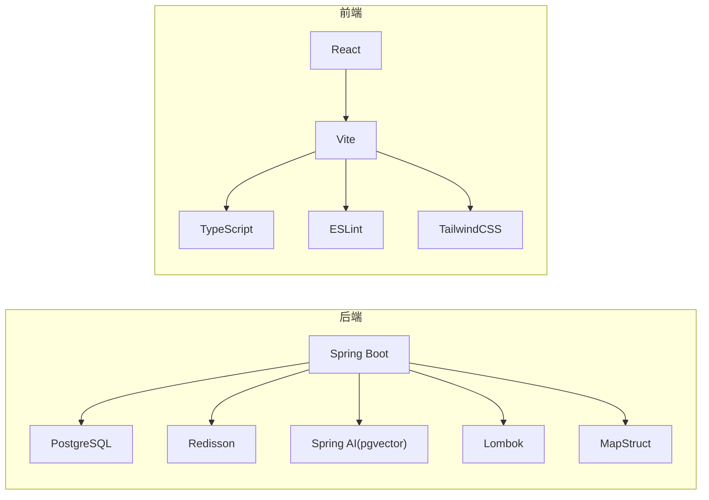

# IDE开发环境配置

<cite>
**本文引用的文件**
- [app/build.gradle](file://app/build.gradle)
- [gradle/libs.versions.toml](file://gradle/libs.versions.toml)
- [app/src/main/resources/application.yml](file://app/src/main/resources/application.yml)
- [app/src/main/java/interview/guide/App.java](file://app/src/main/java/interview/guide/App.java)
- [app/src/main/java/interview/guide/common/annotation/RateLimit.java](file://app/src/main/java/interview/guide/common/annotation/RateLimit.java)
- [app/src/main/java/interview/guide/common/aspect/RateLimitAspect.java](file://app/src/main/java/interview/guide/common/aspect/RateLimitAspect.java)
- [app/src/main/java/interview/guide/modules/knowledgebase/KnowledgeBaseController.java](file://app/src/main/java/interview/guide/modules/knowledgebase/KnowledgeBaseController.java)
- [frontend/package.json](file://frontend/package.json)
- [frontend/tsconfig.json](file://frontend/tsconfig.json)
- [frontend/eslint.config.js](file://frontend/eslint.config.js)
- [frontend/vite.config.ts](file://frontend/vite.config.ts)
- [frontend/postcss.config.js](file://frontend/postcss.config.js)
- [frontend/src/main.tsx](file://frontend/src/main.tsx)
</cite>

## 目录
1. [简介](#简介)
2. [项目结构](#项目结构)
3. [核心组件](#核心组件)
4. [架构总览](#架构总览)
5. [详细组件分析](#详细组件分析)
6. [依赖分析](#依赖分析)
7. [性能考虑](#性能考虑)
8. [故障排查指南](#故障排查指南)
9. [结论](#结论)
10. [附录](#附录)

## 简介
本指南面向面试指南平台的开发者，提供IDE开发环境配置的完整方案，覆盖以下方面：
- IntelliJ IDEA 与 VS Code 的通用配置建议（代码风格、自动导入、注解处理等）
- Java 开发环境配置（JDK 21、Spring Boot 插件、Lombok、MapStruct 等）
- TypeScript 前端开发环境配置（TS 插件、ESLint、Prettier、Vite）
- 数据库工具配置（DataGrip 连接 PostgreSQL、pgvector 插件）
- 代码模板与 Live Templates（常用代码片段、注释模板）
- 断点调试与远程调试（热部署、断点条件、日志级别）
- IDE 快捷键与项目视图设置（提升开发效率）

本指南基于仓库中的 Gradle 构建配置、Spring Boot 应用配置、TypeScript/Vite 前端配置以及注解与切面的实际实现，确保配置与项目真实需求一致。

## 项目结构
项目采用多模块结构：
- 后端应用位于 app/，使用 Gradle 构建，Spring Boot 4.0 + Java 21
- 前端位于 frontend/，使用 Vite + React + TypeScript
- 数据库初始化脚本位于 docker/postgres/init.sql（由 docker-compose 启动时使用）
- 测试资源位于 app/src/test/resources/application-test.yml

图表来源
- [app/build.gradle:1-136](file://app/build.gradle#L1-L136)
- [app/src/main/resources/application.yml:1-282](file://app/src/main/resources/application.yml#L1-L282)
- [app/src/main/java/interview/guide/App.java:1-19](file://app/src/main/java/interview/guide/App.java#L1-L19)
- [app/src/main/java/interview/guide/common/annotation/RateLimit.java:1-120](file://app/src/main/java/interview/guide/common/annotation/RateLimit.java#L1-L120)
- [app/src/main/java/interview/guide/common/aspect/RateLimitAspect.java:1-265](file://app/src/main/java/interview/guide/common/aspect/RateLimitAspect.java#L1-L265)
- [app/src/main/java/interview/guide/modules/knowledgebase/KnowledgeBaseController.java:1-211](file://app/src/main/java/interview/guide/modules/knowledgebase/KnowledgeBaseController.java#L1-L211)
- [frontend/package.json:1-47](file://frontend/package.json#L1-L47)
- [frontend/tsconfig.json:1-22](file://frontend/tsconfig.json#L1-L22)
- [frontend/eslint.config.js:1-24](file://frontend/eslint.config.js#L1-L24)
- [frontend/postcss.config.js:1-7](file://frontend/postcss.config.js#L1-L7)

章节来源
- [app/build.gradle:1-136](file://app/build.gradle#L1-L136)
- [frontend/package.json:1-47](file://frontend/package.json#L1-L47)

## 核心组件
- 后端构建与运行
  - Gradle 插件：java、spring-boot、spring-dependency-management
  - JDK 21 工具链
  - bootRun 注入 .env 环境变量，设置 UTF-8 编码
- Spring Boot 配置
  - 虚拟线程启用（I/O 密集场景）
  - PostgreSQL 数据源与 HikariCP 连接池
  - JPA/Hibernate 配置与 SQL 输出控制
  - Redisson 单机配置
  - Spring AI DashScope/OpenAI 兼容模式
  - pgvector 向量存储初始化
- 注解与切面
  - RateLimit 注解（方法级限流，支持可重复注解）
  - RateLimitAspect（Redis Lua 脚本令牌桶实现）
- 前端构建与开发
  - Vite + React + TypeScript
  - ESLint 平台化配置
  - PostCSS + TailwindCSS
  - 代理到后端 8080 端口

章节来源
- [app/build.gradle:89-136](file://app/build.gradle#L89-L136)
- [app/src/main/resources/application.yml:42-124](file://app/src/main/resources/application.yml#L42-L124)
- [app/src/main/java/interview/guide/common/annotation/RateLimit.java:27-120](file://app/src/main/java/interview/guide/common/annotation/RateLimit.java#L27-L120)
- [app/src/main/java/interview/guide/common/aspect/RateLimitAspect.java:35-265](file://app/src/main/java/interview/guide/common/aspect/RateLimitAspect.java#L35-L265)
- [frontend/tsconfig.json:1-22](file://frontend/tsconfig.json#L1-L22)
- [frontend/eslint.config.js:1-24](file://frontend/eslint.config.js#L1-L24)
- [frontend/vite.config.ts:1-42](file://frontend/vite.config.ts#L1-L42)

## 架构总览
后端采用 Spring MVC + WebFlux（响应式）结合注解驱动的限流切面，前端通过 Vite 提供开发服务器并代理到后端。数据库使用 PostgreSQL，配合 pgvector 实现向量检索。

图表来源
- [frontend/vite.config.ts:24-37](file://frontend/vite.config.ts#L24-L37)
- [app/src/main/resources/application.yml:48-98](file://app/src/main/resources/application.yml#L48-L98)
- [app/src/main/java/interview/guide/App.java:11-18](file://app/src/main/java/interview/guide/App.java#L11-L18)

## 详细组件分析

### Java 开发环境配置（JDK 21、Spring Boot、Lombok、MapStruct）
- JDK 与工具链
  - 使用 Gradle Toolchain 指定语言版本为 21，确保编译与运行一致性
  - bootRun 任务设置 UTF-8 编码，避免控制台与日志乱码
- Spring Boot 插件
  - spring-boot 与 spring-dependency-management 插件组合，统一版本与模块化依赖
- Lombok 与 MapStruct
  - Lombok 注解处理器与 MapStruct 注解处理器均启用，且 Lombok MapStruct 绑定已配置
- 依赖版本管理
  - 通过 libs.versions.toml 统一管理版本号，便于升级与维护

图表来源
- [app/build.gradle:89-93](file://app/build.gradle#L89-L93)
- [app/build.gradle:74-81](file://app/build.gradle#L74-L81)
- [app/build.gradle:106-135](file://app/build.gradle#L106-L135)
- [gradle/libs.versions.toml:17-29](file://gradle/libs.versions.toml#L17-L29)

章节来源
- [app/build.gradle:89-136](file://app/build.gradle#L89-L136)
- [gradle/libs.versions.toml:1-30](file://gradle/libs.versions.toml#L1-L30)

### TypeScript 开发环境配置（TS、ESLint、Prettier、Vite）
- TypeScript
  - tsconfig.json 启用严格模式、模块解析为 bundler、JSX 使用 react-jsx
- ESLint
  - flat config 集成 @eslint/js、typescript-eslint、react-hooks、react-refresh
  - 针对 ts/tsx 文件扩展推荐规则
- Vite
  - dev 服务监听 0.0.0.0，端口 5173，代理 /api 到后端 8080
  - 依赖分包策略与 wasm/top-level-await 插件
- PostCSS
  - 集成 @tailwindcss/postcss 与 autoprefixer

图表来源
- [frontend/vite.config.ts:24-37](file://frontend/vite.config.ts#L24-L37)
- [frontend/eslint.config.js:8-23](file://frontend/eslint.config.js#L8-L23)
- [frontend/tsconfig.json:2-18](file://frontend/tsconfig.json#L2-L18)
- [frontend/postcss.config.js:1-7](file://frontend/postcss.config.js#L1-L7)

章节来源
- [frontend/package.json:1-47](file://frontend/package.json#L1-L47)
- [frontend/tsconfig.json:1-22](file://frontend/tsconfig.json#L1-L22)
- [frontend/eslint.config.js:1-24](file://frontend/eslint.config.js#L1-L24)
- [frontend/vite.config.ts:1-42](file://frontend/vite.config.ts#L1-L42)
- [frontend/postcss.config.js:1-7](file://frontend/postcss.config.js#L1-L7)

### 数据库工具配置（DataGrip 连接 PostgreSQL、pgvector）
- 连接配置
  - JDBC URL、用户名、密码、驱动类名来自 application.yml
  - HikariCP 连接池参数已在配置中明确
- pgvector 插件
  - application.yml 中启用 pgvector 向量存储，并设置索引类型、距离度量与维度
  - 开发环境初始化 schema，生产环境建议关闭自动初始化

图表来源
- [app/src/main/resources/application.yml:48-61](file://app/src/main/resources/application.yml#L48-L61)
- [app/src/main/resources/application.yml:116-124](file://app/src/main/resources/application.yml#L116-L124)

章节来源
- [app/src/main/resources/application.yml:48-124](file://app/src/main/resources/application.yml#L48-L124)

### 代码模板与 Live Templates（注解、切面、控制器示例）
- 注解模板
  - RateLimit 注解定义了维度、计数、时间窗口、超时与降级方法等属性
- 切面模板
  - RateLimitAspect 使用 Redis Lua 脚本实现令牌桶限流，支持全局/IP/用户维度
- 控制器模板
  - KnowledgeBaseController 展示了 @RateLimit 注解在控制器方法上的使用方式

图表来源
- [app/src/main/java/interview/guide/common/annotation/RateLimit.java:30-120](file://app/src/main/java/interview/guide/common/annotation/RateLimit.java#L30-L120)
- [app/src/main/java/interview/guide/common/aspect/RateLimitAspect.java:66-90](file://app/src/main/java/interview/guide/common/aspect/RateLimitAspect.java#L66-L90)
- [app/src/main/java/interview/guide/modules/knowledgebase/KnowledgeBaseController.java:86-103](file://app/src/main/java/interview/guide/modules/knowledgebase/KnowledgeBaseController.java#L86-L103)

章节来源
- [app/src/main/java/interview/guide/common/annotation/RateLimit.java:1-120](file://app/src/main/java/interview/guide/common/annotation/RateLimit.java#L1-L120)
- [app/src/main/java/interview/guide/common/aspect/RateLimitAspect.java:1-265](file://app/src/main/java/interview/guide/common/aspect/RateLimitAspect.java#L1-L265)
- [app/src/main/java/interview/guide/modules/knowledgebase/KnowledgeBaseController.java:1-211](file://app/src/main/java/interview/guide/modules/knowledgebase/KnowledgeBaseController.java#L1-L211)

### 断点调试与远程调试（热部署、断点条件）
- 本地调试
  - 使用 bootRun 启动应用，可在 IDE 中设置断点
  - application.yml 中开启虚拟线程，注意断点在 I/O 密集场景下的线程切换
- 远程调试
  - 通过 IDE 远程调试配置连接后端进程（端口 8080）
  - 断点条件建议结合 @RateLimit 注解的维度（全局/IP/用户）进行过滤
- 热部署
  - 建议使用 Spring Boot DevTools（在测试环境中启用），以减少重启成本
  - 前端使用 Vite 的热更新，无需额外配置

图表来源
- [app/src/main/resources/application.yml:42-46](file://app/src/main/resources/application.yml#L42-L46)
- [app/src/main/java/interview/guide/common/aspect/RateLimitAspect.java:102-126](file://app/src/main/java/interview/guide/common/aspect/RateLimitAspect.java#L102-L126)

章节来源
- [app/src/main/resources/application.yml:42-124](file://app/src/main/resources/application.yml#L42-L124)
- [app/src/main/java/interview/guide/common/aspect/RateLimitAspect.java:1-265](file://app/src/main/java/interview/guide/common/aspect/RateLimitAspect.java#L1-L265)

### IDE 快捷键与项目视图设置（提升效率）
- IntelliJ IDEA
  - 代码风格：使用 Project Defaults 的 Code Style，统一缩进与换行
  - 自动导入：启用 Optimize Imports 与 Add unambiguous imports on the fly
  - 注解处理：确保 Lombok 与 MapStruct 注解处理器已启用
  - 项目视图：使用 Package 视图聚焦模块与包结构，必要时切换到 Project 视图查看资源
- VS Code
  - 扩展：安装 ESLint、Prettier、Tailwind CSS IntelliSense、ES7+ React/Redux Snippets
  - 快捷键：自定义常用快捷键（如保存格式化、打开终端、切换侧边栏）
  - 项目视图：使用资源管理器聚焦 src 目录，配合搜索快速定位文件

## 依赖分析
- 后端依赖
  - Spring Boot Starter（WebMVC、Validation、Data JPA、WebSocket）
  - PostgreSQL 驱动与 H2 测试数据库
  - Spring AI（OpenAI 兼容模式）与 pgvector 向量存储
  - Redisson 客户端
  - Lombok 与 MapStruct
  - SpringDoc OpenAPI
- 前端依赖
  - React、React Router、Axios、Framer Motion、Lucide React、Recharts
  - Vite、TypeScript、TailwindCSS、ESLint、PostCSS

图表来源
- [app/build.gradle:23-87](file://app/build.gradle#L23-L87)
- [frontend/package.json:11-44](file://frontend/package.json#L11-L44)

章节来源
- [app/build.gradle:1-136](file://app/build.gradle#L1-L136)
- [frontend/package.json:1-47](file://frontend/package.json#L1-L47)

## 性能考虑
- 虚拟线程
  - application.yml 启用虚拟线程，适合高并发 I/O 场景（如 AI 调用与 SSE）
- 连接池
  - HikariCP 参数针对虚拟线程场景优化，避免过大连接池导致上下文切换开销
- 批量与排序
  - Hibernate 批量插入/更新顺序优化，降低数据库压力
- 前端打包
  - Vite 通过 manualChunks 将第三方库拆分为独立 chunk，提升缓存命中率

章节来源
- [app/src/main/resources/application.yml:42-78](file://app/src/main/resources/application.yml#L42-L78)
- [frontend/vite.config.ts:13-23](file://frontend/vite.config.ts#L13-L23)

## 故障排查指南
- 启动失败（JDK 版本）
  - 确认 IDE 使用 JDK 21，Gradle Toolchain 已生效
- 编码问题（控制台/日志乱码）
  - bootRun 已设置 UTF-8 编码，检查 IDE 控制台编码设置
- 限流异常
  - Redis 重启后脚本缓存丢失会自动重载，若仍失败，检查 Redis 连接与权限
- 前端代理失败
  - 确认 Vite 代理配置指向后端 8080 端口，浏览器访问 5173 端口
- 数据库连接失败
  - 检查 application.yml 中的 POSTGRES_* 环境变量或 .env 注入情况

章节来源
- [app/build.gradle:106-135](file://app/build.gradle#L106-L135)
- [app/src/main/resources/application.yml:48-61](file://app/src/main/resources/application.yml#L48-L61)
- [frontend/vite.config.ts:24-37](file://frontend/vite.config.ts#L24-L37)
- [app/src/main/java/interview/guide/common/aspect/RateLimitAspect.java:111-126](file://app/src/main/java/interview/guide/common/aspect/RateLimitAspect.java#L111-L126)

## 结论
本指南提供了从工具链到运行时的全栈 IDE 配置建议，结合项目实际的注解与切面、数据库与向量存储、前端构建与代理，帮助开发者快速搭建高效、稳定的开发环境。建议在团队内统一代码风格与注解处理流程，持续优化热部署与调试体验。

## 附录
- 启动与运行
  - 后端：使用 bootRun 启动，或通过 IDE 运行主类
  - 前端：使用 npm/pnpm/yarn 运行 dev 脚本，访问 http://localhost:5173
- 环境变量
  - .env 文件会被 bootRun 注入，包含 AI 与数据库相关密钥与主机信息
- 日志与编码
  - application.yml 明确设置控制台与文件编码为 UTF-8，避免中文显示问题

章节来源
- [app/src/main/java/interview/guide/App.java:15-18](file://app/src/main/java/interview/guide/App.java#L15-L18)
- [app/build.gradle:106-135](file://app/build.gradle#L106-L135)
- [app/src/main/resources/application.yml:4-24](file://app/src/main/resources/application.yml#L4-L24)
- [frontend/src/main.tsx:6-14](file://frontend/src/main.tsx#L6-L14)