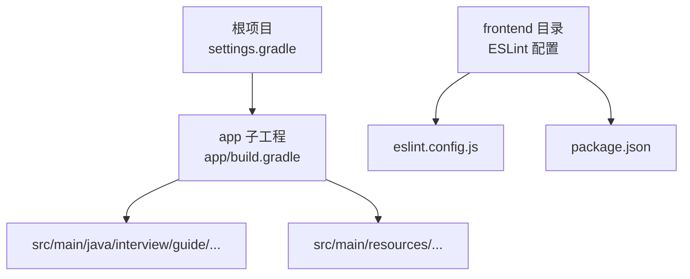
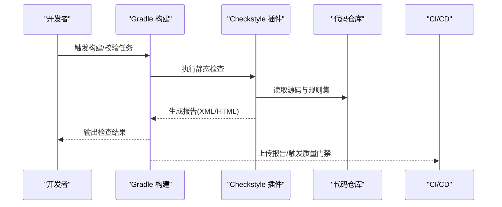
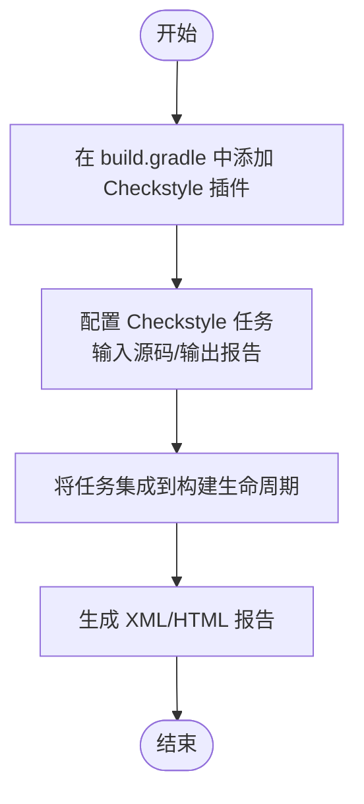
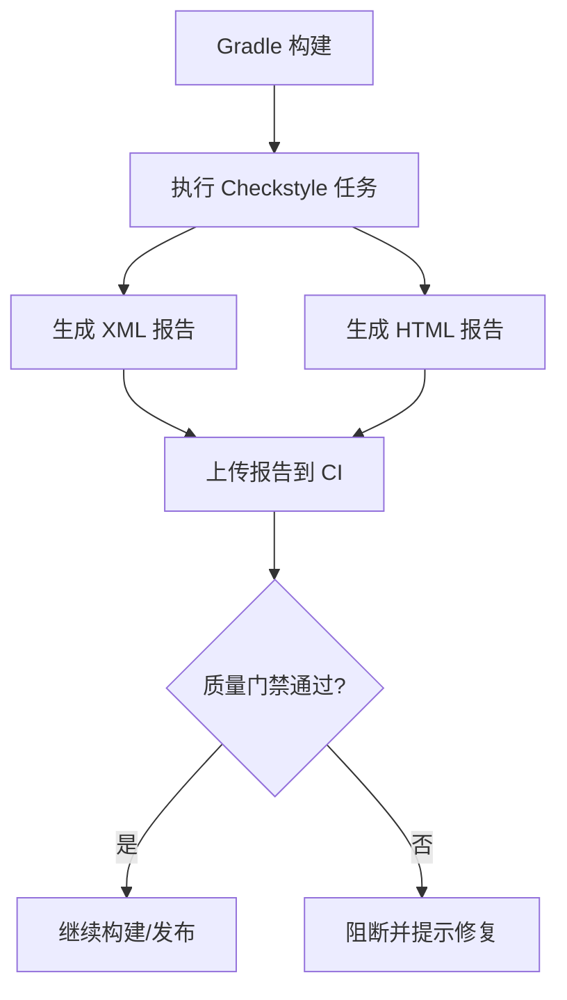
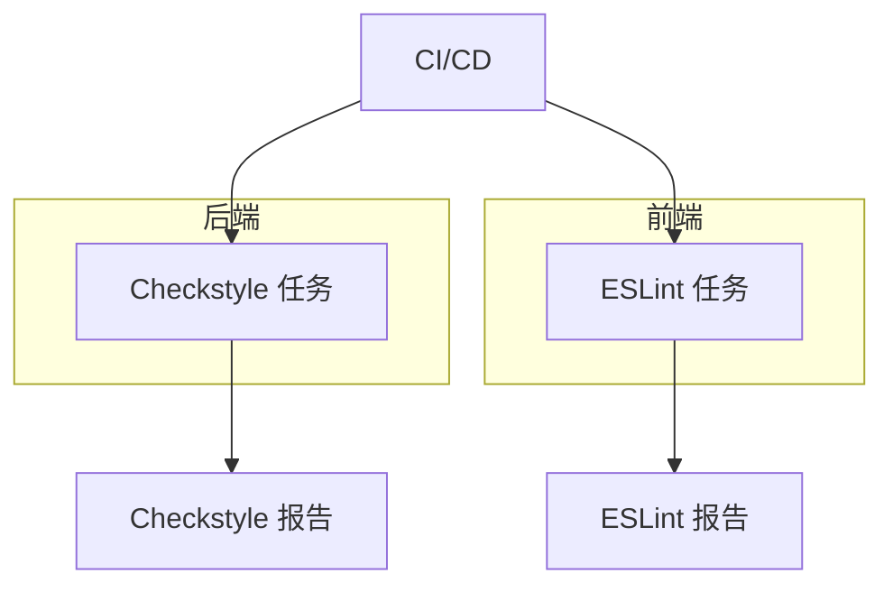
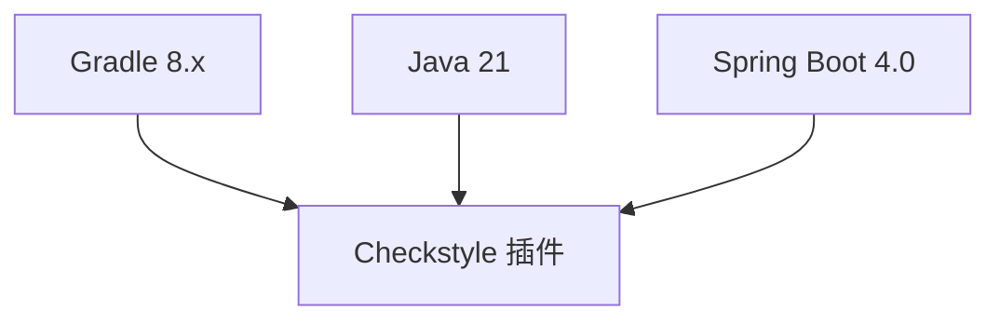

# Checkstyle静态代码分析

<cite>
**本文引用的文件**
- [app/build.gradle](file://app/build.gradle)
- [settings.gradle](file://settings.gradle)
- [gradle/libs.versions.toml](file://gradle/libs.versions.toml)
- [README.md](file://README.md)
- [frontend/eslint.config.js](file://frontend/eslint.config.js)
- [frontend/package.json](file://frontend/package.json)
</cite>

## 目录
1. [简介](#简介)
2. [项目结构](#项目结构)
3. [核心组件](#核心组件)
4. [架构概览](#架构概览)
5. [详细组件分析](#详细组件分析)
6. [依赖分析](#依赖分析)
7. [性能考虑](#性能考虑)
8. [故障排查指南](#故障排查指南)
9. [结论](#结论)
10. [附录](#附录)

## 简介
本文件面向面试指南平台后端（Spring Boot 4.0 + Java 21）的代码质量保障，提供Checkstyle静态代码分析的配置与集成实践文档。内容涵盖：
- 在build.gradle中配置Checkstyle插件与任务
- checkstyle.xml规则集的落地方式与扩展建议
- Java代码规范检查规则（命名、复杂度、注释等）的配置要点
- 自定义规则集的创建与维护
- 生成Checkstyle报告与集成到构建流程
- 与前端ESLint格式化工具的协调使用

本项目当前未在Gradle中启用Checkstyle插件，本文提供从零到一的完整落地步骤，帮助团队建立可持续的代码质量门禁。

## 项目结构
后端位于app子工程，采用标准src/main/java布局；前端位于frontend目录，使用ESLint进行JavaScript/TypeScript代码质量检查。Checkstyle应作为后端构建流程的一部分，与测试、编译等生命周期任务协同。

图表来源
- [settings.gradle:1-24](file://settings.gradle#L1-L24)
- [app/build.gradle:1-136](file://app/build.gradle#L1-L136)
- [frontend/eslint.config.js:1-24](file://frontend/eslint.config.js#L1-L24)
- [frontend/package.json:1-47](file://frontend/package.json#L1-L47)

章节来源
- [settings.gradle:1-24](file://settings.gradle#L1-L24)
- [app/build.gradle:1-136](file://app/build.gradle#L1-L136)
- [README.md:210-247](file://README.md#L210-L247)

## 核心组件
- Gradle构建脚本：app/build.gradle负责依赖、Java工具链、编码与测试配置
- 依赖管理：gradle/libs.versions.toml集中声明版本与库坐标
- 规则集落地：通过checkstyle.xml文件定义规则，或在Gradle中内联规则
- 报告生成：Checkstyle任务输出XML/HTML报告，可集成CI质量门禁
- 前端ESLint：与Checkstyle形成前后端互补的质量体系

章节来源
- [app/build.gradle:89-102](file://app/build.gradle#L89-L102)
- [gradle/libs.versions.toml:1-30](file://gradle/libs.versions.toml#L1-L30)

## 架构概览
Checkstyle在构建流程中的位置如下：

图表来源
- [app/build.gradle:1-136](file://app/build.gradle#L1-L136)

## 详细组件分析

### Gradle中配置Checkstyle插件
- 在app/build.gradle中添加Checkstyle插件与任务
- 将check任务加入构建生命周期（例如与test并行或在check阶段执行）
- 配置输入源码目录与输出报告目录
- 可选：将Checkstyle任务与CI质量门禁结合（如仅在PR或发布分支执行）

图表来源
- [app/build.gradle:1-136](file://app/build.gradle#L1-L136)

章节来源
- [app/build.gradle:1-136](file://app/build.gradle#L1-L136)

### checkstyle.xml规则集配置
规则集可通过两种方式落地：
- 外部文件：在项目根目录或app目录下放置checkstyle.xml，Gradle任务指向该文件
- 内联规则：在Gradle中直接定义规则（适合简单规则或临时定制）

常用规则类别建议：
- 命名规范：类名、接口名、方法名、字段名、常量名遵循Java命名约定
- 代码复杂度：圈复杂度、方法长度、类大小限制
- 注释要求：类/接口/公共方法/构造函数注释、TODO注释检查
- 空白与缩进：Tab/空格使用、行宽、空行策略
- 导入与包：导入顺序、避免使用通配符、包名规范
- 其他：避免魔法数、冗余代码、过时API

章节来源
- [app/build.gradle:1-136](file://app/build.gradle#L1-L136)

### 自定义规则集创建
- 基于官方规则集（google、sun）进行扩展
- 新增规则时保持与团队代码风格一致，避免过度严格导致维护成本上升
- 将规则集纳入版本控制，配合Gradle任务自动化执行
- 为规则集编写变更说明，便于团队沟通与审计

章节来源
- [app/build.gradle:1-136](file://app/build.gradle#L1-L136)

### 生成报告与集成构建流程
- 报告类型：XML（便于CI解析）与HTML（便于人工审阅）
- 输出目录：建议放在build/reports/checkstyle/下，便于归档与上传
- 集成方式：在CI中将报告上传Artifacts，或使用质量门禁阻止违规合并
- 执行时机：可在test之前执行，或独立任务在PR检查阶段运行

图表来源
- [app/build.gradle:1-136](file://app/build.gradle#L1-L136)

章节来源
- [app/build.gradle:1-136](file://app/build.gradle#L1-L136)

### 与Spotless格式化工具的协调
- Spotless负责格式化（缩进、空白、导入排序等），Checkstyle负责规范性检查（命名、复杂度、注释等）
- 建议先执行Spotless格式化，再执行Checkstyle检查，保证格式统一后再做规范性校验
- 若两者冲突，优先以Checkstyle规则为准（格式化由Spotless完成，规范性由Checkstyle约束）

章节来源
- [app/build.gradle:1-136](file://app/build.gradle#L1-L136)

### 与前端ESLint的协调使用
- 前端使用ESLint进行JavaScript/TypeScript质量检查，后端使用Checkstyle进行Java代码规范检查
- 建议在CI中分别执行ESLint与Checkstyle，分别产出报告并进行质量门禁
- 通过统一的CI矩阵或质量门禁策略，确保前后端代码质量标准一致

图表来源
- [frontend/eslint.config.js:1-24](file://frontend/eslint.config.js#L1-L24)
- [frontend/package.json:1-47](file://frontend/package.json#L1-L47)

章节来源
- [frontend/eslint.config.js:1-24](file://frontend/eslint.config.js#L1-L24)
- [frontend/package.json:1-47](file://frontend/package.json#L1-L47)

## 依赖分析
- Gradle版本：项目使用Gradle 8.x，Checkstyle插件与任务需与之兼容
- Java版本：Java 21，规则集需符合现代Java语法与最佳实践
- Spring Boot 4.0：与Checkstyle无直接耦合，但需确保扫描的源码包含Spring相关注解与配置类

图表来源
- [app/build.gradle:89-93](file://app/build.gradle#L89-L93)
- [gradle/libs.versions.toml:1-30](file://gradle/libs.versions.toml#L1-L30)

章节来源
- [app/build.gradle:89-93](file://app/build.gradle#L89-L93)
- [gradle/libs.versions.toml:1-30](file://gradle/libs.versions.toml#L1-L30)

## 性能考虑
- 规则集规模：初期采用轻量规则集，逐步扩展，避免检查时间过长影响开发效率
- 并行执行：将Checkstyle与Spotless、测试等任务并行执行，缩短总构建时间
- 缓存与增量：合理配置任务缓存，减少重复检查成本
- CI优化：仅在PR与关键分支执行全面检查，日常提交执行轻量规则集

## 故障排查指南
- 规则集未生效
  - 检查Gradle任务是否正确指向checkstyle.xml或内联规则
  - 确认任务输入源码目录包含实际代码
- 报告缺失
  - 检查输出目录权限与路径
  - 确认任务未被跳过（例如在某些配置中被禁用）
- 规则冲突
  - Spotless格式化与Checkstyle规范冲突时，优先以Checkstyle为准
  - 通过调整规则集或格式化配置解决冲突
- CI集成失败
  - 确认CI中上传报告与质量门禁逻辑正确
  - 检查报告格式与解析器匹配

章节来源
- [app/build.gradle:1-136](file://app/build.gradle#L1-L136)

## 结论
通过在Gradle中配置Checkstyle插件、制定合理的规则集、生成并集成报告，面试指南平台可以在构建流程中建立稳定的Java代码质量门禁。结合Spotless格式化与前端ESLint，形成前后端一体化的质量保障体系，持续提升代码一致性与可维护性。

## 附录
- 规则集建议清单（按类别）
  - 命名规范：类名、接口名、方法名、字段名、常量名
  - 代码复杂度：圈复杂度、方法长度、类大小
  - 注释要求：类/接口/公共方法/构造函数注释
  - 空白与缩进：Tab/空格使用、行宽、空行策略
  - 导入与包：导入顺序、避免使用通配符、包名规范
  - 其他：避免魔法数、冗余代码、过时API