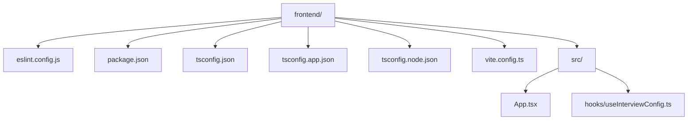
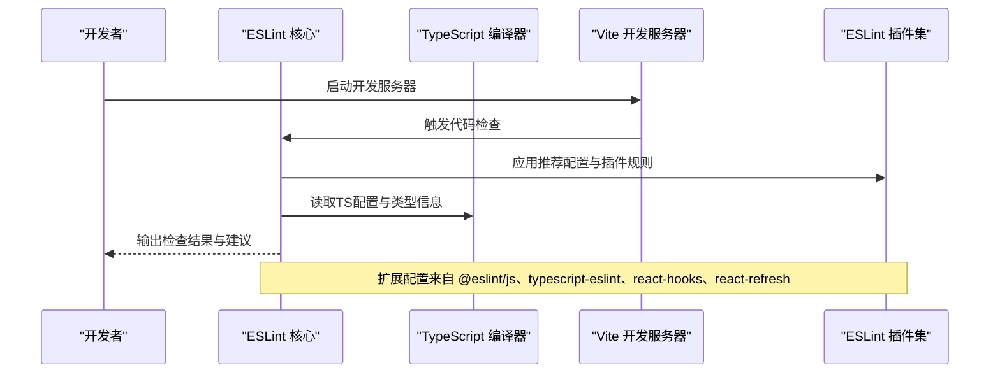
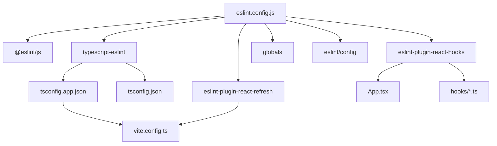

# ESLint配置

<cite>
**本文引用的文件**
- [eslint.config.js](file://frontend/eslint.config.js)
- [package.json](file://frontend/package.json)
- [tsconfig.json](file://frontend/tsconfig.json)
- [tsconfig.app.json](file://frontend/tsconfig.app.json)
- [tsconfig.node.json](file://frontend/tsconfig.node.json)
- [vite.config.ts](file://frontend/vite.config.ts)
- [App.tsx](file://frontend/src/App.tsx)
- [useInterviewConfig.ts](file://frontend/src/hooks/useInterviewConfig.ts)
</cite>

## 目录
1. [简介](#简介)
2. [项目结构](#项目结构)
3. [核心组件](#核心组件)
4. [架构总览](#架构总览)
5. [详细组件分析](#详细组件分析)
6. [依赖关系分析](#依赖关系分析)
7. [性能考量](#性能考量)
8. [故障排查指南](#故障排查指南)
9. [结论](#结论)
10. [附录](#附录)

## 简介
本文件面向面试指南前端团队，系统化解读并实操ESLint配置，重点围绕ESLint配置文件eslint.config.js展开，逐项解析其结构与各配置项的作用，涵盖：
- extends数组中的推荐配置来源与作用
- languageOptions的设置与浏览器全局变量的使用
- TypeScript ESLint插件的集成方式与typescript-eslint.configs.recommended
- React Hooks与React Refresh插件的配置与作用
- 自定义规则的添加方法与最佳实践
- 常见ESLint错误的解决方案与调试技巧

## 项目结构
前端工程采用Vite + React + TypeScript技术栈，ESLint配置位于frontend目录下，配合TypeScript编译配置与Vite构建配置共同保障代码质量与开发体验。

图表来源
- [eslint.config.js:1-24](file://frontend/eslint.config.js#L1-L24)
- [package.json:1-47](file://frontend/package.json#L1-L47)
- [tsconfig.json:1-22](file://frontend/tsconfig.json#L1-L22)
- [tsconfig.app.json:1-29](file://frontend/tsconfig.app.json#L1-L29)
- [tsconfig.node.json:1-11](file://frontend/tsconfig.node.json#L1-L11)
- [vite.config.ts:1-42](file://frontend/vite.config.ts#L1-L42)
- [App.tsx:1-379](file://frontend/src/App.tsx#L1-L379)
- [useInterviewConfig.ts:1-152](file://frontend/src/hooks/useInterviewConfig.ts#L1-L152)

章节来源
- [eslint.config.js:1-24](file://frontend/eslint.config.js#L1-L24)
- [package.json:1-47](file://frontend/package.json#L1-L47)

## 核心组件
本节聚焦eslint.config.js的核心结构与关键配置项，帮助快速理解整体策略与落地细节。

- 全局忽略
  - 使用globalIgnores排除打包输出目录，避免对dist进行扫描与检查，提升性能与避免误报。
- 文件匹配
  - 通过files字段限定仅对TypeScript与TSX文件生效，确保规则范围明确且可维护。
- 推荐配置扩展
  - 继承官方推荐配置，统一基础规范，减少重复配置与分歧。
- 语言选项
  - 设置ECMAScript版本与浏览器全局变量，使规则在现代浏览器环境下正确识别API与特性。
- 插件集成
  - 引入React Hooks与React Refresh插件，并按Vite场景应用相应配置，强化React生态下的静态检查能力。

章节来源
- [eslint.config.js:8-23](file://frontend/eslint.config.js#L8-L23)

## 架构总览
ESLint配置与TypeScript、Vite及React生态的协同工作流程如下：

图表来源
- [eslint.config.js:1-24](file://frontend/eslint.config.js#L1-L24)
- [tsconfig.json:1-22](file://frontend/tsconfig.json#L1-L22)
- [vite.config.ts:1-42](file://frontend/vite.config.ts#L1-L42)

## 详细组件分析

### ESLint配置文件结构与规则来源
- 导入与导出
  - 导入基础JS规则、浏览器全局、React Hooks与React Refresh插件，以及TypeScript ESLint工具集；通过defineConfig统一导出配置数组。
- 全局忽略
  - 使用globalIgnores排除dist目录，避免对构建产物进行检查。
- 文件范围
  - 通过files限定对TypeScript与TSX文件生效，兼顾类型安全与React组件检查。
- 推荐配置扩展
  - 继承@eslint/js的recommended、typescript-eslint的recommended、react-hooks的flat推荐、react-refresh的vite配置，形成覆盖基础语法、TypeScript、React Hooks与热更新场景的规则矩阵。
- 语言选项
  - 设置ecmaVersion为2020，globals为browser，确保规则在现代浏览器API与特性上正确判断。
- 插件作用
  - React Hooks：提供对Hook调用规则、依赖数组等的静态检查。
  - React Refresh：针对Vite环境的React组件热更新进行规则适配，避免不必要的刷新与错误提示。

章节来源
- [eslint.config.js:1-24](file://frontend/eslint.config.js#L1-L24)

### TypeScript ESLint插件集成
- 工具集导入
  - 通过import tseslint引入typescript-eslint工具集，用于桥接TypeScript类型系统与ESLint规则引擎。
- 推荐配置
  - 使用typescript-eslint.configs.recommended，启用与TypeScript强类型特性相匹配的规则集合，如未使用变量、未使用参数、严格模式等。
- 与TS编译配置的关系
  - tsconfig.json与tsconfig.app.json中的严格选项与无副作用导入等设置，与ESLint规则形成互补，共同提升代码质量与可维护性。

章节来源
- [eslint.config.js:1-6](file://frontend/eslint.config.js#L1-L6)
- [tsconfig.json:2-17](file://frontend/tsconfig.json#L2-L17)
- [tsconfig.app.json:2-25](file://frontend/tsconfig.app.json#L2-L25)

### React Hooks与React Refresh插件配置
- React Hooks
  - 通过reactHooks.configs.flat.recommended启用对Hook使用规范的检查，例如依赖数组完整性、Hook调用顺序等。
- React Refresh
  - 通过reactRefresh.configs.vite适配Vite的HMR机制，避免因热更新导致的规则误报与不必要警告。
- 实际影响
  - 在App.tsx与自定义Hook（如useInterviewConfig.ts）中，ESLint将依据上述规则进行静态检查，帮助发现潜在问题。

章节来源
- [eslint.config.js:3-5](file://frontend/eslint.config.js#L3-L5)
- [App.tsx:1-379](file://frontend/src/App.tsx#L1-L379)
- [useInterviewConfig.ts:1-152](file://frontend/src/hooks/useInterviewConfig.ts#L1-L152)

### 自定义规则与最佳实践
- 添加自定义规则
  - 在exports default返回的配置数组中新增规则对象，设置files匹配范围与rules键值对，即可为特定文件类型或路径添加定制化规则。
- 最佳实践
  - 将自定义规则与现有推荐配置分层管理，避免直接覆盖官方推荐；优先通过overrides或单独配置段落进行补充。
  - 对于React相关规则，结合react-refresh的vite配置，确保热更新场景下的规则一致性。
  - 与TypeScript配置保持一致的严格级别，减少类型相关误报与漏报。

章节来源
- [eslint.config.js:8-23](file://frontend/eslint.config.js#L8-L23)

### 与Vite与TypeScript配置的协同
- Vite配置
  - vite.config.ts中启用react插件与WASM、Top-Level Await等插件，与react-refresh规则协同，确保开发体验与规则检查一致。
- TypeScript配置
  - tsconfig.json与tsconfig.app.json的严格选项与模块解析策略，为ESLint提供准确的类型信息与模块边界，提升规则判断准确性。

章节来源
- [vite.config.ts:1-42](file://frontend/vite.config.ts#L1-L42)
- [tsconfig.json:1-22](file://frontend/tsconfig.json#L1-L22)
- [tsconfig.app.json:1-29](file://frontend/tsconfig.app.json#L1-L29)

## 依赖关系分析
ESLint配置与项目关键文件的依赖关系如下：

图表来源
- [eslint.config.js:1-6](file://frontend/eslint.config.js#L1-L6)
- [tsconfig.json:1-22](file://frontend/tsconfig.json#L1-L22)
- [tsconfig.app.json:1-29](file://frontend/tsconfig.app.json#L1-L29)
- [vite.config.ts:1-42](file://frontend/vite.config.ts#L1-L42)
- [App.tsx:1-379](file://frontend/src/App.tsx#L1-L379)
- [useInterviewConfig.ts:1-152](file://frontend/src/hooks/useInterviewConfig.ts#L1-L152)

章节来源
- [eslint.config.js:1-24](file://frontend/eslint.config.js#L1-L24)
- [package.json:29-44](file://frontend/package.json#L29-L44)

## 性能考量
- 文件范围控制
  - 通过files精确限定TypeScript与TSX文件，避免对非目标文件执行检查，降低开销。
- 全局忽略
  - 使用globalIgnores排除dist等构建产物目录，减少不必要的扫描与I/O。
- 规则粒度
  - 优先采用推荐配置，减少自定义规则数量；必要时拆分规则段落，按需启用，避免过度检查。
- 类型信息利用
  - 与TypeScript严格配置协同，减少因类型缺失导致的规则误判与回退检查。

## 故障排查指南
- 常见错误与定位
  - 依赖数组不完整：在React Hook使用场景中，ESLint会基于react-hooks规则进行检查。若出现相关报错，应检查依赖数组是否包含所有外部引用。
  - 浏览器API未识别：若使用了浏览器API但未声明globals，ESLint可能将其视为未定义变量。可通过languageOptions.globals.browser启用浏览器全局。
  - 热更新冲突：在Vite环境中，react-refresh规则与HMR相关。若出现不一致提示，确认已应用react-refresh的vite配置。
  - TypeScript类型错误：当TypeScript编译配置与ESLint规则不一致时，可能出现类型相关误报。应统一严格级别与模块解析策略。
- 调试技巧
  - 使用命令行参数或IDE扩展的“显示规则来源”功能，定位具体规则来源与配置段落。
  - 临时禁用特定规则进行对比测试，确认问题是否由该规则引起。
  - 在eslint.config.js中增加局部overrides，缩小规则影响范围，便于逐步排查。

章节来源
- [eslint.config.js:18-21](file://frontend/eslint.config.js#L18-L21)
- [useInterviewConfig.ts:119-121](file://frontend/src/hooks/useInterviewConfig.ts#L119-L121)

## 结论
本ESLint配置以推荐规则为基础，结合TypeScript与React生态的最佳实践，形成覆盖基础语法、类型安全、Hook使用与热更新场景的规则体系。通过精确的文件范围与全局忽略策略，既保证了检查的全面性，又兼顾了性能与开发体验。建议在后续迭代中持续关注规则演进，按需补充自定义规则，并与TypeScript与Vite配置保持一致，以实现高质量的前端工程化实践。

## 附录
- 相关配置文件清单
  - eslint.config.js：ESLint核心配置
  - package.json：开发依赖与脚本
  - tsconfig.json/tsconfig.app.json/tsconfig.node.json：TypeScript编译配置
  - vite.config.ts：Vite构建与插件配置
  - src/App.tsx与src/hooks/useInterviewConfig.ts：React组件与Hook示例

章节来源
- [package.json:29-44](file://frontend/package.json#L29-L44)
- [tsconfig.json:1-22](file://frontend/tsconfig.json#L1-L22)
- [tsconfig.app.json:1-29](file://frontend/tsconfig.app.json#L1-L29)
- [tsconfig.node.json:1-11](file://frontend/tsconfig.node.json#L1-L11)
- [vite.config.ts:1-42](file://frontend/vite.config.ts#L1-L42)
- [App.tsx:1-379](file://frontend/src/App.tsx#L1-L379)
- [useInterviewConfig.ts:1-152](file://frontend/src/hooks/useInterviewConfig.ts#L1-L152)