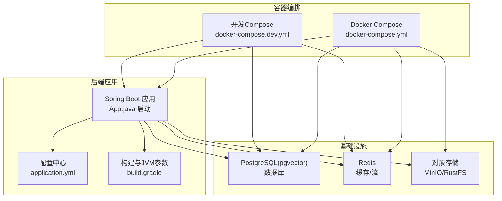
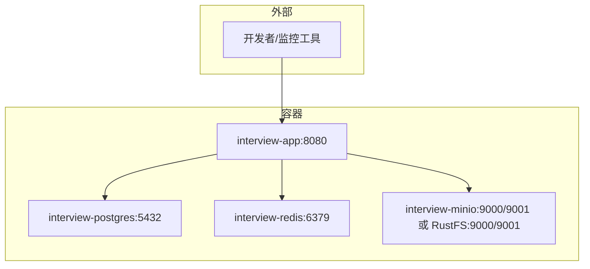
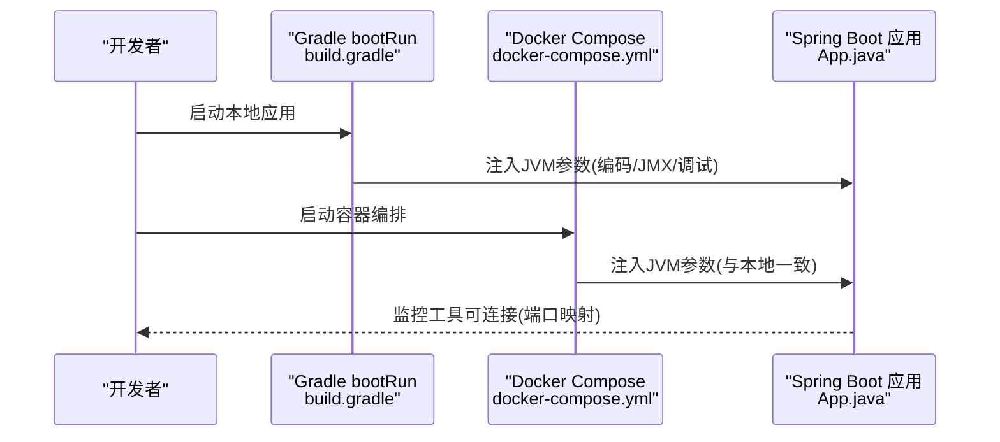
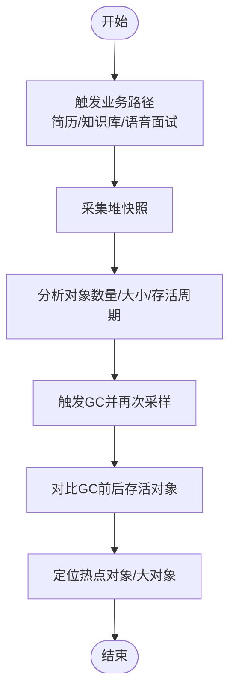
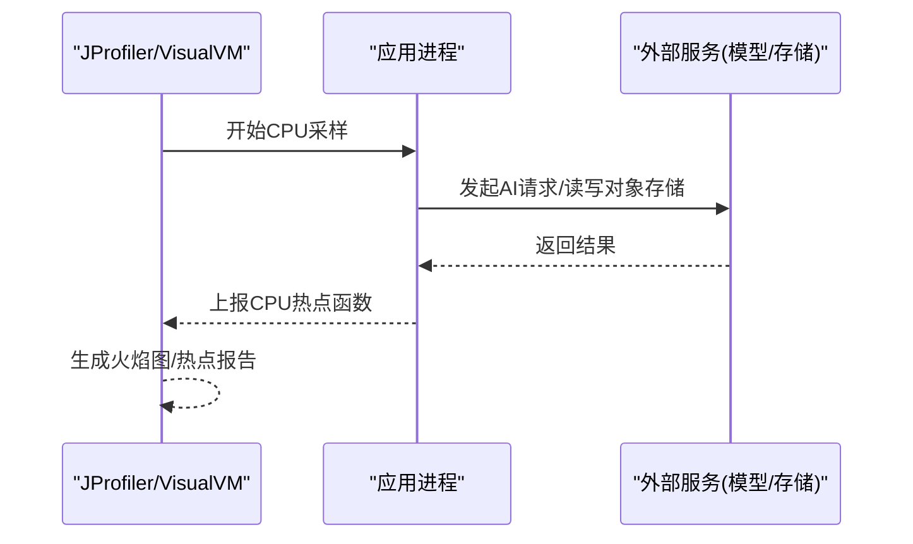
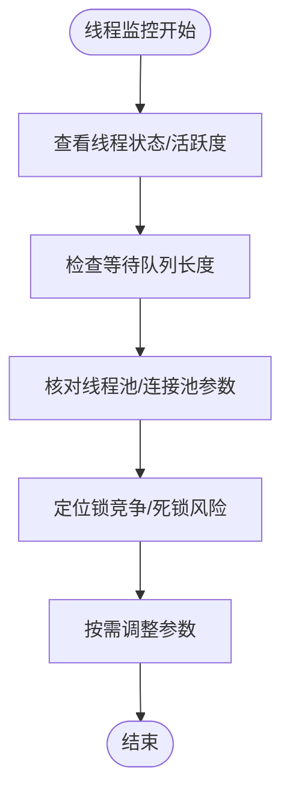
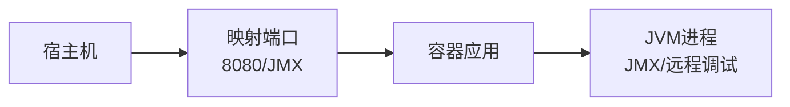
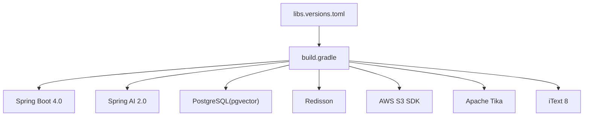

# JVM性能监控工具

<cite>
**本文引用的文件**
- [App.java](file://app/src/main/java/interview/guide/App.java)
- [application.yml](file://app/src/main/resources/application.yml)
- [build.gradle](file://app/build.gradle)
- [docker-compose.yml](file://docker-compose.yml)
- [docker-compose.dev.yml](file://docker-compose.dev.yml)
- [libs.versions.toml](file://gradle/libs.versions.toml)
</cite>

## 目录
1. [简介](#简介)
2. [项目结构](#项目结构)
3. [核心组件](#核心组件)
4. [架构总览](#架构总览)
5. [详细组件分析](#详细组件分析)
6. [依赖关系分析](#依赖关系分析)
7. [性能考量](#性能考量)
8. [故障排查指南](#故障排查指南)
9. [结论](#结论)
10. [附录](#附录)

## 简介
本指南面向面试指南平台的运维与开发人员，聚焦于JVM性能监控与调优。内容涵盖：
- 工具安装与配置：JProfiler、VisualVM
- 内存分析、CPU性能分析、线程监控实操
- JVM参数最佳实践：堆大小、垃圾回收器选择
- 在Docker容器中启用JVM监控
- 性能瓶颈识别与解决方案

## 项目结构
面试指南平台采用多模块架构，后端基于Spring Boot 4.0 + Java 21，配合PostgreSQL、Redis、对象存储等基础设施。应用通过Docker Compose编排，便于本地与生产环境的一致部署。

图表来源
- [docker-compose.yml:1-197](file://docker-compose.yml#L1-L197)
- [docker-compose.dev.yml:1-64](file://docker-compose.dev.yml#L1-L64)
- [application.yml:1-282](file://app/src/main/resources/application.yml#L1-L282)
- [build.gradle:1-136](file://app/build.gradle#L1-L136)
- [App.java:1-19](file://app/src/main/java/interview/guide/App.java#L1-L19)

章节来源
- [docker-compose.yml:1-197](file://docker-compose.yml#L1-L197)
- [docker-compose.dev.yml:1-64](file://docker-compose.dev.yml#L1-L64)
- [application.yml:1-282](file://app/src/main/resources/application.yml#L1-L282)
- [build.gradle:1-136](file://app/build.gradle#L1-L136)
- [App.java:1-19](file://app/src/main/java/interview/guide/App.java#L1-L19)

## 核心组件
- 应用启动与调度
  - 启动类位于 [App.java:1-19](file://app/src/main/java/interview/guide/App.java#L1-L19)，启用调度注解以便定时任务与后台处理。
- 运行时配置
  - 服务器端口、Tomcat线程池、虚拟线程、数据库连接池、Redisson、AI模型与RAG参数等均在 [application.yml:1-282](file://app/src/main/resources/application.yml#L1-L282) 中集中管理。
- 构建与JVM参数
  - Gradle任务在 [build.gradle:106-135](file://app/build.gradle#L106-L135) 中为bootRun注入JVM编码参数，并支持加载宿主机.env环境变量，便于本地调试与监控参数注入。
- 版本与依赖
  - 版本统一由 [libs.versions.toml:1-30](file://gradle/libs.versions.toml#L1-L30) 管理，确保Spring Boot 4.0与相关生态版本对齐。

章节来源
- [App.java:1-19](file://app/src/main/java/interview/guide/App.java#L1-L19)
- [application.yml:1-282](file://app/src/main/resources/application.yml#L1-L282)
- [build.gradle:106-135](file://app/build.gradle#L106-L135)
- [libs.versions.toml:1-30](file://gradle/libs.versions.toml#L1-L30)

## 架构总览
下图展示应用在容器中的运行形态，以及与外部基础设施的关系。该视图有助于理解在容器环境下启用JVM监控的端口与网络拓扑。

图表来源
- [docker-compose.yml:125-171](file://docker-compose.yml#L125-L171)
- [docker-compose.dev.yml:38-58](file://docker-compose.dev.yml#L38-L58)

章节来源
- [docker-compose.yml:125-171](file://docker-compose.yml#L125-L171)
- [docker-compose.dev.yml:38-58](file://docker-compose.dev.yml#L38-L58)

## 详细组件分析

### 组件A：JVM参数与容器暴露（用于远程监控）
- 目标
  - 在容器中启用JMX/远程JVM监控，使JProfiler/VisualVM可连接。
- 方法
  - 在容器启动时添加JMX/远程调试参数，开放JMX端口并在compose中映射。
  - 通过环境变量传递JVM参数，保证与本地开发一致。
- 关键点
  - 本地可通过Gradle bootRun注入JVM参数，容器中同样可注入相同参数，便于对比分析。
  - 确保容器网络策略允许外部访问JMX端口。

图表来源
- [build.gradle:106-135](file://app/build.gradle#L106-L135)
- [docker-compose.yml:169-171](file://docker-compose.yml#L169-L171)
- [App.java:15-17](file://app/src/main/java/interview/guide/App.java#L15-L17)

章节来源
- [build.gradle:106-135](file://app/build.gradle#L106-L135)
- [docker-compose.yml:169-171](file://docker-compose.yml#L169-L171)
- [App.java:15-17](file://app/src/main/java/interview/guide/App.java#L15-L17)

### 组件B：内存分析（堆与GC）
- 目标
  - 识别内存峰值、对象分配热点、GC频率与停顿时间。
- 工具
  - JProfiler/VisualVM连接到应用进程后，使用内存视图观察堆快照、对象数量与大小分布。
- 步骤
  - 触发典型业务路径（简历解析、知识库向量化、语音面试实时流式处理）。
  - 采集堆快照，对比GC前后存活对象，定位大对象与长生命周期对象。
- 平台特性
  - 应用使用虚拟线程与高并发I/O，注意区分“线程占用”与“内存占用”。

（本图为概念流程，不对应具体源码文件）

### 组件C：CPU性能分析
- 目标
  - 识别CPU热点函数、线程CPU占用、阻塞点。
- 工具
  - 使用JProfiler/VisualVM的CPU采样功能，关注AI调用、向量化、音频编解码、文件解析等I/O密集路径。
- 平台特性
  - 虚拟线程启用后，线程切换开销降低，但CPU热点仍可能集中在第三方SDK调用与批处理环节。

（本图为概念流程，不对应具体源码文件）

### 组件D：线程监控
- 目标
  - 观察线程池、虚拟线程、阻塞队列、连接池状态。
- 工具
  - JProfiler/VisualVM线程视图查看线程状态、锁竞争、等待队列长度。
- 平台特性
  - 应用启用虚拟线程，Tomcat线程池与Hikari连接池参数已针对虚拟线程场景优化，应关注线程饥饿与上下文切换。

（本图为概念流程，不对应具体源码文件）

### 组件E：Docker容器中启用JVM监控
- 端口与映射
  - 应用容器映射8080端口，JMX默认端口可在容器启动时开放并映射。
- 环境变量注入
  - 通过compose环境变量注入JVM参数，确保与本地一致，便于横向对比。
- 安全建议
  - 生产环境仅在受控网络内开放JMX端口，必要时使用VPN或跳板机。

图表来源
- [docker-compose.yml:169-171](file://docker-compose.yml#L169-L171)

章节来源
- [docker-compose.yml:169-171](file://docker-compose.yml#L169-L171)

## 依赖关系分析
- 版本与依赖
  - Spring Boot 4.0、Spring AI 2.0、PostgreSQL(pgvector)、Redisson、AWS S3 SDK、Tika、iText、Pinyin4j、SpringDoc等在 [build.gradle:23-87](file://app/build.gradle#L23-L87) 中声明。
  - 版本统一由 [libs.versions.toml:1-30](file://gradle/libs.versions.toml#L1-L30) 管理。
- 运行时配置
  - 数据源、JPA、Redisson、AI模型与RAG参数在 [application.yml:48-124](file://app/src/main/resources/application.yml#L48-L124) 中集中配置，直接影响性能表现。

图表来源
- [build.gradle:23-87](file://app/build.gradle#L23-L87)
- [libs.versions.toml:1-30](file://gradle/libs.versions.toml#L1-L30)

章节来源
- [build.gradle:23-87](file://app/build.gradle#L23-L87)
- [libs.versions.toml:1-30](file://gradle/libs.versions.toml#L1-L30)

## 性能考量
- 虚拟线程与线程池
  - 应用启用虚拟线程，Tomcat线程池与Hikari连接池参数已针对虚拟线程场景优化，建议保持现状并持续观察。
- I/O密集型优化
  - AI调用、对象存储读写、音频编解码均为I/O密集型，优先考虑线程模型与连接池参数，避免阻塞。
- 日志与编码
  - 全局UTF-8编码配置有助于避免控制台与日志乱码问题，减少因编码导致的额外开销。
- 参数注入与一致性
  - 本地与容器使用相同的JVM参数注入方式，便于横向对比与问题复现。

章节来源
- [application.yml:42-46](file://app/src/main/resources/application.yml#L42-L46)
- [application.yml:54-61](file://app/src/main/resources/application.yml#L54-L61)
- [build.gradle:106-113](file://app/build.gradle#L106-L113)

## 故障排查指南
- 无法连接JMX/远程调试
  - 检查容器端口映射与防火墙策略，确认JVM参数已正确注入。
  - 对比本地与容器的JVM参数，确保一致。
- 线程池/连接池耗尽
  - 观察Tomcat与Hikari连接池状态，结合业务峰值流量评估参数。
- GC频繁或停顿过长
  - 采集堆快照与GC日志，定位大对象与长生命周期对象，评估堆大小与GC策略。
- 端口冲突
  - Docker映射端口与宿主机已有服务冲突时，修改映射端口或停止冲突服务。

章节来源
- [docker-compose.yml:169-171](file://docker-compose.yml#L169-L171)
- [application.yml:12-18](file://app/src/main/resources/application.yml#L12-L18)
- [application.yml:54-61](file://app/src/main/resources/application.yml#L54-L61)

## 结论
通过在Docker容器中启用JMX/远程调试、结合JProfiler/VisualVM进行内存、CPU与线程分析，并依据平台的虚拟线程与I/O特性优化线程池与连接池参数，可有效识别与解决性能瓶颈。建议在本地与容器环境中保持JVM参数一致，以便快速定位问题并验证修复效果。

## 附录
- 工具安装与配置要点
  - JProfiler/VisualVM连接目标：容器IP:JMX端口（需在compose中映射并开放）。
  - 连接认证：如启用安全策略，需配置用户名/密码或使用受控网络。
- 常见JVM参数注入位置
  - 本地：Gradle bootRun任务中注入JVM参数。
  - 容器：通过compose环境变量注入相同参数，确保行为一致。

章节来源
- [build.gradle:106-135](file://app/build.gradle#L106-L135)
- [docker-compose.yml:169-171](file://docker-compose.yml#L169-L171)