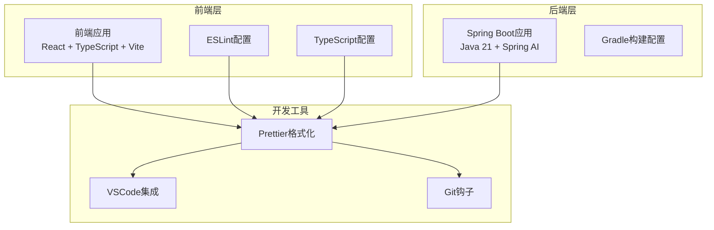
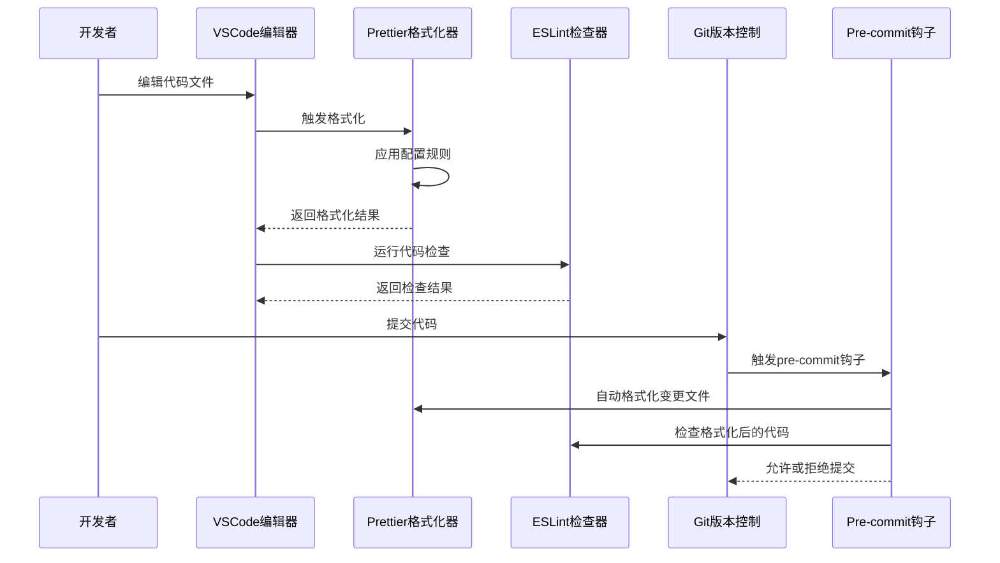
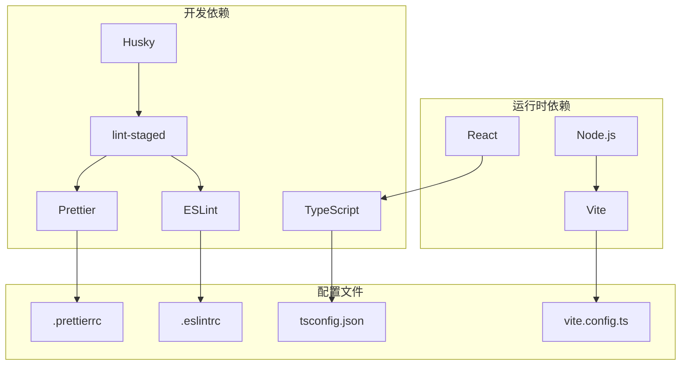

# Prettier格式化配置

<cite>
**本文档引用的文件**
- [frontend/package.json](file://frontend/package.json)
- [frontend/eslint.config.js](file://frontend/eslint.config.js)
- [frontend/vite.config.ts](file://frontend/vite.config.ts)
- [frontend/tsconfig.app.json](file://frontend/tsconfig.app.json)
- [frontend/tsconfig.json](file://frontend/tsconfig.json)
- [frontend/tsconfig.node.json](file://frontend/tsconfig.node.json)
- [app/build.gradle](file://app/build.gradle)
</cite>

## 目录
1. [简介](#简介)
2. [项目结构](#项目结构)
3. [核心组件](#核心组件)
4. [架构概览](#架构概览)
5. [详细组件分析](#详细组件分析)
6. [依赖关系分析](#依赖关系分析)
7. [性能考虑](#性能考虑)
8. [故障排除指南](#故障排除指南)
9. [结论](#结论)

## 简介

本指南为面试指南平台提供完整的Prettier代码格式化配置方案。该平台采用前后端分离架构，前端使用React + TypeScript + Vite技术栈，后端基于Spring Boot 4.0 + Java 21。由于当前代码库未包含Prettier配置文件，本指南将提供最佳实践配置和集成方案。

## 项目结构

面试指南平台采用现代化全栈开发架构：



**图表来源**
- [frontend/package.json:1-47](file://frontend/package.json#L1-L47)
- [app/build.gradle:1-136](file://app/build.gradle#L1-L136)

**章节来源**
- [frontend/package.json:1-47](file://frontend/package.json#L1-L47)
- [app/build.gradle:1-136](file://app/build.gradle#L1-L136)

## 核心组件

### Prettier配置参数详解

#### 基础格式化参数

| 参数名称 | 推荐值 | 作用说明 |
|---------|--------|----------|
| printWidth | 120 | 控制单行最大字符数，平衡可读性和空间利用率 |
| tabWidth | 2 | 制表符宽度，保持团队统一缩进风格 |
| useTabs | false | 使用空格而非制表符，避免编辑器差异问题 |
| semi | true | 始终添加分号，提升代码一致性 |
| singleQuote | true | 优先使用单引号，减少引号转换开销 |
| quoteProps | "as-needed" | 智能属性引号处理，仅在必要时添加 |

#### 高级格式化选项

| 参数名称 | 推荐值 | 作用说明 |
|---------|--------|----------|
| trailingComma | "es5" | 在对象和数组末尾添加逗号，支持旧版浏览器 |
| bracketSpacing | true | 对象字面量中括号内添加空格 |
| arrowParens | "avoid" | 箭头函数参数只有一个时不强制加括号 |
| rangeStart/rangeEnd | 0/Infinity | 支持范围格式化，仅处理指定区域 |
| requirePragma | false | 需要特殊注释才格式化（可选） |

**章节来源**
- [frontend/eslint.config.js:1-24](file://frontend/eslint.config.js#L1-L24)

### 文件类型格式化规则

#### JavaScript/TypeScript文件
- 扩展名：`.js`, `.jsx`, `.ts`, `.tsx`
- 特殊规则：保留TypeScript类型信息，处理JSX语法
- 配置示例路径：[frontend/tsconfig.app.json](file://frontend/tsconfig.app.json)

#### JSON文件
- 扩展名：`.json`, `.jsonc`
- 规则：严格JSON格式，避免尾随逗号
- 配置示例路径：[frontend/tsconfig.json](file://frontend/tsconfig.json)

#### CSS/SCSS文件
- 扩展名：`.css`, `.scss`
- 规则：保持选择器和属性的格式一致性
- 配置示例路径：[frontend/vite.config.ts](file://frontend/vite.config.ts)

## 架构概览

Prettier在面试指南平台中的集成架构：



**图表来源**
- [frontend/package.json:6-10](file://frontend/package.json#L6-L10)
- [frontend/eslint.config.js:8-23](file://frontend/eslint.config.js#L8-L23)

## 详细组件分析

### VSCode集成配置

#### 插件推荐设置

```json
{
    "editor.defaultFormatter": "esbenp.prettier-vscode",
    "editor.formatOnSave": true,
    "editor.formatOnPaste": true,
    "[javascript]": {
        "editor.defaultFormatter": "esbenp.prettier-vscode"
    },
    "[typescript]": {
        "editor.defaultFormatter": "esbenp.prettier-vscode"
    },
    "[javascriptreact]": {
        "editor.defaultFormatter": "esbenp.prettier-vscode"
    },
    "[typescriptreact]": {
        "editor.defaultFormatter": "esbenp.prettier-vscode"
    }
}
```

#### 工作区配置文件

创建 `.vscode/settings.json`：

```json
{
    "editor.formatOnSave": true,
    "editor.codeActionsOnSave": {
        "source.fixAll.eslint": true,
        "source.organizeImports": true
    },
    "eslint.validate": [
        "javascript",
        "javascriptreact",
        "typescript",
        "typescriptreact"
    ]
}
```

**章节来源**
- [frontend/eslint.config.js:18-22](file://frontend/eslint.config.js#L18-L22)

### ESLint与Prettier集成

#### 冲突解决策略

当ESLint和Prettier产生冲突时，采用以下优先级：

1. **Prettier优先**：格式化类规则由Prettier处理
2. **ESLint优先**：逻辑类规则由ESLint处理
3. **统一配置**：通过插件消除重复规则

#### 推荐的集成配置

```javascript
// eslint.config.js 中的扩展配置
export default defineConfig([
  {
    files: ['**/*.{ts,tsx}'],
    extends: [
      js.configs.recommended,
      tseslint.configs.recommended,
      reactHooks.configs.flat.recommended,
      reactRefresh.configs.vite,
    ],
    languageOptions: {
      ecmaVersion: 2020,
      globals: globals.browser,
    },
    // 关键：禁用ESLint中与Prettier重复的规则
    rules: {
      'indent': 'off',
      'quotes': 'off',
      'semi': 'off',
      'comma-dangle': 'off'
    }
  },
])
```

**章节来源**
- [frontend/eslint.config.js:8-23](file://frontend/eslint.config.js#L8-L23)

### Git钩子集成

#### Husky + lint-staged配置

创建 `.husky/pre-commit`：

```bash
#!/bin/sh
. "$(dirname "$0")/_/husky.sh"

npx lint-staged
```

配置 `lint-staged.config.js`：

```javascript
module.exports = {
  '*.{js,jsx,ts,tsx}': ['prettier --write', 'eslint --fix'],
  '*.json': ['prettier --write'],
  '*.css': ['prettier --write'],
  '*.md': ['prettier --write']
}
```

#### 完整的package.json脚本

```json
{
  "scripts": {
    "lint:prettier": "prettier --check .",
    "format": "prettier --write .",
    "prepare": "husky install"
  },
  "devDependencies": {
    "husky": "^9.0.0",
    "lint-staged": "^15.0.0",
    "prettier": "^3.0.0"
  }
}
```

**章节来源**
- [frontend/package.json:6-10](file://frontend/package.json#L6-L10)

### 自定义格式化选项

#### 复杂数据结构处理

对于大型对象和数组，建议：

```javascript
// 推荐：多行格式化
const config = {
  apiUrl: 'https://api.example.com',
  timeout: 5000,
  retries: 3,
  headers: {
    'Content-Type': 'application/json',
    'Accept': 'application/json'
  }
};

// 推荐：数组元素分行
const items = [
  'item1',
  'item2',
  'item3'
];
```

#### 条件格式化

```javascript
// 推荐：三元运算符分行
const message = condition
  ? '条件为真时的消息'
  : '条件为假时的消息';

// 推荐：长链式调用分行
const result = object
  .method1()
  .method2()
  .method3();
```

## 依赖关系分析

### 工具链依赖关系



**图表来源**
- [frontend/package.json:29-44](file://frontend/package.json#L29-L44)
- [frontend/vite.config.ts:1-42](file://frontend/vite.config.ts#L1-L42)

**章节来源**
- [frontend/package.json:29-44](file://frontend/package.json#L29-L44)
- [frontend/vite.config.ts:1-42](file://frontend/vite.config.ts#L1-L42)

## 性能考虑

### 格式化性能优化

1. **增量格式化**：利用lint-staged只处理已修改文件
2. **缓存机制**：Prettier内置缓存，避免重复格式化
3. **并行处理**：多文件格式化时充分利用CPU核心
4. **忽略大文件**：对node_modules、dist等目录进行忽略

### 内存使用优化

- 大型文件建议分批处理
- 避免同时格式化过多文件
- 合理设置内存限制

## 故障排除指南

### 常见问题及解决方案

#### 问题1：VSCode保存时格式化不生效
**解决方案**：
1. 确认已安装Prettier VSCode插件
2. 检查工作区设置是否正确
3. 验证.prettierrc配置文件存在

#### 问题2：ESLint与Prettier冲突
**解决方案**：
1. 移除ESLint中与Prettier重复的规则
2. 使用eslint-config-prettier消除冲突
3. 确保Prettier在ESLint之前执行

#### 问题3：Git钩子格式化失败
**解决方案**：
1. 检查husky安装状态
2. 验证lint-staged配置正确性
3. 确认所有依赖包已正确安装

**章节来源**
- [frontend/eslint.config.js:18-22](file://frontend/eslint.config.js#L18-L22)

## 结论

本指南为面试指南平台提供了完整的Prettier格式化配置方案。通过合理的配置参数设置、与ESLint的无缝集成、VSCode的便捷配置以及Git钩子的自动化流程，可以确保整个团队代码风格的一致性和高质量。

关键要点：
- 采用保守的printWidth设置以平衡可读性
- 统一使用空格缩进，避免制表符差异
- 与ESLint配合使用，发挥各自优势
- 通过Git钩子实现自动化质量控制
- 提供清晰的故障排除指导

这套配置方案既保证了开发效率，又维护了代码质量标准，适合长期维护和发展。