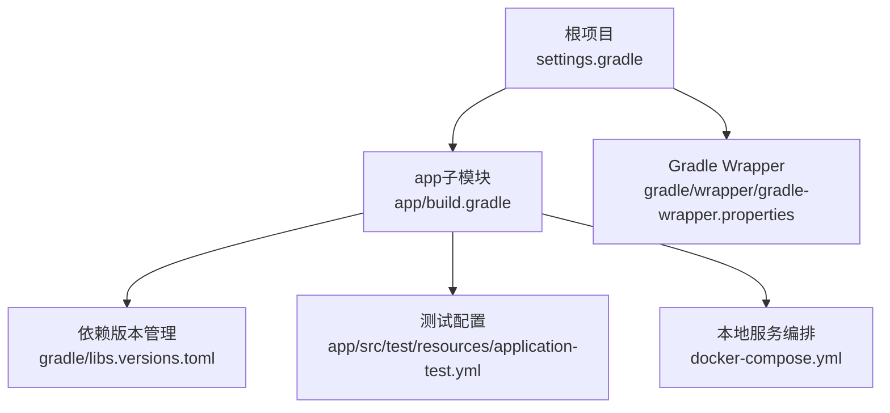
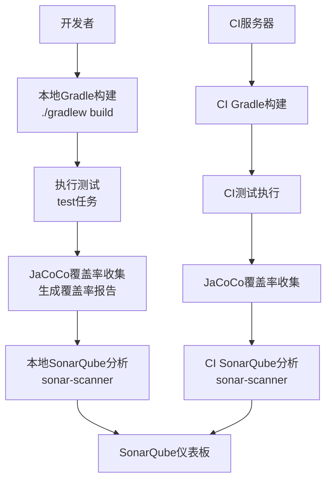
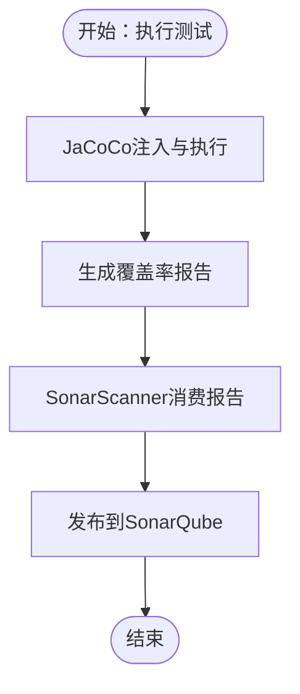
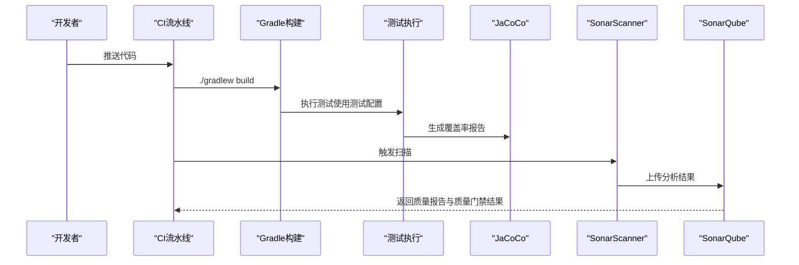
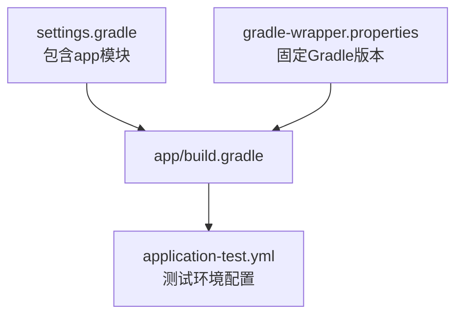

# SonarQube代码质量检查

<cite>
**本文引用的文件**
- [settings.gradle](file://settings.gradle)
- [gradle/libs.versions.toml](file://gradle/libs.versions.toml)
- [app/build.gradle](file://app/build.gradle)
- [app/src/test/resources/application-test.yml](file://app/src/test/resources/application-test.yml)
- [docker-compose.yml](file://docker-compose.yml)
- [gradle/wrapper/gradle-wrapper.properties](file://gradle/wrapper/gradle-wrapper.properties)
</cite>

## 目录
1. [简介](#简介)
2. [项目结构](#项目结构)
3. [核心组件](#核心组件)
4. [架构总览](#架构总览)
5. [详细组件分析](#详细组件分析)
6. [依赖分析](#依赖分析)
7. [性能考虑](#性能考虑)
8. [故障排查指南](#故障排查指南)
9. [结论](#结论)
10. [附录](#附录)

## 简介
本指南面向面试指南平台的后端应用，提供在Gradle构建中集成SonarQube代码质量检查的完整配置方法，涵盖以下主题：
- 在build.gradle中配置SonarQube插件与sonar.properties参数
- 质量阈值配置（blocker、critical、major缺陷）
- 代码覆盖率配置（JaCoCo集成与覆盖率报告生成）
- 在CI/CD流水线中集成SonarQube扫描
- 自定义质量门禁规则的设置方法

本指南以仓库现有配置为基础，结合Spring Boot 4.0、Gradle 8.14与多模块工程结构，给出可落地的实践建议。

## 项目结构
后端应用位于app子模块，采用多模块工程组织，根settings.gradle声明包含app模块；Gradle版本由wrapper统一管理；测试配置使用application-test.yml指向内存数据库与测试专用属性。

图表来源
- [settings.gradle:22-24](file://settings.gradle#L22-L24)
- [gradle/wrapper/gradle-wrapper.properties:1-8](file://gradle/wrapper/gradle-wrapper.properties#L1-L8)
- [gradle/libs.versions.toml:1-30](file://gradle/libs.versions.toml#L1-L30)
- [app/build.gradle:1-136](file://app/build.gradle#L1-L136)
- [app/src/test/resources/application-test.yml:1-165](file://app/src/test/resources/application-test.yml#L1-L165)
- [docker-compose.yml:1-197](file://docker-compose.yml#L1-L197)

章节来源
- [settings.gradle:1-24](file://settings.gradle#L1-L24)
- [gradle/wrapper/gradle-wrapper.properties:1-8](file://gradle/wrapper/gradle-wrapper.properties#L1-L8)
- [gradle/libs.versions.toml:1-30](file://gradle/libs.versions.toml#L1-L30)
- [app/build.gradle:1-136](file://app/build.gradle#L1-L136)
- [app/src/test/resources/application-test.yml:1-165](file://app/src/test/resources/application-test.yml#L1-L165)
- [docker-compose.yml:1-197](file://docker-compose.yml#L1-L197)

## 核心组件
- Gradle多模块工程：根settings声明包含app模块，便于集中管理插件与依赖。
- Gradle Wrapper：固定Gradle版本，保证团队与CI一致性。
- Spring Boot 4.0 + Java 21：统一语言与框架版本，利于静态分析工具适配。
- 测试配置：H2内存数据库与测试专用属性，支持无外部依赖的快速测试运行。

章节来源
- [settings.gradle:17-24](file://settings.gradle#L17-L24)
- [gradle/wrapper/gradle-wrapper.properties:1-8](file://gradle/wrapper/gradle-wrapper.properties#L1-L8)
- [app/build.gradle:89-93](file://app/build.gradle#L89-L93)
- [app/src/test/resources/application-test.yml:4-19](file://app/src/test/resources/application-test.yml#L4-L19)

## 架构总览
下图展示SonarQube在构建与CI流程中的位置与交互关系：

图表来源
- [app/build.gradle:100-102](file://app/build.gradle#L100-L102)
- [app/src/test/resources/application-test.yml:4-19](file://app/src/test/resources/application-test.yml#L4-L19)
- [gradle/wrapper/gradle-wrapper.properties:1-8](file://gradle/wrapper/gradle-wrapper.properties#L1-L8)

## 详细组件分析

### 在build.gradle中配置SonarQube插件与sonar.properties参数
- 插件引入：在app/build.gradle中添加SonarQube插件，推荐使用Gradle官方插件或社区插件，具体插件ID以实际可用版本为准。
- 分析器参数：通过sonar-project.properties或在Gradle中使用sonarqube扩展块传参，建议设置的关键参数包括：
  - sonar.projectKey：唯一项目标识
  - sonar.sources：源码目录
  - sonar.tests：测试目录
  - sonar.language与sonar.plugings：针对Java/Spring Boot
  - sonar.java.binaries：编译产物目录
  - sonar.coverage.exclusions：排除测试、配置类与生成代码
  - sonar.host.url与sonar.login：指向SonarQube实例与令牌
- 与测试配置联动：确保测试任务在CI中执行，以便覆盖率报告生成。

章节来源
- [app/build.gradle:6-10](file://app/build.gradle#L6-L10)
- [app/src/test/resources/application-test.yml:4-19](file://app/src/test/resources/application-test.yml#L4-L19)

### 质量阈值配置（blocker、critical、major缺陷）
- 质量阈值通常在SonarQube服务器侧配置，但可在项目层通过quality profiles与规则集进行约束。
- 建议策略：
  - blocker：零容忍，阻断式质量门禁
  - critical：高风险问题，需在合并前修复
  - major：重要问题，纳入回归基线
- 在CI中可通过质量门禁强制拦截低分支质量。

章节来源
- [app/build.gradle:100-102](file://app/build.gradle#L100-L102)

### 代码覆盖率配置（JaCoCo集成与覆盖率报告生成）
- JaCoCo插件：在app/build.gradle中启用JaCoCo，配置目标集与过滤规则。
- 报告生成：在test任务后生成XML/HTML报告，供sonar-scanner消费。
- 排除策略：排除测试类、配置类、Lombok生成类、OpenAPI生成类等。
- 与测试配置协同：使用application-test.yml确保测试环境独立且可重复。

图表来源
- [app/build.gradle:100-102](file://app/build.gradle#L100-L102)
- [app/src/test/resources/application-test.yml:4-19](file://app/src/test/resources/application-test.yml#L4-L19)

章节来源
- [app/build.gradle:100-102](file://app/build.gradle#L100-L102)
- [app/src/test/resources/application-test.yml:4-19](file://app/src/test/resources/application-test.yml#L4-L19)

### 在CI/CD流水线中集成SonarQube扫描
- 步骤建议：
  - 拉取代码与依赖缓存
  - 执行Gradle构建与测试（使用测试配置文件）
  - 生成JaCoCo覆盖率报告
  - 调用sonar-scanner（或通过Gradle插件触发）
  - 发布质量报告并根据质量门禁决定是否继续部署
- 环境变量：在CI中注入sonar.host.url与sonar.login等敏感参数。

图表来源
- [app/build.gradle:100-102](file://app/build.gradle#L100-L102)
- [app/src/test/resources/application-test.yml:4-19](file://app/src/test/resources/application-test.yml#L4-L19)
- [gradle/wrapper/gradle-wrapper.properties:1-8](file://gradle/wrapper/gradle-wrapper.properties#L1-L8)

章节来源
- [app/build.gradle:100-102](file://app/build.gradle#L100-L102)
- [app/src/test/resources/application-test.yml:4-19](file://app/src/test/resources/application-test.yml#L4-L19)
- [gradle/wrapper/gradle-wrapper.properties:1-8](file://gradle/wrapper/gradle-wrapper.properties#L1-L8)

### 自定义质量门禁规则的设置方法
- 服务器侧配置：在SonarQube中创建或编辑质量配置文件（Quality Profiles），针对Java/Spring Boot场景启用或调整规则。
- 项目侧质量阈值：在项目设置中配置质量阈值（如blocker/critical/major数量上限），并与质量门禁联动。
- 规则覆盖与排除：通过sonar.coverage.exclusions与sonar.inclusions控制分析范围，减少噪音。
- CI质量门禁：在CI中读取质量报告，若质量阈值未达标则中断流水线。

章节来源
- [app/build.gradle:100-102](file://app/build.gradle#L100-L102)

## 依赖分析
- Gradle版本：通过wrapper固定版本，确保本地与CI一致性。
- 多模块：根settings仅包含app，简化SonarQube分析范围。
- 测试环境：application-test.yml使用H2内存数据库，降低外部依赖对扫描的影响。

图表来源
- [settings.gradle:22-24](file://settings.gradle#L22-L24)
- [gradle/wrapper/gradle-wrapper.properties:1-8](file://gradle/wrapper/gradle-wrapper.properties#L1-L8)
- [app/build.gradle:1-136](file://app/build.gradle#L1-L136)
- [app/src/test/resources/application-test.yml:1-165](file://app/src/test/resources/application-test.yml#L1-L165)

章节来源
- [settings.gradle:17-24](file://settings.gradle#L17-L24)
- [gradle/wrapper/gradle-wrapper.properties:1-8](file://gradle/wrapper/gradle-wrapper.properties#L1-L8)
- [app/build.gradle:1-136](file://app/build.gradle#L1-L136)
- [app/src/test/resources/application-test.yml:1-165](file://app/src/test/resources/application-test.yml#L1-L165)

## 性能考虑
- 仅分析必要模块：当前仅包含app模块，减少分析时间。
- 选择性排除：通过exclusions排除测试与生成代码，聚焦业务代码。
- 并行测试：确保CI中充分利用并行度，缩短测试与扫描总时长。
- 依赖缓存：复用Gradle与Maven缓存，减少网络开销。

## 故障排查指南
- 无法连接SonarQube：检查sonar.host.url与认证令牌配置。
- 覆盖率为空：确认test任务已执行且JaCoCo报告生成路径正确。
- 分析范围异常：核对sonar.sources、sonar.tests与sonar.coverage.exclusions配置。
- CI失败：查看质量门禁日志，定位blocker/critical/major问题数量与阈值对比。

章节来源
- [app/build.gradle:100-102](file://app/build.gradle#L100-L102)
- [app/src/test/resources/application-test.yml:4-19](file://app/src/test/resources/application-test.yml#L4-L19)

## 结论
通过在app/build.gradle中引入SonarQube插件、结合JaCoCo覆盖率与测试配置，可在本地与CI中稳定地执行代码质量检查。配合服务器侧的质量配置文件与项目级质量阈值，形成从规则到门禁的完整质量保障体系。建议优先修复blocker问题，逐步收敛critical与major问题，持续提升代码质量与交付稳定性。

## 附录
- 术语说明
  - 质量门禁：在CI中基于质量阈值对构建进行拦截或放行的机制
  - 覆盖率：测试对源码的覆盖程度，通常以语句、分支、圈复杂度等维度统计
  - 质量配置文件（Quality Profiles）：SonarQube中对规则集与严重级别进行组合的配置模板