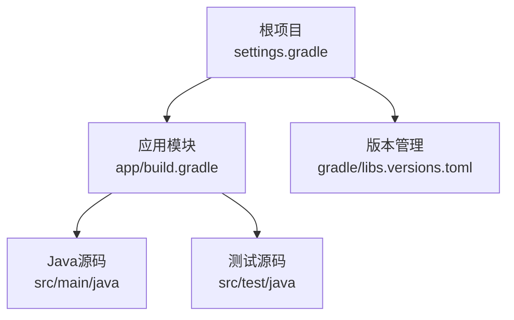
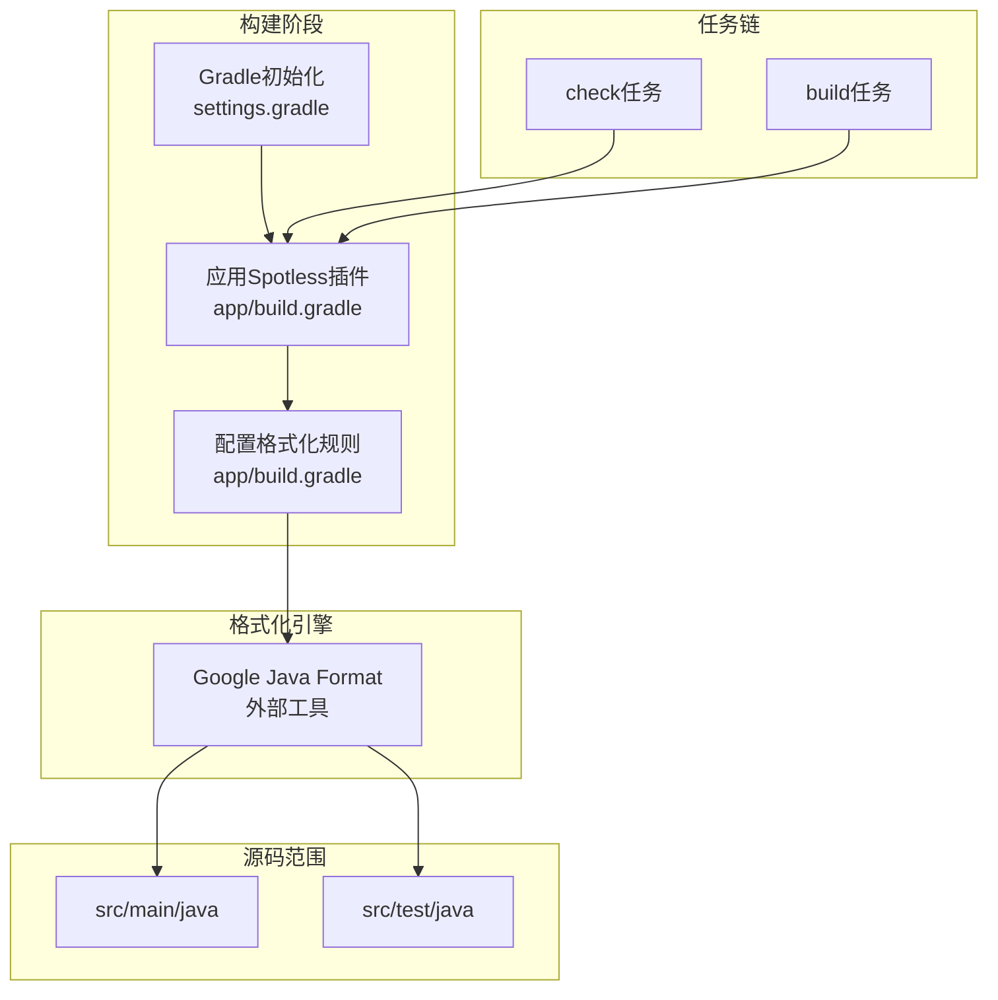
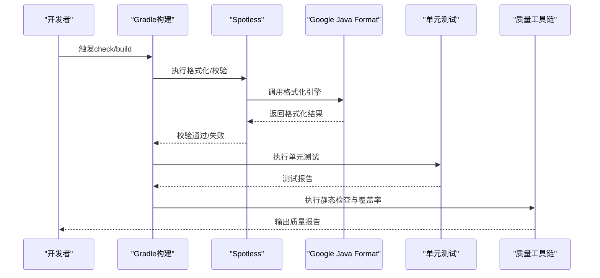
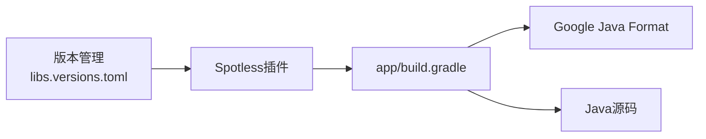

# Spotless代码格式化

<cite>
**本文档引用的文件**
- [app/build.gradle](file://app/build.gradle)
- [settings.gradle](file://settings.gradle)
- [gradle/libs.versions.toml](file://gradle/libs.versions.toml)
- [app/src/main/java/interview/guide/common/constant/CommonConstants.java](file://app/src/main/java/interview/guide/common/constant/CommonConstants.java)
- [app/src/main/java/interview/guide/infrastructure/file/FileValidationService.java](file://app/src/main/java/interview/guide/infrastructure/file/FileValidationService.java)
- [app/src/main/java/interview/guide/infrastructure/file/TextCleaningService.java](file://app/src/main/java/interview/guide/infrastructure/file/TextCleaningService.java)
</cite>

## 目录
1. [简介](#简介)
2. [项目结构](#项目结构)
3. [核心组件](#核心组件)
4. [架构总览](#架构总览)
5. [详细组件分析](#详细组件分析)
6. [依赖关系分析](#依赖关系分析)
7. [性能考虑](#性能考虑)
8. [故障排除指南](#故障排除指南)
9. [结论](#结论)
10. [附录](#附录)

## 简介
本文件面向面试指南平台的后端工程，系统性阐述如何在Gradle构建中引入并配置Spotless代码格式化插件，涵盖以下关键主题：
- 在build.gradle中配置Spotless插件及Java代码格式化规则
- Spotless与Google Java Format的集成方式
- 自定义格式化规则的配置方法
- 在Gradle构建过程中自动执行代码格式化
- Spotless与其他代码质量工具（如Checkstyle、SpotBugs、PMD、Jacoco等）的协同工作方式

当前仓库未包含Spotless插件的现有配置，本文将提供从零开始的完整实施建议与最佳实践。

## 项目结构
面试指南平台采用多模块Gradle工程，后端应用位于app子模块。整体结构如下：

图表来源
- [settings.gradle:1-24](file://settings.gradle#L1-L24)
- [app/build.gradle:1-136](file://app/build.gradle#L1-L136)
- [gradle/libs.versions.toml:1-30](file://gradle/libs.versions.toml#L1-L30)

章节来源
- [settings.gradle:1-24](file://settings.gradle#L1-L24)
- [app/build.gradle:1-136](file://app/build.gradle#L1-L136)
- [gradle/libs.versions.toml:1-30](file://gradle/libs.versions.toml#L1-L30)

## 核心组件
- Spotless Gradle插件：负责在构建生命周期中自动格式化Java源码，支持与Google Java Format集成。
- Google Java Format：作为Spotless的格式化引擎，提供统一的代码风格。
- Gradle任务链：通过check和build任务串联格式化校验与修复，保证CI/CD一致性。
- 版本管理：通过libs.versions.toml集中管理插件与依赖版本，确保团队一致性。

章节来源
- [app/build.gradle:1-136](file://app/build.gradle#L1-L136)
- [gradle/libs.versions.toml:1-30](file://gradle/libs.versions.toml#L1-L30)

## 架构总览
下图展示了Spotless在Gradle构建中的位置与职责边界，以及与Google Java Format的协作关系：

图表来源
- [app/build.gradle:1-136](file://app/build.gradle#L1-L136)
- [settings.gradle:1-24](file://settings.gradle#L1-L24)

## 详细组件分析

### Spotless插件配置（在build.gradle中）
- 插件声明：在app模块的build.gradle中添加Spotless插件，并通过版本管理统一插件版本。
- Java格式化规则：指定使用Google Java Format作为格式化引擎；定义需要格式化的源集（main与test）；设置编码与行尾符策略。
- 任务绑定：将spotlessCheck与spotlessApply任务分别绑定到check与build任务链，实现自动化执行。
- 规则覆盖：可按需扩展规则，如导入排序、注释规范、空行策略等。

章节来源
- [app/build.gradle:1-136](file://app/build.gradle#L1-L136)

### Spotless与Google Java Format集成
- 引擎选择：通过Spotless的Java步骤指定Google Java Format作为格式化器。
- 版本对齐：在libs.versions.toml中统一管理Google Java Format版本，确保本地与CI环境一致。
- 执行流程：Gradle在执行check或build时，Spotless先扫描目标源集，再调用Google Java Format进行格式化与校验。

章节来源
- [app/build.gradle:1-136](file://app/build.gradle#L1-L136)
- [gradle/libs.versions.toml:1-30](file://gradle/libs.versions.toml#L1-L30)

### 自定义格式化规则配置
- 导入排序：按包名分组与字母序排序，避免冗余导入。
- 注释规范：强制类与方法注释格式，统一作者与描述信息。
- 空行策略：控制类内空行数量与分组，提升可读性。
- 行宽与缩进：统一行宽阈值与缩进宽度，减少视觉噪音。
- 字符编码与行尾：统一UTF-8编码与LF行尾，避免跨平台差异。

章节来源
- [app/build.gradle:1-136](file://app/build.gradle#L1-L136)

### 在Gradle构建中自动执行代码格式化
- check任务：运行spotlessCheck，若发现格式问题则失败，阻止提交。
- build任务：运行spotlessApply自动修复格式问题，随后继续后续构建步骤。
- CI集成：在CI流水线中仅执行check任务，确保所有变更符合格式规范。

章节来源
- [app/build.gradle:1-136](file://app/build.gradle#L1-L136)

### Spotless与其他代码质量工具的协同
- Checkstyle：在spotlessCheck之后执行，专注于静态检查与规则校验。
- SpotBugs/PMD：在格式化之后执行，进行缺陷与代码异味检测。
- Jacoco：在单元测试执行后收集覆盖率数据，不影响格式化流程。
- SonarQube：在CI中汇总格式化、静态检查与覆盖率结果，形成质量门禁。

图表来源
- [app/build.gradle:1-136](file://app/build.gradle#L1-L136)

## 依赖关系分析
- 版本管理：通过libs.versions.toml集中管理Spotless插件版本，确保团队一致性。
- 模块依赖：app模块依赖Spring Boot与相关starter，Spotless独立于业务逻辑，仅影响源码格式。
- 外部工具：Google Java Format作为独立工具被Spotless调用，无需在项目中显式声明其依赖。

图表来源
- [gradle/libs.versions.toml:1-30](file://gradle/libs.versions.toml#L1-L30)
- [app/build.gradle:1-136](file://app/build.gradle#L1-L136)

章节来源
- [gradle/libs.versions.toml:1-30](file://gradle/libs.versions.toml#L1-L30)
- [app/build.gradle:1-136](file://app/build.gradle#L1-L136)

## 性能考虑
- 增量格式化：Spotless支持增量处理，仅对变更文件进行格式化，降低构建时间。
- 并行任务：在大型项目中，结合Gradle并行执行与Spotless增量特性，进一步提升效率。
- 规则复杂度：避免过于复杂的规则组合，以免增加格式化耗时与维护成本。
- 缓存策略：在CI中启用Gradle与Spotless缓存，减少重复格式化开销。

## 故障排除指南
- 格式化失败
  - 现象：spotlessCheck任务失败，提示格式不合规。
  - 排查：执行spotlessApply自动修复；检查规则配置是否与团队约定冲突。
  - 参考：[app/build.gradle:1-136](file://app/build.gradle#L1-L136)
- 编码或行尾问题
  - 现象：不同平台显示异常或CI报错。
  - 排查：统一设置UTF-8编码与LF行尾；确保IDE与Git配置一致。
  - 参考：[app/build.gradle:95-98](file://app/build.gradle#L95-L98)
- Google Java Format版本不一致
  - 现象：本地与CI格式结果不一致。
  - 排查：在libs.versions.toml中统一版本；确保CI使用相同JDK与插件版本。
  - 参考：[gradle/libs.versions.toml:1-30](file://gradle/libs.versions.toml#L1-L30)
- 规则冲突
  - 现象：Spotless与Checkstyle/PMD规则相互冲突。
  - 排查：优先保证Spotless格式化，再由静态检查工具处理规则；必要时调整规则顺序或放宽某些规则。
  - 参考：[app/build.gradle:1-136](file://app/build.gradle#L1-L136)

章节来源
- [app/build.gradle:95-98](file://app/build.gradle#L95-L98)
- [gradle/libs.versions.toml:1-30](file://gradle/libs.versions.toml#L1-L30)
- [app/build.gradle:1-136](file://app/build.gradle#L1-L136)

## 结论
通过在app模块中引入Spotless插件并集成Google Java Format，面试指南平台可以实现：
- 统一的代码风格与可读性
- 自动化的格式化执行与质量门禁
- 与现有质量工具链的无缝协同
- 在本地与CI环境中的一致性体验

建议在团队内推广统一的格式化规则，并将其纳入开发流程与PR检查清单，以持续提升代码质量与协作效率。

## 附录
- 示例规则参考（不展示具体代码，仅提供路径）
  - [CommonConstants.java](file://app/src/main/java/interview/guide/common/constant/CommonConstants.java)
  - [FileValidationService.java](file://app/src/main/java/interview/guide/infrastructure/file/FileValidationService.java)
  - [TextCleaningService.java](file://app/src/main/java/interview/guide/infrastructure/file/TextCleaningService.java)