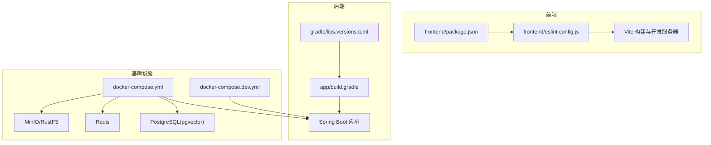
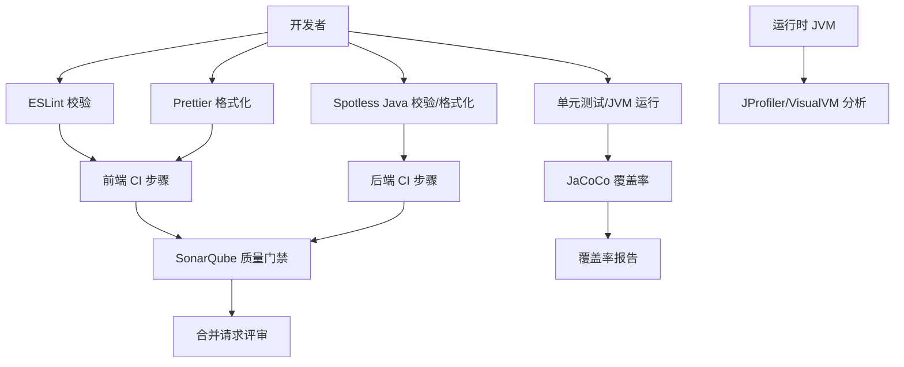
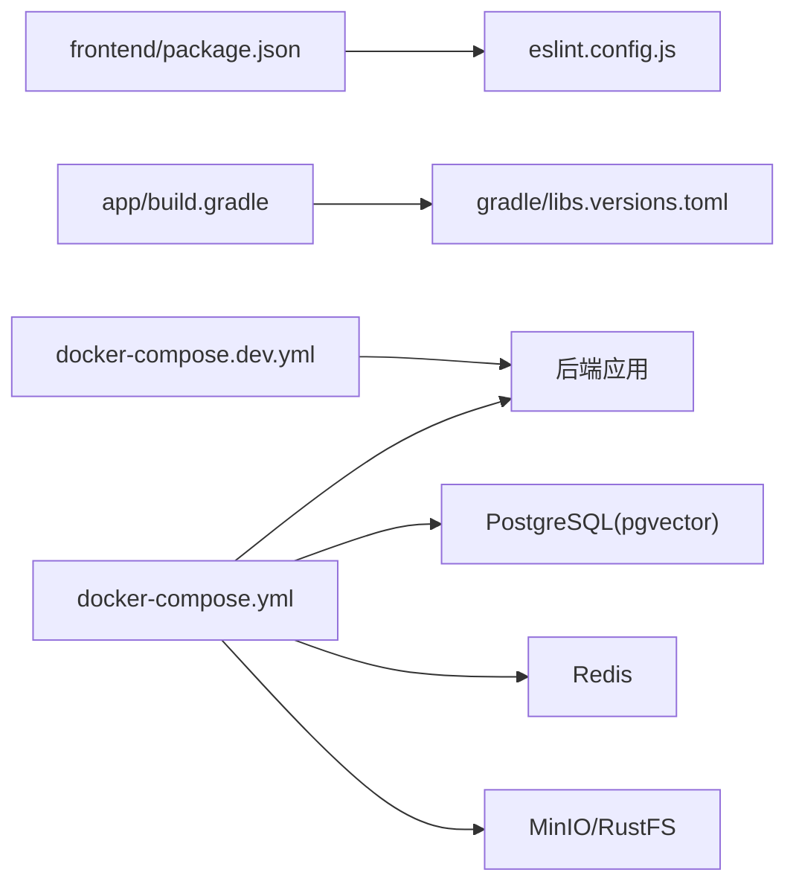

# 代码质量工具配置

<cite>
**本文引用的文件**
- [eslint.config.js](file://frontend/eslint.config.js)
- [package.json](file://frontend/package.json)
- [build.gradle](file://app/build.gradle)
- [libs.versions.toml](file://gradle/libs.versions.toml)
- [docker-compose.yml](file://docker-compose.yml)
- [docker-compose.dev.yml](file://docker-compose.dev.yml)
</cite>

## 目录
1. [简介](#简介)
2. [项目结构](#项目结构)
3. [核心组件](#核心组件)
4. [架构总览](#架构总览)
5. [详细组件分析](#详细组件分析)
6. [依赖关系分析](#依赖关系分析)
7. [性能考量](#性能考量)
8. [故障排查指南](#故障排查指南)
9. [结论](#结论)
10. [附录](#附录)

## 简介
本指南面向面试指南平台的开发团队，系统性介绍代码质量工具链的配置与使用，覆盖前端 ESLint、Prettier（通过 Vite/PostCSS/Tailwind 集成）、后端 Spotless（Java 格式化）、SonarQube 质量门禁、Checkstyle 静态分析、JVM 内存与性能监控（JProfiler/VisualVM）以及 JaCoCo 代码覆盖率。文档以仓库现有配置为基础，结合实际工程实践，提供可落地的配置建议与最佳实践。

## 项目结构
平台采用前后端分离架构：
- 前端位于 frontend 目录，使用 Vite + React + TypeScript，ESLint 采用 Flat Config。
- 后端位于 app 目录，基于 Gradle 构建，使用 Spring Boot 4.x、Java 21。
- 基础设施通过 Docker Compose 编排，包含 PostgreSQL（pgvector）、Redis、MinIO/RustFS 等。

图表来源
- [docker-compose.yml:1-197](file://docker-compose.yml#L1-L197)
- [docker-compose.dev.yml:1-64](file://docker-compose.dev.yml#L1-L64)
- [build.gradle:1-136](file://app/build.gradle#L1-L136)
- [libs.versions.toml:1-30](file://gradle/libs.versions.toml#L1-L30)
- [package.json:1-47](file://frontend/package.json#L1-L47)
- [eslint.config.js:1-24](file://frontend/eslint.config.js#L1-L24)

章节来源
- [docker-compose.yml:1-197](file://docker-compose.yml#L1-L197)
- [docker-compose.dev.yml:1-64](file://docker-compose.dev.yml#L1-L64)
- [build.gradle:1-136](file://app/build.gradle#L1-L136)
- [libs.versions.toml:1-30](file://gradle/libs.versions.toml#L1-L30)
- [package.json:1-47](file://frontend/package.json#L1-L47)
- [eslint.config.js:1-24](file://frontend/eslint.config.js#L1-L24)

## 核心组件
- 前端 ESLint（Flat Config）：统一推荐规则、React Hooks、React Refresh，并排除构建产物目录。
- 前端 Prettier 集成：通过 Tailwind PostCSS 生态间接启用格式化；建议补充独立 Prettier 配置以实现更细粒度控制。
- 后端 Spotless（Java）：当前未发现显式配置文件，建议新增 Java 格式化与依赖管理格式化规则。
- SonarQube：当前未发现配置文件，建议在 CI 中集成质量门禁与规则集。
- Checkstyle：当前未发现配置文件，建议引入自定义规则集并生成报告。
- JVM 性能与内存分析：建议在本地/CI 使用 JProfiler 或 VisualVM 进行采样与分析。
- JaCoCo：建议在 Gradle 中启用覆盖率统计与报告生成。

章节来源
- [eslint.config.js:1-24](file://frontend/eslint.config.js#L1-L24)
- [package.json:1-47](file://frontend/package.json#L1-L47)
- [build.gradle:1-136](file://app/build.gradle#L1-L136)
- [libs.versions.toml:1-30](file://gradle/libs.versions.toml#L1-L30)

## 架构总览
下图展示代码质量工具在开发与部署阶段的交互关系：

图表来源
- [eslint.config.js:1-24](file://frontend/eslint.config.js#L1-L24)
- [package.json:1-47](file://frontend/package.json#L1-L47)
- [build.gradle:1-136](file://app/build.gradle#L1-L136)

## 详细组件分析

### 前端 ESLint 配置与使用
- 配置方式：Flat Config，集中于 eslint.config.js。
- 规则扩展：继承官方推荐规则、React Hooks 推荐规则、React Refresh Vite 集成规则。
- 语言选项：ECMAScript 2020，浏览器全局变量。
- 文件范围：仅对 TypeScript/TSX 文件生效。
- 忽略策略：排除 dist 目录，避免对构建产物进行二次校验。

建议
- 在 CI 中增加 ESLint 执行步骤，失败即阻断合并。
- 结合 Prettier：虽然通过 Tailwind PostCSS 生态可间接格式化，但建议新增独立 Prettier 配置文件以统一风格与忽略规则。

章节来源
- [eslint.config.js:1-24](file://frontend/eslint.config.js#L1-L24)
- [package.json:1-47](file://frontend/package.json#L1-L47)

### 前端 Prettier 配置与集成
现状
- 仓库未发现独立 Prettier 配置文件，但 package.json 引入了 Tailwind PostCSS 生态，可间接影响格式化行为。
- 建议新增 Prettier 配置文件，明确以下内容：
  - 代码风格：缩进、行宽、引号、尾逗号等。
  - 文件忽略：构建产物、第三方依赖、资源文件等。
  - 与 ESLint 集成：使用 eslint-config-prettier 关闭冲突规则，eslint-plugin-prettier 报告格式错误。

实施步骤
- 新增 .prettierrc 或 prettier.config.js。
- 在 ESLint 中添加 eslint-config-prettier 与 eslint-plugin-prettier。
- 在 package.json scripts 中增加 pre-commit 钩子（如 lint-staged）。

章节来源
- [package.json:1-47](file://frontend/package.json#L1-L47)

### Spotless 代码格式化（后端 Java）
现状
- 仓库未发现显式 Spotless 配置文件。
- 建议在 app/build.gradle 中新增 Spotless 插件与 Java/依赖管理格式化规则。

建议规则
- Java 格式化：遵循 Google Java Style 或自定义风格，统一注释、空行、导入排序。
- 依赖管理格式化：按字母序排列依赖，去除重复与过期依赖。
- 执行时机：在 CI 中增加 spotless:check/apply 步骤。

章节来源
- [build.gradle:1-136](file://app/build.gradle#L1-L136)
- [libs.versions.toml:1-30](file://gradle/libs.versions.toml#L1-L30)

### SonarQube 代码质量检查
现状
- 仓库未发现 SonarQube 配置文件。
- 建议在 CI 中集成 SonarQube，设置质量阈值与规则集。

建议流程
- 在 CI 中新增 SonarScanner 步骤，上传源码与测试覆盖率。
- 配置质量阈值：阻断“代码异味”、“技术债”、“重复率”等关键指标。
- 规则集：启用官方规则与自定义规则，针对 Java/TypeScript 分别配置。

章节来源
- [build.gradle:1-136](file://app/build.gradle#L1-L136)
- [eslint.config.js:1-24](file://frontend/eslint.config.js#L1-L24)

### Checkstyle 静态分析
现状
- 仓库未发现 Checkstyle 配置文件。
- 建议引入自定义规则集并生成报告。

建议
- 新增 checkstyle.xml，定义命名规范、复杂度限制、注释要求等。
- 在 Gradle 中配置 checkstyle 任务，输出 XML 报告并在 CI 中归档。
- 与 SonarQube 集成：将报告导入 SonarQube 以统一质量视图。

章节来源
- [build.gradle:1-136](file://app/build.gradle#L1-L136)

### JVM 内存分析与性能监控
工具
- JProfiler：专业级采样器，支持 CPU/内存/线程/GC 分析。
- VisualVM：免费工具，适合基础堆分析与线程快照。

建议配置
- 本地开发：在 IDE 启动参数中附加 JVM 参数，开启远程分析端口。
- CI：在运行测试或压测时附加分析参数，生成快照并归档。
- 关注点：堆外内存、GC 频率与停顿、线程池饱和、缓存命中率。

章节来源
- [build.gradle:104-135](file://app/build.gradle#L104-L135)

### JaCoCo 代码覆盖率
现状
- 仓库未发现 JaCoCo 配置。
- 建议在 Gradle 中启用覆盖率统计与报告生成。

建议
- 在 app/build.gradle 中引入 JaCoCo 插件，配置执行与报告生成。
- 在 CI 中执行测试并生成覆盖率报告，设置阈值（行/分支）阻断合并。
- 与 SonarQube 集成：上传覆盖率报告以统一质量视图。

章节来源
- [build.gradle:1-136](file://app/build.gradle#L1-L136)

## 依赖关系分析
- 前端依赖：Vite、React、TypeScript、TailwindCSS、PostCSS 等，ESLint 作为开发期质量保障。
- 后端依赖：Spring Boot、Spring AI、pgvector、Redisson、iText、MapStruct、Lombok 等，Gradle 版本化管理。
- 基础设施：Docker Compose 编排数据库、缓存与对象存储，支持本地开发与生产部署。

图表来源
- [package.json:1-47](file://frontend/package.json#L1-L47)
- [eslint.config.js:1-24](file://frontend/eslint.config.js#L1-L24)
- [build.gradle:1-136](file://app/build.gradle#L1-L136)
- [libs.versions.toml:1-30](file://gradle/libs.versions.toml#L1-L30)
- [docker-compose.yml:1-197](file://docker-compose.yml#L1-L197)
- [docker-compose.dev.yml:1-64](file://docker-compose.dev.yml#L1-L64)

章节来源
- [package.json:1-47](file://frontend/package.json#L1-L47)
- [eslint.config.js:1-24](file://frontend/eslint.config.js#L1-L24)
- [build.gradle:1-136](file://app/build.gradle#L1-L136)
- [libs.versions.toml:1-30](file://gradle/libs.versions.toml#L1-L30)
- [docker-compose.yml:1-197](file://docker-compose.yml#L1-L197)
- [docker-compose.dev.yml:1-64](file://docker-compose.dev.yml#L1-L64)

## 性能考量
- 构建性能：前端使用 Vite，建议在 CI 中缓存 node_modules 与构建产物；后端 Gradle 启用并行与配置缓存。
- 运行时性能：JVM 参数需结合 GC 日志与分析工具调优；缓存层（Redis）与数据库（PostgreSQL+pgvector）需监控慢查询与连接池。
- 资源占用：对象存储（MinIO/RustFS）与数据库的数据卷需定期清理与备份。

## 故障排查指南
- ESLint 报错
  - 症状：本地可通过，CI 失败。
  - 排查：确认 CI 环境安装的 Node/ESLint 版本与本地一致；检查忽略规则是否覆盖 dist。
- Spotless 格式化冲突
  - 症状：提交被拒绝或 CI 报错。
  - 排查：在本地执行 apply 并重新提交；检查规则文件是否与团队约定一致。
- SonarQube 质量门禁
  - 症状：PR 被阻断。
  - 排查：查看质量报告中的关键指标与规则；修复高风险问题或调整阈值。
- Checkstyle 报告缺失
  - 症状：覆盖率报告存在但规则报告缺失。
  - 排查：确认任务已执行并输出 XML；在 CI 中正确归档报告。
- JVM 性能异常
  - 症状：GC 频繁或停顿长。
  - 排查：使用 JProfiler/VisualVM 采集堆与线程快照；优化缓存与连接池配置。
- JaCoCo 报告为空
  - 症状：覆盖率报告缺失。
  - 排查：确认测试任务执行且包含覆盖率插桩；检查报告输出路径与 CI 归档。

章节来源
- [eslint.config.js:1-24](file://frontend/eslint.config.js#L1-L24)
- [build.gradle:1-136](file://app/build.gradle#L1-L136)
- [docker-compose.yml:1-197](file://docker-compose.yml#L1-L197)
- [docker-compose.dev.yml:1-64](file://docker-compose.dev.yml#L1-L64)

## 结论
本指南基于仓库现有配置，提出了前端 ESLint/Prettier、后端 Spotless、SonarQube、Checkstyle、JVM 性能分析与 JaCoCo 覆盖率的系统化配置建议。建议尽快在 CI 中落地质量门禁与报告归档，形成从开发到生产的闭环质量保障体系。

## 附录
- 前端 ESLint 配置要点
  - 继承推荐规则与 React Hooks/Refresh 集成。
  - 语言选项与文件范围明确。
  - 忽略构建产物目录。
- 后端 Spotless 配置要点
  - 新增 Java 格式化与依赖管理格式化规则。
  - 在 CI 中执行 check/apply。
- SonarQube 配置要点
  - 在 CI 中启用扫描并上传报告。
  - 设置质量阈值与规则集。
- Checkstyle 配置要点
  - 新增规则集并生成报告。
  - 在 CI 中归档报告。
- JVM 性能分析要点
  - 本地与 CI 均启用分析参数。
  - 关注堆、GC、线程与缓存。
- JaCoCo 覆盖率要点
  - 在 Gradle 中启用并生成报告。
  - 在 CI 中设置阈值并阻断合并。