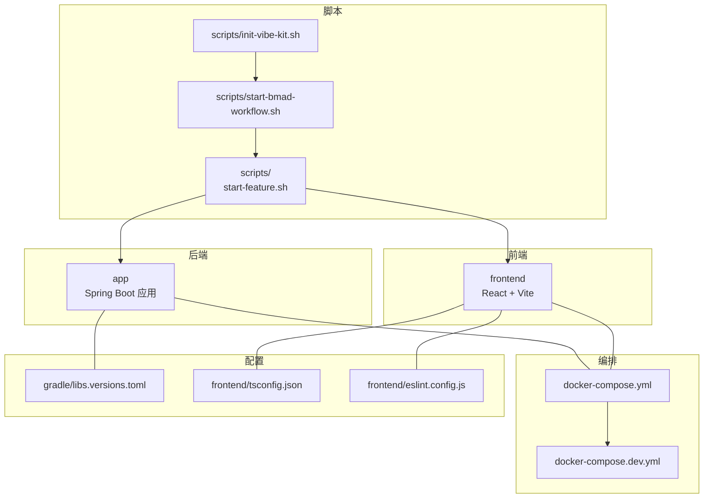
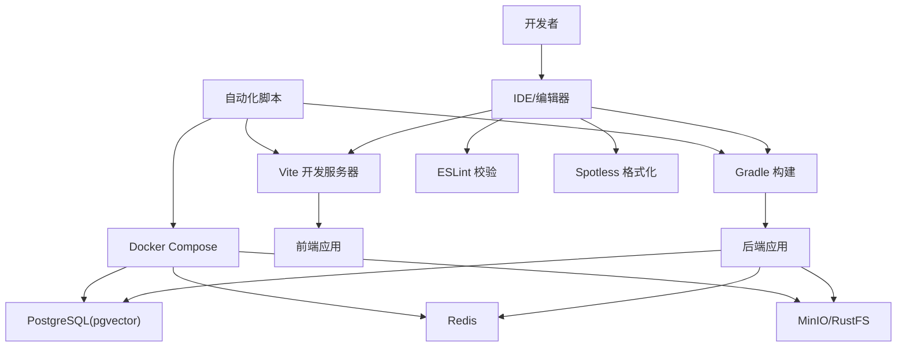
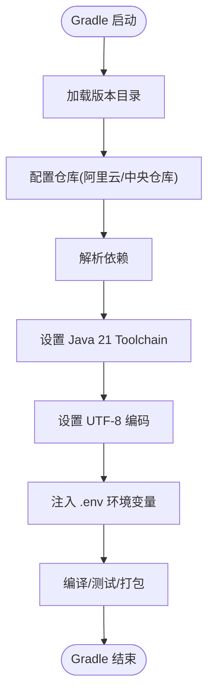
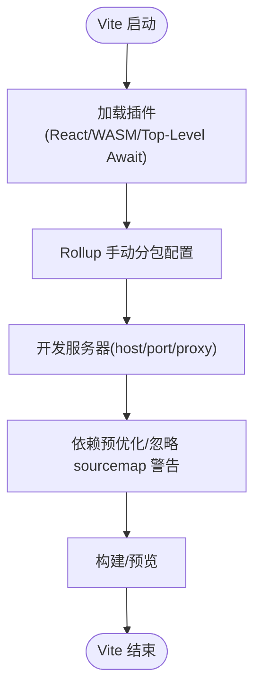
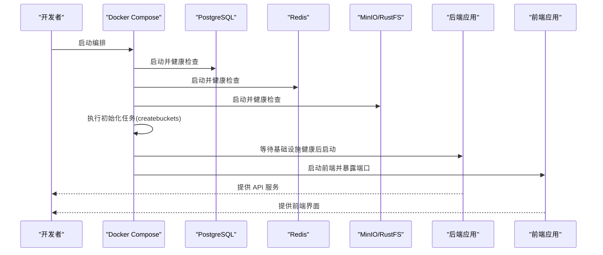
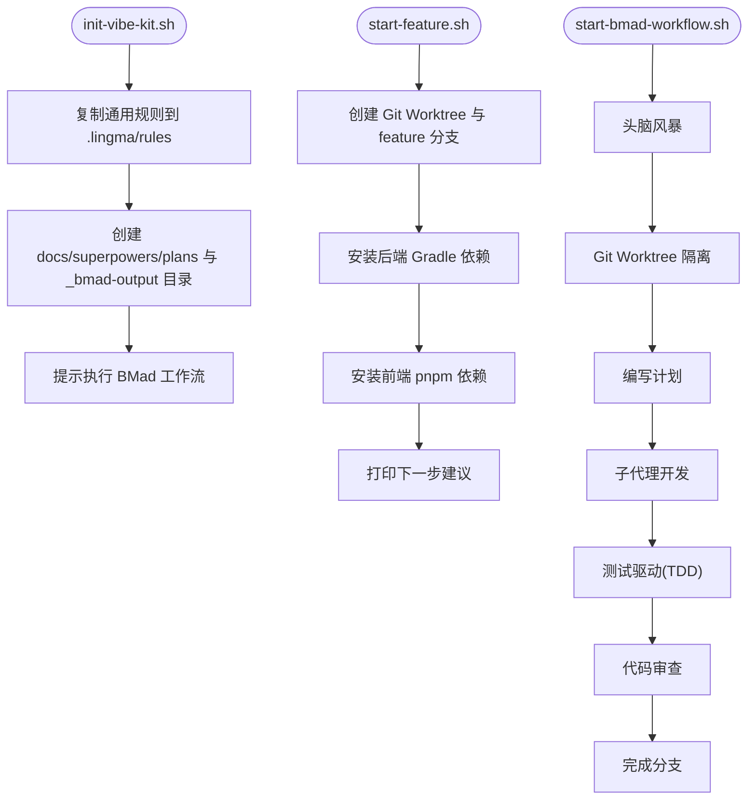
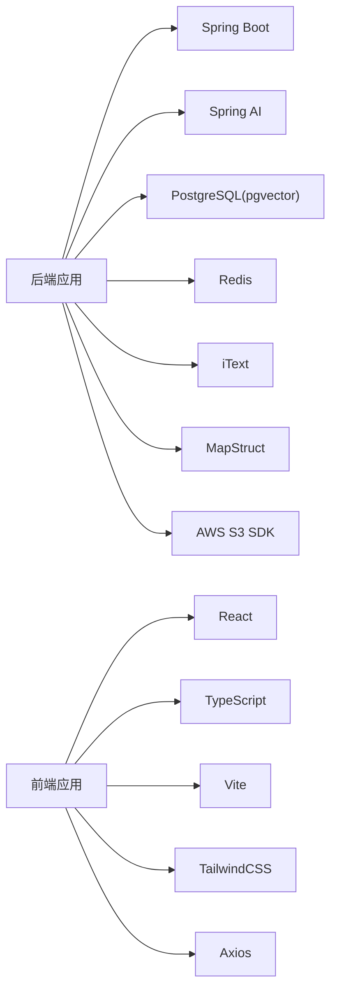

# 开发工具和脚本

<cite>
**本文引用的文件**   
- [settings.gradle](file://settings.gradle)
- [app/build.gradle](file://app/build.gradle)
- [gradle/libs.versions.toml](file://gradle/libs.versions.toml)
- [gradlew.bat](file://gradlew.bat)
- [frontend/package.json](file://frontend/package.json)
- [frontend/vite.config.ts](file://frontend/vite.config.ts)
- [frontend/eslint.config.js](file://frontend/eslint.config.js)
- [frontend/postcss.config.js](file://frontend/postcss.config.js)
- [frontend/tsconfig.json](file://frontend/tsconfig.json)
- [docker-compose.yml](file://docker-compose.yml)
- [docker-compose.dev.yml](file://docker-compose.dev.yml)
- [scripts/start-feature.sh](file://scripts/start-feature.sh)
- [scripts/start-bmad-workflow.sh](file://scripts/start-bmad-workflow.sh)
- [scripts/init-vibe-kit.sh](file://scripts/init-vibe-kit.sh)
- [.opencode/package.json](file://.opencode/package.json)
- [README.md](file://README.md)
- [app/src/main/resources/logback-spring.xml](file://app/src/main/resources/logback-spring.xml)
</cite>

## 目录
1. [简介](#简介)
2. [项目结构](#项目结构)
3. [核心组件](#核心组件)
4. [架构总览](#架构总览)
5. [详细组件分析](#详细组件分析)
6. [依赖关系分析](#依赖关系分析)
7. [性能考虑](#性能考虑)
8. [故障排除指南](#故障排除指南)
9. [结论](#结论)
10. [附录](#附录)

## 简介
本指南面向面试指南平台的开发者，系统讲解开发工具链与脚本的配置与使用，涵盖：
- IDE 设置与插件推荐
- 代码格式化与质量工具（ESLint、Prettier、Spotless 等）
- 构建脚本（Gradle、Vite）与打包发布
- 开发辅助脚本（功能分支创建、BMad 工作流启动、环境初始化）
- 调试技巧（远程调试、性能分析、内存分析）
- 版本控制最佳实践（分支策略、提交规范、合并流程）
- 开发效率工具（快捷键、模板、自动化任务）
- 环境故障排除与问题定位

## 项目结构
项目采用前后端分离与多模块组合的组织方式：
- 后端 app：Spring Boot 应用，包含模块化业务代码与资源
- 前端 frontend：React + TypeScript + Vite 应用
- 脚本 scripts：功能分支与 BMad 工作流自动化
- Docker 编排：docker-compose.yml 与 docker-compose.dev.yml
- 版本与依赖：Gradle 版本目录与前端包管理

图表来源
- [settings.gradle:1-24](file://settings.gradle#L1-L24)
- [app/build.gradle:1-136](file://app/build.gradle#L1-L136)
- [gradle/libs.versions.toml:1-30](file://gradle/libs.versions.toml#L1-L30)
- [frontend/package.json:1-47](file://frontend/package.json#L1-L47)
- [frontend/vite.config.ts:1-42](file://frontend/vite.config.ts#L1-L42)
- [frontend/tsconfig.json:1-22](file://frontend/tsconfig.json#L1-L22)
- [frontend/eslint.config.js:1-24](file://frontend/eslint.config.js#L1-L24)
- [docker-compose.yml:1-197](file://docker-compose.yml#L1-L197)
- [docker-compose.dev.yml:1-64](file://docker-compose.dev.yml#L1-L64)

章节来源
- [README.md:210-247](file://README.md#L210-L247)

## 核心组件
- Gradle 多模块与依赖管理：通过版本目录集中管理依赖版本，统一 Java Toolchain 与编码设置，支持 bootRun 注入环境变量与 UTF-8 编码
- Vite 前端构建：插件体系（React、WASM、Top-Level Await），构建分包策略与开发代理
- ESLint/Prettier：前端代码质量与风格统一
- Docker 编排：PostgreSQL(pgvector)、Redis、MinIO/RustFS、后端与前端服务
- 自动化脚本：功能分支隔离、BMad 7步工作流、Vibe Kit 初始化

章节来源
- [settings.gradle:8-24](file://settings.gradle#L8-L24)
- [app/build.gradle:23-136](file://app/build.gradle#L23-L136)
- [gradle/libs.versions.toml:1-30](file://gradle/libs.versions.toml#L1-L30)
- [frontend/package.json:6-10](file://frontend/package.json#L6-L10)
- [frontend/vite.config.ts:7-42](file://frontend/vite.config.ts#L7-L42)
- [frontend/eslint.config.js:8-24](file://frontend/eslint.config.js#L8-L24)
- [docker-compose.yml:1-197](file://docker-compose.yml#L1-L197)
- [scripts/start-feature.sh:1-68](file://scripts/start-feature.sh#L1-L68)
- [scripts/start-bmad-workflow.sh:1-253](file://scripts/start-bmad-workflow.sh#L1-L253)
- [scripts/init-vibe-kit.sh:1-42](file://scripts/init-vibe-kit.sh#L1-L42)

## 架构总览
下图展示开发工具链与脚本在整体系统中的位置与交互。

图表来源
- [app/build.gradle:23-136](file://app/build.gradle#L23-L136)
- [frontend/vite.config.ts:7-42](file://frontend/vite.config.ts#L7-L42)
- [frontend/eslint.config.js:8-24](file://frontend/eslint.config.js#L8-L24)
- [docker-compose.yml:1-197](file://docker-compose.yml#L1-L197)
- [scripts/start-feature.sh:43-51](file://scripts/start-feature.sh#L43-L51)
- [scripts/start-bmad-workflow.sh:72-115](file://scripts/start-bmad-workflow.sh#L72-L115)

## 详细组件分析

### Gradle 构建与依赖管理
- 版本与仓库：通过版本目录集中管理 Spring Boot、Spring AI、MapStruct、iText、AWS SDK 等依赖版本；使用阿里云镜像与 Gradle 官方插件门户
- Java Toolchain：统一使用 Java 21
- 编码与测试：全局 UTF-8 编码；使用 JUnit 5 平台
- bootRun 环境注入：从根目录 .env 注入环境变量，支持 UTF-8 控制台输出

图表来源
- [gradle/libs.versions.toml:3-29](file://gradle/libs.versions.toml#L3-L29)
- [app/build.gradle:15-136](file://app/build.gradle#L15-L136)

章节来源
- [settings.gradle:8-24](file://settings.gradle#L8-L24)
- [app/build.gradle:89-136](file://app/build.gradle#L89-L136)
- [gradle/libs.versions.toml:1-30](file://gradle/libs.versions.toml#L1-L30)
- [gradlew.bat:36-75](file://gradlew.bat#L36-L75)

### Vite 构建与开发服务器
- 插件：React、WASM、Top-Level Await
- 构建分包：手动拆分 react-vendor、ui-vendor、syntax-highlighter，优化首屏与缓存
- 开发服务器：host=0.0.0.0、port=5173、/api 代理至后端 8080
- 依赖预优化：忽略特定第三方 sourcemap 警告

图表来源
- [frontend/vite.config.ts:7-42](file://frontend/vite.config.ts#L7-L42)

章节来源
- [frontend/package.json:6-10](file://frontend/package.json#L6-L10)
- [frontend/vite.config.ts:7-42](file://frontend/vite.config.ts#L7-L42)

### 代码质量与格式化（ESLint、Prettier、Spotless）
- ESLint：基于 flat 配置，启用 TS/React Hooks/React Refresh 推荐规则，限定 TS 文件范围
- Prettier：作为格式化工具，建议与 ESLint 配合使用，统一缩进、引号、尾逗号等风格
- Spotless（后端）：建议在 Gradle 中集成，统一 Java/SQL/XML 等文件格式；可结合 Git Hooks 在提交前格式化

章节来源
- [frontend/eslint.config.js:8-24](file://frontend/eslint.config.js#L8-L24)
- [frontend/tsconfig.json:2-18](file://frontend/tsconfig.json#L2-L18)

### Docker 编排与本地开发
- docker-compose.yml：编排 PostgreSQL(pgvector)、Redis、MinIO、初始化任务、后端、前端
- docker-compose.dev.yml：本地开发依赖（PostgreSQL、Redis、RustFS），便于快速启动
- 健康检查与依赖顺序：后端等待基础设施健康与初始化任务完成

图表来源
- [docker-compose.yml:13-171](file://docker-compose.yml#L13-L171)
- [docker-compose.dev.yml:7-58](file://docker-compose.dev.yml#L7-L58)

章节来源
- [docker-compose.yml:1-197](file://docker-compose.yml#L1-L197)
- [docker-compose.dev.yml:1-64](file://docker-compose.dev.yml#L1-L64)

### 开发辅助脚本
- init-vibe-kit.sh：初始化 Vibe Coding 环境，复制通用规则、创建文档目录、提示后续步骤
- start-feature.sh：创建 Git Worktree 与隔离分支，安装后端/前端依赖，给出下一步建议
- start-bmad-workflow.sh：引导完成 BMad 7步标准化开发流程，包含头脑风暴、计划、子代理开发、TDD、代码审查、完成分支等步骤

图表来源
- [scripts/init-vibe-kit.sh:1-42](file://scripts/init-vibe-kit.sh#L1-L42)
- [scripts/start-feature.sh:1-68](file://scripts/start-feature.sh#L1-L68)
- [scripts/start-bmad-workflow.sh:1-253](file://scripts/start-bmad-workflow.sh#L1-L253)

章节来源
- [scripts/init-vibe-kit.sh:1-42](file://scripts/init-vibe-kit.sh#L1-L42)
- [scripts/start-feature.sh:1-68](file://scripts/start-feature.sh#L1-L68)
- [scripts/start-bmad-workflow.sh:1-253](file://scripts/start-bmad-workflow.sh#L1-L253)

### 版本控制最佳实践
- 分支策略：使用 feature/<name> 隔离开发，配合 Git Worktree 实现多任务并行
- 提交规范：建议采用约定式提交（如 feat/fix/docs/chore），并在 PR 描述中引用相关计划/设计文档
- 合并流程：先 TDD 验证，再 Code Review，最后合并至 main 或创建 PR

章节来源
- [scripts/start-bmad-workflow.sh:182-231](file://scripts/start-bmad-workflow.sh#L182-L231)
- [scripts/start-feature.sh:10-38](file://scripts/start-feature.sh#L10-L38)

### 开发效率工具
- IDE 快捷键：建议配置常用操作（格式化、快速导入、重构、运行/调试）
- 模板代码：在 scripts 与文档目录中沉淀通用模板（设计/计划/技能文件），减少重复劳动
- 自动化任务：Gradle 任务注入 .env、Vite 插件链、Docker 一键启动

章节来源
- [scripts/init-vibe-kit.sh:35-40](file://scripts/init-vibe-kit.sh#L35-L40)
- [frontend/vite.config.ts:7-42](file://frontend/vite.config.ts#L7-L42)
- [app/build.gradle:104-135](file://app/build.gradle#L104-L135)

## 依赖关系分析
- 后端依赖：Spring Boot、Spring AI、PostgreSQL、Redisson、iText、AWS S3 SDK、MapStruct、Lombok、SpringDoc、Tika 等
- 前端依赖：React、TypeScript、Vite、TailwindCSS、Axios、Recharts、Lucide React、ONNX Runtime Web 等
- 版本管理：libs.versions.toml 统一版本，settings.gradle 配置插件与仓库

图表来源
- [app/build.gradle:23-87](file://app/build.gradle#L23-L87)
- [frontend/package.json:11-28](file://frontend/package.json#L11-L28)
- [gradle/libs.versions.toml:3-29](file://gradle/libs.versions.toml#L3-L29)

章节来源
- [app/build.gradle:23-87](file://app/build.gradle#L23-L87)
- [frontend/package.json:11-28](file://frontend/package.json#L11-L28)
- [gradle/libs.versions.toml:1-30](file://gradle/libs.versions.toml#L1-L30)

## 性能考虑
- 前端构建：合理使用 Rollup 手动分包，减少单包体积；开启 Top-Level Await 与 WASM 优化
- 后端启动：通过 bootRun 注入 .env 与 UTF-8 编码，避免控制台乱码与字符集不一致导致的性能问题
- Docker：健康检查与依赖顺序确保服务稳定启动，减少冷启动失败

章节来源
- [frontend/vite.config.ts:13-23](file://frontend/vite.config.ts#L13-L23)
- [app/build.gradle:104-135](file://app/build.gradle#L104-L135)
- [docker-compose.yml:31-35](file://docker-compose.yml#L31-L35)

## 故障排除指南
- Windows PowerShell 中文乱码：统一 Gradle/Logback/控制台编码为 UTF-8；必要时在 PowerShell 配置中设置编码
- Gradle 启动失败：检查 JAVA_HOME 与 Java 版本；确认阿里云仓库可达
- 前端代理无效：确认 Vite 代理目标与端口（/api -> 8080），防火墙放行
- Docker 服务未健康：查看健康检查日志，确认数据库初始化脚本与 MinIO 初始化任务完成
- .env 注入问题：确认 .env 文件存在且格式正确；Gradle bootRun 仅读取进程环境变量

章节来源
- [README.md:477-494](file://README.md#L477-L494)
- [gradlew.bat:39-67](file://gradlew.bat#L39-L67)
- [frontend/vite.config.ts:27-32](file://frontend/vite.config.ts#L27-L32)
- [docker-compose.yml:31-35](file://docker-compose.yml#L31-L35)
- [app/build.gradle:104-135](file://app/build.gradle#L104-L135)

## 结论
本指南围绕面试指南平台的开发工具链与脚本，给出了从环境配置、构建流程、质量工具、调试与性能优化，到版本控制与效率工具的全栈实践建议。配合自动化脚本与 Docker 编排，可显著提升开发效率与交付质量。

## 附录
- 开发环境初始化：执行 init-vibe-kit.sh，随后使用 start-bmad-workflow.sh 启动 BMad 7步流程
- 功能分支创建：使用 start-feature.sh 一键创建隔离开发环境
- 本地依赖服务：使用 docker-compose.dev.yml 快速启动 PostgreSQL、Redis、RustFS
- 后端运行：./gradlew bootRun；前端运行：cd frontend && pnpm dev

章节来源
- [scripts/init-vibe-kit.sh:35-40](file://scripts/init-vibe-kit.sh#L35-L40)
- [scripts/start-feature.sh:53-67](file://scripts/start-feature.sh#L53-L67)
- [docker-compose.dev.yml:1-64](file://docker-compose.dev.yml#L1-L64)
- [README.md:317-336](file://README.md#L317-L336)