# BMA工作流启动脚本

<cite>
**本文档引用的文件**
- [start-bmad-workflow.sh](file://scripts/start-bmad-workflow.sh)
- [start-feature.sh](file://scripts/start-feature.sh)
- [README.md](file://README.md)
- [config.yaml](file://_bmad/bmm/config.yaml)
- [project-context.md](file://_bmad-output/project-context.md)
- [bmad-brainstorming/SKILL.md](file://.opencode/skills/bmad-brainstorming/SKILL.md)
- [bmad-code-review/SKILL.md](file://.opencode/skills/bmad-code-review/SKILL.md)
- [bmad-dev-story/SKILL.md](file://.opencode/skills/bmad-dev-story/SKILL.md)
- [bmad-workflow-builder/SKILL.md](file://.opencode/skills/bmad-workflow-builder/SKILL.md)
</cite>

## 目录
1. [简介](#简介)
2. [项目结构](#项目结构)
3. [核心组件](#核心组件)
4. [架构概览](#架构概览)
5. [详细组件分析](#详细组件分析)
6. [依赖关系分析](#依赖关系分析)
7. [性能考虑](#性能考虑)
8. [故障排除指南](#故障排除指南)
9. [结论](#结论)

## 简介

BMA工作流启动脚本是面试指南平台中用于自动化BMA（Brainstorming, Methodical Analysis, Design Thinking, Implementation）开发流程的核心工具。该脚本实现了7步标准化开发流程，通过集成BMA系统的工作流模板和技能模块，为开发者提供从需求分析到实现的完整工作流支持。

该启动脚本特别针对面试指南平台的技术栈和开发规范进行了定制，包括Spring Boot后端、React前端、PostgreSQL数据库和Redis缓存等技术组件。通过使用通义灵码的AI技能，脚本能够指导开发者按照最佳实践完成每个开发阶段的任务。

## 项目结构

面试指南平台采用模块化架构，BMA工作流启动脚本位于scripts目录下，与BMA系统配置文件和技能模块紧密集成：

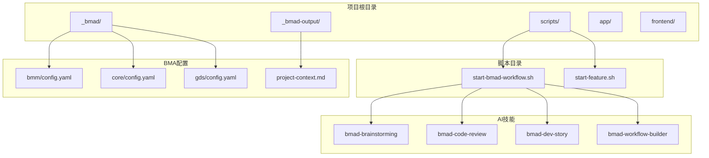

**图表来源**
- [start-bmad-workflow.sh:1-253](file://scripts/start-bmad-workflow.sh#L1-L253)
- [config.yaml:1-17](file://_bmad/bmm/config.yaml#L1-L17)
- [project-context.md:1-106](file://_bmad-output/project-context.md#L1-L106)

**章节来源**
- [start-bmad-workflow.sh:1-253](file://scripts/start-bmad-workflow.sh#L1-L253)
- [README.md:210-247](file://README.md#L210-L247)

## 核心组件

### 启动脚本核心功能

BMA工作流启动脚本提供了完整的7步开发流程自动化，每个步骤都与特定的AI技能集成：

1. **头脑风暴阶段** - 使用bmad-brainstorming技能澄清需求和目标
2. **Git Worktree隔离** - 创建独立的开发环境，确保代码隔离
3. **编写计划** - 使用writing-plans技能生成详细的开发计划
4. **子代理开发** - 通过subagent-driven-development技能实现自动化开发
5. **测试驱动** - 使用test-driven-development技能确保代码质量
6. **代码审查** - 通过bmad-code-review技能进行多层次代码审查
7. **完成分支** - 使用finishing-a-development-branch技能完成开发流程

### 环境配置管理

脚本自动处理项目环境配置，包括：
- Git工作树的创建和管理
- 后端Gradle依赖的安装
- 前端pnpm依赖的安装
- 开发环境的初始化

**章节来源**
- [start-bmad-workflow.sh:54-253](file://scripts/start-bmad-workflow.sh#L54-L253)
- [start-feature.sh:1-68](file://scripts/start-feature.sh#L1-L68)

## 架构概览

BMA工作流启动脚本的架构设计体现了现代DevOps的最佳实践，通过模块化设计实现了高度的可扩展性和可维护性：

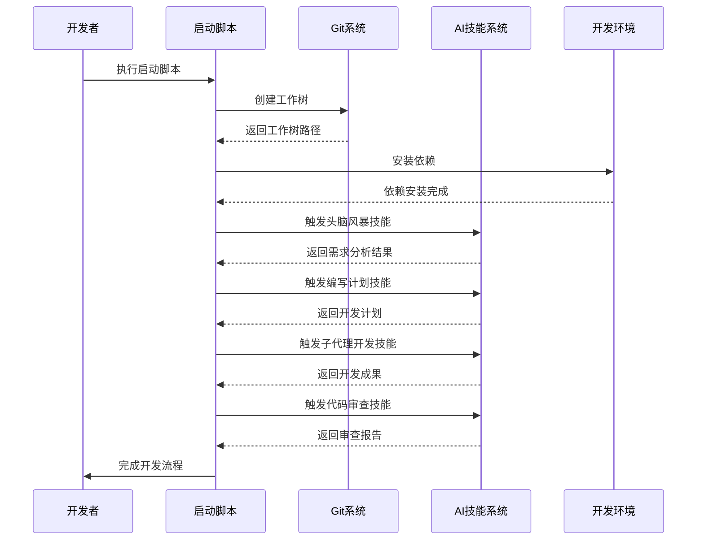

**图表来源**
- [start-bmad-workflow.sh:72-253](file://scripts/start-bmad-workflow.sh#L72-L253)
- [bmad-brainstorming/SKILL.md:1-7](file://.opencode/skills/bmad-brainstorming/SKILL.md#L1-L7)
- [bmad-code-review/SKILL.md:1-7](file://.opencode/skills/bmad-code-review/SKILL.md#L1-L7)

### 配置管理系统

BMA系统通过多个配置文件实现灵活的配置管理：

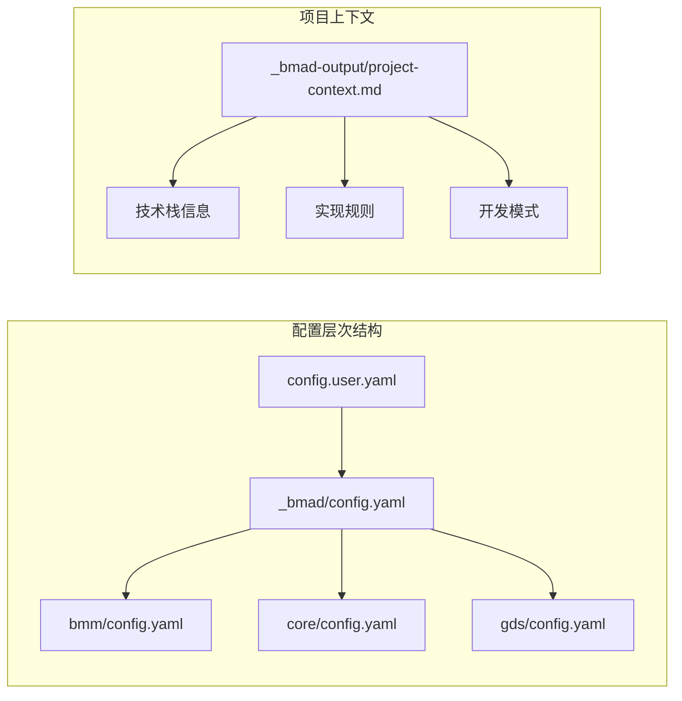

**图表来源**
- [config.yaml:1-17](file://_bmad/bmm/config.yaml#L1-L17)
- [project-context.md:15-106](file://_bmad-output/project-context.md#L15-L106)

**章节来源**
- [config.yaml:1-17](file://_bmad/bmm/config.yaml#L1-L17)
- [project-context.md:1-106](file://_bmad-output/project-context.md#L1-L106)

## 详细组件分析

### 7步开发流程详解

#### 步骤1：头脑风暴（Brainstorming）

头脑风暴阶段是整个BMA流程的起点，通过AI技能帮助团队澄清需求、确定目标和制定成功标准：

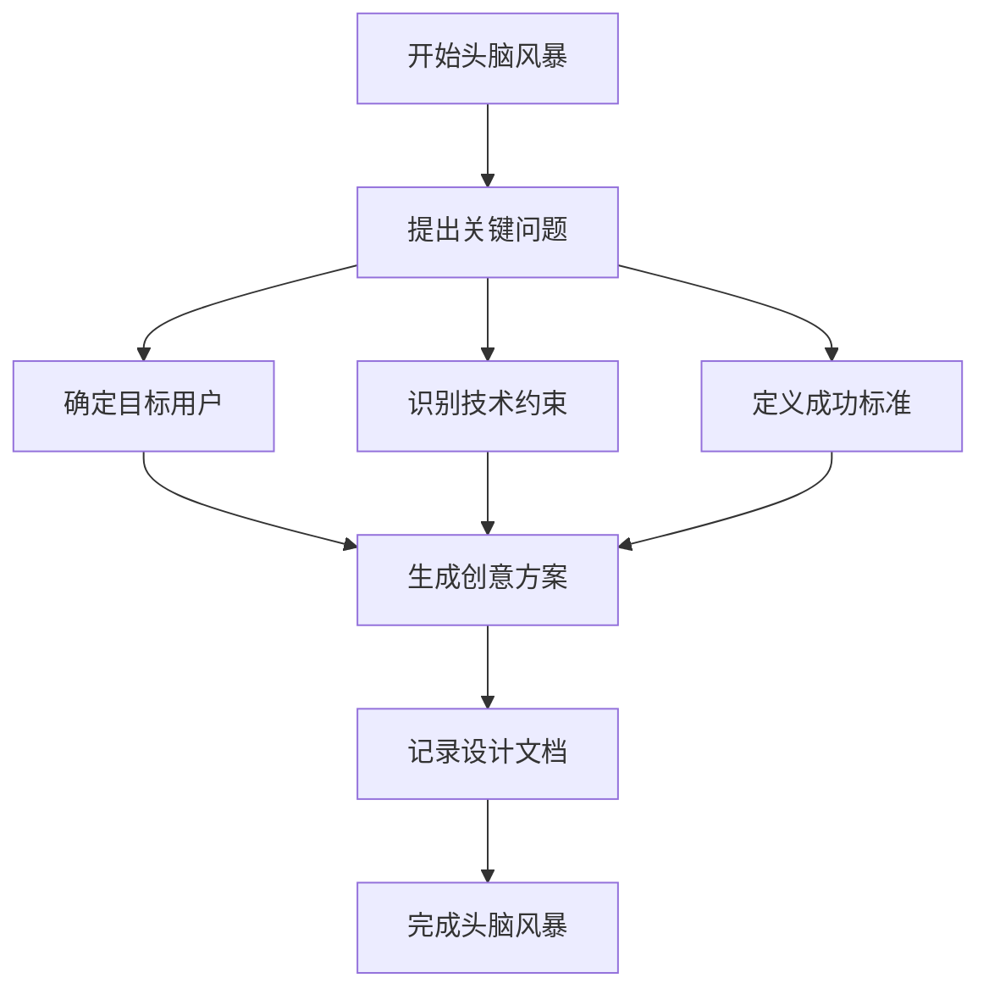

**图表来源**
- [start-bmad-workflow.sh:55-68](file://scripts/start-bmad-workflow.sh#L55-L68)

#### 步骤2：Git Worktree隔离

Git工作树隔离确保每个功能开发都在独立的环境中进行，避免代码冲突和环境污染：

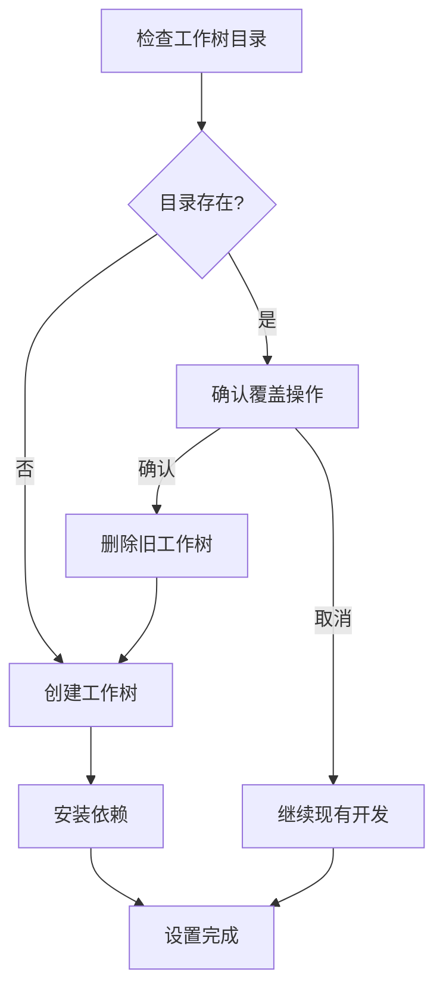

**图表来源**
- [start-bmad-workflow.sh:72-115](file://scripts/start-bmad-workflow.sh#L72-L115)
- [start-feature.sh:19-51](file://scripts/start-feature.sh#L19-L51)

#### 步骤3：编写计划（Writing Plans）

编写计划阶段将头脑风暴的结果转化为具体可执行的开发任务：

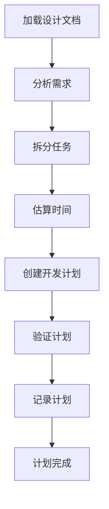

**图表来源**
- [start-bmad-workflow.sh:117-137](file://scripts/start-bmad-workflow.sh#L117-L137)

#### 步骤4：子代理开发（Subagent-Driven Development）

子代理开发是BMA流程的核心创新，通过AI技能实现自动化开发：

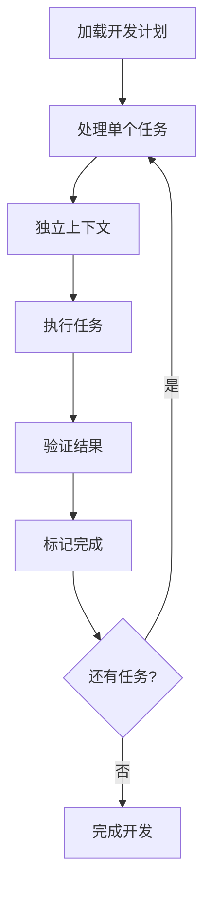

**图表来源**
- [start-bmad-workflow.sh:139-160](file://scripts/start-bmad-workflow.sh#L139-L160)

#### 步骤5：测试驱动（TDD）

测试驱动开发确保代码质量和可维护性：

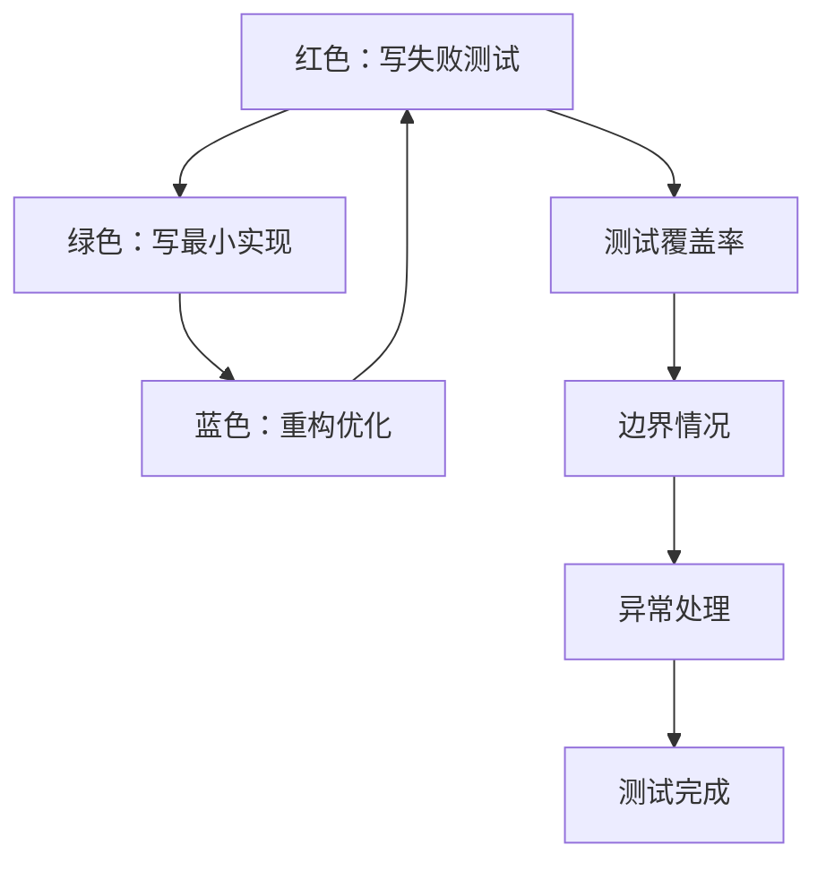

**图表来源**
- [start-bmad-workflow.sh:162-180](file://scripts/start-bmad-workflow.sh#L162-L180)

#### 步骤6：代码审查（Code Review）

多层次代码审查确保代码质量：

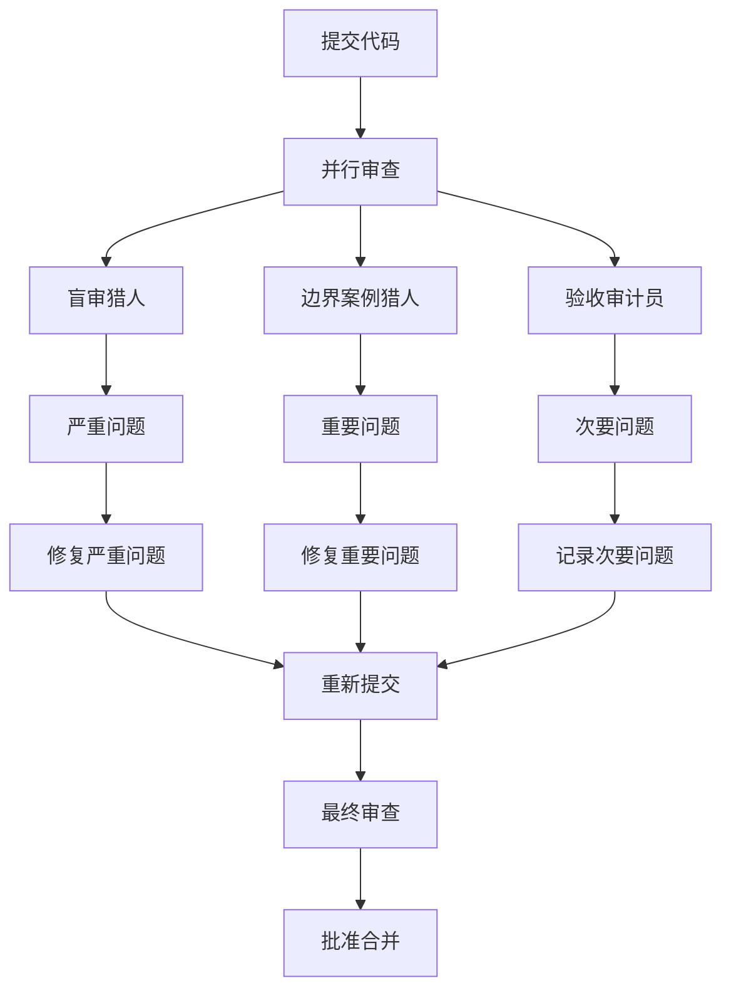

**图表来源**
- [start-bmad-workflow.sh:182-210](file://scripts/start-bmad-workflow.sh#L182-L210)

#### 步骤7：完成分支（Finishing a Development Branch）

最终分支完成阶段确保开发流程的完整性：

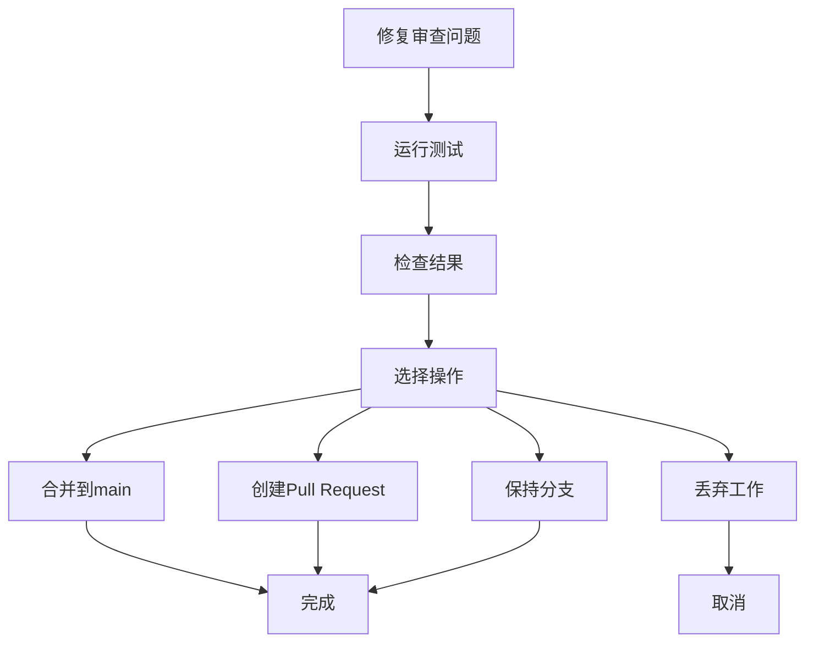

**图表来源**
- [start-bmad-workflow.sh:212-236](file://scripts/start-bmad-workflow.sh#L212-L236)

**章节来源**
- [start-bmad-workflow.sh:54-253](file://scripts/start-bmad-workflow.sh#L54-L253)

### AI技能集成分析

BMA系统通过多个专门的AI技能实现不同开发阶段的功能：

#### 头脑风暴技能（bmad-brainstorming）

该技能专注于创意生成和需求澄清，通过结构化的方法帮助团队明确项目目标和约束条件。

#### 代码审查技能（bmad-code-review）

代码审查技能采用三层并行审查机制：
- **盲审猎人**：仅查看代码差异，提供客观反馈
- **边界案例猎人**：结合项目架构分析潜在问题
- **验收审计员**：对照验收标准评估代码质量

#### 子代理开发技能（bmad-dev-story）

该技能实现自动化代码生成，通过独立上下文执行每个开发任务，确保代码质量和一致性。

**章节来源**
- [bmad-brainstorming/SKILL.md:1-7](file://.opencode/skills/bmad-brainstorming/SKILL.md#L1-L7)
- [bmad-code-review/SKILL.md:1-7](file://.opencode/skills/bmad-code-review/SKILL.md#L1-L7)
- [bmad-dev-story/SKILL.md:1-7](file://.opencode/skills/bmad-dev-story/SKILL.md#L1-L7)

## 依赖关系分析

### 技术栈依赖

面试指南平台的BMA工作流启动脚本依赖于以下核心技术组件：

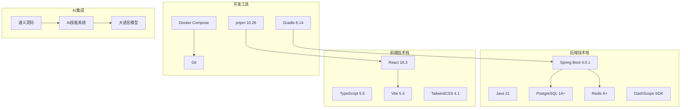

**图表来源**
- [README.md:51-91](file://README.md#L51-L91)
- [start-bmad-workflow.sh:100-108](file://scripts/start-bmad-workflow.sh#L100-L108)

### 配置依赖关系

BMA系统通过多层次配置实现灵活的环境管理：

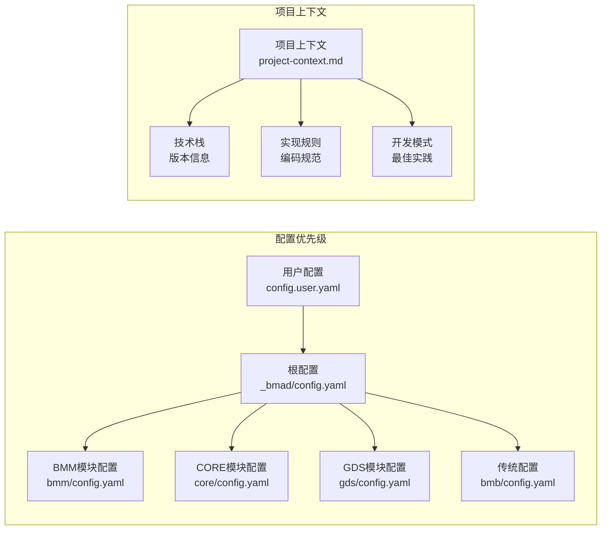

**图表来源**
- [config.yaml:1-17](file://_bmad/bmm/config.yaml#L1-L17)
- [project-context.md:15-106](file://_bmad-output/project-context.md#L15-L106)

**章节来源**
- [README.md:51-91](file://README.md#L51-L91)
- [config.yaml:1-17](file://_bmad/bmm/config.yaml#L1-L17)
- [project-context.md:1-106](file://_bmad-output/project-context.md#L1-L106)

## 性能考虑

### 开发效率优化

BMA工作流启动脚本通过以下机制优化开发效率：

1. **并行处理**：多个AI技能可以并行执行，提高整体开发速度
2. **缓存机制**：利用Redis缓存减少重复计算和I/O操作
3. **增量构建**：Gradle增量编译减少构建时间
4. **工作树隔离**：避免环境冲突，减少调试时间

### 资源管理

系统采用合理的资源管理策略：
- **内存优化**：Spring Boot虚拟线程减少内存占用
- **数据库连接池**：合理配置连接池大小
- **缓存策略**：多级缓存减少数据库压力
- **异步处理**：Redis Stream实现异步任务处理

## 故障排除指南

### 常见问题及解决方案

#### Git工作树创建失败

**问题症状**：工作树创建过程中出现错误
**可能原因**：
- 分支名称冲突
- 权限不足
- Git配置问题

**解决步骤**：
1. 检查分支名称是否已存在
2. 确认Git权限设置
3. 验证Git配置
4. 手动清理工作树目录

#### 依赖安装失败

**问题症状**：Gradle或pnpm安装过程中报错
**可能原因**：
- 网络连接问题
- 代理配置错误
- 依赖版本冲突

**解决步骤**：
1. 检查网络连接
2. 配置适当的代理设置
3. 清理缓存并重新安装
4. 检查依赖版本兼容性

#### AI技能执行异常

**问题症状**：AI技能执行过程中出现错误
**可能原因**：
- API密钥配置错误
- 模型调用限制
- 上下文过大

**解决步骤**：
1. 验证API密钥配置
2. 检查模型调用配额
3. 优化上下文长度
4. 查看错误日志

### 调试技巧

#### 日志分析

系统提供了完善的日志记录机制：
- **后端日志**：Spring Boot应用日志
- **前端日志**：React应用日志
- **AI技能日志**：技能执行过程日志
- **系统日志**：Docker容器日志

#### 性能监控

通过以下指标监控系统性能：
- **响应时间**：API请求响应时间
- **吞吐量**：系统处理能力
- **资源利用率**：CPU、内存、磁盘使用率
- **错误率**：系统错误发生频率

**章节来源**
- [start-bmad-workflow.sh:20-28](file://scripts/start-bmad-workflow.sh#L20-L28)
- [start-feature.sh:12-15](file://scripts/start-feature.sh#L12-L15)

## 结论

BMA工作流启动脚本为面试指南平台提供了一个完整的自动化开发解决方案。通过7步标准化流程、AI技能集成和灵活的配置管理，该脚本显著提高了开发效率和代码质量。

### 主要优势

1. **标准化流程**：确保每个开发阶段都有明确的目标和产出
2. **AI辅助开发**：通过技能系统实现部分自动化开发
3. **环境隔离**：Git工作树确保开发环境的独立性
4. **质量保证**：多层次代码审查确保代码质量
5. **灵活配置**：支持多种配置方式适应不同开发需求

### 未来发展方向

1. **持续改进**：根据实际使用反馈不断优化流程
2. **扩展技能**：增加更多AI技能支持复杂开发任务
3. **性能优化**：进一步提升系统性能和响应速度
4. **集成增强**：与其他开发工具和服务的深度集成

该BMA工作流启动脚本不仅适用于面试指南平台，也为其他类似项目提供了可借鉴的开发流程和最佳实践。