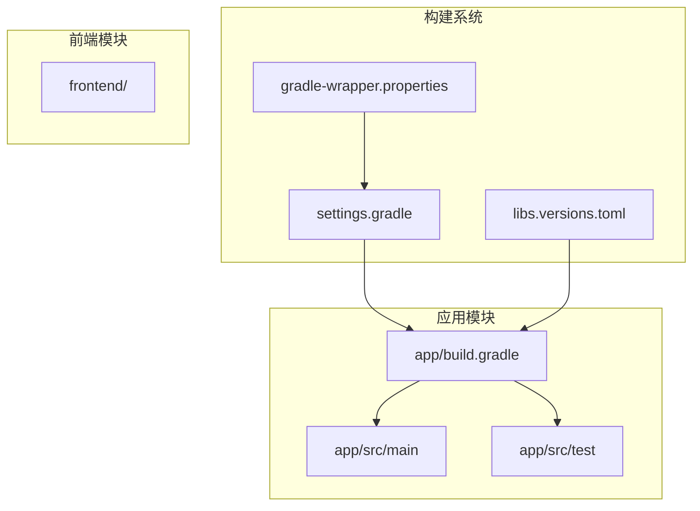
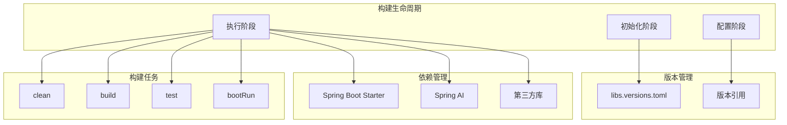
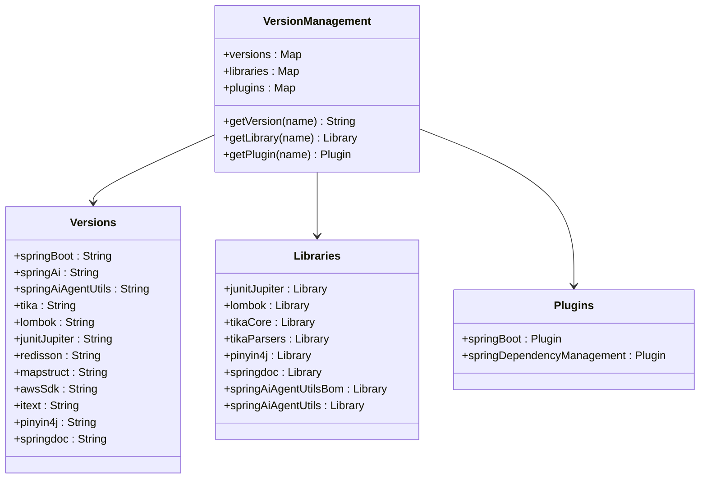
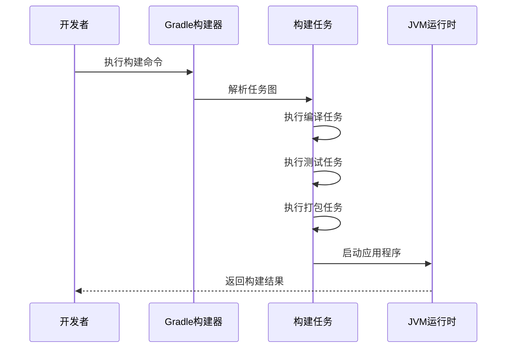
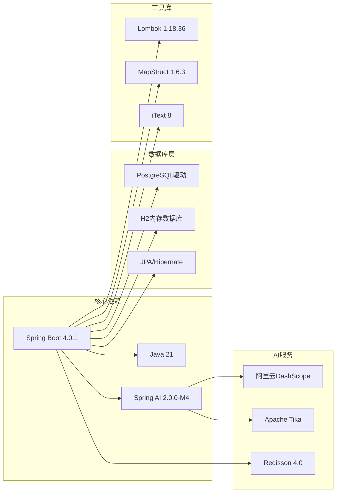
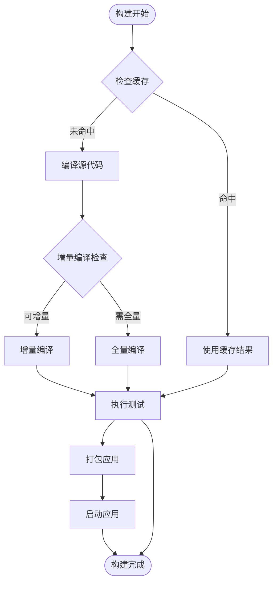
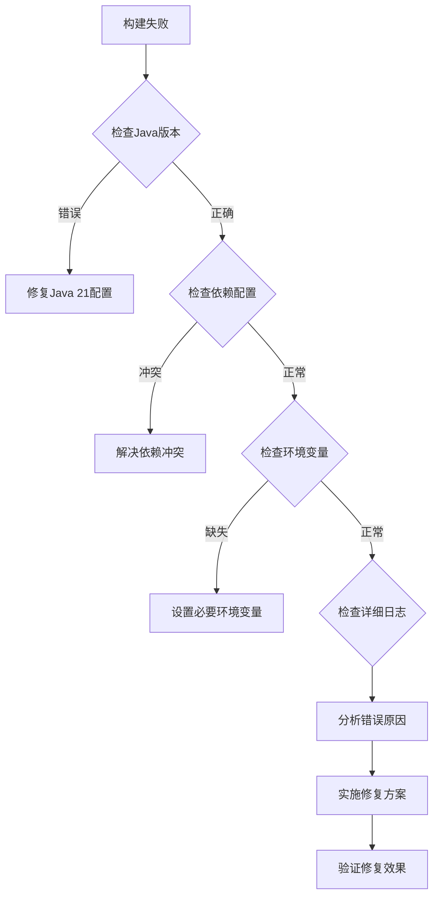

# Gradle构建配置

<cite>
**本文档引用的文件**
- [gradle/libs.versions.toml](file://gradle/libs.versions.toml)
- [app/build.gradle](file://app/build.gradle)
- [settings.gradle](file://settings.gradle)
- [gradle/wrapper/gradle-wrapper.properties](file://gradle/wrapper/gradle-wrapper.properties)
- [gradlew.bat](file://gradlew.bat)
- [app/src/test/resources/application-test.yml](file://app/src/test/resources/application-test.yml)
</cite>

## 目录
1. [简介](#简介)
2. [项目结构](#项目结构)
3. [核心组件](#核心组件)
4. [架构概览](#架构概览)
5. [详细组件分析](#详细组件分析)
6. [依赖关系分析](#依赖关系分析)
7. [性能考虑](#性能考虑)
8. [故障排除指南](#故障排除指南)
9. [结论](#结论)

## 简介

面试指南平台采用Gradle作为构建工具，基于Spring Boot 4.0 + Java 21技术栈构建。该构建系统通过现代化的版本管理机制和模块化配置，实现了高效的依赖管理和构建优化。

## 项目结构

该项目采用多模块架构，主要包含以下关键组件：

**图表来源**
- [settings.gradle:1-24](file://settings.gradle#L1-L24)
- [gradle/libs.versions.toml:1-30](file://gradle/libs.versions.toml#L1-L30)
- [app/build.gradle:1-136](file://app/build.gradle#L1-L136)

**章节来源**
- [settings.gradle:1-24](file://settings.gradle#L1-L24)
- [gradle/libs.versions.toml:1-30](file://gradle/libs.versions.toml#L1-L30)
- [app/build.gradle:1-136](file://app/build.gradle#L1-L136)

## 核心组件

### 版本管理配置

项目使用`libs.versions.toml`文件集中管理所有依赖版本，实现了版本统一控制和模块化管理：

**版本管理特性：**
- Spring Boot 4.0.1（模块化设计）
- Spring AI 2.0.0-M4（OpenAI兼容模式）
- Spring AI Agent Utils 0.7.0
- Apache Tika 2.9.2（文档解析）
- Lombok 1.18.36（代码简化）
- JUnit Jupiter 5.12.0（测试框架）
- Redisson 4.0.0（Redis客户端）
- MapStruct 1.6.3（对象映射）

**章节来源**
- [gradle/libs.versions.toml:3-16](file://gradle/libs.versions.toml#L3-L16)

### 构建脚本配置

主构建脚本`app/build.gradle`定义了完整的构建配置：

**核心配置要素：**
- Java 21工具链配置
- 多仓库源支持（阿里云、Maven Central、Spring里程碑）
- Spring Boot插件集成
- 依赖管理平台配置

**章节来源**
- [app/build.gradle:6-10](file://app/build.gradle#L6-L10)
- [app/build.gradle:15-21](file://app/build.gradle#L15-L21)

## 架构概览

**图表来源**
- [app/build.gradle:89-135](file://app/build.gradle#L89-L135)
- [gradle/libs.versions.toml:17-29](file://gradle/libs.versions.toml#L17-L29)

## 详细组件分析

### 版本管理组件

**图表来源**
- [gradle/libs.versions.toml:3-29](file://gradle/libs.versions.toml#L3-L29)

### 依赖管理配置

项目采用多层次依赖管理策略：

**Spring Boot生态系统：**
- Web MVC、Validation、Data JPA、WebSocket启动器
- Spring AI 2.0 + pgvector向量存储
- Spring Doc OpenAPI文档生成

**企业级功能：**
- AWS S3 SDK用于RustFS存储
- Redisson 4.0用于Redis连接
- iText 8用于PDF导出
- Apache Tika用于文档解析

**开发工具：**
- Lombok简化代码
- MapStruct对象映射
- JUnit 5测试框架

**章节来源**
- [app/build.gradle:23-87](file://app/build.gradle#L23-L87)

### 构建任务配置

**图表来源**
- [app/build.gradle:100-135](file://app/build.gradle#L100-L135)

**章节来源**
- [app/build.gradle:100-135](file://app/build.gradle#L100-L135)

## 依赖关系分析

**图表来源**
- [app/build.gradle:24-81](file://app/build.gradle#L24-L81)
- [gradle/libs.versions.toml:4-15](file://gradle/libs.versions.toml#L4-L15)

**章节来源**
- [app/build.gradle:24-81](file://app/build.gradle#L24-L81)
- [gradle/libs.versions.toml:4-15](file://gradle/libs.versions.toml#L4-L15)

## 性能考虑

### 构建优化策略

**并行构建配置：**
- Gradle Wrapper使用Gradle 8.14版本
- 支持多模块并行构建
- 缓存友好的任务设计

**增量编译优化：**
- Java 21工具链提升编译性能
- UTF-8编码统一配置
- 注解处理器优化

**依赖管理优化：**
- 版本对齐减少冲突
- 平台依赖管理
- 选择性依赖加载

### 构建任务优化

**图表来源**
- [app/build.gradle:89-102](file://app/build.gradle#L89-L102)

**章节来源**
- [app/build.gradle:89-102](file://app/build.gradle#L89-L102)
- [gradle/wrapper/gradle-wrapper.properties:1-8](file://gradle/wrapper/gradle-wrapper.properties#L1-L8)

## 故障排除指南

### 常见构建问题

**依赖冲突解决：**
- 使用版本对齐策略
- 通过BOM管理依赖版本
- 排除传递性依赖冲突

**环境配置问题：**
- 确保Java 21环境正确配置
- 验证Gradle Wrapper下载链接可用
- 检查代理服务器访问权限

**测试配置问题：**
- H2内存数据库配置验证
- Redis连接配置检查
- AI服务API密钥配置

### 诊断步骤

**图表来源**
- [app/src/test/resources/application-test.yml:1-165](file://app/src/test/resources/application-test.yml#L1-L165)

**章节来源**
- [app/src/test/resources/application-test.yml:1-165](file://app/src/test/resources/application-test.yml#L1-L165)

### 构建任务使用指南

**基础构建任务：**
- `./gradlew clean` - 清理构建输出
- `./gradlew build` - 执行完整构建流程
- `./gradlew test` - 运行单元测试
- `./gradlew bootRun` - 启动Spring Boot应用

**高级构建选项：**
- `./gradlew build --info` - 详细日志输出
- `./gradlew build --continue` - 继续执行其他任务
- `./gradlew build --parallel` - 并行构建启用

**章节来源**
- [gradlew.bat:1-93](file://gradlew.bat#L1-L93)

## 结论

面试指南平台的Gradle构建配置展现了现代Java项目的最佳实践：

**核心优势：**
- 模块化版本管理实现依赖统一控制
- Spring Boot 4.0 + Java 21技术栈提供高性能基础
- 完善的构建任务配置支持开发和生产环境需求
- 企业级功能集成（AI服务、文档处理、存储）配置完善

**建议改进：**
- 添加构建缓存配置以提升重复构建速度
- 实现CI/CD流水线集成
- 增加构建性能监控指标
- 完善多环境配置管理

该构建系统为面试指南平台提供了稳定、高效、可扩展的构建基础设施，支持从开发到生产的完整开发生命周期。