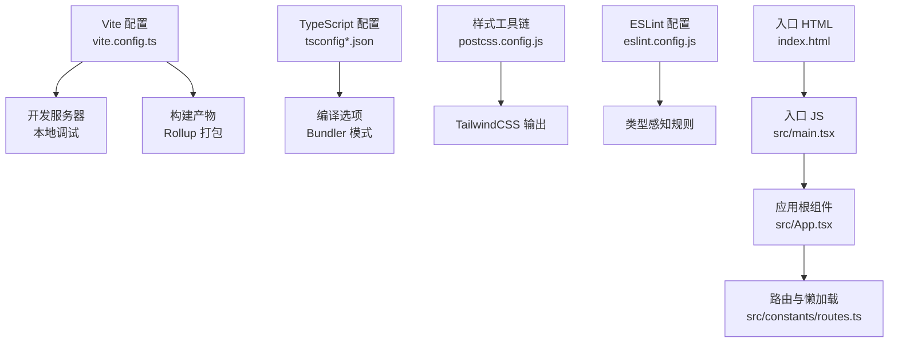
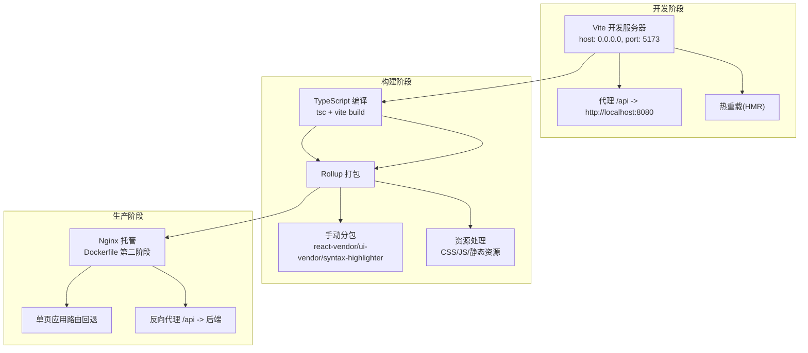
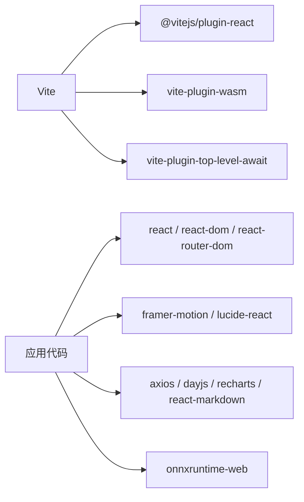

# Vite构建配置

<cite>
**本文引用的文件**
- [vite.config.ts](file://frontend/vite.config.ts)
- [package.json](file://frontend/package.json)
- [tsconfig.json](file://frontend/tsconfig.json)
- [tsconfig.app.json](file://frontend/tsconfig.app.json)
- [tsconfig.node.json](file://frontend/tsconfig.node.json)
- [postcss.config.js](file://frontend/postcss.config.js)
- [eslint.config.js](file://frontend/eslint.config.js)
- [index.html](file://frontend/index.html)
- [main.tsx](file://frontend/src/main.tsx)
- [App.tsx](file://frontend/src/App.tsx)
- [Layout.tsx](file://frontend/src/components/Layout.tsx)
- [routes.ts](file://frontend/src/constants/routes.ts)
- [request.ts](file://frontend/src/api/request.ts)
- [Dockerfile](file://frontend/Dockerfile)
- [README.md](file://frontend/README.md)
</cite>

## 目录
1. [简介](#简介)
2. [项目结构](#项目结构)
3. [核心组件](#核心组件)
4. [架构总览](#架构总览)
5. [详细组件分析](#详细组件分析)
6. [依赖分析](#依赖分析)
7. [性能考虑](#性能考虑)
8. [故障排除指南](#故障排除指南)
9. [结论](#结论)
10. [附录](#附录)

## 简介
本指南面向面试指南平台的前端工程，系统性讲解基于 Vite 的构建配置与使用方法，覆盖开发服务器、构建优化、插件体系、TypeScript 编译、资源处理、代码分割、打包优化、React 生态集成、开发与生产环境配置、以及常见问题排查。读者无需深入源码即可理解并高效使用该配置。

## 项目结构
前端工程位于 frontend 目录，采用 Vite + React + TypeScript 技术栈，配合 TailwindCSS、PostCSS、ESLint 等工具链。关键文件职责如下：
- 构建与脚本：vite.config.ts、package.json、Dockerfile
- 类型与编译：tsconfig*.json
- 样式与工具：postcss.config.js、eslint.config.js
- 入口与路由：index.html、src/main.tsx、src/App.tsx、src/constants/routes.ts
- 运行时资源：public（未列出）、src/assets（未列出）

图表来源
- [vite.config.ts:1-42](file://frontend/vite.config.ts#L1-L42)
- [tsconfig.json:1-22](file://frontend/tsconfig.json#L1-L22)
- [tsconfig.app.json:1-29](file://frontend/tsconfig.app.json#L1-L29)
- [postcss.config.js:1-7](file://frontend/postcss.config.js#L1-L7)
- [eslint.config.js:1-24](file://frontend/eslint.config.js#L1-L24)
- [index.html:1-18](file://frontend/index.html#L1-L18)
- [main.tsx:1-21](file://frontend/src/main.tsx#L1-L21)
- [App.tsx:1-379](file://frontend/src/App.tsx#L1-L379)
- [routes.ts:1-6](file://frontend/src/constants/routes.ts#L1-L6)

章节来源
- [vite.config.ts:1-42](file://frontend/vite.config.ts#L1-L42)
- [package.json:1-47](file://frontend/package.json#L1-L47)
- [tsconfig.json:1-22](file://frontend/tsconfig.json#L1-L22)
- [tsconfig.app.json:1-29](file://frontend/tsconfig.app.json#L1-L29)
- [tsconfig.node.json:1-11](file://frontend/tsconfig.node.json#L1-L11)
- [postcss.config.js:1-7](file://frontend/postcss.config.js#L1-L7)
- [eslint.config.js:1-24](file://frontend/eslint.config.js#L1-L24)
- [index.html:1-18](file://frontend/index.html#L1-L18)
- [main.tsx:1-21](file://frontend/src/main.tsx#L1-L21)
- [App.tsx:1-379](file://frontend/src/App.tsx#L1-L379)
- [routes.ts:1-6](file://frontend/src/constants/routes.ts#L1-L6)

## 核心组件
- Vite 配置与插件
  - 插件：@vitejs/plugin-react、vite-plugin-wasm、vite-plugin-top-level-await
  - 构建：Rollup 代码分割策略（手动分包 vendor chunk）
  - 开发：host/port/proxy/sourcemapIgnoreList/optimizeDeps
- TypeScript 配置
  - tsconfig.json：应用编译目标、模块解析、严格性
  - tsconfig.app.json：vite/client 类型、bundler 模式、严格性
  - tsconfig.node.json：Vite 配置文件类型检查
- 样式与工具
  - PostCSS：TailwindCSS + autoprefixer
  - ESLint：类型感知规则、React Hooks、React Refresh
- 入口与路由
  - index.html：CDN 加载 onnxruntime-web 与 vad-web
  - main.tsx：初始化深色模式、挂载 React 根节点
  - App.tsx：BrowserRouter + React.lazy + Suspense 路由
- API 请求
  - request.ts：Axios 实例、响应拦截器、上传超时与错误处理

章节来源
- [vite.config.ts:1-42](file://frontend/vite.config.ts#L1-L42)
- [tsconfig.json:1-22](file://frontend/tsconfig.json#L1-L22)
- [tsconfig.app.json:1-29](file://frontend/tsconfig.app.json#L1-L29)
- [tsconfig.node.json:1-11](file://frontend/tsconfig.node.json#L1-L11)
- [postcss.config.js:1-7](file://frontend/postcss.config.js#L1-L7)
- [eslint.config.js:1-24](file://frontend/eslint.config.js#L1-L24)
- [index.html:1-18](file://frontend/index.html#L1-L18)
- [main.tsx:1-21](file://frontend/src/main.tsx#L1-L21)
- [App.tsx:1-379](file://frontend/src/App.tsx#L1-L379)
- [request.ts:1-128](file://frontend/src/api/request.ts#L1-L128)

## 架构总览
下图展示从开发到生产的整体流程：Vite 开发服务器通过代理转发 /api 请求；TypeScript 在构建前进行类型检查与编译；PostCSS/TailwindCSS 生成样式；构建时按需拆分 vendor chunk；最终产物由 Nginx 托管。

图表来源
- [vite.config.ts:24-37](file://frontend/vite.config.ts#L24-L37)
- [vite.config.ts:13-23](file://frontend/vite.config.ts#L13-L23)
- [package.json:6-10](file://frontend/package.json#L6-L10)
- [Dockerfile:29-43](file://frontend/Dockerfile#L29-L43)

章节来源
- [vite.config.ts:1-42](file://frontend/vite.config.ts#L1-L42)
- [package.json:1-47](file://frontend/package.json#L1-L47)
- [Dockerfile:1-44](file://frontend/Dockerfile#L1-L44)

## 详细组件分析

### Vite 配置详解
- 插件体系
  - @vitejs/plugin-react：启用 React 快速刷新与 JSX 转换
  - vite-plugin-wasm：支持 WebAssembly 模块
  - vite-plugin-top-level-await：启用顶层 await，提升异步模块加载体验
- 构建优化
  - manualChunks：将 react、react-dom、react-router-dom 合并为 react-vendor；UI 库 framer-motion、lucide-react 合并为 ui-vendor；react-syntax-highlighter 合并为 syntax-highlighter，减少请求数并提升缓存命中率
- 开发服务器
  - host: 0.0.0.0，允许外部访问
  - port: 5173
  - proxy: 将 /api 前缀代理至后端服务 http://localhost:8080，便于前后端联调
  - sourcemapIgnoreList：忽略 @ricky0123/vad-web 的 sourcemap 警告，避免控制台噪音
  - optimizeDeps：空配置，表示不额外优化 vad-web（通过 CDN 加载）
- TypeScript 支持
  - 通过 tsconfig.app.json 的 types: ["vite/client"] 提供 Vite 环境类型
  - tsconfig.node.json 使 Vite 配置文件参与类型检查

章节来源
- [vite.config.ts:1-42](file://frontend/vite.config.ts#L1-L42)
- [tsconfig.app.json:8](file://frontend/tsconfig.app.json#L8)
- [tsconfig.node.json:9](file://frontend/tsconfig.node.json#L9)

### TypeScript 编译与类型检查
- tsconfig.json
  - 目标 ES2020，模块 ESNext，bundler 解析，严格模式与未使用检测
  - JSX 使用 react-jsx，noEmit 由 Vite 控制
- tsconfig.app.json
  - 针对应用的 bundler 模式，开启严格与副作用导入限制
  - types: ["vite/client"] 提供 Vite 环境类型
- tsconfig.node.json
  - 仅包含 Vite 配置文件，便于类型检查

章节来源
- [tsconfig.json:1-22](file://frontend/tsconfig.json#L1-L22)
- [tsconfig.app.json:1-29](file://frontend/tsconfig.app.json#L1-L29)
- [tsconfig.node.json:1-11](file://frontend/tsconfig.node.json#L1-L11)

### 样式与工具链
- PostCSS
  - 使用 @tailwindcss/postcss 与 autoprefixer，结合 TailwindCSS 生成样式
- ESLint
  - 类型感知规则、React Hooks、React Refresh，支持推荐与严格配置

章节来源
- [postcss.config.js:1-7](file://frontend/postcss.config.js#L1-L7)
- [eslint.config.js:1-24](file://frontend/eslint.config.js#L1-L24)
- [README.md:14-74](file://frontend/README.md#L14-L74)

### React 生态集成与路由
- 入口与主题
  - index.html 通过 CDN 加载 onnxruntime-web 与 vad-web
  - main.tsx 初始化深色模式，避免首屏闪烁
- 路由与懒加载
  - App.tsx 使用 BrowserRouter + React.lazy + Suspense 实现按需加载
  - Layout.tsx 提供导航与主题切换，统一面试弹窗逻辑
  - routes.ts 定义常量路由路径

章节来源
- [index.html:1-18](file://frontend/index.html#L1-L18)
- [main.tsx:1-21](file://frontend/src/main.tsx#L1-L21)
- [App.tsx:1-379](file://frontend/src/App.tsx#L1-L379)
- [Layout.tsx:1-257](file://frontend/src/components/Layout.tsx#L1-L257)
- [routes.ts:1-6](file://frontend/src/constants/routes.ts#L1-L6)

### API 请求与环境变量
- request.ts
  - Axios 实例，统一响应拦截器，遵循后端约定的 Result 结构
  - 上传接口设置较长超时时间，适配 Nginx proxy_read_timeout
  - 错误处理区分网络错误与后端错误，提供用户可读提示

章节来源
- [request.ts:1-128](file://frontend/src/api/request.ts#L1-L128)

### 构建流程与产物
- 开发脚本
  - dev：vite 启动开发服务器
  - build：先执行 tsc 再 vite build
  - preview：预览构建产物
- 构建产物
  - dist 目录，由 Dockerfile 第二阶段复制到 Nginx 默认目录

章节来源
- [package.json:6-10](file://frontend/package.json#L6-L10)
- [Dockerfile:22](file://frontend/Dockerfile#L22)
- [Dockerfile:32](file://frontend/Dockerfile#L32)

## 依赖分析
- 直接依赖
  - React 生态：react、react-dom、react-router-dom、@vitejs/plugin-react
  - UI 组件：framer-motion、lucide-react、react-syntax-highlighter
  - 工具库：axios、dayjs、recharts、react-markdown、react-icons
  - WASM/语音：onnxruntime-web、vite-plugin-wasm、vite-plugin-top-level-await
- 开发依赖
  - TypeScript、Vite、TailwindCSS、PostCSS、ESLint 及其插件
- 关系图

图表来源
- [vite.config.ts:8-12](file://frontend/vite.config.ts#L8-L12)
- [package.json:11-28](file://frontend/package.json#L11-L28)
- [package.json:29-44](file://frontend/package.json#L29-L44)

章节来源
- [package.json:1-47](file://frontend/package.json#L1-L47)
- [vite.config.ts:1-42](file://frontend/vite.config.ts#L1-L42)

## 性能考虑
- 代码分割
  - 通过 manualChunks 将常用第三方库拆分为独立 chunk，提升缓存复用与首屏加载效率
- 依赖预优化
  - optimizeDeps 留空，避免对通过 CDN 加载的 vad-web 进行重复优化
- 构建与打包
  - 使用 Vite 的原生打包能力，结合 RollupOptions 输出策略，减少冗余依赖
- 样式与资源
  - TailwindCSS 与 PostCSS 自动裁剪无用样式，建议在生产环境开启 CSS 压缩与图片优化
- 运行时
  - React.lazy + Suspense 实现按需加载，降低初始包体
  - CDN 加载 WASM 与 vad-web，缩短首包体积

章节来源
- [vite.config.ts:13-23](file://frontend/vite.config.ts#L13-L23)
- [vite.config.ts:38-40](file://frontend/vite.config.ts#L38-L40)
- [App.tsx:11-26](file://frontend/src/App.tsx#L11-L26)
- [index.html:8-11](file://frontend/index.html#L8-L11)

## 故障排除指南
- 构建失败
  - 症状：tsc 或 vite build 报错
  - 排查：检查 tsconfig.app.json 的 bundler 模式与 strict 设置；确认 types: ["vite/client"] 是否存在
  - 参考
    - [tsconfig.app.json:8](file://frontend/tsconfig.app.json#L8)
    - [tsconfig.app.json:20-25](file://frontend/tsconfig.app.json#L20-L25)
- 依赖问题
  - 症状：WASM 或 vad-web 无法加载
  - 排查：确认 index.html 中 CDN 地址可用；检查 vite.config.ts 的 optimizeDeps 是否影响 CDN 资源
  - 参考
    - [index.html:8-11](file://frontend/index.html#L8-L11)
    - [vite.config.ts:38-40](file://frontend/vite.config.ts#L38-L40)
- 性能瓶颈
  - 症状：首屏慢、chunk 数过多
  - 排查：调整 manualChunks 策略；确保未将过小模块独立拆分；检查是否引入了不必要的 polyfill
  - 参考
    - [vite.config.ts:16-20](file://frontend/vite.config.ts#L16-L20)
- 开发代理与跨域
  - 症状：/api 请求 404 或跨域
  - 排查：确认 vite.config.ts 的 proxy 配置与后端地址一致；浏览器 Network 面板验证转发
  - 参考
    - [vite.config.ts:27-32](file://frontend/vite.config.ts#L27-L32)
- sourcemap 警告
  - 症状：控制台出现 @ricky0123/vad-web 的 sourcemap 警告
  - 排查：确认 sourcemapIgnoreList 已正确忽略对应路径
  - 参考
    - [vite.config.ts:34-36](file://frontend/vite.config.ts#L34-L36)
- API 超时与上传失败
  - 症状：上传超时或网络错误
  - 排查：request.ts 中上传超时与错误处理逻辑；后端 Nginx proxy_read_timeout 需与前端一致
  - 参考
    - [request.ts:103](file://frontend/src/api/request.ts#L103)
    - [Dockerfile:36](file://frontend/Dockerfile#L36)

章节来源
- [tsconfig.app.json:1-29](file://frontend/tsconfig.app.json#L1-L29)
- [index.html:1-18](file://frontend/index.html#L1-L18)
- [vite.config.ts:1-42](file://frontend/vite.config.ts#L1-L42)
- [request.ts:1-128](file://frontend/src/api/request.ts#L1-L128)
- [Dockerfile:36](file://frontend/Dockerfile#L36)

## 结论
本配置以 Vite 为核心，结合 React + TypeScript + TailwindCSS + PostCSS + ESLint，形成高效的开发与生产流水线。通过合理的代码分割、CDN 资源加载、代理与错误处理策略，既保证了开发体验，也兼顾了生产性能与稳定性。建议在团队内统一 ESLint 规则与构建脚本，持续优化分包策略与资源体积。

## 附录
- 开发环境启动
  - 安装依赖后执行开发脚本，访问 http://0.0.0.0:5173
  - 参考
    - [package.json:7](file://frontend/package.json#L7)
    - [vite.config.ts:24-26](file://frontend/vite.config.ts#L24-L26)
- 生产构建与部署
  - 执行构建脚本生成 dist，Dockerfile 将 dist 复制至 Nginx 并暴露 80 端口
  - 参考
    - [package.json:8](file://frontend/package.json#L8)
    - [Dockerfile:22](file://frontend/Dockerfile#L22)
    - [Dockerfile:32](file://frontend/Dockerfile#L32)
    - [Dockerfile:39](file://frontend/Dockerfile#L39)