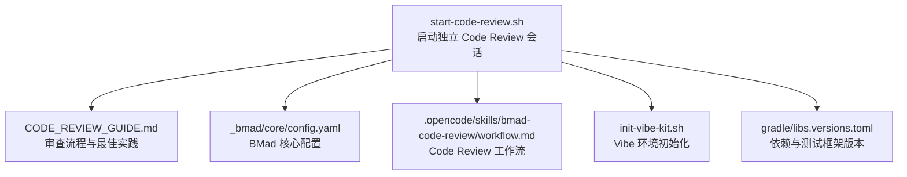
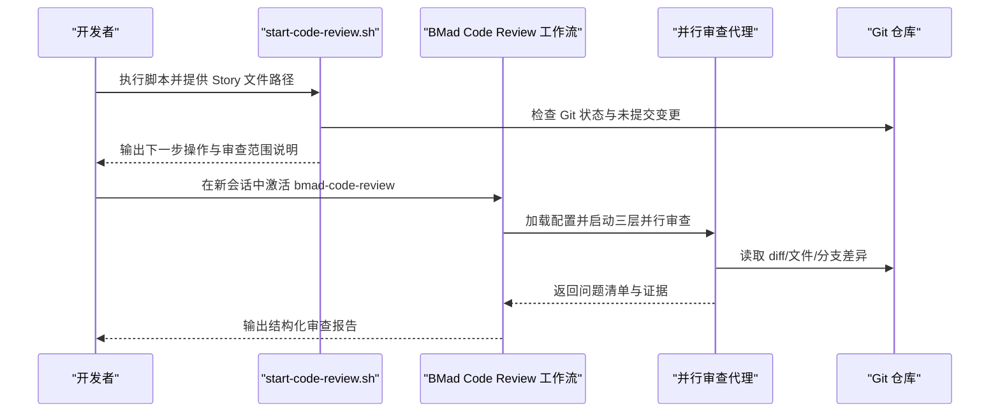
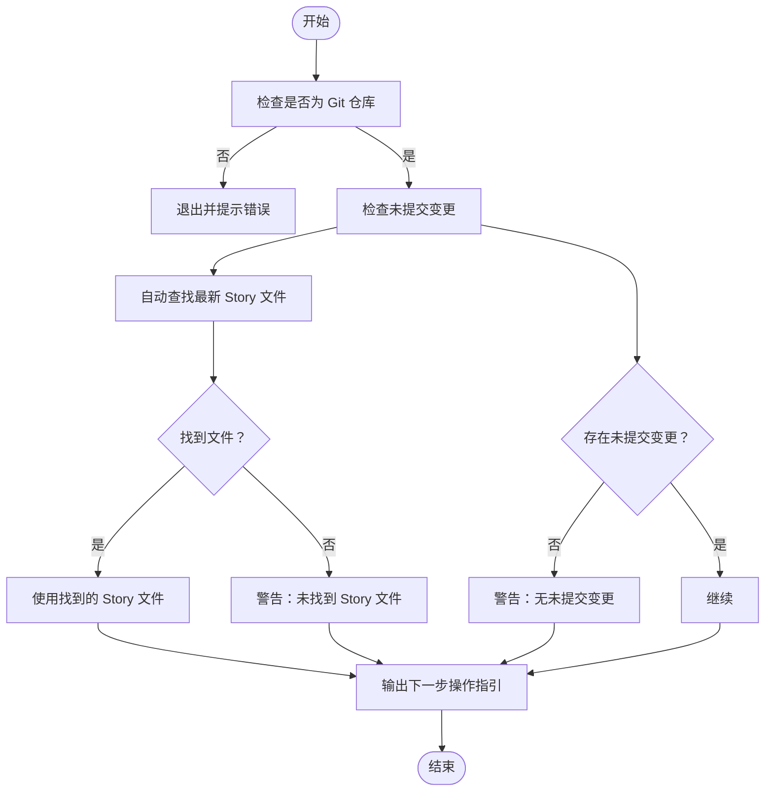
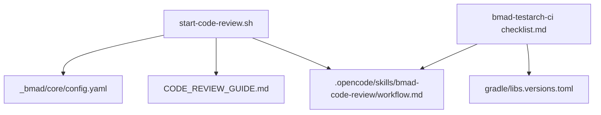

# 代码审查脚本

<cite>
**本文引用的文件**
- [start-code-review.sh](file://scripts/start-code-review.sh)
- [CODE_REVIEW_GUIDE.md](file://docs/CODE_REVIEW_GUIDE.md)
- [init-vibe-kit.sh](file://scripts/init-vibe-kit.sh)
- [config.yaml](file://_bmad/core/config.yaml)
- [workflow.md](file://.opencode/skills/bmad-code-review/workflow.md)
- [checklist.md](file://.opencode/skills/bmad-testarch-ci/checklist.md)
- [instructions.md](file://.opencode/skills/bmad-testarch-ci/instructions.md)
- [workflow.md](file://.opencode/skills/bmad-testarch-ci/workflow.md)
- [libs.versions.toml](file://gradle/libs.versions.toml)
</cite>

## 目录
1. [简介](#简介)
2. [项目结构](#项目结构)
3. [核心组件](#核心组件)
4. [架构总览](#架构总览)
5. [详细组件分析](#详细组件分析)
6. [依赖关系分析](#依赖关系分析)
7. [性能考量](#性能考量)
8. [故障排除指南](#故障排除指南)
9. [结论](#结论)
10. [附录](#附录)

## 简介
本指南面向面试指南平台的开发者与质量保障人员，系统性讲解“代码审查脚本”的使用方法与工作流程，涵盖本地代码审查、远程审查流程、审查结果解读、配置选项、与CI/CD集成（自动化测试触发、代码覆盖率统计、质量门禁检查）、以及常见问题排查。文档同时解释BMad Code Review工作流的四个阶段：收集上下文、三层并行审查、问题分级、结构化报告输出，并给出从开发到合并的完整闭环。

## 项目结构
与代码审查脚本相关的核心位置如下：
- 脚本入口：scripts/start-code-review.sh
- 审查指南：docs/CODE_REVIEW_GUIDE.md
- BMad核心配置：_bmad/core/config.yaml
- BMad Code Review工作流：.opencode/skills/bmad-code-review/workflow.md
- CI/CD质量门禁参考：.opencode/skills/bmad-testarch-ci/checklist.md、instructions.md、workflow.md
- 初始化脚本：scripts/init-vibe-kit.sh
- 依赖版本：gradle/libs.versions.toml

图表来源
- [start-code-review.sh:1-136](file://scripts/start-code-review.sh#L1-L136)
- [CODE_REVIEW_GUIDE.md:1-360](file://docs/CODE_REVIEW_GUIDE.md#L1-L360)
- [config.yaml:1-10](file://_bmad/core/config.yaml#L1-L10)
- [workflow.md:1-49](file://.opencode/skills/bmad-code-review/workflow.md#L1-L49)
- [init-vibe-kit.sh:1-42](file://scripts/init-vibe-kit.sh#L1-L42)
- [libs.versions.toml:1-30](file://gradle/libs.versions.toml#L1-L30)

章节来源
- [start-code-review.sh:1-136](file://scripts/start-code-review.sh#L1-L136)
- [CODE_REVIEW_GUIDE.md:1-360](file://docs/CODE_REVIEW_GUIDE.md#L1-L360)
- [config.yaml:1-10](file://_bmad/core/config.yaml#L1-L10)
- [workflow.md:1-49](file://.opencode/skills/bmad-code-review/workflow.md#L1-L49)
- [init-vibe-kit.sh:1-42](file://scripts/init-vibe-kit.sh#L1-L42)
- [libs.versions.toml:1-30](file://gradle/libs.versions.toml#L1-L30)

## 核心组件
- start-code-review.sh：用于在功能开发完成后，准备并提示用户在新会话中执行 Code Review。它会检查Git状态、自动定位最新 Story 文件、输出下一步操作指引、并说明BMad Code Review的四步工作流。
- CODE_REVIEW_GUIDE.md：提供独立会话机制、审查范围选择、并行审查层（盲审猎人、边界案例猎人、验收审计员）、问题分级（Critical/Important/Minor）与结构化报告模板。
- BMad Code Review工作流：定义严格的步骤文件架构、顺序执行、状态跟踪与构建产物增量产出。
- CI/CD质量门禁参考：bmad-testarch-ci工作流提供了CI配置清单、并行分片、缓存、失败产物收集、重试策略、性能目标与质量检查项，便于将代码审查纳入流水线。
- 初始化脚本：init-vibe-kit.sh用于快速搭建Vibe Coding开发环境，确保BMad相关目录与规则文件就绪。

章节来源
- [start-code-review.sh:1-136](file://scripts/start-code-review.sh#L1-L136)
- [CODE_REVIEW_GUIDE.md:1-360](file://docs/CODE_REVIEW_GUIDE.md#L1-L360)
- [workflow.md:1-49](file://.opencode/skills/bmad-code-review/workflow.md#L1-L49)
- [checklist.md:37-256](file://.opencode/skills/bmad-testarch-ci/checklist.md#L37-L256)
- [init-vibe-kit.sh:1-42](file://scripts/init-vibe-kit.sh#L1-L42)

## 架构总览
BMad Code Review工作流采用“步骤文件架构”，强调顺序执行、严格遵循与状态持久化。其核心流程由start-code-review.sh引导，进入BMad Code Review工作流后，AI将依次执行：
- Step 1：收集上下文（审查范围、Story文件、项目上下文）
- Step 2：三层并行审查（盲审猎人、边界案例猎人、验收审计员）
- Step 3：问题分级（Critical/Important/Minor）
- Step 4：输出结构化审查报告

图表来源
- [start-code-review.sh:1-136](file://scripts/start-code-review.sh#L1-L136)
- [workflow.md:1-49](file://.opencode/skills/bmad-code-review/workflow.md#L1-L49)
- [CODE_REVIEW_GUIDE.md:70-172](file://docs/CODE_REVIEW_GUIDE.md#L70-L172)

## 详细组件分析

### 组件A：start-code-review.sh 功能与工作流
- 功能概述
  - 检查当前目录是否为Git仓库
  - 检查是否存在未提交变更
  - 自动查找最新 Story 文件（_bmad-output/implementation-artifacts/），或使用用户提供的路径
  - 输出下一步操作指引：暂存、提交、关闭当前会话、在新会话中输入Skill命令、提供审查范围与Story文件
  - 说明BMad Code Review四步工作流：收集上下文、三层并行审查、问题分级、结构化报告

- 关键流程图

图表来源
- [start-code-review.sh:21-61](file://scripts/start-code-review.sh#L21-L61)

- 使用示例
  - 本地代码审查：在开发会话中完成功能实现后，执行脚本，按指引在新会话中启动 bmad-code-review，并提供审查范围与Story文件
  - 远程审查流程：在CI环境中，通过脚本生成标准化的审查指令，配合CI流水线中的测试与质量门禁

- 审查结果解读
  - Critical：阻塞性问题，必须立即修复
  - Important：修复后再继续
  - Minor：记录到技术债务清单，延后处理
  - 报告包含摘要、各类问题明细与总体评估

章节来源
- [start-code-review.sh:1-136](file://scripts/start-code-review.sh#L1-L136)
- [CODE_REVIEW_GUIDE.md:105-172](file://docs/CODE_REVIEW_GUIDE.md#L105-L172)

### 组件B：BMad Code Review 工作流
- 工作流特性
  - 步骤文件架构：每个步骤自包含、按序加载、顺序执行
  - 状态跟踪：通过内存变量记录进度
  - 构建产物增量产出：逐步累积报告与证据

- 与脚本的衔接
  - start-code-review.sh负责引导用户在新会话中激活该工作流，并提供审查范围与Story文件
  - 工作流内部完成三层并行审查与问题分级

章节来源
- [workflow.md:1-49](file://.opencode/skills/bmad-code-review/workflow.md#L1-L49)

### 组件C：CI/CD质量门禁与集成
- CI配置清单要点
  - CI配置文件路径与平台对应（GitHub Actions、GitLab CI、Jenkins等）
  - 并行分片（默认4片）、fail-fast、分片语法正确性
  - 缓存配置（依赖缓存、浏览器缓存、恢复键）
  - 失败产物收集（test-results、traces等）
  - 重试逻辑（最大尝试次数、超时、仅对瞬时错误重试）
  - 辅助脚本（scripts/test-changed.sh、scripts/ci-local.sh、scripts/burn-in.sh）

- 性能目标
  - Lint阶段<2分钟；单分片测试阶段<10分钟；燃烧循环<30分钟；总时长<45分钟
  - 缓存应减少安装时间2-5分钟

- 质量检查
  - 燃烧循环遵循生产模式、并行分片优化、失败才上传产物
  - 无凭据硬编码、机密数据使用平台密钥管理、环境变量传递

- 与代码审查的集成
  - 将BMad Code Review的报告作为质量门禁的一部分，Critical/Important问题未解决不得放行
  - 利用CI缓存加速测试，利用并行分片缩短总时长

章节来源
- [checklist.md:37-256](file://.opencode/skills/bmad-testarch-ci/checklist.md#L37-L256)
- [instructions.md:1-45](file://.opencode/skills/bmad-testarch-ci/instructions.md#L1-L45)
- [workflow.md:1-50](file://.opencode/skills/bmad-testarch-ci/workflow.md#L1-L50)

### 组件D：初始化与环境准备
- init-vibe-kit.sh
  - 检查必要目录（.lingma/rules、_bmad）
  - 部署通用规则文件至 .lingma/rules/vibe_coding_bmad.md
  - 创建文档与输出目录结构
  - 引导后续执行 start-bmad-workflow.sh 与阅读 Vibe 手册

章节来源
- [init-vibe-kit.sh:1-42](file://scripts/init-vibe-kit.sh#L1-L42)

## 依赖关系分析
- start-code-review.sh 依赖 Git 状态与 Story 文件位置
- BMad Code Review 工作流依赖 _bmad/core/config.yaml 中的语言与输出目录配置
- CI/CD质量门禁参考依赖项目实际测试框架与依赖版本（如gradle/libs.versions.toml中声明的JUnit等）

图表来源
- [start-code-review.sh:1-136](file://scripts/start-code-review.sh#L1-L136)
- [config.yaml:1-10](file://_bmad/core/config.yaml#L1-L10)
- [CODE_REVIEW_GUIDE.md:1-360](file://docs/CODE_REVIEW_GUIDE.md#L1-L360)
- [workflow.md:1-49](file://.opencode/skills/bmad-code-review/workflow.md#L1-L49)
- [checklist.md:37-256](file://.opencode/skills/bmad-testarch-ci/checklist.md#L37-L256)
- [libs.versions.toml:1-30](file://gradle/libs.versions.toml#L1-L30)

章节来源
- [start-code-review.sh:1-136](file://scripts/start-code-review.sh#L1-L136)
- [config.yaml:1-10](file://_bmad/core/config.yaml#L1-L10)
- [CODE_REVIEW_GUIDE.md:1-360](file://docs/CODE_REVIEW_GUIDE.md#L1-L360)
- [workflow.md:1-49](file://.opencode/skills/bmad-code-review/workflow.md#L1-L49)
- [checklist.md:37-256](file://.opencode/skills/bmad-testarch-ci/checklist.md#L37-L256)
- [libs.versions.toml:1-30](file://gradle/libs.versions.toml#L1-L30)

## 性能考量
- 审查范围控制：对于超过一定行数的diff，建议按模块或文件类型分块审查，降低单次审查压力
- 并行分片：在CI中合理设置分片数量，避免过度切分导致调度开销增大
- 缓存命中：确保缓存键包含锁文件哈希，浏览器缓存路径正确，提升安装与编译速度
- 失败产物：仅在失败时上传产物，减少存储与传输开销
- 重试策略：对瞬时错误进行重试，避免因网络抖动导致的误判

## 故障排除指南
- 检查工具配置
  - 确认BMad相关目录与规则文件存在，必要时运行 init-vibe-kit.sh 重新部署
  - 确认 _bmad/core/config.yaml 中语言与输出目录配置正确
- 网络连接
  - CI环境需确保能够访问平台密钥管理与缓存服务
  - 若缓存未生效，检查缓存键公式与路径
- 权限问题
  - CI脚本需具备执行权限（chmod +x），并使用正确的测试命令
  - 密钥与凭据通过环境变量传递，避免硬编码
- 审查范围过大
  - 当diff超过阈值时，选择按模块或文件类型分块审查
- 产物收集
  - 确保测试结果、traces等产物路径正确且仅在失败时上传

章节来源
- [init-vibe-kit.sh:1-42](file://scripts/init-vibe-kit.sh#L1-L42)
- [config.yaml:1-10](file://_bmad/core/config.yaml#L1-L10)
- [checklist.md:71-110](file://.opencode/skills/bmad-testarch-ci/checklist.md#L71-L110)

## 结论
通过start-code-review.sh与BMad Code Review工作流，团队可以建立标准化、可重复、可量化的代码审查流程。结合CI/CD质量门禁与性能优化策略，能够在保证交付速度的同时持续提升代码质量与可维护性。建议在每次功能完成后强制启动独立会话进行审查，并将Critical/Important问题在合并前全部解决。

## 附录
- 使用示例
  - 本地代码审查：在开发会话中完成功能实现后，执行脚本，按指引在新会话中启动 bmad-code-review，并提供审查范围与Story文件
  - 远程审查流程：在CI环境中，通过脚本生成标准化的审查指令，配合CI流水线中的测试与质量门禁
- 配置选项
  - 审查范围：未提交变更、暂存变更、分支差异、特定提交范围、指定文件列表
  - Story文件：提供上下文，确保验收审计员有效工作
  - 报告格式：结构化Markdown，包含摘要、问题分级与修复建议
- 标准流程
  - 代码提交 → 自动检查（CI）→ 人工审查（独立会话）→ 问题修复 → 重新提交 → 合并