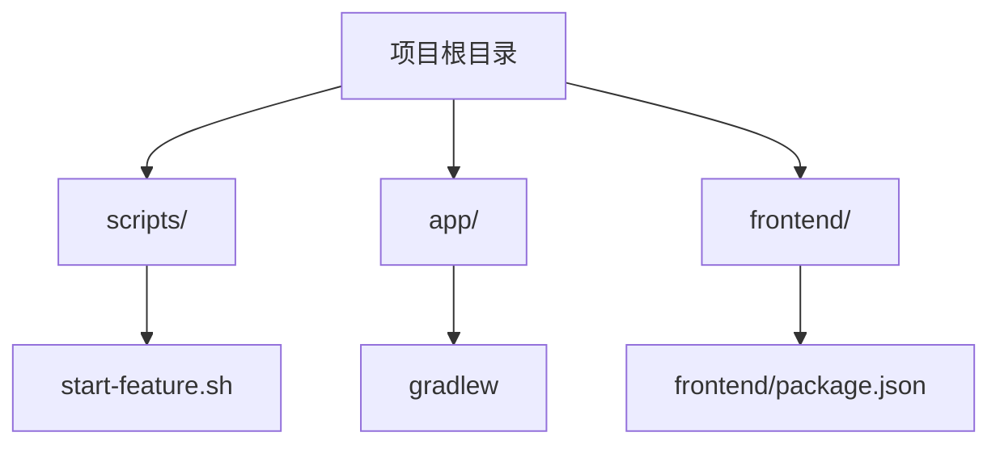
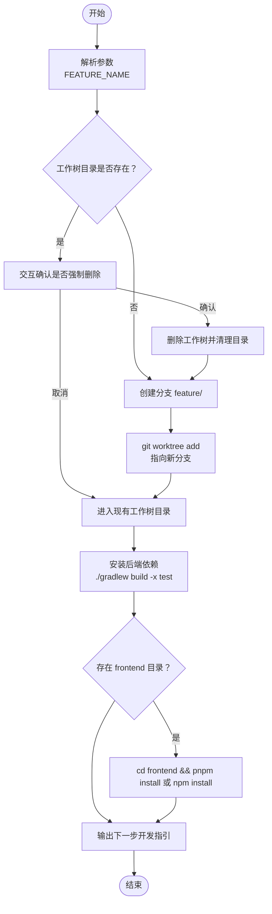
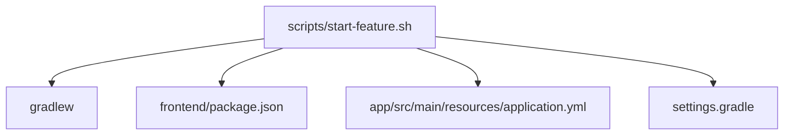

# 功能分支创建脚本

<cite>
**本文引用的文件**
- [start-feature.sh](file://scripts/start-feature.sh)
- [README.md](file://README.md)
- [gradlew](file://gradlew)
- [package.json](file://frontend/package.json)
- [settings.gradle](file://settings.gradle)
- [application.yml](file://app/src/main/resources/application.yml)
</cite>

## 目录
1. [简介](#简介)
2. [项目结构](#项目结构)
3. [核心组件](#核心组件)
4. [架构概览](#架构概览)
5. [详细组件分析](#详细组件分析)
6. [依赖关系分析](#依赖关系分析)
7. [性能考虑](#性能考虑)
8. [故障排除指南](#故障排除指南)
9. [结论](#结论)
10. [附录](#附录)

## 简介
本指南面向面试指南平台的开发者，详细介绍功能分支创建脚本的使用方法与工作机制。该脚本通过 Git Worktree 自动创建隔离的开发工作树，结合分支命名规范与工作树目录结构，帮助团队高效开展并行开发。同时，脚本会自动安装后端与前端依赖，提供后续开发流程建议，涵盖 IDE 导入、后端启动、前端开发等关键步骤，并给出常见问题的排查与解决方法。

## 项目结构
面试指南平台采用前后端分离的多模块结构，根目录包含后端应用、前端应用以及脚本工具。功能分支创建脚本位于 scripts 目录，负责自动化准备隔离开发环境。

图表来源
- [start-feature.sh:1-68](file://scripts/start-feature.sh#L1-L68)
- [gradlew:1-250](file://gradlew#L1-L250)
- [package.json:1-47](file://frontend/package.json#L1-L47)

章节来源
- [start-feature.sh:1-68](file://scripts/start-feature.sh#L1-L68)
- [README.md:210-247](file://README.md#L210-L247)

## 核心组件
- 功能分支创建脚本：负责解析参数、检查工作树目录冲突、创建 Git Worktree、初始化后端与前端依赖，并输出下一步开发指引。
- 分支命名规范：统一使用 feature/<name> 的分支命名，便于识别与管理。
- 工作树目录结构：工作树位于 .worktrees/<feature-name>，与主仓库隔离，互不影响。
- 依赖安装：后端通过 Gradle 构建工具安装依赖；前端通过 pnpm（优先）或 npm 安装依赖。

章节来源
- [start-feature.sh:8-10](file://scripts/start-feature.sh#L8-L10)
- [start-feature.sh:32-51](file://scripts/start-feature.sh#L32-L51)

## 架构概览
脚本的整体执行流程如下：接收功能名称参数 → 检查工作树目录是否存在 → 若存在则交互确认是否强制删除 → 创建 Git Worktree → 进入工作树目录 → 安装后端与前端依赖 → 输出下一步开发指引。

图表来源
- [start-feature.sh:12-67](file://scripts/start-feature.sh#L12-L67)

## 详细组件分析

### 脚本参数与交互流程
- 命令格式：./scripts/start-feature.sh <功能名称>
- 参数校验：若未提供功能名称，脚本会提示错误并退出。
- 工作树目录冲突检测：若目标工作树目录已存在，脚本会警告并要求用户确认是否强制删除。
- 强制删除确认：用户输入 y/Y 才会执行删除与重新创建，否则直接进入现有目录继续开发。

章节来源
- [start-feature.sh:12-29](file://scripts/start-feature.sh#L12-L29)

### Git Worktree 自动创建与管理
- 分支创建：若目标分支不存在，脚本会先基于当前 HEAD 创建分支 feature/<name>。
- 工作树添加：使用 git worktree add 将新分支与工作树目录关联。
- 目录进入：切换到工作树目录，便于后续安装依赖与开发。

章节来源
- [start-feature.sh:32-38](file://scripts/start-feature.sh#L32-L38)
- [start-feature.sh:40-41](file://scripts/start-feature.sh#L40-L41)

### 分支命名规范
- 统一分支前缀：feature/
- 建议使用语义化名称：如 daily-quote、resume-parse-optimize 等，便于识别与追溯。

章节来源
- [start-feature.sh:9-10](file://scripts/start-feature.sh#L9-L10)

### 工作树目录结构
- 目录位置：./.worktrees/<feature-name>
- 作用：隔离开发，避免与主仓库或其他功能分支相互影响。
- 冲突处理：若目录已存在，脚本会提示并允许强制删除后重新创建。

章节来源
- [start-feature.sh:8-10](file://scripts/start-feature.sh#L8-L10)
- [start-feature.sh:19-30](file://scripts/start-feature.sh#L19-L30)

### 依赖安装与后续开发流程
- 后端依赖安装：在工作树根目录执行 ./gradlew build -x test，跳过测试以加速构建。
- 前端依赖安装：若存在 frontend 目录，进入 frontend 并优先尝试 pnpm install，失败时回退到 npm install。
- IDE 导入：在 IDEA 中打开工作树目录，即可进行 Vibe Coding。
- 后端启动：在工作树根目录执行 ./gradlew bootRun。
- 前端启动：在工作树根目录执行 cd frontend && pnpm dev。

章节来源
- [start-feature.sh:43-51](file://scripts/start-feature.sh#L43-L51)
- [start-feature.sh:60-66](file://scripts/start-feature.sh#L60-L66)
- [gradlew:1-250](file://gradlew#L1-L250)
- [package.json:6-9](file://frontend/package.json#L6-L9)

### 安全机制与错误处理
- 参数校验：缺少功能名称时直接报错并退出，防止误操作。
- 目录冲突检测：对工作树目录的存在性进行检查，避免覆盖已有工作树。
- 强制删除确认：只有在用户明确输入 y/Y 时才执行删除与重新创建。
- 依赖安装容错：前端依赖安装失败时会回退到 npm install，并在失败时输出提示信息。

章节来源
- [start-feature.sh:12-15](file://scripts/start-feature.sh#L12-L15)
- [start-feature.sh:20-29](file://scripts/start-feature.sh#L20-L29)
- [start-feature.sh:47-51](file://scripts/start-feature.sh#L47-L51)

### 实际使用示例：./scripts/start-feature.sh daily-quote
- 步骤 1：提供功能名称 daily-quote。
- 步骤 2：检查工作树目录 .worktrees/daily-quote 是否存在。
- 步骤 3：若不存在，直接创建 feature/daily-quote 分支并添加工作树。
- 步骤 4：进入工作树目录，安装后端依赖（./gradlew build -x test）。
- 步骤 5：若存在 frontend 目录，进入 frontend 并安装前端依赖（pnpm install 或 npm install）。
- 步骤 6：输出下一步开发指引，包括在 IDEA 中打开目录、后端启动与前端启动命令。

章节来源
- [start-feature.sh:12-67](file://scripts/start-feature.sh#L12-L67)

## 依赖关系分析
脚本与项目关键文件的依赖关系如下：

图表来源
- [start-feature.sh:43-51](file://scripts/start-feature.sh#L43-L51)
- [gradlew:1-250](file://gradlew#L1-L250)
- [package.json:1-47](file://frontend/package.json#L1-L47)
- [application.yml:1-282](file://app/src/main/resources/application.yml#L1-L282)
- [settings.gradle:1-24](file://settings.gradle#L1-L24)

章节来源
- [start-feature.sh:43-51](file://scripts/start-feature.sh#L43-L51)
- [gradlew:1-250](file://gradlew#L1-L250)
- [package.json:1-47](file://frontend/package.json#L1-L47)
- [application.yml:1-282](file://app/src/main/resources/application.yml#L1-L282)
- [settings.gradle:1-24](file://settings.gradle#L1-L24)

## 性能考虑
- 跳过测试构建：后端安装时使用 -x test 跳过测试阶段，缩短构建时间。
- 前端依赖安装：优先使用 pnpm，具备更快的安装速度与更好的缓存策略；若 pnpm 失败则回退到 npm。
- 工作树隔离：通过 Git Worktree 隔离不同功能分支，避免相互干扰，提高开发效率。

章节来源
- [start-feature.sh:43-51](file://scripts/start-feature.sh#L43-L51)

## 故障排除指南
- Git 权限问题
  - 现象：创建工作树或分支时报错，提示权限不足。
  - 解决：确保当前用户对项目目录具有读写权限；若涉及远程仓库，确认 SSH 或 HTTPS 认证配置正确。
- 目录权限问题
  - 现象：工作树目录创建失败或无法删除。
  - 解决：检查 .worktrees/<feature-name> 目录的权限，确保当前用户拥有完全控制权；必要时使用 sudo 更改权限。
- 依赖安装失败
  - 现象：后端 ./gradlew build -x test 或前端 pnpm install/npm install 失败。
  - 解决：检查网络连通性与代理设置；确保 Node.js 与 pnpm/npm 版本满足项目要求；清理缓存后重试。
- 环境变量缺失
  - 现象：后端启动时报错，提示缺少 AI API Key 或数据库连接信息。
  - 解决：根据 README 的环境变量配置说明，设置必要的环境变量（如 AI_BAILIAN_API_KEY、数据库连接参数等）。
- IDE 导入问题
  - 现象：在 IDEA 中打开工作树目录后无法识别项目结构。
  - 解决：确保 IDEA 已安装 Gradle 插件；在 IDEA 中选择“Open”并指向工作树目录；必要时刷新 Gradle 项目。

章节来源
- [README.md:268-290](file://README.md#L268-L290)
- [application.yml:48-53](file://app/src/main/resources/application.yml#L48-L53)
- [application.yml:99-106](file://app/src/main/resources/application.yml#L99-L106)

## 结论
功能分支创建脚本通过 Git Worktree 实现高效的隔离开发环境准备，配合严格的分支命名规范与工作树目录结构，显著提升了并行开发的可控性与安全性。脚本在参数校验、冲突检测与依赖安装方面提供了完善的错误处理与容错机制，并给出了清晰的后续开发指引。遵循本文提供的使用方法与故障排除指南，开发者可以快速、稳定地开展功能开发。

## 附录
- 常用命令速查
  - 创建功能分支：./scripts/start-feature.sh <功能名称>
  - 后端启动：./gradlew bootRun
  - 前端启动：cd frontend && pnpm dev
  - 丢弃功能分支：git worktree remove -f .worktrees/<功能名称>

章节来源
- [start-feature.sh:60-66](file://scripts/start-feature.sh#L60-L66)
- [README.md:317-335](file://README.md#L317-L335)