# 开发环境初始化脚本

<cite>
**本文档引用的文件**
- [init-vibe-kit.sh](file://scripts/init-vibe-kit.sh)
- [start-bmad-workflow.sh](file://scripts/start-bmad-workflow.sh)
- [start-feature.sh](file://scripts/start-feature.sh)
- [VIBE_CODING_HANDBOOK.md](file://docs/VIBE_CODING_HANDBOOK.md)
- [VIBE_CODING_UNIVERSAL.md](file://docs/VIBE_CODING_UNIVERSAL.md)
- [.env.example](file://.env.example)
- [README.md](file://README.md)
</cite>

## 目录
1. [简介](#简介)
2. [项目结构](#项目结构)
3. [核心组件](#核心组件)
4. [架构概览](#架构概览)
5. [详细组件分析](#详细组件分析)
6. [依赖关系分析](#依赖关系分析)
7. [性能考虑](#性能考虑)
8. [故障排除指南](#故障排除指南)
9. [结论](#结论)
10. [附录](#附录)

## 简介

开发环境初始化脚本是面试指南平台的重要组成部分，它为开发者提供了一个标准化的环境配置流程。该脚本实现了Vibe Coding Kit系统的核心功能，将当前项目快速配置为支持BMad 7步工作流的开发环境。

### 主要功能概述

脚本的核心功能包括：
- **环境检测与准备**：检查必要目录结构，确保项目具备运行BMad工作流的基础条件
- **规则文件部署**：将通用开发规则复制到IDE配置目录，实现代码生成的规范化
- **文档结构初始化**：创建项目文档所需的目录结构，支持工作流产出物的组织
- **工作流引导**：提供后续开发步骤的明确指引，确保开发者能够正确使用BMad系统

### 与Vibe Kit系统的集成

Vibe Kit系统是一个集成了AI驱动开发的工作流平台，通过以下方式与脚本深度集成：

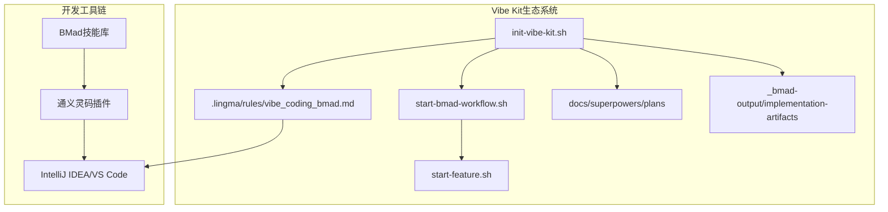

**图表来源**
- [init-vibe-kit.sh:1-42](file://scripts/init-vibe-kit.sh#L1-L42)
- [start-bmad-workflow.sh:1-253](file://scripts/start-bmad-workflow.sh#L1-L253)
- [start-feature.sh:1-68](file://scripts/start-feature.sh#L1-L68)

## 项目结构

面试指南平台采用了现代化的双端分离架构，结合了Spring Boot后端和React前端技术栈。项目结构清晰地反映了开发环境初始化脚本的作用域和影响范围。

### 核心目录结构

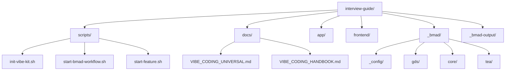

**图表来源**
- [README.md:210-247](file://README.md#L210-L247)
- [init-vibe-kit.sh:10-33](file://scripts/init-vibe-kit.sh#L10-L33)

### 环境初始化影响范围

脚本执行后会在项目中创建以下关键结构：

| 目录/文件 | 作用 | 生成时机 |
|-----------|------|----------|
| `.lingma/rules/` | IDE规则文件存储目录 | 初始化时检测并创建 |
| `docs/superpowers/plans/` | 计划文档存放目录 | 初始化时创建 |
| `_bmad-output/implementation-artifacts/` | 实现产物输出目录 | 初始化时创建 |
| `vibe_coding_bmad.md` | 通用开发规则文件 | 从docs复制 |

**章节来源**
- [init-vibe-kit.sh:10-33](file://scripts/init-vibe-kit.sh#L10-L33)

## 核心组件

### init-vibe-kit.sh 脚本分析

init-vibe-kit.sh是整个Vibe Coding Kit系统的核心入口脚本，它实现了环境初始化的完整流程。

#### 核心功能模块

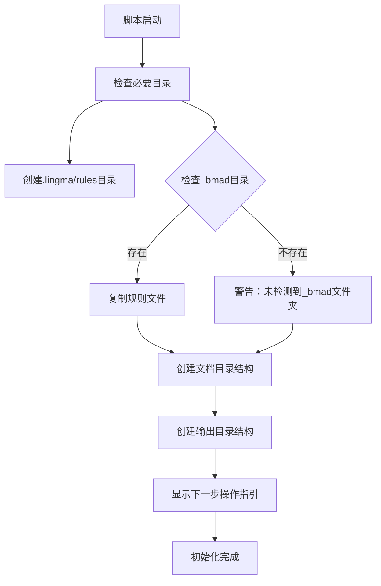

**图表来源**
- [init-vibe-kit.sh:8-41](file://scripts/init-vibe-kit.sh#L8-L41)

#### 环境检测机制

脚本实现了多层次的环境检测，确保项目具备运行BMad工作流的必要条件：

1. **规则目录检测**：检查`.lingma/rules`目录是否存在，不存在则自动创建
2. **BMad技能检测**：检查`_bmad`目录的存在性，这是BMad工作流的核心依赖
3. **规则文件验证**：确保`docs/VIBE_CODING_UNIVERSAL.md`文件存在并可访问

#### 规则文件部署流程

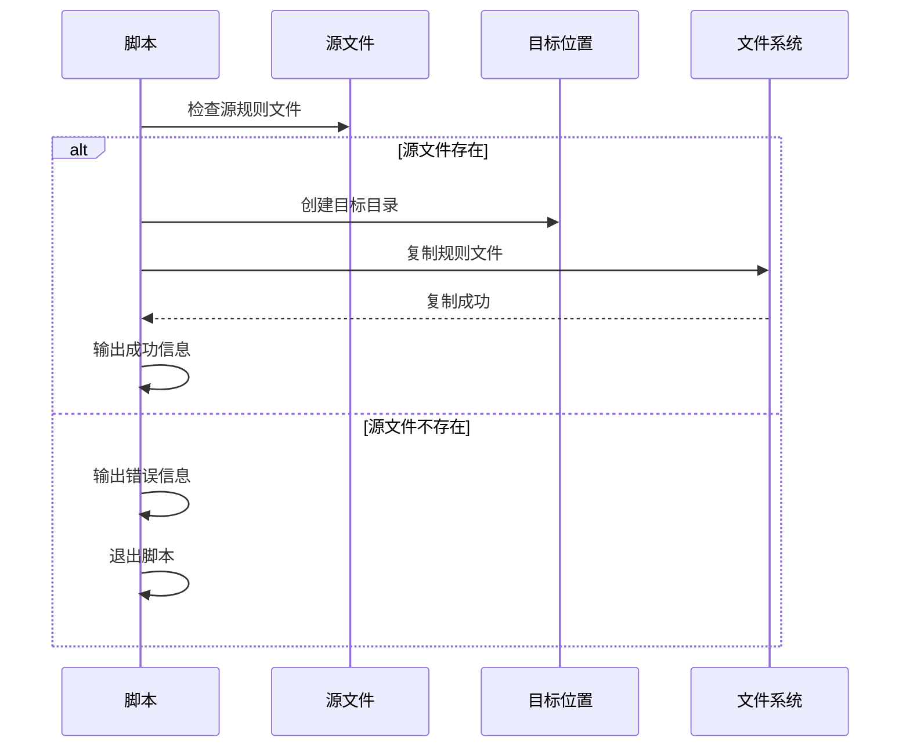

**图表来源**
- [init-vibe-kit.sh:19-29](file://scripts/init-vibe-kit.sh#L19-L29)

**章节来源**
- [init-vibe-kit.sh:1-42](file://scripts/init-vibe-kit.sh#L1-L42)

### 与BMad工作流的集成

脚本通过以下方式与BMad系统深度集成：

#### 工作流引导机制

脚本在初始化完成后提供明确的后续步骤指引，确保开发者能够正确使用BMad工作流：

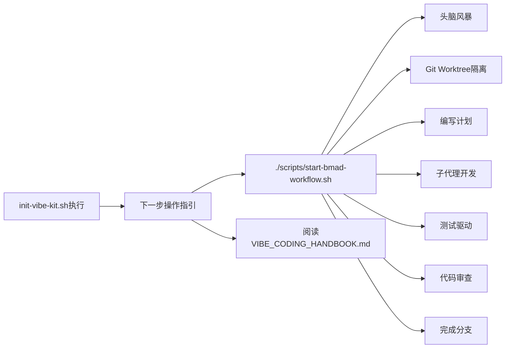

**图表来源**
- [init-vibe-kit.sh:35-41](file://scripts/init-vibe-kit.sh#L35-L41)
- [start-bmad-workflow.sh:27-47](file://scripts/start-bmad-workflow.sh#L27-L47)

**章节来源**
- [init-vibe-kit.sh:35-41](file://scripts/init-vibe-kit.sh#L35-L41)
- [start-bmad-workflow.sh:1-253](file://scripts/start-bmad-workflow.sh#L1-L253)

## 架构概览

### 系统架构图

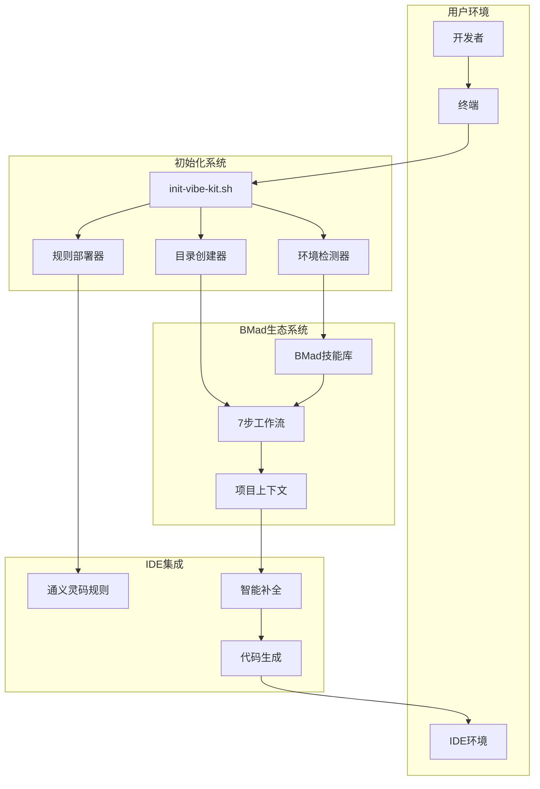

**图表来源**
- [init-vibe-kit.sh:1-42](file://scripts/init-vibe-kit.sh#L1-L42)
- [VIBE_CODING_HANDBOOK.md:1-241](file://docs/VIBE_CODING_HANDBOOK.md#L1-L241)

### 数据流分析

脚本执行过程中的数据流向体现了清晰的职责分离：

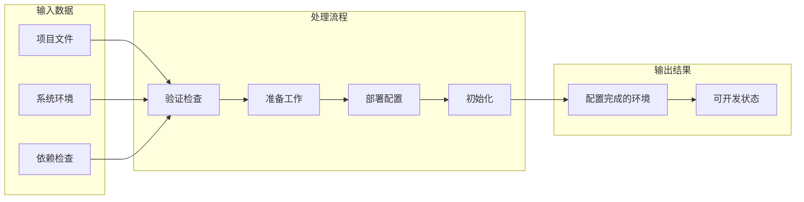

**图表来源**
- [init-vibe-kit.sh:10-33](file://scripts/init-vibe-kit.sh#L10-L33)

## 详细组件分析

### 环境检测组件

#### 目录结构验证

环境检测组件负责验证项目是否具备运行BMad工作流所需的基本结构：

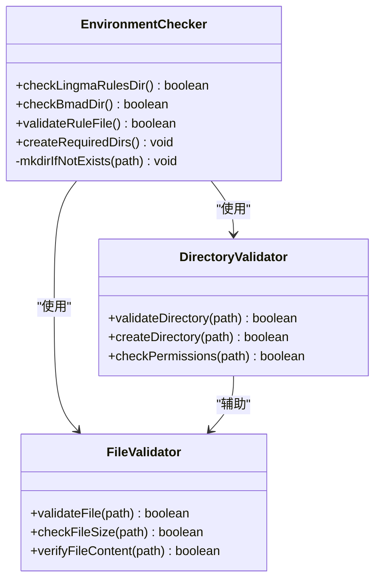

**图表来源**
- [init-vibe-kit.sh:10-17](file://scripts/init-vibe-kit.sh#L10-L17)
- [init-vibe-kit.sh:23-29](file://scripts/init-vibe-kit.sh#L23-L29)

#### 检测逻辑实现

环境检测采用分层次的检查策略，确保每个必要组件都被正确验证：

1. **规则目录检查**：验证`.lingma/rules`目录的存在性和可写性
2. **BMad技能检查**：检查`_bmad`目录的完整性，这是BMad工作流的核心
3. **规则文件验证**：确保通用开发规则文件的可用性

**章节来源**
- [init-vibe-kit.sh:10-29](file://scripts/init-vibe-kit.sh#L10-L29)

### 规则部署组件

#### 文件复制机制

规则部署组件实现了智能的文件复制机制，确保规则文件能够正确部署到IDE配置目录：

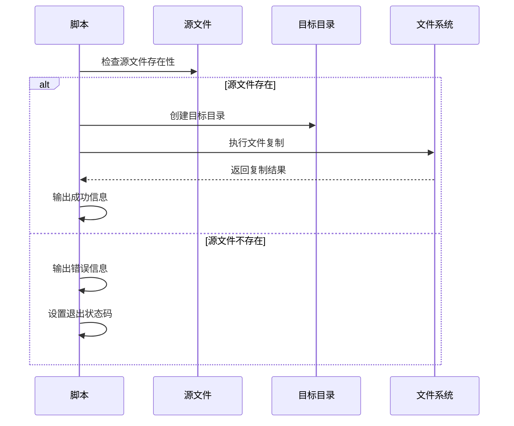

**图表来源**
- [init-vibe-kit.sh:19-29](file://scripts/init-vibe-kit.sh#L19-L29)

#### 部署策略

规则文件部署采用了以下策略确保可靠性：

1. **原子性操作**：先创建目标目录，再进行文件复制
2. **错误处理**：源文件缺失时提供明确的错误信息和退出码
3. **路径标准化**：使用绝对路径确保部署的确定性

**章节来源**
- [init-vibe-kit.sh:19-29](file://scripts/init-vibe-kit.sh#L19-L29)

### 目录创建组件

#### 文档结构初始化

目录创建组件负责初始化项目文档所需的目录结构，支持BMad工作流的产出物管理：

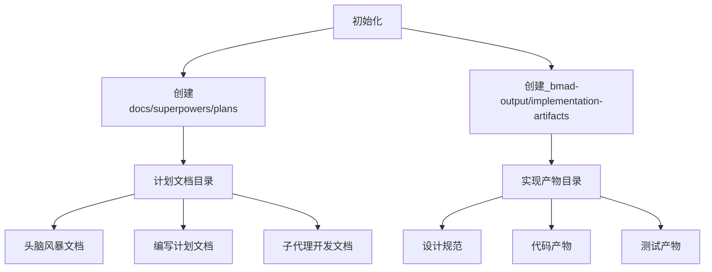

**图表来源**
- [init-vibe-kit.sh:31-33](file://scripts/init-vibe-kit.sh#L31-L33)

#### 目录结构设计原则

目录创建遵循以下设计原则：

1. **层次化组织**：按照BMad工作流的7个阶段进行目录分层
2. **可扩展性**：为未来的工作流扩展预留空间
3. **一致性**：与BMad系统的文档管理规范保持一致

**章节来源**
- [init-vibe-kit.sh:31-33](file://scripts/init-vibe-kit.sh#L31-L33)

### 工作流引导组件

#### 后续步骤指引

工作流引导组件提供了清晰的后续步骤指引，帮助开发者正确使用BMad工作流：

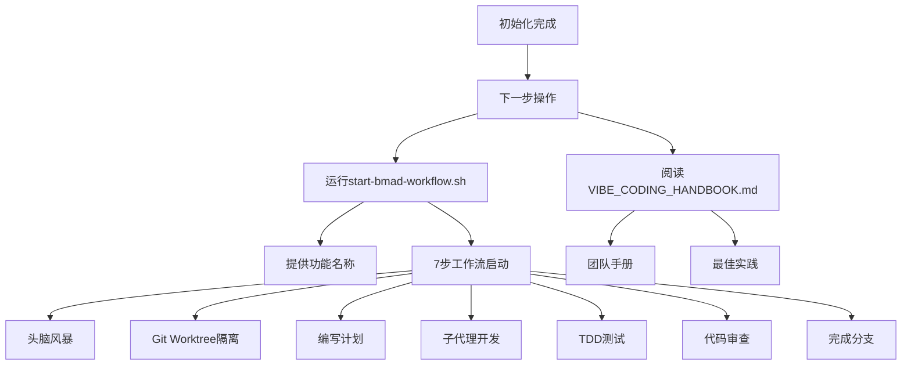

**图表来源**
- [init-vibe-kit.sh:35-41](file://scripts/init-vibe-kit.sh#L35-L41)
- [start-bmad-workflow.sh:27-47](file://scripts/start-bmad-workflow.sh#L27-L47)

**章节来源**
- [init-vibe-kit.sh:35-41](file://scripts/init-vibe-kit.sh#L35-L41)

## 依赖关系分析

### 外部依赖

脚本的执行依赖于以下外部组件：

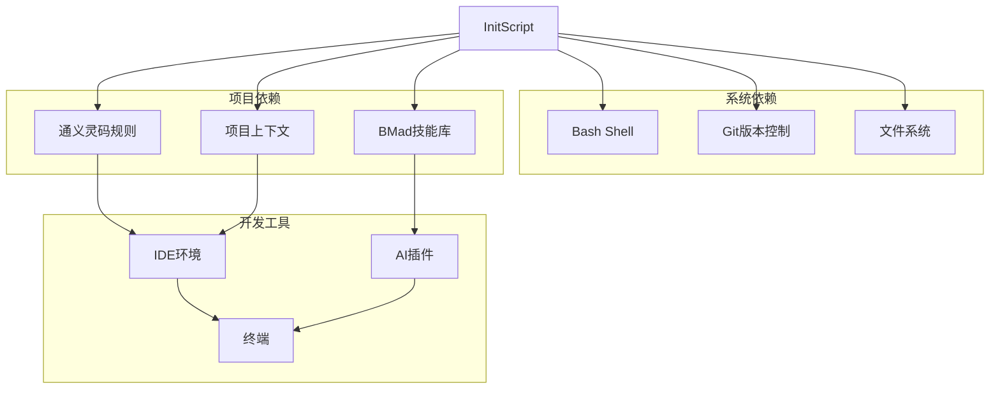

**图表来源**
- [init-vibe-kit.sh:1-42](file://scripts/init-vibe-kit.sh#L1-L42)
- [VIBE_CODING_HANDBOOK.md:13-25](file://docs/VIBE_CODING_HANDBOOK.md#L13-L25)

### 内部依赖关系

脚本内部组件之间的依赖关系体现了清晰的职责分离：

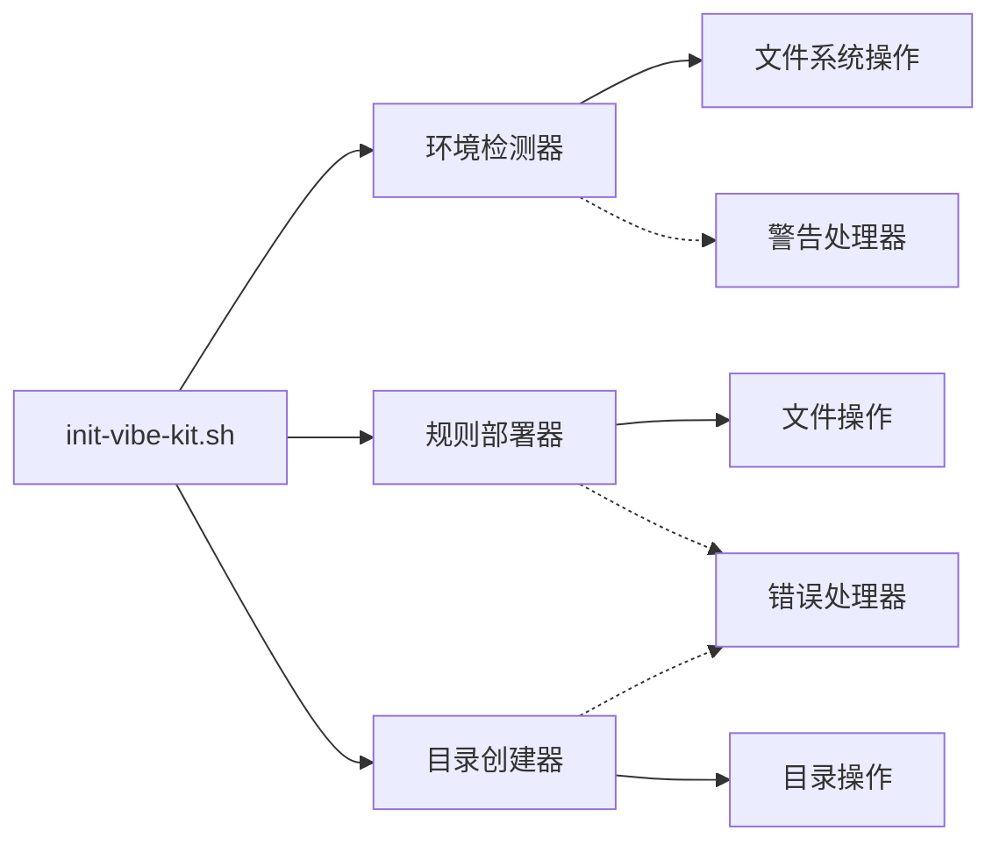

**图表来源**
- [init-vibe-kit.sh:10-33](file://scripts/init-vibe-kit.sh#L10-L33)

**章节来源**
- [init-vibe-kit.sh:1-42](file://scripts/init-vibe-kit.sh#L1-L42)

## 性能考虑

### 执行效率优化

脚本在设计时充分考虑了执行效率：

1. **短路执行**：一旦检测到必要组件缺失，立即停止并给出明确提示
2. **最小化依赖**：仅依赖系统基础工具，减少外部依赖
3. **原子操作**：确保文件复制等操作的原子性，避免部分完成状态

### 资源使用优化

脚本在资源使用方面采用了以下优化策略：

- **内存使用**：采用流式处理，避免大文件的内存占用
- **磁盘I/O**：批量创建目录，减少系统调用次数
- **CPU使用**：避免不必要的计算，专注于必要的验证和复制操作

## 故障排除指南

### 常见问题及解决方案

#### 环境检测失败

**问题现象**：脚本提示未检测到_bmad文件夹

**可能原因**：
1. BMad技能库未正确安装
2. 项目克隆时缺少_bmad目录
3. 权限不足导致目录不可访问

**解决方案**：
1. 确认BMad技能库已正确安装到项目根目录
2. 检查.gitignore配置，确保_bmad目录未被忽略
3. 使用管理员权限运行脚本

#### 规则文件复制失败

**问题现象**：源规则文件找不到，脚本退出

**可能原因**：
1. docs/VIBE_CODING_UNIVERSAL.md文件缺失
2. 文件权限问题
3. 路径配置错误

**解决方案**：
1. 确认docs目录存在且包含VIBE_CODING_UNIVERSAL.md文件
2. 检查文件权限，确保脚本具有读取权限
3. 验证文件路径的正确性

#### 目录创建失败

**问题现象**：创建docs/superpowers/plans目录失败

**可能原因**：
1. 当前用户权限不足
2. 磁盘空间不足
3. 父目录权限问题

**解决方案**：
1. 使用具有足够权限的账户运行脚本
2. 检查磁盘空间，清理不必要的文件
3. 确保父目录具有适当的写入权限

### 调试和诊断

#### 调试模式

脚本支持调试模式，可以通过以下方式启用：

```bash
# 启用详细输出
set -x
./scripts/init-vibe-kit.sh

# 启用错误捕获
set -e
```

#### 日志分析

脚本的输出信息提供了重要的调试线索：

1. **成功信息**：以✅开头的成功提示
2. **警告信息**：以⚠️开头的警告提示  
3. **错误信息**：以❌开头的错误提示

#### 环境诊断

建议使用以下命令进行环境诊断：

```bash
# 检查_bmad目录
ls -la _bmad/

# 检查规则文件
ls -la docs/VIBE_CODING_UNIVERSAL.md

# 检查目录权限
ls -ld .lingma/ docs/ _bmad-output/

# 检查Git状态
git status
```

**章节来源**
- [init-vibe-kit.sh:15-17](file://scripts/init-vibe-kit.sh#L15-L17)
- [init-vibe-kit.sh:26-28](file://scripts/init-vibe-kit.sh#L26-L28)

## 结论

开发环境初始化脚本是面试指南平台Vibe Coding Kit系统的核心组件，它通过标准化的环境配置流程，为开发者提供了一个完整的BMad工作流开发环境。脚本的设计体现了以下特点：

### 核心价值

1. **标准化配置**：通过统一的初始化流程，确保所有开发者使用相同的开发环境
2. **自动化部署**：减少了手动配置的工作量，提高了开发效率
3. **错误预防**：通过多层次的环境检测，提前发现并解决潜在问题
4. **可扩展性**：设计灵活，便于未来添加新的配置选项和检查项

### 技术优势

1. **简洁高效**：脚本逻辑清晰，执行速度快
2. **健壮性强**：完善的错误处理和回退机制
3. **用户友好**：提供清晰的反馈信息和后续操作指引
4. **可维护性**：代码结构清晰，易于理解和修改

### 未来发展

随着项目的不断发展，该脚本可以在以下方面进一步完善：
- 增加更多的环境检测项
- 支持更多的配置选项
- 提供更详细的错误诊断信息
- 集成更多的自动化配置功能

## 附录

### 使用示例

#### 首次环境搭建

```bash
# 1. 克隆项目并进入目录
git clone https://github.com/Snailclimb/interview-guide.git
cd interview-guide

# 2. 运行初始化脚本
./scripts/init-vibe-kit.sh

# 3. 按照提示进行后续操作
./scripts/start-bmad-workflow.sh your-feature-name
```

#### 开发工具更新

```bash
# 1. 检查当前环境状态
./scripts/init-vibe-kit.sh

# 2. 更新BMad技能库
cd _bmad && git pull origin main && cd ..

# 3. 重新运行初始化脚本
./scripts/init-vibe-kit.sh
```

#### 配置重置

```bash
# 1. 删除配置目录
rm -rf .lingma/

# 2. 重新初始化
./scripts/init-vibe-kit.sh

# 3. 验证配置
ls -la .lingma/rules/
```

### 配置参数说明

| 参数 | 类型 | 必需 | 默认值 | 说明 |
|------|------|------|--------|------|
| FEATURE_NAME | 字符串 | 是 | 无 | 功能名称，用于创建工作树和分支 |
| WORKTREE_DIR | 字符串 | 否 | ./.worktrees/${FEATURE_NAME} | 工作树目录路径 |
| BRANCH_NAME | 字符串 | 否 | feature/${FEATURE_NAME} | Git分支名称 |

### 环境变量

脚本支持以下环境变量：

| 变量名 | 类型 | 必需 | 默认值 | 说明 |
|--------|------|------|--------|------|
| BASH_ENV | 字符串 | 否 | 无 | Bash环境配置文件路径 |
| HOME | 字符串 | 是 | 无 | 用户主目录路径 |
| PATH | 字符串 | 是 | 无 | 系统PATH环境变量 |

### 相关文档

- [VIBE_CODING_HANDBOOK.md](file://docs/VIBE_CODING_HANDBOOK.md) - 团队手册
- [VIBE_CODING_UNIVERSAL.md](file://docs/VIBE_CODING_UNIVERSAL.md) - 通用开发准则
- [README.md](file://README.md) - 项目说明文档