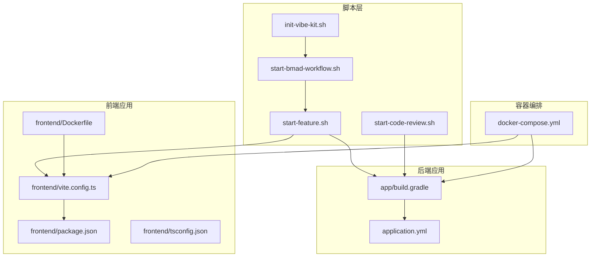
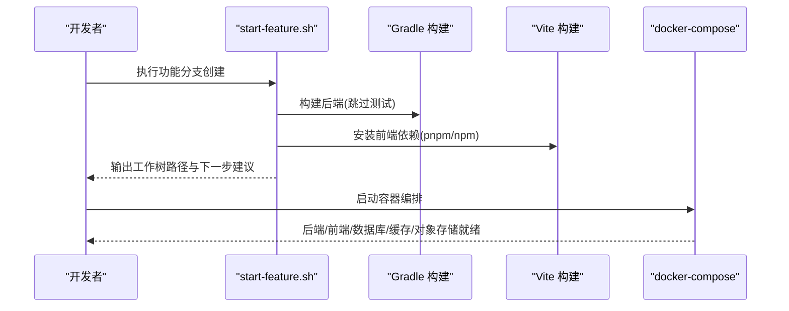
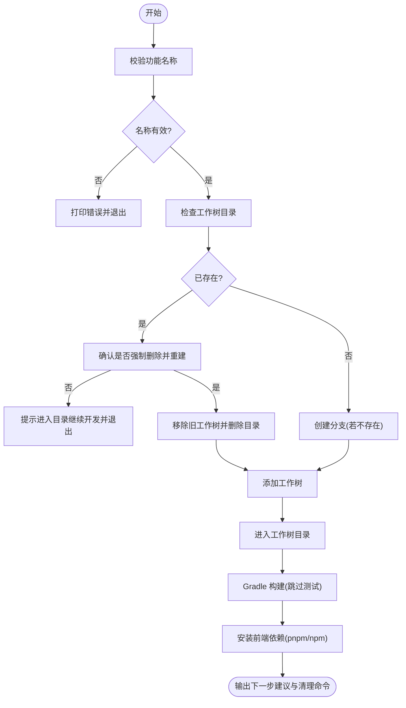
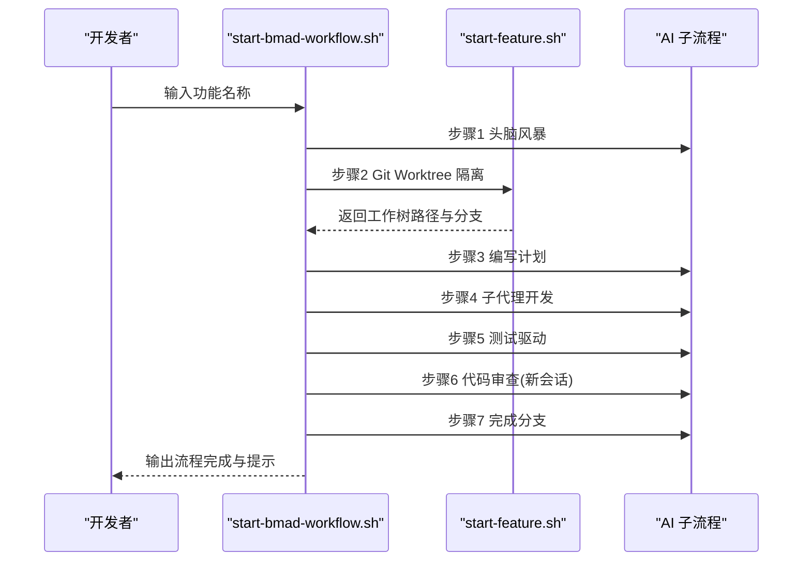
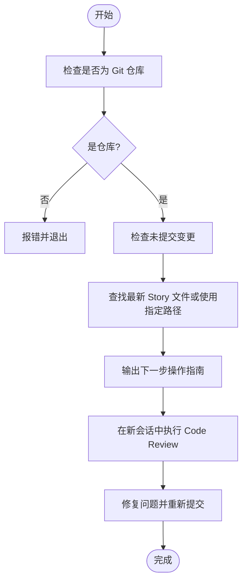
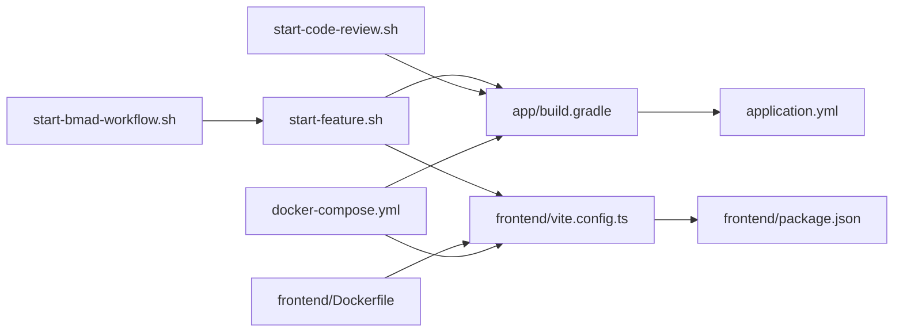

# 构建脚本和自动化

<cite>
**本文引用的文件**
- [scripts/start-feature.sh](file://scripts/start-feature.sh)
- [scripts/start-bmad-workflow.sh](file://scripts/start-bmad-workflow.sh)
- [scripts/start-code-review.sh](file://scripts/start-code-review.sh)
- [scripts/init-vibe-kit.sh](file://scripts/init-vibe-kit.sh)
- [app/build.gradle](file://app/build.gradle)
- [gradle/libs.versions.toml](file://gradle/libs.versions.toml)
- [frontend/vite.config.ts](file://frontend/vite.config.ts)
- [frontend/package.json](file://frontend/package.json)
- [frontend/tsconfig.json](file://frontend/tsconfig.json)
- [frontend/Dockerfile](file://frontend/Dockerfile)
- [app/src/main/resources/application.yml](file://app/src/main/resources/application.yml)
- [docker-compose.yml](file://docker-compose.yml)
</cite>

## 目录
1. [简介](#简介)
2. [项目结构](#项目结构)
3. [核心组件](#核心组件)
4. [架构总览](#架构总览)
5. [详细组件分析](#详细组件分析)
6. [依赖关系分析](#依赖关系分析)
7. [性能考虑](#性能考虑)
8. [故障排除指南](#故障排除指南)
9. [结论](#结论)
10. [附录](#附录)

## 简介
本指南面向面试指南平台的构建与自动化流程，聚焦以下主题：
- 功能分支创建脚本的使用方法与最佳实践
- BMad 工作流启动脚本的配置与使用
- 开发环境初始化脚本的功能与步骤
- 代码审查脚本的使用流程与注意事项
- Gradle 构建脚本的配置要点与优化建议
- Vite 构建配置的自定义方法与调试技巧
- 构建脚本的故障排除与调试方法

## 项目结构
本项目采用前后端分离与多模块协作的组织方式：
- 脚本层：位于 scripts/，提供功能分支、BMad 工作流、代码审查与 Vibe Kit 初始化脚本
- 后端应用：位于 app/，基于 Spring Boot 4.0 + Java 21，使用 Gradle 管理依赖与任务
- 前端应用：位于 frontend/，基于 Vite + React，使用 pnpm 管理依赖
- 配置与容器：位于 gradle/、frontend/、docker-compose.yml 等，统一管理版本与容器编排

图表来源
- [scripts/start-feature.sh:1-68](file://scripts/start-feature.sh#L1-L68)
- [scripts/start-bmad-workflow.sh:1-253](file://scripts/start-bmad-workflow.sh#L1-L253)
- [scripts/start-code-review.sh:1-136](file://scripts/start-code-review.sh#L1-L136)
- [scripts/init-vibe-kit.sh:1-42](file://scripts/init-vibe-kit.sh#L1-L42)
- [app/build.gradle:1-136](file://app/build.gradle#L1-L136)
- [frontend/vite.config.ts:1-42](file://frontend/vite.config.ts#L1-L42)
- [frontend/package.json:1-47](file://frontend/package.json#L1-L47)
- [frontend/tsconfig.json:1-22](file://frontend/tsconfig.json#L1-L22)
- [frontend/Dockerfile:1-44](file://frontend/Dockerfile#L1-L44)
- [app/src/main/resources/application.yml:1-282](file://app/src/main/resources/application.yml#L1-L282)
- [docker-compose.yml:1-197](file://docker-compose.yml#L1-L197)

章节来源
- [scripts/start-feature.sh:1-68](file://scripts/start-feature.sh#L1-L68)
- [scripts/start-bmad-workflow.sh:1-253](file://scripts/start-bmad-workflow.sh#L1-L253)
- [scripts/start-code-review.sh:1-136](file://scripts/start-code-review.sh#L1-L136)
- [scripts/init-vibe-kit.sh:1-42](file://scripts/init-vibe-kit.sh#L1-L42)
- [app/build.gradle:1-136](file://app/build.gradle#L1-L136)
- [frontend/vite.config.ts:1-42](file://frontend/vite.config.ts#L1-L42)
- [frontend/package.json:1-47](file://frontend/package.json#L1-L47)
- [frontend/tsconfig.json:1-22](file://frontend/tsconfig.json#L1-L22)
- [frontend/Dockerfile:1-44](file://frontend/Dockerfile#L1-L44)
- [app/src/main/resources/application.yml:1-282](file://app/src/main/resources/application.yml#L1-L282)
- [docker-compose.yml:1-197](file://docker-compose.yml#L1-L197)

## 核心组件
- 功能分支创建脚本：一键创建 Git Worktree、拉取依赖、进入隔离开发环境
- BMad 工作流启动脚本：引导完成 7 步标准化开发流程，串联头脑风暴、计划、子代理开发、TDD、代码审查、分支收尾
- 代码审查脚本：准备 Code Review 会话，指导在新会话中执行三层并行审查
- Vibe Kit 初始化脚本：部署通用规则文件、创建文档目录结构，引导使用 BMad 工作流
- Gradle 构建脚本：统一依赖版本、编码配置、测试任务、bootRun 环境注入
- Vite 构建配置：插件体系、分包策略、开发服务器与代理、依赖预优化与 sourcemap 忽略

章节来源
- [scripts/start-feature.sh:1-68](file://scripts/start-feature.sh#L1-L68)
- [scripts/start-bmad-workflow.sh:1-253](file://scripts/start-bmad-workflow.sh#L1-L253)
- [scripts/start-code-review.sh:1-136](file://scripts/start-code-review.sh#L1-L136)
- [scripts/init-vibe-kit.sh:1-42](file://scripts/init-vibe-kit.sh#L1-L42)
- [app/build.gradle:1-136](file://app/build.gradle#L1-L136)
- [frontend/vite.config.ts:1-42](file://frontend/vite.config.ts#L1-L42)

## 架构总览
下图展示从脚本到容器编排的整体流程，涵盖功能分支创建、后端与前端构建、以及容器化部署。

图表来源
- [scripts/start-feature.sh:43-51](file://scripts/start-feature.sh#L43-L51)
- [app/build.gradle:100-135](file://app/build.gradle#L100-L135)
- [frontend/vite.config.ts:1-42](file://frontend/vite.config.ts#L1-L42)
- [docker-compose.yml:1-197](file://docker-compose.yml#L1-L197)

## 详细组件分析

### 功能分支创建脚本：start-feature.sh
- 功能概述
  - 基于 Git Worktree 为新功能创建隔离开发环境
  - 自动安装后端 Gradle 依赖与前端 pnpm/npm 依赖
  - 输出工作树路径、分支名称与后续建议
- 参数说明
  - 必填：功能名称（例如 daily-quote）
- 使用场景
  - 新功能开发前的环境准备
  - 需要隔离开发与并行迭代的场景
- 关键行为
  - 检测工作树目录是否存在，支持强制重建
  - 若分支不存在，自动创建并关联工作树
  - 进入工作树后执行 Gradle 构建与前端依赖安装
  - 提供丢弃工作树的清理命令

图表来源
- [scripts/start-feature.sh:12-51](file://scripts/start-feature.sh#L12-L51)

章节来源
- [scripts/start-feature.sh:1-68](file://scripts/start-feature.sh#L1-L68)

### BMad 工作流启动脚本：start-bmad-workflow.sh
- 功能概述
  - 引导完成 BMad 7 步标准化开发流程
  - 串联头脑风暴、Git Worktree 隔离、编写计划、子代理开发、TDD、代码审查、分支收尾
- 参数说明
  - 必填：功能名称
- 使用流程
  - 步骤 1：头脑风暴（Skill: bmad-brainstorming）
  - 步骤 2：Git Worktree 隔离（复用 start-feature.sh 行为）
  - 步骤 3：编写计划（Skill: writing-plans）
  - 步骤 4：子代理开发（Skill: subagent-driven-development 或备用技能）
  - 步骤 5：测试驱动（Skill: test-driven-development）
  - 步骤 6：代码审查（Skill: bmad-code-review，需在新会话执行）
  - 步骤 7：完成分支（Skill: finishing-a-development-branch）
- 注意事项
  - 步骤 6 必须在新会话中执行
  - 遵循 TDD 原则：先红灯（失败测试），再绿灯（最小实现），最后蓝灯（重构）

图表来源
- [scripts/start-bmad-workflow.sh:54-235](file://scripts/start-bmad-workflow.sh#L54-L235)
- [scripts/start-feature.sh:72-115](file://scripts/start-feature.sh#L72-L115)

章节来源
- [scripts/start-bmad-workflow.sh:1-253](file://scripts/start-bmad-workflow.sh#L1-L253)

### 代码审查脚本：start-code-review.sh
- 功能概述
  - 准备 Code Review 会话，指导在新会话中执行三层并行审查
  - 自动查找最新 Story 文件，或使用指定路径
- 使用流程
  - 检查 Git 仓库状态与未提交变更
  - 暂存并提交当前工作
  - 关闭当前会话，创建新会话
  - 在新会话中输入 Skill: bmad-code-review
  - 提供审查范围与 Story 文件路径
  - 根据 AI 生成的 Critical/Important/Minor 问题修复并重新提交

图表来源
- [scripts/start-code-review.sh:21-136](file://scripts/start-code-review.sh#L21-L136)

章节来源
- [scripts/start-code-review.sh:1-136](file://scripts/start-code-review.sh#L1-L136)

### Vibe Kit 初始化脚本：init-vibe-kit.sh
- 功能概述
  - 将项目快速配置为支持 BMad 7 步工作流的开发环境
  - 部署通用规则文件至 .lingma/rules
  - 创建文档目录结构
  - 提示后续操作与阅读指南
- 关键步骤
  - 检查必要目录，复制通用规则文件
  - 创建 docs/superpowers/plans 与 _bmad-output/implementation-artifacts 目录
  - 输出下一步指引

章节来源
- [scripts/init-vibe-kit.sh:1-42](file://scripts/init-vibe-kit.sh#L1-L42)

### Gradle 构建脚本：app/build.gradle
- 依赖管理
  - 使用 libs.versions.toml 统一版本号，集中管理第三方库
  - Spring Boot 4.0 + Java 21 + Spring AI 2.0 + PostgreSQL + pgvector + Redisson + iText + AWS S3 SDK + MapStruct + Lombok
- 任务配置
  - 全局 UTF-8 编码配置
  - test 任务使用 JUnit Platform
  - bootRun 注入 .env 环境变量，设置 JVM 编码
- 版本与插件
  - 通过 libs.versions.toml 引入 spring-boot、spring-ai、aws-sdk、itext、mapstruct、lombok 等版本

章节来源
- [app/build.gradle:1-136](file://app/build.gradle#L1-L136)
- [gradle/libs.versions.toml:1-30](file://gradle/libs.versions.toml#L1-L30)

### Vite 构建配置：frontend/vite.config.ts
- 插件体系
  - react、wasm、top-level-await 插件启用
- 分包策略
  - manualChunks 将 react 生态、UI 组件库、语法高亮等拆分为独立包
- 开发服务器
  - host: 0.0.0.0，port: 5173
  - 代理 /api 到后端 8080
  - sourcemapIgnoreList 忽略特定依赖的 sourcemap 警告
- 依赖预优化
  - optimizeDeps 配置（当前为空）

章节来源
- [frontend/vite.config.ts:1-42](file://frontend/vite.config.ts#L1-L42)
- [frontend/package.json:1-47](file://frontend/package.json#L1-L47)
- [frontend/tsconfig.json:1-22](file://frontend/tsconfig.json#L1-L22)

### 容器编排：docker-compose.yml
- 服务组成
  - PostgreSQL(pgvector)：向量数据库与业务数据存储
  - Redis：缓存与消息队列
  - MinIO：S3 兼容对象存储
  - MinIO 初始化任务：自动创建存储桶并设置公开读权限
  - app：Spring Boot 应用，依赖数据库、缓存、对象存储健康状态
  - frontend：Nginx 托管静态资源
- 关键配置
  - 健康检查：数据库、缓存、对象存储
  - 环境变量：数据库、Redis、存储、AI 模型、面试参数
  - 端口映射：5432、6379、9000/9001、8080、80

章节来源
- [docker-compose.yml:1-197](file://docker-compose.yml#L1-L197)

## 依赖关系分析
- 脚本层与应用层
  - start-feature.sh 依赖 Gradle 构建与前端包管理器
  - start-bmad-workflow.sh 依赖 start-feature.sh 与 AI 技能
  - start-code-review.sh 依赖 Git 仓库与 Story 文件
- 应用层与配置层
  - app/build.gradle 通过 libs.versions.toml 统一版本
  - application.yml 提供运行时环境变量与连接配置
- 前端层与构建层
  - vite.config.ts 与 package.json 协同定义构建与开发行为
  - Dockerfile 将构建产物交给 Nginx 托管

图表来源
- [scripts/start-feature.sh:43-51](file://scripts/start-feature.sh#L43-L51)
- [scripts/start-bmad-workflow.sh:72-115](file://scripts/start-bmad-workflow.sh#L72-L115)
- [scripts/start-code-review.sh:21-61](file://scripts/start-code-review.sh#L21-L61)
- [app/build.gradle:100-135](file://app/build.gradle#L100-L135)
- [frontend/vite.config.ts:1-42](file://frontend/vite.config.ts#L1-L42)
- [frontend/package.json:1-47](file://frontend/package.json#L1-L47)
- [frontend/Dockerfile:1-44](file://frontend/Dockerfile#L1-L44)
- [app/src/main/resources/application.yml:1-282](file://app/src/main/resources/application.yml#L1-L282)
- [docker-compose.yml:1-197](file://docker-compose.yml#L1-L197)

章节来源
- [scripts/start-feature.sh:1-68](file://scripts/start-feature.sh#L1-L68)
- [scripts/start-bmad-workflow.sh:1-253](file://scripts/start-bmad-workflow.sh#L1-L253)
- [scripts/start-code-review.sh:1-136](file://scripts/start-code-review.sh#L1-L136)
- [app/build.gradle:1-136](file://app/build.gradle#L1-L136)
- [frontend/vite.config.ts:1-42](file://frontend/vite.config.ts#L1-L42)
- [frontend/package.json:1-47](file://frontend/package.json#L1-L47)
- [frontend/Dockerfile:1-44](file://frontend/Dockerfile#L1-L44)
- [app/src/main/resources/application.yml:1-282](file://app/src/main/resources/application.yml#L1-L282)
- [docker-compose.yml:1-197](file://docker-compose.yml#L1-L197)

## 性能考虑
- Gradle
  - 构建跳过测试以加速功能分支创建
  - bootRun 注入 .env 并设置 JVM 编码，避免控制台乱码与启动失败
- Vite
  - manualChunks 将常用依赖拆分为独立包，提升缓存命中率
  - 代理后端 API，减少跨域与网络往返
  - sourcemapIgnoreList 忽略第三方依赖 sourcemap，降低开发时日志噪音
- 容器编排
  - 健康检查确保应用只在基础设施就绪后启动
  - MinIO 初始化任务一次性完成存储桶创建，避免重复初始化

章节来源
- [scripts/start-feature.sh:43-51](file://scripts/start-feature.sh#L43-L51)
- [app/build.gradle:104-135](file://app/build.gradle#L104-L135)
- [frontend/vite.config.ts:13-37](file://frontend/vite.config.ts#L13-L37)
- [docker-compose.yml:31-35](file://docker-compose.yml#L31-L35)

## 故障排除指南
- 功能分支创建失败
  - 确认功能名称参数有效
  - 若工作树目录已存在，选择强制删除并重建
  - 检查 Git 分支是否存在，必要时自动创建
- Gradle 构建问题
  - 构建跳过或失败时，手动执行 ./gradlew build -x test --info 排查
  - 确认 .env 文件存在且包含必要的环境变量（如 AI_BAILIAN_API_KEY）
- 前端依赖安装失败
  - 优先尝试 pnpm install，若失败则回退 npm install
  - 确保 Node.js 与 pnpm 版本满足 package.json 要求
- 代码审查未在新会话执行
  - 步骤 6 必须在新会话中执行，否则无法触发三层并行审查
  - 提供正确的审查范围与 Story 文件路径
- 容器启动异常
  - 查看各服务健康检查日志，确认数据库、缓存、对象存储正常
  - 检查环境变量（如 POSTGRES_PASSWORD、AI_BAILIAN_API_KEY）是否正确
- Vite 开发服务器无法访问
  - 确认 host 与 port 配置，检查防火墙与端口占用
  - 检查代理配置是否指向正确的后端地址

章节来源
- [scripts/start-feature.sh:12-51](file://scripts/start-feature.sh#L12-L51)
- [app/build.gradle:104-135](file://app/build.gradle#L104-L135)
- [frontend/vite.config.ts:24-37](file://frontend/vite.config.ts#L24-L37)
- [scripts/start-code-review.sh:77-101](file://scripts/start-code-review.sh#L77-L101)
- [docker-compose.yml:13-89](file://docker-compose.yml#L13-L89)

## 结论
本指南围绕面试指南平台的构建脚本与自动化工具，提供了从功能分支创建、BMad 工作流、代码审查到 Gradle 与 Vite 配置的全链路使用说明与故障排除建议。通过脚本化与容器化，团队能够高效地建立隔离开发环境、规范开发流程并稳定交付高质量产品。

## 附录
- 环境变量参考
  - 数据库：POSTGRES_HOST、POSTGRES_PORT、POSTGRES_DB、POSTGRES_USER、POSTGRES_PASSWORD
  - 缓存：REDIS_HOST、REDIS_PORT、REDIS_PASSWORD
  - 存储：APP_STORAGE_ENDPOINT、APP_STORAGE_ACCESS_KEY、APP_STORAGE_SECRET_KEY、APP_STORAGE_BUCKET、APP_STORAGE_REGION
  - AI：AI_BAILIAN_API_KEY、AI_MODEL
  - 应用：CORS_ALLOWED_ORIGINS、APP_* 系列面试与语音面试相关参数
- 常用命令
  - 启动功能分支：./scripts/start-feature.sh <feature-name>
  - 启动 BMad 工作流：./scripts/start-bmad-workflow.sh <feature-name>
  - 准备代码审查：./scripts/start-code-review.sh [story-file-path]
  - 初始化 Vibe Kit：./scripts/init-vibe-kit.sh
  - 启动容器编排：docker-compose up -d
  - 后端构建：./gradlew build -x test
  - 前端构建：cd frontend && pnpm build

章节来源
- [app/src/main/resources/application.yml:48-282](file://app/src/main/resources/application.yml#L48-L282)
- [docker-compose.yml:140-168](file://docker-compose.yml#L140-L168)
- [scripts/start-feature.sh:62-66](file://scripts/start-feature.sh#L62-L66)
- [scripts/start-bmad-workflow.sh:188-221](file://scripts/start-bmad-workflow.sh#L188-L221)
- [scripts/start-code-review.sh:69-129](file://scripts/start-code-review.sh#L69-L129)
- [scripts/init-vibe-kit.sh:37-40](file://scripts/init-vibe-kit.sh#L37-L40)
- [docker-compose.yml:169-170](file://docker-compose.yml#L169-L170)
- [frontend/package.json:6-10](file://frontend/package.json#L6-L10)