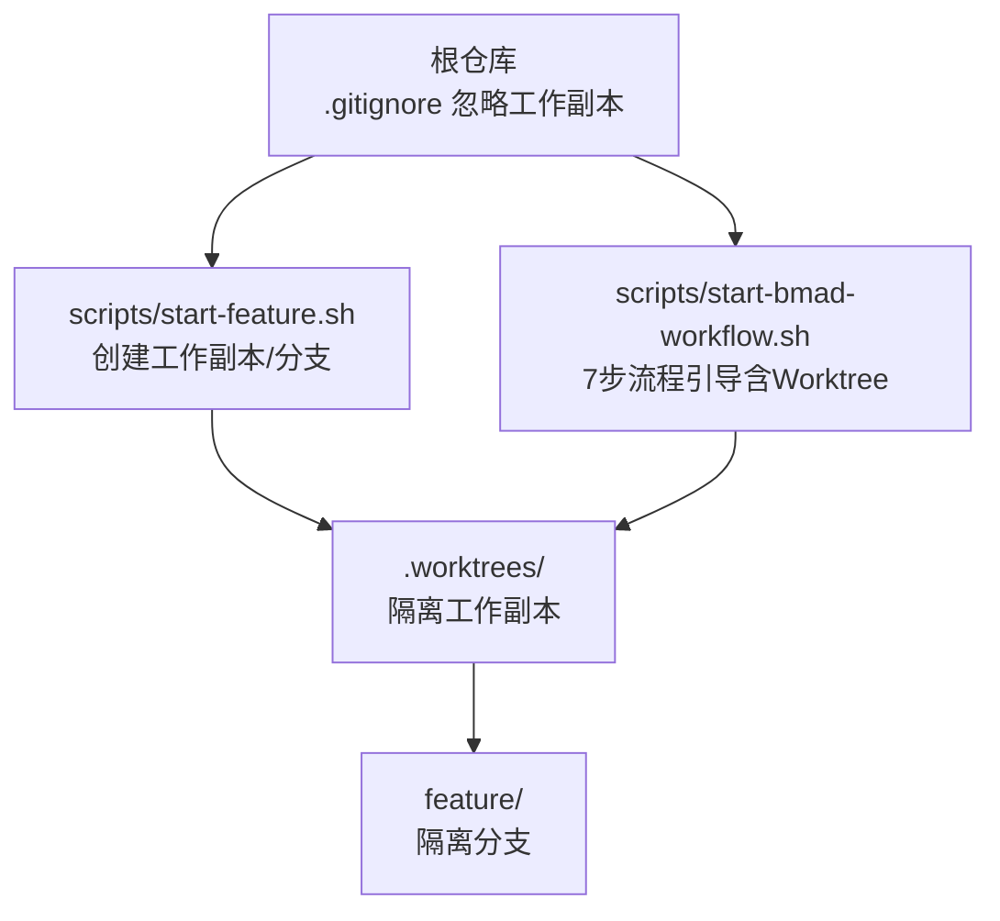
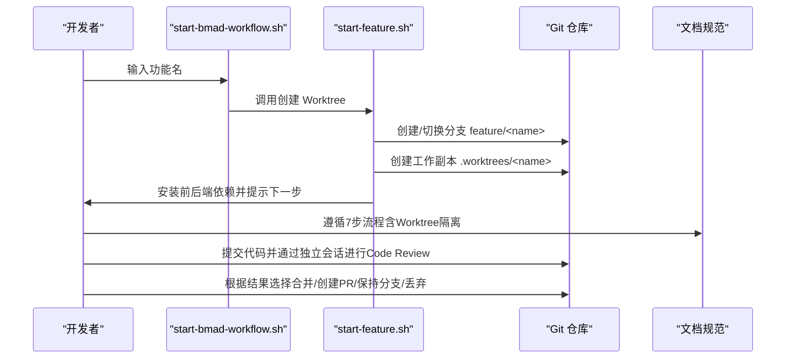
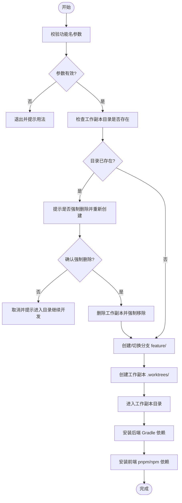
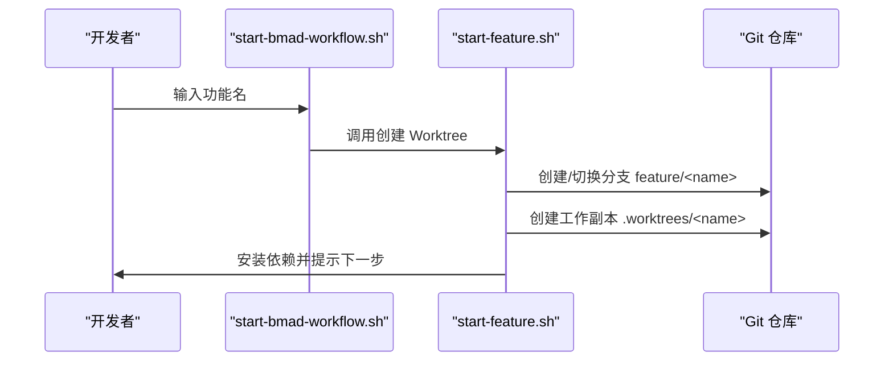
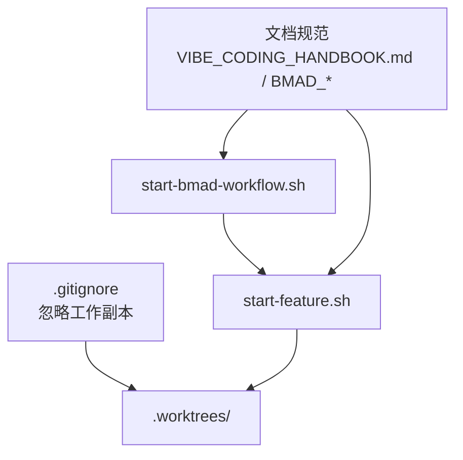

# Git Worktree管理

<cite>
**本文引用的文件**
- [.gitignore](file://.gitignore)
- [scripts/start-feature.sh](file://scripts/start-feature.sh)
- [scripts/start-bmad-workflow.sh](file://scripts/start-bmad-workflow.sh)
- [docs/BMAD_WORKFLOW_QUICKREF.md](file://docs/BMAD_WORKFLOW_QUICKREF.md)
- [docs/BMAD_SKILL_WORKFLOW.md](file://docs/BMAD_SKILL_WORKFLOW.md)
- [docs/VIBE_CODING_HANDBOOK.md](file://docs/VIBE_CODING_HANDBOOK.md)
- [README.md](file://README.md)
</cite>

## 目录
1. [简介](#简介)
2. [项目结构](#项目结构)
3. [核心组件](#核心组件)
4. [架构总览](#架构总览)
5. [详细组件分析](#详细组件分析)
6. [依赖关系分析](#依赖关系分析)
7. [性能考量](#性能考量)
8. [故障排查指南](#故障排查指南)
9. [结论](#结论)
10. [附录](#附录)

## 简介
本指南面向面试指南平台的开发者，系统讲解如何使用 Git Worktree 管理并行开发、隔离环境与临时分支，帮助你在同一仓库中高效地进行多任务并行开发、快速迭代与安全丢弃。文档基于仓库现有脚本与文档，提供从概念到实操、从最佳实践到常见问题的完整指引。

## 项目结构
面试指南平台采用前后端分离的多模块结构，配合 Git Worktree 可以在不同工作副本中并行开发不同功能，互不干扰。项目中与 Worktree 相关的关键位置如下：
- 顶层忽略规则：.gitignore 中包含对工作副本目录的忽略规则，避免将工作副本目录纳入主仓库跟踪。
- 启动脚本：scripts/start-feature.sh 与 scripts/start-bmad-workflow.sh 提供 Worktree 的创建、依赖安装与工作副本切换。
- 文档规范：docs/BMAD_WORKFLOW_QUICKREF.md、docs/BMAD_SKILL_WORKFLOW.md、docs/VIBE_CODING_HANDBOOK.md 明确了 Worktree 在团队开发流程中的职责与安全丢弃策略。

图表来源
- [.gitignore:7-11](file://.gitignore#L7-L11)
- [scripts/start-feature.sh:8-38](file://scripts/start-feature.sh#L8-L38)
- [scripts/start-bmad-workflow.sh:72-115](file://scripts/start-bmad-workflow.sh#L72-L115)

章节来源
- [.gitignore:7-11](file://.gitignore#L7-L11)
- [scripts/start-feature.sh:8-38](file://scripts/start-feature.sh#L8-L38)
- [scripts/start-bmad-workflow.sh:72-115](file://scripts/start-bmad-workflow.sh#L72-L115)
- [docs/BMAD_WORKFLOW_QUICKREF.md:77-87](file://docs/BMAD_WORKFLOW_QUICKREF.md#L77-L87)
- [docs/BMAD_SKILL_WORKFLOW.md:70-83](file://docs/BMAD_SKILL_WORKFLOW.md#L70-L83)
- [docs/VIBE_CODING_HANDBOOK.md:43-47](file://docs/VIBE_CODING_HANDBOOK.md#L43-L47)

## 核心组件
- .gitignore 中的工作副本忽略规则
  - 作用：防止将 .worktrees、.worktrees/*、worktrees 等工作副本目录纳入主仓库跟踪，避免污染主分支与提交历史。
  - 关键条目：.worktrees/、/.worktrees/、worktrees/。
- Worktree 启动脚本
  - scripts/start-feature.sh：创建工作副本目录、创建/切换分支、安装前后端依赖、给出后续指令与安全丢弃命令。
  - scripts/start-bmad-workflow.sh：7步流程引导，其中第2步为 Worktree 隔离，自动创建工作副本并安装依赖。
- 文档规范
  - BMAD_WORKFLOW_QUICKREF.md：明确“每个步骤都必须使用对应的 Skill”，其中步骤2为 Git Worktree，强调“不要跳过任何步骤”。
  - BMAD_SKILL_WORKFLOW.md：详细描述 Worktree 的自动执行步骤与安全丢弃命令。
  - VIBE_CODING_HANDBOOK.md：强制要求“所有新功能开发或实验性代码必须在 Git Worktree 中进行”，并提供“安全丢弃”的具体命令。

章节来源
- [.gitignore:7-11](file://.gitignore#L7-L11)
- [scripts/start-feature.sh:8-68](file://scripts/start-feature.sh#L8-L68)
- [scripts/start-bmad-workflow.sh:72-115](file://scripts/start-bmad-workflow.sh#L72-L115)
- [docs/BMAD_WORKFLOW_QUICKREF.md:77-87](file://docs/BMAD_WORKFLOW_QUICKREF.md#L77-L87)
- [docs/BMAD_SKILL_WORKFLOW.md:70-83](file://docs/BMAD_SKILL_WORKFLOW.md#L70-L83)
- [docs/VIBE_CODING_HANDBOOK.md:43-47](file://docs/VIBE_CODING_HANDBOOK.md#L43-L47)

## 架构总览
下图展示了在面试指南平台中使用 Worktree 的典型流程：从需求澄清到 Worktree 隔离、计划拆解、子代理开发、测试驱动、独立 Code Review、完成分支与合并/丢弃。

图表来源
- [scripts/start-bmad-workflow.sh:72-115](file://scripts/start-bmad-workflow.sh#L72-L115)
- [scripts/start-feature.sh:8-38](file://scripts/start-feature.sh#L8-L38)
- [docs/BMAD_WORKFLOW_QUICKREF.md:77-87](file://docs/BMAD_WORKFLOW_QUICKREF.md#L77-L87)
- [docs/BMAD_SKILL_WORKFLOW.md:70-83](file://docs/BMAD_SKILL_WORKFLOW.md#L70-L83)
- [docs/VIBE_CODING_HANDBOOK.md:43-47](file://docs/VIBE_CODING_HANDBOOK.md#L43-L47)

## 详细组件分析

### .gitignore 中的 Worktree 忽略规则
- 忽略范围
  - .worktrees/：忽略工作副本目录
  - /.worktrees/：忽略根目录下的工作副本目录
  - worktrees/：忽略工作副本目录
- 作用
  - 防止将工作副本目录纳入主仓库跟踪，避免污染主分支与提交历史，便于安全丢弃工作副本。
- 与 Worktree 的关系
  - Worktree 的工作副本目录通常位于 .worktrees/<feature-name>，.gitignore 的忽略规则确保这些目录不会被提交到主分支。

章节来源
- [.gitignore:7-11](file://.gitignore#L7-L11)

### Worktree 启动脚本：start-feature.sh
- 功能概述
  - 接收功能名参数，检查工作副本目录是否存在，如存在则可选择强制删除并重新创建。
  - 自动创建/切换分支 feature/<feature-name>，并创建工作副本 .worktrees/<feature-name>。
  - 进入工作副本目录，安装后端 Gradle 依赖与前端 pnpm/npm 依赖。
  - 输出工作目录与分支名称，并给出后续开发建议与安全丢弃命令。
- 关键流程
  - 参数校验与目录存在性检查
  - 创建/切换分支与创建工作副本
  - 安装依赖与提示下一步
  - 安全丢弃命令提示

图表来源
- [scripts/start-feature.sh:8-68](file://scripts/start-feature.sh#L8-L68)

章节来源
- [scripts/start-feature.sh:8-68](file://scripts/start-feature.sh#L8-L68)

### Worktree 启动脚本：start-bmad-workflow.sh
- 功能概述
  - 7步流程引导，其中第2步为 Git Worktree 隔离，自动创建工作副本并安装依赖。
  - 提供颜色化输出与步骤说明，便于新手快速上手。
- 关键流程
  - 步骤2：Git Worktree 隔离
    - 检查工作副本目录是否存在，如存在则可选择强制删除并重新创建。
    - 创建/切换分支 feature/<feature-name>，并创建工作副本 .worktrees/<feature-name>。
    - 进入工作副本目录，安装后端 Gradle 依赖与前端 pnpm/npm 依赖。
    - 输出工作目录与分支名称，并提示下一步。

图表来源
- [scripts/start-bmad-workflow.sh:72-115](file://scripts/start-bmad-workflow.sh#L72-L115)
- [scripts/start-feature.sh:8-38](file://scripts/start-feature.sh#L8-L38)

章节来源
- [scripts/start-bmad-workflow.sh:72-115](file://scripts/start-bmad-workflow.sh#L72-L115)

### 文档规范中的 Worktree 要求与安全丢弃
- 强制要求
  - 所有新功能开发或实验性代码必须在 Git Worktree 中进行。
- 安全丢弃
  - 若需求取消或代码不满足预期，直接运行 git worktree remove -f .worktrees/<feature-name>，主分支不受任何影响。
- 与流程的关系
  - BMAD_WORKFLOW_QUICKREF.md、BMAD_SKILL_WORKFLOW.md、VIBE_CODING_HANDBOOK.md 明确 Worktree 在流程中的职责与安全丢弃策略，确保开发过程可控、可回滚、可清理。

章节来源
- [docs/BMAD_WORKFLOW_QUICKREF.md:77-87](file://docs/BMAD_WORKFLOW_QUICKREF.md#L77-L87)
- [docs/BMAD_SKILL_WORKFLOW.md:70-83](file://docs/BMAD_SKILL_WORKFLOW.md#L70-L83)
- [docs/VIBE_CODING_HANDBOOK.md:43-47](file://docs/VIBE_CODING_HANDBOOK.md#L43-L47)

## 依赖关系分析
- .gitignore 与 Worktree
  - .gitignore 中的忽略规则确保工作副本目录不会被提交到主分支，从而保证主分支的整洁与可维护性。
- 脚本与 Git
  - start-feature.sh 与 start-bmad-workflow.sh 依赖 Git 的工作副本与分支功能，分别负责创建/切换分支与创建工作副本。
- 文档与流程
  - 文档规范明确了 Worktree 在团队开发流程中的职责，确保每个步骤都得到严格执行，避免跳过 Worktree 隔离导致的分支污染与冲突。

图表来源
- [.gitignore:7-11](file://.gitignore#L7-L11)
- [scripts/start-feature.sh:8-38](file://scripts/start-feature.sh#L8-L38)
- [scripts/start-bmad-workflow.sh:72-115](file://scripts/start-bmad-workflow.sh#L72-L115)
- [docs/BMAD_WORKFLOW_QUICKREF.md:77-87](file://docs/BMAD_WORKFLOW_QUICKREF.md#L77-L87)
- [docs/BMAD_SKILL_WORKFLOW.md:70-83](file://docs/BMAD_SKILL_WORKFLOW.md#L70-L83)
- [docs/VIBE_CODING_HANDBOOK.md:43-47](file://docs/VIBE_CODING_HANDBOOK.md#L43-L47)

章节来源
- [.gitignore:7-11](file://.gitignore#L7-L11)
- [scripts/start-feature.sh:8-38](file://scripts/start-feature.sh#L8-L38)
- [scripts/start-bmad-workflow.sh:72-115](file://scripts/start-bmad-workflow.sh#L72-L115)
- [docs/BMAD_WORKFLOW_QUICKREF.md:77-87](file://docs/BMAD_WORKFLOW_QUICKREF.md#L77-L87)
- [docs/BMAD_SKILL_WORKFLOW.md:70-83](file://docs/BMAD_SKILL_WORKFLOW.md#L70-L83)
- [docs/VIBE_CODING_HANDBOOK.md:43-47](file://docs/VIBE_CODING_HANDBOOK.md#L43-L47)

## 性能考量
- 并行开发效率
  - 使用 Worktree 可以在同一仓库中并行开发多个功能，互不干扰，提高开发效率。
- 依赖安装与构建
  - 脚本会在创建工作副本后自动安装后端 Gradle 依赖与前端 pnpm/npm 依赖，减少手动操作。
- 安全丢弃
  - 通过 git worktree remove -f 可以快速丢弃整个工作副本，避免残留文件影响主分支与后续开发。

## 故障排查指南
- 工作副本目录已存在
  - 现象：脚本提示工作副本目录已存在。
  - 处理：根据脚本提示选择强制删除并重新创建，或取消并进入现有目录继续开发。
- 分支创建失败
  - 现象：创建/切换分支失败。
  - 处理：确认当前分支状态，确保分支名称合法，或手动创建分支后再创建工作副本。
- 依赖安装失败
  - 现象：Gradle 或 pnpm/npm 安装失败。
  - 处理：检查网络与环境配置，手动执行安装命令并查看错误日志。
- 安全丢弃失败
  - 现象：git worktree remove -f 失败。
  - 处理：确认工作副本目录路径正确，检查是否有进程占用，必要时手动删除目录并清理 Git 的工作副本记录。

章节来源
- [scripts/start-feature.sh:20-30](file://scripts/start-feature.sh#L20-L30)
- [scripts/start-bmad-workflow.sh:80-90](file://scripts/start-bmad-workflow.sh#L80-L90)
- [docs/VIBE_CODING_HANDBOOK.md:43-47](file://docs/VIBE_CODING_HANDBOOK.md#L43-L47)

## 结论
通过 .gitignore 的工作副本忽略规则、脚本化的 Worktree 创建与依赖安装流程，以及严格的文档规范，面试指南平台实现了高效的并行开发与可控的安全丢弃。建议在日常开发中严格遵循 Worktree 隔离与流程规范，确保主分支的稳定与可维护性。

## 附录
- 常用命令速查
  - 创建 Worktree：./scripts/start-feature.sh <feature-name>
  - 7步流程引导：./scripts/start-bmad-workflow.sh <feature-name>
  - 安全丢弃：git worktree remove -f .worktrees/<feature-name>
- 参考文档
  - BMAD_WORKFLOW_QUICKREF.md：7步流程快速参考
  - BMAD_SKILL_WORKFLOW.md：完整工作流指南
  - VIBE_CODING_HANDBOOK.md：团队手册与规范

章节来源
- [docs/BMAD_WORKFLOW_QUICKREF.md:77-87](file://docs/BMAD_WORKFLOW_QUICKREF.md#L77-L87)
- [docs/BMAD_SKILL_WORKFLOW.md:70-83](file://docs/BMAD_SKILL_WORKFLOW.md#L70-L83)
- [docs/VIBE_CODING_HANDBOOK.md:43-47](file://docs/VIBE_CODING_HANDBOOK.md#L43-L47)
- [README.md:210-247](file://README.md#L210-L247)