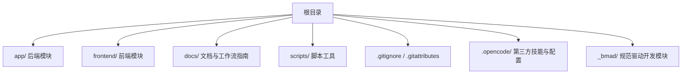
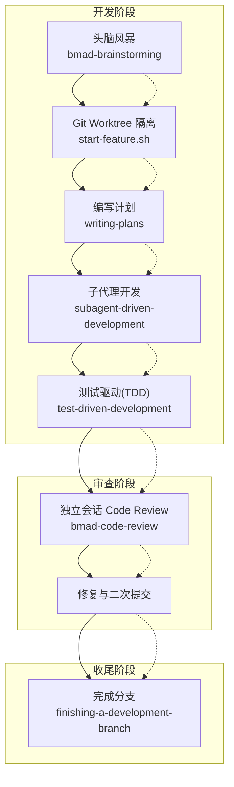
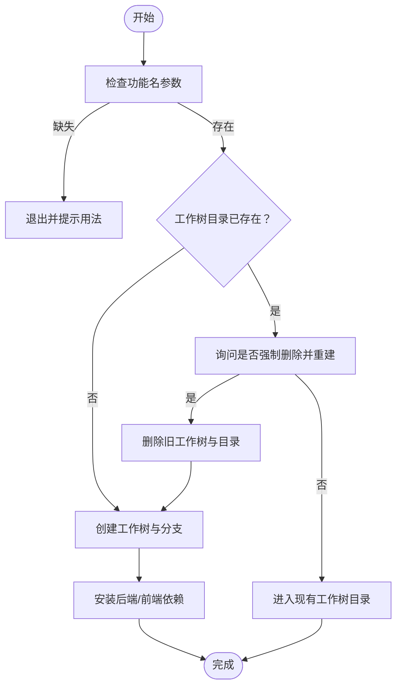
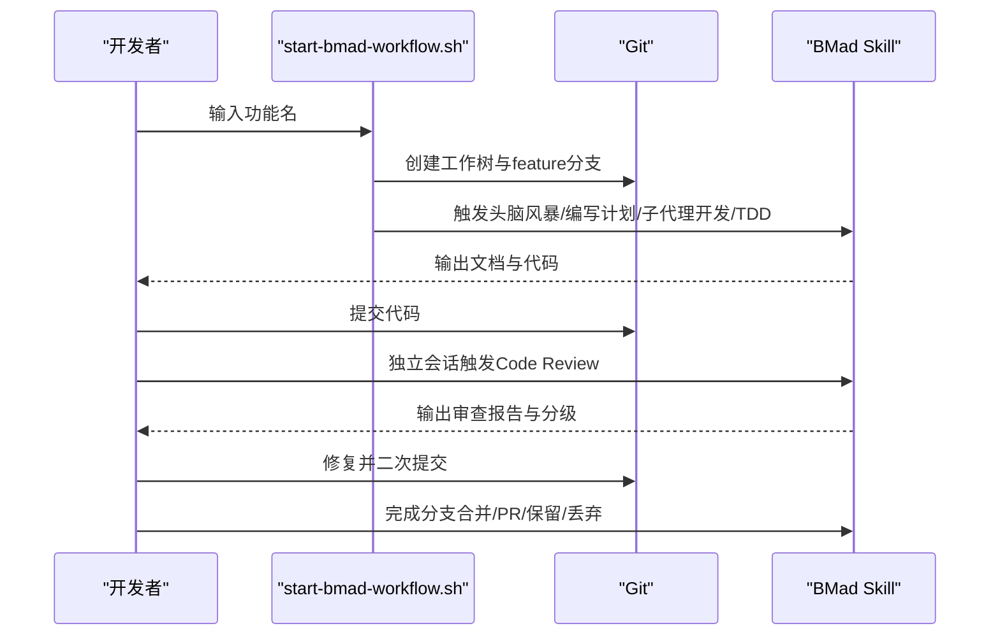
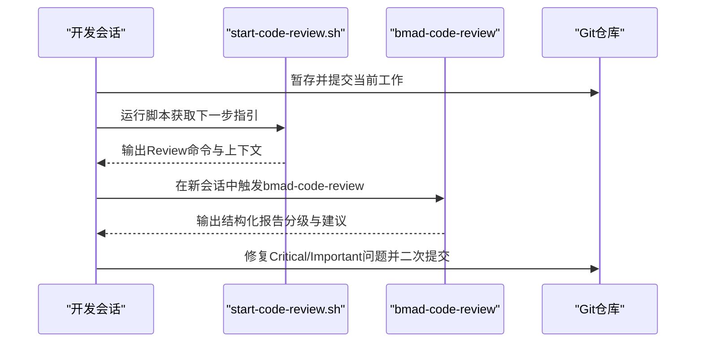
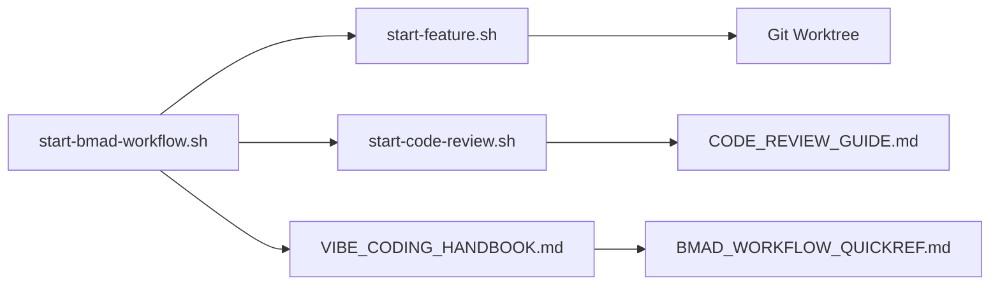

# Git基础工作流

<cite>
**本文引用的文件**
- [.gitignore](file://.gitignore)
- [.gitattributes](file://.gitattributes)
- [scripts/start-feature.sh](file://scripts/start-feature.sh)
- [scripts/start-bmad-workflow.sh](file://scripts/start-bmad-workflow.sh)
- [scripts/start-code-review.sh](file://scripts/start-code-review.sh)
- [docs/BMAD_WORKFLOW_QUICKREF.md](file://docs/BMAD_WORKFLOW_QUICKREF.md)
- [docs/CODE_REVIEW_GUIDE.md](file://docs/CODE_REVIEW_GUIDE.md)
- [docs/VIBE_CODING_HANDBOOK.md](file://docs/VIBE_CODING_HANDBOOK.md)
- [frontend/.gitignore](file://frontend/.gitignore)
- [frontend/.dockerignore](file://frontend/.dockerignore)
- [.opencode/.gitignore](file://.opencode/.gitignore)
</cite>

## 目录
1. [简介](#简介)
2. [项目结构](#项目结构)
3. [核心组件](#核心组件)
4. [架构总览](#架构总览)
5. [详细组件分析](#详细组件分析)
6. [依赖关系分析](#依赖关系分析)
7. [性能考量](#性能考量)
8. [故障排查指南](#故障排查指南)
9. [结论](#结论)
10. [附录](#附录)

## 简介
本指南面向面试指南平台的开发者，系统讲解基于 Git 的基础工作流，涵盖分支管理策略、提交规范、合并流程、冲突处理、以及项目中 .gitignore 与 .gitattributes 的作用与配置。同时提供脚本化的工作流工具使用方式，帮助团队建立标准化、可追溯、高质量的协作流程。

## 项目结构
本项目采用前后端分离与多模块并行开发的组织方式，配合 Git Worktree 实现功能开发隔离，减少分支间耦合，提高开发效率与质量。

[本图为概念性结构示意，不直接映射具体源文件，故不附图表来源]

## 核心组件
- Git 工作树（Git Worktree）：隔离功能开发，便于并行实验与快速丢弃。
- 提交与分支：feature/* 分支命名、提交信息格式、合并策略。
- 审查流程：独立会话 Code Review，三层并行审查，问题分级与修复闭环。
- 忽略与属性：.gitignore 与 .gitattributes，确保无关文件不进入版本控制，统一换行符。

章节来源
- [scripts/start-feature.sh:1-68](file://scripts/start-feature.sh#L1-L68)
- [scripts/start-bmad-workflow.sh:1-253](file://scripts/start-bmad-workflow.sh#L1-L253)
- [docs/BMAD_WORKFLOW_QUICKREF.md:1-178](file://docs/BMAD_WORKFLOW_QUICKREF.md#L1-L178)
- [docs/CODE_REVIEW_GUIDE.md:1-360](file://docs/CODE_REVIEW_GUIDE.md#L1-L360)

## 架构总览
下图展示了从需求澄清到完成分支的完整工作流，强调“隔离开发、独立审查、可追溯文档”的工程化质量护栏。

图表来源
- [scripts/start-bmad-workflow.sh:35-253](file://scripts/start-bmad-workflow.sh#L35-L253)
- [docs/BMAD_WORKFLOW_QUICKREF.md:65-178](file://docs/BMAD_WORKFLOW_QUICKREF.md#L65-L178)
- [docs/VIBE_CODING_HANDBOOK.md:27-147](file://docs/VIBE_CODING_HANDBOOK.md#L27-L147)

## 详细组件分析

### 1) Git 忽略配置（.gitignore 与 .gitattributes）
- .gitignore：统一忽略构建产物、缓存、IDE 配置、环境变量文件等，避免污染仓库。
- .gitattributes：统一换行符策略，Linux/macOS 脚本使用 LF，Windows 脚本使用 CRLF，减少跨平台差异导致的噪音。

章节来源
- [.gitignore:1-800](file://.gitignore#L1-L800)
- [.gitattributes:1-10](file://.gitattributes#L1-L10)
- [frontend/.gitignore:1-25](file://frontend/.gitignore#L1-L25)
- [frontend/.dockerignore:1-38](file://frontend/.dockerignore#L1-L38)
- [.opencode/.gitignore:1-5](file://.opencode/.gitignore#L1-L5)

### 2) 分支命名规范与提交信息格式
- 分支命名：feature/<功能名>，确保功能边界清晰、可追溯。
- 提交信息：采用约定式提交风格，如 feat:、fix:、docs:、refactor: 等，配合功能描述，便于自动化工具与阅读。
- 合并策略：功能开发完成后，通过独立 Review 会话确认质量，再进行合并或创建 PR。

章节来源
- [docs/BMAD_WORKFLOW_QUICKREF.md:131-153](file://docs/BMAD_WORKFLOW_QUICKREF.md#L131-L153)
- [docs/CODE_REVIEW_GUIDE.md:28-31](file://docs/CODE_REVIEW_GUIDE.md#L28-L31)
- [docs/VIBE_CODING_HANDBOOK.md:117-129](file://docs/VIBE_CODING_HANDBOOK.md#L117-L129)

### 3) Git Worktree 隔离开发（start-feature.sh）
- 自动创建隔离工作树与 feature 分支，安装前后端依赖，支持快速丢弃与并行开发。
- 若工作树目录已存在，提供强制删除与重建选项，避免冲突。

图表来源
- [scripts/start-feature.sh:12-68](file://scripts/start-feature.sh#L12-L68)

章节来源
- [scripts/start-feature.sh:1-68](file://scripts/start-feature.sh#L1-L68)

### 4) BMad 标准化开发流程（start-bmad-workflow.sh）
- 7步流程：头脑风暴 → Git Worktree → 编写计划 → 子代理开发 → TDD → 独立 Review → 完成分支。
- 每步对应 Skill 或脚本，确保过程可追溯、质量可量化。

图表来源
- [scripts/start-bmad-workflow.sh:54-253](file://scripts/start-bmad-workflow.sh#L54-L253)
- [docs/BMAD_WORKFLOW_QUICKREF.md:65-178](file://docs/BMAD_WORKFLOW_QUICKREF.md#L65-L178)

章节来源
- [scripts/start-bmad-workflow.sh:1-253](file://scripts/start-bmad-workflow.sh#L1-L253)
- [docs/BMAD_WORKFLOW_QUICKREF.md:1-178](file://docs/BMAD_WORKFLOW_QUICKREF.md#L1-L178)

### 5) 独立会话 Code Review（start-code-review.sh 与 CODE_REVIEW_GUIDE.md）
- 强制在新会话中执行 Review，避免认知偏差与目标污染。
- 三层并行审查：盲审猎人、边界案例猎人、验收审计员。
- 问题分级：Critical/Important/Minor，修复闭环与二次 Review。

图表来源
- [scripts/start-code-review.sh:69-136](file://scripts/start-code-review.sh#L69-L136)
- [docs/CODE_REVIEW_GUIDE.md:13-200](file://docs/CODE_REVIEW_GUIDE.md#L13-L200)

章节来源
- [scripts/start-code-review.sh:1-136](file://scripts/start-code-review.sh#L1-L136)
- [docs/CODE_REVIEW_GUIDE.md:1-360](file://docs/CODE_REVIEW_GUIDE.md#L1-L360)

### 6) 常见 Git 操作与使用场景
- 切换分支与合并：git checkout、git merge、git rebase（变基建议谨慎使用，合并更利于保留历史）。
- 冲突处理：定位冲突文件 → 手动/工具解决 → 提交 → 继续流程。
- 提交与推送：git add、git commit、git push（按团队策略推送远端分支）。

章节来源
- [docs/BMAD_WORKFLOW_QUICKREF.md:131-153](file://docs/BMAD_WORKFLOW_QUICKREF.md#L131-L153)
- [docs/VIBE_CODING_HANDBOOK.md:117-129](file://docs/VIBE_CODING_HANDBOOK.md#L117-L129)

## 依赖关系分析
- 脚本依赖 Git 工具链与 Shell 环境，依赖 Gradle/PNPM 等构建工具完成工作树初始化。
- 文档与指南相互引用，形成“流程-工具-规范”的闭环。

图表来源
- [scripts/start-feature.sh:1-68](file://scripts/start-feature.sh#L1-L68)
- [scripts/start-bmad-workflow.sh:1-253](file://scripts/start-bmad-workflow.sh#L1-L253)
- [scripts/start-code-review.sh:1-136](file://scripts/start-code-review.sh#L1-L136)
- [docs/CODE_REVIEW_GUIDE.md:1-360](file://docs/CODE_REVIEW_GUIDE.md#L1-L360)
- [docs/VIBE_CODING_HANDBOOK.md:1-241](file://docs/VIBE_CODING_HANDBOOK.md#L1-L241)
- [docs/BMAD_WORKFLOW_QUICKREF.md:1-178](file://docs/BMAD_WORKFLOW_QUICKREF.md#L1-L178)

章节来源
- [scripts/start-feature.sh:1-68](file://scripts/start-feature.sh#L1-L68)
- [scripts/start-bmad-workflow.sh:1-253](file://scripts/start-bmad-workflow.sh#L1-L253)
- [scripts/start-code-review.sh:1-136](file://scripts/start-code-review.sh#L1-L136)
- [docs/BMAD_WORKFLOW_QUICKREF.md:1-178](file://docs/BMAD_WORKFLOW_QUICKREF.md#L1-L178)
- [docs/CODE_REVIEW_GUIDE.md:1-360](file://docs/CODE_REVIEW_GUIDE.md#L1-L360)
- [docs/VIBE_CODING_HANDBOOK.md:1-241](file://docs/VIBE_CODING_HANDBOOK.md#L1-L241)

## 性能考量
- 使用 Git Worktree 隔离开发，避免主分支频繁变更，减少合并冲突与 CI 压力。
- 通过 .gitignore 与 .dockerignore 过滤无关文件，缩短检出与推送时间。
- .gitattributes 统一换行符，减少跨平台差异带来的 diff 噪音与冲突。

[本节为通用指导，不直接分析具体文件，故不附章节来源]

## 故障排查指南
- 工作树目录已存在：按提示选择强制删除并重建，或直接进入现有工作树继续开发。
- Review 会话无法启动：确认已在新会话中执行 bmad-code-review，提供 Story/计划文件路径与审查范围。
- 冲突处理：使用工具定位冲突文件，逐行核对差异，修复后提交，继续合并流程。
- 提交信息不符合规范：遵循约定式提交风格，配合功能描述，便于自动化与回溯。

章节来源
- [scripts/start-feature.sh:19-30](file://scripts/start-feature.sh#L19-L30)
- [scripts/start-code-review.sh:21-32](file://scripts/start-code-review.sh#L21-L32)
- [docs/CODE_REVIEW_GUIDE.md:246-262](file://docs/CODE_REVIEW_GUIDE.md#L246-L262)

## 结论
通过 Git Worktree 隔离、标准化分支与提交规范、独立会话 Code Review 三层质量护栏，以及 .gitignore/.gitattributes 的工程化配置，面试指南平台建立了可扩展、可追溯、高质量的协作工作流。建议团队在日常开发中严格执行流程，持续优化规则与脚本，提升交付效率与质量。

[本节为总结性内容，不直接分析具体文件，故不附章节来源]

## 附录
- 常用命令速查
  - 创建并切换到 feature 分支：git checkout -b feature/<功能名>
  - 合并到主分支：git checkout main && git merge feature/<功能名>
  - 变基到主分支：git checkout feature/<功能名> && git rebase main
  - 推送分支：git push origin feature/<功能名>
  - 删除工作树：git worktree remove -f .worktrees/<功能名>

章节来源
- [docs/BMAD_WORKFLOW_QUICKREF.md:131-153](file://docs/BMAD_WORKFLOW_QUICKREF.md#L131-L153)
- [scripts/start-feature.sh:65-68](file://scripts/start-feature.sh#L65-L68)