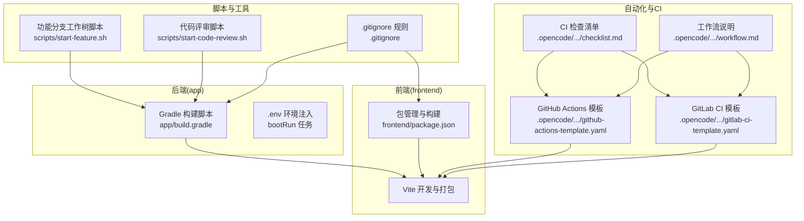
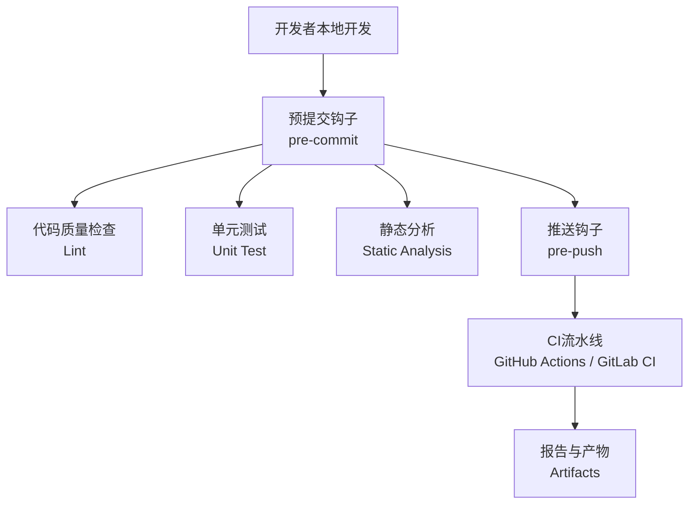
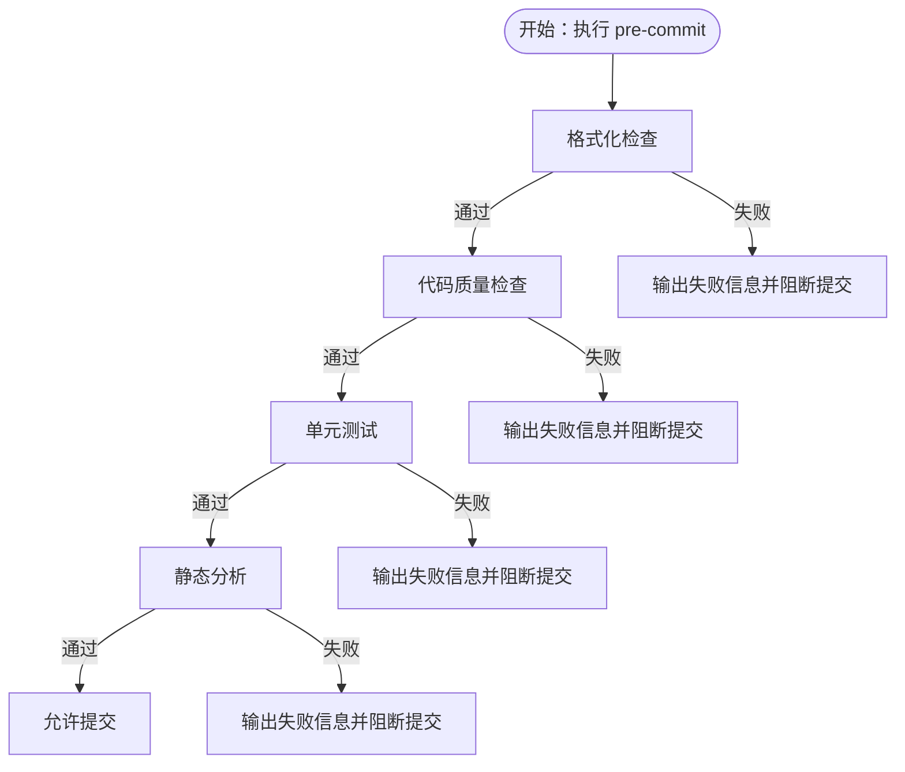
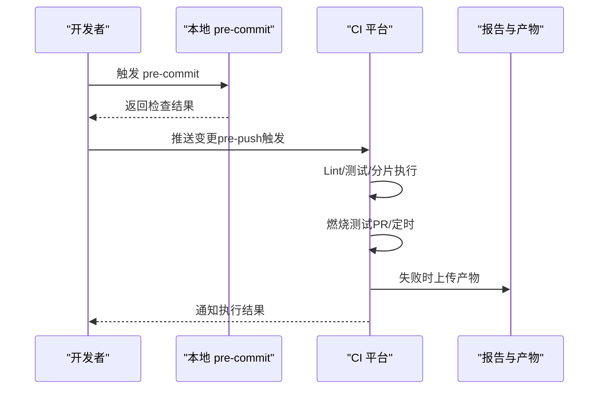
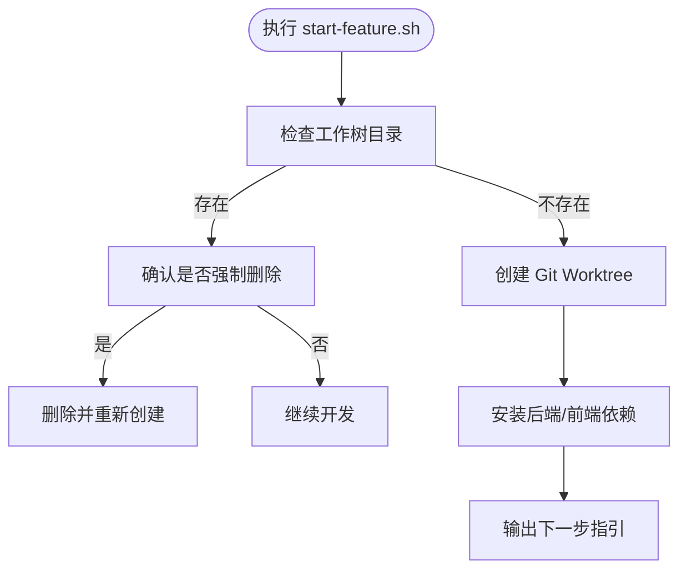
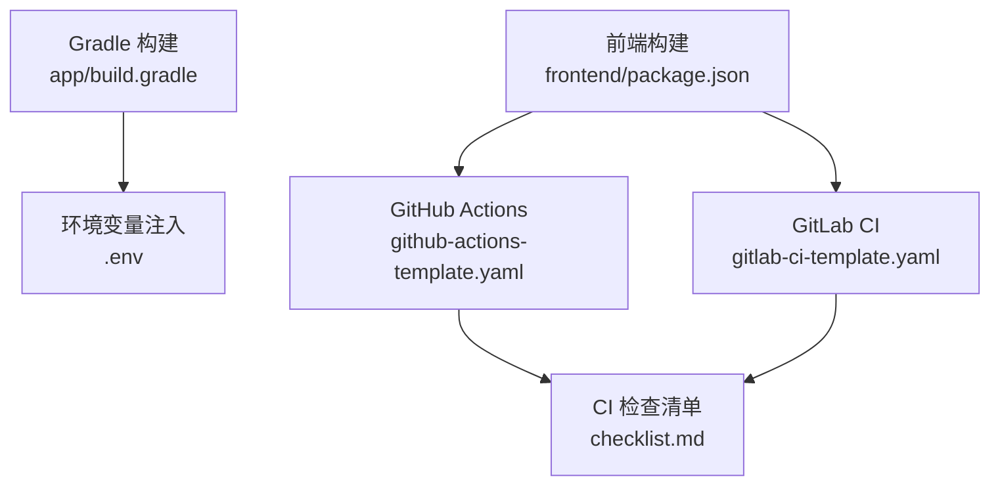

# Git钩子和自动化

<cite>
**本文引用的文件**   
- [README.md](file://README.md)
- [.gitignore](file://.gitignore)
- [scripts/start-feature.sh](file://scripts/start-feature.sh)
- [scripts/start-code-review.sh](file://scripts/start-code-review.sh)
- [app/build.gradle](file://app/build.gradle)
- [frontend/package.json](file://frontend/package.json)
- [github-actions-template.yaml](file://.opencode/skills/bmad-testarch-ci/github-actions-template.yaml)
- [gitlab-ci-template.yaml](file://.opencode/skills/bmad-testarch-ci/gitlab-ci-template.yaml)
- [checklist.md](file://.opencode/skills/bmad-testarch-ci/checklist.md)
- [workflow.md](file://.opencode/skills/bmad-testarch-ci/workflow.md)
</cite>

## 目录
1. [简介](#简介)
2. [项目结构](#项目结构)
3. [核心组件](#核心组件)
4. [架构总览](#架构总览)
5. [详细组件分析](#详细组件分析)
6. [依赖关系分析](#依赖关系分析)
7. [性能考量](#性能考量)
8. [故障排查指南](#故障排查指南)
9. [结论](#结论)
10. [附录](#附录)

## 简介
本指南面向面试指南平台的开发者与运维团队，系统讲解如何在本项目中落地Git钩子与自动化流水线，涵盖以下主题：
- Git钩子基础：客户端钩子与服务器端钩子的区别与适用场景
- 常见钩子类型：预提交、预合并、推送等的配置与实践
- 钩子脚本示例：代码格式化检查、单元测试运行、静态代码分析等
- CI/CD集成：基于GitHub Actions与GitLab CI的流水线模板与最佳实践
- 跨平台兼容性与调试方法：在不同操作系统与CI平台上的注意事项

本指南既适合初学者快速上手，也为有经验的工程师提供深入的技术细节与可视化流程。

## 项目结构
面试指南平台采用前后端分离架构，后端基于Spring Boot 4.0 + Java 21，前端基于React 18.3 + TypeScript + Vite。项目根目录包含Gradle构建脚本、前端包管理配置、以及一套用于自动化与质量门禁的CI模板与脚本。

**图表来源**
- [app/build.gradle:104-135](file://app/build.gradle#L104-L135)
- [frontend/package.json:6-10](file://frontend/package.json#L6-L10)
- [github-actions-template.yaml:13-26](file://.opencode/skills/bmad-testarch-ci/github-actions-template.yaml#L13-L26)
- [gitlab-ci-template.yaml:13-27](file://.opencode/skills/bmad-testarch-ci/gitlab-ci-template.yaml#L13-L27)
- [checklist.md:37-136](file://.opencode/skills/bmad-testarch-ci/checklist.md#L37-L136)
- [workflow.md:1-50](file://.opencode/skills/bmad-testarch-ci/workflow.md#L1-L50)
- [scripts/start-feature.sh:1-68](file://scripts/start-feature.sh#L1-L68)
- [scripts/start-code-review.sh:1-136](file://scripts/start-code-review.sh#L1-L136)
- [.gitignore:1-800](file://.gitignore#L1-L800)

**章节来源**
- [README.md:210-247](file://README.md#L210-L247)
- [app/build.gradle:104-135](file://app/build.gradle#L104-L135)
- [frontend/package.json:6-10](file://frontend/package.json#L6-L10)
- [.gitignore:1-800](file://.gitignore#L1-L800)

## 核心组件
- 后端构建与运行
  - Gradle插件与依赖管理：Spring Boot、Spring AI、PostgreSQL、Redisson、iText、MapStruct、Lombok等
  - bootRun任务：从根目录.env注入环境变量，统一JVM编码为UTF-8
- 前端构建与开发
  - Vite + TypeScript + React生态，提供开发服务器与生产构建
- 自动化与CI模板
  - GitHub Actions与GitLab CI模板：包含Lint、并行分片测试、燃烧测试（Burn-In）与报告聚合
  - CI检查清单：覆盖配置、并行分片、燃烧测试、缓存、产物收集、重试逻辑与文档
- 脚本与工具
  - start-feature.sh：基于Git Worktree创建隔离开发环境，自动安装依赖并给出下一步指引
  - start-code-review.sh：引导Code Review流程，提示暂存、提交、在新会话中执行Review等步骤

**章节来源**
- [app/build.gradle:23-87](file://app/build.gradle#L23-L87)
- [app/build.gradle:104-135](file://app/build.gradle#L104-L135)
- [frontend/package.json:6-10](file://frontend/package.json#L6-L10)
- [github-actions-template.yaml:28-207](file://.opencode/skills/bmad-testarch-ci/github-actions-template.yaml#L28-L207)
- [gitlab-ci-template.yaml:39-159](file://.opencode/skills/bmad-testarch-ci/gitlab-ci-template.yaml#L39-L159)
- [checklist.md:37-136](file://.opencode/skills/bmad-testarch-ci/checklist.md#L37-L136)
- [scripts/start-feature.sh:1-68](file://scripts/start-feature.sh#L1-L68)
- [scripts/start-code-review.sh:1-136](file://scripts/start-code-review.sh#L1-L136)

## 架构总览
下图展示了从本地开发到CI执行的关键路径，以及与Git钩子的结合点：

**图表来源**
- [github-actions-template.yaml:29-60](file://.opencode/skills/bmad-testarch-ci/github-actions-template.yaml#L29-L60)
- [gitlab-ci-template.yaml:39-76](file://.opencode/skills/bmad-testarch-ci/gitlab-ci-template.yaml#L39-L76)
- [checklist.md:87-101](file://.opencode/skills/bmad-testarch-ci/checklist.md#L87-L101)

## 详细组件分析

### Git钩子与类型
- 客户端钩子（Client Hooks）
  - 在本地仓库触发，如pre-commit、prepare-commit-msg、commit-msg、post-commit等
  - 适用于在提交前进行代码质量检查、格式化、单元测试等
- 服务器端钩子（Server Hooks）
  - 在远程仓库接收推送时触发，如pre-receive、update、post-receive等
  - 适用于在合并请求或推送时进行权限校验、批量检查、触发CI等

在面试指南平台中，建议在本地使用客户端钩子进行预提交检查，同时在CI平台中配置推送触发的流水线，形成“本地快速反馈 + 远程质量门禁”的双层保障。

**章节来源**
- [github-actions-template.yaml:15-22](file://.opencode/skills/bmad-testarch-ci/github-actions-template.yaml#L15-L22)
- [gitlab-ci-template.yaml:13-17](file://.opencode/skills/bmad-testarch-ci/gitlab-ci-template.yaml#L13-L17)

### 预提交钩子（pre-commit）
- 常见检查项
  - 代码格式化检查（如Prettier、ESLint、Spotless等）
  - 单元测试运行（确保新增/修改代码通过测试）
  - 静态代码分析（SonarQube、SpotBugs、Spotless等）
- 在本项目中的落地建议
  - 前端：在pre-commit中执行ESLint与单元测试，确保变更符合规范
  - 后端：在pre-commit中执行Spotless格式化与JUnit测试
  - 产物：将失败的测试报告与日志输出到统一位置，便于后续CI复用

**图表来源**
- [github-actions-template.yaml:29-60](file://.opencode/skills/bmad-testarch-ci/github-actions-template.yaml#L29-L60)
- [gitlab-ci-template.yaml:39-76](file://.opencode/skills/bmad-testarch-ci/gitlab-ci-template.yaml#L39-L76)

**章节来源**
- [github-actions-template.yaml:29-60](file://.opencode/skills/bmad-testarch-ci/github-actions-template.yaml#L29-L60)
- [gitlab-ci-template.yaml:39-76](file://.opencode/skills/bmad-testarch-ci/gitlab-ci-template.yaml#L39-L76)

### 预合并钩子（prepare-commit-msg/commit-msg）
- 作用：在提交信息生成或提交时进行规范化与校验
- 在面试指南平台中的建议
  - 规范化提交信息格式（如feat/fix/docs/chore等）
  - 校验是否包含关联Issue编号或工作项标识

**章节来源**
- [scripts/start-code-review.sh:69-130](file://scripts/start-code-review.sh#L69-L130)

### 推送钩子（pre-push）
- 作用：在推送前进行最终校验，避免不符合规范的变更进入共享分支
- 在面试指南平台中的建议
  - 强制执行CI流水线（如GitHub Actions或GitLab CI）以确保推送的变更通过Lint、测试与静态分析
  - 对于主分支推送，可额外触发安全扫描与合规检查

**章节来源**
- [github-actions-template.yaml:15-22](file://.opencode/skills/bmad-testarch-ci/github-actions-template.yaml#L15-L22)
- [gitlab-ci-template.yaml:13-17](file://.opencode/skills/bmad-testarch-ci/gitlab-ci-template.yaml#L13-L17)

### CI/CD流水线模板与最佳实践
- GitHub Actions模板
  - 触发条件：push到main/develop、pull_request、schedule（每周燃烧测试）
  - 并行分片：4个分片并行执行测试，提高吞吐
  - 燃烧测试：在PR或定时任务中执行10轮UI稳定性检测
  - 缓存：npm与Playwright浏览器缓存，减少安装时间
  - 产物：失败时上传测试结果与报告
- GitLab CI模板
  - stages：lint → test → burn-in → report
  - 并行分片：test:shard-1~4
  - 燃烧测试：MR或定时触发
  - 缓存：npm、Playwright浏览器与node_modules
  - 产物：失败时收集测试结果与报告

**图表来源**
- [github-actions-template.yaml:15-22](file://.opencode/skills/bmad-testarch-ci/github-actions-template.yaml#L15-L22)
- [github-actions-template.yaml:68-120](file://.opencode/skills/bmad-testarch-ci/github-actions-template.yaml#L68-L120)
- [github-actions-template.yaml:121-185](file://.opencode/skills/bmad-testarch-ci/github-actions-template.yaml#L121-L185)
- [gitlab-ci-template.yaml:13-17](file://.opencode/skills/bmad-testarch-ci/gitlab-ci-template.yaml#L13-L17)
- [gitlab-ci-template.yaml:55-96](file://.opencode/skills/bmad-testarch-ci/gitlab-ci-template.yaml#L55-L96)
- [gitlab-ci-template.yaml:98-137](file://.opencode/skills/bmad-testarch-ci/gitlab-ci-template.yaml#L98-L137)

**章节来源**
- [github-actions-template.yaml:13-207](file://.opencode/skills/bmad-testarch-ci/github-actions-template.yaml#L13-L207)
- [gitlab-ci-template.yaml:13-159](file://.opencode/skills/bmad-testarch-ci/gitlab-ci-template.yaml#L13-L159)
- [checklist.md:37-136](file://.opencode/skills/bmad-testarch-ci/checklist.md#L37-L136)

### 脚本与工具
- 功能分支工作树脚本（start-feature.sh）
  - 自动创建Git Worktree与隔离分支
  - 安装后端Gradle依赖与前端pnpm依赖
  - 给出下一步开发指引与清理命令
- 代码评审脚本（start-code-review.sh）
  - 检查Git仓库状态与未提交变更
  - 引导用户在新会话中执行Code Review
  - 明确修复与重新提交流程

**图表来源**
- [scripts/start-feature.sh:19-51](file://scripts/start-feature.sh#L19-L51)

**章节来源**
- [scripts/start-feature.sh:1-68](file://scripts/start-feature.sh#L1-L68)
- [scripts/start-code-review.sh:1-136](file://scripts/start-code-review.sh#L1-L136)

## 依赖关系分析
- 后端依赖与构建
  - Gradle插件与依赖：Spring Boot、Spring AI、PostgreSQL、Redisson、iText、MapStruct、Lombok等
  - bootRun任务：从.env注入环境变量，设置JVM编码为UTF-8
- 前端依赖与构建
  - 包管理与构建：Vite + TypeScript + React + Tailwind CSS
- CI模板与检查清单
  - GitHub Actions与GitLab CI模板：定义流水线阶段、并行分片、缓存与产物收集
  - 检查清单：覆盖配置、并行分片、燃烧测试、缓存、产物收集、重试逻辑与文档

**图表来源**
- [app/build.gradle:104-135](file://app/build.gradle#L104-L135)
- [frontend/package.json:6-10](file://frontend/package.json#L6-L10)
- [github-actions-template.yaml:13-207](file://.opencode/skills/bmad-testarch-ci/github-actions-template.yaml#L13-L207)
- [gitlab-ci-template.yaml:13-159](file://.opencode/skills/bmad-testarch-ci/gitlab-ci-template.yaml#L13-L159)
- [checklist.md:37-136](file://.opencode/skills/bmad-testarch-ci/checklist.md#L37-L136)

**章节来源**
- [app/build.gradle:23-87](file://app/build.gradle#L23-L87)
- [app/build.gradle:104-135](file://app/build.gradle#L104-L135)
- [frontend/package.json:6-10](file://frontend/package.json#L6-L10)
- [github-actions-template.yaml:13-207](file://.opencode/skills/bmad-testarch-ci/github-actions-template.yaml#L13-L207)
- [gitlab-ci-template.yaml:13-159](file://.opencode/skills/bmad-testarch-ci/gitlab-ci-template.yaml#L13-L159)
- [checklist.md:37-136](file://.opencode/skills/bmad-testarch-ci/checklist.md#L37-L136)

## 性能考量
- 并行分片与缓存
  - 并行分片：将测试任务拆分为多个分片并行执行，缩短总耗时
  - 缓存：npm与Playwright浏览器缓存显著减少依赖安装时间
- 燃烧测试（Burn-In）
  - 在PR或定时任务中执行多轮UI稳定性检测，提前发现易抖动的测试
- 产物收集与重试
  - 失败时自动上传测试结果与报告，便于定位问题
  - 合理设置重试次数与超时，避免瞬时错误影响整体效率

**章节来源**
- [github-actions-template.yaml:68-120](file://.opencode/skills/bmad-testarch-ci/github-actions-template.yaml#L68-L120)
- [github-actions-template.yaml:121-185](file://.opencode/skills/bmad-testarch-ci/github-actions-template.yaml#L121-L185)
- [gitlab-ci-template.yaml:55-137](file://.opencode/skills/bmad-testarch-ci/gitlab-ci-template.yaml#L55-L137)
- [checklist.md:87-136](file://.opencode/skills/bmad-testarch-ci/checklist.md#L87-L136)

## 故障排查指南
- CI文件语法错误
  - 使用在线YAML校验器或平台自带校验工具
- 本地通过但CI失败
  - 使用本地脚本镜像CI环境，检查Node版本、缓存与依赖安装
- 缓存未生效
  - 检查缓存键公式与路径配置，确保锁文件哈希一致
- 燃烧测试过慢
  - 适当减少迭代次数或仅在定时任务中运行

**章节来源**
- [checklist.md:232-256](file://.opencode/skills/bmad-testarch-ci/checklist.md#L232-L256)

## 结论
通过在本地启用预提交钩子与在CI平台配置推送触发的流水线，面试指南平台能够实现“本地快速反馈 + 远程质量门禁”的双重保障。结合并行分片、缓存与燃烧测试，可在保证质量的同时显著提升交付效率。建议团队在现有脚本与模板基础上，逐步完善钩子脚本与CI配置，持续优化性能与稳定性。

## 附录
- 常用钩子脚本示例（路径）
  - 代码格式化检查：[github-actions-template.yaml:58-59](file://.opencode/skills/bmad-testarch-ci/github-actions-template.yaml#L58-L59)
  - 单元测试运行：[github-actions-template.yaml:108-109](file://.opencode/skills/bmad-testarch-ci/github-actions-template.yaml#L108-L109)
  - 静态代码分析：[github-actions-template.yaml:58-59](file://.opencode/skills/bmad-testarch-ci/github-actions-template.yaml#L58-L59)
- CI模板与检查清单
  - GitHub Actions模板：[github-actions-template.yaml:13-207](file://.opencode/skills/bmad-testarch-ci/github-actions-template.yaml#L13-L207)
  - GitLab CI模板：[gitlab-ci-template.yaml:13-159](file://.opencode/skills/bmad-testarch-ci/gitlab-ci-template.yaml#L13-L159)
  - CI检查清单：[checklist.md:37-136](file://.opencode/skills/bmad-testarch-ci/checklist.md#L37-L136)
- 脚本与工具
  - 功能分支工作树脚本：[start-feature.sh:1-68](file://scripts/start-feature.sh#L1-L68)
  - 代码评审脚本：[start-code-review.sh:1-136](file://scripts/start-code-review.sh#L1-L136)
- 项目结构参考
  - 项目结构总览：[README.md:210-247](file://README.md#L210-L247)
  - .gitignore规则：[.gitignore:1-800](file://.gitignore#L1-L800)