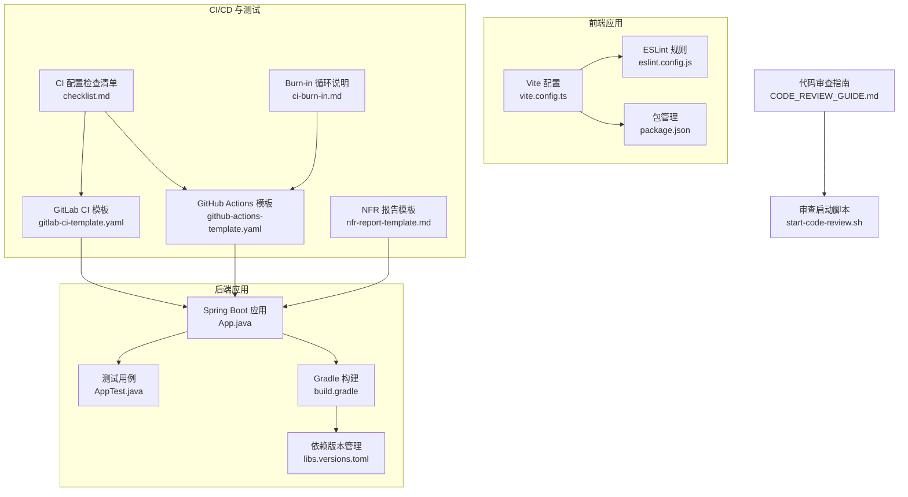
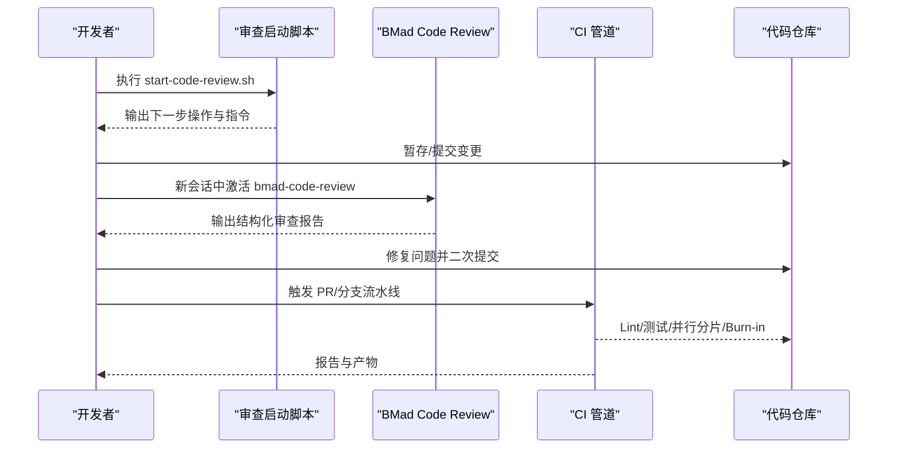
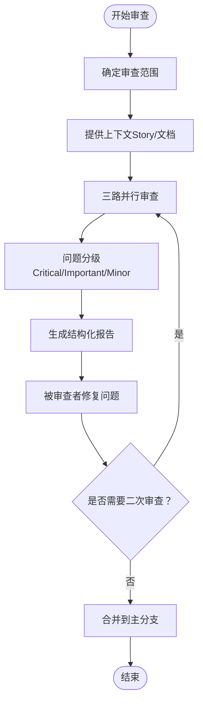
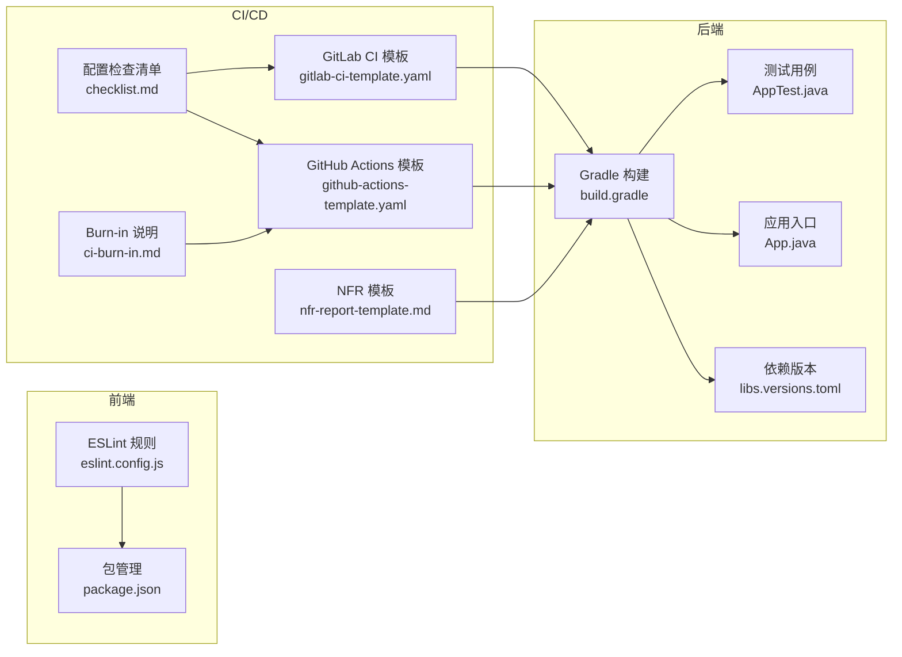
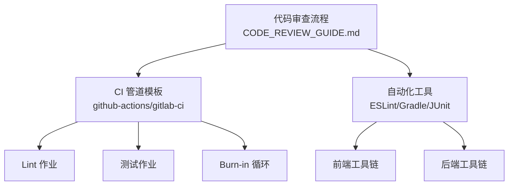

# 代码审查流程

<cite>
**本文引用的文件**
- [README.md](file://README.md)
- [CODE_REVIEW_GUIDE.md](file://docs/CODE_REVIEW_GUIDE.md)
- [start-code-review.sh](file://scripts/start-code-review.sh)
- [App.java](file://app/src/main/java/interview/guide/App.java)
- [AppTest.java](file://app/src/test/java/interview/guide/AppTest.java)
- [build.gradle](file://app/build.gradle)
- [libs.versions.toml](file://gradle/libs.versions.toml)
- [eslint.config.js](file://frontend/eslint.config.js)
- [vite.config.ts](file://frontend/vite.config.ts)
- [package.json](file://frontend/package.json)
- [github-actions-template.yaml](file://.opencode/skills/bmad-testarch-ci/github-actions-template.yaml)
- [gitlab-ci-template.yaml](file://.opencode/skills/bmad-testarch-ci/gitlab-ci-template.yaml)
- [checklist.md](file://.opencode/skills/bmad-testarch-ci/checklist.md)
- [ci-burn-in.md](file://.opencode/skills/bmad-testarch-ci/resources/knowledge/ci-burn-in.md)
- [nfr-report-template.md](file://.opencode/skills/bmad-testarch-nfr/nfr-report-template.md)
</cite>

## 目录
1. [简介](#简介)
2. [项目结构](#项目结构)
3. [核心组件](#核心组件)
4. [架构总览](#架构总览)
5. [详细组件分析](#详细组件分析)
6. [依赖关系分析](#依赖关系分析)
7. [性能考量](#性能考量)
8. [故障排查指南](#故障排查指南)
9. [结论](#结论)
10. [附录](#附录)

## 简介
本指南面向面试指南平台的团队，提供一套完整的 Pull Request/merge request 创建与管理流程，以及代码审查的标准与检查清单。内容涵盖代码质量、安全性、性能、可维护性等维度，明确审查者与被审查者的职责分工，规范审查反馈格式与沟通方式，并结合项目现有的自动化检查工具（lint、单元测试、CI 管道、NFR 报告模板）给出落地实践，确保高效的高质量交付。

## 项目结构
面试指南平台采用前后端分离架构：后端基于 Spring Boot 4.0 + Java 21，前端基于 React 18.3 + TypeScript + Vite。项目同时具备完善的 CI/CD 能力与测试架构，支持 GitHub Actions、GitLab CI 等流水线，以及 NFR（非功能性需求）评估模板。

**图表来源**
- [App.java:1-200](file://app/src/main/java/interview/guide/App.java#L1-L200)
- [build.gradle:1-136](file://app/build.gradle#L1-L136)
- [libs.versions.toml:1-30](file://gradle/libs.versions.toml#L1-L30)
- [AppTest.java:1-18](file://app/src/test/java/interview/guide/AppTest.java#L1-L18)
- [vite.config.ts:1-42](file://frontend/vite.config.ts#L1-L42)
- [eslint.config.js:1-24](file://frontend/eslint.config.js#L1-L24)
- [package.json:1-47](file://frontend/package.json#L1-L47)
- [github-actions-template.yaml:1-47](file://.opencode/skills/bmad-testarch-ci/github-actions-template.yaml#L1-L47)
- [gitlab-ci-template.yaml:1-37](file://.opencode/skills/bmad-testarch-ci/gitlab-ci-template.yaml#L1-L37)
- [checklist.md:37-290](file://.opencode/skills/bmad-testarch-ci/checklist.md#L37-L290)
- [ci-burn-in.md:666-715](file://.opencode/skills/bmad-testarch-ci/resources/knowledge/ci-burn-in.md#L666-L715)
- [nfr-report-template.md:84-134](file://.opencode/skills/bmad-testarch-nfr/nfr-report-template.md#L84-L134)
- [CODE_REVIEW_GUIDE.md:1-360](file://docs/CODE_REVIEW_GUIDE.md#L1-L360)
- [start-code-review.sh:1-136](file://scripts/start-code-review.sh#L1-L136)

**章节来源**
- [README.md:210-247](file://README.md#L210-L247)
- [CODE_REVIEW_GUIDE.md:1-360](file://docs/CODE_REVIEW_GUIDE.md#L1-L360)

## 核心组件
- 审查流程与工具链
  - 独立会话机制：开发会话与 Review 会话严格分离，避免认知偏差。
  - 审查技能：BMad Code Review Skill（三路对抗式审查：盲审猎人、边界案例猎人、验收审计员）。
  - 审查范围：支持未提交变更、分支 diff、指定文件列表、特定提交区间等。
  - 审查报告：结构化 Markdown，包含问题分级（Critical/Important/Minor）与修复建议。
- 自动化检查与 CI
  - Lint：前端 ESLint 配置，后端 Gradle/JVM 编码统一。
  - 单元测试：Spring Boot + JUnit 5，覆盖关键模块。
  - CI 管道：GitHub Actions、GitLab CI 模板，支持并行分片与 Burn-in 循环。
  - NFR 评估：可用性、错误率、授权控制、数据保护、漏洞管理等模板化评估。
- 审查启动与协作
  - 审查启动脚本：引导用户完成暂存、提交、关闭当前会话、创建新会话并激活审查技能。
  - 审查反馈：结构化格式，明确证据与建议，支持二次 Review。

**章节来源**
- [CODE_REVIEW_GUIDE.md:1-360](file://docs/CODE_REVIEW_GUIDE.md#L1-L360)
- [start-code-review.sh:1-136](file://scripts/start-code-review.sh#L1-L136)
- [eslint.config.js:1-24](file://frontend/eslint.config.js#L1-L24)
- [build.gradle:100-136](file://app/build.gradle#L100-L136)
- [github-actions-template.yaml:1-47](file://.opencode/skills/bmad-testarch-ci/github-actions-template.yaml#L1-L47)
- [gitlab-ci-template.yaml:1-37](file://.opencode/skills/bmad-testarch-ci/gitlab-ci-template.yaml#L1-L37)
- [checklist.md:37-290](file://.opencode/skills/bmad-testarch-ci/checklist.md#L37-L290)
- [ci-burn-in.md:666-715](file://.opencode/skills/bmad-testarch-ci/resources/knowledge/ci-burn-in.md#L666-L715)
- [nfr-report-template.md:84-134](file://.opencode/skills/bmad-testarch-nfr/nfr-report-template.md#L84-L134)

## 架构总览
下图展示了从功能开发到代码审查再到 CI 验证的整体流程，强调“独立会话”的审查原则与自动化工具的协同。

**图表来源**
- [start-code-review.sh:1-136](file://scripts/start-code-review.sh#L1-L136)
- [CODE_REVIEW_GUIDE.md:13-200](file://docs/CODE_REVIEW_GUIDE.md#L13-L200)
- [github-actions-template.yaml:1-47](file://.opencode/skills/bmad-testarch-ci/github-actions-template.yaml#L1-L47)
- [gitlab-ci-template.yaml:1-37](file://.opencode/skills/bmad-testarch-ci/gitlab-ci-template.yaml#L1-L37)

## 详细组件分析

### 代码审查流程（PR/MR 创建与管理）
- PR/MR 创建
  - 基于独立会话完成的功能开发，确保变更最小化、可追踪。
  - 提交信息遵循约定式提交风格，便于自动化与审查。
- 审查范围与上下文
  - 明确审查范围（未提交变更/分支 diff/指定文件/提交区间）。
  - 提供 Story 文件路径，驱动验收审计员对照需求进行审计。
- 审查者职责
  - 保持零上下文偏见，依据规则进行问题分级。
  - 关注通用质量（命名、结构、重复）、边界条件与并发安全、验收标准一致性。
- 被审查者配合
  - 优先修复 Critical/Important 问题，Minor 问题纳入技术债清单。
  - 对复杂改动进行分块审查，必要时进行二次 Review。
- 审查反馈格式
  - 标准化 Markdown 报告，包含摘要、问题分级、证据与建议。
  - 证据指向具体代码行，建议提供可操作的修复步骤。

**图表来源**
- [CODE_REVIEW_GUIDE.md:72-173](file://docs/CODE_REVIEW_GUIDE.md#L72-L173)

**章节来源**
- [CODE_REVIEW_GUIDE.md:13-200](file://docs/CODE_REVIEW_GUIDE.md#L13-L200)

### 审查标准与检查清单
- 代码质量
  - 命名规范、结构清晰、避免重复逻辑、关注可读性与可维护性。
- 安全性
  - 避免硬编码密钥、敏感信息脱敏、鉴权与授权控制、输入校验与输出编码。
- 性能
  - 关注数据库查询、缓存命中、异步处理、并发与资源占用。
- 可维护性
  - 单元测试覆盖率、文档完整性、变更影响面评估、升级与迁移成本。

**章节来源**
- [CODE_REVIEW_GUIDE.md:126-144](file://docs/CODE_REVIEW_GUIDE.md#L126-L144)

### 审查者与被审查者职责
- 审查者
  - 保持客观，依据规则与模板进行分级与反馈。
  - 对验收审计员缺失上下文的情况进行提示与引导。
- 被审查者
  - 严格遵守独立会话原则，不在开发会话中混入审查请求。
  - 优先处理阻塞性问题，记录次要问题并制定后续计划。

**章节来源**
- [CODE_REVIEW_GUIDE.md:246-262](file://docs/CODE_REVIEW_GUIDE.md#L246-L262)

### 审查反馈格式与沟通方式
- 格式
  - 摘要（文件数、增删行、问题总数与分级分布）。
  - 问题列表（标题、违反规则、证据、建议）。
  - 总体评估与建议。
- 沟通
  - 证据与建议明确可追溯，鼓励提问与讨论，避免主观判断。
  - 对复杂问题建议在 Review 会话中进一步澄清。

**章节来源**
- [CODE_REVIEW_GUIDE.md:145-173](file://docs/CODE_REVIEW_GUIDE.md#L145-L173)

### 自动化检查工具配置与使用
- Lint
  - 前端：ESLint 配置已启用基础推荐规则与 React Hooks、React Refresh 插件。
  - 后端：Gradle 统一 UTF-8 编码，JVM 参数确保日志与控制台编码一致。
- 单元测试
  - Spring Boot + JUnit 5，示例用例验证应用上下文加载。
- CI 管道
  - GitHub Actions 与 GitLab CI 模板提供 Lint、测试、并行分片、Burn-in 循环等作业。
  - CI 配置检查清单确保缓存、超时、并行策略、失败产物归档等关键项。
- NFR 评估
  - 提供可用性、错误率、授权控制、数据保护、漏洞管理等模板字段，便于形成可量化的评估报告。

**图表来源**
- [eslint.config.js:1-24](file://frontend/eslint.config.js#L1-L24)
- [package.json:1-47](file://frontend/package.json#L1-L47)
- [build.gradle:1-136](file://app/build.gradle#L1-L136)
- [libs.versions.toml:1-30](file://gradle/libs.versions.toml#L1-L30)
- [App.java:1-200](file://app/src/main/java/interview/guide/App.java#L1-L200)
- [AppTest.java:1-18](file://app/src/test/java/interview/guide/AppTest.java#L1-L18)
- [github-actions-template.yaml:1-47](file://.opencode/skills/bmad-testarch-ci/github-actions-template.yaml#L1-L47)
- [gitlab-ci-template.yaml:1-37](file://.opencode/skills/bmad-testarch-ci/gitlab-ci-template.yaml#L1-L37)
- [checklist.md:37-290](file://.opencode/skills/bmad-testarch-ci/checklist.md#L37-L290)
- [ci-burn-in.md:666-715](file://.opencode/skills/bmad-testarch-ci/resources/knowledge/ci-burn-in.md#L666-L715)
- [nfr-report-template.md:84-134](file://.opencode/skills/bmad-testarch-nfr/nfr-report-template.md#L84-L134)

**章节来源**
- [eslint.config.js:1-24](file://frontend/eslint.config.js#L1-L24)
- [build.gradle:95-136](file://app/build.gradle#L95-L136)
- [AppTest.java:1-18](file://app/src/test/java/interview/guide/AppTest.java#L1-L18)
- [github-actions-template.yaml:1-47](file://.opencode/skills/bmad-testarch-ci/github-actions-template.yaml#L1-L47)
- [gitlab-ci-template.yaml:1-37](file://.opencode/skills/bmad-testarch-ci/gitlab-ci-template.yaml#L1-L37)
- [checklist.md:37-290](file://.opencode/skills/bmad-testarch-ci/checklist.md#L37-L290)
- [ci-burn-in.md:666-715](file://.opencode/skills/bmad-testarch-ci/resources/knowledge/ci-burn-in.md#L666-L715)
- [nfr-report-template.md:84-134](file://.opencode/skills/bmad-testarch-nfr/nfr-report-template.md#L84-L134)

### 审查通过与拒绝的标准与后续流程
- 通过标准
  - Critical/Important 问题全部解决或有明确延期计划。
  - 代码满足质量、安全、性能与可维护性要求。
  - 审查报告与修复记录完整可追溯。
- 拒绝标准
  - 存在阻塞性问题（如空指针、事务内调用外部 API、安全漏洞）。
  - 缺少上下文（未提供 Story 文件导致验收审计员无法评估）。
  - 未遵循独立会话原则或忽略审查反馈。
- 后续流程
  - 通过后进入 CI 验证（Lint、测试、并行分片、Burn-in）。
  - 产出 NFR 报告，持续改进系统可靠性与安全性。
  - 对复杂改动进行二次 Review，确保回归稳定。

**章节来源**
- [CODE_REVIEW_GUIDE.md:126-144](file://docs/CODE_REVIEW_GUIDE.md#L126-L144)
- [ci-burn-in.md:666-715](file://.opencode/skills/bmad-testarch-ci/resources/knowledge/ci-burn-in.md#L666-L715)
- [nfr-report-template.md:84-134](file://.opencode/skills/bmad-testarch-nfr/nfr-report-template.md#L84-L134)

## 依赖关系分析
- 组件耦合
  - 审查流程与 CI 管道相互独立但协同：审查负责质量门禁，CI 负责自动化验证。
  - 前后端工具链解耦：前端 ESLint 与后端 Gradle 独立配置，CI 统一触发。
- 外部依赖
  - CI 平台（GitHub Actions、GitLab CI）与模板化配置，减少重复劳动。
  - NFR 模板提供标准化评估维度，便于量化改进目标。

**图表来源**
- [CODE_REVIEW_GUIDE.md:1-360](file://docs/CODE_REVIEW_GUIDE.md#L1-L360)
- [github-actions-template.yaml:1-47](file://.opencode/skills/bmad-testarch-ci/github-actions-template.yaml#L1-L47)
- [gitlab-ci-template.yaml:1-37](file://.opencode/skills/bmad-testarch-ci/gitlab-ci-template.yaml#L1-L37)
- [eslint.config.js:1-24](file://frontend/eslint.config.js#L1-L24)
- [build.gradle:100-136](file://app/build.gradle#L100-L136)

**章节来源**
- [CODE_REVIEW_GUIDE.md:1-360](file://docs/CODE_REVIEW_GUIDE.md#L1-L360)
- [github-actions-template.yaml:1-47](file://.opencode/skills/bmad-testarch-ci/github-actions-template.yaml#L1-L47)
- [gitlab-ci-template.yaml:1-37](file://.opencode/skills/bmad-testarch-ci/gitlab-ci-template.yaml#L1-L37)
- [eslint.config.js:1-24](file://frontend/eslint.config.js#L1-L24)
- [build.gradle:100-136](file://app/build.gradle#L100-L136)

## 性能考量
- 审查效率
  - 三路并行审查提升覆盖面与效率，建议对大改动进行分块审查。
  - CI 并行分片与 Burn-in 循环缩短反馈周期，提高回归稳定性。
- 代码性能
  - 关注数据库查询与缓存策略、异步处理与流式消费、并发与资源占用。
  - 前端构建分包策略（vendor 拆分）与懒加载优化用户体验。

**章节来源**
- [CODE_REVIEW_GUIDE.md:232-243](file://docs/CODE_REVIEW_GUIDE.md#L232-L243)
- [ci-burn-in.md:666-715](file://.opencode/skills/bmad-testarch-ci/resources/knowledge/ci-burn-in.md#L666-L715)
- [vite.config.ts:13-23](file://frontend/vite.config.ts#L13-L23)

## 故障排查指南
- 审查流程问题
  - 未提供 Story 文件：验收审计员无法评估，建议补充上下文。
  - 混合会话：在同一会话中既写代码又审查，易产生认知偏差，应严格分离。
  - 未提交变更：脚本提示警告，建议先暂存/提交再启动审查。
- CI 配置问题
  - YAML 语法错误：使用在线校验或本地脚本镜像 CI 环境。
  - 缓存失效：检查缓存键公式与路径配置。
  - Burn-in 过慢：减少迭代次数或仅在定时任务触发。
- 前端 Lint 问题
  - ESLint 规则冲突：根据项目约定调整规则或忽略特定文件。
  - 构建分包异常：检查 manualChunks 配置与依赖版本。

**章节来源**
- [CODE_REVIEW_GUIDE.md:246-262](file://docs/CODE_REVIEW_GUIDE.md#L246-L262)
- [checklist.md:232-281](file://.opencode/skills/bmad-testarch-ci/checklist.md#L232-L281)
- [eslint.config.js:1-24](file://frontend/eslint.config.js#L1-L24)
- [vite.config.ts:13-23](file://frontend/vite.config.ts#L13-L23)

## 结论
通过独立会话的审查机制、结构化的检查清单与自动化工具链，面试指南平台能够建立高效、可追溯、可量化的代码审查流程。建议团队在日常开发中严格执行审查流程，结合 CI 的并行分片与 Burn-in 循环，持续提升系统质量与交付效率。

## 附录
- 审查启动脚本使用指引
  - 在开发会话中完成暂存与提交，随后执行审查启动脚本，按提示在新会话中激活审查技能并提供上下文。
- CI 配置检查清单
  - 确认缓存策略、超时预算、并行化、Burn-in、等待应用启动、密钥文档与本地一致性等关键项。
- NFR 评估要点
  - 明确可用性、错误率、授权控制、数据保护、漏洞管理等评估维度与阈值，形成可量化的报告。

**章节来源**
- [start-code-review.sh:1-136](file://scripts/start-code-review.sh#L1-L136)
- [checklist.md:37-290](file://.opencode/skills/bmad-testarch-ci/checklist.md#L37-L290)
- [nfr-report-template.md:84-134](file://.opencode/skills/bmad-testarch-nfr/nfr-report-template.md#L84-L134)