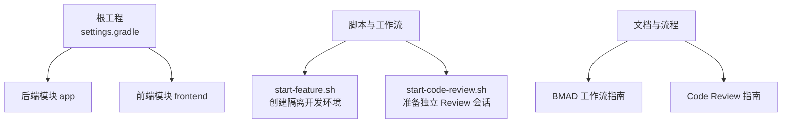
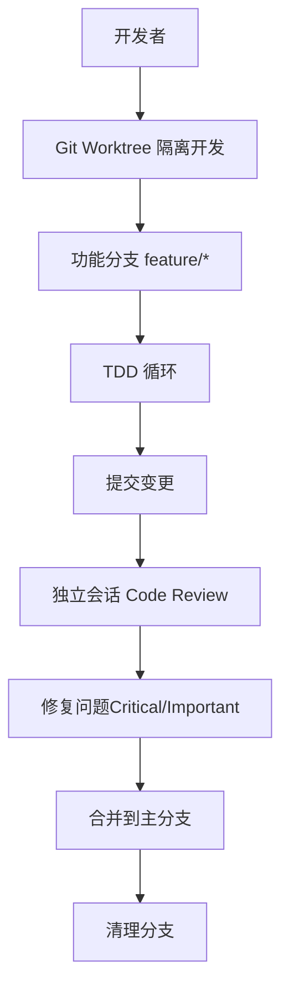
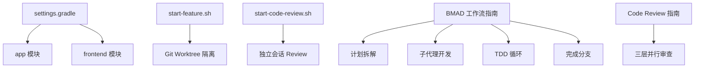

# 冲突解决

<cite>
**本文引用的文件**
- [README.md](file://README.md)
- [settings.gradle](file://settings.gradle)
- [scripts/start-feature.sh](file://scripts/start-feature.sh)
- [scripts/start-code-review.sh](file://scripts/start-code-review.sh)
- [docs/BMAD_SKILL_WORKFLOW.md](file://docs/BMAD_SKILL_WORKFLOW.md)
- [docs/CODE_REVIEW_GUIDE.md](file://docs/CODE_REVIEW_GUIDE.md)
- [.gitignore](file://.gitignore)
</cite>

## 目录
1. [简介](#简介)
2. [项目结构](#项目结构)
3. [核心组件](#核心组件)
4. [架构总览](#架构总览)
5. [详细组件分析](#详细组件分析)
6. [依赖关系分析](#依赖关系分析)
7. [性能考量](#性能考量)
8. [故障排查指南](#故障排查指南)
9. [结论](#结论)
10. [附录](#附录)

## 简介
本指南面向面试指南平台的团队，聚焦于 Git 冲突的产生原因、常见类型、解决流程与最佳实践，以及合并策略（rebase vs merge）的选择与影响。同时结合项目现有的工作流脚本与文档，给出可落地的冲突预防与协作建议，帮助团队在高频迭代中高效、稳定地推进开发。

## 项目结构
- 项目采用多模块 Gradle 架构，根工程包含 app 模块，前端位于 frontend 目录。
- 项目提供 Git Worktree 脚本与 Code Review 独立会话流程，有助于隔离开发、降低分支冲突概率并提升代码质量。

图表来源
- [settings.gradle](file://settings.gradle)
- [scripts/start-feature.sh](file://scripts/start-feature.sh)
- [scripts/start-code-review.sh](file://scripts/start-code-review.sh)
- [docs/BMAD_SKILL_WORKFLOW.md](file://docs/BMAD_SKILL_WORKFLOW.md)
- [docs/CODE_REVIEW_GUIDE.md](file://docs/CODE_REVIEW_GUIDE.md)

章节来源
- [settings.gradle](file://settings.gradle)
- [README.md](file://README.md)

## 核心组件
- Git Worktree 隔离开发：通过脚本为每个功能创建独立工作树与分支，避免多人在主分支上互相干扰，显著降低内容冲突与删除/修改冲突的概率。
- 独立会话 Code Review：在新会话中执行审查，强制分离“实现”和“质量审查”的认知负担，减少因上下文偏见导致的冲突遗漏。
- 标准化工作流：从头脑风暴、计划拆解、子代理开发、TDD、审查到完成分支，形成闭环，降低因需求不一致引发的逻辑冲突。

章节来源
- [scripts/start-feature.sh](file://scripts/start-feature.sh)
- [docs/BMAD_SKILL_WORKFLOW.md](file://docs/BMAD_SKILL_WORKFLOW.md)
- [docs/CODE_REVIEW_GUIDE.md](file://docs/CODE_REVIEW_GUIDE.md)

## 架构总览
下图展示了“隔离开发 + 独立审查 + 标准流程”的整体协作架构，强调通过工具链与流程减少冲突发生的可能性与影响面。

图表来源
- [scripts/start-feature.sh](file://scripts/start-feature.sh)
- [docs/BMAD_SKILL_WORKFLOW.md](file://docs/BMAD_SKILL_WORKFLOW.md)
- [docs/CODE_REVIEW_GUIDE.md](file://docs/CODE_REVIEW_GUIDE.md)

## 详细组件分析

### Git 冲突类型与成因
- 内容冲突（Content Conflicts）
  - 同一文件同一区间被多人分别修改，Git 无法自动合并。
  - 成因：多人并行修改同一逻辑区域、需求理解不一致。
- 删除/修改冲突（Delete/Modify Conflicts）
  - 一方删除某行/某文件，另一方却在该位置新增/修改内容。
  - 成因：功能拆分不彻底、接口演进缺乏沟通。
- 移动/删除冲突（Move/Delete Conflicts）
  - 一方将某段代码移动到新位置，另一方删除了该段代码。
  - 成因：重构与删除动作不同步、缺乏对代码迁移的同步通知。

章节来源
- [docs/CODE_REVIEW_GUIDE.md](file://docs/CODE_REVIEW_GUIDE.md)

### 冲突解决标准流程
- 冲突检测
  - 合并前执行 fetch/ pull，观察是否存在“需要解决冲突”的提示。
  - 使用 diff/ log/ blame 等命令定位冲突文件与修改点。
- 冲突分析
  - 明确冲突类型（内容/删除/移动），区分“逻辑冲突”与“格式冲突”。
  - 结合 Story/计划文档核验需求一致性，避免“正确但不符合设计”的合并。
- 冲突解决
  - 优先解决 Critical/Important 问题，确保功能正确性与安全性。
  - 采用“保留正确逻辑 + 合并双方贡献”的策略，必要时重构以消除重复与坏味道。
- 冲突验证
  - 本地运行测试，确保回归通过。
  - 在 Review 会话中进行二次审查，确保修复质量与可维护性。
- 冲突记录与复盘
  - 记录冲突原因与解决过程，沉淀到团队知识库，避免同类问题重复发生。

章节来源
- [docs/CODE_REVIEW_GUIDE.md](file://docs/CODE_REVIEW_GUIDE.md)

### 合并策略：rebase vs merge
- rebase
  - 优点：线性历史、整洁易读；适合个人或小组内部频繁迭代。
  - 风险：多人协作时可能造成历史重写，需谨慎共享已 rebase 的分支。
- merge
  - 优点：保留真实协作轨迹，适合多人并行开发与公共分支。
  - 风险：历史分支可能较复杂，需配合良好的提交信息与规范。
- 建议
  - 在功能分支内部使用 rebase 保持线性；向主分支合并时使用 merge，保留协作痕迹。
  - 若采用 rebase，务必在共享前与团队约定，避免历史重写带来的混乱。

章节来源
- [docs/BMAD_SKILL_WORKFLOW.md](file://docs/BMAD_SKILL_WORKFLOW.md)

### 冲突解决工具使用
- 内置工具
  - VS Code/GitLens：可视化冲突标记与片段对比，支持逐行接受/拒绝。
  - IntelliJ IDEA：内置合并工具，支持三路合并与语法高亮。
- 第三方工具
  - Meld：图形化三路比较，适合复杂内容冲突。
  - Beyond Compare：文件与目录对比，适合批量冲突定位。
  - Araxis Merge：专业级合并工具，适合大型项目与二进制文件。
- 建议
  - 优先使用 IDE 内置工具进行日常冲突解决，提升效率与一致性。
  - 对复杂冲突场景，可引入图形化工具辅助分析与决策。

章节来源
- [docs/CODE_REVIEW_GUIDE.md](file://docs/CODE_REVIEW_GUIDE.md)

### 冲突预防与团队协作
- 使用 Git Worktree 隔离开发
  - 为每个功能创建独立工作树与分支，避免多人在主分支上互相干扰。
  - 通过脚本自动安装依赖、验证测试基线，减少环境差异导致的冲突。
- 独立会话 Code Review
  - 在新会话中执行审查，强制分离“实现”和“质量审查”，降低认知偏差。
  - 通过三层并行审查（盲审、边界案例、验收审计）覆盖不同维度的质量风险。
- 标准化工作流
  - 从头脑风暴、计划拆解、子代理开发、TDD、审查到完成分支，形成闭环。
  - 通过 Story/计划文档统一需求理解，减少因需求不一致引发的逻辑冲突。
- 代码风格与提交规范
  - 统一代码风格与提交信息格式，降低格式冲突与历史噪音。
- 定期同步与沟通
  - 每日站会同步进展，及时暴露潜在冲突点，尽早协调解决。

章节来源
- [scripts/start-feature.sh](file://scripts/start-feature.sh)
- [scripts/start-code-review.sh](file://scripts/start-code-review.sh)
- [docs/BMAD_SKILL_WORKFLOW.md](file://docs/BMAD_SKILL_WORKFLOW.md)
- [docs/CODE_REVIEW_GUIDE.md](file://docs/CODE_REVIEW_GUIDE.md)

## 依赖关系分析
- 工程结构与模块划分
  - 根工程通过 settings.gradle 声明包含 app 模块，frontend 为独立前端模块。
- 脚本与流程的耦合
  - start-feature.sh 与 BMAD 工作流紧密耦合，确保每个功能在隔离环境中开发。
  - start-code-review.sh 与 Code Review 指南配合，强制独立会话执行审查。
- 冲突预防的间接依赖
  - 依赖统一的开发与审查流程，减少因流程不一致导致的冲突。

图表来源
- [settings.gradle](file://settings.gradle)
- [scripts/start-feature.sh](file://scripts/start-feature.sh)
- [scripts/start-code-review.sh](file://scripts/start-code-review.sh)
- [docs/BMAD_SKILL_WORKFLOW.md](file://docs/BMAD_SKILL_WORKFLOW.md)
- [docs/CODE_REVIEW_GUIDE.md](file://docs/CODE_REVIEW_GUIDE.md)

章节来源
- [settings.gradle](file://settings.gradle)
- [scripts/start-feature.sh](file://scripts/start-feature.sh)
- [scripts/start-code-review.sh](file://scripts/start-code-review.sh)
- [docs/BMAD_SKILL_WORKFLOW.md](file://docs/BMAD_SKILL_WORKFLOW.md)
- [docs/CODE_REVIEW_GUIDE.md](file://docs/CODE_REVIEW_GUIDE.md)

## 性能考量
- 冲突规模与解决效率
  - 内容冲突通常可通过 IDE 工具快速定位与合并，建议在小步提交与频繁同步的前提下降低冲突规模。
- 合并策略对性能的影响
  - rebase 适合个人迭代，减少合并节点；merge 适合多人协作，但需注意历史复杂度。
- 工具选择对效率的影响
  - 图形化工具在复杂冲突场景下能显著提升定位与决策效率，建议在 CI/本地均配置合适的合并工具。

## 故障排查指南
- 合并失败但未提示冲突
  - 检查是否使用了 rebase 且历史已被重写；尝试切换到 merge 策略或重新拉取远程分支。
- 冲突文件过多或难以定位
  - 使用图形化工具（如 Meld）进行三路对比，按模块/文件类型分块审查。
- 修复后测试未通过
  - 回到开发会话，逐项验证修复点，必要时在 Review 会话中进行二次审查。
- 环境差异导致的冲突
  - 通过 start-feature.sh 自动安装依赖与验证测试基线，减少因环境差异引发的冲突。

章节来源
- [scripts/start-code-review.sh](file://scripts/start-code-review.sh)
- [docs/CODE_REVIEW_GUIDE.md](file://docs/CODE_REVIEW_GUIDE.md)

## 结论
通过 Git Worktree 隔离开发、独立会话 Code Review 与标准化工作流，面试指南平台能够在高频迭代中显著降低冲突发生的概率与影响面。结合 rebase/merge 的合理选择与图形化工具的辅助，团队可以更高效地检测、分析、解决与验证冲突，最终实现高质量、可追溯的协作开发。

## 附录
- 相关脚本与文档路径
  - [start-feature.sh](file://scripts/start-feature.sh)
  - [start-code-review.sh](file://scripts/start-code-review.sh)
  - [BMAD 工作流指南](file://docs/BMAD_SKILL_WORKFLOW.md)
  - [Code Review 指南](file://docs/CODE_REVIEW_GUIDE.md)
  - [settings.gradle](file://settings.gradle)
  - [.gitignore](file://.gitignore)