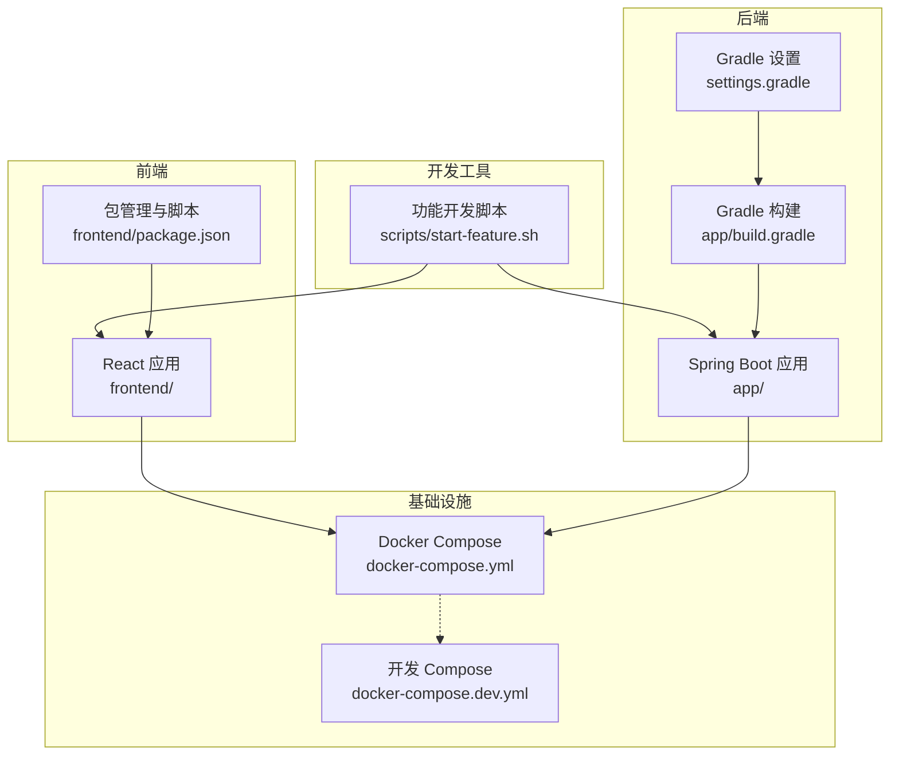
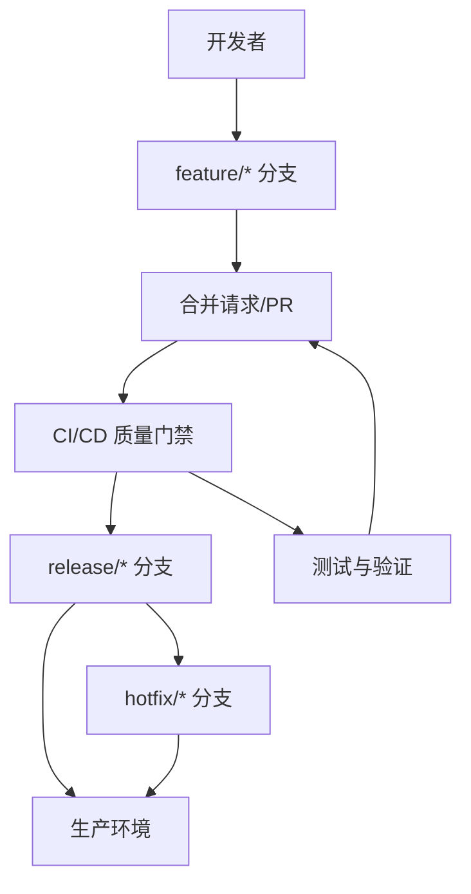
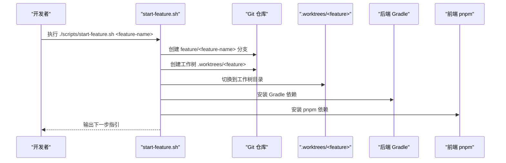
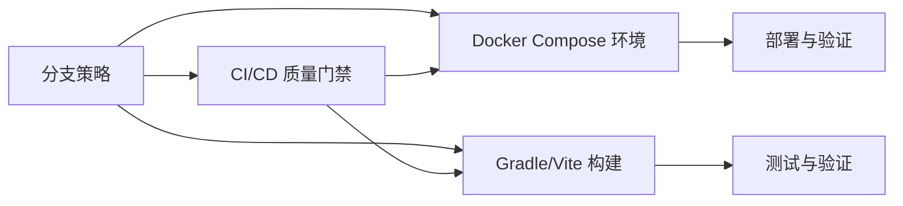

# 分支策略

<cite>
**本文引用的文件**
- [README.md](file://README.md)
- [scripts/start-feature.sh](file://scripts/start-feature.sh)
- [docker-compose.yml](file://docker-compose.yml)
- [docker-compose.dev.yml](file://docker-compose.dev.yml)
- [app/build.gradle](file://app/build.gradle)
- [settings.gradle](file://settings.gradle)
- [frontend/package.json](file://frontend/package.json)
- [.opencode/skills/bmad-testarch-ci/checklist.md](file://.opencode/skills/bmad-testarch-ci/checklist.md)
- [.opencode/skills/bmad-testarch-ci/workflow.md](file://.opencode/skills/bmad-testarch-ci/workflow.md)
- [.opencode/skills/bmad-testarch-ci/instructions.md](file://.opencode/skills/bmad-testarch-ci/instructions.md)
</cite>

## 目录
1. [引言](#引言)
2. [项目结构](#项目结构)
3. [核心组件](#核心组件)
4. [架构总览](#架构总览)
5. [详细组件分析](#详细组件分析)
6. [依赖分析](#依赖分析)
7. [性能考虑](#性能考虑)
8. [故障排查指南](#故障排查指南)
9. [结论](#结论)
10. [附录](#附录)

## 引言
本指南面向面试指南平台的团队协作与交付流程，围绕分支管理模式、分支命名规范、合并策略、分支保护与代码审查、以及与现有脚手架与容器化环境的协同，提供一套可落地的分支策略。平台采用前后端分离架构与容器化部署，具备 Docker Compose 编排与 Gradle 构建能力，同时提供脚本化的工作树（Git Worktree）功能以支持并行功能开发。

## 项目结构
- 后端应用位于 app/，采用 Gradle 多模块（当前仅包含 app 子工程）与 Spring Boot 4.0 + Java 21 技术栈。
- 前端应用位于 frontend/，采用 React 18.3 + TypeScript + Vite + Tailwind CSS。
- 项目提供 docker-compose.yml 与 docker-compose.dev.yml，用于一键启动数据库、缓存与对象存储等基础设施。
- 提供 scripts/start-feature.sh 脚本，支持基于 Git Worktree 的隔离开发环境初始化。

图表来源
- [docker-compose.yml:1-197](file://docker-compose.yml#L1-L197)
- [docker-compose.dev.yml:1-64](file://docker-compose.dev.yml#L1-L64)
- [app/build.gradle:1-136](file://app/build.gradle#L1-L136)
- [settings.gradle:1-24](file://settings.gradle#L1-L24)
- [frontend/package.json:1-47](file://frontend/package.json#L1-L47)
- [scripts/start-feature.sh:1-68](file://scripts/start-feature.sh#L1-L68)

章节来源
- [README.md:210-247](file://README.md#L210-L247)
- [docker-compose.yml:1-197](file://docker-compose.yml#L1-L197)
- [docker-compose.dev.yml:1-64](file://docker-compose.dev.yml#L1-L64)
- [app/build.gradle:1-136](file://app/build.gradle#L1-L136)
- [settings.gradle:1-24](file://settings.gradle#L1-L24)
- [frontend/package.json:1-47](file://frontend/package.json#L1-L47)
- [scripts/start-feature.sh:1-68](file://scripts/start-feature.sh#L1-L68)

## 核心组件
- 分支管理与工作流
  - 使用 Git Worktree 支持并行功能开发，隔离不同功能分支的构建与运行环境。
  - 基于 feature/* 命名规范开展功能开发，便于与 CI/CD 与容器化环境配合。
- 容器化与编排
  - docker-compose.yml 定义生产级编排，包含数据库、缓存、对象存储、后端与前端服务。
  - docker-compose.dev.yml 专注本地开发依赖服务，简化本地调试。
- 构建与运行
  - 后端通过 Gradle 构建，支持 bootRun 与测试；前端通过 Vite 构建与开发。
  - 项目提供脚本注入 .env 环境变量的能力，便于本地运行时加载 AI 与数据库配置。

章节来源
- [scripts/start-feature.sh:1-68](file://scripts/start-feature.sh#L1-L68)
- [docker-compose.yml:1-197](file://docker-compose.yml#L1-L197)
- [docker-compose.dev.yml:1-64](file://docker-compose.dev.yml#L1-L64)
- [app/build.gradle:104-136](file://app/build.gradle#L104-L136)
- [frontend/package.json:1-47](file://frontend/package.json#L1-L47)

## 架构总览
下图展示了分支策略与交付流水线的关系：开发者在 feature/* 分支上进行功能开发，借助脚本初始化隔离工作树；通过 CI/CD 进行质量门禁与测试；最终以 release/* 或 hotfix/* 形态进入发布流程，并结合 Docker Compose 进行部署验证。

图表来源
- [scripts/start-feature.sh:1-68](file://scripts/start-feature.sh#L1-L68)
- [.opencode/skills/bmad-testarch-ci/checklist.md:79-256](file://.opencode/skills/bmad-testarch-ci/checklist.md#L79-L256)
- [docker-compose.yml:1-197](file://docker-compose.yml#L1-L197)

## 详细组件分析

### 分支类型与用途
- feature/*：用于新功能开发，建议以故事/需求编号命名，如 feature/IG-123-简历解析。
- release/*：用于发布前的预热与回归测试，合并目标分支通常为 main/master。
- hotfix/*：用于紧急修复线上问题，修复后应同时合并回 main/master 与对应 release/*。
- main/master：受保护分支，禁止直接推送，必须通过 PR 合并。

章节来源
- [scripts/start-feature.sh:8-10](file://scripts/start-feature.sh#L8-L10)

### 分支命名规范
- feature：feature/<功能主题>，如 feature/IG-123-简历解析。
- release：release/<版本号>，如 release/v1.2.3。
- hotfix：hotfix/<问题描述>，如 hotfix/fix-pdf-export-crash。
- 语义化命名，避免使用特殊字符，优先使用英文与数字。

章节来源
- [scripts/start-feature.sh:8-10](file://scripts/start-feature.sh#L8-L10)

### 分支保护规则
- main/master
  - 禁止直接推送与强制推送。
  - 必须开启“要求审查通过”和“要求状态检查通过”。
  - 保护分支规则建议启用“管理员强制执行”。
- release/* 与 hotfix/*
  - 合并前需通过 CI/CD 与代码审查。
  - 合并后建议打标签并同步至 main/master。

章节来源
- [.opencode/skills/bmad-testarch-ci/checklist.md:157-164](file://.opencode/skills/bmad-testarch-ci/checklist.md#L157-L164)

### 代码审查要求
- 所有合并必须通过至少一名维护者的审查。
- PR 描述需包含变更摘要、影响范围、测试要点与风险说明。
- CI/CD 通过后方可合并，失败需在 PR 中追踪与修复。

章节来源
- [.opencode/skills/bmad-testarch-ci/checklist.md:139-156](file://.opencode/skills/bmad-testarch-ci/checklist.md#L139-L156)

### CI/CD 集成
- 质量门禁
  - 建议在 CI 中包含：代码风格检查、单元测试、集成测试、缓存命中与并行分片、失败仅收集产物、重试策略（仅瞬时错误）。
- 触发与平台
  - 推荐使用 GitHub Actions（Ubuntu 最新 Runner，免费版并发限制 20）。
  - 触发方式：push、pull_request、schedule。
- 文档与脚本
  - 建议提供 docs/ci.md 与 scripts/ci-local.sh，确保本地与 CI 环境一致。
- 并行与性能
  - 建议分片并行执行测试，单分片测试时间小于 10 分钟，总流水线小于 45 分钟。
  - 缓存优化：依赖安装缓存减少 2-5 分钟。

章节来源
- [.opencode/skills/bmad-testarch-ci/instructions.md:1-45](file://.opencode/skills/bmad-testarch-ci/instructions.md#L1-L45)
- [.opencode/skills/bmad-testarch-ci/checklist.md:79-256](file://.opencode/skills/bmad-testarch-ci/checklist.md#L79-L256)
- [.opencode/skills/bmad-testarch-ci/workflow.md:1-50](file://.opencode/skills/bmad-testarch-ci/workflow.md#L1-L50)

### 分支合并策略
- fast-forward
  - 适用于干净线性历史，适合 hotfix/* 直接合并回 main/master。
- rebase
  - 适用于 feature/* 在合并前清理提交历史，保持线性清晰。
- squash
  - 适用于 feature/* 将多个提交压缩为单个提交，便于审阅与回滚。
- 合并后清理
  - 建议在合并后删除已合并的分支，保持仓库整洁。

章节来源
- [.opencode/skills/bmad-testarch-ci/checklist.md:139-156](file://.opencode/skills/bmad-testarch-ci/checklist.md#L139-L156)

### 与容器化与脚手架的协同
- Git Worktree 与隔离开发
  - 使用 scripts/start-feature.sh 自动创建 feature/* 分支与工作树，分别安装后端与前端依赖，便于并行开发与调试。
- Docker Compose 与环境一致性
  - docker-compose.yml 与 docker-compose.dev.yml 提供一致的数据库、缓存与对象存储环境，确保本地与 CI/CD 环境一致。
- Gradle 与前端脚本
  - app/build.gradle 支持 bootRun 注入 .env；frontend/package.json 提供开发与构建脚本，便于本地快速启动。

图表来源
- [scripts/start-feature.sh:1-68](file://scripts/start-feature.sh#L1-L68)

章节来源
- [scripts/start-feature.sh:1-68](file://scripts/start-feature.sh#L1-L68)
- [docker-compose.yml:1-197](file://docker-compose.yml#L1-L197)
- [docker-compose.dev.yml:1-64](file://docker-compose.dev.yml#L1-L64)
- [app/build.gradle:104-136](file://app/build.gradle#L104-L136)
- [frontend/package.json:1-47](file://frontend/package.json#L1-L47)

## 依赖分析
- 分支策略对 CI/CD 的依赖
  - CI/CD 需要稳定的触发机制、并行分片与缓存策略，以满足性能目标。
- 分支策略对容器化环境的依赖
  - docker-compose.yml 与 docker-compose.dev.yml 为 CI/CD 与本地开发提供一致的基础设施，降低环境漂移。
- 分支策略对构建工具的依赖
  - Gradle 与 Vite 的本地与 CI 环境一致性，可通过 .env 注入与脚本化启动实现。

图表来源
- [.opencode/skills/bmad-testarch-ci/checklist.md:79-256](file://.opencode/skills/bmad-testarch-ci/checklist.md#L79-L256)
- [docker-compose.yml:1-197](file://docker-compose.yml#L1-L197)
- [app/build.gradle:104-136](file://app/build.gradle#L104-L136)
- [frontend/package.json:1-47](file://frontend/package.json#L1-L47)

章节来源
- [.opencode/skills/bmad-testarch-ci/checklist.md:79-256](file://.opencode/skills/bmad-testarch-ci/checklist.md#L79-L256)
- [docker-compose.yml:1-197](file://docker-compose.yml#L1-L197)
- [app/build.gradle:104-136](file://app/build.gradle#L104-L136)
- [frontend/package.json:1-47](file://frontend/package.json#L1-L47)

## 性能考虑
- CI/CD 性能
  - 通过并行分片与缓存优化，将测试与构建时间控制在目标范围内。
- 本地开发效率
  - Git Worktree 与 Docker Compose 降低环境准备成本，提升迭代速度。
- 合并策略
  - 优先使用 rebase 保持线性历史，必要时使用 squash 以简化审阅。

## 故障排查指南
- CI/CD 失败
  - 使用 scripts/ci-local.sh 本地复现 CI 环境，定位依赖安装与缓存问题。
  - 检查缓存键公式与路径，确保缓存命中。
  - 仅对瞬时错误启用重试，避免扩大故障面。
- 本地环境不一致
  - 确认 .env 注入与 bootRun JVM 编码配置，避免控制台乱码与变量缺失。
  - 使用 docker-compose.dev.yml 启动依赖服务，确保数据库、缓存与对象存储可用。
- 分支合并冲突
  - 在 feature/* 上 rebase 保持线性，必要时 squash 合并，减少冲突复杂度。

章节来源
- [.opencode/skills/bmad-testarch-ci/checklist.md:232-256](file://.opencode/skills/bmad-testarch-ci/checklist.md#L232-L256)
- [app/build.gradle:104-136](file://app/build.gradle#L104-L136)
- [docker-compose.dev.yml:1-64](file://docker-compose.dev.yml#L1-L64)

## 结论
本分支策略以 feature/* 为核心开发分支，结合 release/* 与 hotfix/* 的发布与修复流程，辅以严格的分支保护、代码审查与 CI/CD 质量门禁，确保交付质量与可追溯性。通过 Git Worktree 与 Docker Compose，团队可在本地高效并行开发，同时保证与 CI/CD 环境的一致性。建议在团队内统一命名规范与合并策略，并持续优化 CI/CD 性能与缓存策略。

## 附录
- 命名规范速查
  - feature：feature/<功能主题>
  - release：release/<版本号>
  - hotfix：hotfix/<问题描述>
- CI/CD 最佳实践
  - 触发：push、pull_request、schedule
  - 平台：GitHub Actions（Ubuntu latest）
  - 性能：总流水线 < 45 分钟，单分片 < 10 分钟
  - 文档：docs/ci.md，脚本：scripts/ci-local.sh