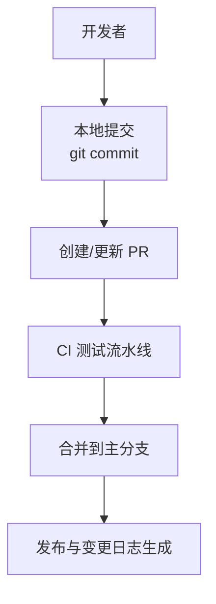
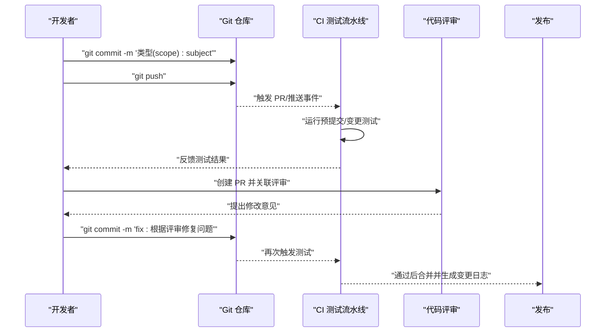
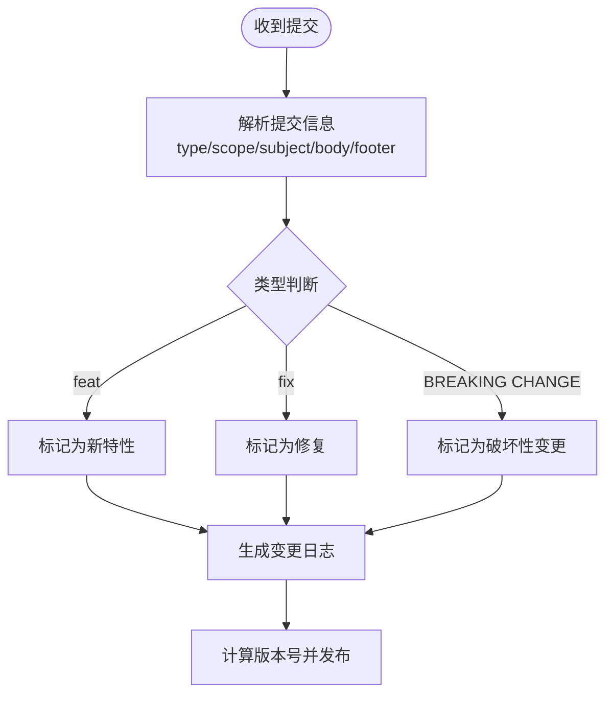
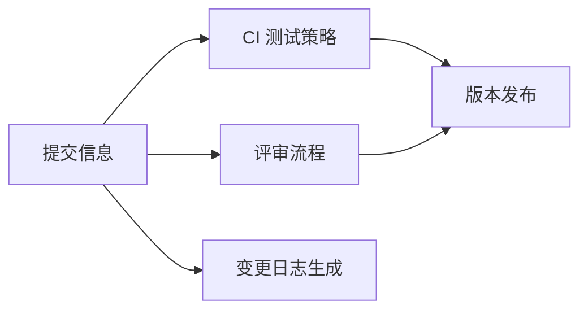

# 提交规范

<cite>
**本文引用的文件**
- [README.md](file://README.md)
- [start-code-review.sh](file://scripts/start-code-review.sh)
- [CODE_REVIEW_GUIDE.md](file://docs/CODE_REVIEW_GUIDE.md)
- [step-05-present.md](file://.opencode/skills/bmad-quick-dev/step-05-present.md)
- [selective-testing.md](file://.opencode/skills/bmad-testarch-ci/resources/knowledge/selective-testing.md)
- [2026-05-12-rag-search-optimization.md](file://docs/superpowers/plans/2026-05-12-rag-search-optimization.md)
</cite>

## 目录
1. [简介](#简介)
2. [项目结构](#项目结构)
3. [核心组件](#核心组件)
4. [架构总览](#架构总览)
5. [详细组件分析](#详细组件分析)
6. [依赖分析](#依赖分析)
7. [性能考虑](#性能考虑)
8. [故障排查指南](#故障排查指南)
9. [结论](#结论)
10. [附录](#附录)

## 简介
本指南面向面试指南平台的贡献者，提供一套完整的 Git 提交规范，帮助团队统一提交信息风格、提升可追溯性与自动化能力。内容涵盖：
- Conventional Commits 规范与类型语义
- 提交信息格式与最佳实践
- 不同类型提交的编写要点与示例路径
- 使用 Conventional Commits 自动生成变更日志与版本发布的建议
- 提交前检查清单与质量保证措施

## 项目结构
面试指南平台采用前后端分离架构，后端基于 Spring Boot，前端基于 React + TypeScript，配合 Docker 一键部署。项目内已沉淀多份工作流与评审文档，体现了对提交信息与变更管理的重视。

[本图为概念性结构示意，不直接映射具体源码文件，故不附“图表来源”]

**章节来源**
- [README.md: 210-247:210-247](file://README.md#L210-L247)

## 核心组件
- 提交信息格式：采用 Conventional Commits，包含 type、scope、subject、body、footer 等部分，确保信息清晰、可读、可自动化。
- 类型体系：涵盖 feat、fix、docs、style、refactor、test、chore 等，明确变更性质与影响面。
- 引用问题编号：在 footer 中引用 Issue/需求/工单编号，便于追踪与回溯。
- 自动化支持：结合 CI 流水线与脚本，实现提交前置校验、PR 流程引导与评审协作。

**章节来源**
- [start-code-review.sh: 74, 129:74-129](file://scripts/start-code-review.sh#L74-L129)
- [CODE_REVIEW_GUIDE.md: 29, 192:29-192](file://docs/CODE_REVIEW_GUIDE.md#L29-L192)
- [step-05-present.md: 54](file://.opencode/skills/bmad-quick-dev/step-05-present.md#L54)

## 架构总览
下图展示了从本地提交到 CI 校验再到评审与发布的典型流程，体现提交信息在自动化链路中的关键作用。

**图表来源**
- [start-code-review.sh: 74, 129:74-129](file://scripts/start-code-review.sh#L74-L129)
- [selective-testing.md: 506-547:506-547](file://.opencode/skills/bmad-testarch-ci/resources/knowledge/selective-testing.md#L506-L547)

**章节来源**
- [start-code-review.sh: 74, 129:74-129](file://scripts/start-code-review.sh#L74-L129)
- [selective-testing.md: 506-547:506-547](file://.opencode/skills/bmad-testarch-ci/resources/knowledge/selective-testing.md#L506-L547)

## 详细组件分析

### 提交信息格式与标准
- 标题规范
  - 结构：type(scope): subject
  - type：限定变更类型（见下一小节）
  - scope：可选，描述变更影响范围（模块/功能域）
  - subject：简短描述，使用祈使句，避免句号结尾
- 正文内容
  - 说明动机与背景，必要时包含变更影响面与风险点
  - 使用换行分段，保持可读性
- 引用问题编号
  - 在 footer 中添加 Fixes/Closes/Refs 等引用，例如：Fixes #123
- 引用变更日志
  - 若涉及破坏性变更，需在 footer 明确标注 BREAKING CHANGE

**章节来源**
- [step-05-present.md: 54](file://.opencode/skills/bmad-quick-dev/step-05-present.md#L54)

### 不同类型提交规范
- feat：新增功能或特性
  - 示例路径：[docs/superpowers/plans/2026-05-12-rag-search-optimization.md](file://docs/superpowers/plans/2026-05-12-rag-search-optimization.md)
- fix：修复缺陷或错误
  - 示例路径：[docs/CODE_REVIEW_GUIDE.md](file://docs/CODE_REVIEW_GUIDE.md)
- docs：仅文档改动
  - 建议配合 scope 指明文档模块
- style：不影响逻辑的样式/格式调整
  - 如空格、缩进、分号等
- refactor：重构但不改变行为
  - 需在正文说明动机与收益
- test：新增或调整测试
  - 示例路径：[docs/superpowers/plans/2026-05-12-rag-search-optimization.md](file://docs/superpowers/plans/2026-05-12-rag-search-optimization.md)
- chore：构建流程、依赖管理等杂项
  - 避免滥用，应聚焦维护性任务

**章节来源**
- [2026-05-12-rag-search-optimization.md: 84, 253, 466, 704, 795, 924, 1016, 1102:84-1102](file://docs/superpowers/plans/2026-05-12-rag-search-optimization.md#L84-L1102)
- [CODE_REVIEW_GUIDE.md: 29, 192:29-192](file://docs/CODE_REVIEW_GUIDE.md#L29-L192)

### 使用 Conventional Commits 自动生成变更日志与版本发布
- 建议在 CI 中集成变更日志生成工具（如 conventional-changelog、standard-version 等），基于提交信息自动产出变更日志
- 通过提交类型与 scope 生成分类，便于用户快速定位影响范围
- 对破坏性变更在 footer 中标注，确保发布时进行语义化版本升级

[本图为概念性流程示意，不直接映射具体源码文件，故不附“图表来源”]

### 提交前检查清单与质量保证
- 本地自检
  - 提交信息符合 Conventional Commits 格式
  - scope 明确、subject 简洁、正文完整
  - 引用相关 Issue/需求编号
- CI 校验
  - 预提交测试（如 smoke tests）通过
  - 变更测试覆盖相关功能
- 评审与合并
  - PR 描述与变更日志一致
  - 评审通过后再合并
- 发布与回溯
  - 变更日志随版本发布
  - 问题回溯可通过提交信息与引用编号快速定位

**章节来源**
- [selective-testing.md: 506-547:506-547](file://.opencode/skills/bmad-testarch-ci/resources/knowledge/selective-testing.md#L506-L547)
- [start-code-review.sh: 74, 129:74-129](file://scripts/start-code-review.sh#L74-L129)

## 依赖分析
- 提交信息与 CI 流水线的耦合
  - CI 根据提交信息决定运行哪些测试（如 PR 变更测试、全量回归）
- 提交信息与评审流程的耦合
  - 评审脚本与文档中多次出现“git commit -m”示例，体现提交信息在评审流程中的关键作用
- 提交信息与发布流程的耦合
  - 变更日志与版本号生成依赖提交信息的规范化

**图表来源**
- [selective-testing.md: 506-547:506-547](file://.opencode/skills/bmad-testarch-ci/resources/knowledge/selective-testing.md#L506-L547)
- [start-code-review.sh: 74, 129:74-129](file://scripts/start-code-review.sh#L74-L129)

**章节来源**
- [selective-testing.md: 506-547:506-547](file://.opencode/skills/bmad-testarch-ci/resources/knowledge/selective-testing.md#L506-L547)
- [start-code-review.sh: 74, 129:74-129](file://scripts/start-code-review.sh#L74-L129)

## 性能考虑
- 提交信息的解析与自动化工具应尽量轻量，避免在提交阶段引入额外耗时
- CI 测试策略按阶段收敛，减少不必要的全量回归，提高整体效率

[本节为通用指导，不直接分析具体文件，故不附“章节来源”]

## 故障排查指南
- 提交信息不符合规范
  - 现象：CI 校验失败、评审流程中断
  - 处理：修正提交信息格式，补充 scope/subject/body/footer
- 缺少引用编号
  - 现象：问题难以回溯
  - 处理：在 footer 中添加 Fixes/Closes/Refs 引用
- 评审后未重新提交
  - 现象：PR 无法合并
  - 处理：根据评审意见修复并在本地重新提交

**章节来源**
- [CODE_REVIEW_GUIDE.md: 29, 192:29-192](file://docs/CODE_REVIEW_GUIDE.md#L29-L192)
- [start-code-review.sh: 74, 129:74-129](file://scripts/start-code-review.sh#L74-L129)

## 结论
通过统一的 Conventional Commits 提交规范，面试指南平台能够：
- 提升提交信息的可读性与可追溯性
- 为自动化工具（CI、变更日志、版本发布）提供稳定输入
- 优化评审与合并流程，降低沟通成本
建议团队在日常开发中严格执行本规范，并持续完善自动化与检查清单，确保高质量交付。

[本节为总结性内容，不直接分析具体文件，故不附“章节来源”]

## 附录
- 示例路径（用于参考与对照）
  - feat 提交示例：[docs/superpowers/plans/2026-05-12-rag-search-optimization.md](file://docs/superpowers/plans/2026-05-12-rag-search-optimization.md)
  - fix 提交示例：[docs/CODE_REVIEW_GUIDE.md](file://docs/CODE_REVIEW_GUIDE.md)
  - 预提交与评审流程：[scripts/start-code-review.sh](file://scripts/start-code-review.sh)
  - CI 测试策略与阶段划分：[.opencode/skills/bmad-testarch-ci/resources/knowledge/selective-testing.md](file://.opencode/skills/bmad-testarch-ci/resources/knowledge/selective-testing.md)