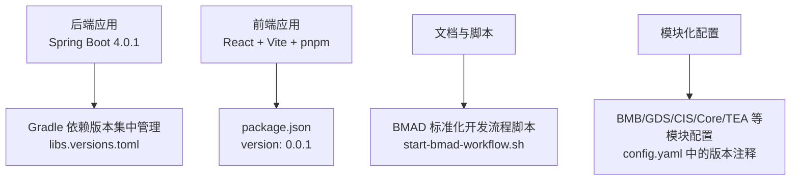
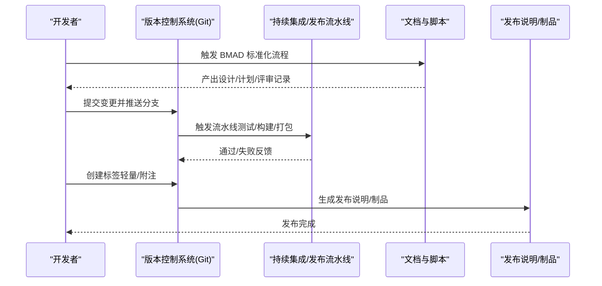
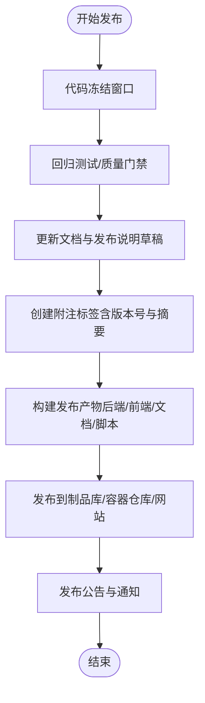
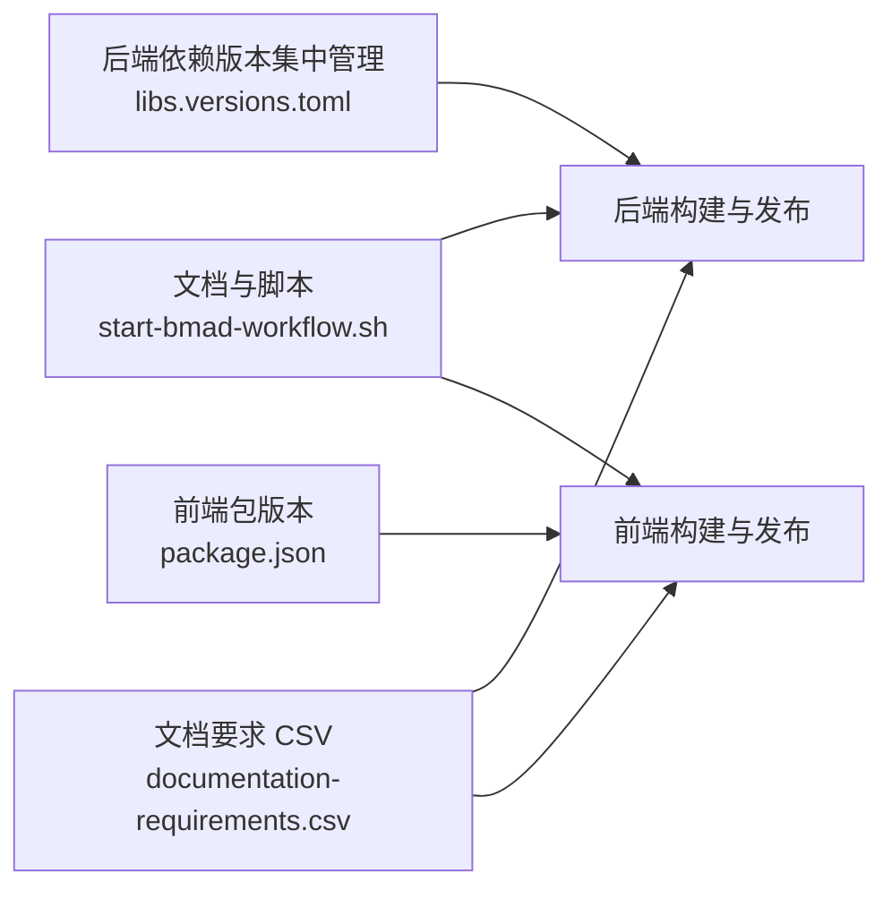

# 标签和发布管理

<cite>
**本文引用的文件**
- [README.md](file://README.md)
- [gradle/libs.versions.toml](file://gradle/libs.versions.toml)
- [frontend/package.json](file://frontend/package.json)
- [scripts/start-bmad-workflow.sh](file://scripts/start-bmad-workflow.sh)
- [.opencode/skills/bmad-document-project/documentation-requirements.csv](file://.opencode/skills/bmad-document-project/documentation-requirements.csv)
- [_bmad/_config/manifest.yaml](file://_bmad/_config/manifest.yaml)
- [_bmad/bmb/config.yaml](file://_bmad/bmb/config.yaml)
- [_bmad/bmm/config.yaml](file://_bmad/bmm/config.yaml)
- [_bmad/cis/config.yaml](file://_bmad/cis/config.yaml)
- [_bmad/core/config.yaml](file://_bmad/core/config.yaml)
- [_bmad/gds/config.yaml](file://_bmad/gds/config.yaml)
- [_bmad/tea/config.yaml](file://_bmad/tea/config.yaml)
</cite>

## 目录
1. [引言](#引言)
2. [项目结构](#项目结构)
3. [核心组件](#核心组件)
4. [架构总览](#架构总览)
5. [详细组件分析](#详细组件分析)
6. [依赖分析](#依赖分析)
7. [性能考虑](#性能考虑)
8. [故障排查指南](#故障排查指南)
9. [结论](#结论)
10. [附录](#附录)

## 引言
本指南面向面试指南平台的维护者与贡献者，系统阐述如何在本项目中开展“标签与发布管理”。内容涵盖：
- Git 标签的使用方法：轻量标签与附注标签的区别与适用场景
- 版本标记策略：语义化版本控制（SemVer）的落地实践与版本号生成规则
- 发布流程：从版本标记到发布说明生成的全流程
- 变更日志维护：如何持续记录与更新版本差异
- 发布前检查清单与质量保证措施
- 回滚与热修复的处理方式

本指南同时结合项目现状（后端 Spring Boot 版本、前端包版本、文档与脚本等）给出可操作的建议。

## 项目结构
本项目为全栈应用，包含后端（Spring Boot + Gradle）、前端（React + Vite + pnpm）、容器编排与文档工作流。与发布管理直接相关的关键位置如下：
- 后端版本信息来源：Spring Boot 版本、依赖版本集中管理文件
- 前端版本信息来源：package.json 中的 version 字段
- 文档与脚本：用于规范开发与评审流程，间接影响发布节奏与质量
- 模块化配置：多模块（BMB/BMM/CIS/Core/GDS/TEA）各自维护版本注释

图表来源
- [gradle/libs.versions.toml:1-30](file://gradle/libs.versions.toml#L1-L30)
- [frontend/package.json:1-47](file://frontend/package.json#L1-L47)
- [scripts/start-bmad-workflow.sh:1-253](file://scripts/start-bmad-workflow.sh#L1-L253)
- [_bmad/bmb/config.yaml:1-5](file://_bmad/bmb/config.yaml#L1-L5)
- [_bmad/gds/config.yaml:1-5](file://_bmad/gds/config.yaml#L1-L5)
- [_bmad/cis/config.yaml:1-5](file://_bmad/cis/config.yaml#L1-L5)
- [_bmad/core/config.yaml:1-5](file://_bmad/core/config.yaml#L1-L5)
- [_bmad/tea/config.yaml:1-5](file://_bmad/tea/config.yaml#L1-L5)

章节来源
- [README.md:51-91](file://README.md#L51-L91)
- [gradle/libs.versions.toml:1-30](file://gradle/libs.versions.toml#L1-L30)
- [frontend/package.json:1-47](file://frontend/package.json#L1-L47)
- [scripts/start-bmad-workflow.sh:1-253](file://scripts/start-bmad-workflow.sh#L1-L253)
- [_bmad/_config/manifest.yaml:1-41](file://_bmad/_config/manifest.yaml#L1-L41)
- [_bmad/bmb/config.yaml:1-5](file://_bmad/bmb/config.yaml#L1-L5)
- [_bmad/bmm/config.yaml:1-5](file://_bmad/bmm/config.yaml#L1-L5)
- [_bmad/cis/config.yaml:1-5](file://_bmad/cis/config.yaml#L1-L5)
- [_bmad/core/config.yaml:1-5](file://_bmad/core/config.yaml#L1-L5)
- [_bmad/gds/config.yaml:1-5](file://_bmad/gds/config.yaml#L1-L5)
- [_bmad/tea/config.yaml:1-5](file://_bmad/tea/config.yaml#L1-L5)

## 核心组件
- 后端版本与依赖管理
  - Spring Boot 版本：用于统一后端框架与生态版本
  - 依赖版本集中管理：通过版本表统一管理第三方库版本，便于升级与一致性
- 前端版本
  - package.json 中的 version 字段作为前端包版本号，可用于发布说明与变更日志的前端部分
- 文档与脚本
  - BMAD 标准化开发流程脚本：贯穿从头脑风暴到完成分支的全流程，有助于在发布前形成可追溯的变更证据链
  - 文档要求 CSV：定义了项目类型、关键文件模式、CI/CD 模式等，为发布自动化提供依据
- 模块化配置
  - 各模块配置文件中的版本注释：用于标识模块版本，便于发布时对齐与核验

章节来源
- [README.md:51-91](file://README.md#L51-L91)
- [gradle/libs.versions.toml:1-30](file://gradle/libs.versions.toml#L1-L30)
- [frontend/package.json:1-47](file://frontend/package.json#L1-L47)
- [scripts/start-bmad-workflow.sh:1-253](file://scripts/start-bmad-workflow.sh#L1-L253)
- [.opencode/skills/bmad-document-project/documentation-requirements.csv:1-13](file://.opencode/skills/bmad-document-project/documentation-requirements.csv#L1-L13)
- [_bmad/_config/manifest.yaml:1-41](file://_bmad/_config/manifest.yaml#L1-L41)

## 架构总览
发布管理的总体流程围绕“版本标记—质量门禁—发布说明—发布产物”的闭环展开。下图展示了从代码变更到发布完成的关键节点与交互关系：

图表来源
- [scripts/start-bmad-workflow.sh:1-253](file://scripts/start-bmad-workflow.sh#L1-L253)
- [.opencode/skills/bmad-document-project/documentation-requirements.csv:1-13](file://.opencode/skills/bmad-document-project/documentation-requirements.csv#L1-L13)

## 详细组件分析

### Git 标签策略：轻量标签与附注标签
- 轻量标签（lightweight tag）
  - 本质：指向某个提交的指针，不包含额外元数据
  - 适用场景：快速标记里程碑、临时标记、短期发布候选
  - 优点：简单、易创建、易删除
  - 注意事项：不包含签名、提交者、日期等信息
- 附注标签（annotated tag）
  - 本质：包含标签对象，包含标签者、日期、附注信息、可选 GPG 签名
  - 适用场景：正式发布、需要可追溯性与审计的场合
  - 优点：可携带元数据、可签名、可审计
  - 注意事项：需要合适的密钥与签名流程

建议：
- 正式发布使用附注标签，便于发布说明与审计
- 非正式里程碑或临时标记使用轻量标签，减少管理负担

章节来源
- [scripts/start-bmad-workflow.sh:182-231](file://scripts/start-bmad-workflow.sh#L182-L231)

### 版本标记策略：语义化版本控制（SemVer）
- 版本号格式：MAJOR.MINOR.PATCH
  - MAJOR：破坏性变更
  - MINOR：向后兼容的新功能
  - PATCH：向后兼容的问题修复
- 与项目现状的对应
  - 后端 Spring Boot 版本：用于框架与生态版本统一
  - 前端 package.json version：用于前端包版本统一
  - 模块化配置中的版本注释：用于模块版本统一
- 版本号生成规则建议
  - 以最近一次附注标签的语义化版本为基础
  - 根据变更类型决定 MAJOR/MINOR/PATCH
  - 重大变更（破坏性）提升 MAJOR，新增功能（向后兼容）提升 MINOR，修复问题提升 PATCH

章节来源
- [gradle/libs.versions.toml:1-30](file://gradle/libs.versions.toml#L1-L30)
- [frontend/package.json:1-47](file://frontend/package.json#L1-L47)
- [_bmad/_config/manifest.yaml:1-41](file://_bmad/_config/manifest.yaml#L1-L41)
- [_bmad/bmb/config.yaml:1-5](file://_bmad/bmb/config.yaml#L1-L5)
- [_bmad/bmm/config.yaml:1-5](file://_bmad/bmm/config.yaml#L1-L5)
- [_bmad/cis/config.yaml:1-5](file://_bmad/cis/config.yaml#L1-L5)
- [_bmad/core/config.yaml:1-5](file://_bmad/core/config.yaml#L1-L5)
- [_bmad/gds/config.yaml:1-5](file://_bmad/gds/config.yaml#L1-L5)
- [_bmad/tea/config.yaml:1-5](file://_bmad/tea/config.yaml#L1-L5)

### 发布流程：从版本标记到发布说明生成
- 发布前准备
  - 代码冻结窗口、回归测试通过、文档更新、安全扫描通过
  - 确认版本号与变更范围，生成发布说明草稿
- 版本标记
  - 附注标签：包含版本号、变更摘要、责任人、日期
  - 轻量标签：用于临时发布候选或里程碑
- 发布说明生成
  - 基于变更日志与评审记录自动生成
  - 包含：版本号、发布日期、变更摘要、已知问题、回滚指引
- 发布产物
  - 后端制品（JAR/Docker）、前端制品（静态资源/包）、文档与脚本

图表来源
- [scripts/start-bmad-workflow.sh:182-231](file://scripts/start-bmad-workflow.sh#L182-L231)
- [.opencode/skills/bmad-document-project/documentation-requirements.csv:1-13](file://.opencode/skills/bmad-document-project/documentation-requirements.csv#L1-L13)

章节来源
- [scripts/start-bmad-workflow.sh:1-253](file://scripts/start-bmad-workflow.sh#L1-L253)
- [.opencode/skills/bmad-document-project/documentation-requirements.csv:1-13](file://.opencode/skills/bmad-document-project/documentation-requirements.csv#L1-L13)

### 变更日志维护与更新
- 变更日志结构建议
  - 版本号与发布日期
  - 变更分类：新增、修复、改进、破坏性变更
  - 影响范围：后端、前端、文档、脚本
  - 关联问题/PR 链接
- 维护策略
  - 每次发布前更新至最新版本
  - 与附注标签的摘要保持一致
  - 与评审记录、设计文档关联，确保可追溯

章节来源
- [README.md:137-157](file://README.md#L137-L157)

### 发布前检查清单与质量保证
- 代码质量
  - 单元测试、集成测试全部通过
  - 代码审查通过，关键问题已修复
- 安全与合规
  - 第三方依赖漏洞扫描通过
  - 许可证合规检查通过
- 文档与脚本
  - 文档更新至最新
  - 发布脚本与流程已验证
- 配置与版本
  - 后端/前端/模块版本号一致
  - 版本号与附注标签一致

章节来源
- [scripts/start-bmad-workflow.sh:182-231](file://scripts/start-bmad-workflow.sh#L182-L231)
- [.opencode/skills/bmad-document-project/documentation-requirements.csv:1-13](file://.opencode/skills/bmad-document-project/documentation-requirements.csv#L1-L13)

### 回滚与热修复处理
- 回滚策略
  - 附注标签回溯：定位到上一个稳定标签
  - 逐步回滚：按模块或功能维度回滚，避免全量回滚
  - 回滚验证：在预生产环境验证回滚效果
- 热修复流程
  - 从目标标签切出热修复分支
  - 仅包含必要的修复，避免引入新功能
  - 通过最小化测试后合并至主干与发布分支

章节来源
- [scripts/start-bmad-workflow.sh:212-231](file://scripts/start-bmad-workflow.sh#L212-L231)

## 依赖分析
发布管理涉及多个层面的依赖关系：
- 后端依赖版本集中管理：确保依赖一致性，降低升级风险
- 前端包版本：前端发布与后端发布相互独立，但需在发布说明中标注兼容性
- 文档与脚本：标准化流程有助于减少发布过程中的遗漏与返工

图表来源
- [gradle/libs.versions.toml:1-30](file://gradle/libs.versions.toml#L1-L30)
- [frontend/package.json:1-47](file://frontend/package.json#L1-L47)
- [scripts/start-bmad-workflow.sh:1-253](file://scripts/start-bmad-workflow.sh#L1-L253)
- [.opencode/skills/bmad-document-project/documentation-requirements.csv:1-13](file://.opencode/skills/bmad-document-project/documentation-requirements.csv#L1-L13)

章节来源
- [gradle/libs.versions.toml:1-30](file://gradle/libs.versions.toml#L1-L30)
- [frontend/package.json:1-47](file://frontend/package.json#L1-L47)
- [scripts/start-bmad-workflow.sh:1-253](file://scripts/start-bmad-workflow.sh#L1-L253)
- [.opencode/skills/bmad-document-project/documentation-requirements.csv:1-13](file://.opencode/skills/bmad-document-project/documentation-requirements.csv#L1-L13)

## 性能考虑
- 发布效率
  - 使用附注标签便于快速定位发布版本，减少查找成本
  - 将发布说明与变更日志自动化生成，减少手工维护成本
- 版本一致性
  - 通过版本集中管理与模块化配置，确保各组件版本一致，降低发布失败概率
- 回滚与热修复
  - 严格的分支策略与最小化变更原则，缩短回滚与热修复时间

## 故障排查指南
- 附注标签缺失或信息不完整
  - 检查标签创建流程，确保包含版本号、摘要、日期与责任人
- 版本号不一致
  - 核对后端/前端/模块版本，确保与附注标签一致
- 发布说明与实际变更不符
  - 对照变更日志与评审记录，补充缺失信息
- 回滚失败
  - 检查附注标签与分支状态，确认回滚目标正确

章节来源
- [scripts/start-bmad-workflow.sh:182-231](file://scripts/start-bmad-workflow.sh#L182-L231)
- [README.md:137-157](file://README.md#L137-L157)

## 结论
通过在面试指南平台建立完善的“标签与发布管理”体系，可以显著提升发布效率与质量。建议以附注标签为核心，配合 SemVer 的版本标记策略、标准化的发布流程与变更日志维护，确保每次发布都具备可追溯性与可回滚能力。同时，结合文档与脚本的自动化能力，进一步降低发布过程中的风险与成本。

## 附录
- 术语
  - 附注标签：包含元数据与可选签名的标签
  - 轻量标签：仅指向提交的简单标签
  - 语义化版本：MAJOR.MINOR.PATCH 的版本命名约定
- 参考
  - 项目技术栈与版本信息：[README.md:51-91](file://README.md#L51-L91)
  - 后端依赖版本集中管理：[gradle/libs.versions.toml:1-30](file://gradle/libs.versions.toml#L1-L30)
  - 前端包版本：[frontend/package.json:1-47](file://frontend/package.json#L1-L47)
  - 标准化开发流程脚本：[scripts/start-bmad-workflow.sh:1-253](file://scripts/start-bmad-workflow.sh#L1-L253)
  - 文档要求 CSV：[.opencode/skills/bmad-document-project/documentation-requirements.csv:1-13](file://.opencode/skills/bmad-document-project/documentation-requirements.csv#L1-L13)
  - 模块化配置版本注释：[_bmad/_config/manifest.yaml:1-41](file://_bmad/_config/manifest.yaml#L1-L41)