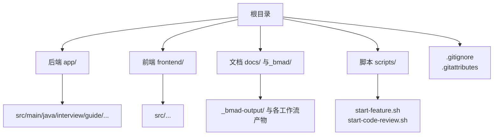
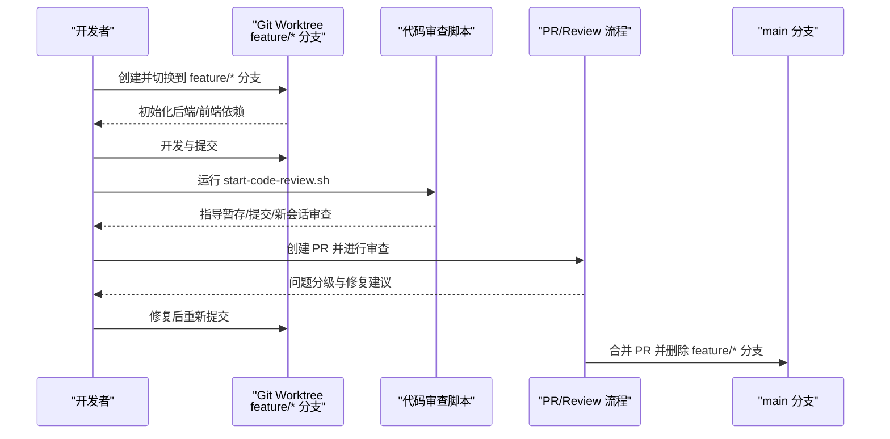
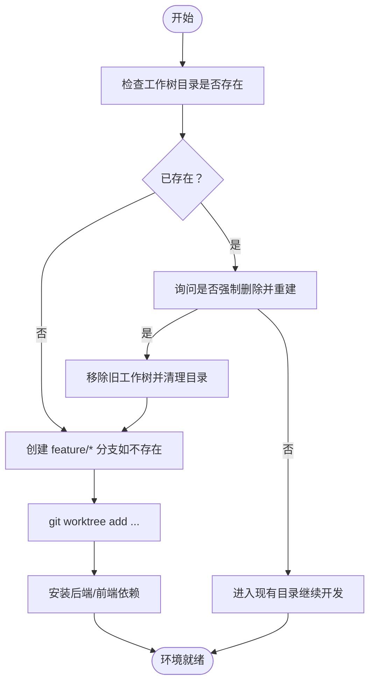
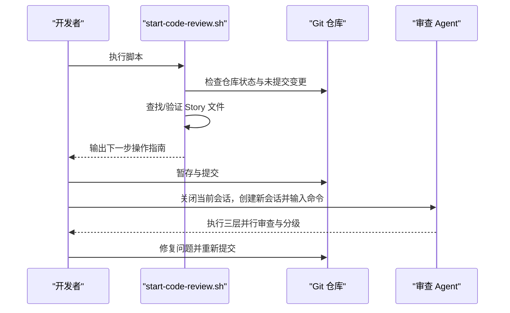
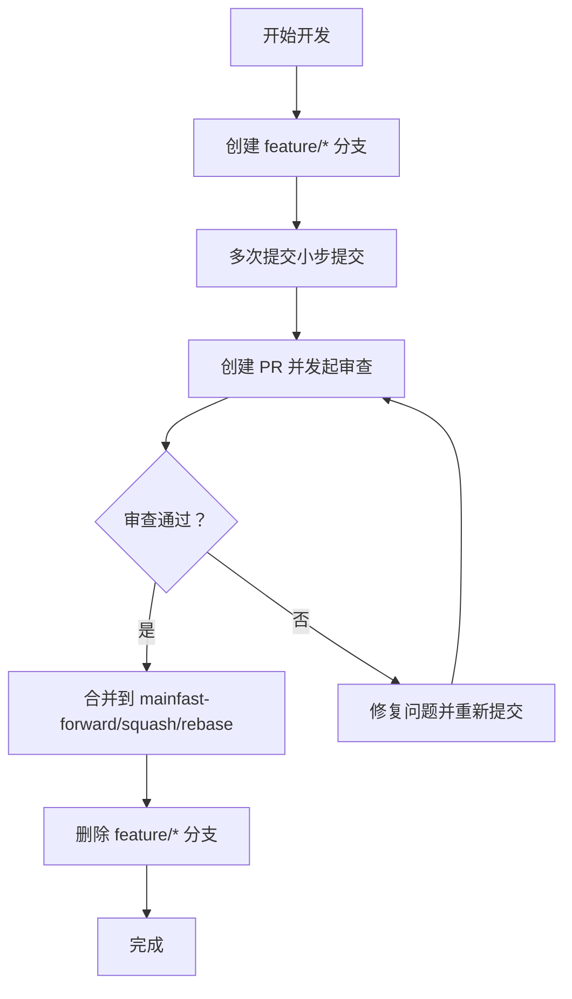
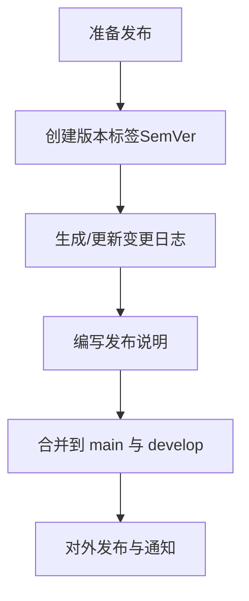
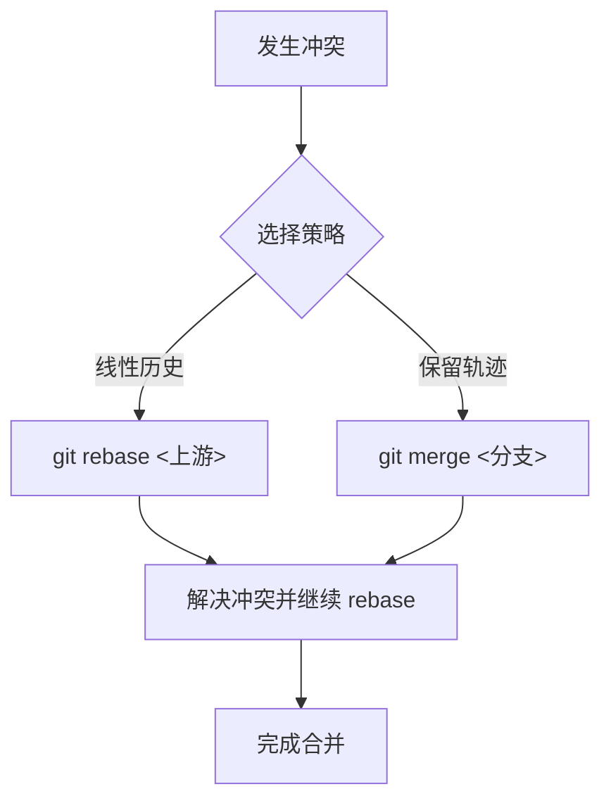
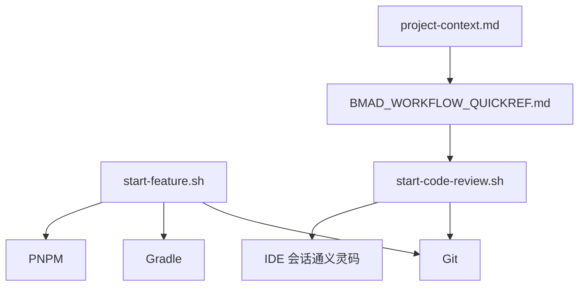

# 版本控制和工作流

<cite>
**本文引用的文件**
- [README.md](file://README.md)
- [.gitignore](file://.gitignore)
- [.gitattributes](file://.gitattributes)
- [scripts/start-feature.sh](file://scripts/start-feature.sh)
- [scripts/start-code-review.sh](file://scripts/start-code-review.sh)
- [_bmad-output/project-context.md](file://_bmad-output/project-context.md)
- [docs/BMAD_WORKFLOW_QUICKREF.md](file://docs/BMAD_WORKFLOW_QUICKREF.md)
- [docs/CODE_REVIEW_GUIDE.md](file://docs/CODE_REVIEW_GUIDE.md)
- [docs/TEAM_ONBOARDING.md](file://docs/TEAM_ONBOARDING.md)
- [docs/VIBE_CODING_HANDBOOK.md](file://docs/VIBE_CODING_HANDBOOK.md)
</cite>

## 目录
1. [引言](#引言)
2. [项目结构](#项目结构)
3. [核心组件](#核心组件)
4. [架构总览](#架构总览)
5. [详细组件分析](#详细组件分析)
6. [依赖关系分析](#依赖关系分析)
7. [性能考量](#性能考量)
8. [故障排查指南](#故障排查指南)
9. [结论](#结论)
10. [附录](#附录)

## 引言
本指南面向面试指南平台的团队与个人开发者，系统阐述版本控制与工作流最佳实践，涵盖分支策略、提交规范、合并流程、Git Worktree 并行开发、代码审查流程、标签与发布管理、冲突解决与历史重写、大型项目治理（子模块、大文件、历史清理）、以及 Git 钩子配置等。文档结合仓库内现有脚本与文档，给出可落地的实施建议与可视化流程。

## 项目结构
仓库采用多模块结构：后端应用、前端应用、文档与工作流技能、BMA D（Business Model Architecture）研究与规划产物、以及若干自动化脚本。版本控制层面，仓库显式忽略构建产物与工作树目录，确保仓库整洁与可移植性。

图表来源
- [README.md: 项目结构:210-247](file://README.md#L210-L247)
- [.gitignore: 忽略构建与工作树:1-11](file://.gitignore#L1-L11)

章节来源
- [README.md: 项目结构:210-247](file://README.md#L210-L247)
- [.gitignore: 忽略规则:1-11](file://.gitignore#L1-L11)

## 核心组件
- 分支与工作流
  - 采用 feature/* 分支与 Git Worktree 并行开发，隔离不同功能的开发环境，减少分支污染与冲突。
  - 项目文档明确分支命名与合并流程，建议遵循“创建分支 → 开发 → 代码审查 → 合并 → 删除分支”的闭环。
- 提交与审查
  - 通过 start-code-review.sh 辅助准备代码审查会话，指导暂存、提交、关闭通义灵码会话、在新会话中启动审查等步骤。
  - 审查范围支持“未提交变更”与“分支 diff”，并提供结构化输出与问题分级。
- 工作树与并行开发
  - start-feature.sh 自动创建 Git Worktree，安装后端/前端依赖，提供隔离的开发环境，便于多人并行或临时分支管理。
- 线路结尾处理
  - .gitattributes 显式设置脚本换行符，避免跨平台差异导致的提交噪音。

章节来源
- [scripts/start-feature.sh: 创建工作树与初始化:1-68](file://scripts/start-feature.sh#L1-L68)
- [scripts/start-code-review.sh: 审查流程引导:1-136](file://scripts/start-code-review.sh#L1-L136)
- [_bmad-output/project-context.md: 分支策略:102-102](file://_bmad-output/project-context.md#L102-L102)
- [docs/BMAD_WORKFLOW_QUICKREF.md: 分支与合并参考:84-84](file://docs/BMAD_WORKFLOW_QUICKREF.md#L84-L84)
- [.gitattributes: 换行符设置:1-10](file://.gitattributes#L1-L10)

## 架构总览
下图展示从功能开发到代码审查再到合并的端到端工作流，强调隔离开发（Git Worktree）、结构化审查与分支管理。

图表来源
- [scripts/start-feature.sh: 创建工作树:32-38](file://scripts/start-feature.sh#L32-L38)
- [scripts/start-code-review.sh: 审查流程:69-130](file://scripts/start-code-review.sh#L69-L130)
- [_bmad-output/project-context.md: 分支策略:102-102](file://_bmad-output/project-context.md#L102-L102)
- [docs/BMAD_WORKFLOW_QUICKREF.md: 分支与合并:84-84](file://docs/BMAD_WORKFLOW_QUICKREF.md#L84-L84)

## 详细组件分析

### 组件A：Git Worktree 并行开发
- 设计目标
  - 通过 Git Worktree 在同一仓库中创建多个隔离工作树，支持多人并行开发、临时分支管理与快速切换。
- 关键流程
  - 自动检测工作树目录是否存在，支持强制重建。
  - 若分支不存在，基于当前 HEAD 创建 feature/* 分支后再创建工作树。
  - 进入工作树后自动安装后端 Gradle 依赖与前端 pnpm 依赖。
- 最佳实践
  - 每个功能一个工作树，开发完成后统一回归 main 并删除工作树与分支。
  - 避免在 main 分支直接修改，始终使用 feature/* 或独立工作树。

图表来源
- [scripts/start-feature.sh: 工作树创建流程:19-51](file://scripts/start-feature.sh#L19-L51)

章节来源
- [scripts/start-feature.sh: 工作树脚本:1-68](file://scripts/start-feature.sh#L1-L68)
- [docs/TEAM_ONBOARDING.md: 建议使用 Git Worktree 或 feature/* 分支:25-25](file://docs/TEAM_ONBOARDING.md#L25-L25)
- [docs/VIBE_CODING_HANDBOOK.md: 分支确认检查:64-64](file://docs/VIBE_CODING_HANDBOOK.md#L64-L64)

### 组件B：代码审查流程
- 设计目标
  - 通过 start-code-review.sh 提供标准化的审查准备与执行指引，支持“未提交变更”与“分支 diff”两种审查范围。
- 关键流程
  - 检查是否在 Git 仓库中、是否有未提交变更。
  - 自动查找最近 Story 文件或由用户提供路径。
  - 指导暂存、提交、关闭当前通义灵码会话并创建新会话。
  - 审查步骤分为三层并行审查（盲审猎人、边界案例猎人、验收审计员），输出结构化报告与问题分级。
  - 提供修复与重新提交的步骤建议。

图表来源
- [scripts/start-code-review.sh: 审查流程:21-130](file://scripts/start-code-review.sh#L21-L130)
- [docs/CODE_REVIEW_GUIDE.md: 审查流程与分级:222-222](file://docs/CODE_REVIEW_GUIDE.md#L222-L222)

章节来源
- [scripts/start-code-review.sh: 审查脚本:1-136](file://scripts/start-code-review.sh#L1-L136)
- [docs/CODE_REVIEW_GUIDE.md: 审查指南:222-222](file://docs/CODE_REVIEW_GUIDE.md#L222-L222)

### 组件C：分支策略与合并流程
- 分支命名
  - feature/<功能名>：用于功能开发，开发完成后合并至 main 并删除。
- 合并策略
  - 建议使用 fast-forward 或 squash 合并，保持主干清晰；复杂变更可考虑 rebase 以获得线性历史。
- 删除策略
  - 合并后立即删除 feature/* 分支，避免分支冗余。

图表来源
- [_bmad-output/project-context.md: 分支策略:102-102](file://_bmad-output/project-context.md#L102-L102)
- [docs/BMAD_WORKFLOW_QUICKREF.md: 分支与合并:84-84](file://docs/BMAD_WORKFLOW_QUICKREF.md#L84-L84)

章节来源
- [_bmad-output/project-context.md: 分支策略:102-102](file://_bmad-output/project-context.md#L102-L102)
- [docs/BMAD_WORKFLOW_QUICKREF.md: 分支与合并:84-84](file://docs/BMAD_WORKFLOW_QUICKREF.md#L84-L84)

### 组件D：标签管理与发布流程
- 版本标记
  - 使用语义化版本（SemVer）进行标记，建议遵循 MAJOR.MINOR.PATCH。
- 变更日志
  - 建议在 PR 合并时维护变更日志，记录新增、修复、破坏性变更与迁移说明。
- 发布说明
  - 发布前生成发布说明，包含关键变更摘要、已知问题与升级指引。
- 合并与回滚
  - 发布分支（如 release/*）合并到 main 与 tag，随后合并回 develop（如使用 GitFlow）。

图表来源
- [docs/BMAD_WORKFLOW_QUICKREF.md: 发布与标签参考:84-84](file://docs/BMAD_WORKFLOW_QUICKREF.md#L84-L84)

章节来源
- [docs/BMAD_WORKFLOW_QUICKREF.md: 发布与标签参考:84-84](file://docs/BMAD_WORKFLOW_QUICKREF.md#L84-L84)

### 组件E：冲突解决与合并策略
- rebase vs merge
  - 线性历史：优先使用 rebase，保持主干整洁。
  - 复杂历史：必要时使用 merge，保留分支演进轨迹。
- 冲突解决工具
  - 使用 IDE 内置合并工具或命令行工具（如 git mergetool）逐行解决冲突。
- 历史重写
  - 仅对未推送的本地提交进行历史重写（如 reword、squash、drop），避免影响他人。

图表来源
- [docs/BMAD_WORKFLOW_QUICKREF.md: 冲突与历史参考:84-84](file://docs/BMAD_WORKFLOW_QUICKREF.md#L84-L84)

章节来源
- [docs/BMAD_WORKFLOW_QUICKREF.md: 冲突与历史参考:84-84](file://docs/BMAD_WORKFLOW_QUICKREF.md#L84-L84)

### 组件F：大型项目治理（子模块、大文件、历史清理）
- 子模块管理
  - 仅在确有需要时使用子模块，避免过度拆分导致维护复杂度上升。
  - 使用 .gitmodules 管理子模块路径与分支，定期同步上游更新。
- 大文件处理
  - 使用 LFS 或外部对象存储，不在仓库中直接提交大文件。
  - 在 .gitignore 中显式忽略大文件与缓存目录。
- 历史清理
  - 使用 git filter-repo 或 git filter-branch 清理敏感信息与大文件历史。
  - 清理前备份分支，清理后强制推送并通知团队成员重新克隆。

章节来源
- [.gitignore: 忽略构建与工作树:1-11](file://.gitignore#L1-L11)

### 组件G：Git 钩子配置（pre-commit、pre-push 等）
- pre-commit
  - 格式化与静态检查：统一代码风格与基础语法检查。
  - 单元测试：在本地快速验证改动。
- pre-push
  - 运行集成测试与安全扫描，避免将不合规变更推送到远程。
- 钩子示例
  - 使用 husky（前端）或 githooks（后端）管理钩子脚本，确保团队一致性。

章节来源
- [README.md: 环境与依赖:251-259](file://README.md#L251-L259)

## 依赖关系分析
- 脚本依赖
  - start-feature.sh 依赖 Git 与 Gradle/PNPM，负责创建工作树与安装依赖。
  - start-code-review.sh 依赖 Git 与通义灵码会话，负责引导审查流程。
- 文档依赖
  - 项目上下文与工作流参考文档共同定义分支策略与审查流程，形成闭环。

图表来源
- [scripts/start-feature.sh: 依赖关系:43-51](file://scripts/start-feature.sh#L43-L51)
- [scripts/start-code-review.sh: 依赖关系:21-32](file://scripts/start-code-review.sh#L21-L32)
- [_bmad-output/project-context.md: 分支策略:102-102](file://_bmad-output/project-context.md#L102-L102)
- [docs/BMAD_WORKFLOW_QUICKREF.md: 工作流参考:84-84](file://docs/BMAD_WORKFLOW_QUICKREF.md#L84-L84)

章节来源
- [scripts/start-feature.sh: 依赖关系:43-51](file://scripts/start-feature.sh#L43-L51)
- [scripts/start-code-review.sh: 依赖关系:21-32](file://scripts/start-code-review.sh#L21-L32)
- [_bmad-output/project-context.md: 分支策略:102-102](file://_bmad-output/project-context.md#L102-L102)
- [docs/BMAD_WORKFLOW_QUICKREF.md: 工作流参考:84-84](file://docs/BMAD_WORKFLOW_QUICKREF.md#L84-L84)

## 性能考量
- 工作树隔离
  - 通过 Git Worktree 避免主工作区污染，减少不必要的文件锁定与编译开销。
- 依赖安装
  - 在工作树中按需安装后端/前端依赖，避免全局依赖冲突。
- 审查效率
  - 使用“未提交变更”审查范围，缩短审查路径；必要时使用分支 diff，聚焦变更范围。

## 故障排查指南
- 工作树目录冲突
  - 现象：工作树目录已存在。
  - 处理：按脚本提示选择强制删除并重建，或直接进入现有目录继续开发。
- 未提交变更
  - 现象：脚本提示无未提交变更。
  - 处理：使用分支 diff 模式进行审查，或先暂存并提交。
- 审查范围不明确
  - 现象：未提供 Story 文件路径。
  - 处理：脚本自动查找最近 Story 文件；也可手动提供路径。
- 线路结尾问题
  - 现象：跨平台换行导致提交噪音。
  - 处理：依据 .gitattributes 设置脚本换行符，避免 LF/CRLF 差异。

章节来源
- [scripts/start-feature.sh: 工作树冲突处理:20-29](file://scripts/start-feature.sh#L20-L29)
- [scripts/start-code-review.sh: 未提交变更与 Story 文件处理:27-61](file://scripts/start-code-review.sh#L27-L61)
- [.gitattributes: 换行符设置:4-9](file://.gitattributes#L4-L9)

## 结论
本指南基于仓库内的脚本与文档，提出了可操作的版本控制与工作流最佳实践：以 Git Worktree 实现隔离开发，以 feature/* 分支与结构化审查保证质量，以 SemVer 与发布说明完善交付流程。配合 .gitignore 与 .gitattributes 的配置，可显著提升协作效率与代码质量。

## 附录
- 快速参考
  - 分支策略与合并：[_bmad-output/project-context.md:102-102](file://_bmad-output/project-context.md#L102-L102)，[docs/BMAD_WORKFLOW_QUICKREF.md:84-84](file://docs/BMAD_WORKFLOW_QUICKREF.md#L84-L84)
  - 审查流程：[scripts/start-code-review.sh:1-136](file://scripts/start-code-review.sh#L1-L136)，[docs/CODE_REVIEW_GUIDE.md:222-222](file://docs/CODE_REVIEW_GUIDE.md#L222-L222)
  - 工作树脚本：[scripts/start-feature.sh:1-68](file://scripts/start-feature.sh#L1-L68)
  - 环境与依赖：[README.md:251-259](file://README.md#L251-L259)
  - 忽略与换行：[.gitignore:1-11](file://.gitignore#L1-L11)，[.gitattributes:1-10](file://.gitattributes#L1-L10)